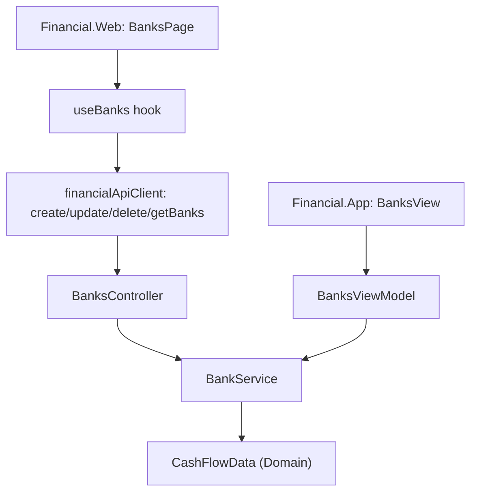

## 1. Technical Overview

**What:** Add full Create/Read/Update/Delete for Bank to the CashFlow bounded context — a new `Bank.Update`
domain mutation, `CashFlowData.RemoveBank`, extended `IBankService`/`BankService`, extended
`BanksController`, and the first CashFlow Admin CRUD screen on both `Financial.Web` (replacing its F01
placeholder route) and `Financial.App` (replacing its F01 placeholder view). Banks today can only be
created via spreadsheet import and only their opening balance is editable through the API.

**Why:** Closes the PRD's pain #1 (no dedicated place to manage reference data) and pain #3 (no safe way
to remove obsolete records) for Bank, and — being the first CashFlow entity in the Admin area — establishes
the reference-guarded-delete pattern (cross-entity "still referenced" 409) that F06-F09 will reuse for
Category, Credit Card, Income Source, and Investment Account.

**Scope:**
- Included: `Bank.Update`; `CashFlowData.RemoveBank`; `ICashFlowRepository.AddBank/DeleteBank`;
  `IBankService.CreateBankAsync/UpdateBankAsync/DeleteBankAsync`; `BankCreateDTO`/`BankUpdateDTO`; a new
  `EntityInUseException` (Application-level, reused by F06-F09) mapped to 409 by
  `DomainExceptionMappingMiddleware`; `BanksController` `POST /banks`, `PUT /banks/{id}`,
  `DELETE /banks/{id}`; OpenAPI snapshot + frontend type regeneration; `Financial.Web` `BanksPage`
  (Fluent `Table` + create/edit `Dialog` + delete-confirm `Dialog`) wired into the existing
  `admin/cashflow/banks` route; `Financial.App` `BanksView` + `BanksViewModel` + `BankFormDialog` wired
  into the existing `admin-banks` viewsByKey slot.
- Excluded: any change to `OpeningBalance`/`OpeningBalanceDate` or the existing balance-adjustment
  endpoints (unchanged, PRD Section 7 out-of-scope); Category/Credit Card/Income Source/Investment
  Account CRUD (F06-F09, though this feature's `EntityInUseException` is deliberately reusable by them).

## 2. Architecture Impact

**Affected components:**
- `Financial.CashFlow.Domain/Entities/Bank.cs` — add `Update(name, roundUpEnabled)`
- `Financial.CashFlow.Domain/Entities/CashFlowData.cs` — add `RemoveBank(Guid id)`
- `Financial.CashFlow.Application/Exceptions/EntityInUseException.cs` — new, reusable across F05-F09
- `Financial.CashFlow.Application/DTOs/BankCreateDTO.cs`, `BankUpdateDTO.cs` — new
- `Financial.CashFlow.Application/Interfaces/ICashFlowRepository.cs` — add `AddBank`, `DeleteBank`
- `Financial.CashFlow.Application/Interfaces/IBankService.cs` — add `CreateBankAsync`, `UpdateBankAsync`, `DeleteBankAsync`
- `Financial.CashFlow.Application/Services/BankService.cs` — implement the three new methods
- `Financial.CashFlow.Infrastructure/Repositories/CashFlowJsonRepository.cs` — implement `AddBank`, `DeleteBank`
- `Financial.Api/Controllers/BanksController.cs` — add `POST /banks`, `PUT /banks/{id}`, `DELETE /banks/{id}`
- `Financial.Api/Middleware/DomainExceptionMappingMiddleware.cs` — map `EntityInUseException` to 409
- `Tests/Financial.Api.Tests/Contract/openapi-v1.snapshot.json` — regenerated
- `Financial.Web/src/api/generated/openapi.ts`, `src/api/types.ts` — regenerated/extended
- `Financial.Web/src/api/financialApiClient.ts` — add `createBank`/`updateBank`/`deleteBank`
- `Financial.Web/src/hooks/useBanks.ts` — new
- `Financial.Web/src/pages/BanksPage.tsx`, `src/components/BankFormDialog.tsx` — new
- `Financial.Web/src/navigation/routes.tsx` — repoint the `admin/cashflow/banks` route element
- `Financial.App/ViewModels/Admin/BanksViewModel.cs`, `BankFormDialogViewModel.cs` — new
- `Financial.App/Views/Admin/BanksView.xaml(.cs)`, `BankFormDialog.xaml(.cs)` — new
- `Financial.App/Services/IDialogService.cs`, `DialogService.cs` — add `ShowBankFormDialog`
- `Financial.App/MainWindow.xaml.cs` — replace the `admin-banks` placeholder registration with `BanksView`



## 3. Technical Decisions

| Decision | Chosen Approach | Alternative Considered | Trade-off |
|----------|----------------|----------------------|-----------|
| Where uniqueness/reference-guard logic lives | In `BankService` (Application layer), querying the repository directly | On `CashFlowData` as aggregate-root business methods, mirroring `Investments.CreateActiveBroker` | `CashFlowData` today only exposes dumb Add/Remove primitives (unlike `Investments`); the reference guard itself must inspect `Income`/`Expense`/`Transfer`/`BalanceAdjustment`, none of which `Bank` or `CashFlowData` can see any relationship-specific meaning in beyond a raw list scan — the same shape `BankService.ComputeBalance` already uses. Keeping it in the service avoids inventing a false aggregate-root capability CashFlow doesn't otherwise have, matching `MensaisService`'s existing convention of validating in the Application layer |
| New exceptions for the two distinct 409 conflict shapes | Two generic `Financial.CashFlow.Application.Exceptions` types, each mapped once to 409 in the middleware and reused across F05-F11: `DuplicateNameException` (create/rename name collision) and `EntityInUseException` (delete blocked by a live reference elsewhere) | A single combined exception type for both cases (mirroring Investment's single `InvestmentRuleViolationException`) | The two conflicts are semantically distinct client-facing claims (`already exists` vs. `still referenced elsewhere`), and not every future entity needs both (Reserve Bucket, F11, never hard-deletes so never needs `EntityInUseException`). Two small, self-documenting types are cheap and avoid overloading one exception's meaning across F05-F11 |
| Bank reference scan scope | Zero `BalanceAdjustment.Bank.Id`, zero `Income.Bank?.Id`, zero `Expense.PaymentSourceBank?.Id`, zero `Transfer.SourceBank.Id`/`DestinationBank.Id` matches — the same four collections `BankService.ComputeBalance` already scans | Only check `BalanceAdjustment`/`Expense`/`Income` (the PRD's own wording: "balance-adjustment records or referencing transactions") | `Transfer` moves money between two Banks and is exactly as much a "referencing transaction" as `Expense`/`Income`; omitting it would let a delete silently orphan a `Transfer.SourceBank`/`DestinationBank` reference. Documented as an assumption — the PRD's Section 6 wording for F05 doesn't explicitly mention Transfer |
| Create/Update HTTP success status | `200 OK`, matching this controller's existing `UpdateOpeningBalance`/`AddAdjustment` endpoints | `204 No Content` for delete, matching Investment's `BrokersController` | CashFlow's own `MensaisController`/`BanksController` convention already returns `200 OK` with the body (or no body) rather than `204`; per F02's spec.md decision, CashFlow's new delete endpoints should follow their own context's convention, not Investment's — `DELETE /banks/{id}` returns `200 OK` |
| Route shape for the two new mutating endpoints | `POST /banks` (create), `PUT /banks/{id}` (rename/round-up), `DELETE /banks/{id}` — id-addressed, matching every other `BanksController` route (`{id:guid}/opening-balance`, `{id:guid}/adjustments`) | Name-addressed routes, matching `BrokersController` (`/brokers/{name}`) | `Bank` already has a stable `Guid Id` used by every existing `BanksController` route; Investment's `Broker`/`Portfolio` have no id at all and are name-addressed for that reason, which doesn't apply here |
| React list/dialog structure | `BanksPage.tsx` (Fluent `Table`, "Create Bank" primary action) + `BankFormDialog.tsx` (Name + RoundUpEnabled toggle, shared create/edit) + inline delete-confirm `Dialog` in `BanksPage.tsx` | A generic `EntityCrudPage<T>` abstraction | Same reasoning as F02/F03/F04: no second CashFlow entity has been built yet to prove out a shared abstraction; F06-F09 copy this shape, a generic can be extracted later if duplication actually hurts |
| WPF form dialog | `ShowBankFormDialog(BankFormDialogViewModel) : bool` on `IDialogService`, following `ShowBrokerFormDialog`'s exact shape | A generic WPF dialog-result service | Matches the established, tested pattern from F02 |

## 4. Component Overview

**Backend (CashFlow bounded context):**

| File Path | New/Modified | Purpose | Key Responsibilities |
|-----------|--------------|---------|---------------------|
| `Financial.CashFlow.Domain/Entities/Bank.cs` | Modified | Domain entity | `Update(name, roundUpEnabled)` validates non-blank name, mutates both fields in place |
| `Financial.CashFlow.Domain/Entities/CashFlowData.cs` | Modified | Data root | `RemoveBank(Guid id)` — `_banks.RemoveAll(b => b.Id == id)`, mirroring `RemoveRecurringBill`'s shape |
| `Financial.CashFlow.Application/Exceptions/EntityInUseException.cs` | New | Domain-adjacent exception | Thrown by any Application service refusing a delete due to a live reference elsewhere |
| `Financial.CashFlow.Application/DTOs/BankCreateDTO.cs` | New | Create request | `Name`, `RoundUpEnabled` |
| `Financial.CashFlow.Application/DTOs/BankUpdateDTO.cs` | New | Update request | `Name`, `RoundUpEnabled` (new values) |
| `Financial.CashFlow.Application/Interfaces/ICashFlowRepository.cs` | Modified | Contract | `AddBank(Bank bank)`, `DeleteBank(Guid id)` |
| `Financial.CashFlow.Application/Interfaces/IBankService.cs` | Modified | Contract | `CreateBankAsync`, `UpdateBankAsync`, `DeleteBankAsync` |
| `Financial.CashFlow.Application/Services/BankService.cs` | Modified | Use-case orchestration | Guards required Name, uniqueness (create/update), reference scan (delete) across Income/Expense/Transfer/BalanceAdjustment, calls repository mutations inside `ApplyAndSaveAsync`, maps to `BankDTO`, `StartServiceSpan`/`MarkSuccess`/`MarkFailed` tracing |
| `Financial.CashFlow.Infrastructure/Repositories/CashFlowJsonRepository.cs` | Modified | Repository impl | `AddBank` → `_data.AddBank`; `DeleteBank` → `_data.RemoveBank` |
| `Financial.Api/Controllers/BanksController.cs` | Modified | REST endpoints | `POST /banks`, `PUT /banks/{id}`, `DELETE /banks/{id}` |
| `Financial.Api/Middleware/DomainExceptionMappingMiddleware.cs` | Modified | Exception→status mapping | `catch (EntityInUseException ex) => 409` |

**Frontend (`Financial.Web`):**

| File Path | New/Modified | Purpose | Key Responsibilities |
|-----------|--------------|---------|---------------------|
| `src/api/financialApiClient.ts` | Modified | API client | `createBank`, `updateBank`, `deleteBank` |
| `src/hooks/useBanks.ts` | New | Data + mutation hook | Loads banks, exposes create/update/delete with loading/error/saving state per ADR-driven state matrix |
| `src/components/BankFormDialog.tsx` | New | Create/Edit dialog | Name + RoundUpEnabled toggle, inline validation, disabled Save while invalid/saving |
| `src/pages/BanksPage.tsx` | New | Admin > CashFlow > Banks screen | Fluent `Table` (Name, RoundUpEnabled, current balance), row actions, "Create Bank", delete-confirm `Dialog` with disabled-when-referenced state |
| `src/navigation/routes.tsx` | Modified | Routing | `admin/cashflow/banks` now renders `BanksPage` instead of `AdminEntityPlaceholderPage` |

**WPF (`Financial.App`):**

| File Path | New/Modified | Purpose | Key Responsibilities |
|-----------|--------------|---------|---------------------|
| `ViewModels/Admin/BanksViewModel.cs` | New | List + commands | Loads banks via `IBankService`, `CreateCommand`/`EditCommand`/`DeleteCommand`, delete-confirm via `IDialogService.Confirm` |
| `ViewModels/Admin/BankFormDialogViewModel.cs` | New | Create/Edit form state | Name/RoundUpEnabled fields, `ValidationMessage`, `ConfirmCommand`/`CancelCommand`, `CloseRequested`, mirrors `BrokerFormDialogViewModel`'s shape |
| `Views/Admin/BanksView.xaml(.cs)` | New | List view | Fluent-styled list bound to `BanksViewModel` |
| `Views/Admin/BankFormDialog.xaml(.cs)` | New | Modal form | Bound to `BankFormDialogViewModel`, shown via `IDialogService` |
| `Services/IDialogService.cs`, `DialogService.cs` | Modified | Dialog abstraction | Add `ShowBankFormDialog(BankFormDialogViewModel) : bool` |
| `MainWindow.xaml.cs` | Modified | Composition root | Replace the `admin-banks` `AdminEntityPlaceholderView` registration with a real `BanksView` + `BanksViewModel` |

**Database:** Not applicable — same single JSON-document persistence model; no schema/migration change,
`Bank` is serialized as part of the existing `data-cashflow.json` document with no new fields.

## 5. API Contracts

**Endpoint: Create Bank**
- **Method:** POST
- **Path:** `/banks`

**Request:**

| Field | Type | Required | Validation | Description |
|-------|------|----------|------------|--------------|
| `name` | `string` | Yes | non-blank, unique | Bank name |
| `roundUpEnabled` | `boolean` | Yes | — | Round-up setting |

```json
{ "name": "Nubank", "roundUpEnabled": true }
```

**Response (200):** `BankDTO` (`Id`, `Name`, `RoundUpEnabled`, `OpeningBalance: 0`, `OpeningBalanceDate: 0001-01-01`).

**Error Codes:**

| Code | HTTP Status | Description |
|------|-------------|--------------|
| — | 400 | `name` missing or blank |
| — | 409 | `A bank named "{name}" already exists.` |

**Endpoint: Update Bank**
- **Method:** PUT
- **Path:** `/banks/{id}`

**Request:** `{ "name": "string", "roundUpEnabled": boolean }` — new values.

**Response (200):** `BankDTO`.

**Error Codes:**

| Code | HTTP Status | Description |
|------|-------------|--------------|
| — | 400 | `name` missing or blank |
| — | 404 | Bank `{id}` not found |
| — | 409 | New name collides with a different existing bank |

**Endpoint: Delete Bank**
- **Method:** DELETE
- **Path:** `/banks/{id}`

**Response:** `200 OK` on success.

**Error Codes:**

| Code | HTTP Status | Description |
|------|-------------|--------------|
| — | 404 | Bank `{id}` not found |
| — | 409 | `Cannot delete a bank that still has balance history or transactions.` |

## 6. Data Model

Not applicable — no relational schema. `Bank` is serialized as part of the existing single-document
`data-cashflow.json` via `Financial.CashFlow.Infrastructure` JSON persistence; no new fields are added
to the wire format beyond what `Bank` already has (`Id`, `Name`, `RoundUpEnabled`, `OpeningBalance`,
`OpeningBalanceDate`).

## 7. Testing Strategy

**Test File Structure:**

| Test File | Test Type | Target | Coverage Goal |
|-----------|-----------|--------|---------------|
| `Tests/Financial.CashFlow.Domain.Tests/Entities/BankTests.cs` | Unit | `Bank.Update` | Extended with new `[Fact]`s |
| `Tests/Financial.CashFlow.Domain.Tests/Entities/CashFlowDataTests.cs` (or nearest equivalent) | Unit | `CashFlowData.RemoveBank` | New/extended `[Fact]`s |
| `Tests/Financial.CashFlow.Application.Tests/Services/BankServiceTests.cs` | Unit | `BankService` (via `StubCashFlowRepository`) | Extended — create/update/delete, every guard branch |
| `Tests/Financial.Api.Tests/BanksEndpointsTests.cs` | E2E (`ApiTestFactory`) | `BanksController` | Extended — new endpoints' status codes, validation, JSON contract |
| `Tests/Financial.Api.Tests/Controllers/ControllerGuardClauseTests.cs` | Unit | `BanksController` constructor | No change expected — constructor unchanged |
| `Financial.Web/src/hooks/__tests__/useBanks.test.ts` | Hook | `useBanks` | New — load/create/update/delete, loading/error states |
| `Financial.Web/src/pages/__tests__/BanksPage.test.tsx` | Component | `BanksPage` | New — list render, create/edit/delete flows, disabled-delete-when-referenced, all documented UI states |
| `Financial.Web/src/components/__tests__/BankFormDialog.test.tsx` | Component | `BankFormDialog` | New — validation, disabled Save while invalid/saving |
| `Financial.Web/src/navigation/__tests__/routes.test.ts` | Unit | Route sync | No change expected — route path unchanged, only its element |
| `Tests/Financial.Presentation.Tests/ViewModels/Admin/BanksViewModelTests.cs` | Unit | `BanksViewModel` (hand-written stub `IBankService`) | New |
| `Tests/Financial.Presentation.Tests/ViewModels/Admin/BankFormDialogViewModelTests.cs` | Unit | `BankFormDialogViewModel` | New — validation branches, `ConfirmCommand` gating |

**For each test file, key functions:**

| Test Function | Description | Assertions |
|---------------|--------------|------------|
| `CreateBankAsync_DuplicateName_Throws` | Uniqueness | `EntityInUseException` is NOT thrown here — duplicate name is a separate `409` path via a name-collision check, not the reference guard; assert the correct message/exception type |
| `DeleteBankAsync_ReferencedByBalanceAdjustment_ThrowsEntityInUseException` | Reference guard | `EntityInUseException`, `WriteCallCount` unchanged |
| `DeleteBankAsync_ReferencedByTransfer_ThrowsEntityInUseException` | Reference guard (documented assumption) | `EntityInUseException` |
| `DeleteBankAsync_NoReferences_Succeeds` | Happy path | Bank removed from repository |
| `CreateBank_Duplicate_Returns409ViaMiddleware` (E2E) | HTTP contract | 409, `ProblemDetails.Detail` matches PRD wording |
| `it('disables the delete action when the bank has balance history')` | React | Delete button `disabled`, inline explanation text shown |

## 8a. Post-implementation addendum

`BankDTO` gained a `HasReferences: bool` field (computed by `BankService` via the same four-collection
scan as the delete guard) not called out in the original Component Overview above. Without it, the
client had no signal to preemptively disable Delete/explain why — the PRD's F05 Experience section
explicitly requires "disabled with an inline explanation... when references exist," matching F02/F03/F04's
disabled-before-attempt UX, and no lightweight existing field could stand in for it. `BankService.ToDto`
became an instance method (was `static`) so it can read `_repository` for this check.

## 8. Assumptions (auto-accepted per this feature-loop's batch policy)

- Delete's reference scan additionally covers `Transfer` (Section 3 above) even though the PRD's F05
  wording only names "balance-adjustment records or referencing transactions" — Transfer is treated as
  a referencing transaction.
- Bank Name uniqueness is case-sensitive exact match, matching `Broker`'s F02 precedent (no case-fold
  rule specified by the PRD for either entity).
- `EntityInUseException` is introduced generically now (not `BankInUseException`) since F06-F08 need the
  identical shape; this is a forward-looking naming decision, not scope creep — no F06-F09 behavior is
  implemented here.
