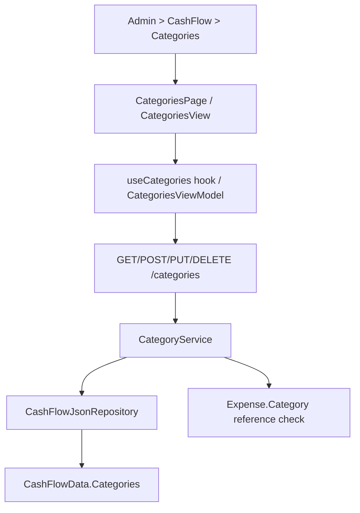

## 1. Technical Overview

**What:** Extend `Category` (CashFlow bounded context) from read-only to full CRUD — create, edit all four fields, and delete guarded by a reference check — exposed through the Admin > CashFlow > Categories screen on both Web and WPF.

**Why:** `Category` currently has only `Create` (used at seed/import time) and a read-only `GET /categories` endpoint. F06 needs `Update` and a guarded `Delete` on the domain entity, an `Application` service extended from list-only to full CRUD, new API endpoints, and new Admin screens on both front ends — the same shape F02 (Broker), F03 (Portfolio), F05 (Bank) already established for their respective entities.

**Scope:**
- Included: `Category.Update` domain method; `CashFlowData.RemoveCategory`; `ICashFlowRepository.AddCategory`/`DeleteCategory`; `ICategoryService`/`CategoryService` extended with Create/Update/Delete; `CategoryCreateDTO`/`CategoryUpdateDTO`; `CategoriesController` extended with POST/PUT/DELETE; OpenAPI snapshot + generated frontend types; Web `CategoriesPage`/`CategoryFormDialog`/`useCategories`; WPF `CategoriesView`/`CategoryFormDialogView` + matching ViewModels; nav/route wiring on both platforms (Admin > CashFlow > Categories, replacing the F01 placeholder).
- Excluded: bulk edit, category reordering/hierarchy, anything about `IncomeSource`'s own "Group" concept (unrelated entity).

## 2. Architecture Impact

**Affected components:**
- `Financial.CashFlow.Domain/Entities/Category.cs` — add `Update`.
- `Financial.CashFlow.Domain/Entities/CashFlowData.cs` — add `RemoveCategory`.
- `Financial.CashFlow.Application/Interfaces/ICashFlowRepository.cs` — add `AddCategory`, `DeleteCategory`.
- `Financial.CashFlow.Infrastructure/Repositories/CashFlowJsonRepository.cs` — implement the two new repository members.
- `Financial.CashFlow.Application/Interfaces/ICategoryService.cs`, `Services/CategoryService.cs` — add `CreateCategoryAsync`, `UpdateCategoryAsync`, `DeleteCategoryAsync`.
- `Financial.CashFlow.Application/DTOs/CategoryDTO.cs` (add `HasReferences`), new `CategoryCreateDTO.cs`, `CategoryUpdateDTO.cs`.
- `Financial.Api/Controllers/CategoriesController.cs` — add POST/PUT/DELETE.
- `Tests/Financial.Api.Tests/Contract/openapi-v1.snapshot.json` — regenerated.
- `Financial.Web/src/api/generated/openapi.ts`, `src/api/types.ts` — regenerated/extended.
- New: `Financial.Web/src/pages/CategoriesPage.tsx` + `.css`, `src/components/CategoryFormDialog.tsx`, `src/hooks/useCategories.ts`, plus their `__tests__`.
- `Financial.Web/src/navigation/lazyPages.tsx`, `routes.tsx` — point the Categories leaf at the new page instead of `AdminEntityPlaceholderPage`.
- New: `Financial.App/ViewModels/Admin/CategoriesViewModel.cs`, `CategoryFormDialogViewModel.cs`, `Financial.App/Views/Admin/CategoriesView.xaml(.cs)`, `CategoryFormDialog.xaml(.cs)`.
- `Financial.App/MainWindow.xaml.cs` — register `CategoriesView` in `viewsByKey` in place of the placeholder.

## 3. Technical Decisions

| Decision | Chosen Approach | Alternative Considered | Trade-off |
|---|---|---|---|
| Delete-guard reference scope | Only `Expense.Category` is scanned (per PRD: "no longer has any transaction referencing it") | Also scanning a hypothetical `Income.Category` | `Income` has no `Category` field in this codebase today — scanning a non-existent relationship would be dead code; if a future feature adds one, `IsReferenced` gets a second clause then, same as `BankService.IsReferenced`'s multi-source scan |
| `HasReferences` computed on read | Add `HasReferences` to `CategoryDTO`, computed the same way `BankService.IsReferenced` is, so the client can disable Delete pre-emptively | Client discovers only via a failed 409 | Matches the established `BankDTO.HasReferences` precedent (F05); consistent UX across Admin screens |
| Uniqueness scope | `Name` unique across all categories (case-sensitive ordinal, matching `Bank`/`Broker`) | Case-insensitive | No existing precedent enforces case-insensitive uniqueness in this codebase; ordinal matches `BankService.EnsureNameIsUnique` |

## 4. Component Overview

**Frontend (Web):**

| File Path | New/Modified | Purpose | Key Responsibilities |
|---|---|---|---|
| `Financial.Web/src/pages/CategoriesPage.tsx` | New | List + create/edit/delete screen | Fluent `Table`, Active filter, "Create Category" action, wires dialog + delete confirm |
| `Financial.Web/src/pages/CategoriesPage.css` | New | Page layout | Mirrors `BanksPage.css` |
| `Financial.Web/src/components/CategoryFormDialog.tsx` | New | Create/Edit dialog | Name field + 3 toggles (Active/IsInvestment/IsTithe), inline duplicate-name error |
| `Financial.Web/src/hooks/useCategories.ts` | New | Data hook | list/create/update/delete against `/categories`, loading/error/saving states |
| `Financial.Web/src/navigation/lazyPages.tsx`, `routes.tsx` | Modified | Route wiring | Replace `AdminEntityPlaceholderPage` for the Categories leaf |

**Frontend (WPF):**

| File Path | New/Modified | Purpose | Key Responsibilities |
|---|---|---|---|
| `Financial.App/ViewModels/Admin/CategoriesViewModel.cs` | New | List VM | Same shape as `BanksViewModel` |
| `Financial.App/ViewModels/Admin/CategoryFormDialogViewModel.cs` | New | Form VM | Same shape as `BankFormDialogViewModel` |
| `Financial.App/Views/Admin/CategoriesView.xaml(.cs)` | New | List view | Mirrors `BanksView` |
| `Financial.App/Views/Admin/CategoryFormDialog.xaml(.cs)` | New | Form dialog | Mirrors `BankFormDialog` |
| `Financial.App/MainWindow.xaml.cs` | Modified | View registration | Register `CategoriesView` for the Categories nav key |

**Backend:**

| File Path | New/Modified | Purpose | Key Responsibilities |
|---|---|---|---|
| `Financial.CashFlow.Domain/Entities/Category.cs` | Modified | Add `Update(name, active, isInvestment, isTithe)` |
| `Financial.CashFlow.Domain/Entities/CashFlowData.cs` | Modified | Add `RemoveCategory(Guid id)` |
| `Financial.CashFlow.Application/Interfaces/ICashFlowRepository.cs` | Modified | Add `AddCategory`, `DeleteCategory` |
| `Financial.CashFlow.Infrastructure/Repositories/CashFlowJsonRepository.cs` | Modified | Implement the two additions |
| `Financial.CashFlow.Application/DTOs/CategoryCreateDTO.cs` | New | `Name`, `Active`, `IsInvestment`, `IsTithe` |
| `Financial.CashFlow.Application/DTOs/CategoryUpdateDTO.cs` | New | Same shape as Create |
| `Financial.CashFlow.Application/DTOs/CategoryDTO.cs` | Modified | Add `HasReferences` |
| `Financial.CashFlow.Application/Interfaces/ICategoryService.cs`, `Services/CategoryService.cs` | Modified | `CreateCategoryAsync`, `UpdateCategoryAsync`, `DeleteCategoryAsync`, `EnsureNameIsUnique`, `IsReferenced` |
| `Financial.Api/Controllers/CategoriesController.cs` | Modified | `POST /categories`, `PUT /categories/{id}`, `DELETE /categories/{id}` |

## 5. API Contracts

**Endpoint: Create Category**
- **Method:** POST
- **Path:** `/categories`

Request: `{ "name": "Groceries", "active": true, "isInvestment": false, "isTithe": false }`
Response (200): `CategoryDTO` — `{ "id", "name", "active", "isInvestment", "isTithe", "hasReferences": false }`
Errors: 400 blank name; 400 (`DuplicateNameException`) duplicate name.

**Endpoint: Update Category**
- **Method:** PUT
- **Path:** `/categories/{id}`

Request/Response: same shape as Create.
Errors: 400 blank/duplicate name; 404 unknown id.

**Endpoint: Delete Category**
- **Method:** DELETE
- **Path:** `/categories/{id}`

Response: 200 OK.
Errors: 404 unknown id; 409 (`EntityInUseException`) — "Cannot delete a category that is still used by a transaction."

Follows the exact response/error-mapping convention `BanksController`/`BankService` already established (`DuplicateNameException` → 400, `KeyNotFoundException` → 404, `EntityInUseException` → 409, mapped by the existing global exception middleware — no new mapping needed).

## 6. Data Model

No schema/migration — `Category` already exists in `data-cashflow.json` under `categories`; only the JSON shape of each record grows (still just `Id`/`Name`/`Active`/`IsInvestment`/`IsTithe`, unchanged — `Update` doesn't add fields).

## 7. Testing Strategy

| Test File | Type | Target |
|---|---|---|
| `Tests/Financial.CashFlow.Domain.Tests/Entities/CategoryTests.cs` | Unit | `Category.Update` — persists all four fields, rejects blank name |
| `Tests/Financial.CashFlow.Domain.Tests/Entities/CashFlowDataTests.cs` | Unit | `RemoveCategory` |
| `Tests/Financial.CashFlow.Application.Tests/Services/CategoryServiceTests.cs` | Unit | Create/Update/Delete success + duplicate-name + not-found + reference-guard paths, `HasReferences` true when an `Expense` references the category |
| `Tests/Financial.Api.Tests/CategoriesEndpointsTests.cs` (new, mirrors `BanksEndpointsTests.cs`) | Integration | Full HTTP round-trip for POST/PUT/DELETE incl. 400/404/409 |
| `Financial.Web/src/hooks/__tests__/useCategories.test.ts` | Unit | hook CRUD + error states |
| `Financial.Web/src/components/__tests__/CategoryFormDialog.test.tsx` | Unit | validation, toggle states, submit |
| `Financial.Web/src/pages/__tests__/CategoriesPage.test.tsx` | Unit | list render, filter, delete-blocked state |
| `Tests/Financial.Presentation.Tests/ViewModels/Admin/CategoriesViewModelTests.cs`, `CategoryFormDialogViewModelTests.cs` | Unit | WPF VM parity with the Web hook/dialog behavior |
| Cross-feature E2E (`Tests/Financial.Api.Tests`) | Integration | Creating an `Expense` referencing a `Category` blocks that category's delete with 409; deleting the `Expense` (or one with no `Category` reference) allows it |

## Assumptions (auto-accepted, no interview)

- Uniqueness and delete-guard mechanics mirror `BankService` exactly (documented above under Technical Decisions) — the PRD specifies the *rule*, not the *mechanism*, and `Bank`/`Broker` are the established precedent for this codebase.
- `Category.Create`'s existing signature/defaults (`isInvestment`, `isTithe`, `isActive` optional, defaulting false/false/true) is preserved; `CategoryCreateDTO` requires all three explicitly since PRD Capabilities says "Create adds a new Category with all four fields set at creation."
- No PRD Cross-Feature Integration bullet in Section 9 names F06 specifically — the only relevant cross-feature note is F06 itself (Category referenced by Expense), covered as an in-feature acceptance criterion, not a Section 9 Cross-Feature Integration item.
