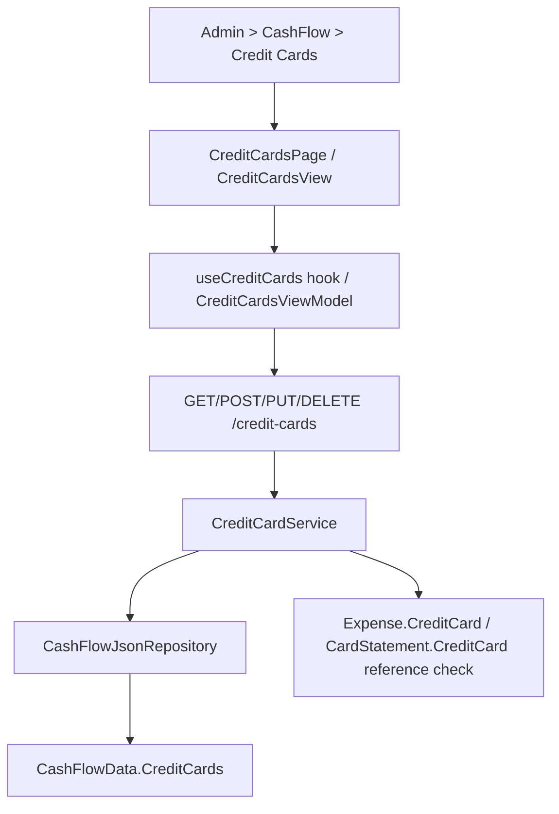

## 1. Technical Overview

**What:** Extend `CreditCard` (CashFlow bounded context) from read-plus-partial-update to full CRUD — create, edit every field including the previously-immutable `Name`, and a guarded delete — exposed through the Admin > CashFlow > Credit Cards screen on both Web and WPF.

**Why:** `CreditCard` today has only `GetCreditCards` and an `UpdateCreditCard` endpoint that accepts `NextInvoiceDueDate`/`IsActive` but treats `Name` as immutable, and no `Create`/`Delete` exist at all — cards can only come into existence through the seed/import path. F07 needs `Create`/full `Update`/guarded `Delete` on the domain entity, the repository pair (`AddCreditCard`/`DeleteCreditCard`), an `Application` service extended accordingly, new DTOs, extended API endpoints, and new Admin screens on both front ends — the same shape F02 (Broker), F05 (Bank), F06 (Category) already established.

**Scope:**
- Included: `CreditCard.Update` (renamed/extended to include `Name`); `CashFlowData.RemoveCreditCard`; `ICashFlowRepository.AddCreditCard`/`DeleteCreditCard`; `ICreditCardService`/`CreditCardService` extended with Create/Delete and a full Update; `CreditCardCreateDTO`, `CreditCardUpdateDTO` extended with `Name`; `CreditCardDTO` extended with `HasReferences`; `CreditCardsController` extended with POST/DELETE and a revised PUT; OpenAPI snapshot + generated frontend types; Web `CreditCardsPage`/`CreditCardFormDialog`/`useCreditCards`; WPF `CreditCardsView`/`CreditCardFormDialogView` + matching ViewModels under the `Admin` folder (distinct from the existing `Views/CashFlow/CardsGridView` + `CardsWorkflowViewModel`, which keep editing due-date/active inline from the Monthly page); nav/route wiring on both platforms (Admin > CashFlow > Credit Cards, replacing the F01 placeholder); updating the two existing due-date/active-only call sites (`CardsGrid.tsx`, `CardsWorkflowViewModel.cs`) to pass the now-required `Name` field through to `CreditCardUpdateDTO`.
- Excluded: any change to the existing Monthly-page card-management workflow's UX (`CardsGridView`/`CardsGrid.tsx` inline due-date/active editing stays exactly as it is today — only its DTO payload gains a `Name` field it already has available); statement/expense CRUD; anything about `CardStatement` beyond reading it for the delete-reference check.

## 2. Architecture Impact

**Affected components:**
- `Financial.CashFlow.Domain/Entities/CreditCard.cs` — rename `UpdateDetails(nextInvoiceDueDate, isActive)` to `Update(name, isActive, nextInvoiceDueDate)`, adding the blank-name guard already used by `Create`.
- `Financial.CashFlow.Domain/Entities/CashFlowData.cs` — add `RemoveCreditCard(Guid id)`.
- `Financial.CashFlow.Application/Interfaces/ICashFlowRepository.cs` — add `AddCreditCard`, `DeleteCreditCard`.
- `Financial.CashFlow.Infrastructure/Repositories/CashFlowJsonRepository.cs` — implement the two new repository members.
- `Financial.CashFlow.Application/Interfaces/ICreditCardService.cs`, `Services/CreditCardService.cs` — add `CreateCreditCardAsync`, `DeleteCreditCardAsync`; extend `UpdateCreditCardAsync` to take `Name`.
- `Financial.CashFlow.Application/DTOs/CreditCardDTO.cs` (add `HasReferences`), new `CreditCardCreateDTO.cs`, `CreditCardUpdateDTO.cs` extended with `Name`.
- `Financial.Api/Controllers/CreditCardsController.cs` — add POST/DELETE, extend PUT's XML doc/behavior.
- `Tests/Financial.Api.Tests/Contract/openapi-v1.snapshot.json` — regenerated.
- `Financial.Web/src/api/generated/openapi.ts`, `src/api/types.ts` — regenerated/extended.
- `Financial.Web/src/components/CardsGrid.tsx` — pass `card.name` through the existing due-date/active update calls now that `CreditCardUpdateDto.name` is required.
- New: `Financial.Web/src/pages/CreditCardsPage.tsx` + `.css`, `src/components/CreditCardFormDialog.tsx`, `src/hooks/useCreditCards.ts`, plus their `__tests__`.
- `Financial.Web/src/navigation/lazyPages.tsx`, `routes.tsx` — point the Credit Cards leaf at the new page instead of `AdminEntityPlaceholderPage`.
- `Financial.App/ViewModels/CashFlow/CardsWorkflowViewModel.cs` — pass `card.Name` through its existing `UpdateCreditCardAsync` call.
- New: `Financial.App/ViewModels/Admin/CreditCardsViewModel.cs`, `CreditCardFormDialogViewModel.cs`, `Financial.App/Views/Admin/CreditCardsView.xaml(.cs)`, `CreditCardFormDialog.xaml(.cs)`.
- `Financial.App/MainWindow.xaml.cs` — register `CreditCardsView` in `viewsByKey` in place of the placeholder.

## 3. Technical Decisions

| Decision | Chosen Approach | Alternative Considered | Trade-off |
|---|---|---|---|
| Delete-guard reference scope | Scan `Expense.CreditCard` and `CardStatement.CreditCard` (per PRD: "no longer has any statement or expense referencing it") | Scanning only `CardStatement` (statements aggregate expenses) | An `Expense` can reference a `CreditCard` directly (`ExpensePaymentStatus.CreditCardCharge`/`CreditCardSettled`) even before a `CardStatement` exists for the period, so both collections must be scanned independently, mirroring `BankService.IsReferenced`'s multi-source scan |
| `HasReferences` computed on read | Add `HasReferences` to `CreditCardDTO`, computed the same way `BankService.IsReferenced`/`CategoryDTO.HasReferences` are | Client discovers only via a failed 409 | Matches the established precedent (F05/F06); consistent UX across Admin screens |
| `Update` method shape | Rename `CreditCard.UpdateDetails` to `Update(name, isActive, nextInvoiceDueDate)`, matching `Bank.Update`'s `(name, ...)` parameter order and its blank-name guard | Add a second method (`Rename`) alongside `UpdateDetails`, leaving two update entry points | A single `Update` matches every other Admin-CRUD entity in this codebase (`Bank`, `Category`); two entry points would be redundant now that `Name` is no longer immutable |
| Existing Monthly-page card-management call sites | Update `CardsGrid.tsx` and `CardsWorkflowViewModel.cs` to pass the card's current `Name` through the now-required field, with no UX change to that screen | Make `Name` optional on `CreditCardUpdateDTO` (keep-if-omitted semantics) | PRD F07 explicitly supersedes the "Name is immutable via this endpoint" restriction with a single full-replace `Update`; an optional/keep-if-omitted field would diverge from the full-replace convention every other Admin Update DTO in this codebase follows (`BankUpdateDTO`, `CategoryUpdateDTO`) |
| Uniqueness scope | `Name` unique across all credit cards (case-sensitive ordinal, matching `Bank`/`Broker`/`Category`) | Case-insensitive | No existing precedent enforces case-insensitive uniqueness in this codebase; ordinal matches `BankService.EnsureNameIsUnique` |

## 4. Component Overview

**Frontend (Web):**

| File Path | New/Modified | Purpose | Key Responsibilities |
|---|---|---|---|
| `Financial.Web/src/pages/CreditCardsPage.tsx` | New | List + create/edit/delete screen | Fluent `Table`, "Create Credit Card" action, wires dialog + delete confirm |
| `Financial.Web/src/pages/CreditCardsPage.css` | New | Page layout | Mirrors `BanksPage.css` |
| `Financial.Web/src/components/CreditCardFormDialog.tsx` | New | Create/Edit dialog | Name field, Active toggle, due-date picker; inline duplicate-name error |
| `Financial.Web/src/hooks/useCreditCards.ts` | New | Data hook | list/create/update/delete against `/credit-cards`, loading/error/saving states |
| `Financial.Web/src/components/CardsGrid.tsx` | Modified | Pass `name` on existing inline update calls | Keeps the Monthly-page due-date/active editing working against the now-required `name` field |
| `Financial.Web/src/navigation/lazyPages.tsx`, `routes.tsx` | Modified | Route wiring | Replace `AdminEntityPlaceholderPage` for the Credit Cards leaf |

**Frontend (WPF):**

| File Path | New/Modified | Purpose | Key Responsibilities |
|---|---|---|---|
| `Financial.App/ViewModels/Admin/CreditCardsViewModel.cs` | New | List VM | Same shape as `BanksViewModel` |
| `Financial.App/ViewModels/Admin/CreditCardFormDialogViewModel.cs` | New | Form VM | Same shape as `BankFormDialogViewModel` |
| `Financial.App/Views/Admin/CreditCardsView.xaml(.cs)` | New | List view | Mirrors `BanksView` |
| `Financial.App/Views/Admin/CreditCardFormDialog.xaml(.cs)` | New | Form dialog | Mirrors `BankFormDialog` |
| `Financial.App/ViewModels/CashFlow/CardsWorkflowViewModel.cs` | Modified | Pass `card.Name` on existing inline update call | Keeps the Monthly-page due-date/active editing working against the now-required `Name` field |
| `Financial.App/MainWindow.xaml.cs` | Modified | View registration | Register `CreditCardsView` for the Credit Cards nav key |

**Backend:**

| File Path | New/Modified | Purpose | Key Responsibilities |
|---|---|---|---|
| `Financial.CashFlow.Domain/Entities/CreditCard.cs` | Modified | Rename `UpdateDetails` → `Update(name, isActive, nextInvoiceDueDate)`, add blank-name guard |
| `Financial.CashFlow.Domain/Entities/CashFlowData.cs` | Modified | Add `RemoveCreditCard(Guid id)` |
| `Financial.CashFlow.Application/Interfaces/ICashFlowRepository.cs` | Modified | Add `AddCreditCard`, `DeleteCreditCard` |
| `Financial.CashFlow.Infrastructure/Repositories/CashFlowJsonRepository.cs` | Modified | Implement the two additions |
| `Financial.CashFlow.Application/DTOs/CreditCardCreateDTO.cs` | New | `Name`, `IsActive` |
| `Financial.CashFlow.Application/DTOs/CreditCardUpdateDTO.cs` | Modified | Add required `Name` |
| `Financial.CashFlow.Application/DTOs/CreditCardDTO.cs` | Modified | Add `HasReferences` |
| `Financial.CashFlow.Application/Interfaces/ICreditCardService.cs`, `Services/CreditCardService.cs` | Modified | `CreateCreditCardAsync`, `DeleteCreditCardAsync`, extend `UpdateCreditCardAsync`, `EnsureNameIsUnique`, `IsReferenced` |
| `Financial.Api/Controllers/CreditCardsController.cs` | Modified | `POST /credit-cards`, `PUT /credit-cards/{id}` (extended), `DELETE /credit-cards/{id}` |

## 5. API Contracts

**Endpoint: Create Credit Card**
- **Method:** POST
- **Path:** `/credit-cards`

Request: `{ "name": "Nubank", "isActive": true }`
Response (200): `CreditCardDTO` — `{ "id", "name", "isActive", "nextInvoiceDueDate": null, "hasReferences": false }`
Errors: 400 blank name; 400 (`DuplicateNameException`) duplicate name.

**Endpoint: Update Credit Card**
- **Method:** PUT
- **Path:** `/credit-cards/{id}`

Request: `{ "name": "Nubank", "isActive": true, "nextInvoiceDueDate": "2026-09-10" }`
Response: `CreditCardDTO`, same shape as Create.
Errors: 400 blank/duplicate name; 404 unknown id.

**Endpoint: Delete Credit Card**
- **Method:** DELETE
- **Path:** `/credit-cards/{id}`

Response: 200 OK.
Errors: 404 unknown id; 409 (`EntityInUseException`) — "Cannot delete a credit card that is still referenced by a statement or expense."

Follows the exact response/error-mapping convention `BanksController`/`BankService` already established (`DuplicateNameException` → 400, `KeyNotFoundException` → 404, `EntityInUseException` → 409, mapped by the existing global exception middleware — no new mapping needed).

## 6. Data Model

No schema/migration — `CreditCard` already exists in `data-cashflow.json` under `creditCards`; only the JSON shape of each record grows implicitly through existing fields (`Id`/`Name`/`IsActive`/`NextInvoiceDueDate`, unchanged — `Update` doesn't add fields, it only removes the immutability restriction on `Name`).

## 7. Testing Strategy

| Test File | Type | Target |
|---|---|---|
| `Tests/Financial.CashFlow.Domain.Tests/Entities/CreditCardTests.cs` | Unit | `CreditCard.Update` — persists all three fields including `Name`, rejects blank name |
| `Tests/Financial.CashFlow.Domain.Tests/Entities/CashFlowDataTests.cs` | Unit | `RemoveCreditCard` |
| `Tests/Financial.CashFlow.Application.Tests/Services/CreditCardServiceTests.cs` | Unit | Create/Update/Delete success + duplicate-name + not-found + reference-guard paths (`Expense.CreditCard` and `CardStatement.CreditCard` each independently trigger the guard), `HasReferences` true in both cases |
| `Tests/Financial.Api.Tests/CreditCardsEndpointsTests.cs` (extended) | Integration | Full HTTP round-trip for the new POST/DELETE and the extended PUT incl. 400/404/409 |
| `Financial.Web/src/hooks/__tests__/useCreditCards.test.ts` | Unit | hook CRUD + error states |
| `Financial.Web/src/components/__tests__/CreditCardFormDialog.test.tsx` | Unit | validation, toggle/date-picker states, submit |
| `Financial.Web/src/pages/__tests__/CreditCardsPage.test.tsx` | Unit | list render, delete-blocked state |
| `Financial.Web/src/components/__tests__/CardsGrid.test.tsx` (reviewed) | Unit | existing inline-update assertions still pass with `name` now included in the request payload |
| `Tests/Financial.Presentation.Tests/ViewModels/Admin/CreditCardsViewModelTests.cs`, `CreditCardFormDialogViewModelTests.cs` | Unit | WPF VM parity with the Web hook/dialog behavior |
| `Tests/Financial.Presentation.Tests/ViewModels/CashFlow/CardsWorkflowViewModelTests.cs` (reviewed) | Unit | existing inline-update assertions still pass with `Name` now included in the request payload |
| Cross-feature E2E (`Tests/Financial.Api.Tests`) | Integration | Creating an `Expense` or `CardStatement` referencing a `CreditCard` blocks that card's delete with 409; deleting the reference (or a card with none) allows it |

## Assumptions (auto-accepted, no interview)

- This spec was generated without an interactive interview: F02/F05/F06 already establish an unambiguous, near-identical precedent for this exact shape of feature (simple reference entity, one reference-guarded delete), so the single open technical question — how to handle the two existing due-date/active-only call sites once `Name` becomes required on `CreditCardUpdateDTO` — is resolved above under Technical Decisions rather than asked interactively, consistent with this codebase's established full-replace Update convention.
- Uniqueness and delete-guard mechanics mirror `BankService`/`CategoryService` exactly (documented above under Technical Decisions) — the PRD specifies the *rule*, not the *mechanism*, and `Bank`/`Category` are the established precedent for this codebase.
- `CreditCard.Create`'s existing signature (`name`, `isActive = true` default) is preserved as the domain factory; `CreditCardCreateDTO` requires `IsActive` explicitly, consistent with `BankCreateDTO`/`CategoryCreateDTO` requiring every field the PRD's Capabilities section lists ("Name, active flag, and next invoice due date" — `NextInvoiceDueDate` is omitted from Create since a brand-new card has no invoice yet, matching the domain factory's own signature; it is set via the same Update flow immediately after, same as today).
- No PRD Cross-Feature Integration bullet in Section 9 names F07 specifically — the only relevant cross-feature note is F07 itself (CreditCard referenced by Expense/CardStatement), covered as an in-feature acceptance criterion, not a Section 9 Cross-Feature Integration item.
