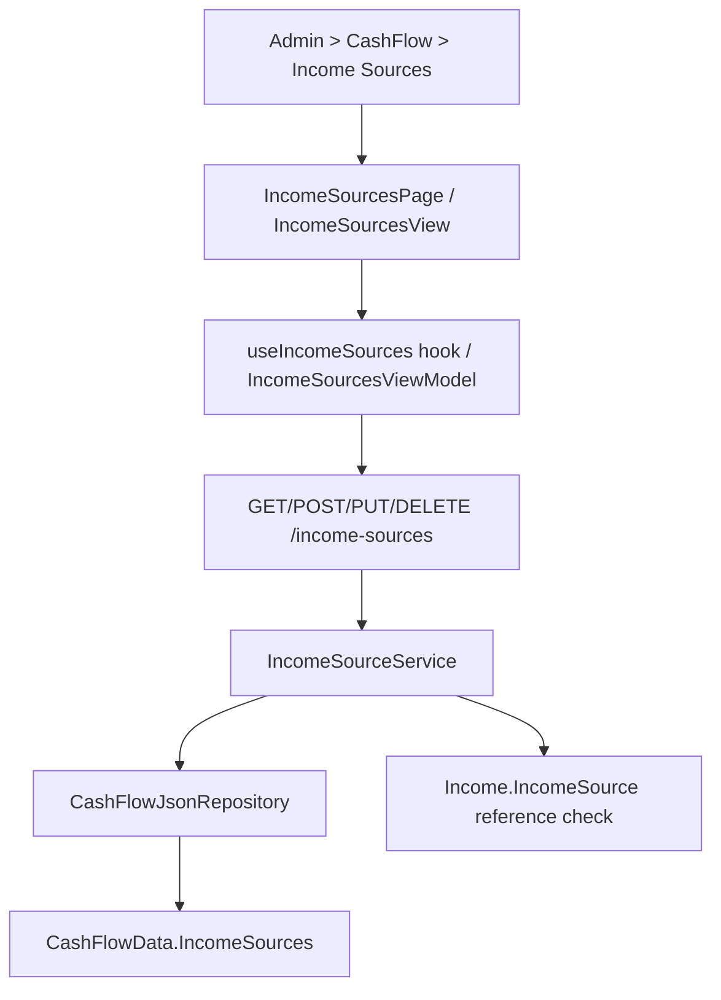

## 1. Technical Overview

**What:** Extend `IncomeSource` (CashFlow bounded context) from read-only to full CRUD — create, edit every field, and a guarded delete — exposed through the Admin > CashFlow > Income Sources screen on both Web and WPF.

**Why:** `IncomeSource` today only exposes `GetIncomeSources()` end to end (domain factory, repository, service, and a controller explicitly documented as "Read-only access to the seeded income sources"). F08 needs `IncomeSource.Update`, `CashFlowData.RemoveIncomeSource`, the repository pair (`AddIncomeSource`/`DeleteIncomeSource`), an `Application` service extended with Create/Update/Delete plus name-uniqueness and reference-guard checks, new DTOs, a controller extended with POST/PUT/DELETE, and new Admin screens on both front ends — the same shape F02 (Broker), F05 (Bank), F06 (Category), F07 (Credit Card) already established.

**Scope:**
- Included: `IncomeSource.Update(name, group, isActive, autoSplitToReserve)`; `CashFlowData.RemoveIncomeSource`; `ICashFlowRepository.AddIncomeSource`/`DeleteIncomeSource`; `IIncomeSourceService`/`IncomeSourceService` extended with Create/Update/Delete, `EnsureNameIsUnique`, `IsReferenced`/`EnsureNotReferenced`; new `IncomeSourceCreateDTO`/`IncomeSourceUpdateDTO`; `IncomeSourceDTO` extended with `HasReferences`; `IncomeSourcesController` extended with POST/PUT/DELETE; OpenAPI snapshot + generated frontend types; Web `IncomeSourcesPage`/`IncomeSourceFormDialog`/`useIncomeSources`; WPF `IncomeSourcesView`/`IncomeSourceFormDialog` + matching ViewModels under the `Admin` folder; nav/route wiring on both platforms (Admin > CashFlow > Income Sources, replacing the F01 placeholder); removing the now-obsolete `IncomeSources_UnsupportedVerbs_DoNotSucceed` test in `IncomeSourcesEndpointsTests.cs`.
- Excluded: any change to how `Income` entries reference an `IncomeSource` (`Income.IncomeSource`/`IncomeFormView` stay exactly as they are — only read for the delete-reference check); the `IncomeSourceMigrator` spreadsheet-import tool (unaffected — it calls `IncomeSource.Create`, whose signature is preserved); any change to `IncomeGroup`'s three values.

## 2. Architecture Impact

**Affected components:**
- `Financial.CashFlow.Domain/Entities/IncomeSource.cs` — add `Update(name, group, isActive, autoSplitToReserve)`, reusing `Create`'s blank-name guard.
- `Financial.CashFlow.Domain/Entities/CashFlowData.cs` — add `RemoveIncomeSource(Guid id)`.
- `Financial.CashFlow.Application/Interfaces/ICashFlowRepository.cs` — add `AddIncomeSource`, `DeleteIncomeSource`.
- `Financial.CashFlow.Infrastructure/Repositories/CashFlowJsonRepository.cs` — implement the two new repository members.
- `Financial.CashFlow.Application/Interfaces/IIncomeSourceService.cs`, `Services/IncomeSourceService.cs` — add `CreateIncomeSourceAsync`, `UpdateIncomeSourceAsync`, `DeleteIncomeSourceAsync`, `EnsureNameIsUnique`, `IsReferenced`/`EnsureNotReferenced` (scanning `ICashFlowRepository.GetIncomes()` for `Income.IncomeSource.Id == id`).
- `Financial.CashFlow.Application/DTOs/IncomeSourceDTO.cs` (add `HasReferences`), new `IncomeSourceCreateDTO.cs`, `IncomeSourceUpdateDTO.cs`.
- `Financial.Api/Controllers/IncomeSourcesController.cs` — add POST/PUT/DELETE, update the class/GET XML doc (no longer "read-only").
- `Tests/Financial.Api.Tests/Contract/openapi-v1.snapshot.json` — regenerated.
- `Financial.Web/src/api/generated/openapi.ts`, `src/api/types.ts` — regenerated/extended.
- `Financial.Web/src/api/financialApiClient.ts` — add `createIncomeSource`/`updateIncomeSource`/`deleteIncomeSource`, mirroring `createBank`/`updateBank`/`deleteBank`.
- New: `Financial.Web/src/pages/IncomeSourcesPage.tsx` + `.css`, `src/components/IncomeSourceFormDialog.tsx`, `src/hooks/useIncomeSources.ts`, plus their `__tests__`.
- `Financial.Web/src/navigation/lazyPages.tsx`, `routes.tsx` — point the Income Sources leaf at the new page instead of `AdminEntityPlaceholderPage`.
- New: `Financial.App/ViewModels/Admin/IncomeSourcesViewModel.cs`, `IncomeSourceFormDialogViewModel.cs`, `Financial.App/Views/Admin/IncomeSourcesView.xaml(.cs)`, `IncomeSourceFormDialog.xaml(.cs)`.
- `Financial.App/Services/IDialogService.cs`, `DialogService.cs` — add `ShowIncomeSourceFormDialog(IncomeSourceFormDialogViewModel)`.
- `Financial.App/MainWindow.xaml.cs` — register `IncomeSourcesView` in `viewsByKey` in place of the placeholder.
- `Tests/Financial.Api.Tests/IncomeSourcesEndpointsTests.cs` — remove `IncomeSources_UnsupportedVerbs_DoNotSucceed`, add full CRUD coverage.

## 3. Technical Decisions

| Decision | Chosen Approach | Alternative Considered | Trade-off |
|---|---|---|---|
| Delete-guard reference scope | Scan `Income.IncomeSource.Id == id` only (`Income.IncomeSource` is the sole navigation property to `IncomeSource` in the codebase) | Also scanning a hypothetical secondary reference | No other entity holds an `IncomeSource` reference — confirmed by research; mirrors `CategoryService.IsReferenced`'s single-source scan |
| `Group` wire format | Keep `IncomeSourceDTO.Group`/Create/Update DTO field as `string`, parsed server-side via `Enum.Parse<IncomeGroup>(...)` (throwing `ArgumentException` on an invalid value) | Type the DTO property as the `IncomeGroup` enum directly, so OpenAPI codegen emits a literal string union (as `PositionType` does) | Preserves the existing `IncomeSourceDTO.Group` wire shape (already `.ToString()`'d, consumed as plain `string` in `Financial.Web`) with zero breaking change to the read path; the frontend hardcodes the three `IncomeGroup` option labels in a `Dropdown`/`ComboBox`, consistent with the "no existing enum-to-union precedent" finding — introducing a wire-format change for Group is out of scope for this feature |
| `HasReferences` computed on read | Add `HasReferences` to `IncomeSourceDTO`, computed the same way `BankService.IsReferenced`/`CategoryDTO.HasReferences`/`CreditCardDTO.HasReferences` are | Client discovers only via a failed 409 | Matches the established precedent (F05/F06/F07); consistent UX across Admin screens |
| `Update` method shape | New `Update(name, group, isActive, autoSplitToReserve)` instance method on `IncomeSource`, matching `Bank.Update`'s full-replace convention and blank-name guard | Multiple targeted setters (`Rename`, `SetGroup`, `SetActive`, ...) | A single full-replace `Update` matches every other Admin-CRUD entity in this codebase (`Bank`, `Category`, `CreditCard`) |
| Uniqueness scope | `Name` unique across all income sources (case-sensitive ordinal, matching `Bank`/`Broker`/`Category`/`CreditCard`) | Case-insensitive | No existing precedent enforces case-insensitive uniqueness in this codebase; ordinal matches `BankService.EnsureNameIsUnique` |
| Web enum control | Fluent `Dropdown` bound to a hardcoded `['Salary', 'DividendoJuros', 'NonReportable']` options array (labelled) | Free-text input | `Group` is a closed enum, not free text; a `Dropdown` is the Fluent 2 control for a small fixed set of mutually exclusive options, consistent with ADR-003/ADR-004 |
| WPF enum control | `ComboBox` bound to a flat string `ItemsSource`/`SelectedValue` (`GroupOptions`/`Group`), mirroring `AssetFormDialog.xaml`'s `CountryOptions`/`ClassOptions` pattern | `IncomeFormView`'s object-bound `ItemsSource`/`DisplayMemberPath` pattern | `AssetFormDialog`'s string-backed pattern is the closer match since `IncomeSource.Group` round-trips as a plain string on the wire (see `Group` wire-format decision above), not an object reference |

## 4. Component Overview

**Frontend (Web):**

| File Path | New/Modified | Purpose | Key Responsibilities |
|---|---|---|---|
| `Financial.Web/src/pages/IncomeSourcesPage.tsx` | New | List + create/edit/delete screen | Fluent `Table`, "Create Income Source" action, wires dialog + delete confirm |
| `Financial.Web/src/pages/IncomeSourcesPage.css` | New | Page layout | Mirrors `CategoriesPage.css` |
| `Financial.Web/src/components/IncomeSourceFormDialog.tsx` | New | Create/Edit dialog | Name field, Group dropdown, Active + AutoSplitToReserve toggles; inline duplicate-name error |
| `Financial.Web/src/hooks/useIncomeSources.ts` | New | Data hook | list/create/update/delete against `/income-sources`, loading/error/saving states |
| `Financial.Web/src/api/financialApiClient.ts` | Modified | API client methods | Add `createIncomeSource`/`updateIncomeSource`/`deleteIncomeSource` |
| `Financial.Web/src/navigation/lazyPages.tsx`, `routes.tsx` | Modified | Route wiring | Replace `AdminEntityPlaceholderPage` for the Income Sources leaf |

**Frontend (WPF):**

| File Path | New/Modified | Purpose | Key Responsibilities |
|---|---|---|---|
| `Financial.App/ViewModels/Admin/IncomeSourcesViewModel.cs` | New | List VM | Same shape as `BanksViewModel`/`CreditCardsViewModel` |
| `Financial.App/ViewModels/Admin/IncomeSourceFormDialogViewModel.cs` | New | Form VM | Same shape as `CategoryFormDialogViewModel` (three non-Name fields), adds `GroupOptions`/`Group` |
| `Financial.App/Views/Admin/IncomeSourcesView.xaml(.cs)` | New | List view | Mirrors `BanksView` |
| `Financial.App/Views/Admin/IncomeSourceFormDialog.xaml(.cs)` | New | Form dialog | Mirrors `CategoryFormDialog`, with an added `ComboBox` for Group |
| `Financial.App/Services/IDialogService.cs`, `DialogService.cs` | Modified | Dialog wiring | Add `ShowIncomeSourceFormDialog` |
| `Financial.App/MainWindow.xaml.cs` | Modified | View registration | Register `IncomeSourcesView` for the Income Sources nav key |

**Backend:**

| File Path | New/Modified | Purpose | Key Responsibilities |
|---|---|---|---|
| `Financial.CashFlow.Domain/Entities/IncomeSource.cs` | Modified | Add `Update(name, group, isActive, autoSplitToReserve)`, blank-name guard |
| `Financial.CashFlow.Domain/Entities/CashFlowData.cs` | Modified | Add `RemoveIncomeSource(Guid id)` |
| `Financial.CashFlow.Application/Interfaces/ICashFlowRepository.cs` | Modified | Add `AddIncomeSource`, `DeleteIncomeSource` |
| `Financial.CashFlow.Infrastructure/Repositories/CashFlowJsonRepository.cs` | Modified | Implement the two additions |
| `Financial.CashFlow.Application/DTOs/IncomeSourceCreateDTO.cs` | New | `Name`, `Group`, `IsActive`, `AutoSplitToReserve` |
| `Financial.CashFlow.Application/DTOs/IncomeSourceUpdateDTO.cs` | New | Same four fields, full-replace |
| `Financial.CashFlow.Application/DTOs/IncomeSourceDTO.cs` | Modified | Add `HasReferences` |
| `Financial.CashFlow.Application/Interfaces/IIncomeSourceService.cs`, `Services/IncomeSourceService.cs` | Modified | `CreateIncomeSourceAsync`, `UpdateIncomeSourceAsync`, `DeleteIncomeSourceAsync`, `EnsureNameIsUnique`, `IsReferenced` |
| `Financial.Api/Controllers/IncomeSourcesController.cs` | Modified | `POST /income-sources`, `PUT /income-sources/{id}`, `DELETE /income-sources/{id}` |

## 5. API Contracts

**Endpoint: Create Income Source**
- **Method:** POST
- **Path:** `/income-sources`

Request: `{ "name": "Freelance", "group": "NonReportable", "isActive": true, "autoSplitToReserve": false }`
Response (200): `IncomeSourceDTO` — `{ "id", "name", "group", "isActive", "autoSplitToReserve", "hasReferences": false }`
Errors: 400 blank name; 400 invalid `group` value; 400 (`DuplicateNameException`) duplicate name.

**Endpoint: Update Income Source**
- **Method:** PUT
- **Path:** `/income-sources/{id}`

Request: `{ "name": "Freelance", "group": "Salary", "isActive": true, "autoSplitToReserve": true }`
Response: `IncomeSourceDTO`, same shape as Create.
Errors: 400 blank/duplicate name; 400 invalid `group` value; 404 unknown id.

**Endpoint: Delete Income Source**
- **Method:** DELETE
- **Path:** `/income-sources/{id}`

Response: 200 OK.
Errors: 404 unknown id; 409 (`EntityInUseException`) — "Cannot delete an income source that is still used by an income entry."

Follows the exact response/error-mapping convention `BanksController`/`BankService` already established (`DuplicateNameException` → 400, `ArgumentException` → 400, `KeyNotFoundException` → 404, `EntityInUseException` → 409, mapped by the existing global exception middleware — no new mapping needed).

## 6. Data Model

No schema/migration — `IncomeSource` already exists in `data-cashflow.json` under `incomeSources`; the JSON shape of each record is unchanged (`Id`/`Name`/`IsActive`/`Group`/`AutoSplitToReserve`) — `Update` doesn't add fields, it only removes the read-only restriction.

## 7. Testing Strategy

| Test File | Type | Target |
|---|---|---|
| `Tests/Financial.CashFlow.Domain.Tests/Entities/IncomeSourceTests.cs` (extended) | Unit | `IncomeSource.Update` — persists all four fields, rejects blank name |
| `Tests/Financial.CashFlow.Domain.Tests/Entities/CashFlowDataTests.cs` | Unit | `RemoveIncomeSource` |
| `Tests/Financial.CashFlow.Application.Tests/Services/IncomeSourceServiceTests.cs` (extended) | Unit | Create/Update/Delete success + duplicate-name + not-found + invalid-group + reference-guard paths (`Income.IncomeSource`), `HasReferences` true when referenced |
| `Tests/Financial.Api.Tests/IncomeSourcesEndpointsTests.cs` (extended, `IncomeSources_UnsupportedVerbs_DoNotSucceed` removed) | Integration | Full HTTP round-trip for the new POST/PUT/DELETE incl. 400/404/409, reusing the seeded `Gleison`/`Ariana`/`Lottery`/`DividendoJuros` fixture ids |
| `Financial.Web/src/hooks/__tests__/useIncomeSources.test.ts` | Unit | hook CRUD + error states |
| `Financial.Web/src/components/__tests__/IncomeSourceFormDialog.test.tsx` | Unit | validation, dropdown/toggle states, submit |
| `Financial.Web/src/pages/__tests__/IncomeSourcesPage.test.tsx` | Unit | list render, delete-blocked state |
| `Tests/Financial.Presentation.Tests/ViewModels/Admin/IncomeSourcesViewModelTests.cs`, `IncomeSourceFormDialogViewModelTests.cs` | Unit | WPF VM parity with the Web hook/dialog behavior |
| Cross-feature E2E (`Tests/Financial.Api.Tests`) | Integration | Creating an `Income` referencing an `IncomeSource` blocks that source's delete with 409; deleting the reference (or a source with none) allows it |

## Assumptions (auto-accepted, no interview)

- This spec was generated without an interactive interview: F02/F05/F06/F07 already establish an unambiguous, near-identical precedent for this exact shape of feature (simple reference entity, one reference-guarded delete), so the two open technical questions found during codebase research — how to expose `IncomeGroup` on the wire, and which existing WPF ComboBox pattern to follow — are resolved above under Technical Decisions rather than asked interactively.
- Uniqueness and delete-guard mechanics mirror `BankService`/`CategoryService`/`CreditCardService` exactly (documented above under Technical Decisions) — the PRD specifies the *rule*, not the *mechanism*, and those three are the established precedent for this codebase.
- `IncomeSource.Create`'s existing signature (`name`, `group`, `isActive = true`, `autoSplitToReserve = false`) is preserved unchanged as the domain factory (still consumed directly by `Tools/CashFlowSpreadsheetImport`'s `IncomeSourceMigrator`); `IncomeSourceCreateDTO` requires all four fields explicitly, consistent with `BankCreateDTO`/`CategoryCreateDTO`/`CreditCardCreateDTO` requiring every field the PRD's Capabilities section lists.
- No PRD Cross-Feature Integration bullet in Section 9 names F08 specifically — the only relevant cross-feature note is F08 itself (IncomeSource referenced by Income), covered as an in-feature acceptance criterion, not a Section 9 Cross-Feature Integration item.
