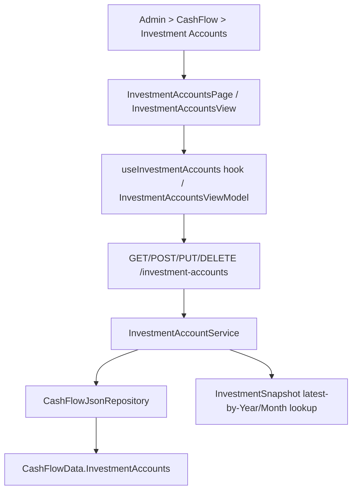

## 1. Technical Overview

**What:** Extend `InvestmentAccount` (CashFlow bounded context) from read-only to full CRUD — create, edit every field including its list of Aliases, and a balance-based guarded delete — exposed through the Admin > CashFlow > Investment Accounts screen on both Web and WPF.

**Why:** `InvestmentAccount` today only exposes `GetInvestmentAccounts()` end to end (domain factory + `AddAlias` only, repository read, service read, and a controller explicitly documented as "Read-only access to the seeded investment accounts"). F09 needs `InvestmentAccount.Update`, `CashFlowData.RemoveInvestmentAccount`, the repository pair (`AddInvestmentAccount` already exists, `DeleteInvestmentAccount` is new), an `Application` service extended with Create/Update/Delete plus name-uniqueness and a balance-based delete guard, new DTOs (now exposing `Aliases` for the first time), a controller extended with POST/PUT/DELETE, and new Admin screens on both front ends — the same shape F02/F05/F06/F07/F08 already established, adapted for a value-based (not reference-based) delete rule and a multi-value Aliases field with no existing UI precedent in this codebase.

**Scope:**
- Included: `InvestmentAccount.Update(name, isActive, isLiability, aliases)` (full-replace, reusing `AddAlias`'s existing blank-check-and-case-insensitive-dedup rule for the incoming alias list); `CashFlowData.RemoveInvestmentAccount`; `ICashFlowRepository.DeleteInvestmentAccount`; `IInvestmentAccountService`/`InvestmentAccountService` extended with Create/Update/Delete, `EnsureNameIsUnique`, and a latest-snapshot-value delete guard; new `InvestmentAccountCreateDTO`/`InvestmentAccountUpdateDTO`; `InvestmentAccountDTO` extended with `Aliases` and `LatestBalance`; `InvestmentAccountsController` extended with POST/PUT/DELETE; OpenAPI snapshot + generated frontend types; Web `InvestmentAccountsPage`/`InvestmentAccountFormDialog`/`useInvestmentAccounts` (new tag-style `AliasesInput` built from Fluent `TagGroup`/`InteractionTag`, since no multi-value input exists anywhere in this codebase yet); WPF `InvestmentAccountsView`/`InvestmentAccountFormDialog` + matching ViewModels under the `Admin` folder (new removable-chip `ItemsControl` + add-`TextBox` for Aliases, mirroring the Web interaction since WPF-UI has no built-in tag/chip input either); nav/route wiring on both platforms (Admin > CashFlow > Investment Accounts, replacing the F01 placeholder); removing the now-obsolete `InvestmentAccounts_UnsupportedVerbs_DoNotSucceed` test in `InvestmentAccountsEndpointsTests.cs`.
- Excluded: any change to `InvestmentSnapshot` values or the existing month-seeding/update workflow (`InvestmentSnapshotsController`/`InvestmentSnapshotService` stay exactly as they are — only read, for the delete-guard's "latest snapshot" lookup); the `InvestmentAccountMigrator` spreadsheet-import tool (unaffected — it calls `InvestmentAccount.Create`/`AddAlias`, both preserved unchanged).

## 2. Architecture Impact

**Affected components:**
- `Financial.CashFlow.Domain/Entities/InvestmentAccount.cs` — add `Update(name, isActive, isLiability, aliases)`: validates the blank-name guard `Create` already enforces, then clears and rebuilds the alias list by calling the existing `AddAlias` once per incoming alias (reusing its blank-alias guard and case-insensitive dedup with zero new validation code).
- `Financial.CashFlow.Domain/Entities/CashFlowData.cs` — add `RemoveInvestmentAccount(Guid id)`.
- `Financial.CashFlow.Application/Interfaces/ICashFlowRepository.cs` — add `DeleteInvestmentAccount`.
- `Financial.CashFlow.Infrastructure/Repositories/CashFlowJsonRepository.cs` — implement `DeleteInvestmentAccount`.
- `Financial.CashFlow.Application/Interfaces/IInvestmentAccountService.cs`, `Services/InvestmentAccountService.cs` — add `CreateInvestmentAccountAsync`, `UpdateInvestmentAccountAsync`, `DeleteInvestmentAccountAsync`, `EnsureNameIsUnique`, and `GetLatestBalance(Guid accountId)` (scans `ICashFlowRepository.GetInvestmentSnapshots()` for the given account, ordered by Year then Month descending, defaulting to 0 when none exist) feeding both `InvestmentAccountDTO.LatestBalance` and the delete guard.
- `Financial.CashFlow.Application/DTOs/InvestmentAccountDTO.cs` (add `Aliases`, `LatestBalance`), new `InvestmentAccountCreateDTO.cs`, `InvestmentAccountUpdateDTO.cs` (both carrying `Aliases`).
- `Financial.Api/Controllers/InvestmentAccountsController.cs` — add POST/PUT/DELETE, update the class/GET XML doc (no longer "read-only").
- `Tests/Financial.Api.Tests/Contract/openapi-v1.snapshot.json` — regenerated.
- `Financial.Web/src/api/generated/openapi.ts`, `src/api/types.ts` — regenerated/extended.
- `Financial.Web/src/api/financialApiClient.ts` — add `getInvestmentAccounts`/`createInvestmentAccount`/`updateInvestmentAccount`/`deleteInvestmentAccount` (none of the four currently exist).
- New: `Financial.Web/src/pages/InvestmentAccountsPage.tsx` + `.css`, `src/components/InvestmentAccountFormDialog.tsx`, `src/components/AliasesInput.tsx` (new reusable tag-style input), `src/hooks/useInvestmentAccounts.ts`, plus their `__tests__`.
- `Financial.Web/src/navigation/lazyPages.tsx`, `routes.tsx` — point the Investment Accounts leaf at the new page instead of `AdminEntityPlaceholderPage`.
- New: `Financial.App/ViewModels/Admin/InvestmentAccountsViewModel.cs`, `InvestmentAccountFormDialogViewModel.cs`, `Financial.App/Views/Admin/InvestmentAccountsView.xaml(.cs)`, `InvestmentAccountFormDialog.xaml(.cs)`.
- `Financial.App/Services/IDialogService.cs`, `DialogService.cs` — add `ShowInvestmentAccountFormDialog(InvestmentAccountFormDialogViewModel)`.
- `Financial.App/MainWindow.xaml.cs`, `App.xaml.cs` — register `InvestmentAccountsView` in `viewsByKey`/DI in place of the placeholder.
- `Tests/Financial.Api.Tests/InvestmentAccountsEndpointsTests.cs` — remove `InvestmentAccounts_UnsupportedVerbs_DoNotSucceed`, add full CRUD + delete-guard coverage.

## 3. Technical Decisions

| Decision | Chosen Approach | Alternative Considered | Trade-off |
|---|---|---|---|
| Delete-guard mechanism | Not a reference scan (unlike Bank/Category/CreditCard/IncomeSource): compute the account's most recent `InvestmentSnapshot` by `(Year, Month)` descending, treat "no snapshot" as a value of 0, block delete when that value is non-zero — exact PRD wording | Reuse the `HasReferences`/`IsReferenced` boolean shape from sibling entities | The PRD's own rule is value-based ("latest recorded balance is zero"), not existence-based; forcing it into a boolean `HasReferences` would lose the balance figure the Experience section requires showing in the delete-confirmation dialog |
| `InvestmentAccountDTO` guard field | Add `LatestBalance` (decimal), not `HasReferences` | Add both a `decimal LatestBalance` and a redundant `bool HasReferences` | A single decimal is sufficient for both the client's disabled-state check (`LatestBalance != 0`) and displaying the actual figure the PRD's Experience section calls for; a redundant boolean would be derivable and unused |
| `Update`'s alias handling | Full-replace: clear the backing list, then call the existing public `AddAlias(alias)` once per incoming alias, reusing its blank-guard and case-insensitive dedup as-is | Add a new `RemoveAlias` + require the caller to compute the add/remove diff | Every other Admin-CRUD `Update` in this codebase is a full-replace of its owning entity's state; reusing `AddAlias` verbatim needs zero new validation code and keeps the one dedup rule in one place |
| Web Aliases input | New `AliasesInput` component: a Fluent `Input` + "Add" button to commit a new alias, rendered as removable `InteractionTag`s (`InteractionTagPrimary` + `InteractionTagSecondary` dismiss action) inside a `TagGroup` | Adopt Fluent's compound `TagPicker` component | No tag/multi-value input exists anywhere in this codebase yet (confirmed absent). `TagPicker` is a heavier compound API (combobox-style with suggestions) intended for picking from a known set; a plain add/remove chip list matches the PRD's "tag-style multi-value input" wording without introducing combobox/suggestion behavior this field doesn't need |
| WPF Aliases input | New: an `ItemsControl` of removable chip-like items (`Border` + `TextBlock` + a small "✕" `Button`) in a `WrapPanel`, plus a `TextBox` + "Add" `Button` row, mirroring the Web interaction model | A comma-separated free-text `TextBox` with app-side parsing | No tag/chip control exists in WPF-UI or elsewhere in `Financial.App`. Per this project's UI invariant (`Financial.Web` is the UX source of truth; WPF must provide an equivalent task), the chip-list interaction is mirrored rather than downgraded to a lower-fidelity text-parsing fallback |
| Uniqueness scope | `Name` unique across all investment accounts (case-sensitive ordinal, matching `Bank`/`Broker`/`Category`/`CreditCard`/`IncomeSource`) | Case-insensitive | No existing precedent enforces case-insensitive uniqueness in this codebase; ordinal matches `BankService.EnsureNameIsUnique` |
| `HasReferences`-style precedent for `DuplicateNameException`/`EntityInUseException` HTTP mapping | `DuplicateNameException` → 409, `ArgumentException` → 400, `KeyNotFoundException` → 404, `EntityInUseException` → 409 (the balance guard reuses `EntityInUseException`, not a new exception type) | Introduce a new `NonZeroBalanceException` | `EntityInUseException`'s existing 409 mapping and message-carrying shape already fit "cannot delete this record right now for a business reason"; a new exception type would duplicate the middleware mapping for no behavioral difference |

## 4. Component Overview

**Frontend (Web):**

| File Path | New/Modified | Purpose | Key Responsibilities |
|---|---|---|---|
| `Financial.Web/src/pages/InvestmentAccountsPage.tsx` | New | List + create/edit/delete screen | Fluent `Table` (Name, Active, Liability, latest balance), "Create Investment Account" action, wires dialog + delete confirm |
| `Financial.Web/src/pages/InvestmentAccountsPage.css` | New | Page layout | Mirrors `IncomeSourcesPage.css` |
| `Financial.Web/src/components/InvestmentAccountFormDialog.tsx` | New | Create/Edit dialog | Name field, Active + Liability toggles, `AliasesInput`; inline duplicate-name error |
| `Financial.Web/src/components/AliasesInput.tsx` | New | Reusable tag-style multi-value input | Add-via-`Input`+`Button`, removable `InteractionTag` chips in a `TagGroup`, case-insensitive dedup mirroring the domain rule |
| `Financial.Web/src/hooks/useInvestmentAccounts.ts` | New | Data hook | list/create/update/delete against `/investment-accounts`, loading/error/saving states |
| `Financial.Web/src/api/financialApiClient.ts` | Modified | API client methods | Add `getInvestmentAccounts`/`createInvestmentAccount`/`updateInvestmentAccount`/`deleteInvestmentAccount` (none exist today) |
| `Financial.Web/src/navigation/lazyPages.tsx`, `routes.tsx` | Modified | Route wiring | Replace `AdminEntityPlaceholderPage` for the Investment Accounts leaf |

**Frontend (WPF):**

| File Path | New/Modified | Purpose | Key Responsibilities |
|---|---|---|---|
| `Financial.App/ViewModels/Admin/InvestmentAccountsViewModel.cs` | New | List VM | Same shape as `IncomeSourcesViewModel` |
| `Financial.App/ViewModels/Admin/InvestmentAccountFormDialogViewModel.cs` | New | Form VM | Same shape as `IncomeSourceFormDialogViewModel`, adds `ObservableCollection<string> Aliases`, `NewAlias`, `AddAliasCommand`/`RemoveAliasCommand` (each reapplying the blank/dedup rule client-side before Save) |
| `Financial.App/Views/Admin/InvestmentAccountsView.xaml(.cs)` | New | List view | Mirrors `IncomeSourcesView` |
| `Financial.App/Views/Admin/InvestmentAccountFormDialog.xaml(.cs)` | New | Form dialog | Mirrors `IncomeSourceFormDialog`, with an added chip-list `ItemsControl` + add-`TextBox` for Aliases |
| `Financial.App/Services/IDialogService.cs`, `DialogService.cs` | Modified | Dialog wiring | Add `ShowInvestmentAccountFormDialog` |
| `Financial.App/MainWindow.xaml.cs`, `App.xaml.cs` | Modified | View registration + DI | Register `InvestmentAccountsView`/`InvestmentAccountsViewModel` for the Investment Accounts nav key |

**Backend:**

| File Path | New/Modified | Purpose | Key Responsibilities |
|---|---|---|---|
| `Financial.CashFlow.Domain/Entities/InvestmentAccount.cs` | Modified | Add `Update(name, isActive, isLiability, aliases)`, reusing `AddAlias` |
| `Financial.CashFlow.Domain/Entities/CashFlowData.cs` | Modified | Add `RemoveInvestmentAccount(Guid id)` |
| `Financial.CashFlow.Application/Interfaces/ICashFlowRepository.cs` | Modified | Add `DeleteInvestmentAccount` |
| `Financial.CashFlow.Infrastructure/Repositories/CashFlowJsonRepository.cs` | Modified | Implement `DeleteInvestmentAccount` |
| `Financial.CashFlow.Application/DTOs/InvestmentAccountCreateDTO.cs` | New | `Name`, `IsActive`, `IsLiability`, `Aliases` |
| `Financial.CashFlow.Application/DTOs/InvestmentAccountUpdateDTO.cs` | New | Same four fields, full-replace |
| `Financial.CashFlow.Application/DTOs/InvestmentAccountDTO.cs` | Modified | Add `Aliases`, `LatestBalance` |
| `Financial.CashFlow.Application/Interfaces/IInvestmentAccountService.cs`, `Services/InvestmentAccountService.cs` | Modified | `CreateInvestmentAccountAsync`, `UpdateInvestmentAccountAsync`, `DeleteInvestmentAccountAsync`, `EnsureNameIsUnique`, `GetLatestBalance` |
| `Financial.Api/Controllers/InvestmentAccountsController.cs` | Modified | `POST /investment-accounts`, `PUT /investment-accounts/{id}`, `DELETE /investment-accounts/{id}` |

## 5. API Contracts

**Endpoint: Create Investment Account**
- **Method:** POST
- **Path:** `/investment-accounts`

Request: `{ "name": "Monzo Pot", "isActive": true, "isLiability": false, "aliases": ["Monzo"] }`
Response (200): `InvestmentAccountDTO` — `{ "id", "name", "isActive", "isLiability", "aliases": ["Monzo"], "latestBalance": 0 }`
Errors: 400 blank name; 409 (`DuplicateNameException`) duplicate name.

**Endpoint: Update Investment Account**
- **Method:** PUT
- **Path:** `/investment-accounts/{id}`

Request: `{ "name": "Monzo Pot", "isActive": true, "isLiability": false, "aliases": ["Monzo", "MonzoSavingsPot"] }`
Response: `InvestmentAccountDTO`, same shape as Create.
Errors: 400 blank name/blank alias; 409 duplicate name; 404 unknown id.

**Endpoint: Delete Investment Account**
- **Method:** DELETE
- **Path:** `/investment-accounts/{id}`

Response: 200 OK.
Errors: 404 unknown id; 409 (`EntityInUseException`) — "Cannot delete an investment account with a non-zero balance."

Follows the exact response/error-mapping convention `BanksController`/`BankService` already established (`DuplicateNameException` → 409, `ArgumentException` → 400, `KeyNotFoundException` → 404, `EntityInUseException` → 409, mapped by the existing global exception middleware — no new mapping needed).

## 6. Data Model

No schema/migration — `InvestmentAccount` already exists in `data-cashflow.json` under `investmentAccounts`; the JSON shape of each record grows to include `Aliases` (already present as a domain concept via `AddAlias`, simply not yet surfaced by the read DTO) — no new field is added to the persisted entity itself, only to its DTO projection.

## 7. Testing Strategy

| Test File | Type | Target |
|---|---|---|
| `Tests/Financial.CashFlow.Domain.Tests/Entities/InvestmentAccountTests.cs` (extended) | Unit | `InvestmentAccount.Update` — persists all fields incl. full-replace of Aliases (add, remove, dedup), rejects blank name, rejects a blank alias in the incoming list |
| `Tests/Financial.CashFlow.Domain.Tests/Entities/CashFlowDataTests.cs` | Unit | `RemoveInvestmentAccount` |
| `Tests/Financial.CashFlow.Application.Tests/Services/InvestmentAccountServiceTests.cs` (extended) | Unit | Create/Update/Delete success + duplicate-name + not-found paths; `GetLatestBalance` picks the highest (Year, Month) snapshot, defaults to 0 with no snapshot; delete blocked when latest value is non-zero, allowed when zero or absent |
| `Tests/Financial.Api.Tests/InvestmentAccountsEndpointsTests.cs` (extended, `InvestmentAccounts_UnsupportedVerbs_DoNotSucceed` removed) | Integration | Full HTTP round-trip for the new POST/PUT/DELETE incl. 400/404/409; delete-guard scenario seeds a non-zero snapshot via the existing `/investment-snapshots/{year}/{month}` GET + PUT flow, then asserts DELETE is blocked; a fresh account with no snapshot deletes cleanly |
| `Financial.Web/src/hooks/__tests__/useInvestmentAccounts.test.ts` | Unit | hook CRUD + error states |
| `Financial.Web/src/components/__tests__/AliasesInput.test.tsx` | Unit | add/remove chip, blank-input no-op, case-insensitive dedup |
| `Financial.Web/src/components/__tests__/InvestmentAccountFormDialog.test.tsx` | Unit | validation, toggle states, Aliases add/remove, submit |
| `Financial.Web/src/pages/__tests__/InvestmentAccountsPage.test.tsx` | Unit | list render, delete-blocked state showing `latestBalance` |
| `Tests/Financial.Presentation.Tests/ViewModels/Admin/InvestmentAccountsViewModelTests.cs`, `InvestmentAccountFormDialogViewModelTests.cs` | Unit | WPF VM parity with the Web hook/dialog behavior, incl. Aliases add/remove commands |
| Cross-feature E2E (`Tests/Financial.Api.Tests`) | Integration | An account whose latest `InvestmentSnapshot` value is set non-zero blocks delete with 409; setting it back to zero (or deleting a never-snapshotted account) allows it |

## Assumptions (auto-accepted, no interview)

- This spec was generated without an interactive interview: F02/F05/F06/F07/F08 already establish an unambiguous precedent for this shape of feature (simple reference entity, one guarded delete), so the two genuinely open technical questions this feature introduces — how to expose/compute the balance-based delete guard, and how to build a tag-style multi-value input that doesn't exist anywhere in this codebase yet (Web and WPF) — are resolved above under Technical Decisions rather than asked interactively.
- `InvestmentAccount.Create`'s existing signature (`name`, `isActive`, `isLiability`) is preserved unchanged as the domain factory (still consumed directly by `Tools/CashFlowSpreadsheetImport`'s `InvestmentAccountMigrator`, which also keeps calling the existing public `AddAlias`); `InvestmentAccountCreateDTO` requires all four fields (`Name`, `IsActive`, `IsLiability`, `Aliases`) explicitly, consistent with every other Admin-CRUD Create DTO requiring every field the PRD's Capabilities section lists ("a Name, active flag, liability flag, and aliases").
- No PRD Cross-Feature Integration bullet in Section 9 names F09 specifically — the only relevant cross-feature note is F09 itself (InvestmentAccount's balance sourced from `InvestmentSnapshot`, an existing CashFlow concept read here for the first time by this feature), covered as an in-feature acceptance criterion, not a Section 9 Cross-Feature Integration item.
