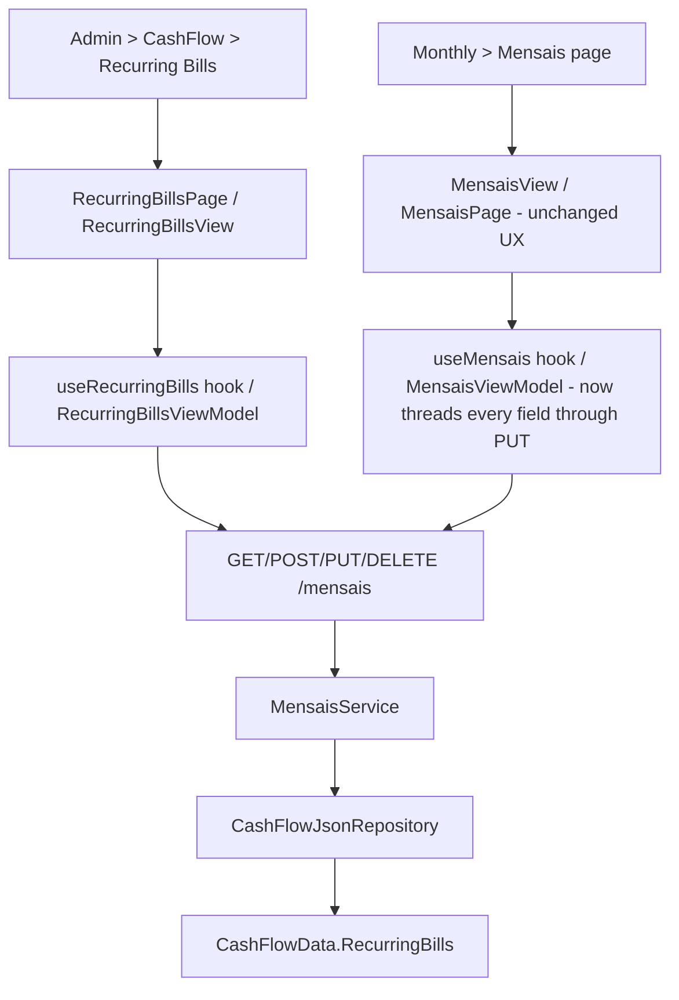

## 1. Technical Overview

**What:** Widen `RecurringBill.Update` from its current Status-and-Value-only shape to every field (DueDay, Description, Value, Area, Note, NitNumber, MinimumWageValue, Status), and add the missing Admin > CashFlow > Recurring Bills screen on both Web and WPF.

**Why:** Unlike every other F0x entity in this PRD, `RecurringBill` already has full Create/List/Update/Delete end to end (`MensaisService`/`MensaisController`, route `/mensais`) — it is this codebase's own precedent for CRUD maturity (PRD Section 2, pain 5). The only real gap is that `RecurringBillUpdateDTO`/`RecurringBill.Update` only ever accept `Status` and `Value`, because the only consumer built so far is the Monthly page's "mark this bill paid" operational workflow. F10 needs the domain `Update` method and its DTO widened to every field, the two existing narrow call sites (Web `useMensais.ts`, WPF `MensaisViewModel.cs`) updated to keep passing every other field through unchanged now that the DTO requires them, and a genuinely new Admin CRUD screen (list + full-field create/edit + delete) on both front ends, since `admin/cashflow/recurring-bills` and `admin-recurring-bills` are still placeholders.

**Scope:**
- Included: `RecurringBill.Update(dueDay, description, value, area, note, nitNumber, minimumWageValue, status)` — full-replace, reusing the existing private `Validate(dueDay, description)` guard; `RecurringBillUpdateDTO` extended with the six missing fields; `MensaisService.UpdateBillAsync` extended to parse `Area` (mirroring `CreateBillAsync`) alongside the existing `Status` parse; `MensaisController.UpdateBill`'s XML doc updated to reflect full-field editing (status codes unchanged: 200/400/404); updating the two existing narrow call sites (`Financial.Web/src/hooks/useMensais.ts`, `Financial.App/ViewModels/CashFlow/MensaisViewModel.cs`) to pass the bill's current `DueDay`/`Description`/`Area`/`Note`/`NitNumber`/`MinimumWageValue` through unchanged alongside the edited `Status`/`Value`; new Admin screens reusing the existing `/mensais` endpoints and `getMensaisBills`/`createMensaisBill`/`updateMensaisBill`/`deleteMensaisBill` client methods (already exposed) — Web `RecurringBillsPage`/`RecurringBillFormDialog`; WPF `RecurringBillsView`/`RecurringBillFormDialog` + matching ViewModels under the `Admin` folder (distinct from the existing `Views/CashFlow/MensaisView` + `MensaisViewModel`, which keep their own Status+Value-only inline edit UX for the Monthly-page workflow); nav/route wiring on both platforms (Admin > CashFlow > Recurring Bills, replacing the F01 placeholder).
- Excluded: any change to the existing Monthly-page Mensais workflow's UX (`MensaisView`/`EditBillFormView.xaml`, `MensaisPage.tsx`'s inline Status/Value edit form stay exactly as they are today — only their update payload gains the other six fields, populated from the bill already in hand, not from new form fields); `MensaisService.ResetAllToUnsetAsync`/`POST /mensais/reset` (bulk operation, untouched); any new Delete guard (PRD: "Delete behaves exactly as today — no new guard is added").

## 2. Architecture Impact

**Affected components:**
- `Financial.CashFlow.Domain/Entities/RecurringBill.cs` — replace `Update(BillStatus status, decimal value)` with `Update(int dueDay, string description, decimal value, Area area, string note, string? nitNumber, decimal? minimumWageValue, BillStatus status)`, reusing the existing `Validate(dueDay, description)`.
- `Financial.CashFlow.Application/DTOs/RecurringBillUpdateDTO.cs` — add `DueDay`, `Description`, `Area`, `Note`, `NitNumber`, `MinimumWageValue` (all copying `RecurringBillDTO`'s existing shape for these fields).
- `Financial.CashFlow.Application/Services/MensaisService.cs` — extend `UpdateBillAsync` to also parse `Area` via `AreaParser.TryParse` (mirroring `CreateBillAsync`) and pass every field to the widened `RecurringBill.Update`.
- `Financial.Api/Controllers/MensaisController.cs` — update `UpdateBill`'s XML doc; no route/status-code change.
- `Tests/Financial.Api.Tests/Contract/openapi-v1.snapshot.json` — regenerated.
- `Financial.Web/src/api/generated/openapi.ts`, `src/api/types.ts` — regenerated (no new type aliases needed; `RecurringBillUpdateDto` already aliased).
- `Financial.Web/src/hooks/useMensais.ts` — `saveEdit()` extended to include the bill's current `dueDay`/`description`/`area`/`note`/`nitNumber`/`minimumWageValue` in the `updateMensaisBill` call, alongside the edited `status`/`value`.
- New: `Financial.Web/src/pages/RecurringBillsPage.tsx` + `.css`, `src/components/RecurringBillFormDialog.tsx`, `src/hooks/useRecurringBills.ts` (a distinct Admin-shaped hook over the same `/mensais` endpoints — list/create/update/delete, mirroring the other Admin hooks' loading/error/saving states, not `useMensais.ts`'s Monthly-page-specific shape), plus their `__tests__`.
- `Financial.Web/src/navigation/lazyPages.tsx`, `routes.tsx` — point the Recurring Bills leaf at the new page instead of `AdminEntityPlaceholderPage`.
- `Financial.App/ViewModels/CashFlow/MensaisViewModel.cs` — pass the bill's current `DueDay`/`Description`/`Area`/`Note`/`NitNumber`/`MinimumWageValue` through its existing `UpdateBillAsync` call.
- New: `Financial.App/ViewModels/Admin/RecurringBillsViewModel.cs`, `RecurringBillFormDialogViewModel.cs`, `Financial.App/Views/Admin/RecurringBillsView.xaml(.cs)`, `RecurringBillFormDialog.xaml(.cs)`.
- `Financial.App/Services/IDialogService.cs`, `DialogService.cs` — add `ShowRecurringBillFormDialog(RecurringBillFormDialogViewModel)`.
- `Financial.App/MainWindow.xaml.cs`, `App.xaml.cs` — register `RecurringBillsView`/`RecurringBillsViewModel` in place of the placeholder.

## 3. Technical Decisions

| Decision | Chosen Approach | Alternative Considered | Trade-off |
|---|---|---|---|
| `Update` method shape | Replace the existing `Update(status, value)` with a single full-replace `Update(dueDay, description, value, area, note, nitNumber, minimumWageValue, status)`, matching every other Admin-CRUD entity's convention in this codebase | Keep `Update(status, value)` alongside a second, wider method | A single full-replace `Update` matches `Bank`/`Category`/`IncomeSource`/`InvestmentAccount`; two entry points would be redundant now that the PRD explicitly supersedes the narrow one ("Edit is extended from Status and Value only to every field listed above") |
| Existing Mensais call sites | Update `useMensais.ts` and `MensaisViewModel.cs` to pass the bill's already-in-hand field values through the now-required DTO fields, with no UX change to that screen | Make the new fields optional/keep-if-omitted on `RecurringBillUpdateDTO` | Exact precedent from F07 (`CardsGrid.tsx`/`CardsWorkflowViewModel.cs` threading `name` through once it became required) — every other Admin Update DTO in this codebase is a full-replace, and an optional/keep-if-omitted field would diverge from that convention |
| Admin screen's data hook | New `useRecurringBills.ts` (Web) / `RecurringBillsViewModel.cs` (WPF), calling the same existing `/mensais` endpoints and `getMensaisBills`/`createMensaisBill`/`updateMensaisBill`/`deleteMensaisBill` client methods, rather than reusing `useMensais.ts`/`MensaisViewModel` | Reuse `useMensais.ts`/`MensaisViewModel` directly for the Admin screen | `useMensais`'s state shape (per-row `editingField: 'editStatus' | 'editValue'`, month-scoped `resetMensaisToUnset` affordance) is purpose-built for the Monthly page's inline workflow; the Admin screen needs the generic list/create/edit-dialog/delete-confirm shape every other Admin page uses (loading/empty/validation/server-error/saving/success states), so a parallel hook over the same endpoints avoids contorting either UI to fit the other's shape |
| Area/Status controls (Web and WPF) | Fluent `Select` (Web) / string-backed `ComboBox` (WPF) with hardcoded option lists (`['Brasil', 'UK']`, `['Unset', 'Scheduled', 'Paid']`), matching `AssetFormDialog`'s established Country/Class pattern and F08/F09's Group/Aliases-adjacent decisions | A picker sourced from an API-exposed enum-values endpoint | No existing precedent in this codebase fetches enum option lists from the API; every other closed-enum field (Country, Class, IncomeGroup) hardcodes its option list client-side, consistent with the enums' stability |

## 4. Component Overview

**Frontend (Web):**

| File Path | New/Modified | Purpose | Key Responsibilities |
|---|---|---|---|
| `Financial.Web/src/pages/RecurringBillsPage.tsx` | New | List + create/edit/delete screen | Fluent `Table` (DueDay, Description, Value, Area, Status), "Create Recurring Bill" action, wires dialog + delete confirm, sortable by DueDay |
| `Financial.Web/src/pages/RecurringBillsPage.css` | New | Page layout | Mirrors `IncomeSourcesPage.css` |
| `Financial.Web/src/components/RecurringBillFormDialog.tsx` | New | Create/Edit dialog | DueDay, Description, Value, Area select, Note, NitNumber, MinimumWageValue, Status select (Status defaults to Unset on create, editable on edit) |
| `Financial.Web/src/hooks/useRecurringBills.ts` | New | Admin data hook | list/create/update/delete against `/mensais`, loading/error/saving states, distinct from `useMensais.ts`'s Monthly-page shape |
| `Financial.Web/src/hooks/useMensais.ts` | Modified | Thread new required fields through the existing inline update call | Keeps the Monthly-page Status/Value inline editing working against the now-required full-field `RecurringBillUpdateDto` |
| `Financial.Web/src/navigation/lazyPages.tsx`, `routes.tsx` | Modified | Route wiring | Replace `AdminEntityPlaceholderPage` for the Recurring Bills leaf |

**Frontend (WPF):**

| File Path | New/Modified | Purpose | Key Responsibilities |
|---|---|---|---|
| `Financial.App/ViewModels/Admin/RecurringBillsViewModel.cs` | New | List VM | Same shape as `IncomeSourcesViewModel`/`InvestmentAccountsViewModel` |
| `Financial.App/ViewModels/Admin/RecurringBillFormDialogViewModel.cs` | New | Form VM | DueDay/Description/Value/Area/Note/NitNumber/MinimumWageValue/Status, shape-only validation (DueDay 1-31, non-blank Description) mirroring the domain's own guard |
| `Financial.App/Views/Admin/RecurringBillsView.xaml(.cs)` | New | List view | Mirrors `IncomeSourcesView` |
| `Financial.App/Views/Admin/RecurringBillFormDialog.xaml(.cs)` | New | Form dialog | Mirrors `IncomeSourceFormDialog`, with `ComboBox`es for Area and Status |
| `Financial.App/ViewModels/CashFlow/MensaisViewModel.cs` | Modified | Thread new required fields through the existing inline update call | Keeps the Monthly-page Status/Value inline editing working against the now-required full-field `RecurringBillUpdateDTO` |
| `Financial.App/Services/IDialogService.cs`, `DialogService.cs` | Modified | Dialog wiring | Add `ShowRecurringBillFormDialog` |
| `Financial.App/MainWindow.xaml.cs`, `App.xaml.cs` | Modified | View registration + DI | Register `RecurringBillsView`/`RecurringBillsViewModel` for the Recurring Bills nav key |

**Backend:**

| File Path | New/Modified | Purpose | Key Responsibilities |
|---|---|---|---|
| `Financial.CashFlow.Domain/Entities/RecurringBill.cs` | Modified | Replace `Update(status, value)` with the full-field `Update(...)`, reusing `Validate` |
| `Financial.CashFlow.Application/DTOs/RecurringBillUpdateDTO.cs` | Modified | Add `DueDay`, `Description`, `Area`, `Note`, `NitNumber`, `MinimumWageValue` |
| `Financial.CashFlow.Application/Services/MensaisService.cs` | Modified | `UpdateBillAsync` parses `Area` too, passes every field to `RecurringBill.Update` |
| `Financial.Api/Controllers/MensaisController.cs` | Modified | `UpdateBill` XML doc updated; no route/status-code change |

## 5. API Contracts

**Endpoint: Update Recurring Bill** (existing route, widened request/behavior)
- **Method:** PUT
- **Path:** `/mensais/{id}`

Request: `{ "dueDay": 10, "description": "Aluguel", "value": 1500, "area": "Brasil", "note": "Updated note", "nitNumber": null, "minimumWageValue": null, "status": "Scheduled" }`
Response (200): `RecurringBillDTO` — all 9 fields.
Errors: 400 (`dueDay` outside 1-31, blank `description`, unrecognized `area`/`status`); 404 unknown id.

Create/Delete/Get/Reset endpoints are unchanged (already implemented, out of scope). Follows the existing `MensaisController`/`MensaisService` error-mapping convention (`ArgumentException` → 400, `KeyNotFoundException` → 404) — no new mapping needed.

## 6. Data Model

No schema/migration — `RecurringBill` already exists in `data-cashflow.json` under `recurringBills` with every field this feature touches already present; `Update` only stops discarding six of them.

## 7. Testing Strategy

| Test File | Type | Target |
|---|---|---|
| `Tests/Financial.CashFlow.Domain.Tests/Entities/RecurringBillTests.cs` (extended) | Unit | `Update` — persists all eight fields, rejects out-of-range DueDay and blank Description exactly as `Create` does |
| `Tests/Financial.CashFlow.Application.Tests/Services/MensaisServiceTests.cs` (extended) | Unit | `UpdateBillAsync` with every field, invalid Area on Update (`ArgumentException`), existing Status/Value-only assertions still pass with the other fields now included in the request |
| `Tests/Financial.Api.Tests/MensaisEndpointsTests.cs` (extended) | Integration | Full HTTP round-trip for the widened PUT incl. 400 (DueDay/Description/Area) and 404 |
| `Financial.Web/src/hooks/__tests__/useRecurringBills.test.ts` | Unit | hook CRUD + error states |
| `Financial.Web/src/components/__tests__/RecurringBillFormDialog.test.tsx` | Unit | validation (DueDay range, blank Description), Area/Status selects, submit |
| `Financial.Web/src/pages/__tests__/RecurringBillsPage.test.tsx` | Unit | list render, sort by DueDay, delete confirm |
| `Financial.Web/src/hooks/__tests__/useMensais.test.ts` (reviewed) | Unit | existing inline Status/Value update assertions still pass with the other fields now included in the request payload |
| `Tests/Financial.Presentation.Tests/ViewModels/Admin/RecurringBillsViewModelTests.cs`, `RecurringBillFormDialogViewModelTests.cs` | Unit | WPF VM parity with the Web hook/dialog behavior |
| `Tests/Financial.Presentation.Tests/ViewModels/CashFlow/MensaisViewModelTests.cs` (reviewed) | Unit | existing inline Status/Value update assertions still pass with the other fields now included in the request payload |

## Assumptions (auto-accepted, no interview)

- This spec was generated without an interactive interview: the codebase research made the shape of this feature unambiguous — RecurringBill already has full CRUD, so the only genuinely open decisions (how to widen `Update` without breaking the two existing narrow call sites, and whether the Admin screen should reuse `useMensais.ts`/`MensaisViewModel` or get its own hook/VM) are resolved above under Technical Decisions.
- `RecurringBill.Create`'s existing signature and behavior (Status always starts `Unset`, `NitNumber`/`MinimumWageValue` left null — INSS-specific, only ever populated by the spreadsheet import) are preserved unchanged, consistent with the PRD's "Create behaves as today" instruction.
- No PRD Cross-Feature Integration bullet in Section 9 names F10 specifically, and F10's own Section 9 criteria list no delete-guard behavior to verify (PRD: "Deleting a Recurring Bill succeeds regardless of its current Status, matching existing unrestricted delete behavior") — so no new integration test is added beyond confirming the existing Delete test still passes unmodified.
