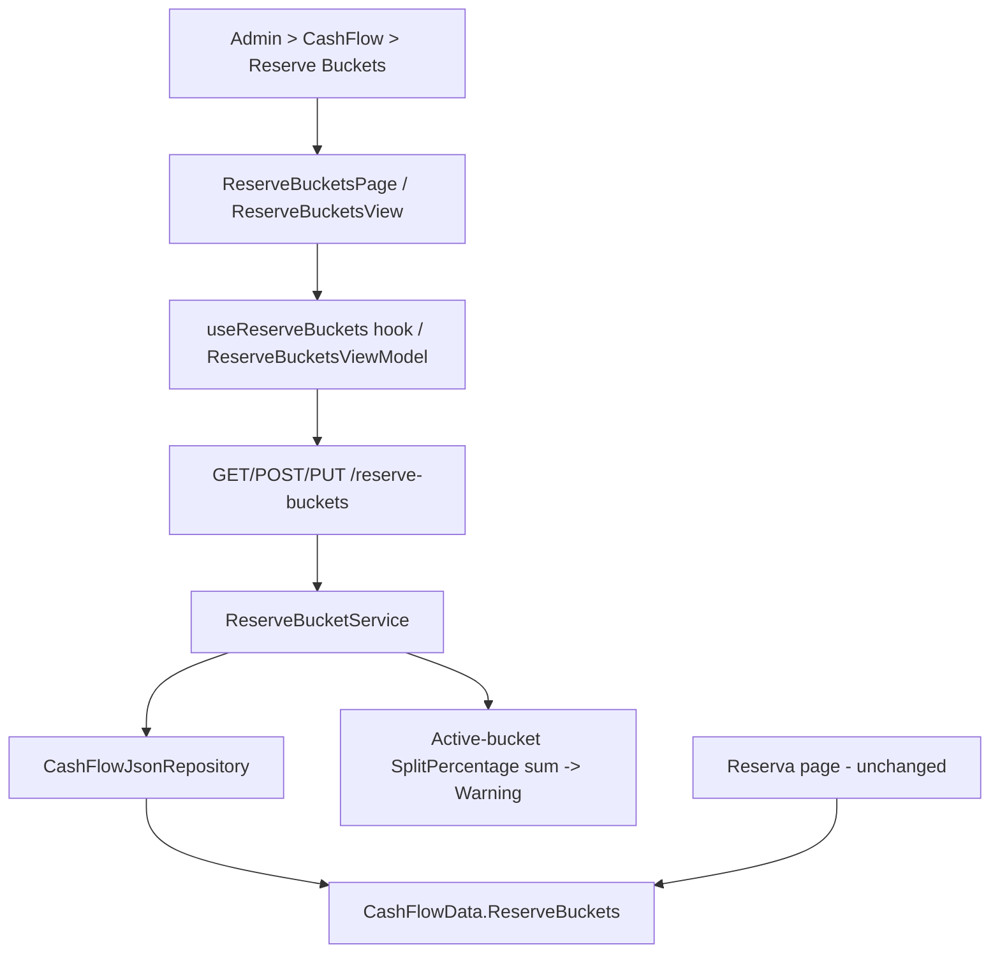

## 1. Technical Overview

**What:** Extend `ReserveBucket` (CashFlow bounded context) from read-only to full CRUD — create, edit every field, and a soft "delete" that deactivates rather than removes — plus a non-blocking ~100% active-split warning, exposed through the Admin > CashFlow > Reserve Buckets screen on both Web and WPF. This is the final feature of the P39 Admin Entity CRUD PRD.

**Why:** `ReserveBucket` today only exposes `GetReserveBuckets()` end to end (domain factory only, repository read, service read, and a controller explicitly documented as "Read-only access to the seeded reserve buckets"). F11 needs `ReserveBucket.Update`, the repository's `AddReserveBucket` member (missing from the interface, though `CashFlowData.AddReserveBucket` already exists), an `Application` service extended with Create/Update plus name-uniqueness and the active-split warning, new DTOs, a controller extended with POST/PUT (no DELETE — see below), and new Admin screens on both front ends — closing the last "Admin CRUD" gap this codebase's own `ReserveMovement.Bucket` reference already makes structurally permanent (deferred explicitly in this project's own history).

**Scope:**
- Included: `ReserveBucket.Update(name, splitPercentage, isActive)` (full-replace, reusing `Create`'s blank-name and 0-100 range guards); `ICashFlowRepository.AddReserveBucket` (missing today even though `CashFlowData.AddReserveBucket` already exists); `IReserveBucketService`/`ReserveBucketService` extended with Create/Update, `EnsureNameIsUnique`, and a post-save active-split warning computation; new `ReserveBucketCreateDTO`/`ReserveBucketUpdateDTO`; `ReserveBucketDTO` extended with a nullable `Warning` (reusing the established pattern from `CardStatementDTO.Warning`); `ReserveBucketsController` extended with POST/PUT (no DELETE endpoint — "deleting" is an Update call with `IsActive=false`); OpenAPI snapshot + generated frontend types; Web `ReserveBucketsPage`/`ReserveBucketFormDialog`/`useReserveBuckets`; WPF `ReserveBucketsView`/`ReserveBucketFormDialog` + matching ViewModels under the `Admin` folder (distinct from the existing `Views/CashFlow/ReservaView` + `ReservaViewModel`, which keep their own read-only bucket consumption for the Reserva allocation page); nav/route wiring on both platforms (Admin > CashFlow > Reserve Buckets, replacing the F01 placeholder); removing the now-obsolete `ReserveBuckets_UnsupportedVerbs_DoNotSucceed` test in `ReserveBucketsEndpointsTests.cs`.
- Excluded: any hard delete or migration of `ReserveMovement` records (out of scope per PRD — `ReserveMovement.Bucket` is a permanent non-nullable reference); a hard block on buckets not summing to 100% (PRD: non-blocking warning only); any change to the existing `ReservaPage`/`ReservaViewModel`/`useReserva.ts` read-only consumption of reserve buckets (their own client-side split-percentage warning computation is left as-is, since the new server-computed `Warning` field is a save-time signal for the Admin dialog, not a replacement for the Reserva page's persistent live banner).

## 2. Architecture Impact

**Affected components:**
- `Financial.CashFlow.Domain/Entities/ReserveBucket.cs` — add `Update(name, splitPercentage, isActive)`, reusing `Create`'s blank-name and 0-100 range guards (extracted into a shared private `Validate` if that keeps the guard logic in one place, mirroring `RecurringBill`'s `Validate` convention).
- `Financial.CashFlow.Application/Interfaces/ICashFlowRepository.cs` — add `AddReserveBucket(ReserveBucket bucket)` (missing today).
- `Financial.CashFlow.Infrastructure/Repositories/CashFlowJsonRepository.cs` — implement `AddReserveBucket`.
- `Financial.CashFlow.Application/Interfaces/IReserveBucketService.cs`, `Services/ReserveBucketService.cs` — add `CreateReserveBucketAsync`, `UpdateReserveBucketAsync`, `EnsureNameIsUnique`, and `ComputeActiveSplitWarning()` (scans `_repository.GetReserveBuckets()` for active buckets post-save, sums `SplitPercentage`, and returns a warning string when the sum falls outside a 0.01 tolerance of 100 — same tolerance already established independently in both `useReserva.ts` and `ReservaViewModel.cs`).
- `Financial.CashFlow.Application/DTOs/ReserveBucketDTO.cs` (add nullable `Warning`), new `ReserveBucketCreateDTO.cs`, `ReserveBucketUpdateDTO.cs`.
- `Financial.Api/Controllers/ReserveBucketsController.cs` — add POST/PUT (no DELETE), update the class/GET XML doc (no longer "read-only").
- `Tests/Financial.Api.Tests/Contract/openapi-v1.snapshot.json` — regenerated.
- `Financial.Web/src/api/generated/openapi.ts`, `src/api/types.ts` — regenerated/extended (add `ReserveBucketCreateDto`/`ReserveBucketUpdateDto`).
- `Financial.Web/src/api/financialApiClient.ts` — add `createReserveBucket`/`updateReserveBucket` (`getReserveBuckets` already exists; no delete client method needed).
- New: `Financial.Web/src/pages/ReserveBucketsPage.tsx` + `.css`, `src/components/ReserveBucketFormDialog.tsx`, `src/hooks/useReserveBuckets.ts`, plus their `__tests__`.
- `Financial.Web/src/navigation/lazyPages.tsx`, `routes.tsx` — point the Reserve Buckets leaf at the new page instead of `AdminEntityPlaceholderPage`.
- New: `Financial.App/ViewModels/Admin/ReserveBucketsViewModel.cs`, `ReserveBucketFormDialogViewModel.cs`, `Financial.App/Views/Admin/ReserveBucketsView.xaml(.cs)`, `ReserveBucketFormDialog.xaml(.cs)`.
- `Financial.App/Services/IDialogService.cs`, `DialogService.cs` — add `ShowReserveBucketFormDialog(ReserveBucketFormDialogViewModel)`.
- `Financial.App/MainWindow.xaml.cs`, `App.xaml.cs` — register `ReserveBucketsView`/`ReserveBucketsViewModel` in place of the placeholder.
- `Tests/Financial.TestUtilities/StubCashFlowRepository.cs`, `SyncStatusCashFlowRepositoryStub.cs` — add `AddReserveBucket` support.
- `Tests/Financial.Api.Tests/ReserveBucketsEndpointsTests.cs` — remove `ReserveBuckets_UnsupportedVerbs_DoNotSucceed`, add full Create/Update + warning coverage.

## 3. Technical Decisions

| Decision | Chosen Approach | Alternative Considered | Trade-off |
|---|---|---|---|
| "Delete" mechanism | No dedicated delete endpoint or service method at all — the Admin screen's Delete action calls the existing Update endpoint with `IsActive=false`, keeping Name/SplitPercentage unchanged | Add a `DeleteReserveBucketAsync` that internally calls `Update` with `IsActive=false` | The PRD is explicit that deactivation "reuses the Edit save flow" with "no distinct hard delete success/error path"; a same-shaped extra service method would just forward to `Update` with no added behavior, so the client (page/ViewModel) calling Update directly with `IsActive=false` is the simplest faithful implementation |
| Active-split warning computation | New `ReserveBucketService.ComputeActiveSplitWarning()`: after a Create/Update save, sum `SplitPercentage` across all currently-active buckets (the repository already reflects the saved change), compare to 100 with a ±0.01 tolerance, and set `ReserveBucketDTO.Warning` to `"Active buckets currently sum to {total}% — review your split percentages"` (PRD's own example wording) when outside tolerance | Reuse/extract the existing client-side `computeSplitPercentageWarning` (`useReserva.ts`) / `SplitPercentageWarning` (`ReservaViewModel.cs`) into a shared library and call it from both frontends and the backend | The PRD asks for a *server-returned* warning on Create/Update ("a non-blocking warning is returned"), which only a backend computation can produce; the existing frontend computations stay untouched since they serve a different, always-on persistent banner on the Reserva page — duplicating the tiny sum/tolerance check backend-side avoids reaching into and risking regressions in the excluded `ReservaPage`/`ReservaViewModel` |
| Admin page's persistent split-total banner | The new `ReserveBucketsPage`/`ReserveBucketsViewModel` compute their own active-split sum from the fetched bucket list (same ±0.01 tolerance constant), independent of any single Create/Update's `Warning` field | Only show the warning after a Create/Update, with no persistent banner | PRD Experience explicitly calls for "a persistent banner above the table [that] shows the current active-bucket split total whenever it isn't 100%" on the Admin list screen itself, not just after a save |
| `Update` method shape | Single full-replace `Update(name, splitPercentage, isActive)`, matching every other Admin-CRUD entity's convention (`Bank`, `Category`, `IncomeSource`, `InvestmentAccount`, `RecurringBill`) | A separate `Deactivate()` alongside `Update` | A single `Update` already carries `isActive`, so a second method would be redundant; the Admin Delete action simply calls Update with `isActive: false`, per the "Delete" decision above |
| Uniqueness scope | `Name` unique across all reserve buckets (case-sensitive ordinal, matching every other Admin-CRUD entity) | Case-insensitive | No existing precedent enforces case-insensitive uniqueness in this codebase; ordinal matches `BankService.EnsureNameIsUnique` and its siblings |

## 4. Component Overview

**Frontend (Web):**

| File Path | New/Modified | Purpose | Key Responsibilities |
|---|---|---|---|
| `Financial.Web/src/pages/ReserveBucketsPage.tsx` | New | List + create/edit/"delete" screen | Fluent `Table` (Name, SplitPercentage, Active), "Create Reserve Bucket" action, wires dialog + deactivate confirm, persistent `MessageBar intent="warning"` banner above the table when active buckets don't sum to 100% |
| `Financial.Web/src/pages/ReserveBucketsPage.css` | New | Page layout | Mirrors `InvestmentAccountsPage.css` |
| `Financial.Web/src/components/ReserveBucketFormDialog.tsx` | New | Create/Edit dialog | Name field, SplitPercentage number input (0-100), Active toggle; inline duplicate-name and out-of-range errors; on successful save, shows the returned `Warning` (if any) as a non-blocking `MessageBar intent="warning"` without closing the dialog's success path |
| `Financial.Web/src/hooks/useReserveBuckets.ts` | New | Data hook | list/create/update against `/reserve-buckets`, loading/error/saving states, no delete action (the page's "delete" button calls `updateReserveBucket` with `isActive: false`) |
| `Financial.Web/src/api/financialApiClient.ts` | Modified | API client methods | Add `createReserveBucket`/`updateReserveBucket` (`getReserveBuckets` already exists) |
| `Financial.Web/src/navigation/lazyPages.tsx`, `routes.tsx` | Modified | Route wiring | Replace `AdminEntityPlaceholderPage` for the Reserve Buckets leaf |

**Frontend (WPF):**

| File Path | New/Modified | Purpose | Key Responsibilities |
|---|---|---|---|
| `Financial.App/ViewModels/Admin/ReserveBucketsViewModel.cs` | New | List VM | Same shape as `InvestmentAccountsViewModel`, minus a Delete command; adds a `SplitPercentageWarning` computed property (mirroring `ReservaViewModel`'s own, independently, per the Technical Decisions above) |
| `Financial.App/ViewModels/Admin/ReserveBucketFormDialogViewModel.cs` | New | Form VM | Name/SplitPercentage/IsActive, shape-only validation (0-100 range, non-blank name) mirroring the domain's own guard; surfaces a post-save `Warning` message |
| `Financial.App/Views/Admin/ReserveBucketsView.xaml(.cs)` | New | List view | Mirrors `InvestmentAccountsView`, with a warning banner row |
| `Financial.App/Views/Admin/ReserveBucketFormDialog.xaml(.cs)` | New | Form dialog | Mirrors `IncomeSourceFormDialog`'s shape (Name + toggle + one more field) |
| `Financial.App/Services/IDialogService.cs`, `DialogService.cs` | Modified | Dialog wiring | Add `ShowReserveBucketFormDialog` |
| `Financial.App/MainWindow.xaml.cs`, `App.xaml.cs` | Modified | View registration + DI | Register `ReserveBucketsView`/`ReserveBucketsViewModel` for the Reserve Buckets nav key |

**Backend:**

| File Path | New/Modified | Purpose | Key Responsibilities |
|---|---|---|---|
| `Financial.CashFlow.Domain/Entities/ReserveBucket.cs` | Modified | Add `Update(name, splitPercentage, isActive)`, reusing `Create`'s guards |
| `Financial.CashFlow.Application/Interfaces/ICashFlowRepository.cs` | Modified | Add `AddReserveBucket` |
| `Financial.CashFlow.Infrastructure/Repositories/CashFlowJsonRepository.cs` | Modified | Implement `AddReserveBucket` |
| `Financial.CashFlow.Application/DTOs/ReserveBucketCreateDTO.cs` | New | `Name`, `SplitPercentage`, `IsActive` |
| `Financial.CashFlow.Application/DTOs/ReserveBucketUpdateDTO.cs` | New | Same three fields, full-replace |
| `Financial.CashFlow.Application/DTOs/ReserveBucketDTO.cs` | Modified | Add nullable `Warning` |
| `Financial.CashFlow.Application/Interfaces/IReserveBucketService.cs`, `Services/ReserveBucketService.cs` | Modified | `CreateReserveBucketAsync`, `UpdateReserveBucketAsync`, `EnsureNameIsUnique`, `ComputeActiveSplitWarning` |
| `Financial.Api/Controllers/ReserveBucketsController.cs` | Modified | `POST /reserve-buckets`, `PUT /reserve-buckets/{id}` |

## 5. API Contracts

**Endpoint: Create Reserve Bucket**
- **Method:** POST
- **Path:** `/reserve-buckets`

Request: `{ "name": "Ferias", "splitPercentage": 10, "isActive": true }`
Response (200): `ReserveBucketDTO` — `{ "id", "name", "splitPercentage", "isActive", "warning": "Active buckets currently sum to 110% — review your split percentages" }` (or `"warning": null` when active buckets sum to ~100%).
Errors: 400 blank name, or split percentage outside 0-100; 409 (`DuplicateNameException`) duplicate name.

**Endpoint: Update Reserve Bucket** (also used for "delete")
- **Method:** PUT
- **Path:** `/reserve-buckets/{id}`

Request (edit): `{ "name": "Ferias", "splitPercentage": 15, "isActive": true }`
Request ("delete"): `{ "name": "Ferias", "splitPercentage": 15, "isActive": false }`
Response: `ReserveBucketDTO`, same shape as Create.
Errors: 400 blank name/duplicate name/out-of-range split; 404 unknown id.

Follows the exact response/error-mapping convention `BanksController`/`BankService` already established (`DuplicateNameException` → 409, `ArgumentException` → 400, `KeyNotFoundException` → 404, mapped by the existing global exception middleware — no new mapping needed, and no `EntityInUseException` since there is no delete-time guard to enforce).

## 6. Data Model

No schema/migration — `ReserveBucket` already exists in `data-cashflow.json` under `reserveBuckets`; the JSON shape of each record is unchanged (`Id`/`Name`/`IsActive`/`SplitPercentage`) — `Update` doesn't add fields, it only removes the read-only restriction. `Warning` is a computed, non-persisted DTO field.

## 7. Testing Strategy

| Test File | Type | Target |
|---|---|---|
| `Tests/Financial.CashFlow.Domain.Tests/Entities/ReserveBucketTests.cs` (extended) | Unit | `Update` — persists all three fields, rejects blank name and out-of-range split, reusing `Create`'s validation boundaries |
| `Tests/Financial.CashFlow.Application.Tests/Services/ReserveBucketServiceTests.cs` (extended) | Unit | Create/Update success + duplicate-name + not-found + out-of-range paths; `ComputeActiveSplitWarning` returns null when active buckets sum to ~100%, returns a message naming the actual total otherwise, and correctly includes the bucket just saved |
| `Tests/Financial.Api.Tests/ReserveBucketsEndpointsTests.cs` (extended, `ReserveBuckets_UnsupportedVerbs_DoNotSucceed` removed) | Integration | Full HTTP round-trip for the new POST/PUT incl. 400/409/404; a Create/Update that leaves active buckets summing to something other than 100% returns a non-null `Warning`; "deleting" via `PUT .../isActive:false` succeeds and the bucket remains visible via GET with `IsActive=false` |
| `Financial.Web/src/hooks/__tests__/useReserveBuckets.test.ts` | Unit | hook CRUD + error states |
| `Financial.Web/src/components/__tests__/ReserveBucketFormDialog.test.tsx` | Unit | validation (blank name, out-of-range split), toggle state, submit, non-blocking warning display after save |
| `Financial.Web/src/pages/__tests__/ReserveBucketsPage.test.tsx` | Unit | list render, persistent split-total banner shown/hidden, deactivate-not-delete confirm wording |
| `Tests/Financial.Presentation.Tests/ViewModels/Admin/ReserveBucketsViewModelTests.cs`, `ReserveBucketFormDialogViewModelTests.cs` | Unit | WPF VM parity with the Web hook/dialog behavior |
| Cross-feature E2E (`Tests/Financial.Api.Tests`) | Integration | Creating a `ReserveMovement` against a bucket, then deactivating that bucket via Update, leaves the movement's reference valid and unaffected (confirms the "no hard delete" invariant holds) |

## Assumptions (auto-accepted, no interview)

- This spec was generated without an interactive interview: F02/F05-F10 already establish an unambiguous precedent for this shape of feature, and F11's two genuinely open technical questions — how "delete" maps onto the existing Update path with no new service method, and where the ~100% warning computation should live (backend, computed once, versus the existing duplicated frontend checks) — are resolved above under Technical Decisions.
- `ReserveBucket.Create`'s existing signature (`name`, `splitPercentage`, `isActive = true`) is preserved unchanged as the domain factory; `ReserveBucketCreateDTO` requires all three fields explicitly, consistent with every other Admin-CRUD Create DTO requiring every field the PRD's Capabilities section lists.
- The existing `ReservaPage`/`ReservaViewModel`/`useReserva.ts` client-side split-percentage warning computations are left untouched (out of scope) — F11 adds a server-side equivalent purely for the new Admin screens' save-time and list-time warnings, accepting the short-term duplication of the same tiny sum/tolerance formula in three places (frontend Reserva page ×2, backend service) rather than risk regressing the existing, unrelated Reserva allocation workflow by refactoring it as part of this feature.
- No PRD Cross-Feature Integration bullet in Section 9 names F11 specifically — the only relevant cross-feature note is F11 itself (ReserveBucket referenced by ReserveMovement, and the pre-existing Reserva page's read dependency on ReserveBucket), covered as in-feature acceptance criteria and the cross-feature E2E test above, not a Section 9 Cross-Feature Integration item.
