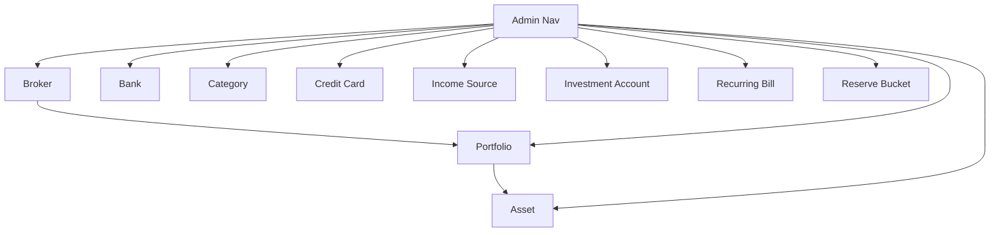

# Admin Entity CRUD

## 1. Executive Summary

Admin Entity CRUD adds a dedicated administration area to Financial, giving the household administrator direct create, read, edit, and delete control over the ten reference-data entities that today can only be created implicitly (through transaction entry) or edited through narrow, partial-update endpoints buried inside unrelated workflows. It introduces a new **Admin** navigation section — separated from the existing Investment and CashFlow sections by a divider at the bottom of the sidebar — with two sub-groups, **Investment** (Assets, Brokers, Portfolios) and **CashFlow** (Banks, Categories, Credit Cards, Income Sources, Investment Accounts, Recurring Bills, Reserve Buckets), each exposing a dedicated screen per entity.

The core value is closing a long-standing gap: Brokers have no API or UI at all today; Categories, Income Sources, Investment Accounts, and Reserve Buckets are read-only; Credit Cards and Recurring Bills only allow editing a subset of their fields; Assets can only be created as a side effect of entering a transaction. Every one of these entities becomes a first-class, fully manageable record, with delete guarded wherever removing it could orphan other data or contradict an entity's own lifecycle rules (empty-portfolio/broker checks, zero-quantity assets, zero-balance investment accounts, in-use references for Banks/Categories/Credit Cards/Income Sources).

At a high level, the feature restructures the sidebar's navigation model on both front ends from a flat two-level tree to a three-level one (new for both `Financial.Web` and `Financial.App`), then ships ten near-identical list-plus-form screens (Fluent `Table`/`DataGrid` for the list, `Dialog` for create/edit/delete-confirm, per `docs/ui/decisions/ADR-003` and `ADR-004`) backed by new or extended Application services, DTOs, and API endpoints in both the Investment and CashFlow bounded contexts.

## 2. Problem and Opportunity

**The Problem**

- **No dedicated place to manage reference data.** Brokers, Categories, Income Sources, Investment Accounts, and Reserve Buckets have zero create/edit/delete UI anywhere in the app; the only way to add one today is a JSON edit or spreadsheet import tool.
- **Partial edits force workarounds.** Credit Card Name, Category's every field, and Recurring Bill's DueDay/Description/Area/Note/NitNumber/MinimumWageValue are all immutable after creation via the API that exists today — fixing a typo means editing the data file directly and restarting the process.
- **No safe way to remove obsolete records.** None of Bank, Category, Credit Card, or Income Source has any delete path, and none has a guard against deleting something still referenced elsewhere — any future delete risks silently orphaning transactions, bills, or snapshots.
- **Asset lifecycle is entry-only.** An asset can only come into existence by recording a transaction against it; there is no way to pre-register an asset's identity (ISIN, ticker, exchange) ahead of the first trade, and the only removal path (Archive) requires the asset to already be fully closed.
- **Inconsistent CRUD maturity across entities.** Recurring Bill has real create/list/update/delete; everything else sits somewhere between "read-only" and "one field editable," making the codebase's own admin surface inconsistent and hard to extend.

**The Opportunity**

- A single **Admin** area gives every reference entity the same shape of screen (list, create, edit, delete), closing the Broker/Category/Income Source/Investment Account/Reserve Bucket gap entirely (Section 2, pain 1) and finally letting the previously-deferred Reserve Bucket "100% split" rule ship (tracked as a known follow-up in this codebase).
- Full-field edit forms (Section 2, pain 2) replace direct data-file editing with a validated, in-app workflow consistent with the rest of the product's Fluent-based forms.
- New reference-check delete guards (Section 2, pain 3) prevent the data-integrity regressions that an unguarded delete would introduce, reusing the same domain-exception-to-409 pattern already established for Portfolio's non-empty check.
- A metadata-only Asset create path (Section 2, pain 4) lets a user register an asset the moment they open a position with a broker, ahead of transaction entry, while Delete reuses the existing Archive rule rather than inventing a second removal concept.
- Extending Recurring Bill's own precedent to the other nine entities (Section 2, pain 5) gives the whole Admin area one consistent CRUD maturity level instead of nine different partial implementations.

## 3. Target Audience

### Primary Users

**Household Financial Administrator**
- The sole user of this self-hosted, single-user application, managing both UK and Brazil investment holdings and household cash flow in one place.
- Currently maintains reference data (adding a new bank, renaming a category, retiring an old broker) by editing the JSON data file directly and restarting the process, per this project's existing persistence model.
- Wants the same Fluent-based, validated, in-app experience for reference-data upkeep that transaction entry and monthly workflows already provide, on both the React web app and the WPF desktop app interchangeably.

## 4. Objectives

**Product Objectives**

- **Eliminate** direct JSON-file editing as the only way to create, rename, or retire a Broker, Category, Income Source, Investment Account, or Reserve Bucket.
- **Unify** CRUD maturity across all ten reference entities so each supports the same four operations (create, read, edit, delete) with the same validation and error-handling shape.
- **Prevent** data-integrity regressions by guarding every delete that could orphan a reference still in use elsewhere.
- **Preserve** existing entity lifecycle rules (Portfolio non-empty check, Asset zero-quantity Archive rule, Reserve Bucket deactivate-only model) rather than replacing them with a conflicting Admin-specific rule.
- **Maintain** full WPF/React parity for every Admin screen, consistent with this project's UX invariant that both front ends ship equivalent user tasks.

**Success Metrics**

- 10 of 10 listed entities have a working Create, Edit, and Delete screen in both Financial.Web and Financial.App, verified by the acceptance criteria in Section 9.
- 0 of the 4 newly-guarded entities (Bank, Category, Credit Card, Income Source) can be deleted from Admin while a live reference to them exists elsewhere in the data, verified by an automated test per entity.
- 100% of existing entity lifecycle invariants (Portfolio empty-check, Asset zero-quantity Archive rule, Reserve Bucket's IsActive-only retirement, Recurring Bill's DueDay 1-31 / non-blank Description validation) continue to pass their existing test suites unmodified after this feature ships.

## 5. User Stories

### F01. Admin Navigation Foundation
- As the administrator, I want an "Admin" entry at the bottom of the sidebar, separated from Investment and CashFlow by a divider, so that I know it's a distinct, secondary area of the app
- As the administrator, I want Admin to expand into "Investment" and "CashFlow" sub-groups, each expanding further into one entry per entity, so that I can reach any entity's management screen directly from the sidebar
- As the administrator, I want the same three-level Admin nav in Financial.App as in Financial.Web, so that I have the same navigation experience on both front ends

### F02. Broker CRUD
- As the administrator, I want to create a new Broker with a Name and Currency so that I can register a new brokerage account before recording any holdings there
- As the administrator, I want to see a list of all Active and Historic Brokers so that I can find the one I want to manage
- As the administrator, I want to edit a Broker's Name and Currency so that I can correct a mistake or update its details
- As the administrator, I want to delete an empty Broker so that stale, unused broker records don't clutter the list
- As the administrator, I want an Active Broker with no Portfolios to move to Historic instead of vanishing when I delete it, so that its history remains available if I ever look for it
- As the administrator, I want deletion blocked with a clear message when a Broker still has Portfolios, so that I don't lose track of holdings by mistake

### F03. Portfolio CRUD
- As the administrator, I want to create a new empty Portfolio under an Active Broker so that I have a place to move or add assets before entering their first transaction
- As the administrator, I want to see all Portfolios grouped by their parent Broker so that I understand the current structure
- As the administrator, I want to rename a Portfolio so that I can correct or clarify its label
- As the administrator, I want to delete an empty Portfolio so that unused structure doesn't linger
- As the administrator, I want deletion blocked with a clear message when a Portfolio still holds Assets, so that I don't lose track of a position by mistake

### F04. Asset CRUD
- As the administrator, I want to register a new Asset's identity (Name, ISIN, Ticker, Exchange, Country, Class) inside a chosen Broker and Portfolio, ahead of its first transaction, so that the asset exists and is selectable when I later enter a trade
- As the administrator, I want to see all Assets across Active Brokers and Portfolios in one list so that I can find the one I want to manage
- As the administrator, I want to edit an Asset's identity fields so that I can correct a mistake made at creation or reflect a ticker/exchange change
- As the administrator, I want to delete (archive) an Asset with zero quantity so that closed-out, no-longer-held assets stop appearing in active views
- As the administrator, I want deletion blocked with a clear message when an Asset still has an open quantity, so that I don't lose track of a live position

### F05. Bank CRUD
- As the administrator, I want to create a new Bank with a Name and round-up setting so that I can start tracking a new bank account
- As the administrator, I want to edit a Bank's Name and round-up setting so that I can correct or update it
- As the administrator, I want to delete a Bank that no longer has any balance history or transactions referencing it so that stale accounts don't clutter the list
- As the administrator, I want deletion blocked with a clear message when a Bank is still referenced by balance history or transactions, so that I don't orphan that data

### F06. Category CRUD
- As the administrator, I want to create a new Category with a Name and its Investment/Tithe/Active flags so that I can classify transactions the way I need
- As the administrator, I want to edit any field of an existing Category so that I can correct or reclassify it
- As the administrator, I want to delete a Category that no longer has any transaction referencing it so that unused categories don't clutter selection lists
- As the administrator, I want deletion blocked with a clear message when a Category is still referenced by a transaction, so that I don't orphan that transaction's classification

### F07. Credit Card CRUD
- As the administrator, I want to create a new Credit Card with a Name, active flag, and next invoice due date so that I can start tracking a new card
- As the administrator, I want to edit any field of an existing Credit Card, including its Name, so that I can correct a mistake
- As the administrator, I want to delete a Credit Card that no longer has any statement or expense referencing it so that closed cards don't clutter the list
- As the administrator, I want deletion blocked with a clear message when a Credit Card is still referenced by a statement or expense, so that I don't orphan that data

### F08. Income Source CRUD
- As the administrator, I want to create a new Income Source with a Name, Group, active flag, and auto-split-to-reserve setting so that I can register a new income stream
- As the administrator, I want to edit any field of an existing Income Source so that I can correct or update it
- As the administrator, I want to delete an Income Source that no longer has any income entry referencing it so that unused sources don't clutter the list
- As the administrator, I want deletion blocked with a clear message when an Income Source is still referenced by an income entry, so that I don't orphan that entry's classification

### F09. Investment Account CRUD
- As the administrator, I want to create a new Investment Account with a Name, active flag, liability flag, and aliases so that I can register a new investment account
- As the administrator, I want to edit any field of an existing Investment Account, including its list of aliases, so that I can correct or update it
- As the administrator, I want to delete an Investment Account only when its latest recorded balance is zero so that I don't lose track of an account that still holds value
- As the administrator, I want deletion blocked with a clear message when an Investment Account's latest snapshot balance is non-zero, so that I don't accidentally lose that account's history

### F10. Recurring Bill CRUD
- As the administrator, I want to create a new Recurring Bill with its due day, description, value, area, note, NIT number, and minimum-wage value so that I can register a new bill
- As the administrator, I want to edit every field of an existing Recurring Bill, not only its status and value, so that I can correct any mistake made at creation
- As the administrator, I want to delete a Recurring Bill so that bills that no longer apply stop appearing every period

### F11. Reserve Bucket CRUD
- As the administrator, I want to create a new Reserve Bucket with a Name and split percentage so that I can register a new savings allocation target
- As the administrator, I want to edit a Reserve Bucket's Name, split percentage, and active flag so that I can adjust my allocation strategy
- As the administrator, I want a warning shown when the active buckets' split percentages don't sum to 100% so that I notice a misconfigured allocation without being blocked from saving
- As the administrator, I want "deleting" a Reserve Bucket to deactivate it rather than remove it so that historical reserve movements linked to it remain valid

## 6. Functionalities

### F01. Admin Navigation Foundation

**Provides:**
- Admin > Investment and Admin > CashFlow route entries and sidebar leaves for each entity screen (used by F02, F03, F04, F05, F06, F07, F08, F09, F10, F11)

**Capabilities:**
- Extends `Financial.Web/src/navigation/navTree.ts` and `Financial.App/Navigation/NavTree.cs` from a 2-level (category → children) to a 3-level (category → sub-group → children) structure, adding one new top-level category (`admin`) with two sub-groups (`investment`, `cashflow`), each listing its own entities as leaves.
- The existing `investments` and `cashflow` top-level categories are unaffected — the 3-level shape only applies under `admin`.
- A visual divider separates the `admin` category from the two existing top-level categories at the bottom of the sidebar, on both platforms.
- Each of the 10 entity leaves under Admin routes to its own dedicated page (one route per entity), consistent with `PAGE_ROUTES`/`RootRedirect` conventions already in place.

**Experience:**
- Collapsed sidebar: hovering/focusing the Admin icon opens the existing flyout pattern (`SidebarFlyout.tsx`), extended to render the two sub-groups and, on expanding a sub-group, its entity leaves.
- Expanded sidebar: clicking "Admin" expands/collapses its two sub-groups inline (standard tree disclosure); clicking a sub-group expands/collapses its entity leaves the same way. Only one branch of the Admin tree needs to be open at a time; state does not need to persist across navigation.
- Active-state highlighting follows the existing pathname-match convention, extended to highlight the correct entity leaf, its parent sub-group, and the Admin category simultaneously when an Admin screen is open.
- WPF: `MainShellViewModel`/the shell's TreeView-equivalent renders the same 3-level structure using the same icon set already cross-referenced between `Sidebar.tsx` and `NavTree.cs`.
- Existing `routes.test.ts`-style sync test is extended to also assert every new Admin leaf has a reachable route.

### F02. Broker CRUD

**Provides:**
- List of Active Brokers (used by F03 to populate the parent-Broker picker on Portfolio create)

**Capabilities:**
- Fields: Name (required, non-blank, unique across all Brokers, Active and Historic), Currency (required, selected from the existing supported-currency set).
- Create adds a new Active Broker with zero Portfolios.
- Edit allows changing both Name and Currency at any time, on both Active and Historic Brokers.
- Delete is only permitted when the Broker has zero Portfolios (mirrors the existing Portfolio-emptiness check style).
  - If the Broker is Active, "Delete" moves it from the Active list to the Historic list instead of removing the record (the same list-membership move already used internally for other Investment archiving flows) — it remains visible and manageable in the Broker list afterward.
  - If the Broker is already Historic, "Delete" permanently removes the record.
- List view distinguishes Active vs. Historic Brokers (e.g., a status column/badge) and supports both in one screen.

**Experience:**
- List: a Fluent `Table` of all Brokers (Name, Currency, status, Portfolio count), with per-row Edit and Delete actions (`TableCellActions`), a "Create Broker" primary action, sortable by Name.
- Create/Edit: a `Dialog` form with Name and Currency fields; Save is disabled while the form is invalid or a save is in flight; validation errors appear inline under the offending field.
- Delete: a confirmation `Dialog` (per `docs/ui/decisions/ADR-003`) stating the Broker's Portfolio count; if zero, the dialog states whether the action will archive (Active → Historic) or permanently remove (Historic) the record before the user confirms; if non-zero, the Delete action is disabled with an inline explanation instead of allowing an attempt that will fail.
- States: initial load, loading, empty ("No brokers yet — create one to get started"), validation error, server error (retry action), saving (disables the dialog's action buttons), success (list refreshes, dialog closes), unsaved-changes warning if the user tries to close a dirty Create/Edit dialog.

**Error Handling:**
- Duplicate Name on create/edit → 409-style inline error: "A broker named '{name}' already exists."
- Delete attempted on a Broker with Portfolios → this state is prevented client-side (action disabled), and the API still enforces it server-side with a 409 and message "Cannot delete a broker that still has portfolios."
- Network/server failure during save → non-blocking error banner in the dialog, entered data preserved, Save re-enabled for retry.

### F03. Portfolio CRUD

**Consumes:**
- F02: list of Active Brokers, for the parent-Broker picker

**Provides:**
- List of Portfolios per Broker (used by F04 to populate the parent-Portfolio picker on Asset create)

**Capabilities:**
- Fields: Name (required, non-blank, unique within its parent Broker), parent Broker (required, selected from Active Brokers only, fixed at creation — Portfolios are not moved between Brokers from this screen).
- Create adds a new empty Portfolio under the chosen Active Broker.
- Edit allows renaming the Portfolio; the parent Broker is not changeable from this screen.
- Delete is only permitted when the Portfolio has zero Assets (reuses the existing `RemoveEmptyPortfolio` domain rule and its 409 mapping).

**Experience:**
- List: a Fluent `Table` grouped or filterable by parent Broker, showing Name, Broker, Asset count, with per-row Edit and Delete actions and a "Create Portfolio" primary action.
- Create: `Dialog` form with a Broker picker (Active Brokers only) and a Name field.
- Edit: `Dialog` form with only the Name field editable.
- Delete: confirmation `Dialog` stating the Portfolio's Asset count; Delete is disabled with an inline explanation when the count is non-zero.
- States: same full set as F02 (initial/loading/empty/validation/server-error/saving/success/disabled/unsaved-changes).

**Error Handling:**
- Duplicate Name within the same Broker → inline error: "A portfolio named '{name}' already exists under this broker."
- Delete attempted on a non-empty Portfolio → disabled client-side; API still enforces the existing 409 ("Cannot delete a portfolio that still holds assets.").
- Network/server failure during save → non-blocking error banner, entered data preserved, Save re-enabled.

### F04. Asset CRUD

**Consumes:**
- F03: list of Portfolios per Broker, for the parent-Portfolio picker

**Capabilities:**
- Fields: Name (required), ISIN (optional, format-validated when present), Exchange (optional), Ticker (optional), Country (required, one of BR/US/UK/Unknown), Class (required, one of the existing `GlobalAssetClass` values — Equity, RealEstate, Bond, Fund, ETF, Cash, Pension, Other, Cryptocurrency, PrivateCredit, Unknown), LocalTypeCode (optional), parent Broker + Portfolio (required, both fixed at creation, both restricted to Active Brokers).
- Create registers the Asset's identity with zero quantity, zero transactions, zero credits, and no price history, inside the chosen Portfolio.
- Edit allows changing all identity fields (Name, ISIN, Exchange, Ticker, Country, Class, LocalTypeCode) regardless of whether the Asset already has transaction history.
- Delete requires the Asset's current Quantity to be exactly zero and performs the existing Archive action (move to Historic), not a permanent removal — consistent with the existing Archive rule and its "still has an open position" guard.

**Experience:**
- List: a Fluent `Table` of Assets across all Active Brokers/Portfolios (Name, Ticker, Broker, Portfolio, Class, Quantity), filterable by Broker/Portfolio/Class, with per-row Edit and Delete(Archive) actions and a "Create Asset" primary action.
- Create: `Dialog` form with Broker picker → Portfolio picker (scoped to the chosen Broker) → identity fields; Class defaults to the same auto-resolution the existing transaction-entry flow uses when left unset, but can be overridden explicitly.
- Edit: `Dialog` form with all identity fields editable; Broker/Portfolio are not changeable from this screen (moving an asset between portfolios remains the existing dedicated Move workflow).
- Delete: confirmation `Dialog` stating the current Quantity and explaining the action archives rather than permanently removes the Asset; disabled with an inline explanation when Quantity is non-zero.
- States: same full set as F02/F03.

**Error Handling:**
- Delete attempted with non-zero Quantity → disabled client-side; API still enforces the existing Archive guard.
- Invalid ISIN format → inline validation error, save blocked.
- Network/server failure during save → non-blocking error banner, entered data preserved, Save re-enabled.

### F05. Bank CRUD

**Capabilities:**
- Fields: Name (required, non-blank, unique), RoundUpEnabled (boolean, default false).
- Create adds a new Bank; OpeningBalance/OpeningBalanceDate remain set through the existing dedicated balance-adjustment flow, not this screen.
- Edit allows changing Name and RoundUpEnabled (both currently locked via the existing partial-update endpoint).
- Delete is only permitted when the Bank has zero balance-adjustment records and zero transactions referencing it.

**Experience:**
- List: Fluent `Table` (Name, RoundUpEnabled, current balance) with per-row Edit/Delete and a "Create Bank" primary action.
- Create/Edit: `Dialog` form with Name and a RoundUpEnabled toggle.
- Delete: confirmation `Dialog`; disabled with an inline explanation ("This bank has balance history and cannot be deleted") when references exist.
- States: full set as above.

**Error Handling:**
- Duplicate Name → inline error: "A bank named '{name}' already exists."
- Delete blocked by references → 409 with message "Cannot delete a bank that still has balance history or transactions."
- Network/server failure during save → non-blocking error banner, entered data preserved.

### F06. Category CRUD

**Capabilities:**
- Fields: Name (required, non-blank, unique), Active (boolean), IsInvestment (boolean), IsTithe (boolean).
- Create adds a new Category with all four fields set at creation.
- Edit allows changing all four fields (the existing API is currently read-only for all of them).
- Delete is only permitted when zero transactions reference the Category.

**Experience:**
- List: Fluent `Table` (Name, Active, IsInvestment, IsTithe) with per-row Edit/Delete and a "Create Category" primary action, filterable by Active.
- Create/Edit: `Dialog` form with a Name field and three toggles.
- Delete: confirmation `Dialog`; disabled with an inline explanation when the Category is still referenced by a transaction.
- States: full set as above.

**Error Handling:**
- Duplicate Name → inline error: "A category named '{name}' already exists."
- Delete blocked by references → 409 with message "Cannot delete a category that is still used by a transaction."
- Network/server failure during save → non-blocking error banner, entered data preserved.

### F07. Credit Card CRUD

**Capabilities:**
- Fields: Name (required, non-blank, unique — newly editable; currently immutable), IsActive (boolean), NextInvoiceDueDate (date).
- Create adds a new Credit Card.
- Edit allows changing all three fields, including Name (superseding the existing "Name is immutable via this endpoint" restriction).
- Delete is only permitted when zero statements or expenses reference the Credit Card.

**Experience:**
- List: Fluent `Table` (Name, IsActive, NextInvoiceDueDate) with per-row Edit/Delete and a "Create Credit Card" primary action.
- Create/Edit: `Dialog` form with Name, an Active toggle, and a due-date picker.
- Delete: confirmation `Dialog`; disabled with an inline explanation when the card is still referenced by a statement or expense.
- States: full set as above.

**Error Handling:**
- Duplicate Name → inline error: "A credit card named '{name}' already exists."
- Delete blocked by references → 409 with message "Cannot delete a credit card that is still referenced by a statement or expense."
- Network/server failure during save → non-blocking error banner, entered data preserved.

### F08. Income Source CRUD

**Capabilities:**
- Fields: Name (required, non-blank, unique), IsActive (boolean), Group (one of the existing `IncomeGroup` values — Salary, DividendoJuros, NonReportable), AutoSplitToReserve (boolean).
- Create adds a new Income Source with all fields set at creation.
- Edit allows changing all fields (the existing API is currently read-only).
- Delete is only permitted when zero income entries reference the Income Source.

**Experience:**
- List: Fluent `Table` (Name, Group, IsActive, AutoSplitToReserve) with per-row Edit/Delete and a "Create Income Source" primary action.
- Create/Edit: `Dialog` form with Name, a Group dropdown, and two toggles.
- Delete: confirmation `Dialog`; disabled with an inline explanation when the source is still referenced by an income entry.
- States: full set as above.

**Error Handling:**
- Duplicate Name → inline error: "An income source named '{name}' already exists."
- Delete blocked by references → 409 with message "Cannot delete an income source that is still used by an income entry."
- Network/server failure during save → non-blocking error banner, entered data preserved.

### F09. Investment Account CRUD

**Capabilities:**
- Fields: Name (required, non-blank, unique), IsActive (boolean), IsLiability (boolean), Aliases (list of strings, deduplicated case-insensitively — reuses the existing `AddAlias` dedup rule).
- Create adds a new Investment Account with all fields set at creation.
- Edit allows changing all fields, including adding/removing Aliases (the existing API is currently read-only and does not even expose Aliases in its DTO — this is extended as part of this feature).
- Delete is only permitted when the Investment Account's most recent `InvestmentSnapshot` (by Year, Month) has a Value of exactly 0; an account with no snapshot recorded yet is treated as 0 and is deletable.

**Experience:**
- List: Fluent `Table` (Name, IsActive, IsLiability, latest recorded balance) with per-row Edit/Delete and a "Create Investment Account" primary action.
- Create/Edit: `Dialog` form with Name, two toggles, and a tag-style multi-value input for Aliases.
- Delete: confirmation `Dialog` stating the account's latest recorded balance; disabled with an inline explanation ("This account's latest balance is {value}, not zero") when non-zero.
- States: full set as above.

**Error Handling:**
- Duplicate Name → inline error: "An investment account named '{name}' already exists."
- Delete blocked by non-zero balance → 409 with message "Cannot delete an investment account with a non-zero balance."
- Network/server failure during save → non-blocking error banner, entered data preserved.

### F10. Recurring Bill CRUD

**Capabilities:**
- Fields: DueDay (required, integer 1-31), Description (required, non-blank), Value (decimal), Area (one of the existing values — Brasil, UK), Note (optional text), NitNumber (optional string), MinimumWageValue (optional decimal), Status (Unset/Scheduled/Paid, editable here alongside every other field, unlike the existing Status+Value-only update path).
- Create behaves as today (existing `POST` endpoint), validating DueDay range and non-blank Description.
- Edit is extended from "Status and Value only" to every field listed above.
- Delete behaves exactly as today — no new guard is added; a Recurring Bill can be deleted regardless of its Status.

**Experience:**
- List: Fluent `Table` (DueDay, Description, Value, Area, Status) with per-row Edit/Delete and a "Create Recurring Bill" primary action, sortable by DueDay.
- Create/Edit: `Dialog` form with all seven fields; Status defaults to Unset on create and is a dropdown on edit.
- Delete: confirmation `Dialog` with no additional restriction beyond the standard confirm/cancel.
- States: full set as above.

**Error Handling:**
- DueDay outside 1-31, or blank Description → inline validation error, save blocked.
- Network/server failure during save → non-blocking error banner, entered data preserved.

### F11. Reserve Bucket CRUD

**Capabilities:**
- Fields: Name (required, non-blank, unique), SplitPercentage (decimal, 0-100 inclusive, existing per-bucket guard reused), IsActive (boolean).
- Create adds a new active or inactive Reserve Bucket.
- Edit allows changing all three fields (the existing API is currently read-only).
- "Delete" sets IsActive to false rather than removing the record — no hard delete exists or is added, since a `ReserveMovement` holds a permanent, non-nullable reference to its Bucket.
- On Create and Edit, the sum of `SplitPercentage` across all currently-Active buckets (including the one being saved) is computed; if it does not equal 100%, the save still succeeds but a non-blocking warning is returned and shown, naming the actual total (e.g., "Active buckets currently sum to 85% — review your split percentages"). This reuses the existing nullable `Warning`-field DTO pattern already established for non-blocking CashFlow business rules.

**Experience:**
- List: Fluent `Table` (Name, SplitPercentage, IsActive) with per-row Edit/"Delete" (deactivate) and a "Create Reserve Bucket" primary action; a persistent banner above the table shows the current active-bucket split total whenever it isn't 100%.
- Create/Edit: `Dialog` form with Name, a percentage input (0-100), and an Active toggle; on Save, if the returned `Warning` is non-null, it's shown as a non-blocking inline notice rather than blocking dialog close.
- "Delete": confirmation `Dialog` explicitly stating the action deactivates rather than removes the bucket, and that existing reserve movements linked to it remain valid.
- States: full set as above (no distinct "hard delete" success/error path since deactivate reuses the Edit save flow).

**Error Handling:**
- Duplicate Name → inline error: "A reserve bucket named '{name}' already exists."
- SplitPercentage outside 0-100 → inline validation error, save blocked.
- Network/server failure during save → non-blocking error banner, entered data preserved.

## 7. Out of Scope

**Navigation**
- Reordering, renaming, or otherwise redesigning the existing top-level Investment/CashFlow nav categories.
- Any role-based or permission-gated visibility of the Admin area — this remains a single-user application with no access control.
- Persisting sidebar expand/collapse state across sessions.

**Entity behavior**
- Moving a Portfolio between Brokers, or moving an Asset between Portfolios/Brokers, from these screens — the existing dedicated Move workflow is unchanged and out of scope here.
- Merging duplicate records (e.g. merging two Categories, or two Income Sources) — Admin only creates, edits, and deletes single records.
- Bulk import/export of any entity through the Admin area — the existing spreadsheet import tools are unaffected and remain the bulk-loading path.
- Any change to Bank OpeningBalance/OpeningBalanceDate or Investment Account InvestmentSnapshot values — those remain owned by their existing dedicated balance-adjustment and snapshot workflows, not the Admin entity screens.
- True hard-delete for Reserve Buckets, or any migration of existing `ReserveMovement` records to support one.
- A hard block (rather than a non-blocking warning) on Reserve Buckets not summing to 100%.
- Undo/restore for any deletion, including the Broker Active→Historic archive move.
- Audit logging or change history for Admin edits/deletes.

**Cross-cutting**
- Any change to authentication or authorization — none exists in this single-user app and none is introduced here.
- Performance work for very large entity lists (e.g. thousands of Assets) beyond what the existing Fluent `Table`/`DataGrid` components already provide.

## 8. Dependency Graph

| # | Feature | Priority | Dependencies |
|---|---------|----------|--------------|
| F01 | Admin Navigation Foundation | 1 | None |
| F02 | Broker CRUD | 1 | F01 |
| F05 | Bank CRUD | 1 | F01 |
| F06 | Category CRUD | 1 | F01 |
| F07 | Credit Card CRUD | 1 | F01 |
| F08 | Income Source CRUD | 1 | F01 |
| F09 | Investment Account CRUD | 1 | F01 |
| F10 | Recurring Bill CRUD | 1 | F01 |
| F11 | Reserve Bucket CRUD | 1 | F01 |
| F03 | Portfolio CRUD | 1 | F01, F02 |
| F04 | Asset CRUD | 1 | F01, F03 |

### Foundation Features
These features set up shared project infrastructure. In a greenfield project they must be implemented sequentially before or alongside any feature that depends on them:
- **F01 Admin Navigation Foundation** — extends the sidebar's nav-tree data model and rendering (React and WPF) from 2 to 3 levels, adds the Admin routes/leaves every other feature in this PRD registers into.

### Execution Waves
Features within the same wave can be built in parallel. A wave starts only after every feature in earlier waves is complete.

**Note:** Foundation features (see "Foundation Features" above) cannot run in parallel in a greenfield project even if they appear together in a wave — they share scaffolding files and must be implemented sequentially until the base is in place.

- **Wave 1**: F01
- **Wave 2**: F02, F05, F06, F07, F08, F09, F10, F11
- **Wave 3**: F03
- **Wave 4**: F04

### Priority levels
- **1** = Essential — product does not work without it
- **2** = Important — significant value addition
- **3** = Desirable — incremental improvement

## 9. Acceptance Criteria

### F01. Admin Navigation Foundation
- [x] Sidebar shows "Admin" as a distinct entry at the bottom, separated from Investment/CashFlow by a visible divider, on both Financial.Web and Financial.App
- [x] Expanding Admin reveals exactly two sub-groups: Investment and CashFlow
- [x] Expanding Investment reveals Assets, Brokers, Portfolios; expanding CashFlow reveals Banks, Categories, Credit Cards, Income Sources, Investment Accounts, Recurring Bills, Reserve Buckets
- [x] Clicking any entity leaf navigates to that entity's dedicated Admin page/view on both platforms
- [x] The existing Investment/CashFlow top-level categories and their children are unchanged in behavior and appearance
- [x] The nav-route sync test (extended for Admin) passes, confirming every Admin leaf has a reachable route

### F02. Broker CRUD
- [x] Creating a Broker with a unique Name and valid Currency succeeds and the new Broker appears in the list as Active
- [x] Creating a Broker with a Name that already exists (Active or Historic) fails with an inline duplicate-name error
- [x] Editing an existing Broker's Name and/or Currency persists the change and is reflected in the list
- [x] Deleting an Active Broker with zero Portfolios moves it to the Historic list rather than removing it
- [x] Deleting a Historic Broker with zero Portfolios permanently removes it from the list
- [x] Attempting to delete a Broker (Active or Historic) that has one or more Portfolios is blocked, both client-side (disabled action) and server-side (409 response)

### F03. Portfolio CRUD
- [x] Creating a Portfolio requires selecting an Active Broker; Historic Brokers do not appear in the picker
- [x] Creating a Portfolio with a unique-within-Broker Name succeeds and appears under the correct Broker in the list
- [x] Creating a Portfolio with a Name that duplicates another Portfolio under the same Broker fails with an inline error; the same Name under a different Broker succeeds
- [x] Renaming an existing Portfolio persists the change
- [x] Deleting a Portfolio with zero Assets succeeds and removes it from the list
- [x] Attempting to delete a Portfolio with one or more Assets is blocked, both client-side and server-side (409 response), consistent with the existing non-empty-portfolio rule

### F04. Asset CRUD
- [x] Creating an Asset requires selecting an Active Broker and one of its Portfolios; the new Asset appears in that Portfolio with zero Quantity and no transactions
- [x] Editing an existing Asset's Name, ISIN, Exchange, Ticker, Country, Class, and/or LocalTypeCode persists the change regardless of whether the Asset has transaction history
- [x] Deleting (archiving) an Asset with zero Quantity succeeds and the Asset no longer appears in active-portfolio views
- [x] Attempting to delete an Asset with a non-zero Quantity is blocked, both client-side and server-side, consistent with the existing Archive rule
- [x] An invalid ISIN format is rejected with an inline validation error before save

### F05. Bank CRUD
- [x] Creating a Bank with a unique Name succeeds and appears in the list
- [x] Creating a Bank with a duplicate Name fails with an inline error
- [x] Editing an existing Bank's Name and RoundUpEnabled persists the change
- [x] Deleting a Bank with zero balance-adjustment records and zero referencing transactions succeeds
- [x] Attempting to delete a Bank that has balance-adjustment records or referencing transactions is blocked with a 409 response and a clear message

### F06. Category CRUD
- [x] Creating a Category with a unique Name and any combination of Active/IsInvestment/IsTithe succeeds
- [x] Editing any of a Category's four fields persists the change
- [x] Deleting a Category with zero referencing transactions succeeds
- [x] Attempting to delete a Category that is referenced by at least one transaction is blocked with a 409 response and a clear message

### F07. Credit Card CRUD
- [x] Creating a Credit Card with a unique Name succeeds
- [x] Editing an existing Credit Card's Name, IsActive, and/or NextInvoiceDueDate persists the change, including changing the Name (previously immutable)
- [x] Deleting a Credit Card with zero referencing statements/expenses succeeds
- [x] Attempting to delete a Credit Card referenced by a statement or expense is blocked with a 409 response and a clear message

### F08. Income Source CRUD
- [ ] Creating an Income Source with a unique Name, Group, IsActive, and AutoSplitToReserve succeeds
- [ ] Editing any of an Income Source's four fields persists the change
- [ ] Deleting an Income Source with zero referencing income entries succeeds
- [ ] Attempting to delete an Income Source referenced by an income entry is blocked with a 409 response and a clear message

### F09. Investment Account CRUD
- [ ] Creating an Investment Account with a unique Name, IsActive, IsLiability, and any number of Aliases succeeds
- [ ] Editing an existing account's Name, IsActive, IsLiability, and Aliases (add and remove) persists the change
- [ ] Deleting an account whose most recent InvestmentSnapshot Value is 0, or which has no snapshot at all, succeeds
- [ ] Attempting to delete an account whose most recent InvestmentSnapshot Value is non-zero is blocked with a 409 response and a clear message stating the current balance

### F10. Recurring Bill CRUD
- [ ] Creating a Recurring Bill with a valid DueDay (1-31) and non-blank Description succeeds, matching existing validation
- [ ] Editing DueDay, Description, Value, Area, Note, NitNumber, MinimumWageValue, and/or Status all persist independently (not just Status/Value as today)
- [ ] Deleting a Recurring Bill succeeds regardless of its current Status, matching existing unrestricted delete behavior

### F11. Reserve Bucket CRUD
- [ ] Creating a Reserve Bucket with a unique Name and SplitPercentage between 0 and 100 succeeds
- [ ] Editing a Reserve Bucket's Name, SplitPercentage, and/or IsActive persists the change
- [ ] Saving a Create or Edit that leaves active buckets summing to something other than 100% still succeeds and returns/displays a non-blocking warning naming the actual total
- [ ] "Deleting" a Reserve Bucket sets IsActive to false and does not remove the record; any existing ReserveMovement referencing it remains valid and unaffected

### Cross-Feature Integration
- [x] A Broker created or left Active in F02 (with zero Portfolios) is selectable as the parent Broker when creating a Portfolio in F03
- [x] A Broker moved to Historic in F02 is excluded from the parent-Broker picker in F03
- [x] A Portfolio created in F03 (under an Active Broker) is selectable as the parent Portfolio when creating an Asset in F04, scoped correctly to its parent Broker
- [x] A Portfolio that already holds an Asset (via F04) cannot be deleted from F03 until that Asset is removed/archived
