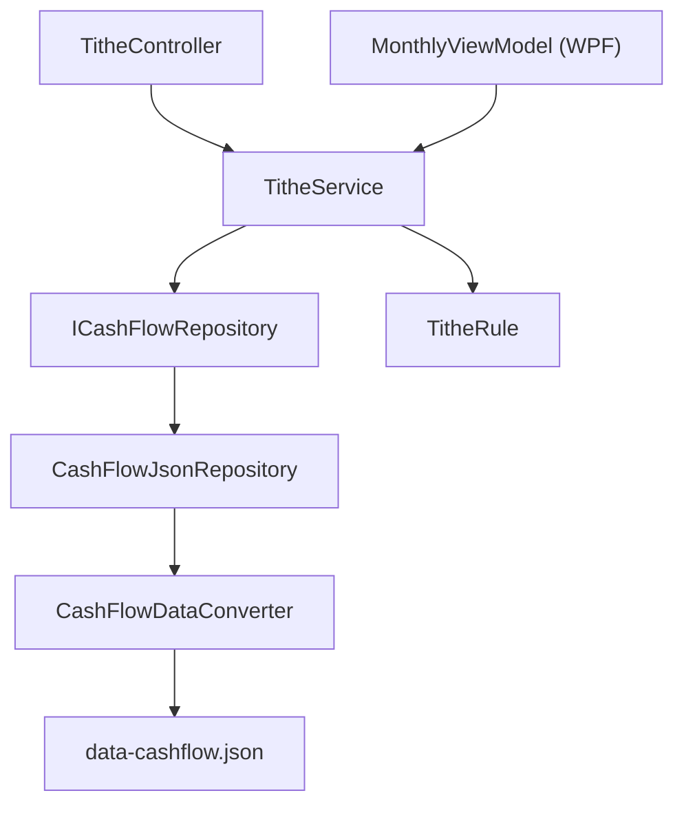

## 1. Technical Overview

**What:** Add a persisted `TitheCarryForward` decision per month (Year, Month, Amount, Included) to the CashFlow bounded context, resolved lazily inside `TitheService.GetTitheSummary`, extending `TitheBalance` to silently include a cascading previous-month carry-in by default, with a toggle endpoint to include/exclude it and a one-time auto-anchored boundary that prevents any historical backfill.

**Why:** `TitheService` today is entirely stateless — every call recomputes `CalculatedTithe`/`TitheBalance` purely from that month's `Income`/`Expense` records, with zero persistence and zero cross-month memory. Delivering PRD F01's carry-forward requirement means introducing the first piece of persisted Tithe state, without disturbing the existing pure 10%-of-income calculation.

**Scope:**
- Included: `TitheCarryForward` domain entity and its collection on `CashFlowData`; the one-time `TitheCarryForwardEffectiveFrom` anchor; the lazy resolve-and-snapshot algorithm inside `TitheService`; the new toggle endpoint; the DTO/API contract changes; the existing-caller compatibility fix in `Financial.App`'s `MonthlyViewModel` (needed purely to keep the app compiling against the new async signature — no new WPF UI).
- Excluded: any new checkbox/UI rendering in Web or WPF (PRD F02), the Reserve Bucket income split, credit for overpaid months, historical backfill, notifications.

## 2. Architecture Impact

**Affected components:**
- `Financial.CashFlow.Domain\Entities\TitheCarryForward.cs` — new
- `Financial.CashFlow.Domain\Entities\CashFlowData.cs` — modified
- `Financial.CashFlow.Application\Interfaces\ICashFlowRepository.cs` — modified
- `Financial.CashFlow.Infrastructure\Repositories\CashFlowJsonRepository.cs` — modified
- `Financial.CashFlow.Infrastructure\Persistence\CashFlowDataConverter.cs` — modified
- `Financial.CashFlow.Application\DTOs\TitheSummaryDTO.cs` — modified
- `Financial.CashFlow.Application\DTOs\TitheCarryForwardDTO.cs` — new
- `Financial.CashFlow.Application\DTOs\TitheCarryForwardUpdateDTO.cs` — new
- `Financial.CashFlow.Application\Exceptions\TitheCarryForwardUnavailableException.cs` — new
- `Financial.CashFlow.Application\Interfaces\ITitheService.cs` — modified
- `Financial.CashFlow.Application\Services\TitheService.cs` — modified
- `Financial.Api\Controllers\TitheController.cs` — modified
- `Financial.App\ViewModels\CashFlow\MonthlyViewModel.cs` — modified (call-site compatibility only)
- `data\data-cashflow.example.json` — modified
- `Tests\Financial.CashFlow.Domain.Tests\Entities\TitheCarryForwardTests.cs` — new
- `Tests\Financial.CashFlow.Domain.Tests\Entities\CashFlowDataTests.cs` — modified
- `Tests\Financial.CashFlow.Application.Tests\Services\TitheServiceTests.cs` — modified
- `Tests\Financial.CashFlow.Infrastructure.Tests\Repositories\CashFlowJsonRepositoryTests.cs` — modified
- `Tests\Financial.CashFlow.Infrastructure.Tests\Persistence\CashFlowSerializerAdapterTests.cs` — modified
- `Tests\Financial.CashFlow.Infrastructure.Tests\Persistence\ExampleDataFileTests.cs` — modified
- `Tests\Financial.Api.Tests\TitheEndpointsTests.cs` — modified
- `Tests\Financial.Presentation.Tests\ViewModels\CashFlow\MonthlyViewModelTests.cs` — modified



## 3. Technical Decisions

| Decision | Chosen Approach | Alternative Considered | Trade-off |
|---|---|---|---|
| Resolution trigger | Lazy-resolve inside `GetTitheSummaryAsync` (made async); the first read of a month idempotently persists that month's carry-forward decision | Resolve on the first Income/Expense write for that month instead | Accepts a GET causing a one-time write; single call site, simplest — acceptable for a single-user local JSON store with no real read/write concurrency |
| Launch boundary | `CashFlowData.TitheCarryForwardEffectiveFrom` (nullable, month-truncated) is set once, automatically, the first time it is read as unset, to the current date | Explicit config value set manually at deploy | Self-configuring, no deploy step required, but the exact anchor month depends on when the code first executes post-upgrade rather than a deliberately chosen date |
| Carry-forward amount storage | Full snapshot persisted per month (`Year`, `Month`, `Amount`, `Included`) only when a positive candidate exists | Sparse "opt-out only" flags with the amount always recomputed live | More storage (one record per month with a positive carry-in), but satisfies the PRD's snapshot/immutability requirement — later edits to a source month never retroactively change an already-resolved carry-in |
| API response shape | Nested nullable `TitheSummaryDTO.CarryForward` object (`Amount`, `Included`, `FromYear`, `FromMonth`) | Flat sibling fields on `TitheSummaryDTO` | Slightly more nesting, but groups the related fields and makes "nothing to carry" a single null check on the client |
| Toggle-on-unavailable-month behavior | Throw `TitheCarryForwardUnavailableException`, mapped to 400 Bad Request | Silent 204 no-op | Surfaces a client bug (toggling a control that shouldn't be visible) instead of hiding it |

## 4. Component Overview

**Backend:**

| File Path | New/Modified | Purpose | Key Responsibilities |
|---|---|---|---|
| `Financial.CashFlow.Domain\Entities\TitheCarryForward.cs` | New | Persisted per-month carry-forward decision | `Year`/`Month`/`Amount` (immutable snapshot) + `Included` (mutable); `Create(year, month, amount)` factory defaults `Included = true`; `SetIncluded(bool)` toggles it; validates `1 <= month <= 12` and `amount > 0` |
| `Financial.CashFlow.Domain\Entities\CashFlowData.cs` | Modified | Aggregate root for the JSON document | Adds `List<TitheCarryForward>` backing field + `IReadOnlyCollection<TitheCarryForward> TitheCarryForwards`, `AddTitheCarryForward(...)`; adds nullable `TitheCarryForwardEffectiveFrom` (`DateOnly?`) with a set-once accessor |
| `Financial.CashFlow.Application\Interfaces\ICashFlowRepository.cs` | Modified | Repository contract | Adds `GetTitheCarryForwards()`, `AddTitheCarryForward(TitheCarryForward)`, `GetTitheCarryForwardEffectiveFrom()`, `SetTitheCarryForwardEffectiveFrom(DateOnly)` |
| `Financial.CashFlow.Infrastructure\Repositories\CashFlowJsonRepository.cs` | Modified | Repository implementation | Thin pass-through to the new `CashFlowData` members, following the existing `ReserveBucket` pass-through pattern |
| `Financial.CashFlow.Infrastructure\Persistence\CashFlowDataConverter.cs` | Modified | JSON (de)serialization | `Read`: deserializes `"TitheCarryForwards"` via `DeserializeCollection<TitheCarryForward>` (missing → `[]`, no migration needed) and an optional `"TitheCarryForwardEffectiveFrom"` date string (missing → `null`). `Write`: emits both, mirroring the `ReserveBuckets` collection-write shape |
| `Financial.CashFlow.Application\DTOs\TitheSummaryDTO.cs` | Modified | Existing read DTO | Adds `public TitheCarryForwardDTO? CarryForward { get; init; }` (null when no carry-in is available) |
| `Financial.CashFlow.Application\DTOs\TitheCarryForwardDTO.cs` | New | Nested carry-forward read shape | `required decimal Amount`, `required bool Included`, `required int FromYear`, `required int FromMonth` |
| `Financial.CashFlow.Application\DTOs\TitheCarryForwardUpdateDTO.cs` | New | Toggle request body | `required bool Included` |
| `Financial.CashFlow.Application\Exceptions\TitheCarryForwardUnavailableException.cs` | New | Business-rule exception | Thrown by the toggle path when no carry-forward record exists for the requested month; follow the existing `DuplicateNameException` shape and register it in the same centralized exception→status-code mapping (400) |
| `Financial.CashFlow.Application\Interfaces\ITitheService.cs` | Modified | Service contract | `GetTitheSummary` → `Task<TitheSummaryDTO> GetTitheSummaryAsync(int year, int month)`; adds `Task<TitheSummaryDTO> UpdateCarryForwardInclusionAsync(int year, int month, bool included)` |
| `Financial.CashFlow.Application\Services\TitheService.cs` | Modified | Core calculation + resolution | Implements the resolution/cascading algorithm (see below); reuses `TitheRule` unchanged for `CalculatedTithe`; keeps the existing span/log/try-catch template |
| `Financial.Api\Controllers\TitheController.cs` | Modified | HTTP surface | Existing GET action becomes `async`; adds `[HttpPut("month/{year:int}/{month:int}/carry-forward")]` calling `UpdateCarryForwardInclusionAsync` |
| `Financial.App\ViewModels\CashFlow\MonthlyViewModel.cs` | Modified | WPF month load | Updates its existing `_titheService.GetTitheSummary(...)` call site to `await _titheService.GetTitheSummaryAsync(...)`, dropping the `Task.Run` wrapper now that the call is genuinely asynchronous I/O rather than a wrapped synchronous computation. No new bound properties yet (F02's job) |

**Data:**

| File Path | New/Modified | Purpose |
|---|---|---|
| `data\data-cashflow.example.json` | Modified | Adds `"TitheCarryForwards": []` and `"TitheCarryForwardEffectiveFrom": null` at the document root, alongside the existing collections |

**Resolution algorithm (`TitheService.GetTitheSummaryAsync`):**

1. Validate `1 <= month <= 12`; throw `ArgumentException` otherwise.
2. If `CashFlowData.TitheCarryForwardEffectiveFrom` is unset, set it to `DateOnly.FromDateTime(DateTime.Today)` truncated to the 1st of the month, and persist that single change.
3. Compute this month's base figures exactly as today: `calculatedTithe = TitheRule.CalculateTithe(sum of NetValue for this month's Incomes)`, `dizimoTotal = sum of Value for this month's Expenses where Category.IsTithe && CountsAsTithe`, `baseBalance = calculatedTithe - dizimoTotal`.
4. Determine the carry-in candidate for this month:
   - If this month's (Year, Month) is on or before `TitheCarryForwardEffectiveFrom`, no carry-in is possible — skip to step 6 with no record.
   - Otherwise, resolve the previous month's fully adjusted Tithe Balance: if the previous month is on or before `TitheCarryForwardEffectiveFrom`, that adjusted balance is simply its own `baseBalance` (recomputed the same way as step 3, for that month); otherwise, recursively ensure the previous month's own `TitheCarryForward` record exists (creating it via this same algorithm if not yet resolved) and use `previousBaseBalance + (previous record.Included ? previous record.Amount : 0)`.
5. If the resolved candidate amount is greater than zero and no `TitheCarryForward` record exists yet for this month, create one (`Amount = candidate`, `Included = true`) and stage it for persistence.
6. `TitheBalance = baseBalance + (this month's record exists && record.Included ? record.Amount : 0)` — no clamping, same as today.
7. Persist any newly created record(s) from steps 2 and 5 via a single `ApplyAndSaveAsync` call before returning.
8. Map to `TitheSummaryDTO`, with `CarryForward` populated from this month's record (if any) — `FromYear`/`FromMonth` are simply this month minus one.

**`UpdateCarryForwardInclusionAsync(year, month, included)`:**

1. Validate `1 <= month <= 12`; throw `ArgumentException` otherwise.
2. Look up the existing `TitheCarryForward` record for `(year, month)`. If none exists, throw `TitheCarryForwardUnavailableException`.
3. Call `record.SetIncluded(included)`, persist via `ApplyAndSaveAsync`.
4. Return the result of re-running `GetTitheSummaryAsync(year, month)` so the response reflects the updated `TitheBalance`.

## 5. API Contracts

**Endpoint: Get Tithe Summary (existing, response shape extended)**
- **Method:** GET
- **Path:** `/api/v1/financial/tithe/month/{year}/{month}`
- **Authentication:** None (single-user local app, consistent with the rest of the API)

**Response (Success - 200):**

| Field | Type | Description |
|---|---|---|
| `calculatedTithe` | `decimal` | 10% of the month's net income — unchanged by carry-forward |
| `titheBalance` | `decimal` | `calculatedTithe` minus paid Dizimo expenses, plus the carried-in amount when included |
| `carryForward` | `object \| null` | Present only when a positive carry-in was available for this month |
| `carryForward.amount` | `decimal` | The snapshotted amount available to carry in |
| `carryForward.included` | `bool` | Whether it currently counts toward `titheBalance` |
| `carryForward.fromYear` | `int` | Source month's year |
| `carryForward.fromMonth` | `int` | Source month's month |

**Response Example (with carry-forward):**
```json
{
  "calculatedTithe": 500.00,
  "titheBalance": 470.00,
  "carryForward": {
    "amount": 50.00,
    "included": true,
    "fromYear": 2026,
    "fromMonth": 8
  }
}
```

**Response Example (no carry-forward available):**
```json
{
  "calculatedTithe": 500.00,
  "titheBalance": 420.00,
  "carryForward": null
}
```

**Endpoint: Update Carry-Forward Inclusion**
- **Method:** PUT
- **Path:** `/api/v1/financial/tithe/month/{year}/{month}/carry-forward`
- **Authentication:** None

**Request:**

| Field | Type | Required | Validation | Description |
|---|---|---|---|---|
| `included` | `bool` | Yes | — | Whether the previous month's carry-in should count toward this month's Tithe Balance |

**Request Example:**
```json
{
  "included": false
}
```

**Response (Success - 200):** Same shape as the GET response above, reflecting the updated `titheBalance`.

**Error Codes:**

| Code | HTTP Status | Description |
|---|---|---|
| — | 400 | `year`/`month` out of range, or no carry-forward record exists for the requested month |

## 6. Data Model

This project persists CashFlow state as a single JSON document (`data-cashflow.json`), not a relational database — there is no SQL migration. New top-level members are additive; `CashFlowDataConverter.Read` already treats a missing property as its empty/default value, so existing data files need no migration tool step (confirmed pattern: `Expense.CountsAsTithe` and `Income.Description` shipped the same way).

**New root-level JSON members:**

| Member | Type | Default when absent | Description |
|---|---|---|---|
| `TitheCarryForwards` | array of objects | `[]` | One entry per month that has ever had a positive carry-in candidate |
| `TitheCarryForwardEffectiveFrom` | ISO date string \| `null` | `null` | Set once, automatically, to the first-of-month of "today" the first time the app runs this code against the data file |

**`TitheCarryForwards[]` entry shape:**

| Field | Type | Nullable | Description |
|---|---|---|---|
| `Year` | `int` | No | Calendar year of the month this decision belongs to |
| `Month` | `int` | No | Calendar month (1-12) this decision belongs to |
| `Amount` | `decimal` | No | Snapshotted candidate amount, fixed at creation time |
| `Included` | `bool` | No | Whether it currently counts toward that month's Tithe Balance; defaults `true` at creation, freely toggleable afterward |

**Uniqueness:** at most one `TitheCarryForwards` entry per `(Year, Month)` pair — enforced in `TitheService` (it only ever creates a record when none already exists for that month), not by a JSON-level constraint, consistent with how this document has no schema-level constraints today.

## 7. Testing Strategy

| Test File | Test Type | Target | Coverage Goal |
|---|---|---|---|
| `Tests\Financial.CashFlow.Domain.Tests\Entities\TitheCarryForwardTests.cs` | Unit | `TitheCarryForward` | Create/validation/`SetIncluded` |
| `Tests\Financial.CashFlow.Domain.Tests\Entities\CashFlowDataTests.cs` | Unit | `CashFlowData` | `AddTitheCarryForward`, `TitheCarryForwardEffectiveFrom` set-once semantics |
| `Tests\Financial.CashFlow.Application.Tests\Services\TitheServiceTests.cs` | Unit | `TitheService` | Resolution/cascading algorithm, snapshot immutability, effective-from boundary, toggle behavior |
| `Tests\Financial.CashFlow.Infrastructure.Tests\Repositories\CashFlowJsonRepositoryTests.cs` | Unit | `CashFlowJsonRepository` | New pass-through methods |
| `Tests\Financial.CashFlow.Infrastructure.Tests\Persistence\CashFlowSerializerAdapterTests.cs` | Unit | `CashFlowDataConverter` | Round-trip serialization of `TitheCarryForwards` and `TitheCarryForwardEffectiveFrom`, including a legacy document missing both |
| `Tests\Financial.CashFlow.Infrastructure.Tests\Persistence\ExampleDataFileTests.cs` | Unit | `data-cashflow.example.json` | New members present and deserialize cleanly |
| `Tests\Financial.Api.Tests\TitheEndpointsTests.cs` | Integration | `TitheController` | GET reflects carry-forward, PUT toggles it, 400 on invalid month / unavailable carry-forward |
| `Tests\Financial.Presentation.Tests\ViewModels\CashFlow\MonthlyViewModelTests.cs` | Unit | `MonthlyViewModel` | Existing tests pass against the new async signature |

**Key test scenarios for `TitheServiceTests`:**

| Test Function | Description | Assertions |
|---|---|---|
| `GetTitheSummaryAsync_PreviousMonthPositiveBalance_CarriesInByDefault` | Previous month left an unpaid balance | `TitheBalance` includes it; `CarryForward.Included == true` |
| `GetTitheSummaryAsync_PreviousMonthZeroOrNegativeBalance_NoCarryForward` | Previous month settled or overpaid | `CarryForward == null`; `TitheBalance` unaffected |
| `GetTitheSummaryAsync_CalculatedTithe_NeverIncludesCarriedAmount` | Any carry-in scenario | `CalculatedTithe` always equals pure 10% of income |
| `UpdateCarryForwardInclusionAsync_SetIncludedFalse_RemovesFromBalanceAndPersists` | User unchecks | `TitheBalance` drops by the carried amount; re-fetch reflects it |
| `UpdateCarryForwardInclusionAsync_ReIncludeAfterExclude_RestoresOriginalSnapshotAmount` | Re-check after uncheck | Amount matches the original snapshot, not a recomputed value |
| `GetTitheSummaryAsync_EditingResolvedSourceMonth_DoesNotChangeLaterSnapshottedCarry` | Edit old month's data after a later month resolved its carry-in | Later month's stored `Amount` unchanged |
| `GetTitheSummaryAsync_MonthOnOrBeforeEffectiveFrom_NeverOffersCarryForward` | First month after "launch" | `CarryForward == null` regardless of historical Income/Expense data |
| `GetTitheSummaryAsync_CascadingUnresolvedChain_WalksBackCorrectly` | Jump directly to a month several months past an unresolved chain | Each intermediate month's record is created; final balance matches manual cascade calculation |
| `UpdateCarryForwardInclusionAsync_NoRecordForMonth_ThrowsTitheCarryForwardUnavailableException` | Toggle a month with nothing to carry | Exception thrown, no persistence side effect |
