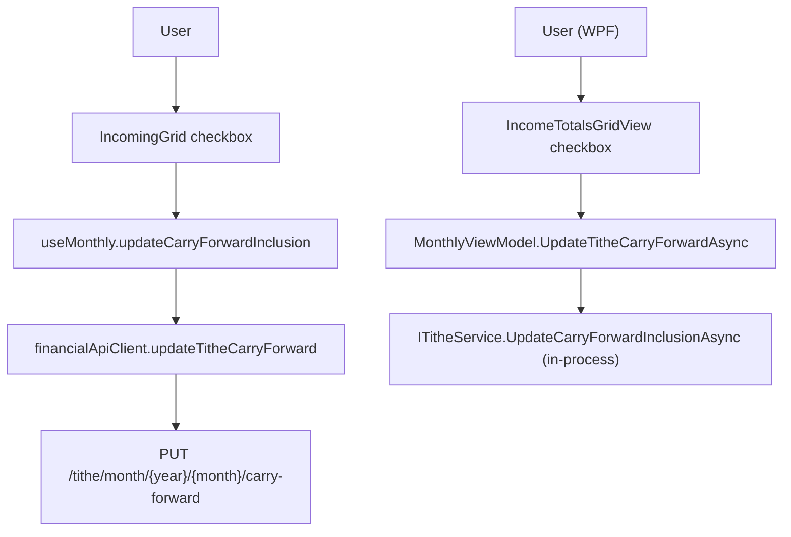

## 1. Technical Overview

**What:** Add an interactive checkbox to the existing Tithe footer in both Financial.Web (`IncomingGrid`) and Financial.App (`IncomeTotalsGridView`), showing the amount and source month of a previous month's carry-forward and letting the user include/exclude it, calling F01's already-shipped toggle endpoint/service method.

**Why:** F01 shipped the full backend (persisted decision, cascading resolution, toggle endpoint/service method, extended DTO) with no way to see or interact with it. F02 is purely the presentation layer consuming that existing contract.

**Scope:**
- Included: Web footer checkbox + wiring (types, API client, `useMonthly` mutation, `IncomingGrid` rendering, shared error/warning display); WPF footer checkbox + wiring (`MonthlyViewModel` mutation method + derived properties, `IncomeTotalsGridView` XAML + code-behind).
- Excluded: any backend change (F01 is complete and unchanged), any change to the Reserve Bucket split, any audit/history view of past decisions.

## 2. Architecture Impact

**Affected components:**
- `Financial.Web\src\api\types.ts` — modified
- `Financial.Web\src\api\financialApiClient.ts` — modified
- `Financial.Web\src\hooks\useMonthly.ts` — modified
- `Financial.Web\src\components\IncomingGrid.tsx` — modified
- `Financial.Web\src\pages\MonthlyPage.tsx` — modified
- `Financial.App\ViewModels\CashFlow\MonthlyViewModel.cs` — modified
- `Financial.App\Views\CashFlow\IncomeTotalsGridView.xaml` — modified
- `Financial.App\Views\CashFlow\IncomeTotalsGridView.xaml.cs` — modified
- `Financial.Web\src\components\__tests__\IncomingGrid.test.tsx` — modified
- `Financial.Web\src\hooks\__tests__\useMonthly.test.ts` — modified
- `Financial.Web\src\pages\__tests__\MonthlyPage.test.tsx` — modified
- `Financial.Web\src\api\__tests__\financialApiClient.test.ts` — modified (if present; verify exact path during implementation)
- `Tests\Financial.Presentation.Tests\ViewModels\CashFlow\MonthlyViewModelTests.cs` — modified

## 3. Technical Decisions

| Decision | Chosen Approach | Alternative Considered | Trade-off |
|---|---|---|---|
| Web footer container | Reuse `TotalsGrid`'s existing `footerItems[].value: ReactNode` slot — no changes to `TotalsGrid.tsx` | Extend `TotalsGrid`'s footer-item shape with a dedicated "control" field | `value` already accepts arbitrary JSX; a Fluent `Checkbox` drops in directly, zero risk to the generic grid component |
| Web busy state | New `carryForwardUpdating` boolean in `useMonthly` state, disabling the checkbox only during the in-flight PUT | Match existing fire-and-forget precedent (no busy state), like `markStatementPaid` | A toggle changes a financial figure directly (unlike a "mark paid" side-note), so the small deviation from precedent is worth the extra safety against a double-click race |
| Web error/warning surfacing | Reuse `useMonthly`'s existing shared `listActionError`/`listActionWarning` fields, rendered by `IncomingGrid` the same way `CardsGrid` already renders them | Dedicated `titheCarryForwardError` field | Matches the established "last action's outcome, one message slot" convention already shared by `markStatementPaid`/`deleteExpense`/`deleteIncome` |
| WPF toggle mechanism | `Checked`/`Unchecked` code-behind event handler delegating to an `internal async Task UpdateTitheCarryForwardAsync(bool)` on `MonthlyViewModel`, mirroring `CardsGridView`/`CardsWorkflowViewModel.UpdateCreditCardAsync` exactly | Two-way `IsChecked` binding to a settable VM property | The event-handler-delegates-to-VM-method pattern is this codebase's only established "checkbox toggles and persists" example, and keeps service calls out of code-behind per `Financial.App/CLAUDE.md` |
| WPF footer visibility | New derived `HasTitheCarryForward` bool property on `MonthlyViewModel`, bound via the existing `BoolToVisibilityConverter` | A new null-to-`Visibility` converter | `TitheSummary.CarryForward` is a nullable reference; a derived bool property matches this ViewModel's existing pattern for computed values (e.g. `TotalIncoming`, `BankTotalsSum`) and reuses the converter already in use elsewhere in this same view |
| WPF busy state | New derived `IsCarryForwardToggleEnabled` bool property (`!IsUpdatingTitheCarryForward`), bound directly to `CheckBox.IsEnabled` | A new inverse-boolean converter | `IsEnabled` takes a `bool` directly — no converter is needed at all for a plain negation |

## 4. Component Overview

**Frontend (Web):**

| File Path | New/Modified | Purpose | Key Responsibilities |
|---|---|---|---|
| `Financial.Web\src\api\types.ts` | Modified | Type aliases | Adds `TitheCarryForwardDto = Schema<'TitheCarryForwardDTO'>` and `TitheCarryForwardUpdateDto = Schema<'TitheCarryForwardUpdateDTO'>`, alongside the existing `TitheSummaryDto` alias |
| `Financial.Web\src\api\financialApiClient.ts` | Modified | API client | Adds `updateTitheCarryForward(year, month, request: TitheCarryForwardUpdateDto): Promise<TitheSummaryDto>`, `PUT /tithe/month/${year}/${month}/carry-forward`, following the existing `updateBank`-style PUT pattern |
| `Financial.Web\src\hooks\useMonthly.ts` | Modified | Month-scoped state + mutations | Adds `carryForwardUpdating: boolean` to state; adds `updateCarryForwardInclusion(included: boolean)` callback that calls the client, dispatches a new start/end pair around it, then reuses the existing `RETRY`/`LIST_ACTION_ERROR` actions on success/failure; exposes both in the returned `MonthlyData` |
| `Financial.Web\src\components\IncomingGrid.tsx` | Modified | Tithe footer | Adds a `Checkbox` as a `footerItems` entry when `titheSummary.carryForward` is non-null, labeled with the source month and showing the formatted amount; wires `checked`/`onChange`/`disabled` to the new hook state and callback via new `onToggleCarryForward`/`carryForwardUpdating` props |
| `Financial.Web\src\pages\MonthlyPage.tsx` | Modified | Wiring | Passes `onToggleCarryForward={updateCarryForwardInclusion}`, `carryForwardUpdating`, and the existing `listActionError`/`listActionWarning` through to `IncomingGrid`, mirroring how `CardsGrid` already receives them |

**Backend (WPF):**

| File Path | New/Modified | Purpose | Key Responsibilities |
|---|---|---|---|
| `Financial.App\ViewModels\CashFlow\MonthlyViewModel.cs` | Modified | Toggle mutation + derived state | Adds `internal async Task UpdateTitheCarryForwardAsync(bool included)` (echo-guarded, try/catch/finally around `_titheService.UpdateCarryForwardInclusionAsync` + `RefreshAsync`), `TitheCarryForwardUpdateError` and `IsUpdatingTitheCarryForward` properties, and derived `HasTitheCarryForward`/`IsCarryForwardToggleEnabled` properties raised alongside `TitheSummary` |
| `Financial.App\Views\CashFlow\IncomeTotalsGridView.xaml` | Modified | Footer UI | Appends a `CheckBox` to the existing footer `StackPanel`, bound to `TitheSummary.CarryForward.Included` (one-way) with `Visibility` bound to `HasTitheCarryForward` and `IsEnabled` bound to `IsCarryForwardToggleEnabled`, plus `TextBlock`s for the amount/source-month label and any `TitheCarryForwardUpdateError` |
| `Financial.App\Views\CashFlow\IncomeTotalsGridView.xaml.cs` | Modified | Event wiring | `Checked`/`Unchecked` handler reading the checkbox's `IsChecked` and calling `viewModel.UpdateTitheCarryForwardAsync(...)`, mirroring `CardsGridView.xaml.cs`'s `OnActiveChanged` |

## 5. UX Flow

- On opening a month with a positive carry-in available, the footer shows an additional segment: "Carry forward from August: [✓] R$50.00" — checked by default (server-confirmed, since `Included` defaults `true` per F01).
- Clicking the checkbox disables it, fires the toggle request, and re-enables once the request settles — on success the whole month's figures (including `Tithe Balance`) refresh from the server response; on failure the checkbox is untouched (it was never optimistically flipped) and an error message appears via the existing shared error-message convention ("Failed to update carry-forward" or the server's message).
- Re-checking a previously unchecked box behaves identically — same request shape, same state machine — and the server returns the original snapshotted amount, not a recomputed one (F01's guarantee).
- In a month with nothing to carry (`titheSummary.carryForward` is `null`), no footer segment is rendered at all — the footer looks exactly as it does today.
- WPF mirrors this exactly: the checkbox disables during the request, `RefreshAsync()` re-pulls all month figures on success, and a inline error text appears on failure.

## 6. API Contracts

No new backend endpoints or contract changes — F02 is the first UI consumer of F01's already-shipped `carryForward` field (GET response) and `PUT /tithe/month/{year}/{month}/carry-forward` endpoint (documented in F01's own spec, `docs/prd/P40-prd-tithe-carry-forward/features/P40-F01-tithe-carry-forward-calculation/spec.md`). The OpenAPI snapshot and generated `Financial.Web/src/api/generated/openapi.ts` already reflect both; F02 only adds the `types.ts` aliases and the client wrapper method described in Section 4.

## 7. Testing Strategy

| Test File | Test Type | Target | Coverage Goal |
|---|---|---|---|
| `Financial.Web\src\components\__tests__\IncomingGrid.test.tsx` | Component (RTL) | `IncomingGrid` | Renders/hides the checkbox correctly, calls `onToggleCarryForward` on click, reflects `disabled` state |
| `Financial.Web\src\hooks\__tests__\useMonthly.test.ts` | Hook (`renderHook`) | `useMonthly` | `updateCarryForwardInclusion` success/failure paths, `carryForwardUpdating` transitions |
| `Financial.Web\src\pages\__tests__\MonthlyPage.test.tsx` | Component (RTL) | `MonthlyPage` | Wiring: prop pass-through from hook to `IncomingGrid` |
| `Tests\Financial.Presentation.Tests\ViewModels\CashFlow\MonthlyViewModelTests.cs` | Unit (stub service) | `MonthlyViewModel` | `UpdateTitheCarryForwardAsync` success/failure/echo-guard, derived property notifications |

**Acceptance tests (PRD Section 9, F02):**

| PRD Criterion | Covering Test |
|---|---|
| "The carry-forward control appears in the Tithe footer only when a positive carry-in amount is available for the viewed month." | `IncomingGrid.test.tsx` — renders checkbox only when `carryForward` is non-null |
| "The control shows the carried amount, its source month, and a checkbox pre-checked by default." | `IncomingGrid.test.tsx` — asserts label text and initial `checked` state |
| "Unchecking/checking the control updates the visible Tithe Balance immediately and matches the value returned by F01." | `useMonthly.test.ts` — asserts `titheSummary` (including `titheBalance`) reflects the mutation response after `updateCarryForwardInclusion` |
| "The same control, wording, default state, and behavior are present in both Financial.Web and Financial.App." | `IncomingGrid.test.tsx` + `MonthlyViewModelTests.cs`, both asserting the same default-checked/label/toggle behavior |
| "In a month with nothing to carry, the footer shows only the existing Calculated Tithe/Tithe Balance line with no carry-forward control." | `IncomingGrid.test.tsx` — `carryForward: null` case |
| "A failed toggle reverts the checkbox to its previous state and displays the F01 error message." | `useMonthly.test.ts` (error path leaves `titheSummary` unchanged, sets `listActionError`) + `MonthlyViewModelTests.cs` (failure path leaves `TitheSummary` unchanged, sets `TitheCarryForwardUpdateError`) |

**Cross-Feature Integration criterion:**

| PRD Criterion | Covering Test |
|---|---|
| "The carried-forward amount, inclusion state, source month, and adjusted Tithe Balance computed by F01 are correctly received and rendered by F02's footer control in both Financial.Web and Financial.App." | `IncomingGrid.test.tsx` and `MonthlyViewModelTests.cs`, each asserting the full `TitheCarryForwardDTO` shape (amount, included, fromYear, fromMonth) renders correctly from a realistic F01-shaped response |
