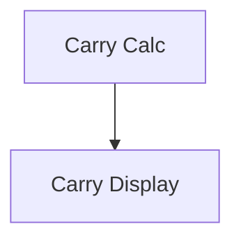

# Tithe Carry-Forward

## 1. Executive Summary

Tithe Carry-Forward extends Financial's existing CashFlow Tithe calculation so that an unpaid tithe obligation is no longer silently forgotten at the start of a new month. Today, `TitheService` recomputes each month's Calculated Tithe (10% of that month's net income) and Tithe Balance (Calculated Tithe minus that month's Dizimo-flagged expenses) completely fresh, with no memory of any prior month — a shortfall from August simply disappears the moment September begins.

This feature is built for the single household user who already relies on the Monthly page's Tithe footer to know what they owe. It works by silently, by default, bringing the previous month's unpaid Tithe Balance into the new month's figure the moment that new month becomes relevant — visible as a pre-checked, always-editable control in the same footer where Calculated Tithe and Tithe Balance already appear, in both Financial.Web and Financial.App. The user never has to hunt through past months to know whether they're behind; if they decide not to catch up, one click drops the carried amount for good rather than letting it silently reappear later.

At a high level: a new persisted decision (amount carried, whether it's included) is created the first time a month's Tithe figures are computed, using the previous month's full Tithe Balance (including anything it itself carried in) whenever that value is positive. The decision stays editable indefinitely, but once a later month has already used it, earlier edits can no longer change what was already carried — keeping the running total both honest and stable.

## 2. Problem and Opportunity

**The Problem**

- **Silent debt.** Tithe Balance resets to zero every month regardless of whether last month's obligation was actually paid — an unpaid amount simply vanishes from view with no visibility, reminder, or path to catch up.
- **All-or-nothing correction.** The only way to check whether last month's tithe was fully paid is to manually navigate back to that specific month and read its number; the current month's view gives no signal either way.
- **Rigid mental model.** There's no way to distinguish "I consciously let this one go" from "I simply forgot" — every new month looks identical (zero) whether the prior obligation was paid, skipped, or genuinely settled.

**The Opportunity**

- Persisting a carry-forward decision and silently pre-including it by default directly solves the silent-debt and all-or-nothing problems: the current month's own Tithe Balance already reflects what's still owed, with no extra navigation required.
- Making the decision an explicit, always-visible, always-editable toggle turns "forgetting" into "deciding" — the user consciously accepts or dismisses the leftover instead of it happening invisibly.

## 3. Target Audience

### Primary Users

**The Household Tithe Tracker**
- Already records monthly income and Dizimo-flagged expenses in Financial and relies on the existing Tithe footer figures to know what's owed.
- Doesn't necessarily pay the full 10% every single month and may want to catch up in a later month when cash flow allows.
- Wants an honest, low-friction way to see "did I finish paying off last month" without hunting through past months.

## 4. Objectives

**Product Objectives**

1. **Surface** unpaid tithe obligations automatically in the current month's view without requiring manual navigation to past months.
2. **Preserve** user control — every carry-forward decision stays visible and reversible at any time, never silently locked.
3. **Protect** historical accuracy — once a later month has already resolved its own carry-in, earlier edits never retroactively corrupt it.
4. **Avoid** surprise debt dumps — the feature never backfills a large historical balance onto the first month it ships.

**Success Metrics**

1. For Objective 1: 100% of months with a positive prior-month Tithe Balance display the carried amount and toggle in the footer without the user opening the previous month — verified manually across at least 3 consecutive test months.
2. For Objective 2: Toggling carry-forward off/on for any past or current month completes with zero errors and immediately updates that month's displayed Tithe Balance — verified across 10 toggle round-trips in manual testing.
3. For Objective 3: Editing a resolved prior month's income/expenses after a later month has already snapshotted its carry-in produces zero changes to the later month's stored carried amount — verified via a before/after diff of the data file.
4. For Objective 4: The first month this feature is deployed shows no carry-forward option, regardless of how many months of historical unpaid tithe exist in the data — verified by inspecting that month's Tithe summary immediately after deploy.

## 5. User Stories

### F01. Tithe Carry-Forward Calculation
- As the system, I want to automatically determine whether the previous month left a positive Tithe Balance so that a new month can offer it as a default carry-in
- As the system, I want to snapshot the carried amount the first time it becomes available so that later edits to the source month don't retroactively change it
- As a user, I want to toggle whether a month's carry-forward is included so that I can consciously decide to bring an old debt in or let it go
- As the system, I want carrying-forward to only affect Tithe Balance, not Calculated Tithe, so that the 10%-of-income figure stays meaningful on its own
- As a user, I want a declined carry-in to be dropped for good once I uncheck it so that it doesn't keep resurfacing in later months
- As the system, I want the first month after this feature ships to show no carry-in option so that no one is surprised by a large backfilled historical debt

### F02. Tithe Carry-Forward Display
- As a user, I want to see a checkbox in the Tithe footer showing the amount carried from last month so that I know at a glance whether I still owe something
- As a user, I want the checkbox pre-checked by default so that I don't have to take any action to see my true outstanding balance
- As a user, I want the same carry-forward behavior and figures in the WPF app as in the web app so that I get a consistent view regardless of which client I use
- As a user, I want the carry-forward control to disappear when there's nothing to carry so that the footer stays uncluttered in a normal, fully-paid month

## 6. Functionalities

### F01. Tithe Carry-Forward Calculation

**Provides:**
- Carried-forward amount, inclusion state, and source month for a given month, plus that month's adjusted Tithe Balance (used by F02)

**Capabilities:**
- The tithe rate stays fixed at 10% of a month's net income (existing, unchanged rule) — Calculated Tithe is never affected by carry-forward.
- A month's available carry-in amount equals the previous month's full Tithe Balance (including anything that month itself carried in), and only when that value is greater than zero; zero or negative values offer no carry-in.
- The carry-in amount is snapshotted (locked) the first time it is computed for a month; the inclusion decision defaults to included (true).
- The inclusion decision is stored per month and remains editable indefinitely — toggling it recalculates that month's Tithe Balance immediately, but never changes any other month's already-snapshotted figures.
- Declining (unchecking) a carry-in permanently discards that amount — it is never re-offered to a subsequent month.
- The feature is forward-only: the first calendar month in which it becomes available has no carry-in option, regardless of unpaid balances in earlier historical months; carry-in becomes available starting the following month.
- Formula: `TitheBalance = CalculatedTithe − paidThisMonth + (carryForwardIncluded ? carryForwardAmount : 0)`, still with no clamping — the result can remain negative even after including a carried debt if enough was paid.

**Experience:**
- This functionality has no direct UI of its own — it is the backend/domain rule powering F02's display. When a month's Tithe summary is requested and no carry-forward decision exists yet for that month, the system resolves it — walking back through any earlier unresolved months as needed — before returning the figures, so navigating directly to a never-before-viewed month still produces the correct cascading result.
- Toggling the inclusion decision for a month takes effect immediately in that month's returned Tithe Balance; already-resolved later months are never recalculated as a side effect of that change.

**Error Handling:**
- Toggling carry-forward for an invalid or out-of-range year/month returns a validation error; the UI shows "Could not update carry-forward — invalid month" and leaves the display unchanged.
- If the persisted data file cannot be saved when toggling (e.g., storage unavailable), the toggle reverts to its previous state and the UI shows "Couldn't save — try again" rather than silently showing an unsaved state.
- If a month's carry-forward decision is still being resolved (e.g., first-ever view of a month whose earlier months are also unresolved) when a read occurs, the calculation completes resolution before returning, so a partially-resolved Tithe Balance is never returned.

### F02. Tithe Carry-Forward Display

**Consumes:**
- F01: carried-forward amount, inclusion state, source month, and the adjusted Tithe Balance for the currently viewed month

**Capabilities:**
- The carry-forward control (checkbox + amount + source month label) appears in the existing Tithe footer only when a carry-in amount greater than zero is available for the viewed month; it is omitted entirely otherwise.
- The control is available in both Financial.Web (`IncomingGrid` footer on `MonthlyPage`) and Financial.App (`IncomeTotalsGridView` / `MonthlyViewModel`), with identical wording, default state, and behavior.
- Values are formatted using the app's existing currency/number formatting conventions, consistent with the adjacent Calculated Tithe and Tithe Balance figures.

**Experience:**
- On opening a month with a positive carry-in available, the footer shows an additional segment, e.g. "Carry forward R$50 from August [✓]", checked by default, with Tithe Balance already reflecting the carried amount.
- Unchecking the box immediately updates the displayed Tithe Balance (subtracting the carried amount) and persists the decision; re-checking it restores the exact same original snapshotted amount rather than a freshly recomputed one.
- While a toggle request is in flight, the checkbox shows a brief disabled/loading state; on failure it reverts and surfaces the F01 error message.
- In a month with nothing to carry (previous month settled or overpaid), the footer shows only the existing "Calculated Tithe · Tithe Balance" line, unchanged from today.

## 7. Out of Scope

- Configurable tithe percentage — the rate stays fixed at 10%, unchanged from the existing rule.
- Carrying forward negative/overpaid balances as a credit toward future months.
- Backfilling or retroactively computing carry-forward amounts for months that existed before this feature shipped.
- Any change to the Reserve Bucket automated income split (which uses the same 10% rate but is unrelated to Tithe Balance).
- Notifications, reminders, or alerts about unpaid tithe (push, email, etc.) — the footer display is the only surfacing mechanism.
- A dedicated history/audit view listing every month's carry-forward decisions over time — only the current month's own carried-in figure is shown.
- Multi-currency tithe tracking — CashFlow tithe remains single-currency, consistent with existing behavior.
- Any UI or capability to manually enter a custom carry-forward amount different from the snapshotted previous-month figure.

## 8. Dependency Graph

| # | Feature | Priority | Dependencies |
|---|---------|----------|--------------|
| F01 | Tithe Carry-Forward Calculation | 1 | None |
| F02 | Tithe Carry-Forward Display | 1 | F01 |

### Execution Waves
Features within the same wave can be built in parallel. A wave starts only after every feature in earlier waves is complete.

- **Wave 1**: F01
- **Wave 2**: F02

### Priority levels
- **1** = Essential — product does not work without it
- **2** = Important — significant value addition
- **3** = Desirable — incremental improvement

## 9. Acceptance Criteria

### F01. Tithe Carry-Forward Calculation
- [x] When the previous month's Tithe Balance is positive, the current month's Tithe Balance includes that amount by default without any user action.
- [x] When the previous month's Tithe Balance is zero or negative, the current month offers no carry-in and Tithe Balance equals the existing (unchanged) calculation.
- [x] Calculated Tithe for any month always equals exactly 10% of that month's net income, unaffected by any carry-forward inclusion.
- [x] Unchecking a month's carry-forward inclusion immediately reduces that month's Tithe Balance by the carried amount and persists the decision.
- [x] Re-checking a previously unchecked carry-forward inclusion restores the exact original snapshotted amount, not a freshly recomputed one.
- [x] Editing income/expenses in a month after a later month has already resolved its carry-in from it does not change the later month's stored carried amount.
- [x] A month whose carry-forward was declined (unchecked) never re-offers that amount to any subsequent month.
- [x] The first month in which this feature is active shows no carry-forward option, regardless of unpaid balances in any earlier historical month.
- [x] Toggling carry-forward for an invalid month returns a validation error and leaves the displayed figures unchanged.
- [x] A save failure while toggling reverts the control to its prior state and surfaces an error message.

### F02. Tithe Carry-Forward Display
- [x] The carry-forward control appears in the Tithe footer only when a positive carry-in amount is available for the viewed month.
- [x] The control shows the carried amount, its source month, and a checkbox pre-checked by default.
- [x] Unchecking/checking the control updates the visible Tithe Balance immediately and matches the value returned by F01.
- [x] The same control, wording, default state, and behavior are present in both Financial.Web and Financial.App.
- [x] In a month with nothing to carry, the footer shows only the existing Calculated Tithe/Tithe Balance line with no carry-forward control.
- [x] A failed toggle reverts the checkbox to its previous state and displays the F01 error message.

### Cross-Feature Integration
- [x] The carried-forward amount, inclusion state, source month, and adjusted Tithe Balance computed by F01 are correctly received and rendered by F02's footer control in both Financial.Web and Financial.App.
