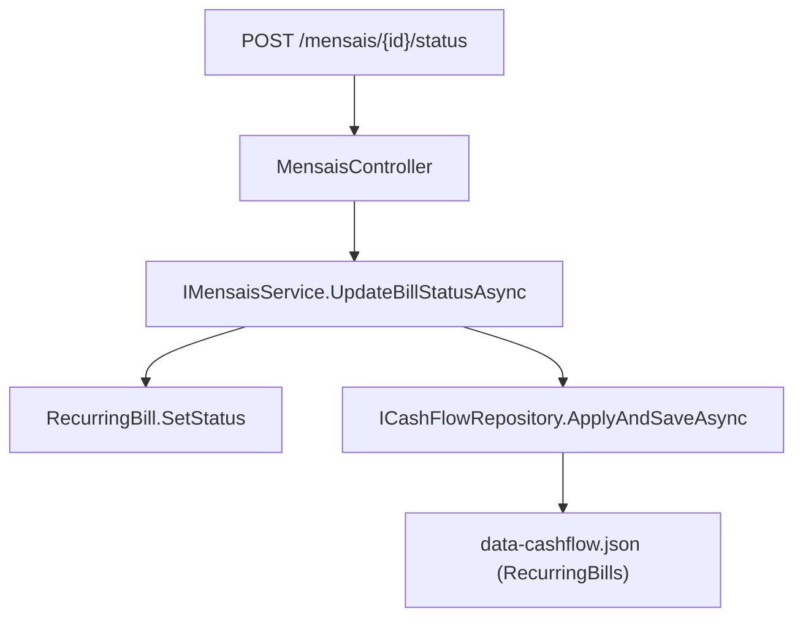

# F01. Mensais Status Quick-Change Endpoint

## 1. Technical Overview

**What:** Add a new endpoint, `POST /api/v1/financial/mensais/{id}/status`, along with its supporting Domain and Application plumbing, that updates only a `RecurringBill`'s `Status` field. It is independent of the existing `PUT /mensais/{id}`, which requires and rewrites every field on the bill.

**Why:** The upcoming inline status control (F02 React, F03 WPF) needs to flip a bill's status in a single request without resending the rest of the record, and without risking an accidental overwrite of other fields from stale client-side state at the moment of the click. Isolating the mutation to exactly the `Status` field removes that risk entirely, independent of any UI concern.

**Scope:**
- **Included:** `RecurringBill` domain method for a status-only mutation; a new Application DTO, service method, and interface member; a new Controller endpoint; OpenAPI snapshot and generated frontend TypeScript type regeneration; Domain/Application/Api-layer tests.
- **Excluded:** Any frontend UI change (delivered by F02/F03); any change to the existing `PUT /mensais/{id}` endpoint's behavior or contract; any new `BillStatus` value; any `Area`-specific logic (this endpoint behaves identically for Brasil and UK bills — Area-specific behavior belongs to F04/F05, which consume the client-side signal this endpoint's callers raise, not this endpoint itself).

## 2. Architecture Impact

**Affected components:**

| Component | File | Change |
|---|---|---|
| Domain | `Financial.CashFlow.Domain/Entities/RecurringBill.cs` | Modified — new status-only mutation method |
| Application | `Financial.CashFlow.Application/DTOs/RecurringBillStatusUpdateDTO.cs` | New |
| Application | `Financial.CashFlow.Application/Interfaces/IMensaisService.cs` | Modified — new method signature |
| Application | `Financial.CashFlow.Application/Services/MensaisService.cs` | Modified — new method implementation |
| Presentation | `Financial.Api/Controllers/MensaisController.cs` | Modified — new endpoint |
| Contract | `Tests/Financial.Api.Tests/Contract/openapi-v1.snapshot.json` | Modified (regenerated) |
| Contract | `Financial.Web/src/api/generated/openapi.ts` | Modified (regenerated) |
| Tests | `Tests/Financial.CashFlow.Domain.Tests/Entities/RecurringBillTests.cs` | Modified |
| Tests | `Tests/Financial.CashFlow.Application.Tests/Services/MensaisServiceTests.cs` | Modified |
| Tests | `Tests/Financial.Api.Tests/MensaisEndpointsTests.cs` | Modified |



## 3. Technical Decisions

| Decision | Chosen Approach | Alternative Considered | Trade-off |
|---|---|---|---|
| Route/verb style for the status-only update | `POST /mensais/{id}/status`, an action-verb sub-resource matching `CardStatementsController`'s existing `{id}/mark-paid` / `{id}/unmark-paid` precedent | `PATCH /mensais/{id}/status`, the more RESTfully precise verb for a partial update | Slightly less semantically precise HTTP verb usage, but the codebase has zero existing `PATCH` endpoints — following the one existing sub-resource-action precedent keeps the API internally consistent rather than introducing a second convention for the same kind of operation (confirmed with the user) |

## 4. Component Overview

**Backend:**

| File Path | New/Modified | Purpose | Key Responsibilities |
|---|---|---|---|
| `Financial.CashFlow.Domain/Entities/RecurringBill.cs` | Modified | Domain state mutation | Add `SetStatus(BillStatus status)`, mirroring the existing `ResetToUnset()` method: assigns `Status` only, touches no other field, requires no validation (every `BillStatus` value is always a legal target) |
| `Financial.CashFlow.Application/DTOs/RecurringBillStatusUpdateDTO.cs` | New | Request contract | Single `required string Status` field, following the shape of the existing `MarkCardStatementPaidDTO` |
| `Financial.CashFlow.Application/Interfaces/IMensaisService.cs` | Modified | Service contract | Adds `Task<RecurringBillDTO> UpdateBillStatusAsync(Guid id, RecurringBillStatusUpdateDTO request)` |
| `Financial.CashFlow.Application/Services/MensaisService.cs` | Modified | Business logic | Looks up the bill with the existing `FirstOrThrow` extension (`KeyNotFoundException` on miss), parses the requested status with the existing `BillStatusParser.TryParse` (`ArgumentException` on an unrecognized value), calls `RecurringBill.SetStatus`, persists through `ICashFlowRepository.ApplyAndSaveAsync`, and returns the updated `RecurringBillDTO` via the existing private `ToDto` mapper. Wrapped in the same `StartSpan`/telemetry/logging pattern as every other method on this service |
| `Financial.Api/Controllers/MensaisController.cs` | Modified | HTTP endpoint | Adds `[HttpPost("{id:guid}/status")]`, returns `400 Bad Request` for a null body (matching `CreateBill`/`UpdateBill`'s existing null-check style), otherwise delegates to the service and returns `200 OK` with the updated `RecurringBillDTO`. 404/400 for a missing bill or invalid status value are handled by the existing `DomainExceptionMappingMiddleware` — no new exception type or controller-level try/catch is needed |

**Data Model:** No relational schema exists in this project — `RecurringBill` is one element of the `RecurringBills` array inside the single `data-cashflow.json` document (`Financial.Shared.Infrastructure`-backed JSON persistence). This feature adds no new field and no migration; it only adds a second, narrower way to mutate the `Status` field that already exists on every stored `RecurringBill`.

## 5. API Contracts

**Endpoint: Update Recurring Bill Status**
- **Method:** POST
- **Path:** `/api/v1/financial/mensais/{id}/status`
- **Authentication:** None (this API has no authentication mechanism anywhere — single-user, self-hosted tool)

**Request:**

| Field | Type | Required | Validation | Description |
|---|---|---|---|---|
| `status` | `string` | Yes | Must parse via `BillStatusParser.TryParse` to one of `Unset`, `Scheduled`, `Paid` | The status to set on the bill |

**Request Example:**
```json
{
  "status": "Paid"
}
```

**Response (Success - 200):**

| Field | Type | Description |
|---|---|---|
| `id` | `guid` | Bill identifier |
| `dueDay` | `integer` | Unchanged by this endpoint |
| `description` | `string` | Unchanged by this endpoint |
| `value` | `decimal` | Unchanged by this endpoint |
| `area` | `string` | Unchanged by this endpoint (`"Brasil"` or `"UK"`) |
| `note` | `string` | Unchanged by this endpoint |
| `nitNumber` | `string \| null` | Unchanged by this endpoint |
| `minimumWageValue` | `decimal \| null` | Unchanged by this endpoint |
| `status` | `string` | The newly set status |

**Response Example:**
```json
{
  "id": "550e8400-e29b-41d4-a716-446655440000",
  "dueDay": 10,
  "description": "Council Tax",
  "value": 120.0,
  "area": "UK",
  "note": "",
  "nitNumber": null,
  "minimumWageValue": null,
  "status": "Paid"
}
```

**Error Cases:**

| Exception Type | HTTP Status | Description |
|---|---|---|
| Null request body | 400 | Controller-level null check, mirroring `CreateBill`/`UpdateBill` |
| `ArgumentException` (unrecognized status) | 400 | Raised by `BillStatusParser.TryParse` failure, mapped by `DomainExceptionMappingMiddleware` |
| `KeyNotFoundException` (unknown bill id) | 404 | Raised by `FirstOrThrow`, mapped by `DomainExceptionMappingMiddleware` |

## 6. Testing Strategy

| Test File | Test Type | Target | Coverage Goal |
|---|---|---|---|
| `Tests/Financial.CashFlow.Domain.Tests/Entities/RecurringBillTests.cs` | Unit | `RecurringBill.SetStatus` | All 3 `BillStatus` values as targets; same-status no-op |
| `Tests/Financial.CashFlow.Application.Tests/Services/MensaisServiceTests.cs` | Unit | `MensaisService.UpdateBillStatusAsync` | Success path, not-found, invalid status, field isolation |
| `Tests/Financial.Api.Tests/MensaisEndpointsTests.cs` | Integration | `POST /mensais/{id}/status` | Success, 404, 400, field isolation over real HTTP |

**Test Functions:**

| Test Function | Description | Assertions |
|---|---|---|
| `SetStatus_ChangesStatusOnly_LeavesOtherFieldsUntouched` (Theory over `Unset`/`Scheduled`/`Paid`) | Calls `SetStatus` on a bill created with known field values | `Status` equals the target value; every other property (`DueDay`, `Description`, `Value`, `Area`, `Note`, `NitNumber`, `MinimumWageValue`) unchanged |
| `SetStatus_ToCurrentStatus_IsANoOpAndSucceeds` | Calls `SetStatus` with the bill's already-current status | No exception; `Status` unchanged |
| `UpdateBillStatusAsync_WithValidStatus_UpdatesAndReturnsBill` | Seeds a bill in the stub repository, calls the service method with a new status | Returned DTO reflects the new status; `_repository.SaveChangesCallCount` is 1 |
| `UpdateBillStatusAsync_DoesNotChangeOtherFields` | Seeds a bill with known field values, calls the service method | All fields other than `Status` on the stored entity remain exactly as seeded |
| `UpdateBillStatusAsync_WithUnknownBillId_Throws` | Calls the service method with a random id against an empty repository | Throws `KeyNotFoundException` |
| `UpdateBillStatusAsync_WithInvalidStatusValue_Throws` (Theory over a couple of garbage strings) | Calls the service method with a status string outside the 3 valid values | Throws `ArgumentException` |
| `UpdateBillStatus_ValidRequest_ReturnsOkWithUpdatedStatus` | Creates a bill via the existing `POST /mensais`, then calls the new endpoint | `200 OK`; response body's `status` field equals the requested value |
| `UpdateBillStatus_UnknownId_ReturnsNotFound` | Calls the new endpoint with a random guid | `404 Not Found` |
| `UpdateBillStatus_InvalidStatusValue_ReturnsBadRequestWithMessage` | Calls the new endpoint with an unrecognized status string | `400 Bad Request`; body contains a message naming the invalid value |
| `UpdateBillStatus_DoesNotChangeOtherFields` | Creates a bill, calls the new endpoint, then `GET /mensais` | Every field other than `status` on the returned bill matches what was originally created |

The existing `OpenApiContractTests` (`Tests/Financial.Api.Tests/Contract/`) and `Financial.Web/src/api/generated/__tests__/openapiFreshness.test.ts` are not modified, but both must pass against the regenerated snapshot/types per the project's documented contract-change workflow (see `CLAUDE.md`).
