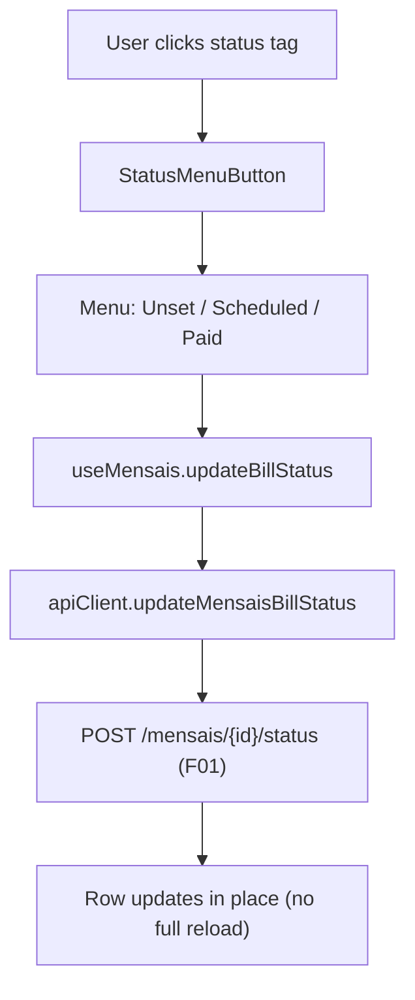

# F02. Mensais Inline Status Control (React)

## 1. Technical Overview

**What:** Replace the plain-text status cell in `Financial.Web`'s Mensais grid (both Brasil and UK tables) with a new reusable `StatusMenuButton` component: a Fluent UI `MenuButton` rendered as a colored status tag that opens a `Menu` listing all 3 `BillStatus` values, with the current one shown checked and disabled. Selecting a different value calls F01's status-only endpoint and updates that row in place.

**Why:** Per the PRD, this cuts the interactions needed to change a bill's status from 3+ (open edit drawer, change dropdown, save) to 2 (open menu, pick status), and gives the grid a color-coded, at-a-glance status view it currently lacks (the cell is unstyled plain text today, `MensaisPage.tsx`'s `<td>{bill.status}</td>`). It also establishes and documents the tag-with-menu pattern as a reusable UI standard, closing a gap in `docs/ui/fluent-ui-react-v9-pages/` where no such pattern exists yet.

**Scope:**
- **Included:** New `StatusMenuButton` component; `useMensais` hook extension for a status-only update action that updates the affected row in place (no full refetch); `apiClient.updateMensaisBillStatus`; the `RecurringBillStatusUpdateDto` type alias; wiring both `BillTable` instances in `MensaisPage.tsx`; a new `docs/ui/fluent-ui-react-v9-pages/splitButton.md` standards page plus cross-references from `menu.md` and the `fluent-ui` skill's control-selection/cross-platform-mapping references; component, hook, and page-level tests.
- **Excluded:** The WPF equivalent (F03); the UK Paid-to-Expense prompt (F04); any change to the existing edit-form drawer's status `<select>` or its `PUT /mensais/{id}`-based save path, which remains exactly as it is today as a secondary, unprompted path; any change to any grid other than Mensais.

## 2. Architecture Impact

**Affected components:**

| Component | File | Change |
|---|---|---|
| Component | `Financial.Web/src/components/StatusMenuButton.tsx` | New |
| Page | `Financial.Web/src/pages/MensaisPage.tsx` | Modified — status cell |
| Hook | `Financial.Web/src/hooks/useMensais.ts` | Modified — new action |
| API Client | `Financial.Web/src/api/financialApiClient.ts` | Modified — new method |
| Types | `Financial.Web/src/api/types.ts` | Modified — new alias |
| Standards | `docs/ui/fluent-ui-react-v9-pages/splitButton.md` | New |
| Standards | `docs/ui/fluent-ui-react-v9-pages/menu.md` | Modified — cross-reference |
| Standards | `.claude/skills/fluent-ui/references/component-selection.md` | Modified — control-selection row |
| Standards | `.claude/skills/fluent-ui/references/cross-platform-mapping.md` | Modified — React↔WPF mapping row |
| Tests | `Financial.Web/src/components/__tests__/StatusMenuButton.test.tsx` | New |
| Tests | `Financial.Web/src/pages/__tests__/MensaisPage.test.tsx` | Modified |
| Tests | `Financial.Web/src/hooks/__tests__/useMensais.test.ts` | Modified |

## 3. Technical Decisions

| Decision | Chosen Approach | Alternative Considered | Trade-off |
|---|---|---|---|
| Component structure | Extract a reusable `StatusMenuButton` component | Inline the `MenuButton`/`Menu` JSX directly in `BillRow` | Slightly more indirection for what is currently a single call site, but gives the new `splitButton.md` standards page a concrete implementation to point to and makes future adoption by other grids a straightforward import instead of a copy-paste (confirmed with the user) |
| Status → Badge color mapping | `Unset` → `subtle`, `Scheduled` → `informative`, `Paid` → `success` | `Scheduled` → `warning` | `warning` would read as "something needs attention," but Scheduled is a normal, expected intermediate state, not a problem — `informative` communicates "a plan exists" without false urgency (confirmed with the user) |

## 4. Component Overview

**Frontend:**

| File Path | New/Modified | Purpose | Key Responsibilities |
|---|---|---|---|
| `Financial.Web/src/components/StatusMenuButton.tsx` | New | Reusable status tag-with-menu control | Renders the current status as a colored `Badge` inside a `MenuButton`; opens a `Menu`/`MenuList` listing every status in a fixed `statuses: string[]` prop, each as a `MenuItem`; the item matching the current value renders a checkmark icon and `disabled`; picking a different item calls `onChange(newStatus)`; the whole control is `disabled` while an `isUpdating` prop is true |
| `Financial.Web/src/pages/MensaisPage.tsx` | Modified | Grid wiring | `BillRow`'s status `<td>` renders `<StatusMenuButton>` instead of `{bill.status}`, passing the 3 `BillStatus` values, the bill's current status, an `onChange` bound to the new hook action, and the per-row updating/error flags |
| `Financial.Web/src/hooks/useMensais.ts` | Modified | State management | New `updateBillStatus(id, status)` function and `UPDATE_STATUS_START` / `UPDATE_STATUS_SUCCESS` / `UPDATE_STATUS_ERROR` reducer cases; success replaces the one affected bill inside `state.bills` in place (no `RETRY`/refetch, unlike every other mutation in this hook, to satisfy the PRD's "no full reload" requirement); tracks `updatingStatusBillId: string \| null` and `statusUpdateError: string \| null` |
| `Financial.Web/src/api/financialApiClient.ts` | Modified | API client | New `updateMensaisBillStatus: (id: string, request: RecurringBillStatusUpdateDto) => Promise<RecurringBillDto>` calling `POST /mensais/${id}/status`, following the existing `updateMensaisBill` method's shape |
| `Financial.Web/src/api/types.ts` | Modified | Type alias | `export type RecurringBillStatusUpdateDto = Schema<'RecurringBillStatusUpdateDTO'>`, alongside the existing `RecurringBillDto`/`RecurringBillCreateDto`/`RecurringBillUpdateDto` aliases |

**Standards:**

| File Path | New/Modified | Purpose |
|---|---|---|
| `docs/ui/fluent-ui-react-v9-pages/splitButton.md` | New | Documents the status-tag-with-menu pattern: when to use it (compact inline status change inside a grid cell), the `MenuButton` + `Badge` composition, the checked/disabled treatment of the current value, and accessibility notes (keyboard operability, no color-only meaning) |
| `docs/ui/fluent-ui-react-v9-pages/menu.md` | Modified | Adds a cross-reference from the existing "See also MenuButton" line to the new `splitButton.md` page |
| `.claude/skills/fluent-ui/references/component-selection.md` | Modified | Adds a control-selection row: "Compact inline status change in a grid" → `StatusMenuButton` (MenuButton-as-tag) pattern |
| `.claude/skills/fluent-ui/references/cross-platform-mapping.md` | Modified | Adds a row mapping React's `MenuButton`-as-tag to WPF-UI's `SplitButton`, so F03 has a documented target |

**Consumed API (from F01, no new endpoint introduced by this feature):**

| Method | Path | Consumed by |
|---|---|---|
| POST | `/api/v1/financial/mensais/{id}/status` | `apiClient.updateMensaisBillStatus`, called from `useMensais.updateBillStatus` |

**Data Model:** None — this feature introduces no new persisted data. It consumes the existing `RecurringBillDTO` shape (already present in `types.ts`) and F01's status-only endpoint contract.

## 5. Requirements

### Business Rules (from PRD Capabilities)

- The status `<td>` in both the Brasil and UK `BillTable` instances renders `StatusMenuButton` instead of plain text — same component, same behavior for both areas (Area-specific behavior belongs to F04, not this feature).
- `StatusMenuButton` always lists all 3 `BillStatus` values (`Unset`, `Scheduled`, `Paid`); the item matching the bill's current status is checked (checkmark icon) and `disabled`; the other two are clickable `MenuItem`s.
- Selecting a different status calls `useMensais.updateBillStatus(bill.id, newStatus)`, which calls F01's endpoint and, on success, replaces only that bill in local state — no table-wide loading spinner, no refetch.
- The existing edit-form drawer (`showEditForm`, the `mensais-edit-status` native `<select>`, `saveEdit`'s full `PUT` call) is left completely unchanged — a second, always-available way to change status that does not go through `StatusMenuButton` or `updateBillStatus`.

### UX Flows (from PRD Experience)

- Clicking anywhere on the tag (label or chevron) opens the menu, anchored to the control.
- Choosing a different status closes the menu; the row's tag updates to the new status/color immediately after the API call resolves.
- While the request is in flight, the control shows a disabled/busy state (Fluent's built-in `MenuButton` `disabled` styling is sufficient; no custom spinner is required for a sub-second local-JSON-backed call).
- On failure, the tag reverts to its previous status/color and an inline error message appears near the row (a `
` styled like the page's existing `mensais-page__error` error rows, scoped to that row rather than the whole page).
- Keyboard operable: focusable via Tab, opens with Enter/Space, `MenuItem`s navigable with arrow keys and selectable with Enter, per Fluent's built-in `Menu`/`MenuButton` behavior.

## 6. Error Handling

| Scenario | Handling |
|---|---|
| `updateMensaisBillStatus` rejects (network error, 404, 400 — see F01) | `updateBillStatus` dispatches `UPDATE_STATUS_ERROR` with a message from the existing `getErrorMessage` helper; `state.bills` is left untouched (the optimistic revert is implicit — the row was never mutated until success), and `statusUpdateError` is shown next to the affected row |
| A second status change is attempted on the same row while one is in flight | The control is `disabled` while `updatingStatusBillId === bill.id`, preventing a second concurrent request from the same row (other rows remain independently interactive) |

## 7. Testing Strategy

| Test File | Test Type | Target | Coverage Goal |
|---|---|---|---|
| `Financial.Web/src/components/__tests__/StatusMenuButton.test.tsx` | Component (RTL) | `StatusMenuButton` | Renders current status; opens menu on click; current status item is disabled/checked; clicking another status calls `onChange`; `isUpdating` disables the control |
| `Financial.Web/src/hooks/__tests__/useMensais.test.ts` | Hook | `updateBillStatus` | Success replaces the one bill in state without refetching; failure leaves state untouched and sets an error message; `updatingStatusBillId` toggles around the call |
| `Financial.Web/src/pages/__tests__/MensaisPage.test.tsx` | Component (RTL) | Page integration | Status tag renders per row for both tables; selecting a new status via the menu calls `apiClient.updateMensaisBillStatus` and the tag reflects the new status; a rejected call shows a row-level error and leaves the tag unchanged; the existing edit-form status flow is unaffected |

**Test Functions:**

| Test Function | Description | Assertions |
|---|---|---|
| `renders the current status as the button label` | Renders with `status="Scheduled"` | Button text/content includes "Scheduled" |
| `opens the menu and lists all statuses on click` | Click the button | All 3 status `MenuItem`s appear |
| `disables and checks the menu item matching the current status` | Open the menu with `status="Paid"` | The "Paid" item is `disabled`; a checkmark is present on it |
| `calls onChange when a different status is selected` | Open menu, click "Scheduled" while current is "Unset" | `onChange` called once with `"Scheduled"` |
| `does not call onChange when isUpdating is true` | Render with `isUpdating` | Control is disabled; click has no effect |
| `updateBillStatus success replaces only the affected bill` | Seed hook with 2 bills, call `updateBillStatus` for one | Returned state's other bill unchanged; target bill's `status` updated; no refetch call (`getMensaisBills` called only once, from initial load) |
| `updateBillStatus failure sets an error and leaves bills untouched` | Mock `updateMensaisBillStatus` to reject | `statusUpdateError` set; `bills` array unchanged |
| `MensaisPage_SelectingNewStatus_UpdatesTagAndCallsApi` | Render page, open a row's status menu, click a different status | `updateMensaisBillMock`-equivalent for status is called with bill id + new status; tag text updates |
| `MensaisPage_StatusUpdateFailure_ShowsRowError_LeavesTagUnchanged` | Mock the status API to reject | Row shows an error message; tag still shows the original status |
| `MensaisPage_ExistingEditFormStatusFlow_StillWorks` | Open the edit-form drawer, change status via its `<select>`, save | Existing `updateMensaisBill` (full PUT) mock is called, unaffected by the new control |
