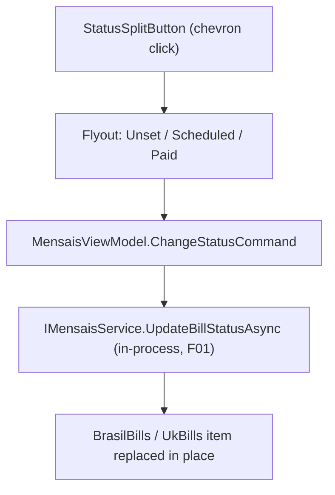

# F03. Mensais Inline Status Control (WPF)

## 1. Technical Overview

**What:** Replace `BillTableView`'s read-only `DataGridTextColumn` for `Status` with a new reusable `StatusSplitButton` control (`Wpf.Ui.Controls.SplitButton`): a colored status tag whose chevron opens a `Flyout` listing all 3 `BillStatus` values, the current one shown with a checkmark and disabled. Selecting a different value calls `IMensaisService.UpdateBillStatusAsync` (added by F01) directly — `Financial.App` composes the CashFlow Application layer in-process, so this is a normal service call, not an HTTP request — and updates the affected row in place.

**Why:** Brings WPF to the same fast, color-coded status workflow React already has (F02), closing the parity gap called for by the PRD and by this project's UI invariant that WPF must provide an equivalent user outcome to React for every cross-platform workflow. Since `Financial.App` already depends on `Financial.CashFlow.Application` directly, F01's new `UpdateBillStatusAsync` service method is available immediately with no additional wiring.

**Scope:**
- **Included:** New `StatusSplitButton` UserControl; one new `BillStatusToBrushConverter`; `BillTableView`/`MensaisView` wiring; a new `ChangeStatusCommand` and `StatusChangeError` on `MensaisViewModel`; `docs/ui/wpf.md` documentation of the Flyout/DataContext pattern this control relies on; ViewModel and control tests.
- **Excluded:** Any change to the existing `EditBillFormView`'s status `ComboBox` or `SaveEditAsync`'s full-record save path, which stays exactly as-is and, like React's edit form, never triggers the F05 Expense prompt; the F05 Expense-generation dialog itself (separate feature); any change to `MensaisController`/the HTTP API (F01 already covers it — WPF bypasses HTTP entirely for this call).

## 2. Architecture Impact

**Affected components:**

| Component | File | Change |
|---|---|---|
| Control | `Financial.App/Controls/StatusSplitButton.xaml` (+ `.xaml.cs`) | New |
| Converter | `Financial.App/Converters/BillStatusToBrushConverter.cs` | New |
| View | `Financial.App/Views/CashFlow/BillTableView.xaml` (+ `.xaml.cs`) | Modified — status column, new dependency properties |
| View | `Financial.App/Views/CashFlow/MensaisView.xaml` | Modified — wire new bindings for both Brasil/UK tables |
| ViewModel | `Financial.App/ViewModels/CashFlow/MensaisViewModel.cs` | Modified — new command and error property |
| App resources | `Financial.App/App.xaml` | Modified — register the new converter |
| Docs | `docs/ui/wpf.md` | Modified — document the Flyout/DataContext-inheritance pattern |
| Tests | `Tests/Financial.Presentation.Tests/ViewModels/CashFlow/MensaisViewModelTests.cs` | Modified |
| Tests | `Tests/Financial.Presentation.Tests/ViewModels/CashFlow/TestStubs.cs` | Modified — track the status-change request |

## 3. Technical Decisions

| Decision | Chosen Approach | Alternative Considered | Trade-off |
|---|---|---|---|
| Split-button click zones | Use `Wpf.Ui.Controls.SplitButton` as-is: only the chevron opens the status `Flyout`; the primary (label) segment has no bound `Command` and does nothing when clicked | Force the whole control to open the menu (matching React's `MenuButton`, where the entire area is clickable) via a code-behind `Click` handler on the primary segment too | `SplitButton`'s native two-zone behavior (primary action vs. flyout trigger) is the idiomatic WPF-UI convention for this exact control — fighting it to force full-area-opens-menu adds a code-behind handler for no outcome difference: both reach "2 clicks: open, select" for the AC's click-count requirement. Per the project's UI invariant, an equivalent outcome is required, not an identical control |
| Per-row busy state during a status change | None — the current-status item is already disabled (preventing a same-value reselect), matching the existing `DeleteBillCommand`, which also has no per-row busy indicator | Add an `UpdatingStatusBillId` property plus an `IsUpdating`-driven disable, mirroring React's F02 busy state | `Financial.App`'s existing per-row commands (`EditBillCommand`, `DeleteBillCommand`) already ship without a busy-disable; introducing one only for this new command would be an unjustified one-off given the call is a fast in-process service call, not a network round trip |
| Status → color mapping | Exact hex values sampled from the real rendered React `Badge` (`Unset`: `#FFFFFF` background / `#242424` text; `Scheduled`: `#EBEBEB` / `#616161`; `Paid`: `#107C10` / `#FFFFFF`), applied via one `BillStatusToBrushConverter` | Fluent's documented default token values, which can drift from a specific rendered version | Per `docs/ui/decisions/ADR-005`'s own guidance to sample the actual rendered pixel color rather than a theoretical token, this guarantees pixel parity with what F02 actually ships, not just semantic intent |
| Menu content mechanism | `ItemsControl` of `ui:Button`s inside the `SplitButton.Flyout`, with each item's "is this the current status" state computed via a `MultiBinding` + the existing `EqualityToBoolConverter` bound through `ElementName=root` (the control itself), driving an `IsEnabled`/checkmark `DataTrigger` | A new dedicated converter, or binding directly into the Flyout content's inherited `DataContext` | `Flyout` content is a `Popup`-based root that does not inherit the visual tree's `DataContext` (confirmed by the existing `HelpFlyoutButton.xaml`, which already works around exactly this with a `RelativeSource`/`ElementName` binding) — reusing `EqualityToBoolConverter` (already used for this same "is-this-the-selected-one" comparison in `Sidebar.xaml`) needs zero new converter for this part |

## 4. Component Overview

**WPF:**

| File Path | New/Modified | Purpose | Key Responsibilities |
|---|---|---|---|
| `Financial.App/Controls/StatusSplitButton.xaml` / `.xaml.cs` | New | Reusable status tag-with-menu control | Dependency properties `Statuses` (`IEnumerable<string>`), `Status` (`string`), `Bill` (`object`, opaque row payload), `ChangeStatusCommand` (`ICommand`); renders a `Wpf.Ui.Controls.SplitButton` colored via `BillStatusToBrushConverter`, whose `Flyout` lists every status with the current one checked/disabled (via the `Tag`+`EqualityToBoolConverter`+`DataTrigger` pattern from `Sidebar.xaml`); a `Click` handler on each flyout item (code-behind, no domain logic) calls `ChangeStatusCommand.Execute(new StatusChangeRequest(Bill, candidateStatus))` and closes the flyout |
| `Financial.App/Converters/BillStatusToBrushConverter.cs` | New | Status → color mapping | `IValueConverter` taking `ConverterParameter` `"Background"`/`"Foreground"`, returning the matching `SolidColorBrush` for `Unset`/`Scheduled`/`Paid` per the sampled hex values above |
| `Financial.App/Views/CashFlow/BillTableView.xaml` / `.xaml.cs` | Modified | Grid wiring | Replaces the `Status` `DataGridTextColumn` with a `DataGridTemplateColumn` hosting `StatusSplitButton` (`Status="{Binding Status}"`, `Bill="{Binding}"`, `Statuses="{x:Static vm:MensaisViewModel.Statuses}"`); adds a `ChangeStatusCommand` dependency property (`ICommand`), following the existing `EditBillCommand`/`DeleteBillCommand` pattern |
| `Financial.App/Views/CashFlow/MensaisView.xaml` | Modified | Command wiring | Both `BillTableView` instances (Brasil and UK) bind `ChangeStatusCommand="{Binding ChangeStatusCommand}"`; a new `TextBlock` shows `StatusChangeError` alongside the existing `DeleteError`/`ResetError` rows |
| `Financial.App/ViewModels/CashFlow/MensaisViewModel.cs` | Modified | Business logic | New `RelayCommand<StatusChangeRequest> ChangeStatusCommand`; `ChangeStatusAsync(StatusChangeRequest request)` calls `_mensaisService.UpdateBillStatusAsync`, then replaces the matching bill in whichever of `BrasilBills`/`UkBills` contains it; on failure, sets `StatusChangeError` and leaves both collections untouched (no optimistic update, so failure needs no explicit revert) — mirrors `DeleteBillAsync`'s plain try/catch shape, logging only the exception type per FR-014 |
| `Financial.App/App.xaml` | Modified | Resource registration | Registers `BillStatusToBrushConverter` alongside the existing converters |

**Data Model:** None — consumes the existing `RecurringBillDTO` shape and F01's `IMensaisService.UpdateBillStatusAsync` contract, called in-process.

## 5. Requirements

### Business Rules (from PRD Capabilities)

- Both `BillTableView` instances (Brasil and UK) use the same `StatusSplitButton`; behavior is identical for both Areas (Area-specific behavior belongs to F05, not this control).
- The Flyout always lists all 3 `BillStatus` values; the item matching the bill's current status is checked and disabled; the other two invoke `ChangeStatusCommand`.
- The existing `EditBillFormView` status `ComboBox` and `SaveEditAsync` are unchanged and remain a second, always-available path to change status, never triggering the F05 Expense prompt (that prompt reacts only to `ChangeStatusCommand`, per F05's own spec).

### UX Flows (from PRD Experience)

- Clicking the chevron opens the Flyout, anchored below the control.
- Selecting a different status closes the Flyout; on success, the tag's text/color updates immediately (the `SolidColorBrush` binding follows the bound `RecurringBillDTO` instance, which is replaced in the `ObservableCollection`).
- On failure, the Flyout is already closed (selection dismisses it regardless of outcome, matching `SplitButton`'s native behavior) and `StatusChangeError` appears in the same error region as `DeleteError`/`ResetError`; since the collection item is never replaced on failure, the tag still shows the original status — no explicit "revert" step is needed.
- Keyboard and screen-reader accessible via `SplitButton`'s and `Flyout`'s own built-in behavior (Tab to focus, Enter/Space to open/activate, arrow keys within the flyout's items, Escape to dismiss); `AutomationProperties.Name` set on the `SplitButton` to `"Status: {Status}. Change status"`, matching F02's `aria-label` wording for cross-platform terminology consistency.

## 6. Error Handling

| Scenario | Handling |
|---|---|
| `UpdateBillStatusAsync` throws (unknown bill id, invalid status — cannot happen here since the status always comes from the fixed `Statuses` list, but a concurrent external deletion of the bill is possible) | `ChangeStatusAsync` catches the exception, logs the exception type only (never the message, per FR-014's financial-value redaction rule), and sets `StatusChangeError` to the exception's message; the bill collections are left untouched |
| Rapid repeated clicks on the same row | Not specially guarded, consistent with the existing `DeleteBillCommand`'s lack of a busy-disable; the current-status item is already unclickable, which is this control's primary protection against a redundant no-op request |

## 7. Testing Strategy

| Test File | Test Type | Target | Coverage Goal |
|---|---|---|---|
| `Tests/Financial.Presentation.Tests/ViewModels/CashFlow/MensaisViewModelTests.cs` | Unit (stub `IMensaisService`) | `MensaisViewModel.ChangeStatusCommand`/`ChangeStatusAsync` | Success path (collection replaced in place, correct sub-collection), failure path (error set, collection untouched), Brasil vs. UK routing |
| `Tests/Financial.Presentation.Tests/ViewModels/CashFlow/TestStubs.cs` | N/A (test support) | `StubMensaisService` | Records the last `UpdateBillStatusAsync` request (id + status) for assertions, alongside the existing `LastUpdateRequest` |

**Test Functions:**

| Test Function | Description | Assertions |
|---|---|---|
| `ChangeStatusAsync_ValidRequest_UpdatesTheMatchingBillInPlace` (Theory over Brasil/UK) | Seed a bill in the relevant collection, execute the command with a new status | The service receives the bill's id and the new status; the same-index item in the correct collection (`BrasilBills`/`UkBills`) is replaced with the returned `RecurringBillDTO`; the other collection is untouched |
| `ChangeStatusAsync_ServiceThrows_SetsErrorAndLeavesCollectionsUntouched` | Configure the stub to throw | `StatusChangeError` is set to the exception message; both `BrasilBills` and `UkBills` remain exactly as seeded |
| `ChangeStatusCommand_ExecutesChangeStatusAsync` | Execute the `ICommand` directly with a `StatusChangeRequest` | Same outcome as calling `ChangeStatusAsync` directly, confirming the command is wired |

The PRD's F03 acceptance criteria ("same colored tag-with-chevron control", "keyboard and screen-reader accessible") are UI-rendering/interaction concerns that this project's testing conventions verify by direct inspection of the running app (per `docs/ui/review-checklist.md` and the `fluent-ui` skill's mandate to actually run the view), not by WPF UI-automation tests — `Financial.App`'s existing test suite has no such automation layer, consistent with `wpf-presentation.md`'s guidance to test ViewModels with stubbed services rather than rendered controls.
