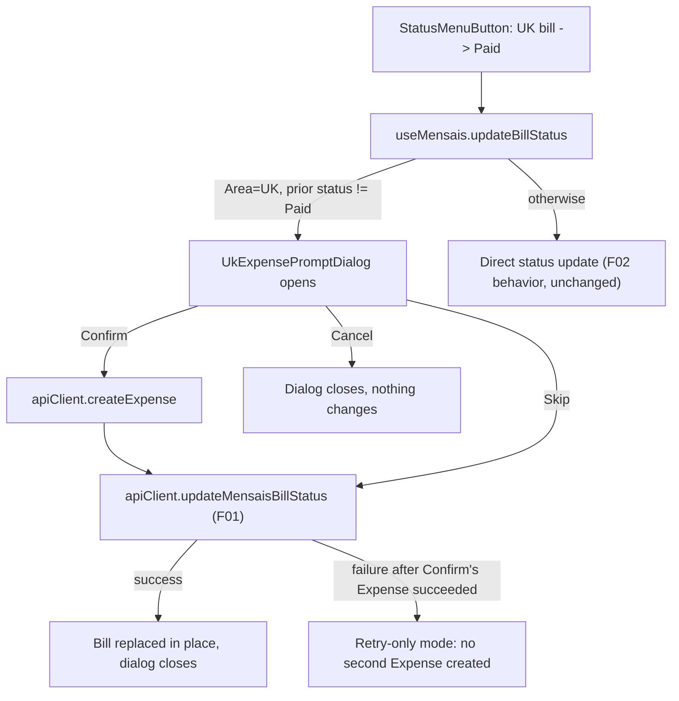

# F04. UK Paid-to-Expense Prompt (React)

## 1. Technical Overview

**What:** When F02's status control commits a UK bill's transition into `Paid` (from `Unset` or `Scheduled`), intercept that transition and show a blocking confirmation dialog offering to create a standalone Expense from the bill's data before the status change is committed. The dialog reuses the existing Expense-creation endpoint and Bank/Category lists — no new backend endpoint is introduced.

**Why:** Per the PRD, this removes the duplicate manual step of separately logging a UK bill's payment in the Expenses tab. Scoping the prompt to the `updateBillStatus` call path (not the full edit-form save) keeps it isolated to exactly the interaction it's meant to augment.

**Scope:**
- **Included:** A new `UkExpensePromptDialog` component; `useMensais` hook extensions (Bank/Category fetch, prompt state machine, the UK-transition interception inside the existing `updateBillStatus`); wiring into `MensaisPage`; tests.
- **Excluded:** Any backend change (F01's status endpoint and the pre-existing `/expenses` endpoint are both reused as-is); the WPF equivalent (F05); any change to the existing edit-form drawer, which never triggers this prompt regardless of Area or resulting status (unchanged since F02).

## 2. Architecture Impact

**Affected components:**

| Component | File | Change |
|---|---|---|
| Component | `Financial.Web/src/components/UkExpensePromptDialog.tsx` | New |
| Hook | `Financial.Web/src/hooks/useMensais.ts` | Modified — Bank/Category fetch, prompt state machine |
| Page | `Financial.Web/src/pages/MensaisPage.tsx` | Modified — render the dialog, pass through new hook fields |
| Tests | `Financial.Web/src/components/__tests__/UkExpensePromptDialog.test.tsx` | New |
| Tests | `Financial.Web/src/hooks/__tests__/useMensais.test.ts` | Modified |
| Tests | `Financial.Web/src/pages/__tests__/MensaisPage.test.tsx` | Modified |

## 3. Technical Decisions

| Decision | Chosen Approach | Alternative Considered | Trade-off |
|---|---|---|---|
| State ownership | Extend `useMensais.ts` with the Bank/Category fetch and the whole prompt state machine, rather than a separate composed hook | A dedicated `useUkExpensePrompt` hook composed alongside `useMensais` | React hooks don't share reducer state atomically across hook boundaries without lifting state up; `useMonthly.ts` already funnels a comparably wide set of concerns (expenses, banks, categories, cards, income) into one hook+reducer, so this keeps the same established shape rather than inventing hook-composition machinery for one feature |
| Bank/Category fetch timing | Add `apiClient.getBanks()`/`getCategories()` to the same initial `Promise.all` as `getMensaisBills()`, sharing one loading/error cycle | Fetch banks/categories lazily only when the dialog first opens | Matches `useMonthly.ts`'s existing pattern (which fetches banks/categories in the same `Promise.all` as its primary data) rather than introducing a second, page-specific fetch-on-demand convention |
| Dialog component shape | New self-contained `UkExpensePromptDialog` with its own local form state (description/value/date/bankId/categoryId), modeled directly on `RecurringBillFormDialog.tsx` | Reuse the general-purpose `ExpenseForm`/`useExpenseForm` (used by `MonthlyPage` for full Expense CRUD, including card/round-up/invoice-month modes) | `ExpenseForm` carries card-payment, round-up, and invoice-month modes this flow never needs (always bank-paid, immediate). A small dedicated dialog mirrors the project's own precedent for a focused, single-purpose Dialog (`RecurringBillFormDialog`, `BankFormDialog`, etc.) instead of stretching a multi-mode form to fit |

## 4. Component Overview

**Frontend:**

| File Path | New/Modified | Purpose | Key Responsibilities |
|---|---|---|---|
| `Financial.Web/src/components/UkExpensePromptDialog.tsx` | New | Confirmation dialog | Local state for description/value/date/bankId/categoryId, seeded from the bill and `todayIsoDate()`; renders Description/Value/Date inputs and required Bank/Category `Select`s (no default selection); three actions — Confirm (disabled until Bank+Category+valid Value/Description), Skip, Cancel — that call back to props supplied by `MensaisPage`; when `isRetryOnly` is true, hides the form and Confirm/Skip, showing only the status-update error and a "Retry marking as Paid" action plus Close |
| `Financial.Web/src/hooks/useMensais.ts` | Modified | State management | Adds `banks`, `categories` to the initial `Promise.all` fetch; adds `expensePromptBill: RecurringBillDto \| null`, `isCreatingExpense: boolean`, `expenseCreateError: string \| null`, `expenseCreatedForRetry: boolean` to state; `updateBillStatus(id, status)` gains a branch — when the target bill's `area === 'UK'`, the requested `status === 'Paid'`, and its current `status !== 'Paid'`, it sets `expensePromptBill` instead of calling the API; adds `confirmExpensePrompt(values)`, `skipOrRetryExpensePrompt()`, `closeExpensePrompt()`; the existing status-update success path (shared with F02) also clears the prompt fields when the updated bill matches the open prompt |
| `Financial.Web/src/pages/MensaisPage.tsx` | Modified | Page wiring | Renders `<UkExpensePromptDialog>` when `expensePromptBill` is set, passing `banks`, `categories`, and the new hook callbacks; `StatusMenuButton`'s `onChange` continues to call the same `updateBillStatus` as before (no prop-signature change to `BillRow`/`BillTable`/`StatusMenuButton`) |

**Consumed APIs (both pre-existing, no new endpoint):**

| Method | Path | Consumed by |
|---|---|---|
| GET | `/api/v1/financial/banks` | `useMensais`'s initial fetch |
| GET | `/api/v1/financial/categories` | `useMensais`'s initial fetch |
| POST | `/api/v1/financial/expenses` | `confirmExpensePrompt` |
| POST | `/api/v1/financial/mensais/{id}/status` | `confirmExpensePrompt` (after a successful Expense) and `skipOrRetryExpensePrompt` (F01, already consumed by F02) |

**Data Model:** None — consumes existing `RecurringBillDto`, `BankDto`, `CategoryDto`, `ExpenseCreateDto` shapes.

## 5. Requirements

### Business Rules (from PRD Capabilities)

- Trigger condition, checked entirely client-side inside `updateBillStatus`: `bill.area === 'UK' && targetStatus === 'Paid' && bill.status !== 'Paid'`. Any other combination (Brasil, a non-Paid target, or a bill already Paid) updates status exactly as F02 already does, with no dialog.
- The dialog's Confirm path always sends `PaymentSourceBankId` (never `CreditCardId`) to `/expenses`, producing a standalone, unlinked `ImmediatePayment`-shaped Expense — no field anywhere records that it came from this bill.
- Confirm is disabled until Description is non-empty, Value parses to a number greater than zero, and both Bank and Category are selected — mirroring `RecurringBillFormDialog`'s inline validation style, not a separate validation library.
- Once an Expense has been created for the current prompt (`expenseCreatedForRetry === true`), a subsequent status-update failure never re-offers Confirm/Skip — only a status-only retry — so a retry can never create a second Expense.

### UX Flows (from PRD Experience)

- The dialog opens immediately (synchronously, before any network call) when the trigger condition is met, pre-filled with Description = bill description, Value = bill value, Date = `todayIsoDate()`.
- All dialog actions disable while a request is in flight (`isCreatingExpense` or the shared `updatingStatusBillId` matching this bill), preventing a double-submit.
- On Confirm success: dialog closes, the grid's status tag updates to Paid (same in-place replacement F02 already does), and the new Expense exists (visible on the Expenses tab on next visit).
- On Skip success: dialog closes, status tag updates to Paid, no Expense created.
- On Cancel: dialog closes immediately, no API calls, status tag remains at its prior value.

## 6. Error Handling

| Scenario | Handling |
|---|---|
| `createExpense` fails (validation, network) | Dialog stays open with the error shown inline (reusing the `MessageBar intent="error"` pattern from `RecurringBillFormDialog`); status is not committed; user can correct the form and retry Confirm, or choose Skip/Cancel |
| `createExpense` succeeds but the subsequent `updateMensaisBillStatus` fails | `expenseCreatedForRetry` is set; dialog switches to retry-only mode (form and Confirm/Skip hidden), showing the status-update error and a single "Retry marking as Paid" action that re-invokes only the status call — never re-creates the Expense |
| Skip's own `updateMensaisBillStatus` call fails (no Expense was created) | Same shared `statusUpdateError` as F02's non-prompted path; dialog stays open, Skip and Cancel remain available (no retry-only mode, since nothing was created yet) |
| Rapid double-click on Confirm/Skip/Retry | All three actions are disabled while `isCreatingExpense` or the matching `updatingStatusBillId` is truthy |

## 7. Testing Strategy

| Test File | Test Type | Target | Coverage Goal |
|---|---|---|---|
| `Financial.Web/src/components/__tests__/UkExpensePromptDialog.test.tsx` | Component (RTL) | `UkExpensePromptDialog` | Pre-filled fields; Confirm disabled until Bank+Category chosen; calls the right callback per action; retry-only mode hides the form |
| `Financial.Web/src/hooks/__tests__/useMensais.test.ts` | Hook | `updateBillStatus` trigger branch, `confirmExpensePrompt`, `skipOrRetryExpensePrompt` | Trigger fires only for UK + transition-into-Paid; Brasil/already-Paid/non-Paid targets bypass the dialog; Confirm calls `createExpense` then the status endpoint in order; Skip calls only the status endpoint; a status failure after a successful Expense sets retry-only without a second `createExpense` call |
| `Financial.Web/src/pages/__tests__/MensaisPage.test.tsx` | Component (RTL) | Page integration | Marking a UK bill Paid opens the dialog; marking a Brasil bill Paid does not; the existing edit-form path still never opens it (already covered by F02's test, re-verified unaffected) |

**Test Functions:**

| Test Function | Description | Assertions |
|---|---|---|
| `renders prefilled Description, Value, and today's Date` | Render with a bill | Inputs show the bill's description/value and today's ISO date |
| `Confirm is disabled until Bank and Category are selected` | Render, select only Bank | Confirm still disabled; selecting Category too enables it |
| `calls onConfirm with form values` | Fill form, click Confirm | Callback invoked with description/value/date/bankId/categoryId |
| `calls onSkip` | Click Skip | Callback invoked, no form values needed |
| `calls onCancel` | Click Cancel or dismiss the dialog | Callback invoked |
| `retry-only mode hides the form and shows a single retry action` | Render with `isRetryOnly` | Bank/Category/Description/Value/Date not present; one retry button shown |
| `updateBillStatus_UkBillTransitionToPaid_OpensPromptInsteadOfCallingApi` (Theory: from Unset, from Scheduled) | Call with a UK bill | `expensePromptBill` set; `updateMensaisBillStatusMock` not called |
| `updateBillStatus_BrasilBillToPaid_UpdatesDirectly` | Call with a Brasil bill | `expensePromptBill` stays null; status endpoint called directly |
| `updateBillStatus_AlreadyPaidUkBill_UpdatesDirectly` (covers "not from Unset/Scheduled") | Call with a UK bill already Paid, changing to another status | No prompt |
| `confirmExpensePrompt_Success_CreatesExpenseThenUpdatesStatusAndClosesPrompt` | Open prompt, confirm with valid values | `createExpense` called with `PaymentSourceBankId` set and no `CreditCardId`; status endpoint called after; `expensePromptBill` cleared; bill replaced in place |
| `confirmExpensePrompt_ExpenseCreationFails_KeepsPromptOpenWithError` | Mock `createExpense` to reject | `expenseCreateError` set; `expensePromptBill` still set; status endpoint never called |
| `confirmExpensePrompt_StatusUpdateFailsAfterExpenseCreated_EntersRetryOnlyWithoutRecreatingExpense` | Mock status update to reject after a successful `createExpense` | `expenseCreatedForRetry` true; calling the retry function again calls the status endpoint only, `createExpense` still called exactly once total |
| `skipOrRetryExpensePrompt_Success_UpdatesStatusWithoutCreatingExpense` | Open prompt, skip | `createExpense` never called; status endpoint called; prompt closes |

### Cross-Feature Integration (from PRD Section 9)
- `A transition into Paid on a UK bill, captured as F02's status-transition signal, correctly opens F04's dialog with the correct bill id, area, and value carried through` — covered by `updateBillStatus_UkBillTransitionToPaid_OpensPromptInsteadOfCallingApi` and the `MensaisPage` integration test.
