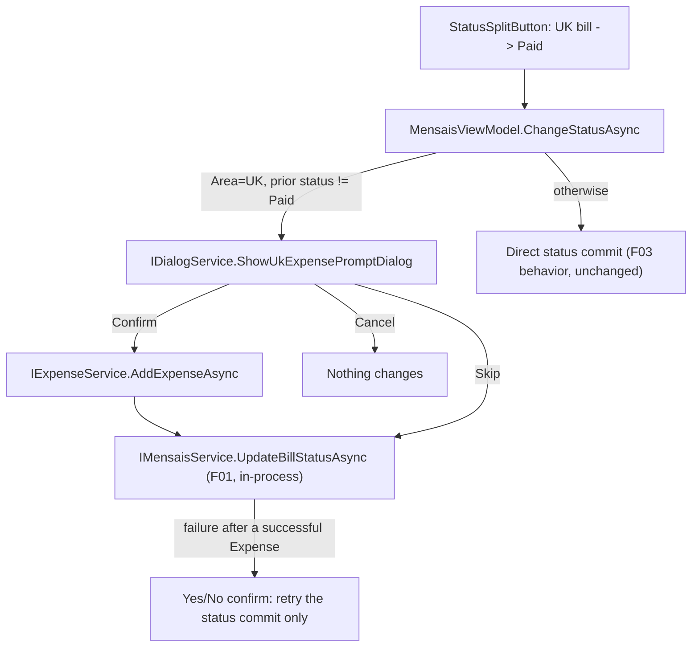

# F05. UK Paid-to-Expense Prompt (WPF)

## 1. Technical Overview

**What:** The WPF equivalent of F04. When F03's status control commits a UK bill's transition into `Paid` (from `Unset` or `Scheduled`), `MensaisViewModel.ChangeStatusAsync` shows a new blocking modal dialog (`UkExpensePromptDialog`) offering to create a standalone Expense from the bill's data before committing the status. Confirm creates the Expense (via `IExpenseService`, in-process, no HTTP) then commits the status; Skip commits the status without an Expense; Cancel does neither. If the Expense is created but the status commit then fails, a Yes/No confirmation (reusing the ViewModel's existing `confirm` delegate) offers a status-only retry that never re-creates the Expense.

**Why:** Closes the last parity gap in this PRD — WPF users get the same duplicate-data-entry relief React users already have. `Financial.App` composes the CashFlow Application layer directly, so `IExpenseService`/`IBankService`/`ICategoryService` are available immediately with no new backend work, exactly as F03 found for `IMensaisService.UpdateBillStatusAsync`.

**Scope:**
- **Included:** A new `UkExpensePromptDialogViewModel` + `UkExpensePromptDialog.xaml` (Window), a new `IDialogService.ShowUkExpensePromptDialog` method (and its `DialogService`/`StubDialogService` implementations), `MensaisViewModel` orchestration (4 new constructor dependencies, the UK-transition interception inside `ChangeStatusAsync`), the `App.xaml.cs` DI registration update, a short `docs/ui/wpf.md` note (this is the first 3-action modal dialog in the codebase), and tests.
- **Excluded:** Any backend change (F01's status endpoint and the pre-existing `IExpenseService`/`IBankService`/`ICategoryService` are all reused as-is); the React implementation (F04, already shipped); any change to `EditBillFormView`, which stays untouched and, like React's edit form, never triggers this prompt (`ChangeStatusAsync` is only reachable from `ChangeStatusCommand`, which `EditBillFormView`'s save path never calls).

## 2. Architecture Impact

**Affected components:**

| Component | File | Change |
|---|---|---|
| ViewModel | `Financial.App/ViewModels/CashFlow/UkExpensePromptDialogViewModel.cs` | New |
| View | `Financial.App/Views/CashFlow/UkExpensePromptDialog.xaml` (+ `.xaml.cs`) | New |
| Service interface | `Financial.App/Services/IDialogService.cs` | Modified — new method |
| Service | `Financial.App/Services/DialogService.cs` | Modified — new method |
| ViewModel | `Financial.App/ViewModels/CashFlow/MensaisViewModel.cs` | Modified — new dependencies, UK-transition interception |
| Composition | `Financial.App/App.xaml.cs` | Modified — `MensaisViewModel` registration |
| Docs | `docs/ui/wpf.md` | Modified — note on the first 3-action modal dialog |
| Tests | `Tests/Financial.Presentation.Tests/ViewModels/CashFlow/UkExpensePromptDialogViewModelTests.cs` | New |
| Tests | `Tests/Financial.Presentation.Tests/ViewModels/CashFlow/MensaisViewModelTests.cs` | Modified |
| Tests | `Tests/Financial.Presentation.Tests/ViewModels/CashFlow/TestStubs.cs` | Modified — `StubExpenseService.ThrowOnAdd` |
| Tests | `Tests/Financial.Presentation.Tests/ViewModels/Admin/TestStubs.cs` | Modified — `StubDialogService` gains the new method (it's the single shared `IDialogService` stub, already reused across areas) |

## 3. Technical Decisions

| Decision | Chosen Approach | Alternative Considered | Trade-off |
|---|---|---|---|
| 3-action dialog result | Extend the existing `CloseRequested`/`DialogCloser` `bool?` convention (every existing `*DialogViewModel` in this codebase is Confirm/Cancel only) with a `Decision` enum property (`Confirm`/`Skip`/`Cancel`) that the caller reads after `ShowDialog()` returns `true`; both Confirm and Skip raise `CloseRequested(true)`, only Cancel raises `false` | Change `CloseRequested`'s signature to a 3-state type everywhere | `DialogCloser` and `Window.DialogResult` are natively `bool?` (a WPF `Window` API constraint) — reusing the existing infrastructure and adding one property is far smaller than introducing a second dialog-closing mechanism for one dialog |
| Where orchestration lives | `MensaisViewModel.ChangeStatusAsync` calls `IExpenseService`/`IMensaisService` directly after the dialog returns (the dialog VM itself is "dumb": it only collects form input and exposes which button was pressed) | Give the dialog VM its own service references and let it orchestrate internally, closing only once fully resolved | Matches 100% of existing dialogs in this codebase (e.g. `BanksViewModel.CreateBankAsync` calls `_bankService.CreateBankAsync` itself after `ShowBankFormDialog` returns `true`) — keeps the new dialog consistent with the established pattern instead of introducing a one-off self-orchestrating dialog |
| Retry-only step (Expense created, status commit failed) | Reuse the existing `Func<string, bool> confirm` delegate already injected into `MensaisViewModel` (a Yes/No `MessageBox`) in a retry loop, rather than re-showing `UkExpensePromptDialog` in a special reduced mode | A second constructor mode for `UkExpensePromptDialogViewModel`/`UkExpensePromptDialog.xaml` that hides the form and shows just the error + a Retry action, mirroring React's in-place reduced view | Confirmed with the user: satisfies the acceptance criterion (shows the error, offers a retry, never recreates the Expense) with zero new dialog code, consistent with how every other confirmation in this ViewModel already works; the visible difference from React (a MessageBox instead of a redrawn custom dialog) is an acceptable, disclosed platform adaptation for a rare failure path |
| Bank/Category source for the dialog | `MensaisViewModel` fetches `IBankService.GetBanks()`/`ICategoryService.GetCategories()` itself (synchronous calls, no persistent `ObservableCollection` needed since nothing else in this ViewModel displays them) and passes the lists into `UkExpensePromptDialogViewModel`'s constructor as plain data | Inject `IBankService`/`ICategoryService` into the dialog VM itself | Matches the "dumb dialog VM, caller-supplied data" pattern of `BankFormDialogViewModel` (takes plain constructor parameters, no service dependencies) rather than the `MonthlyViewModel`/`ExpenseWorkflowViewModel` shared-collection pattern, which doesn't fit a dialog that's shown once and discarded |

## 4. Component Overview

**WPF:**

| File Path | New/Modified | Purpose | Key Responsibilities |
|---|---|---|---|
| `Financial.App/ViewModels/CashFlow/UkExpensePromptDialogViewModel.cs` | New | Dialog form state | Properties `Description` (string), `Value` (string), `Date` (DateTime), `Banks`/`Categories` (`IReadOnlyList<BankDTO>`/`IReadOnlyList<CategoryDTO>`, constructor-supplied), `BankId`/`CategoryId` (`Guid?`); `ConfirmCommand` (enabled only when Description non-empty, Value parses > 0, and both ids are set — mirroring `BankFormDialogViewModel`'s `CanConfirm` pattern), `SkipCommand`, `CancelCommand`; a `Decision` enum property (`Confirm`/`Skip`/`Cancel`) set by whichever command fires; `event EventHandler<bool?>? CloseRequested` |
| `Financial.App/Views/CashFlow/UkExpensePromptDialog.xaml` / `.xaml.cs` | New | Dialog window | `Window` bound to the VM (Date/Description/Value `TextBox`es, Bank/Category `ComboBox`es, Confirm/Skip/Cancel buttons), wired via `DialogCloser.Attach` exactly like `BankFormDialog.xaml.cs` |
| `Financial.App/Services/IDialogService.cs` / `DialogService.cs` | Modified | Dialog hosting | New `bool ShowUkExpensePromptDialog(UkExpensePromptDialogViewModel viewModel)`, implemented as `new UkExpensePromptDialog(viewModel){Owner=...}.ShowDialog() == true`, matching every existing `ShowXFormDialog` method verbatim |
| `Financial.App/ViewModels/CashFlow/MensaisViewModel.cs` | Modified | Orchestration | Constructor gains `IExpenseService expenseService, IBankService bankService, ICategoryService categoryService, IDialogService dialogService`; `ChangeStatusAsync` gains a branch: when `bill.Area == "UK" && request.NewStatus == "Paid" && bill.Status != "Paid"`, fetch banks/categories, construct and show `UkExpensePromptDialogViewModel`; on `false` (Cancel) return with nothing changed; on `Decision == Skip` fall through to the existing status-commit path; on `Decision == Confirm`, call `_expenseService.AddExpenseAsync(...)` (catching failure into `StatusChangeError`, no status commit attempted), then commit the status in a small retry loop that, on failure, calls `_confirm(...)` and either retries (loops) or gives up (sets `StatusChangeError`, returns) — never calling `AddExpenseAsync` again inside that loop |
| `Financial.App/App.xaml.cs` | Modified | Composition | `MensaisViewModel`'s registration gains the 4 new `sp.GetRequiredService<...>()` resolutions, matching `MonthlyViewModel`'s registration style immediately above it |

**Data Model:** None — consumes existing `RecurringBillDTO`, `BankDTO`, `CategoryDTO`, `ExpenseCreateDTO` shapes and F01's `IMensaisService.UpdateBillStatusAsync`/the pre-existing `IExpenseService.AddExpenseAsync`, all called in-process.

## 5. Requirements

### Business Rules (from PRD Capabilities)

- Trigger condition, checked entirely inside `ChangeStatusAsync` before any service call: `bill.Area == "UK" && request.NewStatus == "Paid" && bill.Status != "Paid"`. Any other combination updates status exactly as F03 already does, with no dialog.
- Confirm always sends `PaymentSourceBankId` (never `CreditCardId`) to `AddExpenseAsync`, producing a standalone, unlinked expense — no field anywhere records that it came from this bill (same guarantee as F04).
- `ConfirmCommand` is disabled until Description is non-empty, Value parses to a number greater than zero, and both `BankId` and `CategoryId` are set.
- Once `AddExpenseAsync` has succeeded for the current prompt, the retry loop only ever calls `UpdateBillStatusAsync` again — it can never reach `AddExpenseAsync` a second time for that same transition.

### UX Flows (from PRD Experience)

- The dialog opens immediately (before any service call) when the trigger condition is met, pre-filled with Description = bill description, Value = bill value, Date = today.
- Confirm/Skip/Cancel map exactly to F04's outcomes: Confirm closes the dialog and returns control to `ChangeStatusAsync`, which then creates the Expense and commits the status; Skip closes the dialog and commits the status directly; Cancel closes the dialog with nothing changed.
- On a status-commit failure after a successful Expense creation, a Yes/No `MessageBox` (reusing the existing `confirm` delegate) states the error and asks to retry; declining leaves the bill's status at its prior value with `StatusChangeError` set (the Expense remains, as designed — no linkage exists to find or remove it).

## 6. Error Handling

| Scenario | Handling |
|---|---|
| `AddExpenseAsync` throws (validation, e.g. inactive category) | `StatusChangeError` is set to the exception's message; the status is not committed; the bill collections are untouched |
| `UpdateBillStatusAsync` fails on the Skip path (no Expense was created) | Same shared `StatusChangeError` handling as F03's non-prompted path; no retry loop is entered since there's nothing to protect against re-creating |
| `UpdateBillStatusAsync` fails after a successful `AddExpenseAsync` (Confirm path) | Enters the retry loop: logs the exception type only (never the message, per FR-014), asks the user via `_confirm(...)` whether to retry; accepting calls `UpdateBillStatusAsync` again (no new Expense); declining sets `StatusChangeError` and stops |
| Dialog cancelled | No service calls of any kind; the bill's collections and status are untouched |

## 7. Testing Strategy

| Test File | Test Type | Target | Coverage Goal |
|---|---|---|---|
| `Tests/Financial.Presentation.Tests/ViewModels/CashFlow/UkExpensePromptDialogViewModelTests.cs` | Unit | `UkExpensePromptDialogViewModel` | Pre-fill from the bill; `ConfirmCommand.CanExecute` gating; each command sets the right `Decision` and raises `CloseRequested` with the right bool |
| `Tests/Financial.Presentation.Tests/ViewModels/CashFlow/MensaisViewModelTests.cs` | Unit (stub services) | `MensaisViewModel.ChangeStatusAsync`'s UK-transition branch | Trigger fires only for UK + transition-into-Paid (mirroring F04's hook tests); Confirm calls `AddExpenseAsync` then `UpdateBillStatusAsync` in order; Skip calls only the status update; Cancel calls neither; a status failure after a successful Expense retries via the stubbed `confirm` delegate without a second `AddExpenseAsync` call; declining the retry leaves the bill unchanged with `StatusChangeError` set |
| `Tests/Financial.Presentation.Tests/ViewModels/CashFlow/TestStubs.cs` | N/A (test support) | `StubExpenseService` | Adds `ThrowOnAdd` (mirrors `StubTransferService.ThrowOnAdd`) so the Expense-creation-failure path is testable |
| `Tests/Financial.Presentation.Tests/ViewModels/Admin/TestStubs.cs` | N/A (test support) | `StubDialogService` | Adds `ShowUkExpensePromptDialogResult` / `LastUkExpensePromptDialog` / `OnShowUkExpensePromptDialog`, matching every existing `ShowXFormDialog` stub member exactly |

**Test Functions:**

| Test Function | Description | Assertions |
|---|---|---|
| `Confirm_PrefillsFromBill` | Construct with a bill | `Description`/`Value`/`Date` match the bill and today |
| `ConfirmCommand_DisabledUntilBankAndCategorySelected` | Set fields one at a time | `CanExecute` false until both `BankId` and `CategoryId` are set |
| `Confirm_SetsDecisionAndRaisesCloseRequestedTrue` | Execute `ConfirmCommand` | `Decision == Confirm`; `CloseRequested` fires with `true` |
| `Skip_SetsDecisionAndRaisesCloseRequestedTrue` | Execute `SkipCommand` | `Decision == Skip`; `CloseRequested` fires with `true` |
| `Cancel_SetsDecisionAndRaisesCloseRequestedFalse` | Execute `CancelCommand` | `Decision == Cancel`; `CloseRequested` fires with `false` |
| `ChangeStatusAsync_UkBillTransitionToPaid_ShowsThePromptInsteadOfCallingApiDirectly` (Theory: from Unset, from Scheduled) | Stub dialog result `false` (Cancel) | `ShowUkExpensePromptDialog` called; `UpdateBillStatusAsync` never called |
| `ChangeStatusAsync_BrasilBillOrAlreadyPaid_UpdatesDirectlyWithoutShowingThePrompt` | Brasil bill, or already-Paid UK bill | `ShowUkExpensePromptDialog` never called; `UpdateBillStatusAsync` called directly |
| `ChangeStatusAsync_Confirmed_CreatesExpenseThenCommitsStatus` | Dialog stub sets `BankId`/`CategoryId`, result `true`, `Decision = Confirm` | `AddExpenseAsync` called with `PaymentSourceBankId` set and no `CreditCardId`; `UpdateBillStatusAsync` called after; bill replaced in the correct collection |
| `ChangeStatusAsync_ExpenseCreationFails_DoesNotCommitStatus` | `StubExpenseService.ThrowOnAdd` set | `StatusChangeError` set; `UpdateBillStatusAsync` never called |
| `ChangeStatusAsync_StatusCommitFailsAfterExpenseCreated_RetriesViaConfirmWithoutRecreatingExpense` | `UpdateBillStatusAsync` throws once then succeeds; stub `confirm` returns `true` | `AddExpenseAsync` called exactly once; `UpdateBillStatusAsync` called twice; bill ends up updated |
| `ChangeStatusAsync_DeclinesRetry_LeavesStatusChangeErrorSetAndBillUnchanged` | Same as above but stub `confirm` returns `false` | `StatusChangeError` set; bill collections unchanged |
| `ChangeStatusAsync_Skipped_CommitsStatusWithoutCreatingExpense` | Dialog result `true`, `Decision = Skip` | `AddExpenseAsync` never called; `UpdateBillStatusAsync` called |
| `ChangeStatusAsync_Cancelled_MakesNoServiceCalls` | Dialog result `false` | Neither `AddExpenseAsync` nor `UpdateBillStatusAsync` called |

### Cross-Feature Integration (from PRD Section 9)
- `A transition into Paid on a UK bill, captured as F03's status-transition signal, correctly opens F05's dialog with the correct bill id, area, and value carried through` — covered by `ChangeStatusAsync_UkBillTransitionToPaid_ShowsThePromptInsteadOfCallingApiDirectly` and `Confirm_PrefillsFromBill`.
