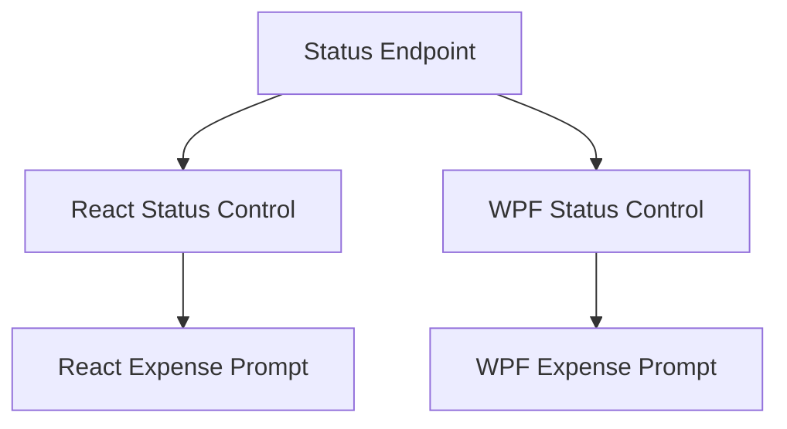

# Mensais Status Actions & UK Expense Automation

## 1. Executive Summary

This feature set upgrades how recurring bills ("Mensais") are managed in the personal financial management tool, for its single household user tracking both Brazil (BR) and United Kingdom (UK) cash flow. Today, changing a bill's status (Unset, Scheduled, Paid) requires opening a full edit drawer, changing an unstyled native dropdown, and saving — three interactions for what is conceptually a single state toggle, and the status itself renders as plain unstyled text in the grid. Separately, marking a UK bill as paid has no connection to the Expense ledger: the user must remember to separately open the Expenses tab and manually re-enter the same description, value, date, bank, and category already implied by the bill they just paid.

This work introduces a compact, color-coded status control — a Fluent UI tag with a dropdown chevron — directly in the Mensais grid's status column, letting the user change status in two clicks, in both Financial.Web (React) and Financial.App (WPF), backed by a new lightweight status-only API endpoint. Layered on top of it, marking a UK bill as Paid through this new control offers an optional, pre-filled prompt to generate a standalone Expense under a chosen Bank and Category, removing the duplicate data-entry step while keeping the created Expense fully independent — editable or deletable on its own, with no linkage back to the bill that spawned it.

At a high level: a new `PATCH`-style status endpoint lets either client update only a bill's status; each client renders that status as an interactive tag-with-menu; and, for UK bills specifically, the moment a bill crosses into Paid through that menu, an inline dialog offers to log the corresponding Expense before the status change is finalized.

## 2. Problem and Opportunity

**The Problem**

- **Slow, multi-step status updates.** Changing a Mensais bill's status requires opening the edit drawer (1 click), changing a native `<select>` (1 interaction), and clicking Save (1 click) — a minimum of 3 steps for a binary/ternary state change that happens routinely every month for every bill.
- **No visual status differentiation.** The status column renders as raw text (`{bill.status}`) with no color, tag, or affordance — the user cannot scan the grid to see which bills are paid, scheduled, or unset without reading each row individually.
- **Duplicated, error-prone payment logging for UK bills.** Marking a UK bill paid creates no Expense record. The user must separately navigate to the Expenses tab and manually retype the description, value, date, bank, and category — data that already exists on the bill — risking mismatched amounts, forgotten entries, or duplicate/triplicate manual work every month across every UK recurring bill.
- **No standardized inline-action pattern in the UI standards.** `docs/ui/fluent-ui-react-v9-pages/` documents one reference page per adopted Fluent component (badge, button, menu, dataGrid, etc.), but has no page or guidance for a compact status-tag-with-menu control, and the existing `Badge` component has zero usages anywhere in the codebase despite being installed. Future grids risk each inventing a different ad hoc status pattern.
- **WPF/React interaction gap.** The WPF Mensais grid renders status as a fully read-only `DataGridTextColumn`, with no inline action of any kind — any new React-only interactivity would widen the existing parity gap between the two front ends unless built for both from the start.

**The Opportunity**

- A Fluent `MenuButton`-style status tag directly solves the multi-step and no-visual-differentiation problems: status is always visible as a colored tag, and changing it is two clicks (open menu, pick status) instead of three separate interactions across a drawer.
- Coupling Expense generation to the Paid transition, scoped to UK bills (the only bills with a meaningful Bank/currency concept in this data model), removes the duplicate manual entry entirely for the exact case where it currently happens every month.
- Documenting the new control as a first-class page in `docs/ui/fluent-ui-react-v9-pages/` and referencing it from the existing control-selection guidance closes the standards gap so future grids reuse the same pattern instead of reinventing one.
- Building the WPF equivalent in the same effort keeps both clients at the parity the project already mandates, rather than deferring a gap that would otherwise need a follow-up project.

## 3. Target Audience

### Primary Users

**Household Finance Administrator**
- Single user who personally maintains both BR and UK recurring bills every month and reconciles them against bank balances.
- Wants fast, low-friction ways to record routine, repetitive actions (marking a bill paid) without re-entering data that already exists elsewhere in the app.
- Uses both Financial.Web and Financial.App (WPF) interchangeably depending on device, and expects the same workflow and outcomes in either one.

## 4. Objectives

**Product Objectives**

- **Cut** the number of interactions needed to change a Mensais bill's status from a minimum of 3 (open edit drawer, change dropdown, save) to at most 2 (open status menu, pick status).
- **Eliminate** the separate manual Expense-entry step for UK bills paid through the new status control, by offering inline Expense generation at the moment the bill is marked Paid.
- **Preserve** the Expense's independence — a generated Expense must be a normal, standalone record indistinguishable from a manually created one, editable or deletable without side effects on the originating bill.
- **Close** the WPF/React parity gap for Mensais status interaction by shipping equivalent controls and prompts in both front ends in the same effort.
- **Establish** a reusable, documented UI standard for status-tag-with-menu controls so future grids do not need to redesign the pattern.

**Success Metrics**

- Status changes in both React and WPF complete in at most 2 user interactions (open menu, select status), verified by manual UX walkthrough against the current 3-step edit-drawer flow.
- 100% of UK bills marked Paid through the new status control surface the Expense-generation prompt before the status change is committed; 0% of status changes made through the existing edit-form dropdown trigger it, for either Area.
- 0 fields on the `Expense` entity or its creation contract change as a result of this work — the generated Expense uses the exact same creation path and shape as a manually entered one, confirmed by code review.
- Both Financial.Web and Financial.App ship the status control and expense prompt in the same PR wave, verified against `docs/ui/review-checklist.md`.
- The existing full edit-form status/value editing flow (`useMensais.ts` `saveEdit`, the `PUT /mensais/{id}` endpoint) continues to pass all pre-existing tests unmodified for both Areas.

## 5. User Stories

### F01. Mensais Status Quick-Change Endpoint
- As the system, I want a dedicated endpoint that updates only a recurring bill's status so that status changes don't require resending the entire bill record.
- As the system, I want the endpoint to validate the target status and bill existence so that invalid or stale requests fail predictably instead of silently corrupting data.

### F02. Mensais Inline Status Control (React)
- As a user, I want to see each Mensais bill's status as a colored tag directly in the grid so that I can tell payment status at a glance without opening the edit form.
- As a user, I want to click the tag's chevron and pick a new status from a menu so that I can change status in two clicks instead of opening the full edit drawer.
- As a user, I want the currently selected status shown as checked and disabled in the menu so that I don't accidentally reselect the status the bill is already in.
- As a user, I want this to work the same way for both my Brasil and UK bill tables so that the grid behaves consistently regardless of which table I'm working in.

### F03. Mensais Inline Status Control (WPF)
- As a user, I want the same colored status tag and dropdown menu in the WPF Mensais grid so that I have the same fast workflow regardless of which app I'm using.
- As a user, I want status changes made in WPF to persist through the same backend behavior as the web app so that both clients stay in sync against the same data.

### F04. UK Paid-to-Expense Prompt (React)
- As a user, I want to be asked whether to generate an Expense when I mark a UK bill as Paid so that I don't have to separately remember to log the payment in my Expenses.
- As a user, I want the Expense dialog pre-filled with the bill's description, value, and today's date so that I only need to pick the Bank and Category before confirming.
- As a user, I want to Skip the prompt and still have the bill marked Paid so that the automation stays optional rather than mandatory.
- As a user, I want to Cancel the whole action so that neither the status nor an Expense changes if I change my mind mid-dialog.
- As a user, I want the generated Expense to be a normal, standalone record so that I can edit or delete it later without it affecting the Mensais bill it came from.
- As a user, I want nothing to happen to that Expense if I later change the bill's status away from Paid so that I retain full manual control over the Expense once it exists.

### F05. UK Paid-to-Expense Prompt (WPF)
- As a user, I want the same optional Expense-generation prompt in WPF when I mark a UK bill Paid so that the workflow doesn't depend on which app I'm using.
- As a user, I want the WPF dialog to offer the same Confirm/Skip/Cancel choices with the same pre-filled fields so that my mental model transfers directly between apps.

## 6. Functionalities

### F01. Mensais Status Quick-Change Endpoint

**Provides:**
- Status-only update capability for a recurring bill (bill id, target status), returning the updated bill record (used by F02, F03)

**Capabilities:**
- New endpoint, e.g. `PATCH /api/v1/financial/mensais/{id}/status`, accepting `{ "status": "Unset" | "Scheduled" | "Paid" }` — the exact 3 values of the existing `BillStatus` enum (`Financial.CashFlow.Domain/Enums/BillStatus.cs`). No new status values are introduced.
- The endpoint updates only the `Status` field on the targeted `RecurringBill`; every other field (`DueDay`, `Description`, `Value`, `Area`, `Note`, `NitNumber`, `MinimumWageValue`) is left untouched, unlike the existing `PUT /mensais/{id}` which requires and rewrites the full record.
- Works identically for bills in either `Area` (Brasil or UK) — the Area distinction only affects the client-side Expense-generation behavior in F04/F05, not this endpoint.
- The existing `PUT /mensais/{id}` endpoint, its validation, and its own status field are unchanged and continue to operate exactly as today.

**Experience:**
- Not directly user-facing; consumed by F02 and F03. Returns the updated `RecurringBillDTO` on success so callers can refresh their local state without a follow-up `GET`.

**Error Handling:**
- Bill id does not exist (e.g. deleted concurrently) → `404 Not Found` with a message identifying the missing bill; caller reverts any optimistic UI update.
- Status value outside the 3 valid values → `400 Bad Request` with a message naming the accepted values.
- Underlying storage write failure (e.g. transient Google Drive error) → `500 Internal Server Error`, surfaced to the caller for retry; no partial write occurs since the JSON document is written as a single unit, consistent with the existing persistence model.

### F02. Mensais Inline Status Control (React)

**Consumes:**
- F01: status-only update endpoint for a recurring bill (bill id, target status)

**Provides:**
- Status-transition signal (bill id, area, previous status, new status) raised when a change into "Paid" is committed through this control (used by F04)

**Capabilities:**
- Replaces the plain-text status cell (`MensaisPage.tsx`'s `<td>{bill.status}</td>`) in both the Brasil and UK `BillTable` instances with a Fluent UI `MenuButton` styled as a colored status tag with a trailing chevron — the entire control (label and chevron alike) opens the same menu, since a true `SplitButton`'s independent primary action does not apply to a pure status-select control.
- The tag's color follows the bill's current status using Fluent's semantic color tokens (e.g. neutral/subtle for Unset, informative/brand for Scheduled, success for Paid), per `docs/ui/design-tokens.md`.
- The menu always lists all 3 statuses (Unset, Scheduled, Paid); the current status renders as checked and disabled (not clickable); the other two are selectable actions.
- Selecting a status calls F01's endpoint for that bill; on success the grid cell updates to the new status/color without a full page or table reload.
- The existing full edit-form drawer (`showEditForm`, the `mensais-edit-status` native `<select>`) is left in place unchanged, including its own status field, as a secondary path — it never triggers the F04 Expense prompt regardless of Area or the status transition involved.
- The new pattern is documented as a new `docs/ui/fluent-ui-react-v9-pages/splitButton.md` page (following the existing per-component doc format) and cross-referenced from `component-selection.md`'s control-selection table and from `menu.md`, so it is discoverable for future grids.

**Experience:**
- Grid renders each bill's status as the colored tag; clicking anywhere on it (label or chevron) opens a menu anchored to the control.
- Choosing a different status closes the menu and immediately reflects the new status/color in the cell; a brief inline loading state (e.g. a spinner or disabled control) shows while the request is in flight, and the control re-enables once the response returns.
- If the update fails (see F01 Error Handling), the cell reverts to its previous status/color and an inline error message (consistent with existing form error presentation) is shown near the row.
- Keyboard operable: the control is reachable by Tab, opens with Enter/Space, and menu items are navigable with arrow keys and selectable with Enter, per WCAG 2.2 AA.

### F03. Mensais Inline Status Control (WPF)

**Consumes:**
- F01: status-only update endpoint for a recurring bill (bill id, target status)

**Provides:**
- Status-transition signal (bill id, area, previous status, new status) raised when a change into "Paid" is committed through this control (used by F05)

**Capabilities:**
- Replaces the read-only `DataGridTextColumn` bound to `Status` (`BillTableView.xaml:39`) with an equivalent inline control using the already-referenced `WPF-UI` package (`Wpf.Ui.Controls.SplitButton`, v4.0.1), styled and colored consistently with F02's tag semantics.
- Same 3-status menu contents and same checked/disabled treatment of the current status as F02.
- Selecting a status calls F01's endpoint the same way F02 does; the existing full `EditBillFormView` status editing path remains unchanged and, like the React edit form, never triggers the F05 Expense prompt.
- `docs/ui/wpf.md` and `docs/ui/fluent-ui-react-v9-pages/... cross-platform-mapping.md` are updated to record the React `MenuButton` tag ↔ WPF-UI `SplitButton` mapping for this control.

**Experience:**
- Equivalent to F02: the tag-with-chevron control sits in the status column of `BillTableView`, opens a dropdown listing all 3 statuses with the current one disabled/checked, and updates the cell in place on success, with the same loading/error/reversion behavior as F02, adapted to WPF's existing busy-state and error-message conventions.
- Keyboard and screen-reader accessible per the WPF accessibility conventions already used elsewhere in `Financial.App`.

### F04. UK Paid-to-Expense Prompt (React)

**Consumes:**
- F02: status-transition signal (bill id, area, previous status, new status)

**Capabilities:**
- Triggers only when all of the following hold: the bill's `Area` is `UK`, the transition is into `Paid` from either `Unset` or `Scheduled` (not already `Paid`), and the change originates from F02's status control specifically — the existing edit-form save path never triggers this prompt, even for a UK bill and even when its result is a transition into Paid.
- On trigger, opens a blocking confirmation dialog before the status change is committed to the backend; the bill's status remains unchanged until the user resolves the dialog.
- Dialog fields, reusing the existing Expense creation form fields/validation (`ExpenseForm.tsx`, `ExpenseCreateDTO`):
  - Description — pre-filled with the bill's `Description`, editable, required non-empty.
  - Value — pre-filled with the bill's `Value`, editable, required and greater than zero.
  - Date — defaults to today's date, editable.
  - Bank — required select populated with all existing banks (no default selection, no region filtering since `Bank` has no region/currency field).
  - Category — required select populated with all active categories (`Category.Active == true`), no default selection.
- Three actions:
  - **Confirm** — creates the Expense via the existing Expense creation capability (`PaymentSourceBankId` set, no `CreditCardId`, matching the standalone/`ImmediatePayment` shape), then calls F01's status endpoint to commit `Paid`. Both must succeed for the flow to complete.
  - **Skip** — calls F01's status endpoint directly to commit `Paid`, with no Expense created.
  - **Cancel** — makes no API calls; the bill's status remains at its previous value and the SplitButton reverts to showing it.
- The created Expense carries no reference back to the `RecurringBill` (no new field is added to either entity for this purpose) — it is functionally identical to one entered manually via the Expenses tab, and can be independently edited or deleted afterward with no effect on the bill.
- Later changing the bill's status away from Paid (through F02, at any time) has no effect on a previously generated Expense — no lookup, warning, or cleanup is performed, since no linkage exists to find it by.
- Re-triggering: if the same bill later transitions into Paid again (e.g. Paid → Scheduled → Paid), the prompt fires again as a fresh, independent transition; no duplicate-prevention tracking exists across separate transitions.

**Experience:**
- Immediately after selecting "Paid" in the status menu for a UK bill currently Unset or Scheduled, a modal dialog opens titled to indicate an optional expense entry, with the fields above pre-filled/empty as specified.
- The Confirm button is disabled until Bank and Category are both selected and Description/Value pass validation, mirroring the existing `ExpenseForm` validation presentation.
- While Confirm or Skip is in flight, all dialog actions are disabled to prevent duplicate submission; a loading indicator shows on the active action.
- On successful Confirm, the dialog closes, the grid's status tag updates to Paid, and the new Expense appears in the Expenses tab on next visit/refresh — no automatic navigation away from the Mensais page occurs.
- On successful Skip, the dialog closes and the grid's status tag updates to Paid with no further indication that an Expense was skipped.
- On Cancel, the dialog closes with no changes to status or Expenses.

**Error Handling:**
- Bank or Category missing at submit time → Confirm remains disabled with inline field-level messages; no request is sent.
- Expense creation call fails (validation or network error) → dialog stays open showing the error; the bill's status is not committed (equivalent to not having confirmed), so the user can correct the form and retry, or fall back to Skip/Cancel.
- Expense creation succeeds but the subsequent F01 status-update call fails → the dialog shows an error stating the Expense was created but the status was not updated, and offers only a "Retry marking as Paid" action (re-invoking F01 for the already-known bill id) rather than re-showing Confirm/Skip — this avoids creating a second, duplicate Expense on retry.
- Double-submission (e.g. rapid double-click) → prevented by disabling all dialog actions once a request is in flight, per Experience above.

### F05. UK Paid-to-Expense Prompt (WPF)

**Consumes:**
- F03: status-transition signal (bill id, area, previous status, new status)

**Capabilities:**
- Same trigger condition, dialog fields, and Confirm/Skip/Cancel semantics as F04, adapted to WPF's existing dialog/form conventions (e.g. the same bank-picker pattern already used in `ExpenseFormView.xaml`).
- Same guarantees on Expense standalone-ness and no effect on unmark-Paid as F04.

**Experience:**
- Equivalent modal dialog flow to F04: pre-filled Description/Value/Date, required Bank and Category selects, Confirm/Skip/Cancel actions, in-flight disabling of actions, and the same post-action outcomes (grid tag updates to Paid either way; Cancel reverts to previous status with no side effects).

**Error Handling:**
- Same scenarios and handling as F04's Error Handling block, expressed through WPF's existing error/message conventions: missing required fields block Confirm; Expense-creation failure leaves the dialog open and status uncommitted; a status-update failure after successful Expense creation offers a status-only retry without recreating the Expense; in-flight double-submission is prevented by disabling dialog actions.

## 7. Out of Scope

**Status pattern reuse**
- Applying the new SplitButton/MenuButton status pattern to any grid other than Mensais (e.g. Card Statements, Investments) in this effort — the new documented standard makes future adoption straightforward, but no other grid is migrated here.
- Adding new `BillStatus` values (e.g. an "Overdue" state) — only the existing 3-value enum is exposed through the new control.

**Expense/bill linkage**
- Adding any field linking a generated `Expense` back to its originating `RecurringBill` (no `RecurringBillId` on `Expense`, no "view generated expense" affordance, no duplicate-generation guard across repeated Paid transitions).
- Automatically deleting, unsettling, or otherwise modifying a previously generated Expense when the bill's status is later changed away from Paid.
- Extending Expense-generation automation to Brasil (BR) Mensais bills — Brasil bills have no Bank/currency concept in the current data model, so the prompt remains UK-only.

**Existing flows preserved as-is**
- Removing or redesigning the existing full edit-form (drawer) status dropdown in either client — it remains available, unchanged, as a secondary, unprompted status-change path.
- Any change to `POST /mensais/reset` or its monthly-reset behavior.
- Bulk or multi-select status changes (changing several bills' status in one action).
- Filtering the Bank or Category dropdowns in the Expense-generation dialog by region/currency — no such field exists on `Bank`, so all active banks and categories are offered exactly as they are in the existing Expense form.

## 8. Dependency Graph

| # | Feature | Priority | Dependencies |
|---|---------|----------|--------------|
| F01 | Mensais Status Quick-Change Endpoint | 1 | None |
| F02 | Mensais Inline Status Control (React) | 1 | F01 |
| F03 | Mensais Inline Status Control (WPF) | 1 | F01 |
| F04 | UK Paid-to-Expense Prompt (React) | 2 | F02 |
| F05 | UK Paid-to-Expense Prompt (WPF) | 2 | F03 |

### Execution Waves
Features within the same wave can be built in parallel. A wave starts only after every feature in earlier waves is complete.

- **Wave 1**: F01
- **Wave 2**: F02, F03
- **Wave 3**: F04, F05

### Priority levels
- **1** = Essential — product does not work without it
- **2** = Important — significant value addition
- **3** = Desirable — incremental improvement

## 9. Acceptance Criteria

### F01. Mensais Status Quick-Change Endpoint
- [x] Calling the status endpoint with a valid bill id and one of `Unset`/`Scheduled`/`Paid` updates only that bill's `Status` field, leaving all other fields unchanged.
- [x] Calling it with a non-existent bill id returns `404 Not Found`.
- [x] Calling it with a value outside the 3 valid statuses returns `400 Bad Request` naming the accepted values.
- [x] The existing `PUT /mensais/{id}` endpoint's behavior, including its own status handling, is unchanged after this endpoint is added.

### F02. Mensais Inline Status Control (React)
- [x] Each bill row in both the Brasil and UK tables shows its status as a colored tag with a chevron instead of plain text.
- [x] Opening the control's menu shows all 3 statuses, with the current one checked and disabled.
- [x] Selecting a different status updates the cell's tag/color in place without a full table reload.
- [x] If the update request fails, the cell reverts to its previous status and an inline error is shown.
- [x] The existing edit-form drawer's status dropdown and save behavior are unchanged and still function.
- [x] The control is operable by keyboard (Tab to focus, Enter/Space to open, arrow keys to navigate, Enter to select).

### F03. Mensais Inline Status Control (WPF)
- [x] The WPF Mensais grid shows the same colored tag-with-chevron status control as React, with equivalent behavior on selection, success, and failure.
- [x] The existing `EditBillFormView` status editing path is unchanged and still functions.
- [ ] The control is keyboard and screen-reader accessible per existing WPF conventions.

### F04. UK Paid-to-Expense Prompt (React)
- [x] Marking a UK bill Paid via F02's control (from Unset or Scheduled) opens the Expense-generation dialog before the status change is committed.
- [x] Marking a Brasil bill Paid via F02's control never opens this dialog.
- [x] Marking any bill (UK or Brasil) Paid via the existing edit-form drawer never opens this dialog.
- [x] The dialog pre-fills Description, Value, and Date from the bill and today's date, respectively, and requires Bank and Category to be selected before Confirm is enabled.
- [x] Choosing Confirm creates a standalone Expense (no link to the bill) and commits the bill's status to Paid.
- [x] Choosing Skip commits the bill's status to Paid without creating an Expense.
- [x] Choosing Cancel leaves both the bill's status and the Expense ledger unchanged.
- [x] Later changing the bill's status away from Paid does not modify, delete, or reference the previously generated Expense.
- [x] If Expense creation succeeds but the status-update call fails, the dialog shows an error and offers a status-only retry, and does not create a second Expense on retry.

### F05. UK Paid-to-Expense Prompt (WPF)
- [x] The WPF Mensais grid surfaces the same trigger condition, pre-filled fields, and Confirm/Skip/Cancel outcomes as F04.
- [x] All F04 acceptance criteria hold equivalently for the WPF client and its data.

### Cross-Feature Integration
- [x] A status change made through F02's control is persisted through F01's endpoint and reflected on a subsequent full page reload of the Mensais page.
- [x] A status change made through F03's control is persisted through F01's endpoint and reflected on a subsequent reload of the WPF Mensais view.
- [x] A transition into Paid on a UK bill, captured as F02's status-transition signal, correctly opens F04's dialog with the correct bill id, area, and value carried through.
- [x] A transition into Paid on a UK bill, captured as F03's status-transition signal, correctly opens F05's dialog with the correct bill id, area, and value carried through.
