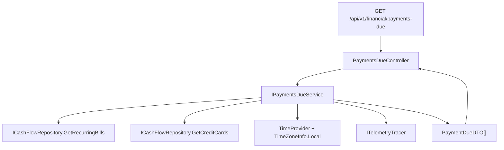

## 1. Technical Overview

**What:** Add a read-only backend aggregation endpoint, `GET /api/v1/financial/payments-due`, that combines unpaid Mensais bills (`RecurringBill` with `Status == BillStatus.Unset`) and credit cards with a scheduled next invoice (`CreditCard.NextInvoiceDueDate`) into a single date-sorted list of payments due within the next 5 days, for consumption by the Web (F02) and WPF (F03) banner features.

**Why:** F02 and F03 both need the identical aggregated, filtered, sorted payment list so the Web and WPF banners stay in feature parity without duplicating the aggregation/urgency logic on each client. Centralizing it in one Application-layer service behind one endpoint is the only way to guarantee both frontends render the same set of payments in the same order (Cross-Feature Integration AC).

**Scope:**
- Included: new `IPaymentsDueService`/`PaymentsDueService` in `Financial.CashFlow.Application`, a `PaymentDueDTO`, DI registration, a new `PaymentsDueController` GET endpoint, host-local "today" computation via `TimeZoneInfo.Local` + injected `TimeProvider`, fail-safe error handling (empty array + logged error, no throw), OpenAPI snapshot + generated frontend types regeneration.
- Excluded: any Web/WPF UI (F02/F03), urgency-tier computation (client-side, per PRD), persistence of shown/dismissed state (explicitly out of scope per PRD §7), polling/refresh while the app is running.

## 2. Architecture Impact

**Affected components:**
- `Financial.CashFlow.Application/DTOs/PaymentDueDTO.cs` — new response DTO.
- `Financial.CashFlow.Application/Interfaces/IPaymentsDueService.cs` — new service contract.
- `Financial.CashFlow.Application/Services/PaymentsDueService.cs` — new aggregation service.
- `Financial.CashFlow.Application/DependencyInjection/CashFlowApplicationServiceCollectionExtensions.cs` — register the new service.
- `Financial.Api/Controllers/PaymentsDueController.cs` — new GET endpoint.
- `Tests/Financial.TestUtilities/StubCashFlowRepository.cs` — add read-failure injection hooks.
- `Tests/Financial.Api.Tests/Contract/openapi-v1.snapshot.json` — regenerated to include the new endpoint.
- `Financial.Web/src/api/generated/openapi.ts` — regenerated from the updated snapshot.

No Domain layer changes: `RecurringBill`, `CreditCard`, and `BillStatus` already expose everything the aggregation needs (`Status`, `DueDay`, `Description`, `NextInvoiceDueDate`, `Name`).



## 3. Technical Decisions

| Decision | Chosen Approach | Alternative Considered | Trade-off |
|----------|----------------|----------------------|-----------|
| "Today" computation | `TimeZoneInfo.ConvertTime(_timeProvider.GetUtcNow(), TimeZoneInfo.Local)` then `DateOnly.FromDateTime(...)`, following `CategorySummaryService`'s constructor-injected `TimeProvider? timeProvider = null` (default `TimeProvider.System`) pattern | Raw `DateTime.Today` (used by `TitheService`) | `DateTime.Today` is untestable (can't pin "today" in tests) and ignores the injected `TimeProvider` the PRD requires; the chosen approach is a new combination in this codebase (no prior `TimeZoneInfo.Local` usage) but is the only way to satisfy the PRD's explicit "host/server local time zone via `TimeZoneInfo.Local` and the injected `TimeProvider`" requirement while staying testable |
| Fail-safe error handling | `catch (Exception ex) { span.MarkFailed(ex); _logger.LogError(ex, ...); return Array.Empty<PaymentDueDTO>(); }` per repository call, no rethrow | Existing codebase convention: every other CashFlow service rethrows after `MarkFailed` (e.g. `CreditCardService.GetCreditCards`) | Deliberate, PRD-mandated deviation from the established rethrow convention — a payments-due failure must never break app startup, whereas a mutation failure elsewhere legitimately should surface to the caller. Documented here so `implement-feature`/reviewers don't "fix" it back to rethrow |
| Sort tie-break for same due date | Fixed ordinal preference: `Mensais` sorts before `CreditCard` via an explicit priority mapping (`Mensais` = 0, `CreditCard` = 1), not `string.CompareOrdinal` | True alphabetical string comparison | True alphabetical order would rank `CreditCard` before `Mensais` (`C` < `M`), which contradicts the PRD's literal requirement ("Mensais before CreditCard alphabetically" — read as intent, not as a literal alphabetical claim). A fixed mapping avoids relying on incidental string ordering |
| Repository read-failure test hook | Extend the shared `StubCashFlowRepository` with `ThrowOnNextGetRecurringBills` / `ThrowOnNextGetCreditCards` flags, mirroring the existing `ThrowOnNextSave` pattern | One-off fake `ICashFlowRepository` local to this feature's test file | Confirmed with the user: keeps the shared-stub convention consistent and makes the read-failure hook reusable by any future feature needing to test a repository read failure |
| Independent per-source failure handling | Mensais aggregation and credit card aggregation are each wrapped in their own try/catch, so a `GetRecurringBills()` failure still returns credit-card payments (and vice versa) | Wrap the entire method body in one try/catch (an error in either source empties the whole response) | PRD §6 Error Handling lists Mensais and credit card repository failures as two separate bullet points with the same fail-safe behavior; per-source isolation is more resilient and costs one extra try/catch, matching the PRD's per-source framing |

## 4. Component Overview

**Backend:**

| File Path | New/Modified | Purpose | Key Responsibilities |
|-----------|--------------|---------|---------------------|
| `Financial.CashFlow.Application/DTOs/PaymentDueDTO.cs` | New | Response shape for one aggregated payment | Flat `sealed class` with `required Type`, `Name` (string), `DueDate` (`DateOnly`), `DaysRemaining` (int) |
| `Financial.CashFlow.Application/Interfaces/IPaymentsDueService.cs` | New | Service contract | Declares `IReadOnlyList<PaymentDueDTO> GetPaymentsDue()` |
| `Financial.CashFlow.Application/Services/PaymentsDueService.cs` | New | Aggregation logic | Queries both repositories independently, computes clamped Mensais due dates, filters `[today, today+5]`, computes `daysRemaining`, sorts, fail-safe per-source error handling, span/logging per existing service convention |
| `Financial.CashFlow.Application/DependencyInjection/CashFlowApplicationServiceCollectionExtensions.cs` | Modified | DI registration | Add `services.AddSingleton<IPaymentsDueService, PaymentsDueService>();` alongside the other CashFlow services |
| `Financial.Api/Controllers/PaymentsDueController.cs` | New | HTTP endpoint | `[Route("payments-due")]`, plain `ControllerBase`, single `[HttpGet]` action delegating to `IPaymentsDueService.GetPaymentsDue()`, `[ProducesResponseType(typeof(IReadOnlyList<PaymentDueDTO>), StatusCodes.Status200OK)]` |

**Test Infrastructure:**

| File Path | New/Modified | Purpose | Key Responsibilities |
|-----------|--------------|---------|---------------------|
| `Tests/Financial.TestUtilities/StubCashFlowRepository.cs` | Modified | Enable read-failure simulation | Add `ThrowOnNextGetRecurringBills` / `ThrowOnNextGetCreditCards` boolean flags; when set, `GetRecurringBills()`/`GetCreditCards()` throw once (mirrors `ThrowOnNextSave`'s reset-after-throw behavior) |

**Contract Artifacts:**

| File Path | New/Modified | Purpose | Key Responsibilities |
|-----------|--------------|---------|---------------------|
| `Tests/Financial.Api.Tests/Contract/openapi-v1.snapshot.json` | Modified (regenerated) | Pins the public API shape | Regenerated via the `UPDATE_OPENAPI_SNAPSHOT=1` flow after the endpoint is added |
| `Financial.Web/src/api/generated/openapi.ts` | Modified (regenerated) | Frontend type source | Regenerated via `npm run generate-api-types` so `openapiFreshness.test.ts` stays green, even though no F02 code consumes it yet |

## 5. API Contracts

**Endpoint: Get Payments Due**
- **Method:** GET
- **Path:** `/api/v1/financial/payments-due`
- **Authentication:** None (matches existing CashFlow endpoints — single-user, self-hosted app)

**Request:** No query parameters, no body.

**Response (Success - 200):**

| Field | Type | Description |
|-------|------|--------------|
| `type` | `string` | `"Mensais"` or `"CreditCard"` |
| `name` | `string` | `RecurringBill.Description` or `CreditCard.Name` |
| `dueDate` | `string` (ISO 8601 date, `YYYY-MM-DD`) | Computed/actual due date |
| `daysRemaining` | `integer` | `0`–`5` inclusive |

**Response Example:**
```json
[
  {
    "type": "Mensais",
    "name": "Internet",
    "dueDate": "2026-09-03",
    "daysRemaining": 1
  },
  {
    "type": "CreditCard",
    "name": "Nubank",
    "dueDate": "2026-09-05",
    "daysRemaining": 3
  }
]
```

**Empty case:** `200 OK` with `[]` when no payment qualifies or when a repository read fails (fail-safe — no distinguishable error response, per PRD).

**Error Codes:** None. The endpoint never returns a non-200 status for repository failures; it returns `200` with `[]` and logs the error server-side (see §3 Fail-safe error handling decision).

## 6. Data Model

No data model changes. This feature reads existing `RecurringBill` and `CreditCard` entities from the single CashFlow JSON document (`data-cashflow.json`) via the existing `ICashFlowRepository`; nothing new is persisted, and `PaymentDueDTO` values are computed on each request, never stored.

## 7. Testing Strategy

**Test File Structure:**

| Test File | Test Type | Target | Coverage Goal |
|-----------|-----------|--------|----------------|
| `Tests/Financial.CashFlow.Application.Tests/Services/PaymentsDueServiceTests.cs` | Unit | `PaymentsDueService` | All acceptance criteria for F01, including boundary dates |
| `Tests/Financial.Api.Tests/PaymentsDueEndpointsTests.cs` | Integration | `GET /api/v1/financial/payments-due` | Route wiring, 200 status, empty-array shape |
| `Tests/Financial.Api.Tests/Contract/OpenApiContractTests.cs` | Contract | OpenAPI snapshot | Existing test; passes once the snapshot is regenerated to include the new endpoint |

**`PaymentsDueServiceTests` functions:**

| Test Function | Description | Assertions |
|---------------|--------------|------------|
| `Constructor_WithNullRepository_Throws` | Null-guard, matches existing service convention | Throws `ArgumentNullException` |
| `GetPaymentsDue_MensaisWithStatusUnsetAndDueDayInWindow_IsIncluded` | Happy path, Mensais | Result contains the bill with correct `type`/`name`/`dueDate`/`daysRemaining` |
| `GetPaymentsDue_MensaisWithStatusScheduledOrPaid_IsExcluded` | AC: status filter | Bill absent from result |
| `GetPaymentsDue_MensaisDueDayBeyondMonthLength_ClampsToLastDayOfMonth` | AC: clamping (e.g. `DueDay=31` in February) | Computed `dueDate` equals Feb 28 (or 29 in a leap year, using pinned `TimeProvider`) |
| `GetPaymentsDue_CreditCardWithNextInvoiceDueDateInWindow_IsIncluded` | Happy path, credit card | Result contains the card with correct fields |
| `GetPaymentsDue_CreditCardWithNullNextInvoiceDueDate_IsExcluded` | AC: null due date filter | Card absent from result |
| `GetPaymentsDue_DueDateEqualsToday_DaysRemainingIsZero` | Boundary: today | `daysRemaining == 0`, included |
| `GetPaymentsDue_DueDateFiveDaysOut_IsIncludedWithDaysRemainingFive` | Boundary: today+5 | Included, `daysRemaining == 5` |
| `GetPaymentsDue_DueDateSixDaysOut_IsExcluded` | Boundary: today+6 | Excluded |
| `GetPaymentsDue_DueDateInPast_IsExcluded` | Boundary: overdue | Excluded |
| `GetPaymentsDue_MultipleQualifyingPayments_SortedByDueDateAscending` | AC: primary sort | Result order matches ascending `dueDate` |
| `GetPaymentsDue_SameDueDate_MensaisSortsBeforeCreditCard` | AC: tie-break by type | `Mensais` entries precede `CreditCard` entries at the same date |
| `GetPaymentsDue_SameDueDateAndType_SortedByNameAscending` | AC: tie-break by name | Alphabetical order within the same date+type group |
| `GetPaymentsDue_RecurringBillRepositoryThrows_ReturnsCreditCardsOnlyAndLogsError` | AC: fail-safe, Mensais source | No exception thrown; result still contains qualifying credit cards; error logged |
| `GetPaymentsDue_CreditCardRepositoryThrows_ReturnsMensaisOnlyAndLogsError` | AC: fail-safe, credit-card source | No exception thrown; result still contains qualifying Mensais bills; error logged |
| `GetPaymentsDue_UsesInjectedTimeProvider_ForTodayComputation` | AC: TimeProvider-driven "today" | Pinned `FakeTimeProvider` value determines which payments qualify, following `CategorySummaryServiceTests`'s pattern |
| `GetPaymentsDue_NoQualifyingPayments_ReturnsEmptyArray` | Empty case | Returns `[]`, not null |

**`PaymentsDueEndpointsTests` functions:**

| Test Function | Description | Assertions |
|---------------|--------------|------------|
| `GetPaymentsDue_ReturnsOk` | Route wiring | `HttpStatusCode.OK`, deserializes to `IReadOnlyList<PaymentDueDTO>` |
| `GetPaymentsDue_NoQualifyingPayments_ReturnsEmptyArray` | Empty case over HTTP | `200` with `[]` body |
