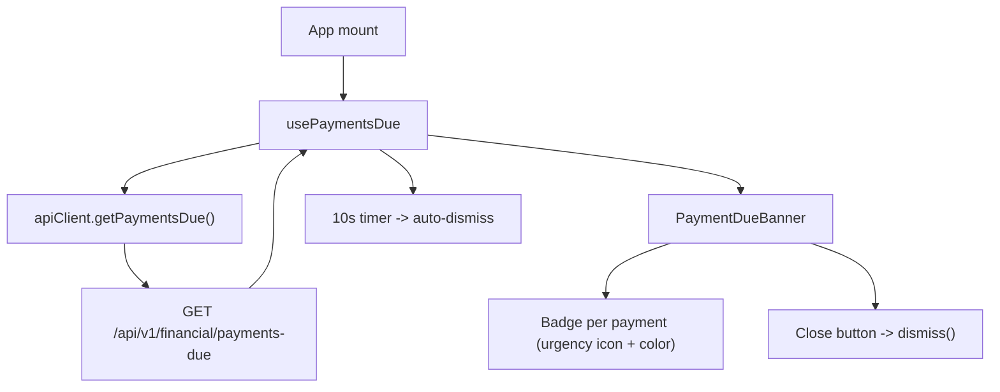

## 1. Technical Overview

**What:** A React banner, `<PaymentDueBanner>`, that fetches F01's `GET /api/v1/financial/payments-due` once on app mount via a new `usePaymentsDue()` hook, renders nothing when the list is empty, and otherwise shows each payment with a per-item urgency indicator (icon + Fluent semantic color), auto-dismissing after 10 seconds or on manual close.

**Why:** F01 already centralizes the aggregation/filtering/sorting logic so both front ends render an identical payment set; F02's job is purely presentational — fetch once, map `daysRemaining` to an urgency tier, and manage the transient visible/dismissed lifecycle without persisting anything, matching the PRD's "no acknowledgement history" requirement.

**Scope:**
- Included: `usePaymentsDue()` hook (fetch-once, 10s auto-dismiss timer, manual dismiss), `<PaymentDueBanner>` component (per-item urgency icon+color, close button, accessible labels), `PaymentDueDto` type alias + `apiClient.getPaymentsDue()`, mounting in `App.tsx` near `<SyncStatusBanner>`.
- Excluded: any backend change (F01, already shipped), the WPF banner (F03), persisting shown/dismissed state, polling while the app stays open, editing a payment from the banner.

## 2. Architecture Impact

**Affected components:**
- `Financial.Web/src/api/types.ts` — add `PaymentDueDto` alias.
- `Financial.Web/src/api/financialApiClient.ts` — add `getPaymentsDue()` to the client interface and implementation.
- `Financial.Web/src/hooks/usePaymentsDue.ts` — new hook: fetch-once, urgency-tier-independent state (`payments`), auto-dismiss timer, manual `dismiss()`.
- `Financial.Web/src/components/PaymentDueBanner.tsx` — new component: renders the banner, maps each payment's `daysRemaining` to an urgency tier (icon + Fluent `Badge` color), close button.
- `Financial.Web/src/App.tsx` — mount `<PaymentDueBanner />` immediately after `<SyncStatusBanner />`.

No Domain/Application/Infrastructure changes — this is a `Financial.Web`-only feature consuming the F01 contract already merged.

## 3. Technical Decisions

| Decision | Chosen Approach | Alternative Considered | Trade-off |
|----------|----------------|----------------------|-----------|
| Banner container widget | Plain `
` styled with Fluent `makeStyles`/semantic tokens (surface background, border, spacing), following `SyncStatusBanner`'s `role="alert"` precedent | Fluent `MessageBar`/`MessageBarGroup` | The PRD lists both as options ("e.g., a Fluent MessageBar or semantic alert `
`"). `MessageBar` carries a single `intent` for the whole bar, but each payment row needs its own urgency tier (danger/warning/info) inside one banner — a semantic div with per-item `Badge` coloring (see next row) fits that requirement directly; `MessageBarGroup`-of-`MessageBar`s would give every row its own dismiss chrome, which conflicts with the PRD's single banner-level close button |
| Per-item urgency indicator | Fluent `Badge` with `color` (`'danger'` \| `'warning'` \| `'informative'`) and `icon` slot (`AlertFilled`/`ClockRegular`/`CalendarRegular` from `@fluentui/react-icons`), text = the days-remaining label, `aria-label` set to the PRD's `"Due today – urgent"`-style string | A bare colored `` + separate icon element | `Badge` is the exact "map a status string to a Fluent color token" pattern this codebase already uses (`StatusMenuButton.tsx`'s `STATUS_COLORS` lookup), and its `color` values (`danger`/`warning`/`informative`) map 1:1 onto Fluent 2's default status palette (ADR-005) — no raw `tokens.colorPalette*` values needed, consistent with the rest of the app (grep confirms zero existing raw-palette-token usage) |
| Fetch-once + auto-dismiss timer ownership | Both live in `usePaymentsDue()` (reducer state `payments: PaymentDueDto[] \| null`; `useEffect` starts a `setTimeout` when `payments` becomes non-null, cleared on dismiss/unmount) | Fetch in the hook, timer in the component | Mirrors `useIncomeForm`'s `SPLIT_CONFIRMATION_DELAY_MS` pattern exactly (`useEffect(() => { if (!msg) return; const id = setTimeout(...); return () => clearTimeout(id) }, [msg])`) — keeping both concerns in the hook means the component stays a pure render function, matching `SyncStatusBanner`'s split (hook owns all state, component only reads it) |
| Manual dismiss cancels the timer | `dismiss()` dispatches the same reducer action the timer's `setTimeout` callback dispatches; the effect's cleanup (`clearTimeout`) fires on the next render because `payments` changes to `null` | A separate `isDismissed` boolean flag layered on top of `payments` | Single source of truth — there's no window where the timer could still fire after a manual close, since the state change that manual-dismiss produces is exactly what the effect's cleanup depends on |
| Date-only field formatting | `formatShortDateUtc(dueDate)` from `utils/formatters.ts` | `formatShortDate` | `dueDate` is a date-only `YYYY-MM-DD` string (OpenAPI `format: date`); the file's own doc comment on `formatShortDateUtc` calls it out as "safe for date-only strings" to avoid a local-timezone off-by-one day, and it's the function already used for exactly this shape (`DividendCheckPage.tsx`'s `item.date`) |

## 4. Component Overview

**Frontend:**

| File Path | New/Modified | Purpose | Key Responsibilities |
|-----------|--------------|---------|---------------------|
| `Financial.Web/src/api/types.ts` | Modified | DTO alias | Add `export type PaymentDueDto = Schema<'PaymentDueDTO'>` near `SyncStatusDto`/`SyncStatusResponseDto` |
| `Financial.Web/src/api/financialApiClient.ts` | Modified | API call | Add `getPaymentsDue: () => Promise<PaymentDueDto[]>` to `FinancialApiClient`; implement as `request<PaymentDueDto[]>('/payments-due')`, following `getSyncStatus`'s shape |
| `Financial.Web/src/hooks/usePaymentsDue.ts` | New | Fetch + lifecycle | Fetch once on mount (no polling); on a non-empty response, hold it in state and start a 10s auto-dismiss timer; expose `dismiss()`; on empty response or fetch error, stay `null` (fail-safe, matches `useSyncStatus`'s `.catch()` swallow) |
| `Financial.Web/src/components/PaymentDueBanner.tsx` | New | Render | Returns `null` when `payments` is `null`/empty; otherwise renders the banner container, title, one row per payment (urgency `Badge` + type label + name + formatted due date), and the close button wired to `dismiss()` |

## 5. API Contracts

**Endpoint consumed: Get Payments Due** (already implemented by F01)
- **Method:** GET
- **Path:** `/api/v1/financial/payments-due` (relative to `API_BASE_URL`, i.e. `apiClient.getPaymentsDue()` calls `request('/payments-due')`)
- **Response:** `PaymentDueDto[]`, each `{ type: string ("Mensais" | "CreditCard"), name: string, dueDate: string (YYYY-MM-DD), daysRemaining: number (0-5) }` — see `Financial.Web/src/api/generated/openapi.ts`'s `PaymentDueDTO` schema (already generated from F01's merged snapshot).
- **Client-side derivation (not part of the wire contract):** urgency tier from `daysRemaining` — `0` → `today` (danger, `AlertFilled`), `1-2` → `soon` (warning, `ClockRegular`), `3-5` → `upcoming` (informative, `CalendarRegular`); type label — `"Mensais"` → `Mensais`, `"CreditCard"` → `Credit card`; days-remaining text — `0` → `"Due today"`, `1` → `"Due in 1 day"`, `2-5` → `` `Due in ${n} days` ``.
- **Client-side failure handling:** any thrown error from `request()` (non-2xx, network failure) is swallowed in `usePaymentsDue`'s `.catch()`, leaving `payments` at `null` — no error UI, matching F01's own fail-safe contract and the PRD's "silently swallow the error and render no banner."

## 6. Data Model

No data model changes. No new persisted state anywhere (browser storage included, per the PRD's explicit "no acknowledgement history" requirement) — `usePaymentsDue`'s state lives only in the React component tree for the lifetime of the tab.

## 7. Testing Strategy

**Test File Structure:**

| Test File | Test Type | Target | Coverage Goal |
|-----------|-----------|--------|----------------|
| `Financial.Web/src/hooks/__tests__/usePaymentsDue.test.ts` | Hook (`renderHook`) | `usePaymentsDue` | Fetch-once, empty/error → null, non-empty → payments, auto-dismiss timer, manual dismiss |
| `Financial.Web/src/components/__tests__/PaymentDueBanner.test.tsx` | Component (RTL) | `PaymentDueBanner` | Render/no-render, per-item content and urgency labeling, close button, accessibility |
| `Financial.Web/src/api/__tests__/financialApiClient.test.ts` (existing file, extended) | Unit | `getPaymentsDue` | Calls `/payments-due` and returns the parsed array — same pattern as the file's other simple-GET tests |

**`usePaymentsDue.test.ts` functions** (mock `apiClient.getPaymentsDue` via `vi.mock('../../api/financialApiClient', ...)`, following `useSyncStatus.test.ts`'s `vi.hoisted` pattern; `vi.useFakeTimers({ shouldAdvanceTime: true })` in `beforeEach`/`vi.useRealTimers()` in `afterEach`):

| Test Function | Description | Assertions |
|---------------|--------------|------------|
| `calls_getPaymentsDue_on_mount` | Fetch-once | `getPaymentsDueMock` called exactly once |
| `does_not_poll` | No interval | Advancing fake timers well past mount does not trigger a second call |
| `payments_null_when_response_is_empty` | Empty case | `result.current.payments` stays `null` |
| `payments_set_when_response_is_non_empty` | Happy path | `result.current.payments` equals the mocked array |
| `payments_null_when_fetch_rejects` | Fail-safe | `getPaymentsDueMock.mockRejectedValue(...)`; `result.current.payments` stays `null`, no thrown error |
| `auto_dismisses_after_10_seconds` | AC: auto-dismiss timing | After a non-empty fetch resolves, `vi.advanceTimersByTime(PAYMENT_DUE_BANNER_DISMISS_MS)`; `result.current.payments` becomes `null` |
| `dismiss_clears_payments_immediately` | AC: manual dismiss | Call `result.current.dismiss()` before the timer elapses; `payments` becomes `null` immediately |
| `dismiss_cancels_the_pending_auto_dismiss_timer` | No double-dismiss side effect | Call `dismiss()`, then advance past `PAYMENT_DUE_BANNER_DISMISS_MS`; no error/warning from a stale timeout firing after unmount-equivalent state |

**`PaymentDueBanner.test.tsx` functions** (mock `usePaymentsDue` via `vi.mock('../../hooks/usePaymentsDue', ...)`, following `SyncStatusBanner.test.tsx`'s mutable-mock-value pattern):

| Test Function | Description | Assertions |
|---------------|--------------|------------|
| `no_banner_when_payments_is_null` | Empty/initial state | `screen.queryByRole('alert')` absent |
| `no_banner_when_payments_is_empty_array` | Defensive empty-array case | `screen.queryByRole('alert')` absent |
| `banner_visible_with_title_when_payments_present` | Happy path | `screen.getByRole('alert')`, `screen.getByText('Upcoming payments')` |
| `renders_type_name_date_and_days_remaining_per_item` | AC: item content | For a seeded payment, text for type label (`Mensais`/`Credit card`), name, `formatShortDateUtc`-formatted date, and days-remaining text all present |
| `today_tier_uses_danger_color_and_alert_icon` | AC: urgency mapping (0d) | Badge for a `daysRemaining: 0` item has `color="danger"` and an `aria-label` containing `"urgent"` |
| `soon_tier_uses_warning_color_and_clock_icon` | AC: urgency mapping (1-2d) | Badge for a `daysRemaining: 2` item has `color="warning"` |
| `upcoming_tier_uses_informative_color_and_calendar_icon` | AC: urgency mapping (3-5d) | Badge for a `daysRemaining: 5` item has `color="informative"` |
| `items_render_in_the_order_provided_by_the_hook` | AC: no client-side re-sort | DOM order of rendered names matches the mocked array's order verbatim |
| `close_button_calls_dismiss` | AC: manual close | `userEvent.click` the close button; the mocked `dismiss` function is called |
| `close_button_is_keyboard_operable` | AC: accessibility | Tab to the close button, press Enter; `dismiss` called |
| `close_button_has_accessible_name` | AC: accessibility | `screen.getByRole('button', { name: /dismiss/i })` resolves |
