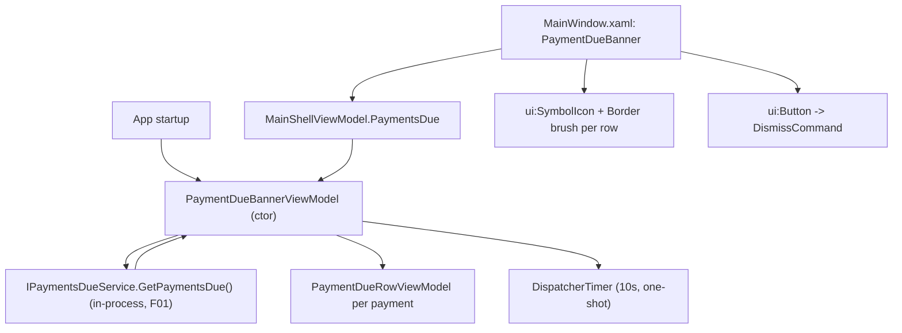

## 1. Technical Overview

**What:** A WPF banner, `<PaymentDueBanner>` (`UserControl`), mounted in `MainWindow.xaml` alongside `<SyncStatusIndicator>`, backed by a new `PaymentDueBannerViewModel` that reads F01's payments-due list once at startup and manages the same 10-second auto-dismiss / manual-dismiss lifecycle as the Web sibling (F02).

**Why:** F01's aggregation service already lives in-process inside `Financial.App` — the WPF app hosts `Financial.CashFlow.Application`/`Infrastructure` directly (confirmed: `App.xaml.cs` already calls `AddFinancialCashFlowApplication()`, which registers `IPaymentsDueService`). F03's job is purely presentational, exactly like F02, just consuming the service via direct constructor injection instead of over HTTP.

**Scope:**
- Included: `PaymentDueBannerViewModel` + `PaymentDueRowViewModel`, `PaymentDueBanner.xaml`/`.xaml.cs` (UserControl), DI registration, wiring into `MainShellViewModel`/`MainWindow.xaml.cs`/`MainWindow.xaml`.
- Excluded: any backend change (F01, already shipped), any change to F02 (Web, already shipped), persisting shown/dismissed state, polling while the app stays open, editing a payment from the banner.

## 2. Architecture Impact

**Affected components:**
- `Financial.App/ViewModels/PaymentDueRowViewModel.cs` — new: wraps one `PaymentDueDTO`, exposes display-ready properties (type label, name, formatted-via-converter due date, days-remaining text, urgency brush/foreground/icon/accessible-label).
- `Financial.App/ViewModels/PaymentDueBannerViewModel.cs` — new: fetches once at construction, holds the row list, owns the one-shot `DispatcherTimer` auto-dismiss and `DismissCommand`.
- `Financial.App/ViewModels/MainShellViewModel.cs` — modified: add a `PaymentDueBannerViewModel PaymentsDue { get; }` constructor parameter, following the existing `SyncStatusViewModel syncStatusViewModel` parameter exactly.
- `Financial.App/MainWindow.xaml.cs` — modified: accept an injected `PaymentDueBannerViewModel` constructor parameter (DI-resolved like `syncStatusViewModel`), pass it into `MainShellViewModel`.
- `Financial.App/MainWindow.xaml` — modified: add `<local:PaymentDueBanner>` next to `<local:SyncStatusIndicator>` in row 0.
- `Financial.App/Components/PaymentDueBanner.xaml` + `.xaml.cs` — new: `UserControl`, mirrors `SyncStatusIndicator.xaml`'s shape (a `Border` gated by a `BoolToVisibilityConverter` binding).
- `Financial.App/App.xaml.cs` — modified: `services.AddSingleton<PaymentDueBannerViewModel>();` next to the existing `SyncStatusViewModel` registration.

No changes to `Financial.CashFlow.Application`, `Financial.CashFlow.Infrastructure`, or `Financial.Api` — F01's `IPaymentsDueService`/`PaymentDueDTO` are consumed as-is.

## 3. Technical Decisions

| Decision | Chosen Approach | Alternative Considered | Trade-off |
|----------|----------------|----------------------|-----------|
| Data access | Constructor-inject `Financial.CashFlow.Application.Interfaces.IPaymentsDueService` directly (already DI-registered via `AddFinancialCashFlowApplication()` in `App.xaml.cs`) and call the existing synchronous `GetPaymentsDue()` | Add `Financial.App`'s first-ever `HttpClient`, matching the PRD's literal "fetches GET /api/v1/financial/payments-due" wording | Confirmed with the user: `Financial.App` has zero HTTP-calling infrastructure anywhere (no `HttpClient`, no base-URL config) — it hosts the CashFlow Application/Infrastructure layers in-process, matching the existing `IAssetPriceLookupService`-into-`AssetPriceFetchViewModel` precedent. Introducing a whole new network layer for one read the process can already make in-process would violate the "right-sized, not over-engineered" invariant. This deviates from the PRD/AC's literal wording but preserves its functional intent |
| No error handling around the service call | Call `GetPaymentsDue()` directly, no try/catch | Wrap the call in a try/catch that logs and defaults to an empty list | F01's `PaymentsDueService.GetPaymentsDue()` already catches every exception internally (span `MarkFailed` + log + `Array.Empty<PaymentDueDTO>()`, per F01's spec Technical Decisions) — it is documented and tested to never throw. Duplicating a try/catch around an already-fail-safe call would be dead code |
| Banner container widget | A `UserControl` with a plain `Border` (mirroring `SyncStatusIndicator.xaml`'s existing shape) styled with WPF-UI theme brushes, not `ui:InfoBar` as the sole container | `ui:InfoBar` (the PRD's "e.g." suggestion) as the whole banner | Same reasoning as F02's Web decision: `InfoBar`'s `Severity` applies once to the whole control, but each payment row needs its own urgency tier — a plain container with per-row styling (mirroring the proven `SyncStatusIndicator` shape) avoids fighting a single-severity control. `ui:Button`/`ui:SymbolIcon` are still used for the close button and urgency icons, satisfying "uses WPF-UI semantic brushes and controls" |
| Urgency icon | `ui:SymbolIcon` with `Symbol="AlertUrgent20"` (`Filled="True"`) for today, `Symbol="Clock20"` for soon, `Symbol="Calendar20"` for upcoming — verified present in the installed WPF-UI 4.0.1 `SymbolRegular`/`SymbolFilled` enums | `Symbol="Alert20"`/`ErrorCircle20` for today | `AlertUrgent20` semantically matches the PRD's "urgent" framing (its own `aria-label` example on the Web side is "Due today – urgent") more precisely than a generic alert glyph; `Filled="True"` matches the PRD's explicit "filled alert icon" requirement for the 0-day tier, mirroring F02's `AlertFilled` vs. `ClockRegular`/`CalendarRegular` (non-filled) choice for exact cross-platform icon-weight parity |
| Urgency brush values | Exact hex sourced from `@fluentui/react-theme`'s `webLightTheme` — the same values Fluent's `Badge` component actually renders for `color="danger"/"warning"/"informative"`: danger bg `#D13438`/fg `#FFFFFF`, warning bg `#FDE300`/fg `#242424`, informative bg `#EBEBEB`/fg `#616161` — frozen `SolidColorBrush` fields, following `BillStatusToBrushConverter`'s `Freeze()` pattern | Approximate/guessed Fluent-like hex values | These are the literal token values Financial.Web's Badge computes into CSS (verified by reading `@fluentui/react-badge`'s style source + resolving the tokens in `@fluentui/react-theme`), not a screenshot approximation — satisfies ADR-005's "match the rendered pixel" intent at the source rather than by eye. Dark-theme values are out of scope for this feature (WPF-UI's dark theme isn't wired to these specific tokens today; tracked as a pre-existing gap per ADR-005, not introduced by F03) |
| Auto-dismiss timer shape | A one-shot `DispatcherTimer` (`Interval = 10s`, `Tick` handler calls `Dismiss()` once then the VM never restarts it) started only when the fetched list is non-empty | A repeating timer like `SyncStatusViewModel`'s (stopped after first tick) | `SyncStatusViewModel`'s timer is the only existing `DispatcherTimer` precedent in this codebase, but it repeats by design (polling); F03 needs exactly one delayed fire, so the timer is created, ticks once, and is never restarted — closest analogue is the React sibling's `setTimeout` (one-shot by nature), adapted to WPF's timer API |
| Testing the auto-dismiss timer | Test `Dismiss()` (the method the timer's `Tick` handler and the manual close command both invoke) directly, not the timer firing itself | Introduce an injectable clock/timer abstraction to fast-forward time in tests | No existing WPF test in this codebase drives simulated time (`SyncStatusViewModelTests` never touches its `DispatcherTimer` either) — introducing a new time-abstraction seam for one feature's timer is disproportionate; testing the shared dismiss path directly covers the same observable behavior (manual close and auto-dismiss both end up calling the identical method) |

## 4. Component Overview

**Frontend (WPF):**

| File Path | New/Modified | Purpose | Key Responsibilities |
|-----------|--------------|---------|---------------------|
| `Financial.App/ViewModels/PaymentDueRowViewModel.cs` | New | Per-payment display data | `TypeLabel` (`"Mensais"`/`"Credit card"`), `Name`, `DueDate` (`DateOnly`, bound through the existing `DateFormatConverter`), `DaysRemainingText`, `UrgencyBrush`/`UrgencyForeground` (frozen `SolidColorBrush`), `UrgencySymbol` (`Wpf.Ui.Controls.SymbolRegular`), `UrgencySymbolFilled` (bool), `UrgencyAccessibleLabel` (e.g. `"Due today – urgent"`) |
| `Financial.App/ViewModels/PaymentDueBannerViewModel.cs` | New | Fetch + lifecycle | Constructor calls `IPaymentsDueService.GetPaymentsDue()` once, builds `Payments` (`IReadOnlyList<PaymentDueRowViewModel>`), sets `IsVisible`, starts the one-shot 10s `DispatcherTimer` when visible, exposes `DismissCommand` (`RelayCommand`) and a `Dismiss()` method shared by the timer tick and the command |
| `Financial.App/ViewModels/MainShellViewModel.cs` | Modified | Shell composition | Add `PaymentDueBannerViewModel paymentDueBannerViewModel` constructor parameter (null-guarded, same style as `syncStatusViewModel`); expose it as `PaymentsDue` |
| `Financial.App/MainWindow.xaml.cs` | Modified | DI wiring | Accept `PaymentDueBannerViewModel` as an additional constructor parameter, null-guard it, pass into the hand-built `MainShellViewModel` |
| `Financial.App/MainWindow.xaml` | Modified | Shell chrome | Add `<local:PaymentDueBanner DataContext="{Binding PaymentsDue}"/>` next to `<local:SyncStatusIndicator>` in row 0 (both wrapped in a `StackPanel` so the row's `Auto` height still works for either/both being visible) |
| `Financial.App/Components/PaymentDueBanner.xaml` | New | Banner UI | `UserControl`: outer `Border` visibility bound to `IsVisible` via `BoolToVisibilityConverter`; header row with title text + `ui:Button`(`Appearance="Transparent"`, `ui:SymbolIcon Symbol="Dismiss20"`, `AutomationProperties.Name="Dismiss upcoming payments"`, `Command="{Binding DismissCommand}"`); `ItemsControl` over `Payments` with a `DataTemplate` per row (urgency `Border`+`ui:SymbolIcon`+text, type label, name, due date via `DateFormatConverter`) |
| `Financial.App/Components/PaymentDueBanner.xaml.cs` | New | Code-behind | Empty `InitializeComponent()` only, matching `SyncStatusIndicator.xaml.cs` |
| `Financial.App/App.xaml.cs` | Modified | DI registration | `services.AddSingleton<PaymentDueBannerViewModel>();` immediately after the existing `SyncStatusViewModel` registration |

**Test Infrastructure:**

| File Path | New/Modified | Purpose | Key Responsibilities |
|-----------|--------------|---------|---------------------|
| `Tests/Financial.TestUtilities/StubPaymentsDueService.cs` | New | Hand-written test double | Implements `IPaymentsDueService`; a mutable `PaymentsToReturn` property (default empty), following `SyncStatusCashFlowRepositoryStub.StatusToReturn`'s exact shape |

## 5. API Contracts

None — F03 introduces no new HTTP surface. It consumes the existing `Financial.CashFlow.Application.Interfaces.IPaymentsDueService.GetPaymentsDue()` in-process call, already specified and tested by F01's spec.

## 6. Data Model

No data model changes. No new persisted state anywhere on the WPF side (no settings file writes) — matching the PRD's explicit "no acknowledgement history" requirement, and mirroring F02's equivalent decision.

## 7. Testing Strategy

**Test File Structure:**

| Test File | Test Type | Target | Coverage Goal |
|-----------|-----------|--------|----------------|
| `Tests/Financial.Presentation.Tests/ViewModels/PaymentDueBannerViewModelTests.cs` | Unit | `PaymentDueBannerViewModel` | Fetch-once behavior, empty/non-empty visibility, dismiss, row mapping |
| `Tests/Financial.Presentation.Tests/ViewModels/PaymentDueRowViewModelTests.cs` | Unit | `PaymentDueRowViewModel` | Urgency tier → brush/icon/label mapping, days-remaining text, type label |

**`PaymentDueBannerViewModelTests` functions** (uses `StubPaymentsDueService`, following `SyncStatusViewModelTests`'s `CreateViewModel(...)` factory pattern):

| Test Function | Description | Assertions |
|---------------|--------------|------------|
| `Constructor_WithNullService_Throws` | Null-guard | Throws `ArgumentNullException` with parameter name |
| `Constructor_FetchesPaymentsImmediately` | AC: fetch-once at startup | `Payments` populated from `StubPaymentsDueService.PaymentsToReturn` right after construction (no explicit `Load()` call needed) |
| `Constructor_WithEmptyResponse_IsVisibleIsFalse` | AC: empty → no banner | `IsVisible` is `false` |
| `Constructor_WithNonEmptyResponse_IsVisibleIsTrue` | AC: non-empty → banner shown | `IsVisible` is `true` |
| `Payments_MapEachDtoToARowViewModel_InOrder` | AC: order preserved | `Payments` count and order match the stub's list verbatim |
| `Dismiss_SetsIsVisibleToFalse` | AC: manual close | Calling `Dismiss()` directly (simulating both the command and the timer tick) sets `IsVisible` to `false` |
| `DismissCommand_Execute_SetsIsVisibleToFalse` | AC: close command wiring | `DismissCommand.Execute(null)` sets `IsVisible` to `false` |

**`PaymentDueRowViewModelTests` functions:**

| Test Function | Description | Assertions |
|---------------|--------------|------------|
| `DaysRemainingZero_MapsToTodayTier` | AC: urgency mapping (0d) | `UrgencySymbol` is `AlertUrgent20`, `UrgencySymbolFilled` is `true`, `DaysRemainingText` is `"Due today"`, `UrgencyAccessibleLabel` contains `"urgent"` |
| `DaysRemainingOneOrTwo_MapsToSoonTier` | AC: urgency mapping (1-2d) | `UrgencySymbol` is `Clock20`, `UrgencySymbolFilled` is `false` |
| `DaysRemainingThreeToFive_MapsToUpcomingTier` | AC: urgency mapping (3-5d) | `UrgencySymbol` is `Calendar20` |
| `DaysRemainingText_OneDayIsSingular` | Text branch | `daysRemaining: 1` → `"Due in 1 day"` (not "1 days") |
| `TypeLabel_CreditCard_DisplaysAsCreditCardWithSpace` | AC: type label | `type: "CreditCard"` → `"Credit card"` |
| `TypeLabel_Mensais_DisplaysAsIs` | AC: type label | `type: "Mensais"` → `"Mensais"` |

**Manual/runtime verification (per `docs/rules/ui.md`'s completion requirement — no automated seam exists for this):**

| Check | How |
|-------|-----|
| Banner renders correctly at startup with real data | Launch the built `Financial.App`, confirm the banner appears above the breadcrumb next to (or below) `SyncStatusIndicator` when qualifying payments exist |
| Auto-dismiss fires at 10 seconds | Observe the banner disappear unassisted after ~10s |
| Manual close works | Click the close button, confirm immediate dismissal |
| React/WPF parity | Compare against the already-shipped F02 Web banner for the same data: same title, same items, same order, same urgency-tier assignment |
