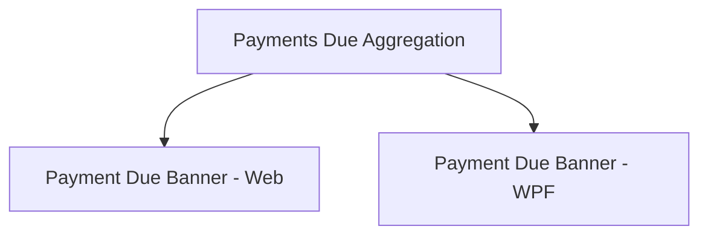

# Payment Due Banner

## 1. Executive Summary

The Payment Due Banner is a transient notification feature that alerts users to imminent bill and credit card payment deadlines when the application starts. It consolidates Mensais bills (recurring monthly bills with a configured due day and unpaid status) and credit card invoices (with a defined next invoice due date) into a single, prioritized list displayed for 10 seconds or until dismissed by the user.

This feature is designed for the single-user, self-hosted Financial application and runs on both the Web and WPF platforms. By surfacing upcoming payments at app startup, it helps users avoid missed deadlines, prevent overdraft penalties, and maintain a clear picture of their immediate financial obligations without requiring them to navigate the full billing interface.

The banner uses color- and icon-based urgency tiers to signal payment proximity: danger-red for payments due today, warning-amber for payments in 1-2 days, and informational-blue for payments in 3-5 days. This visual treatment is compliant with accessibility standards (color + icon, never color alone) and leverages the application's existing Fluent 2 (Web) and WPF-UI (WPF) design systems.

## 2. Problem and Opportunity

### The Problem

**Missed Payment Deadlines**
- Users juggle multiple payment sources (credit cards from different institutions, recurring household bills from various vendors) without a unified visibility layer at app start-up.
- Payment dates are easy to forget, especially when the due day is mid-month and no prompt appears until the user actively navigates to the Mensais or CreditCards page.
- A missed due date can trigger late fees, interest charges, or a negative credit history impact.

**Cognitive Overload on Bill Management**
- Users must open the full Mensais or CreditCards pages to see what is due, then manually assess urgency by comparing dates to today.
- There is no automatic alert or reminder—each due date lives as a static field in a table, with no proactive notification mechanism.
- Without a startup banner, payments within the critical 5-day window are invisible until the user happens to check.

**Lack of Urgency Differentiation**
- All payments, whether due today or 5 days away, are currently shown identically in the app UI, giving no visual cue about which demands immediate action.

### The Opportunity

The Payment Due Banner solves these problems by:
1. **Aggregating imminent payments at startup** — combining Mensais and credit card deadlines into one unified, date-sorted list displayed every time the app starts, ensuring the user cannot miss notifications.
2. **Filtering to the critical window** — including only payments due within 5 days (today through +5 days), which is actionable and avoids noise from distant future dates.
3. **Applying urgency-based visual treatment** — using color + icon indicators to immediately signal which payments need attention today (danger-red) vs. in the near term (amber/blue), enabling fast visual scanning without reading every date.
4. **Reducing friction** — auto-dismissing after 10 seconds allows users to acknowledge the information and move on without leaving the banner permanently visible or requiring manual navigation to close it.

This approach keeps users informed of their most time-sensitive obligations without requiring a dedicated reminders or notification service, and without persisting unnecessary state (no acknowledgement history, no snoozing, no per-device tracking).

## 3. Target Audience

### Primary User

**Self-Hosted Personal Finance Manager**
- Individual user who owns and operates this Financial application on their own server/machine for personal money management.
- Manages accounts across multiple brokers (Brazil + UK investment accounts) and household cash flow (Mensais recurring bills, credit card statements, bank balances).
- Values prompt, lightweight alerts at the moment of highest attention (app startup) to stay on top of payment schedules without manual checking.
- Relies on the app as the single source of truth for financial obligations; missed deadlines have real personal/financial consequences.

## 4. Objectives

**Maximize payment deadline visibility at app startup**
- Ensure every Mensais bill with Status=Unset and a configured Due Day in the notification period (today through +5 days) is displayed in the banner.
- Ensure every credit card with a NextInvoiceDueDate in the notification period is displayed in the banner.
- Success metric: 100% of qualifying payments appear in the banner on app startup (verified via test suite with seeded test data covering boundary cases: today, 1d, 2d, 5d, 6d).

**Prevent payment deadline dismissal due to user action**
- The banner closes automatically after 10 seconds or immediately upon user acknowledgement, ensuring the notification is seen but not intrusive.
- No state is persisted about whether the banner was shown or acknowledged; each app start re-evaluates the qualifying payments and re-displays the banner if items exist.
- Success metric: Banner displays on every app startup when qualifying payments exist; no stored acknowledgement history prevents re-display (verified via reopening the app multiple times with the same qualifying payments in place).

**Support urgent/non-urgent visual differentiation**
- Payments due today are visually distinct (danger-red + alert icon) from payments due in 1-2 days (amber + clock icon) and 3-5 days (blue + calendar icon).
- Visual treatment uses color + icon together, never color alone, to support accessibility (WCAG 2.2 AA).
- Success metric: Each urgency tier renders with its designated color + icon; icon is keyboard-discoverable and labelled for screen readers (verified via accessibility audit of both Web and WPF implementations).

## 5. User Stories

### F01. Payments Due Aggregation (Backend)

- As the system, I want to query all Mensais bills with Status=Unset and a configured Due Day so that I can identify recurring household bills that are not yet marked as paid.
- As the system, I want to calculate the payment date for each Mensais bill by clamping the configured Due Day to the current calendar month so that I can accurately determine whether the bill falls within the notification period.
- As the system, I want to query all credit cards with a non-null NextInvoiceDueDate so that I can identify upcoming invoiced charges.
- As the system, I want to filter both Mensais bills and credit cards to those with due dates within the range [today, today+5 days] inclusive so that I can return only imminent payments.
- As the system, I want to calculate the number of days remaining until each due date so that I can provide precise urgency information to the client.
- As the system, I want to sort the combined list by due date ascending (nearest first), with tie-breaking by payment type and name so that I can present payments in a deterministic, actionable order.
- As the system, I want to expose this list via a dedicated endpoint so that Web and WPF frontends can fetch and display the banner without reimplementing this logic.

### F02. Payment Due Banner (Web)

- As a user, I want to see a banner of upcoming payments when the app starts so that I am immediately aware of imminent bill and credit card payment deadlines.
- As a user, I want the banner to display all qualifying payments in a single, organized list so that I can see my complete payment obligations at a glance.
- As a user, I want each payment to show its type (Credit card or Mensais), name, due date, and the number of days until due so that I can quickly prioritize my actions.
- As a user, I want payments to be visually distinguished by urgency—today's payments in red with an alert icon, 1-2 days away in amber with a clock icon, and 3-5 days away in blue with a calendar icon—so that I can immediately identify which payments demand urgent attention.
- As a user, I want the banner to automatically close after 10 seconds so that it does not obstruct my work but ensures I have time to read the information.
- As a user, I want to manually dismiss the banner with a close button so that I can remove it immediately after acknowledging the payments.
- As a user, I want the banner to reappear on every app start so that I am always reminded of upcoming payments without needing to manually track them.

### F03. Payment Due Banner (WPF)

- As a user, I want to see a banner of upcoming payments when the app starts so that I am immediately aware of imminent bill and credit card payment deadlines.
- As a user, I want the banner to display all qualifying payments in a single, organized list so that I can see my complete payment obligations at a glance.
- As a user, I want each payment to show its type (Credit card or Mensais), name, due date, and the number of days until due so that I can quickly prioritize my actions.
- As a user, I want payments to be visually distinguished by urgency—today's payments in red with an alert icon, 1-2 days away in amber with a clock icon, and 3-5 days away in blue with a calendar icon—so that I can immediately identify which payments demand urgent attention.
- As a user, I want the banner to automatically close after 10 seconds so that it does not obstruct my work but ensures I have time to read the information.
- As a user, I want to manually dismiss the banner with a close button so that I can remove it immediately after acknowledging the payments.
- As a user, I want the banner to reappear on every app start so that I am always reminded of upcoming payments without needing to manually track them.

## 6. Functionalities

### F01. Payments Due Aggregation (Backend)

**Provides:**
- Aggregated list of imminent payments: payment type (`CreditCard` or `Mensais`), payment name, due date, days remaining (used by F02, F03).

**Capabilities:**

- Query Mensais bills (RecurringBill entities) where `Status == BillStatus.Unset` and `DueDay` is between 1 and 31 (inclusive).
- For each qualifying Mensais bill, compute the payment date as `DateOnly(currentYear, currentMonth, Math.Min(DueDay, DaysInMonth(currentMonth)))` — clamping Due Day to the last day of the month if it exceeds the number of days in the current month.
- Query credit cards (CreditCard entities) where `NextInvoiceDueDate` is not null.
- Calculate "today" as the current date in the host/server's local time zone (use `TimeZoneInfo.Local` via the injected `TimeProvider`).
- Filter both Mensais bills and credit cards to those with due dates within the range `[today, today + 5 days]` inclusive (calendar-day comparison, no time-of-day component).
- For each qualifying payment, calculate `daysRemaining = (dueDate - today).Days`.
- Sort the combined list in ascending order by due date; when two items share the same due date, use secondary sort by payment type (`Mensais` before `Credit card` alphabetically) and then by name.
- Return as a JSON array via a new HTTP GET endpoint; return an empty array if no payments qualify.
- Silently handle errors (e.g., repository failures) by returning an empty array rather than failing the request, to prevent banner display from breaking the app startup.

**Experience:**

- Endpoint: `GET /api/v1/financial/payments-due`.
- Response schema: JSON array of objects, each with:
  - `type` (string): `"Mensais"` or `"CreditCard"`.
  - `name` (string): `RecurringBill.Description` or `CreditCard.Name`.
  - `dueDate` (ISO 8601 date string): `YYYY-MM-DD` format.
  - `daysRemaining` (integer): 0–5 (always non-negative; payments already past their due date are filtered out before response).
  - `urgencyTier` (string, derived client-side from `daysRemaining`, not returned by backend): "today" (0d), "soon" (1-2d), "upcoming" (3-5d).
- Success response: HTTP 200 with array payload (may be empty if no qualifying payments).
- Error handling (see section below).
- Timezone basis: all date calculations use the host/server's local time zone (determined via `TimeZoneInfo.Local`), ensuring consistency with the machine's configured time.

**Error Handling:**

- **Repository fails to load Mensais bills**: Log the error with tracing span, return empty array to client (fail-safe; banner does not break on backend error).
- **Repository fails to load credit cards**: Log the error with tracing span, return empty array to client.
- **Current time cannot be determined**: Use `TimeZoneInfo.Local.GetUtcOffset(DateTime.Now)` to compute local time; if this fails, log and return empty array.
- **Due Day is invalid (e.g., outside 1-31 range)**: Skip the bill (it should not occur, but if a corrupted entity exists, ignore it silently during aggregation to avoid crashing the endpoint).
- **NextInvoiceDueDate is in the future beyond +5 days or in the past**: Filter it out (not an error; just outside the notification window).

### F02. Payment Due Banner (Web)

**Consumes:**
- F01: aggregated list of imminent payments (type, name, due date, days remaining).

**Capabilities:**

- Fetch F01 endpoint once on app mount (no polling; single fetch per app lifecycle).
- Parse the response into an in-memory list; if the list is empty, render nothing (no banner).
- If the list is non-empty, render a single banner component displaying the title "Upcoming payments" and a list item for each payment.
- For each payment item, display:
  - An urgency icon + color indicator derived from `daysRemaining` (0d → red alert icon, 1-2d → amber clock icon, 3-5d → blue calendar icon).
  - Payment type label: `Mensais` or `Credit card`.
  - Payment name.
  - Due date in the app's established date format (e.g., `DD/MM/YYYY`).
  - A readable days-remaining label: "Due today" (0d), "Due in 1 day" (1d), "Due in 2 days" (2d), "Due in 3 days" (3d), "Due in 4 days" (4d), "Due in 5 days" (5d).
- Start a 10-second countdown timer on banner display; auto-dismiss the banner when the timer expires.
- Provide a close button (e.g., an X icon or "Dismiss" button) that allows the user to manually close the banner immediately, cancelling the auto-dismiss timer.
- Ensure all interactive elements (close button, urgency icons) are keyboard-operable (Tab/Enter navigation).
- Provide accessible labels and ARIA attributes for the urgency icons and interactive elements (screen-reader announcements of urgency level, payment type, days remaining).
- Do not persist any state (no localStorage, no acknowledged flag) about whether the banner was shown or dismissed; the banner is re-evaluated and re-displayed on every app start.
- Use the existing Fluent 2 component library (`@fluentui/react-components`) for the banner container, buttons, and colors to maintain design system consistency.

**Experience:**

- On app startup (in `App.tsx` or a top-level startup hook), fetch the F01 endpoint via a new `usePaymentsDue()` hook (similar to the existing `useSyncStatus.ts` pattern).
- The hook stores the payments list in local state; if the list is empty, `return null` (render nothing).
- If the list is non-empty, return a new `<PaymentDueBanner>` component, which:
  1. Renders a banner container (e.g., a Fluent `MessageBar` or semantic alert `
`).
  2. Displays the title "Upcoming payments" as a banner heading.
  3. Renders each payment as a list item with:
     - Urgency icon (inline, left-aligned) with accessible label (e.g., `aria-label="Due today – urgent"`).
     - Payment details (type, name, due date, days-remaining text) in a row or card layout.
     - All items sorted as provided by the backend (ascending by due date).
  4. Includes a close button (X icon or "Dismiss") in the banner header or trailing position.
  5. Manages the 10-second auto-dismiss timer via `useEffect`; on expiry, close the banner via `return null` from the hook.
  6. On close-button click, immediately clear the banner (set state to null).
- Banner styling: use Fluent 2 semantic palette:
  - 0 days: `danger` / `error` intent (red).
  - 1-2 days: `warning` intent (amber).
  - 3-5 days: `info` intent (blue).
- Mount the `<PaymentDueBanner>` component in `App.tsx` at the top of the main content area (similar to the existing `<SyncStatusBanner>` placement), above the breadcrumb and outlet.
- On error fetching F01 endpoint (network failure, 5xx, etc.), silently swallow the error and render no banner (fail-safe).

### F03. Payment Due Banner (WPF)

**Consumes:**
- F01: aggregated list of imminent payments (type, name, due date, days remaining).

**Capabilities:**

- Fetch F01 endpoint once during app startup (in `MainWindow.Loaded` or `MainShellViewModel` initialization), no polling.
- Parse the response into an in-memory observable collection; if empty, render no banner.
- If non-empty, display a single banner/snackbar UI using the project's existing WPF-UI library (`ui:InfoBar` or `ui:Snackbar`).
- For each payment item, display:
  - An urgency icon + color indicator derived from `daysRemaining` (0d → red alert icon, 1-2d → amber clock icon, 3-5d → blue calendar icon).
  - Payment type label: `Mensais` or `Credit card`.
  - Payment name.
  - Due date in the app's established format (e.g., `DD/MM/YYYY`).
  - A readable days-remaining label: "Due today" (0d), "Due in 1 day" (1d), etc.
- Start a 10-second countdown timer on banner display; auto-dismiss (collapse or hide) the banner when the timer expires.
- Provide a close button (X) that allows the user to manually dismiss the banner immediately.
- Ensure all controls are keyboard-operable (Tab/Enter navigation, no mouse-only).
- Provide accessible names and automation IDs for the urgency icons and controls.
- Do not persist state; the banner is re-evaluated and re-displayed on every app start.
- Use the project's WPF-UI library controls (`ui:InfoBar`, `ui:Button`, semantic brushes) for styling consistency.

**Experience:**

- On app startup, in `MainWindow.xaml.cs` `Loaded` event or in `MainShellViewModel` constructor, fetch the F01 endpoint via a new `PaymentsDueService` (or equivalent injected service).
- The service calls the endpoint asynchronously; on success, populate an observable collection bound to the XAML view.
- In `MainWindow.xaml` or a new `PaymentsDueBanner.xaml` user control:
  1. Render the banner using `<ui:InfoBar>` or a custom `<Border>` with `Background="{DynamicResource InfoBarInformationalBackgroundBrush}"`.
  2. Display the title "Upcoming payments" as the banner header.
  3. Bind to the observable collection and render a `<ItemsControl>` with a `DataTemplate` for each payment item:
     - Urgency icon (from WPF-UI icon library or a custom trigger) with `ToolTip` explaining the urgency tier.
     - Payment type, name, due date, days-remaining label as `TextBlock`s.
     - All items in the order provided by the backend.
  4. Include a close button (`<ui:Button>` with an X symbol or text "Dismiss") in the banner header.
  5. Manage the 10-second auto-dismiss timer via `DispatcherTimer`; on expiry, collapse or remove the banner from the visual tree.
  6. On close-button click, immediately collapse the banner.
- Styling: use WPF-UI semantic brushes:
  - 0 days: `DangerBrush` or `ErrorBrush` for the urgency icon + alert text color.
  - 1-2 days: `WarningBrush` or `CautionBrush` for the urgency icon + text color.
  - 3-5 days: `InfoBarInformationalForegroundBrush` or `InfoBrush` for the urgency icon + text color.
- Mount the banner in the shell chrome (e.g., in `MainWindow.xaml` before or alongside the existing `SyncStatusViewModel` banner, above the main content).
- On error fetching F01 endpoint, silently swallow and render no banner (fail-safe).

## 7. Out of Scope

**Timezone Configurability**
- The notification window is calculated using the host/server's local time zone (`TimeZoneInfo.Local`). Users cannot configure an alternate time zone per-user or per-context in this initial implementation.

**Snoozing or Deferral**
- Users cannot snooze the banner or defer a payment's notification until a later time. All qualifying payments are shown on every app start.

**Payment State Mutation from Banner**
- Clicking an item in the banner does not open a dialog to edit or mark the payment as paid/scheduled. The banner is read-only; users must navigate to the full Mensais or Credit Cards page to change a bill's status or update a card's next invoice date.

**Display or Acknowledgement History**
- No history is stored of when the banner was shown, which payments were displayed, or when the user dismissed it. This includes no database records, no local storage, and no analytics tracking.

**Periodic Polling While App is Open**
- The banner is evaluated and fetched once per app startup. If a payment's status or due date changes while the app is running (e.g., user opens a second Financial window or another user modifies shared data), the running app will not automatically refresh or re-display the banner. The user must restart the app to see updated payment information.

**Push, Email, or SMS Notifications**
- The banner is the sole notification mechanism. No out-of-app notifications (email reminders, push notifications, SMS alerts) are sent by this feature.

**Snackbar/Toast Customization**
- The banner's appearance (fonts, sizes, colors) is fixed to the application's Fluent 2 (Web) or WPF-UI (WPF) design system. Users cannot customize the banner's visual theme.

## 8. Dependency Graph

### Part 1: Dependency Table

| # | Feature | Priority | Dependencies |
|---|---------|----------|--------------|
| F01 | Payments Due Aggregation (Backend) | 1 | None |
| F02 | Payment Due Banner (Web) | 1 | F01 |
| F03 | Payment Due Banner (WPF) | 1 | F01 |

### Part 3: Execution Waves

Features within the same wave can be built in parallel. A wave starts only after every feature in earlier waves is complete.

- **Wave 1**: F01
- **Wave 2**: F02, F03

### Priority levels

- **1** = Essential — product does not work without it
- **2** = Important — significant value addition
- **3** = Desirable — incremental improvement

### Part 5: Mermaid Diagram

## 9. Acceptance Criteria

### F01. Payments Due Aggregation (Backend)

- [x] Endpoint `GET /api/v1/financial/payments-due` exists and returns HTTP 200 with a JSON array.
- [x] Mensais bills with `Status == BillStatus.Unset` and a configured `DueDay` (1-31) are queried.
- [x] For each Mensais bill, the payment date is computed as the Due Day clamped to the last day of the current month (e.g., Due Day 31 in February → Feb 28 or 29).
- [x] Mensais bills with Status other than Unset (e.g., Scheduled, Paid) are excluded from the response.
- [x] Credit cards with a non-null `NextInvoiceDueDate` are queried.
- [x] Credit cards with a null `NextInvoiceDueDate` are excluded from the response.
- [x] Both Mensais bills and credit cards with due dates in the range `[today, today + 5 days]` inclusive are included.
- [x] Payments with due dates before today (overdue) are excluded.
- [x] Payments with due dates more than 5 days in the future are excluded.
- [x] For each payment, `daysRemaining` is calculated as `(dueDate - today).Days` and is between 0 and 5 inclusive.
- [x] The response list is sorted in ascending order by due date (nearest first).
- [x] When two payments share the same due date, they are sorted by type (Mensais before CreditCard alphabetically) and then by name (alphabetically).
- [x] "Today" is computed using the host/server's local time zone via `TimeZoneInfo.Local` and the injected `TimeProvider`.
- [x] If the Mensais or credit card repository fails, the endpoint returns an empty array (fail-safe) and logs the error.
- [x] Response payload includes, for each payment: `type` (string), `name` (string), `dueDate` (ISO 8601 date), `daysRemaining` (integer 0-5).

### F02. Payment Due Banner (Web)

- [x] A `usePaymentsDue()` hook exists and fetches `GET /api/v1/financial/payments-due` on component mount.
- [x] If the response array is empty, the component renders nothing (`null`).
- [x] If the response array is non-empty, a banner component displays with the title "Upcoming payments".
- [x] Each payment item displays: payment type label (`Mensais` or `Credit card`), payment name, due date, and days-remaining text.
- [x] Days-remaining text is human-readable: "Due today" (0d), "Due in 1 day" (1d), "Due in 2 days" (2d), "Due in 3 days" (3d), "Due in 4 days" (4d), "Due in 5 days" (5d).
- [x] Payment items are displayed in the order provided by F01 (ascending by due date, then by type/name).
- [x] Each payment item displays an urgency icon + color indicator:
  - 0 days remaining: red/danger color with a filled alert icon (e.g., alert/warning symbol).
  - 1-2 days remaining: amber/warning color with a clock icon.
  - 3-5 days remaining: blue/info color with a calendar icon.
- [x] Urgency icons have accessible labels (e.g., `aria-label="Due today – urgent"`).
- [x] A close button (X or "Dismiss") is present in the banner header or trailing position.
- [x] Clicking the close button immediately dismisses the banner (no 10-second wait).
- [x] The banner auto-dismisses after exactly 10 seconds if the user does not manually close it.
- [x] On auto-dismiss, the banner is removed from the DOM.
- [x] The banner is mounted in `App.tsx` at a high-level location (similar to `<SyncStatusBanner>`), above the main content.
- [x] No state is persisted in localStorage or any other storage mechanism about whether the banner was shown or dismissed.
- [x] On app restart, the banner is re-fetched and re-displayed if qualifying payments exist.
- [x] If F01 endpoint fails (network error, 5xx), the banner fails silently and renders nothing (no error message or fallback UI).
- [x] The banner uses Fluent 2 semantic colors and components (no competing UI frameworks).
- [x] Close button is keyboard-operable (Tab to focus, Enter to activate).
- [x] Urgency icons are discoverable by screen readers.

### F03. Payment Due Banner (WPF)

- [ ] A `PaymentsDueService` (or equivalent) is injected into `MainShellViewModel` or `MainWindow.xaml.cs`.
- [ ] The service fetches `GET /api/v1/financial/payments-due` on app startup (in `MainWindow.Loaded` or constructor).
- [ ] If the response array is empty, no banner is displayed.
- [ ] If the response array is non-empty, a banner UI (via `ui:InfoBar` or equivalent WPF-UI control) is displayed with the title "Upcoming payments".
- [ ] Each payment item displays: payment type label (`Mensais` or `Credit card`), payment name, due date, and days-remaining text.
- [ ] Days-remaining text is human-readable: "Due today" (0d), "Due in 1 day" (1d), etc.
- [ ] Payment items are displayed in the order provided by F01 (ascending by due date, then by type/name).
- [ ] Each payment item displays an urgency icon + color indicator:
  - 0 days remaining: red/danger color with a filled alert icon.
  - 1-2 days remaining: amber/warning color with a clock icon.
  - 3-5 days remaining: blue/info color with a calendar icon.
- [ ] Urgency icons have accessible names and automation IDs.
- [ ] A close button (X) is present in the banner header.
- [ ] Clicking the close button immediately dismisses the banner (no 10-second wait).
- [ ] The banner auto-dismisses after exactly 10 seconds if the user does not manually close it.
- [ ] On auto-dismiss, the banner is removed or collapsed from the visual tree.
- [ ] The banner is mounted in the shell chrome (e.g., in `MainWindow.xaml`), above the main content.
- [ ] No state is persisted in any storage mechanism about whether the banner was shown or dismissed.
- [ ] On app restart, the banner is re-fetched and re-displayed if qualifying payments exist.
- [ ] If F01 endpoint fails (network error, 5xx), the banner fails silently and renders nothing.
- [ ] The banner uses WPF-UI semantic brushes and controls (no competing UI frameworks).
- [ ] Close button is keyboard-operable (Tab to focus, Enter to activate).
- [ ] Urgency icons are discoverable by automated UI testing tools (UIA automation IDs).

### Cross-Feature Integration

- [x] Payment data returned by F01 (type, name, due date, days remaining) flows correctly to F02 (Web banner) and renders without transformation errors.
- [x] F02 (Web) correctly interprets F01's `daysRemaining` integer to assign the correct urgency tier (0 → today, 1-2 → soon, 3-5 → upcoming) and applies the correct color + icon.
- [ ] F03 (WPF) correctly interprets F01's `daysRemaining` integer to assign the correct urgency tier and applies the correct color + icon.
- [ ] When F01 returns an empty array, both F02 and F03 render no banner (not an error state, just no visible UI).
- [ ] When F01 fails (network error, repository error), both F02 and F03 gracefully fail silent (no error UI, no broken banner layout).
- [ ] The same F01 endpoint is used by both F02 and F03, ensuring feature parity: both Web and WPF display identical sets of payments in the same order.
