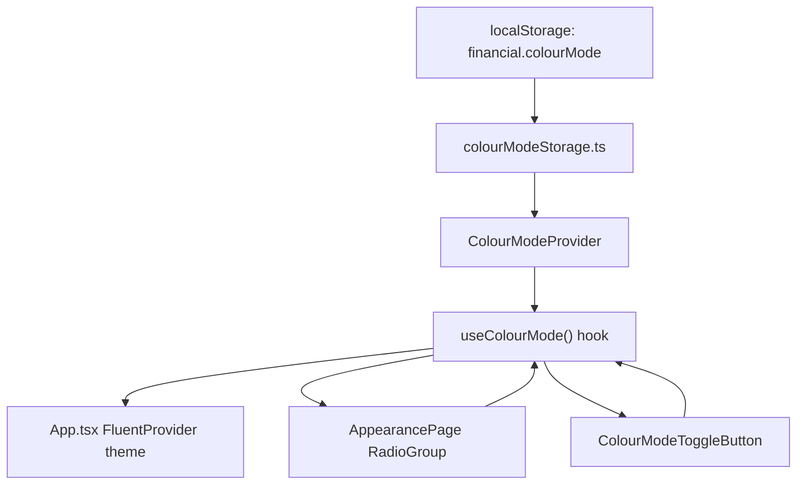

## 1. Technical Overview

**What:** Add a user-controlled Light/Dark colour mode to `Financial.Web`, replacing today's pure OS-driven theme selection. A new **Settings → Appearance** page exposes a text-labelled "Colour mode" radio control (Light / Dark), and a header icon-button shortcut lets the user flip the mode from any page. Both access points read and write one stored value through a single shared React context, so they never desync. The value defaults to **Light** on first run regardless of the OS/browser's `prefers-color-scheme`, and applies to the whole app immediately (no reload).

**Why:** `App.tsx` currently derives the Fluent theme purely from `useSystemColorScheme()` (a `matchMedia('(prefers-color-scheme: dark)')` listener) with no way for the user to override it. The PRD requires an explicit, persisted, user-controlled choice that never consults the OS signal once shipped, plus two synchronized access points. Implementing this as a stored-preference context that both the new Appearance page and the new header button consume is the direct technical path: it removes the OS listener, replaces it with a `localStorage`-backed context following this codebase's two existing precedents (`sidebarStorage.ts` for per-key persistence, `SelectedNodeContext.tsx` for cross-component shared UI state).

**Scope:**
- **Included** (PRD Section 6, F01 Capabilities/Experience — this PRD has no Core/Full Scope split for F01, so the entire functionality block below is in scope):
  - New "Settings" top-level nav category (after "Admin"), one leaf page "Appearance".
  - Appearance page: "Colour mode" control, two text-labelled options (Light, Dark).
  - Default Light on first run / cleared storage, independent of OS/browser theme.
  - Single `localStorage` key persisting the choice across reloads/visits.
  - Header icon-button shortcut (`WeatherSunny24Regular` / `WeatherMoon24Regular`), action-described tooltip/accessible name.
  - Shared state: Appearance page radios and header shortcut read/write the same value; changing either instantly updates the other.
  - Immediate re-theme via `FluentProvider`, no page reload.
- **Deferred** (PRD Section 7, Out of Scope):
  - A third "System/Auto" option that follows the OS/browser theme.
  - Cross-device or cross-front-end sync (F02/WPF stores its own value independently; not built here).
  - Any backend Settings/Preferences API, entity, or DDD module.
  - Additional themes beyond Light and Dark.
  - Per-page/per-view theme overrides.
  - Any other Settings/Appearance content beyond Colour mode (language, font size, notifications, etc.).

## 2. Requirements / Business Rules

(PRD Section 6, F01 Capabilities)

- The "Settings" nav category is positioned immediately after "Admin"; final top-level order is Investments, CashFlow, Admin, Settings.
- "Settings" contains exactly one leaf: "Appearance".
- The Appearance page's "Colour mode" control has exactly two mutually exclusive, text-labelled options: "Light" and "Dark". No icon-only control satisfies this requirement anywhere in the feature.
- The stored value lives under one `localStorage` key, value `"light"` or `"dark"`.
- With no stored value (first run, or storage cleared), the app renders Light — always, never derived from `prefers-color-scheme`. The OS/browser signal is not consulted anywhere in this feature.
- The header shortcut icon and its tooltip/accessible name describe the action a click performs (e.g., moon icon + "Switch to Dark mode" while currently Light; sun icon + "Switch to Light mode" while currently Dark) — never the current state.
- The Appearance page radios and the header shortcut read and write the exact same stored value via one shared hook/context; there are never two independent pieces of state.
- Changing the mode re-themes the whole app immediately (`financialLightTheme` / `financialDarkTheme` from `src/theme/fluentTheme.ts`, already defined) with no reload.

## 3. UX Flows

(PRD Section 6, F01 Experience)

1. **First visit / cleared storage:** user opens the app; it renders in Light regardless of OS/browser dark-mode. No Settings interaction has happened yet.
2. **Navigate to Appearance:** user clicks "Settings" in the sidebar, lands on "Appearance" (the section's only page), sees "Colour mode" with "Light" selected (unless previously changed).
3. **Change via Appearance page:** user selects "Dark" → the whole app re-themes immediately via `FluentProvider`, and the header shortcut's icon/tooltip update immediately to "Switch to Light mode" (sun icon).
4. **Change via header shortcut:** user clicks the header icon-button from any page → the mode flips app-wide immediately; the next time the Appearance page is viewed, its selected radio reflects the new value (single source of truth, no separate state to desync).
5. **Persistence:** user reloads the page or reopens the app later → the last chosen mode is restored from `localStorage`. A brand-new browser profile with no stored key always shows Light, regardless of OS theme.

## 4. Architecture Impact

**Affected components:**
- `Financial.Web/src/utils/colourModeStorage.ts` — new `localStorage` get/set pair for the `financial.colourMode` key.
- `Financial.Web/src/context/ColourModeContext.tsx` — new `ColourModeProvider` + `useColourMode()` hook; single source of truth read by both access points.
- `Financial.Web/src/App.tsx` — wraps its content in `ColourModeProvider`; the FluentProvider theme now comes from `useColourMode()` instead of `useSystemColorScheme()`; renders a new top bar row (Breadcrumb + `ColourModeToggleButton`).
- `Financial.Web/src/App.css` — new `.app__topbar` layout rule for the row above.
- `Financial.Web/src/hooks/useSystemColorScheme.ts` — removed; no longer consulted anywhere per the PRD's explicit "OS signal is no longer consulted" rule.
- `Financial.Web/src/components/ColourModeToggleButton.tsx` — new header icon-button, action-described tooltip/`aria-label`, toggles via `useColourMode()`.
- `Financial.Web/src/pages/AppearancePage.tsx` (+ `.css`) — new page, Fluent `RadioGroup` bound to `useColourMode()`.
- `Financial.Web/src/navigation/navTree.ts` — new `settings` category with one `appearance` child, after `admin`.
- `Financial.Web/src/navigation/lazyPages.tsx` — new `AppearancePage` lazy export.
- `Financial.Web/src/navigation/routes.tsx` — new `settings/appearance` route entry.
- `Financial.Web/src/components/Sidebar.tsx` — new hand-drawn `SettingsIcon` (matching the existing `InvestmentsIcon`/`CashFlowIcon`/`AdminIcon` inline-SVG style) registered in `CATEGORY_ICONS`.

## 5. Technical Decisions

| Decision | Chosen Approach | Alternative Considered | Trade-off |
|----------|----------------|----------------------|-----------|
| Shared state mechanism for the two access points | React Context (`ColourModeProvider` / `useColourMode()`), mirroring `SelectedNodeContext.tsx` — this codebase's only existing precedent for cross-component shared UI state | A subscribable store via `useSyncExternalStore` reading `localStorage` directly | Same-tab `localStorage` writes never fire the `storage` event, so a raw store hook would need its own pub/sub layer anyway; Context reuses an established, already-tested codebase pattern instead of introducing a new one |
| Where the provider mounts | Inside `App.tsx` itself: `export default function App()` becomes a thin wrapper (`<ColourModeProvider><AppShell /></ColourModeProvider>`), with the existing `App` body (routing effect, `FluentProvider`, sidebar, banners, `Outlet`) moved into an unexported `AppShell` that calls `useColourMode()` | Mount the provider in `main.tsx`, above `<BrowserRouter>` | Keeps `App` fully self-contained so the existing `Financial.Web/src/__tests__/App.test.tsx` (which renders `<App />` directly, with no provider wrapper of its own) keeps passing unmodified; `main.tsx` stays untouched |
| Persisted storage key/shape | One `localStorage` key `financial.colourMode`, value `"light"` \| `"dark"`, `try/catch`-guarded get/set following `sidebarStorage.ts` verbatim (fails safe to `"light"` on any read/write error) | Store inside an existing key as a nested object | PRD explicitly calls out "the existing `sidebarStorage.ts` per-key persistence pattern" — one flat key per preference is the established convention (`financial.sidebarCollapsed`, `financial.selectedDomain`) |
| Colour mode control widget | Fluent `RadioGroup` + two `Radio` options (`value="light"` label "Light", `value="dark"` label "Dark") | A native `<select>` or a `Switch` | PRD explicitly specifies "e.g. a Fluent `RadioGroup`"; two always-visible text labels satisfy the project's UI invariant against icon-only or ambiguous controls, which a `Switch` (state implied by position, no per-option label) would not |
| Header shortcut icon/tooltip source | `aria-label` + `title` attributes on the icon `Button` (no Fluent `Tooltip` component — none exists anywhere in this codebase today), following `Sidebar.tsx`'s collapse-toggle button convention exactly | Introduce Fluent `Tooltip` | Reuses the codebase's one existing icon-button-with-accessible-name pattern instead of adding a new dependency/pattern for a single button |
| Header shortcut placement | New `.app__topbar` flex row in `App.tsx`, pairing the existing `<Breadcrumb />` with the new `<ColourModeToggleButton />`, visible above the routed content on every page | Place inside `<Sidebar>` | The PRD describes the shortcut as living "next to `SyncStatusIndicator`/`PaymentDueBanner`", but neither of those is a header element in this codebase — `SyncStatusBanner` and `PaymentDueBanner` are conditional content-area alert banners, and no app-wide header/toolbar exists today (verified: no `SyncStatusIndicator` component, no `.app__header` class). `Breadcrumb` is the only always-visible, top-of-content element on every page, making it the closest available anchor to the PRD's "header" intent |
| Sidebar category icon style | A new hand-rolled inline `<svg>` `SettingsIcon`, matching `InvestmentsIcon`/`CashFlowIcon`/`AdminIcon` | Import a `@fluentui/react-icons` icon (e.g. `SettingsRegular`) | `Sidebar.tsx` never imports `@fluentui/react-icons` — all four category icons (after this change) are hand-drawn SVGs sharing one visual language; the header shortcut and Appearance page, which are *not* part of that existing icon set, use `@fluentui/react-icons` instead, per the PRD's explicit instruction for those two spots |

## 6. Component Overview

**Frontend:**

| File Path | New/Modified | Purpose | Key Responsibilities |
|-----------|--------------|---------|---------------------|
| `Financial.Web/src/utils/colourModeStorage.ts` | New | Persistence | `getStoredColourMode()` (`'light'` \| `'dark'`, defaults to `'light'` on missing/invalid/unreadable value), `setStoredColourMode(mode)` (fails silently on write error) |
| `Financial.Web/src/context/ColourModeContext.tsx` | New | Shared state | `ColourModeProvider` (initializes from `getStoredColourMode()`, persists on change via `setStoredColourMode`), `useColourMode()` returning `{ colourMode, setColourMode, toggleColourMode }`, throws when used outside the provider |
| `Financial.Web/src/App.tsx` | Modified | App shell | Default-exported `App` now wraps `<ColourModeProvider>` around the (renamed, unexported) shell component; the shell reads `useColourMode()` to pick `financialLightTheme`/`financialDarkTheme` for `FluentProvider`, and renders the new topbar row (`<Breadcrumb />` + `<ColourModeToggleButton />`) above `<Outlet />` |
| `Financial.Web/src/App.css` | Modified | Layout | Add `.app__topbar` (flex row, `justify-content: space-between`, `align-items: center`) wrapping the breadcrumb and the new toggle button |
| `Financial.Web/src/hooks/useSystemColorScheme.ts` | Removed | — | Deleted; superseded by the stored-preference context, no remaining usages after `App.tsx` is updated |
| `Financial.Web/src/components/ColourModeToggleButton.tsx` | New | Header shortcut | Icon `Button` using `WeatherSunny24Regular` (shown while in Dark, offering to switch to Light) / `WeatherMoon24Regular` (shown while in Light, offering to switch to Dark); `aria-label`/`title` describe the action; `onClick` calls `toggleColourMode()` |
| `Financial.Web/src/pages/AppearancePage.tsx` | New | Settings page | Renders "Colour mode" heading + Fluent `RadioGroup` (`Radio value="light"` label "Light", `Radio value="dark"` label "Dark") bound to `useColourMode()`; `onChange` calls `setColourMode(data.value)` |
| `Financial.Web/src/pages/AppearancePage.css` | New | Styling | Minimal page padding/layout, following `AdminEntityPlaceholderPage.css`'s pattern |
| `Financial.Web/src/navigation/navTree.ts` | Modified | Nav data | Add `{ id: 'settings', label: 'Settings', children: [{ id: 'appearance', label: 'Appearance', route: '/settings/appearance' }] }` to `NAV_TREE`, after the `admin` entry |
| `Financial.Web/src/navigation/lazyPages.tsx` | Modified | Route data | Add `export const AppearancePage = lazy(() => import('../pages/AppearancePage'))` |
| `Financial.Web/src/navigation/routes.tsx` | Modified | Route data | Import `AppearancePage` from `./lazyPages`; add `{ path: 'settings/appearance', element: <AppearancePage /> }` to `PAGE_ROUTES` |
| `Financial.Web/src/components/Sidebar.tsx` | Modified | Nav rendering | Add a hand-drawn `SettingsIcon` function component (same inline-SVG shape as the other three category icons) and register it as `CATEGORY_ICONS.settings` |

No Domain/Application/Infrastructure/API changes — this is a `Financial.Web`-only, purely client-side preference with no server involvement, per PRD Section 7 (Out of Scope: "A backend Settings/Preferences API... this remains a local, per-front-end UI preference with no server involvement"). API Contracts and Data Model sections are omitted as not applicable.

## 7. Testing Strategy

**Test File Structure:**

| Test File | Test Type | Target | Coverage Goal |
|-----------|-----------|--------|----------------|
| `Financial.Web/src/utils/__tests__/colourModeStorage.test.ts` | Unit | `colourModeStorage` | Default, round-trip, defensive read/write failure — mirrors `sidebarStorage.test.ts` |
| `Financial.Web/src/context/__tests__/ColourModeContext.test.tsx` | Unit (RTL, following `SelectedNodeContext.test.tsx`) | `ColourModeProvider` / `useColourMode` | Default value, initialization from stored preference, `setColourMode`, `toggleColourMode`, throws-outside-provider |
| `Financial.Web/src/pages/__tests__/AppearancePage.test.tsx` | Component (RTL) | `AppearancePage` | Two text-labelled radios, default selection, selecting an option updates the shared mode, reflects an externally-changed mode |
| `Financial.Web/src/components/__tests__/ColourModeToggleButton.test.tsx` | Component (RTL) | `ColourModeToggleButton` | Icon/label per current mode, click toggles, keyboard operability, accessible name |
| `Financial.Web/src/__tests__/App.test.tsx` | Component (RTL, existing file) | `App` | Existing suite must keep passing unmodified with the new `ColourModeProvider` wrapping; add coverage for default Light theme with no stored preference and immediate re-theme with no reload |
| `Financial.Web/src/navigation/__tests__/routes.test.ts` | Unit (existing file) | `NAV_TREE` / `PAGE_ROUTES` | Existing route/sidebar-agreement assertions automatically cover the new Settings/Appearance entry — no new test functions needed, regression-only |

**`colourModeStorage.test.ts` functions:**

| Test Function | Description | Assertions |
|---------------|--------------|------------|
| `returns_light_when_nothing_stored` | No prior key (AC: default is Light, never OS-derived) | `getStoredColourMode()` returns `'light'` |
| `round_trips_a_stored_value` | Persistence | `setStoredColourMode('dark')` → `getStoredColourMode()` returns `'dark'`; `localStorage.getItem('financial.colourMode')` is `'dark'` |
| `returns_light_and_does_not_throw_when_localStorage_read_fails` | Defensive fallback | Simulated `localStorage` getter throw; `getStoredColourMode()` returns `'light'` without throwing |
| `does_not_throw_when_localStorage_write_fails` | Defensive fallback | Simulated `localStorage` setter throw; `setStoredColourMode('dark')` does not throw |

**`ColourModeContext.test.tsx` functions:**

| Test Function | Description | Assertions |
|---------------|--------------|------------|
| `defaults_to_light_when_no_stored_preference` | AC: default Light | Consumer under `ColourModeProvider` with empty storage reads `colourMode === 'light'` |
| `initializes_from_a_previously_stored_dark_preference` | Persistence across reloads | Seed `localStorage` with `'dark'` before mount; consumer reads `colourMode === 'dark'` |
| `setColourMode_updates_the_context_value_and_persists_it` | AC: selecting a mode updates + persists | Call `setColourMode('dark')`; consumer re-renders with `'dark'`; `localStorage.getItem('financial.colourMode')` is `'dark'` |
| `toggleColourMode_flips_light_to_dark_and_back` | Header-shortcut semantics | Two consecutive `toggleColourMode()` calls return to the original value |
| `two_consumers_stay_in_sync_after_one_changes_the_mode` | AC: single source of truth, no divergence | Two components under the same provider; one calls `setColourMode('dark')`; both read `'dark'` |
| `useColourMode_throws_when_called_outside_provider` | Guard clause | Rendering a consumer with no provider throws `'useColourMode must be used within a ColourModeProvider'` |

**`AppearancePage.test.tsx` functions:**

| Test Function | Description | Assertions |
|---------------|--------------|------------|
| `renders_colour_mode_heading_and_two_text_labelled_options` | AC: control shape | `screen.getByRole('radio', { name: 'Light' })` and `{ name: 'Dark' }` both present |
| `light_is_selected_by_default` | AC: default is Light | The "Light" radio is checked when no prior preference is stored |
| `dark_is_selected_when_previously_stored` | Persistence | Seeded `'dark'` preference renders the "Dark" radio checked |
| `selecting_dark_updates_the_shared_colour_mode` | AC: selection takes effect | Click/select "Dark"; a sibling consumer under the same provider reads `colourMode === 'dark'` |
| `reflects_a_mode_changed_elsewhere_in_the_same_provider` | AC: header shortcut keeps the page's radio in sync | A sibling toggler flips the mode; the previously-rendered "Dark" radio becomes checked without remounting the page |

**`ColourModeToggleButton.test.tsx` functions:**

| Test Function | Description | Assertions |
|---------------|--------------|------------|
| `shows_moon_icon_and_switch_to_dark_label_while_in_light_mode` | AC: action-described, not state-described | Button's accessible name/title is `'Switch to Dark mode'`; `WeatherMoon24Regular` icon present |
| `shows_sun_icon_and_switch_to_light_label_while_in_dark_mode` | AC: action-described | With `colourMode === 'dark'`, accessible name/title is `'Switch to Light mode'`; `WeatherSunny24Regular` icon present |
| `clicking_toggles_the_shared_colour_mode` | AC: shortcut changes the same stored value | Click; a sibling consumer under the same provider reads the flipped mode |
| `is_keyboard_operable` | Accessibility (docs/rules/ui.md, WCAG 2.2 AA) | Tab to the button, press Enter/Space; `toggleColourMode` effect observed (mode flips) |
| `has_an_accessible_name` | Accessibility | `screen.getByRole('button', { name: /switch to (dark|light) mode/i })` resolves |

**`App.test.tsx` additions:**

| Test Function | Description | Assertions |
|---------------|--------------|------------|
| `renders_in_light_mode_by_default_regardless_of_os_preference` | AC: default Light, OS signal never consulted | With no stored preference (and no `matchMedia` mock forcing dark), the rendered tree carries the Fluent light theme (e.g. via a themed token/class assertion consistent with existing FluentProvider usage) |
| `renders_the_colour_mode_toggle_button_in_the_topbar` | AC: shortcut always available | `screen.getByRole('button', { name: /switch to dark mode/i })` present alongside the breadcrumb on every route |

**Cross-Feature Integration:** PRD Section 9's Cross-Feature Integration block states F01 has no functional data dependency on F02 or any other feature in this PRD — each front end stores and applies its own colour mode independently. No integration tests are required for this feature.

## 8. Assumptions and Decisions (Auto-Accept Policy)

Applied per the Batch Mode Auto-Accept Policy, since this spec was generated non-interactively. Each row below is a technical micro-detail the PRD left open, resolved by picking the strongest matching existing codebase convention:

1. **Shared state via React Context**, not a custom store hook — `SelectedNodeContext.tsx` is the only existing precedent in this codebase for state shared across sibling components; reused verbatim in shape (provider + hook + throw-outside-provider guard).
2. **Provider mounted inside `App.tsx`** (via an unexported inner shell component) rather than in `main.tsx`, specifically to keep the existing `Financial.Web/src/__tests__/App.test.tsx` — which renders `<App />` directly with no wrapper — passing unmodified.
3. **`localStorage` key name**: `financial.colourMode`, following the existing `financial.sidebarCollapsed` / `financial.selectedDomain` naming convention (`financial.<camelCasePreference>`).
4. **Header shortcut placed in a new `.app__topbar` row next to `Breadcrumb`**, since no literal "header" element or `SyncStatusIndicator` component exists in this codebase today (verified by search) — `SyncStatusBanner`/`PaymentDueBanner` are conditional content-area banners, not a persistent header. This is the closest available always-visible anchor and is flagged here for review, since it diverges slightly from the PRD's literal wording.
5. **Sidebar's new "Settings" category icon is a hand-drawn inline SVG**, matching the other three existing category icons, rather than importing a `@fluentui/react-icons` icon into `Sidebar.tsx` (which currently imports none).
6. **No additional `
` is added before "Settings"** — the existing divider before "Admin" is left as the only section break; "Settings" renders as a normal trailing top-level category. The PRD does not specify a divider here.
7. **`RadioGroup`/`Radio` from `@fluentui/react-components`** (already a project dependency) is the chosen control for "Colour mode", exactly as the PRD's own example suggests; this is the first use of `RadioGroup` in the codebase, no prior pattern to conflict with.
