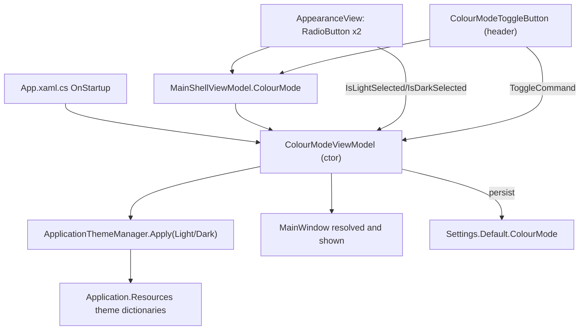

## 1. Technical Overview

**What:** Add an explicit Light/Dark colour-mode setting to `Financial.App` (WPF): a new **Settings → Appearance** nav destination with a two-option, text-labelled control; a header shortcut icon-button that flips the same setting from anywhere; a new `ColourMode` user setting (default `"Light"`) applied at startup before the window is shown; and — the largest part of this feature — replacing WPF's current *zero* dark-mode wiring with one centralized theme-application mechanism, removing the per-view hardcoded `<ui:ThemesDictionary Theme="Light"/>` merge duplicated across 53 XAML files today.

**Why:** Today every WPF view/dialog independently merges `ui:ThemesDictionary Theme="Light"` (and `ui:ControlsDictionary`) into its own local `Resources`, and `App.xaml`/`App.xaml.cs` bootstrap no WPF-UI theme dictionary at all (confirmed: no `Wpf.Ui.Appearance` reference anywhere in the codebase). There is consequently no seam to flip to Dark even if a setting existed — Dark must be wired in from scratch via `Wpf.Ui.Appearance.ApplicationThemeManager`, applied once at the application/shell level, with the 53 per-view local merges removed so they stop pinning every view to Light regardless of the chosen mode.

**Scope:**
- Included: `Settings` nav category + `Appearance` leaf (mirroring `NavTree.cs`'s existing category/child shape); `AppearanceView`/`ColourModeViewModel` (Light/Dark `RadioButton` pair); a new `ColourModeToggleButton` header control (`WeatherMoon24`/`WeatherSunny24` via `ui:SymbolIcon`, action-described `AutomationProperties.Name`); a new User-scoped `ColourMode` setting (`Settings.settings`/`Settings.Designer.cs`), read/written the same way `IsNavigationSidebarCollapsed` is today; centralized theme bootstrap in `App.xaml`/`App.xaml.cs` via `ApplicationThemeManager.Apply(...)`, applied before `MainWindow.Show()`; removal of the local `ui:ThemesDictionary`/`ui:ControlsDictionary` merge from all 53 identified files (enumerated in §4); a bounded dark-mode legibility audit (procedure defined in §3) covering those same files plus `App.xaml`'s global `DataGrid`/`DataGridRow`/`DataGridColumnHeader` styles, `Sidebar.xaml`, and `NavigationView.xaml`.
- Deferred (per PRD §7 Out of Scope): a System/Auto third option; cross-device or cross-front-end (Web↔WPF) sync of the chosen mode; any backend Settings API/entity; themes beyond Light/Dark; per-view theme overrides; any Settings/Appearance content beyond Colour mode.

## 2. Architecture Impact

**Affected components:**
- `Financial.App/Navigation/NavTree.cs` — modified: add a fourth `NavCategory` (`"settings"`) after `"admin"`, with one `NavChild` (`"appearance"`, view key `"settings-appearance"`).
- `Financial.App/ViewModels/Settings/ColourModeViewModel.cs` — new: singleton VM holding the current mode, shared unmodified by both access points (Appearance page and header button) so there is exactly one source of truth.
- `Financial.App/Views/Settings/AppearanceView.xaml` + `.xaml.cs` — new: the Settings → Appearance page, `DataContext` = the singleton `ColourModeViewModel`.
- `Financial.App/Components/ColourModeToggleButton.xaml` + `.xaml.cs` — new: header icon-button, `DataContext` = the same singleton, mirroring `HelpFlyoutButton.xaml`'s `ui:Button`+`ui:SymbolIcon` shape.
- `Financial.App/ViewModels/MainShellViewModel.cs` — modified: add a `ColourModeViewModel` constructor parameter, exposed as `ColourMode`, following the existing `SyncStatusViewModel`/`PaymentDueBannerViewModel` parameters exactly.
- `Financial.App/MainWindow.xaml.cs` — modified: accept `ColourModeViewModel` and `AppearanceView` as additional DI-resolved constructor parameters; add `["settings-appearance"] = appearanceView` to `viewsByKey`; pass `colourModeViewModel` into `MainShellViewModel`.
- `Financial.App/MainWindow.xaml` — modified: turn the breadcrumb `Border` (row 1) into a two-column `Grid` — breadcrumb text unchanged in column 0, the new `ColourModeToggleButton` right-aligned in column 1.
- `Financial.App/App.xaml` — modified: add the `ui` namespace and merge `<ui:ControlsDictionary/>` once, application-wide (wrapping the existing flat converter/style resources in an explicit `ResourceDictionary`/`MergedDictionaries`).
- `Financial.App/App.xaml.cs` — modified: register `ColourModeViewModel` as a singleton whose factory reads `Settings.Default.ColourMode`, and whose constructor applies the initial theme via `ApplicationThemeManager.Apply(...)` synchronously — so by the time `OnStartup` resolves and shows `MainWindow`, theming is already applied; register `AppearanceView` (transient).
- `Financial.App/Properties/Settings.settings` + `Settings.Designer.cs` — modified: add the `ColourMode` (`System.String`, User-scoped, default `"Light"`) setting, following `IsNavigationSidebarCollapsed`'s exact shape.
- 53 existing view/dialog XAML files (enumerated in §4) — modified: remove the local `ui:ThemesDictionary`/`ui:ControlsDictionary` merge (now provided app-wide); keep each file's own `AccentButtonBackground`/`PointerOver`/`Pressed` brush overrides where present, flattened out of the now-unnecessary `ResourceDictionary.MergedDictionaries` wrapper.
- `App.xaml`'s global `DataGrid`/`DataGridColumnHeader`/`DataGridRow`/`DataGridCell`/`GroupHeaderBarStyle`/`GroupHeaderTitleTextStyle` styles, `Sidebar.xaml`, `NavigationView.xaml` — modified per the dark-mode audit (§3) to replace literal light-only hex (`#F5F5F5`, `#F0F0F0`, `#CCCCCC`, `#333333`, `White`, etc.) with WPF-UI `DynamicResource` theme brushes where the audit finds a legibility failure in Dark.

## 3. Technical Decisions

| Decision | Chosen Approach | Alternative Considered | Trade-off |
|----------|----------------|----------------------|-----------|
| Theme application mechanism | `Wpf.Ui.Appearance.ApplicationThemeManager.Apply(ApplicationTheme.Light\|Dark, updateAccent: false)`, called once by `ColourModeViewModel`'s constructor (initial mode) and again on every mode change | `SystemThemeWatcher.Watch(...)` to auto-follow the OS theme | `SystemThemeWatcher` would make the app follow Windows' theme, directly contradicting the PRD's explicit "no System/Auto option, default is always Light, never OS-derived" rule (§7 Out of Scope). `updateAccent: false` is explicit and deliberate: `ApplicationThemeManager.Apply`'s accent-update path is a different mechanism than `ApplicationAccentColorManager.Apply(...)`, but ADR-005 already established that any automatic accent-derivation must not run, since it would drift the pinned `#0F6CBD` brand hex away from its literal value |
| Removing the 53 per-view theme merges | Remove `<ui:ThemesDictionary Theme="Light"/>` and `<ui:ControlsDictionary/>` from each file's local `Resources` (now redundant — both are provided app-wide); where a file also pins the `AccentButtonBackground` family (51 of the 53), keep those three `SolidColorBrush` entries as flat resources directly under the same `Resources` element (no `ResourceDictionary.MergedDictionaries` wrapper needed once nothing is merged); where a file has no accent override (`AdminEntityPlaceholderView.xaml`, `MonthYearPicker.xaml`), delete the `Resources` block entirely | Centralize the `AccentButtonBackground` family into `App.xaml` too, deleting all 51 per-file copies | Centralizing the brand-accent brushes is out of scope for this feature: the PRD's capability line names only the `ui:ThemesDictionary` merge for removal, and ADR-005's own stated intent is per-page migration, not a global rewrite done outside a page's own refactor slice. Keeping the literal per-file overrides is lower-risk (54 files touched exactly once, mechanically, for exactly what the PRD asks) and behaves identically in both Light and Dark, since the pinned hex is theme-independent |
| Where `ui:ControlsDictionary` is merged once, application-wide | `App.xaml`'s `Application.Resources`, wrapped in an explicit `ResourceDictionary`/`MergedDictionaries` | Merge it inside `MainWindow.xaml`'s own `Resources` instead | `Application.Resources` is the only scope every view (including modal `Window`-based dialogs, which sit outside `MainWindow`'s visual tree) can see; a `MainWindow`-scoped merge would leave every dialog (`MoveAssetDialog`, `*FormDialog`) without control templates once their own local merges are removed |
| Dark-mode legibility audit procedure | Two-tier, bounded procedure (see below) instead of an open-ended "review everything" pass | Ad hoc manual review with no defined checklist | The PRD's own Success Metric ("100% of views... verified by manual pass") has no automated seam (no visual-regression tooling exists in this codebase for WPF), so the audit must be manual — but "manual" does not mean "unbounded"; a fixed checklist applied to a fixed, enumerated file list keeps the audit reproducible and reviewable |
| Header shortcut placement | Inside the existing breadcrumb `Border` (`MainWindow.xaml` row 1, always visible, height 32), as the right-aligned cell of a new two-column `Grid` replacing the current single `TextBlock` | Inside the row-0 `StackPanel` alongside `SyncStatusIndicator`/`PaymentDueBanner` | Both banners in row 0 are conditionally collapsed (`Visibility` bound to error/pending state) and stack vertically as full-width bars; a small persistent icon-button belongs in the one row that is *always* rendered regardless of banner state, and is still "near" those elements per the PRD's "placed consistently with Web's" wording — not literally inside the same conditional stack |
| Shared state between the two access points | One singleton `ColourModeViewModel` (registered `AddSingleton`, following `SyncStatusViewModel`'s/`PaymentDueBannerViewModel`'s precedent), constructor-injected into both `AppearanceView` and exposed via `MainShellViewModel.ColourMode` for `ColourModeToggleButton`'s `DataContext` | Two independent VMs synchronized via an event/message bus | A single shared instance is simpler, matches the existing singleton-VM precedent for cross-cutting shell state, and makes "never two independent pieces of state" (an explicit PRD requirement) structurally impossible to violate rather than merely tested for |

**Bounded dark-mode audit procedure** (applied per PRD §6 F02's "every existing view... verified" requirement and Success Metric):

*Tier 1 — global styles (fixed once, covers most views):* `App.xaml`'s `DataGrid`/`DataGridColumnHeader`/`DataGridRow`/`DataGridCell`/`GroupHeaderBarStyle`/`GroupHeaderTitleTextStyle` styles currently hardcode `#F5F5F5`/`#F0F0F0`/`#CCCCCC`/`#333333`/`White`/`LightYellow`. Replace each with the nearest semantically-equivalent WPF-UI `DynamicResource` theme brush (e.g. `{DynamicResource ControlFillColorDefaultBrush}` for row backgrounds, `{DynamicResource TextFillColorPrimaryBrush}` for header text, `{DynamicResource ControlStrokeColorDefaultBrush}` for grid lines) so every `DataGrid`-bearing view (the majority of the 53) inherits correct Dark contrast without a per-file edit.

*Tier 2 — per-file checklist (applied to each of the 53 files in §4, plus `Sidebar.xaml`, `NavigationView.xaml`, and `MainWindow.xaml`'s own chrome):* launch the app in Dark, open the view, and confirm:
- [ ] Body/label text (commonly literal `#333333`) is legible against the Dark background.
- [ ] Secondary/muted text (commonly literal `#666666`/`#999999`) is legible against the Dark background.
- [ ] Borders/dividers (commonly literal `#CCCCCC`/`#E0E0E0`) remain visible, not invisible-on-dark.
- [ ] No literal `White`/near-white `Background` paints a light block inside an otherwise-dark window (e.g. `Sidebar.xaml`'s `Background="White"`, `DataGridRow`'s `Background="White"`).
- [ ] Selected-row/selected-item highlight (`#007ACC` selection triggers in `NavigationView.xaml`/`DataGridRow`) keeps legible text-on-background contrast.
- [ ] The `#0F6CBD` brand accent (`AccentButtonBackground` family) still reads correctly against Dark surfaces per ADR-005.
- [ ] Status/validation text (`Foreground="Red"`, `SystemFillColorCriticalBrush`) remains legible against Dark.

A file that fails any checked item gets its literal hex replaced with the matching `DynamicResource` theme brush (same mapping as Tier 1); a file that passes every item as-is needs no further change beyond its Tier-0 merge removal (§4).

## 4. Component Overview

**Frontend (WPF) — new/modified feature files:**

| File Path | New/Modified | Purpose | Key Responsibilities |
|-----------|--------------|---------|---------------------|
| `Financial.App/Navigation/NavTree.cs` | Modified | Nav tree data | Add `"settings"` `NavCategory` (after `"admin"`) with one `NavChild` (`"appearance"`, view key `"settings-appearance"`) |
| `Financial.App/ViewModels/Settings/ColourModeViewModel.cs` | New | Single source of truth for the mode | `Mode` (`ColourMode` enum Light/Dark), `IsLightSelected`/`IsDarkSelected` (bool, `RadioButton`-bindable), `ToggleIcon` (`SymbolRegular`), `ToggleAutomationName` (action-described string), `ToggleCommand`; applies the theme via an injected `Action<ColourMode> applyTheme` and persists via an injected `Action<ColourMode> persist` (both callback-injected, mirroring `MainShellViewModel`'s `persistCollapsed` pattern, for unit-testability without touching `Settings.Default`/`ApplicationThemeManager` directly) |
| `Financial.App/Views/Settings/AppearanceView.xaml` + `.xaml.cs` | New | Settings → Appearance page | Page heading "Appearance"; "Colour mode" label; two `RadioButton`s (`GroupName="ColourMode"`, `Content="Light"`/`"Dark"`) bound to `IsLightSelected`/`IsDarkSelected`; code-behind takes `ColourModeViewModel` via constructor DI and sets `DataContext`, mirroring `BanksView.xaml.cs` |
| `Financial.App/Components/ColourModeToggleButton.xaml` + `.xaml.cs` | New | Header shortcut | `ui:Button` (`Appearance="Transparent"`) with a bound `ui:SymbolIcon` (`Symbol="{Binding ToggleIcon}"`, element form — not the `{ui:SymbolIcon Symbol=...}` markup-extension form, which cannot bind), `Command="{Binding ToggleCommand}"`, `AutomationProperties.Name="{Binding ToggleAutomationName}"`, `ToolTip="{Binding ToggleAutomationName}"`; mirrors `HelpFlyoutButton.xaml`'s icon-button shape and `PaymentDueBanner.xaml`'s bound-`SymbolIcon` element usage |
| `Financial.App/ViewModels/MainShellViewModel.cs` | Modified | Shell composition | Add `ColourModeViewModel colourModeViewModel` constructor parameter (null-guarded like `syncStatusViewModel`); expose as `public ColourModeViewModel ColourMode { get; }` |
| `Financial.App/MainWindow.xaml.cs` | Modified | DI wiring | Accept `ColourModeViewModel colourModeViewModel` and `AppearanceView appearanceView` as additional constructor parameters (null-guarded); add `["settings-appearance"] = appearanceView` to `viewsByKey`; pass `colourModeViewModel` into `MainShellViewModel` |
| `Financial.App/MainWindow.xaml` | Modified | Shell chrome | Breadcrumb `Border` (row 1) becomes a `Grid` with two `ColumnDefinition`s: `TextBlock` (breadcrumb, `Width="*"`) in column 0, `<local:ColourModeToggleButton DataContext="{Binding ColourMode}"/>` in column 1 |
| `Financial.App/App.xaml` | Modified | App-wide resources | Add `xmlns:ui`; wrap existing `Application.Resources` content in an explicit `ResourceDictionary` and merge `<ui:ControlsDictionary/>` once, app-wide |
| `Financial.App/App.xaml.cs` | Modified | Startup + DI | Register `ColourModeViewModel` as singleton via a factory reading `Settings.Default.ColourMode` (fallback `Light` on missing/unparseable value) and wiring `persist`/`applyTheme` callbacks; the VM's constructor applies the initial theme synchronously so it is set before `MainWindow.Show()`; register `AppearanceView` (`AddTransient`) |
| `Financial.App/Properties/Settings.settings` | Modified | Setting declaration | Add `ColourMode` (`System.String`, `Scope="User"`, default `"Light"`), following `IsNavigationSidebarCollapsed`'s exact shape |
| `Financial.App/Properties/Settings.Designer.cs` | Modified | Generated setting accessor | Add the matching `ColourMode` string property, following `IsNavigationSidebarCollapsed`'s generated shape |

**Frontend (WPF) — 53 files requiring local theme-merge removal (§3 "Removing the 53 per-view theme merges"; ✓ = also keeps its `AccentButtonBackground` family as flat resources):**

| File Path | Has Accent Override |
|-----------|:---:|
| `Financial.App/Views/Admin/InvestmentAccountsView.xaml` | ✓ |
| `Financial.App/Views/Admin/InvestmentAccountFormDialog.xaml` | ✓ |
| `Financial.App/Views/CashFlow/UkExpensePromptDialog.xaml` | ✓ |
| `Financial.App/Views/CashFlow/MensaisView.xaml` | ✓ |
| `Financial.App/Views/Investment/AssetPriceView.xaml` (scoped to a `Border`, not the whole view) | ✓ |
| `Financial.App/Views/Investment/DividendCheckView.xaml` | ✓ |
| `Financial.App/Views/Investment/MoveAssetDialog.xaml` (`Window.Resources`) | ✓ |
| `Financial.App/Views/Investment/PortfolioSummaryView.xaml` | ✓ |
| `Financial.App/Views/CashFlow/ReservaView.xaml` | ✓ |
| `Financial.App/Views/CashFlow/CreateEntryFormView.xaml` | ✓ |
| `Financial.App/Views/CashFlow/ControleMaeView.xaml` | ✓ |
| `Financial.App/Views/Admin/ReserveBucketsView.xaml` | ✓ |
| `Financial.App/Views/CashFlow/AddBillFormView.xaml` | ✓ |
| `Financial.App/Views/Admin/ReserveBucketFormDialog.xaml` | ✓ |
| `Financial.App/Views/Admin/RecurringBillFormDialog.xaml` | ✓ |
| `Financial.App/Views/Admin/RecurringBillsView.xaml` | ✓ |
| `Financial.App/Views/Admin/PortfolioFormDialog.xaml` | ✓ |
| `Financial.App/Views/Admin/PortfoliosView.xaml` | ✓ |
| `Financial.App/Views/Admin/IncomeSourcesView.xaml` | ✓ |
| `Financial.App/Views/Admin/CreditCardsView.xaml` | ✓ |
| `Financial.App/Views/Admin/IncomeSourceFormDialog.xaml` | ✓ |
| `Financial.App/Views/Admin/CreditCardFormDialog.xaml` | ✓ |
| `Financial.App/Views/Admin/CategoriesView.xaml` | ✓ |
| `Financial.App/Views/Admin/CategoryFormDialog.xaml` | ✓ |
| `Financial.App/Views/Admin/BrokersView.xaml` | ✓ |
| `Financial.App/Views/Admin/BrokerFormDialog.xaml` | ✓ |
| `Financial.App/Views/Admin/BankFormDialog.xaml` | ✓ |
| `Financial.App/Views/Admin/BanksView.xaml` | ✓ |
| `Financial.App/Views/Admin/AssetFormDialog.xaml` | ✓ |
| `Financial.App/Views/Admin/AssetsView.xaml` | ✓ |
| `Financial.App/Components/NavigationView.xaml` | ✓ |
| `Financial.App/Views/Admin/AdminEntityPlaceholderView.xaml` | — |
| `Financial.App/Views/Investment/TransactionsView.xaml` | ✓ |
| `Financial.App/Views/Investment/TransactionFormView.xaml` | ✓ |
| `Financial.App/Views/Investment/PriceHistoryView.xaml` | ✓ |
| `Financial.App/Views/Investment/PriceFormView.xaml` | ✓ |
| `Financial.App/Views/CashFlow/TransferFormView.xaml` | ✓ |
| `Financial.App/Views/CashFlow/WithdrawalFormView.xaml` | ✓ |
| `Financial.App/Views/Investment/CreditFormView.xaml` | ✓ |
| `Financial.App/Views/Investment/CreditsView.xaml` | ✓ |
| `Financial.App/Views/CashFlow/IncomeSplitFormView.xaml` | ✓ |
| `Financial.App/Views/CashFlow/IncomeSectionView.xaml` | ✓ |
| `Financial.App/Views/CashFlow/IncomeFormView.xaml` | ✓ |
| `Financial.App/Views/CashFlow/ExpenseSectionView.xaml` | ✓ |
| `Financial.App/Views/CashFlow/ExpenseFormView.xaml` | ✓ |
| `Financial.App/Views/CashFlow/EditSnapshotValueFormView.xaml` | ✓ |
| `Financial.App/Views/CashFlow/EditReserveMovementFormView.xaml` | ✓ |
| `Financial.App/Views/CashFlow/EditEntryFormView.xaml` | ✓ |
| `Financial.App/Views/CashFlow/EditBillFormView.xaml` | ✓ |
| `Financial.App/Views/CashFlow/CreditCardExpensesView.xaml` | ✓ |
| `Financial.App/Views/CashFlow/BankSectionView.xaml` | ✓ |
| `Financial.App/Views/CashFlow/BalanceAdjustmentFormView.xaml` | ✓ |
| `Financial.App/Components/MonthYearPicker.xaml` | — |

**Frontend (WPF) — dark-mode audit targets beyond the 53 (Tier 1/Tier 2 of §3's procedure):**

| File Path | New/Modified | Purpose |
|-----------|--------------|---------|
| `Financial.App/App.xaml` | Modified | Global `DataGrid`/`DataGridColumnHeader`/`DataGridRow`/`DataGridCell`/`GroupHeaderBarStyle`/`GroupHeaderTitleTextStyle` styles: replace literal hex with `DynamicResource` theme brushes per the Tier-1 audit |
| `Financial.App/Components/Sidebar.xaml` | Modified (if audit fails) | Nav sidebar: `Background="White"`, `#333333`/`#666666`/`#007ACC`/`#E0E0E0` literals audited per Tier 2 |
| `Financial.App/Components/NavigationView.xaml` | Modified (if audit fails) | Investment tree/detail pane: same literal-hex categories audited per Tier 2 |

**Test Infrastructure:**

| File Path | New/Modified | Purpose | Key Responsibilities |
|-----------|--------------|---------|---------------------|
| `Tests/Financial.Presentation.Tests/ViewModels/Settings/ColourModeViewModelTests.cs` | New | Unit tests for the shared VM | See §7 |
| `Tests/Financial.Presentation.Tests/Navigation/NavTreeTests.cs` | Modified | Nav tree assertions | Update category count (3→4) and unique-view-key count (20→21); add Settings-category assertions |
| `Tests/Financial.Presentation.Tests/ViewModels/MainShellViewModelTests.cs` | Modified | Shell VM assertions | `BuildViewMap()` gains `["settings-appearance"] = new object()`; `CreateShell(...)` factory gains a `ColourModeViewModel` argument; add an assertion that `vm.ColourMode` is the same injected instance |

## 5. API Contracts

Not applicable — this feature introduces no HTTP surface. `Financial.App` reads/writes its own local `Settings.Default.ColourMode`, exactly as `IsNavigationSidebarCollapsed` already does.

## 6. Data Model

Not applicable — no database or JSON-document changes. The only new persisted state is the `ColourMode` User-scoped `.settings` entry (`Financial.App/Properties/Settings.settings`), a local `.config` value written via `ApplicationSettingsBase.Save()`, identical in kind to the existing `IsNavigationSidebarCollapsed` setting.

## 7. Testing Strategy

**Test File Structure:**

| Test File | Test Type | Target | Coverage Goal |
|-----------|-----------|--------|----------------|
| `Tests/Financial.Presentation.Tests/ViewModels/Settings/ColourModeViewModelTests.cs` | Unit | `ColourModeViewModel` | Mode switching, persistence callback, theme-apply callback, toggle command, icon/automation-name mapping, null guards |
| `Tests/Financial.Presentation.Tests/Navigation/NavTreeTests.cs` | Unit (modified) | `NavTree` | Settings category exists, positioned after Admin, contains exactly one Appearance child, view keys stay unique |
| `Tests/Financial.Presentation.Tests/ViewModels/MainShellViewModelTests.cs` | Unit (modified) | `MainShellViewModel` | Shell exposes the injected `ColourModeViewModel` unchanged as `ColourMode` |

**`ColourModeViewModelTests` functions** (constructs the VM with recording `Action<ColourMode>` fakes for `persist`/`applyTheme`, following `MainShellViewModelTests`'s constructor-injected-callback pattern; interacts only through public `IsLightSelected`/`IsDarkSelected`/`ToggleCommand`, per this project's established WPF-VM-testing convention — never through private state):

| Test Function | Description | Assertions |
|---------------|--------------|------------|
| `Constructor_WithNullPersist_Throws` | Null guard | Throws `ArgumentNullException` naming `persist` |
| `Constructor_WithNullApplyTheme_Throws` | Null guard | Throws `ArgumentNullException` naming `applyTheme` |
| `Constructor_AppliesInitialThemeImmediately` | AC: no restart, applied before window shown | `applyTheme` was invoked exactly once with the constructor's `initialMode`, synchronously during construction |
| `Constructor_WithInitialModeLight_IsLightSelectedIsTrue` | Default mapping | `IsLightSelected` is `true`, `IsDarkSelected` is `false` |
| `Constructor_WithInitialModeDark_IsDarkSelectedIsTrue` | Default mapping | `IsDarkSelected` is `true`, `IsLightSelected` is `false` |
| `SetIsDarkSelectedTrue_FromLight_SwitchesModePersistsAndAppliesTheme` | AC: selecting Dark re-themes + persists | `Mode` becomes `Dark`; `persist` and `applyTheme` are each called a second time with `Dark` |
| `SetIsLightSelectedTrue_FromDark_SwitchesModePersistsAndAppliesTheme` | AC: selecting Light re-themes + persists | Mirrors the above, `Light` |
| `SetIsDarkSelectedFalse_IsIgnored` | RadioButton un-check semantics | Setting the *other* radio's bindable property to `false` does not call `persist`/`applyTheme` again and does not change `Mode` |
| `SetIsLightSelectedTrue_WhenAlreadyLight_IsNoOp` | Idempotency | No additional `persist`/`applyTheme` call beyond the initial constructor call |
| `ToggleCommand_FromLight_SwitchesToDark` | AC: header shortcut flips the mode | `Mode` becomes `Dark`; `persist`/`applyTheme` invoked with `Dark` |
| `ToggleCommand_FromDark_SwitchesToLight` | AC: header shortcut flips the mode | Mirrors the above, `Light` |
| `ToggleIcon_ReflectsCurrentMode` | AC: icon shows the target action, not current state | `ToggleIcon` is `SymbolRegular.WeatherMoon24` while `Mode == Light`; `WeatherSunny24` while `Mode == Dark` |
| `ToggleAutomationName_DescribesActionNotState` | AC: accessible name describes the action | While `Light`: contains `"Switch to Dark mode"`; while `Dark`: contains `"Switch to Light mode"` |
| `PropertyChanged_RaisedForModeDependentProperties` | Binding correctness | Changing `Mode` raises `PropertyChanged` for `IsLightSelected`, `IsDarkSelected`, `ToggleIcon`, `ToggleAutomationName` |

**`NavTreeTests` additions/modifications:**

| Test Function | Description | Assertions |
|---------------|--------------|------------|
| `Categories_HasExactlyFourCategories` (replaces the existing three-category assertion) | AC: Settings nav item appears | `NavTree.Categories` has 4 entries; `[3].Id == "settings"` |
| `SettingsCategory_HasOneChildAppearance` | AC: Appearance is the only page in Settings | `Label == "Settings"`, `Children` has exactly one entry (`Id == "appearance"`, `Label == "Appearance"`, `ViewKey == "settings-appearance"`), `Groups` is null |
| `AllChildViewKeys_AreUnique` (modified) | Regression | Total unique view keys is now 21 |

**`MainShellViewModelTests` additions:**

| Test Function | Description | Assertions |
|---------------|--------------|------------|
| `Constructor_ExposesInjectedColourModeViewModel` | AC: single source of truth | `vm.ColourMode` is the same instance passed into the constructor |

**Manual/runtime verification (per `docs/rules/ui.md`'s completion requirement and this feature's own audit procedure in §3 — no automated seam exists for visual contrast):**

| Check | How |
|-------|-----|
| Settings → Appearance reachable, positioned after Admin | Launch the app, confirm the nav order Investments / CashFlow / Admin / Settings, open Appearance |
| Default is Light with no prior setting | Run against a fresh `%LOCALAPPDATA%` user-config path (no prior `ColourMode` value) and confirm Light |
| Selecting Dark re-themes immediately, no restart | Click Dark, confirm the whole window re-themes without relaunching |
| No visible flash on relaunch | Set Dark, close, relaunch — confirm the window opens already in Dark, no flash of Light |
| Header shortcut and Appearance page stay in sync | Toggle from the header, open Appearance, confirm the radio reflects the new mode, and vice versa |
| Bounded dark-mode audit (§3, Tiers 1 and 2) | Walk every file in §4's tables against the checklist, launched in Dark |
| WPF/Web parity | Compare Settings → Appearance layout, option order, and default against `Financial.Web`'s F01 once available |

## Assumptions and Decisions (Auto-Accept Policy)

The interactive interview (Step 2) was replaced by the Batch Mode Auto-Accept Policy. The following decisions were not fully pinned down by the PRD or codebase and were resolved by applying the strongest existing convention, documented here for review:

1. **Nav category id/child naming** (`"settings"` / `"appearance"` / view key `"settings-appearance"`) — the PRD names the category "Settings" and the leaf "Appearance" but not their internal ids; chosen to follow the existing lowercase-kebab `Id` convention (`"investments"`, `"cashflow"`, `"admin"`) and the `"admin-*"`-prefixed `ViewKey` convention for sub-pages.
2. **`Settings` nav category icon** — `NavTree.cs`'s own doc comment states its `IconData` paths must mirror `Financial.Web/src/components/Sidebar.tsx`'s icons for the same category. Since F01 (Web) may not be implemented yet in this repository at spec time, a placeholder gear/settings path geometry is assumed here; **flag for review**: reconcile this path with whatever icon Web's F01 actually renders for its new Settings nav item once available, before or during implementation.
3. **Shared-state architecture** (one singleton `ColourModeViewModel` for both access points) — the PRD only requires "no divergent state"; a singleton VM was chosen over a pub/sub pair because it structurally guarantees single-source-of-truth (§3).
4. **Header shortcut placement** (inside the breadcrumb row, not the banner stack) — the PRD's Capabilities line says only "near `SyncStatusIndicator`/`PaymentDueBanner`"; the breadcrumb row was chosen as the nearest *always-visible* header element (§3).
5. **RadioButton control choice** — plain WPF `RadioButton` (not a `Wpf.Ui.Controls.RadioButtons` list control) was chosen because it is the only radio-button pattern already present in this codebase (`MoveAssetDialog.xaml`), and no `RadioButtons` WPF-UI control usage exists anywhere to follow instead.
6. **Accent-brush centralization declined** — the 51 per-file `AccentButtonBackground` overrides are kept local rather than centralized into `App.xaml`, since the PRD's literal capability line only calls for removing the `ThemesDictionary` merge (§3's second decision row).
7. **Dark-mode audit scope and depth** — the PRD's Success Metric requires "100% of views" verified but specifies no procedure; §3 defines a concrete two-tier, checklist-bounded procedure (global styles once, then a fixed per-file checklist) rather than leaving the audit open-ended, per the Auto-Accept Policy's explicit instruction for this exact scope item.
8. **`ColourMode` setting type** — `System.String` (values `"Light"`/`"Dark"`, parsed to the `ColourMode` enum) rather than a `System.Boolean`, chosen so the stored value self-documents (matching the PRD's own "value `Light`/`Dark`" wording for the Web `localStorage` key) and leaves room for the persisted format to survive if a future (out-of-scope) third mode is ever added, without a settings-migration.

## PRD Traceability

| PRD block | Spec section |
|---|---|
| §6 F02 Capabilities — Settings nav item, Appearance page | §2 (`NavTree.cs`, `AppearanceView`), §4 |
| §6 F02 Capabilities — `ColourMode` setting, default Light | §4 (`Settings.settings`), §3 (decision 8) |
| §6 F02 Capabilities — centralize theme via `ApplicationThemeManager`, remove per-view merges | §2, §3 (first two decision rows), §4 (53-file table) |
| §6 F02 Capabilities — audit every view for contrast/legibility, `#0F6CBD` accent | §3 (audit procedure), §4 (audit-targets table) |
| §6 F02 Capabilities — header shortcut, `WeatherSunny24`/`WeatherMoon24`, action-described `AutomationProperties.Name` | §4 (`ColourModeToggleButton`), §7 (`ToggleIcon`/`ToggleAutomationName` tests) |
| §6 F02 Capabilities — both access points share state | §3 (decision 5), §7 (`Constructor_ExposesInjectedColourModeViewModel`) |
| §6 F02 Capabilities — applies immediately, no restart | §7 (`SetIsDarkSelectedTrue...`/`ToggleCommand...` tests) |
| §6 F02 Experience — applied at startup before window shown, no flash | §2 (App.xaml.cs mechanism), §7 (`Constructor_AppliesInitialThemeImmediately`, manual check) |
| §9 F02 Acceptance Criteria (all eight bullets) | §7 (automated tests) + §7 (manual verification table) |
| §9 Cross-Feature Integration ("F02 has no cross-feature data dependency") | No integration tests included — confirmed no cross-feature seam exists for this feature |
