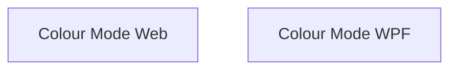

# Colour Mode Setting

## 1. Executive Summary

Colour Mode Setting adds an explicit, user-controlled Light/Dark appearance choice to both Financial front ends — `Financial.Web` (React) and `Financial.App` (WPF) — for the single self-hosted user of this personal financial tool. Today Web silently follows the OS/browser's `prefers-color-scheme` with no way to override it, and WPF has no dark appearance at all: every view hardcodes a light theme. The product works by giving the user one clearly labelled control, under a new **Settings → Appearance** page in each front end's navigation, with two text-labelled options — **Light** and **Dark** — defaulting to Light. A matching sun/moon icon shortcut in each front end's header offers a one-click way to flip the same setting without leaving the current page. The choice is stored locally per front end (no server round-trip, no new backend concept) and takes effect immediately.

## 2. Problem and Opportunity

**The Problem**

- **No user control over appearance.** Web silently inherits whatever the OS/browser reports; the user cannot choose Dark while their OS is set to Light, or vice versa, without changing an OS-wide setting that affects every other application.
- **WPF has no dark appearance at all.** Every WPF view hardcodes `Theme="Light"` locally; there is no dark visual treatment to switch to even if a toggle existed.
- **Inconsistent settings surface.** Neither front end has a place to manage application-level preferences today — the closest concept, "Admin", is entirely entity CRUD (Banks, Categories, Brokers, etc.), not user preferences.
- **Ambiguous controls elsewhere in the industry** — icon-only theme toggles (a bare sun/moon button with no text) are a common source of confusion for users unfamiliar with an app's iconography.

**The Opportunity**

- A dedicated **Settings → Appearance** page, present identically in both front ends, gives the user one obvious, discoverable place to change how the app looks, solving the "no control" and "no settings surface" problems together.
- Implementing the WPF Dark theme (via `Wpf.Ui`'s centralized `ApplicationThemeManager`, replacing the current per-view hardcoded light dictionaries) closes the "no dark appearance" gap and brings WPF to parity with what Web will offer.
- Pairing every icon with an explicit text label ("Light" / "Dark" on the settings page; an accessible tooltip/automation name on the header shortcut) solves the "ambiguous icon-only control" problem directly, per this project's UI invariants.

## 3. Target Audience

### Primary Users

**Self-Hosted Household Finance Owner**
- Runs both `Financial.Web` and `Financial.App` on their own devices, often switching between the two depending on context (desktop app vs. browser).
- Cares about visual comfort during extended financial review sessions (e.g., preferring Dark in the evening) independent of whatever their OS-wide theme happens to be set to.
- Expects the same setting, in the same place, to mean the same thing in both front ends — this project's stated invariant is that WPF and Web stay at feature parity.

## 4. Objectives

**Product Objectives**
- **Give** the user an explicit, discoverable way to choose Light or Dark appearance in both front ends.
- **Close** the WPF dark-appearance gap so WPF is not permanently Light-only.
- **Keep** the setting and its two access points (Settings page, header shortcut) perfectly in sync — no divergent state.
- **Preserve** UI-invariant compliance: no unlabeled icon-only control anywhere in the feature.

**Success Metrics**
- 100% of views in both front ends render with correct contrast/legibility in Dark mode (verified by manual pass over every WPF view and every Web page, since WPF has zero prior dark-mode coverage).
- 0 divergence between the Appearance page's displayed value and the header shortcut's displayed icon at any time within a session (same underlying stored value, read by both).
- 1-click access to toggle mode from anywhere in the app via the header shortcut, and 2 clicks (nav → radio option) via Settings → Appearance.
- Default is Light for every user with no prior stored preference, 100% of first runs, regardless of OS/browser colour-scheme.

## 5. User Stories

### F01. Colour Mode Setting (Web)
- As a user, I want to open Settings → Appearance so that I can find the colour mode control in a predictable place.
- As a user, I want to pick "Light" or "Dark" from clearly labelled options so that I know exactly which mode I'm choosing.
- As a user, I want a sun/moon shortcut in the header so that I can switch modes from any page without navigating to Settings.
- As a user, I want my choice to persist between visits so that I don't have to re-select it every time I open the app.
- As a user, I want the app to start in Light mode the first time I use it, regardless of my OS/browser theme, so that the behavior is predictable.

### F02. Colour Mode Setting (WPF)
- As a user, I want the same Settings → Appearance page and Colour mode control in the desktop app as in the web app so that switching between the two front ends feels familiar.
- As a user, I want a sun/moon shortcut in the desktop app's header so that I can switch modes without navigating away from my current view.
- As a user, I want every screen in the desktop app to look correct and legible in Dark mode, not just a subset, so that I can use Dark mode throughout my workflow.
- As a user, I want my choice to persist between app launches so that I don't have to re-select it every time I open the desktop app.

## 6. Functionalities

### F01. Colour Mode Setting (Web)

**Capabilities:**
- New top-level navigation item **Settings**, positioned immediately after the existing **Admin** item (final order: Investments, CashFlow, Admin, Settings), containing one leaf page: **Appearance**.
- Appearance page renders a "Colour mode" control with exactly two mutually exclusive, text-labelled options: **Light** and **Dark** (e.g. a Fluent `RadioGroup`). No icon-only control anywhere satisfies this requirement — text labels are always present.
- Stored value: a single `localStorage` key (e.g. `financial.colourMode`), value `"light"` or `"dark"`, following the existing `sidebarStorage.ts` per-key persistence pattern.
- Default when no stored value exists (first run, or storage cleared): **Light** — always, independent of the OS/browser's `prefers-color-scheme`. This replaces today's pure OS-driven `useSystemColorScheme` behavior; the OS signal is no longer consulted once this feature ships.
- Header shortcut: an icon-button next to the existing `SyncStatusIndicator`/`PaymentDueBanner` elements, using `WeatherSunny24Regular` / `WeatherMoon24Regular` from `@fluentui/react-icons` (already a project dependency). The icon and its tooltip/accessible name describe the action the click performs (e.g. moon icon + "Switch to Dark mode" tooltip while currently in Light; sun icon + "Switch to Light mode" tooltip while currently in Dark) — not the current state — so a screen-reader user and a sighted user both get an unambiguous action description.
- Both access points (Appearance page radios, header shortcut) read and write the exact same stored value via one shared hook/context — never two independent pieces of state.
- The applied Fluent theme (`financialLightTheme` / `financialDarkTheme`, already defined in `src/theme/fluentTheme.ts`) updates immediately on change, with no page reload.

**Experience:**
- User opens **Settings** in the nav, lands on **Appearance** (the only page in that section), sees "Colour mode" with **Light** selected by default (unless previously changed).
- Selecting **Dark** immediately re-themes the whole app (via `FluentProvider`) and immediately updates the header shortcut's icon/tooltip to reflect the new state.
- Clicking the header shortcut from any page immediately flips the mode and immediately updates the Appearance page's selected radio the next time it's viewed (single source of truth, no separate state to desync).
- Closing and reopening the app (or reloading the page) preserves the last chosen mode via `localStorage`; a brand-new browser profile with no stored key shows Light regardless of OS dark-mode.

### F02. Colour Mode Setting (WPF)

**Capabilities:**
- New top-level navigation item **Settings**, positioned immediately after **Admin** (same order as Web: Investments, CashFlow, Admin, Settings), containing one leaf page: **Appearance** — mirrored in `Financial.App/Navigation/NavTree.cs` from Web's `navTree.ts`, the existing cross-front-end nav convention.
- Appearance page renders the same two-option, text-labelled "Colour mode" control (Light / Dark) as Web, using established WPF/Fluent controls (e.g. `RadioButtons`), never an icon-only control.
- Stored value: one new User-scoped setting in `Financial.App/Properties/Settings.settings` (e.g. `ColourMode`, `System.String`, default `"Light"`), following the existing `IsNavigationSidebarCollapsed` pattern, read/written from `MainWindow.xaml.cs`.
- Default when no stored value exists: **Light** — same rule as Web, always Light regardless of the Windows system theme.
- Closes the pre-existing gap where no dark appearance is wired at all: theme application is centralized via `Wpf.Ui`'s `ApplicationThemeManager.Apply(ApplicationTheme.Light | Dark)` at the application/shell level, replacing every view's current locally-hardcoded `<ui:ThemesDictionary Theme="Light"/>` merge.
- Every existing view and shared style is verified to render with correct contrast/legibility against a dark background; the `#0F6CBD` brand accent (per `docs/ui/decisions/ADR-005-brand-and-status-colors.md`) is verified to still read correctly against dark.
- Header shortcut: an icon-button placed consistently with Web's (near `SyncStatusIndicator`/`PaymentDueBanner`), using `Symbol=WeatherSunny24` / `Symbol=WeatherMoon24` via `Wpf.Ui`'s `ui:SymbolIcon` (the project's established icon pattern, e.g. `HelpFlyoutButton.xaml`), with an `AutomationProperties.Name` describing the action ("Switch to Dark mode" / "Switch to Light mode"), matching Web's action-described-not-state-described convention.
- Both access points read/write the same `ColourMode` setting; no separate state.
- The applied theme updates immediately on change, with no application restart required.

**Experience:**
- User opens **Settings** in the nav, lands on **Appearance**, sees "Colour mode" with **Light** selected by default (unless previously changed).
- Selecting **Dark** immediately re-themes the whole application window (via `ApplicationThemeManager`) and immediately updates the header shortcut's icon/tooltip.
- Clicking the header shortcut from any view immediately flips the mode application-wide.
- Relaunching the app applies the last stored `ColourMode` value at startup, before the main window is shown, so there is no visible light-to-dark flash.

## 7. Out of Scope

**Not building in this version:**
- A "System/Auto" third option that follows the OS/browser theme — the setting is explicitly Light or Dark only; the default is always Light, never OS-derived.
- Cross-device or cross-front-end sync of the chosen mode — Web and WPF each store their own value locally; choosing Dark in Web does not change WPF, and vice versa.
- A backend Settings/Preferences API, domain entity, or DDD module — this remains a local, per-front-end UI preference with no server involvement.
- Additional themes beyond Light and Dark (e.g. high-contrast, custom accent themes).
- Per-page or per-view theme overrides — the mode is application-wide within each front end.
- Any other settings beyond Colour mode under the new Settings/Appearance section (e.g. no language, font-size, or notification settings are introduced by this PRD).

## 8. Dependency Graph

| # | Feature | Priority | Dependencies |
|---|---------|----------|--------------|
| F01 | Colour Mode Setting (Web) | 1 | None |
| F02 | Colour Mode Setting (WPF) | 1 | None |

### Execution Waves
Features within the same wave can be built in parallel. A wave starts only after every feature in earlier waves is complete.

- **Wave 1**: F01, F02

### Priority levels
- **1** = Essential — product does not work without it
- **2** = Important — significant value addition
- **3** = Desirable — incremental improvement

## 9. Acceptance Criteria

### F01. Colour Mode Setting (Web)
- [ ] A "Settings" nav item appears after "Admin"; selecting it opens the "Appearance" page.
- [ ] The Appearance page shows a "Colour mode" control with two text-labelled options: "Light" and "Dark".
- [ ] With no prior stored preference, the app renders in Light mode regardless of the OS/browser `prefers-color-scheme`.
- [ ] Selecting "Dark" immediately re-themes the app and persists the choice in `localStorage`.
- [ ] Reloading the page or reopening the app preserves the last chosen mode.
- [ ] The header shortcut icon-button reflects and toggles the same stored value as the Appearance page; toggling from the header updates the Appearance page's selected radio.
- [ ] The header shortcut has an accessible name/tooltip describing the action it performs, and is never the only way to change the mode (the Appearance page's text-labelled control also works).

### F02. Colour Mode Setting (WPF)
- [ ] A "Settings" nav item appears after "Admin" in the same position as Web; selecting it opens the "Appearance" page.
- [ ] The Appearance page shows a "Colour mode" control with two text-labelled options: "Light" and "Dark".
- [ ] With no prior stored preference, the app launches in Light mode.
- [ ] Selecting "Dark" immediately re-themes the entire application window without requiring a restart, and persists the choice.
- [ ] Every existing view renders with correct contrast/legibility in Dark mode, including the `#0F6CBD` brand accent.
- [ ] Relaunching the app applies the last stored mode at startup with no visible light-to-dark flash.
- [ ] The header shortcut icon-button reflects and toggles the same stored value as the Appearance page; toggling from the header updates the Appearance page's selected radio.
- [ ] The header shortcut has an accessible name (`AutomationProperties.Name`) describing the action it performs, and is never the only way to change the mode.

### Cross-Feature Integration
- F01 and F02 have no functional data dependency on each other or on any other feature in this PRD — each stores and applies its colour mode entirely within its own front end. No cross-feature integration criteria apply.
