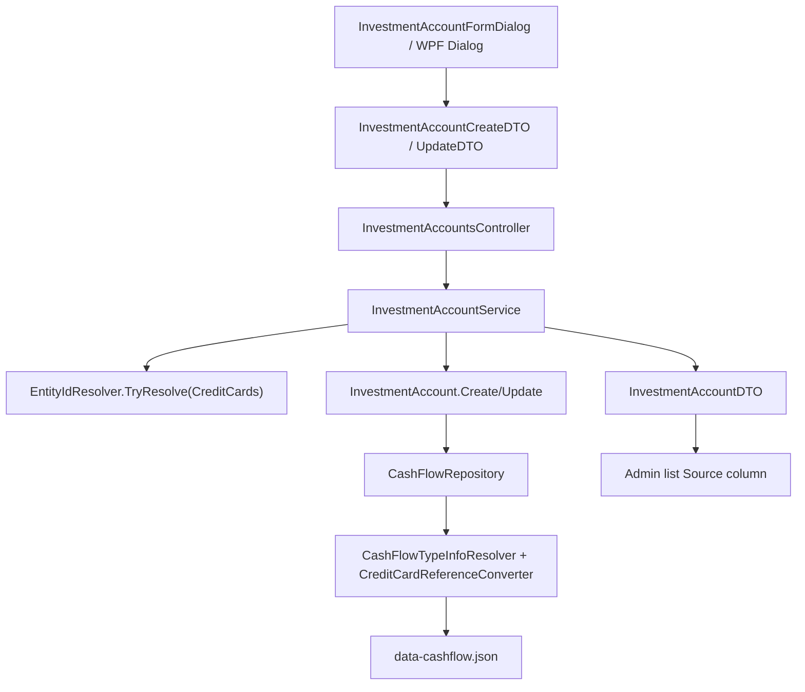

## 1. Technical Overview

**What:** Add a `Source` classification (`None` / `CreditCard` / `ReserveBucketsSum`) to `InvestmentAccount`, with an optional linked `CreditCard` reference used only when `Source == CreditCard`. The existing "Add/Edit Investment Account" dialog (Web + WPF) gains a Source dropdown and a conditional credit-card picker; the investment accounts admin list (Web + WPF) gains a Source column. This is purely configuration — no value computation happens in F01 (that is F02, which consumes `Source`/`CreditCardId` read here).

**Why:** `InvestmentAccount`, `CreditCard`, and `ReserveBucket` all live in the same aggregate (`Financial.CashFlow.Domain`'s `CashFlowData`, persisted to `data-cashflow.json`), so this is an intra-domain reference addition, not a cross-bounded-context one — CLAUDE.md's Investment/CashFlow isolation rule is not implicated. `Expense.CreditCard` (a nullable direct entity reference, validated against an "exactly this shape" rule, persisted via a dedicated `ReferenceConverter<CreditCard>`) is an almost-exact structural precedent; F01 follows it rather than inventing a new reference mechanism.

**Scope:**
- **Included** (PRD Section 6, F01 Capabilities/Experience — no Core/Full Scope split for F01, so the entire functionality block is in scope):
  - `Source` enum on `InvestmentAccount`: `None` (default for every account, existing and new), `CreditCard`, `ReserveBucketsSum`.
  - A nullable `CreditCard` reference on `InvestmentAccount`, populated only when `Source == CreditCard`; the domain enforces the two always move together.
  - Admin dialog: Source dropdown; a second dropdown (active credit cards) appears only when Source = Credit Card; a caption appears only when Source = Sum of Reserve Buckets; inline validation blocks save when Source = Credit Card with no card chosen.
  - Admin list: new Source column, both Web and WPF.
  - Server-side rejection (400) of an unresolvable or inactive credit card id.
  - Existing accounts (pre-feature) load with `Source = None`, no migration tool.
- **Deferred** (PRD Section 7, Out of Scope): Bank accounts as a source; selecting an individual reserve bucket (only the combined sum); preventing two accounts from sharing one card; any suggestion/computation logic (F02).

## 2. Requirements / Business Rules

(PRD Section 6, F01 Capabilities)

- `Source` has exactly three states; `None` is the default for every existing and newly created account.
- `Source = CreditCard` requires a linked credit card; the domain never allows this combination to disagree (a `CreditCard` reference implies `Source == CreditCard`, and vice versa).
- `Source = ReserveBucketsSum` and `Source = None` both carry no linked credit card; switching away from `CreditCard` (to either other state) clears any previously linked card.
- The system does not prevent two accounts from linking the same credit card (PRD Out of Scope) — no uniqueness check.
- Saving `Source = CreditCard` with no card chosen is blocked client-side (inline field error) and rejected server-side if it somehow arrives (400).
- A credit card id that doesn't resolve to an existing card, or resolves to one with `IsActive == false`, is rejected server-side with 400 (confirmed in interview: inactive is rejected the same as unresolved, mirroring `ExpenseService`'s existing validation for the same kind of link).

## 3. UX Flows

(PRD Section 6, F01 Experience — Web and WPF must behave equivalently per CLAUDE.md's UI invariant)

1. **Add/Edit dialog, Source = None (default):** no source-related field shown beyond the dropdown itself.
2. **Selecting Credit Card:** a second dropdown appears, listing active credit cards. Saving with nothing selected shows an inline error ("Select a credit card") on that field and blocks save.
3. **Selecting Sum of Reserve Buckets:** a short helper caption appears ("Uses the total balance across all reserve buckets"); no further input.
4. **Editing an account whose linked card has since become inactive:** the picker still shows and selects that card (confirmed in interview) so opening Edit never silently appears to have lost the link — but the picker's general option list is otherwise active-cards-only; the inactive card appears solely as the current selection, not as a generally choosable option for a different account.
5. **Switching Source away from Credit Card:** the credit-card dropdown disappears and the link is cleared; re-selecting Credit Card starts with no card chosen (not the previously-linked one).
6. **Admin list:** Source column reads "—" (None), the linked card's name (CreditCard), or "Sum of reserve buckets" (ReserveBucketsSum).
7. **Server rejection:** deleted/unresolvable or inactive card id → error banner "That credit card could not be found. Refresh and try again." (existing account-save error banner pattern, per PRD Error Handling).

## 4. Architecture Impact

**Affected components:**
- `Financial.CashFlow.Domain/Enums/InvestmentAccountSource.cs` — new enum.
- `Financial.CashFlow.Domain/Entities/InvestmentAccount.cs` — new `Source`/`CreditCard` properties, extended `Create`/`Update`, new shape validation.
- `Financial.CashFlow.Application/DTOs/InvestmentAccountDTO.cs`, `InvestmentAccountCreateDTO.cs`, `InvestmentAccountUpdateDTO.cs` — add `Source` + `CreditCardId`.
- `Financial.CashFlow.Application/Services/InvestmentAccountService.cs` — resolve/validate `CreditCardId` when `Source == CreditCard`, clear it otherwise.
- `Financial.CashFlow.Infrastructure/Persistence/CashFlowTypeInfoResolver.cs` — one new `ReferenceProperties` entry; reuses the existing `CreditCard` reference-converter branch.
- `Tests/Financial.Api.Tests/Contract/openapi-v1.snapshot.json` + `Financial.Web/src/api/generated/openapi.ts` — regenerated.
- `Financial.Web/src/components/InvestmentAccountFormDialog.tsx`, `Financial.Web/src/pages/InvestmentAccountsPage.tsx`, `Financial.Web/src/hooks/useInvestmentAccounts.ts` — Source dropdown, conditional card picker, Source column.
- `Financial.App/ViewModels/Admin/InvestmentAccountFormDialogViewModel.cs`, `Financial.App/Views/Admin/InvestmentAccountFormDialog.xaml(.cs)`, `Financial.App/ViewModels/Admin/InvestmentAccountsViewModel.cs`, `Financial.App/Views/Admin/InvestmentAccountsView.xaml` — same, WPF side.
- `data/data-cashflow.example.json` — one seeded account per non-None source, so the template stays representative.



## 5. Technical Decisions

| Decision | Chosen Approach | Alternative Considered | Trade-off |
|----------|----------------|----------------------|-----------|
| Reference mechanism for the linked credit card | Nullable direct entity reference (`CreditCard? CreditCard`), same shape as `Expense.CreditCard`, persisted via the existing `CreditCardReferenceConverter` (only a new `ReferenceProperties` dictionary entry is needed — no new converter class) | Store a raw `Guid? CreditCardId` on the domain entity itself | Every other cross-entity link in this domain (`Expense.CreditCard`, `Expense.PaymentSourceBank`, `ReserveMovement.Bucket`) is a direct object reference resolved by the serializer, not a raw id on the domain type; matching it keeps `InvestmentAccount` consistent with its siblings and reuses `EntityIdResolver.TryResolve` unchanged |
| Domain-level shape guard | A single `ValidateSourceShape(source, creditCard)` check: `Source == CreditCard` requires `creditCard is not null`, any other `Source` requires `creditCard is null` — enforced in both `Create` and `Update`, so the invariant can never be violated regardless of what the Application layer passes in | An XOR-style check across two independent nullable fields, like `Expense.ValidatePaymentShape` | `InvestmentAccount` only ever has one optional link (unlike `Expense`, which chooses between two), so a direct "does the link's presence match the enum" check is simpler and equally safe |
| Server-side inactive-card rejection | Reject `Source = CreditCard` when the resolved card's `IsActive == false`, with the same message shape as `ExpenseService` ("Credit card '{Name}' is inactive and cannot be used for new entries.") | Only reject an unresolvable/deleted id, per the PRD Error Handling section's literal wording | Confirmed with the user in interview: keep the two "link to a credit card" features (`Expense`, `InvestmentAccount`) consistent rather than diverging on a technicality the PRD didn't explicitly rule out |
| Edit-dialog picker option list when the linked card is now inactive | The dialog's card options include the currently-linked card even if inactive (so it still displays as selected on open), but the options list is not otherwise widened to include unrelated inactive cards | Show the field as unset until the user picks a new active card | Confirmed with the user in interview: avoids the Edit dialog silently appearing to have lost a still-configured link, while keeping the general picker limited to active cards for every other purpose |
| `Source` wire representation | Plain C# enum (`None`/`CreditCard`/`ReserveBucketsSum`), serialized as a string by the already-globally-registered `JsonStringEnumConverter` (both in `data-cashflow.json` via `CashFlowSerializerAdapter` and over the API, matching `RecurringBill.Status : BillStatus`) | A custom string-based DTO field with manual parsing | No bespoke converter needed; an existing record with no `"Source"` key deserializes to `default(InvestmentAccountSource)` = `None`, satisfying the PRD's "no manual migration step" acceptance criterion for free |

## 6. Component Overview

**Backend:**

| File Path | New/Modified | Purpose | Key Responsibilities |
|-----------|--------------|---------|---------------------|
| `Financial.CashFlow.Domain/Enums/InvestmentAccountSource.cs` | New | Source classification | `None = 0` (default), `CreditCard`, `ReserveBucketsSum` |
| `Financial.CashFlow.Domain/Entities/InvestmentAccount.cs` | Modified | Domain invariant | Adds `Source` and `CreditCard?` properties; `Create`/`Update` take both as new parameters; `ValidateSourceShape` guards the "link present iff Source == CreditCard" rule |
| `Financial.CashFlow.Application/DTOs/InvestmentAccountDTO.cs` | Modified | Read shape | Adds `required InvestmentAccountSource Source`, `Guid? CreditCardId` |
| `Financial.CashFlow.Application/DTOs/InvestmentAccountCreateDTO.cs` | Modified | Write shape | Adds `required InvestmentAccountSource Source`, `Guid? CreditCardId` |
| `Financial.CashFlow.Application/DTOs/InvestmentAccountUpdateDTO.cs` | Modified | Write shape | Same two fields as Create |
| `Financial.CashFlow.Application/Services/InvestmentAccountService.cs` | Modified | Validation + mapping | Resolves `CreditCardId` via `EntityIdResolver.TryResolve` only when `Source == CreditCard`; throws `ArgumentException` for unresolved or inactive; passes `null` for any other `Source` regardless of what was sent; `ToDto` maps `Source`/`CreditCard?.Id` |
| `Financial.CashFlow.Infrastructure/Persistence/CashFlowTypeInfoResolver.cs` | Modified | Persistence wiring | One new `ReferenceProperties` entry: `[(typeof(InvestmentAccount), nameof(InvestmentAccount.CreditCard))] = ("CreditCardId", false)`; `CreateReferenceConverter` already has a `typeof(CreditCard)` branch — untouched |
| `data/data-cashflow.example.json` | Modified | Template freshness | One seeded account gets `Source: "CreditCard"` + a `CreditCardId` matching a seeded card; one gets `Source: "ReserveBucketsSum"` |

**Contract Artifacts:**

| File Path | New/Modified | Purpose | Key Responsibilities |
|-----------|--------------|---------|---------------------|
| `Tests/Financial.Api.Tests/Contract/openapi-v1.snapshot.json` | Modified (regenerated) | Pins the public API shape | Regenerated via `UPDATE_OPENAPI_SNAPSHOT=1 dotnet test Tests/Financial.Api.Tests` |
| `Financial.Web/src/api/generated/openapi.ts` | Modified (regenerated) | Frontend type source | Regenerated via `npm run generate-api-types`, so `openapiFreshness.test.ts` stays green |

**Frontend (Web):**

| File Path | New/Modified | Purpose | Key Responsibilities |
|-----------|--------------|---------|---------------------|
| `Financial.Web/src/components/InvestmentAccountFormDialog.tsx` | Modified | Source dropdown + picker | New `Source` `Field`+`Select` (None / Credit Card / Sum of Reserve Buckets); conditional `Select` of `creditCards` (prop, filtered to active + the currently-edited value if inactive) shown only when `source === 'CreditCard'`; conditional caption when `source === 'ReserveBucketsSum'`; inline `validationState`/`validationMessage` on the card field, following `ExpenseForm.tsx`'s existing `Select` + validation pattern |
| `Financial.Web/src/pages/InvestmentAccountsPage.tsx` | Modified | Wiring + list column | Adds `useCreditCards()` (mirroring `MonthlyPage.tsx`), passes the credit-card list into the dialog, adds a "Source" `TableHeaderCell`/`TableCell` computing "—" / the linked card's name (looked up from the fetched credit-card list by id) / "Sum of reserve buckets" |
| `Financial.Web/src/hooks/useInvestmentAccounts.ts` | Modified | Pass-through payload | `createInvestmentAccount`/`updateInvestmentAccount` request shapes gain `source`/`creditCardId`; no new branching logic, purely widened payload types (regenerated from `openapi.ts`) |

**Frontend (WPF):**

| File Path | New/Modified | Purpose | Key Responsibilities |
|-----------|--------------|---------|---------------------|
| `Financial.App/ViewModels/Admin/InvestmentAccountFormDialogViewModel.cs` | Modified | Source dropdown + picker state | Adds `SourceOptions` (`["None", "Credit Card", "Sum of Reserve Buckets"]`), `Source` (string), `CreditCardOptions` (`IReadOnlyList<CreditCardDTO>`, supplied by the caller — active cards plus the currently-linked one if inactive), `CreditCardId` (`Guid?`), `IsCreditCardSourceMode`/`IsReserveBucketsSourceMode` computed bools for XAML visibility; `Validate()` extended to require `CreditCardId` when `Source == "Credit Card"` |
| `Financial.App/Views/Admin/InvestmentAccountFormDialog.xaml` (+`.xaml.cs`) | Modified | Source dropdown + picker UI | `ComboBox` bound to `SourceOptions`/`Source`; a `StackPanel` (visibility bound to `IsCreditCardSourceMode`, following `ExpenseFormView.xaml`'s pattern) containing a `ComboBox` (`ItemsSource="{Binding CreditCardOptions}"`, `DisplayMemberPath="Name"`, `SelectedValuePath="Id"`, `SelectedValue="{Binding CreditCardId}"`) plus an inline error `TextBlock`; a caption `TextBlock` visible when `IsReserveBucketsSourceMode` |
| `Financial.App/ViewModels/Admin/InvestmentAccountsViewModel.cs` | Modified | Wiring + list column | Takes `ICreditCardService` as a new constructor dependency; fetches credit cards alongside investment accounts in `RefreshAsync`; when opening Create/Edit, passes the active-cards list (plus the edited account's currently-linked card if inactive) into the dialog; passes `Source`/`CreditCardId` through the `Create`/`UpdateInvestmentAccountAsync` DTO construction; each row exposes a `SourceDisplay` computed from `Source`/`CreditCardId` + the fetched credit-card list |
| `Financial.App/Views/Admin/InvestmentAccountsView.xaml` | Modified | List column | New "Source" column bound to the new `SourceDisplay` computed property |

## 7. API Contracts

**Endpoint: Create/Update Investment Account** (existing `POST`/`PUT /investment-accounts[/{id}]`, request shape only — response mirrors it)

**Request (added fields):**

| Field | Type | Required | Validation | Description |
|-------|------|----------|------------|--------------|
| `source` | `string` enum (`"None"` \| `"CreditCard"` \| `"ReserveBucketsSum"`) | Yes | Must be one of the three values | Where this account's suggested value (F02) will come from |
| `creditCardId` | `uuid` \| `null` | Only when `source == "CreditCard"` | Must resolve to an existing, active credit card | The linked card; ignored/cleared server-side for any other `source` |

**Request Example:**
```json
{
  "name": "PlatinumVisa8003",
  "isActive": true,
  "isLiability": true,
  "source": "CreditCard",
  "creditCardId": "3fa85f64-5717-4562-b3fc-2c963f66afa6"
}
```

**Response (added fields, 200):**

| Field | Type | Description |
|-------|------|--------------|
| `source` | `string` enum | As stored |
| `creditCardId` | `uuid` \| `null` | As stored; `null` unless `source == "CreditCard"` |

**Response Example:**
```json
{
  "id": "8f14e45f-ceea-467e-9e19-f27d9e1e5a3f",
  "name": "PlatinumVisa8003",
  "isActive": true,
  "isLiability": true,
  "hasNonZeroInvestmentSnapshot": true,
  "source": "CreditCard",
  "creditCardId": "3fa85f64-5717-4562-b3fc-2c963f66afa6"
}
```

**Error Codes:**

| Code | HTTP Status | Description |
|------|-------------|--------------|
| — | 400 | `source == "CreditCard"` with `creditCardId` null, unresolvable, or resolving to an inactive card (`ArgumentException`, mapped by `DomainExceptionMappingMiddleware`, same as every other CashFlow validation failure) |
| — | 404 | Account id not found (existing behavior, unchanged) |

## 8. Data Model

No relational schema — both `InvestmentAccount` and `CreditCard` are entries in `data/data-cashflow.json`'s single `CashFlowData` document, via `ICashFlowRepository`.

**`InvestmentAccount` JSON shape (added keys):**

| Key | Type | Present when absent (pre-feature record) | Description |
|-----|------|---------------------------------------|--------------|
| `Source` | string enum | Defaults to `"None"` (enum default, `JsonStringEnumConverter`) | Matches PRD AC: no manual migration required |
| `CreditCardId` | `guid` \| absent | Absent ⇒ no link (`ReferenceProperties` entry marked `IsRequired: false`, same tolerance as `ReserveMovement.Income`) | Resolved against the same `CashFlowData.CreditCards` collection at load time by `CreditCardReferenceConverter`; an id that no longer resolves throws `JsonException` at load — same fail-loud behavior as every other reference converter, not a fail-safe path |

No SQL, no indexes, no constraints — this is a JSON-document field addition, following the exact pattern `Expense.CreditCard` already established.

## 9. Testing Strategy

**Test File Structure:**

| Test File | Test Type | Target | Coverage Goal |
|-----------|-----------|--------|----------------|
| `Tests/Financial.CashFlow.Domain.Tests/Entities/InvestmentAccountTests.cs` | Unit | `InvestmentAccount` | Shape invariant on `Create`/`Update`, defaulting |
| `Tests/Financial.CashFlow.Application.Tests/Services/InvestmentAccountServiceTests.cs` | Unit | `InvestmentAccountService` | All F01 acceptance criteria |
| `Tests/Financial.CashFlow.Infrastructure.Tests/Persistence/CashFlowSerializerAdapterTests.cs` | Unit | Round-trip serialization | New fields round-trip; absent-key tolerance |
| `Tests/Financial.Api.Tests/InvestmentAccountsEndpointsTests.cs` | Integration | HTTP endpoints | Server-side rejection over real HTTP |
| `Tests/Financial.Api.Tests/Contract/OpenApiContractTests.cs` | Contract | OpenAPI snapshot | Existing test; passes once regenerated |
| `Financial.Web/src/components/__tests__/InvestmentAccountFormDialog.test.tsx` | Component (RTL) | Dialog | Dropdown states, conditional picker/caption, inline validation |
| `Financial.Web/src/pages/__tests__/InvestmentAccountsPage.test.tsx` | Component (RTL) | List page | Source column display per state |
| `Financial.Web/src/hooks/__tests__/useInvestmentAccounts.test.ts` | Unit | Hook | Payload includes `source`/`creditCardId` |
| `Tests/Financial.Presentation.Tests/ViewModels/Admin/InvestmentAccountFormDialogViewModelTests.cs` | Unit | WPF dialog VM | Same acceptance criteria as the Web dialog, WPF-side |
| `Tests/Financial.Presentation.Tests/ViewModels/Admin/InvestmentAccountsViewModelTests.cs` | Unit | WPF list VM | `SourceDisplay` computation, credit-card fetch wiring |
| `Tests/Financial.CashFlow.Infrastructure.Tests/Persistence/ExampleDataFileTests.cs` | Unit (existing file) | Example JSON | Existing suite must keep passing against the updated `data-cashflow.example.json` |

**`InvestmentAccountTests` additions:**

| Test Function | Description | Assertions |
|---------------|--------------|------------|
| `Create_WithSourceNone_DefaultsSucceed` | Baseline | `Source == None`, `CreditCard == null` |
| `Create_WithSourceCreditCardAndNoCard_Throws` | AC: shape guard | Throws `ArgumentException` |
| `Create_WithSourceCreditCardAndCard_Succeeds` | AC: valid link | `Source == CreditCard`, `CreditCard` set |
| `Create_WithSourceReserveBucketsSumAndACard_Throws` | AC: shape guard, other direction | Throws `ArgumentException` |
| `Update_SwitchingFromCreditCardToNone_ClearsCreditCard` | AC: switching back to None clears the link | `CreditCard == null` after `Update` |
| `Update_SwitchingFromCreditCardToReserveBucketsSum_ClearsCreditCard` | Same invariant, other target state | `CreditCard == null` after `Update` |

**`InvestmentAccountServiceTests` additions:**

| Test Function | Description | Assertions |
|---------------|--------------|------------|
| `CreateInvestmentAccountAsync_SourceCreditCardWithUnresolvedId_Throws` | AC: unresolvable card | Throws `ArgumentException`, no record saved |
| `CreateInvestmentAccountAsync_SourceCreditCardWithInactiveCard_Throws` | Confirmed decision: inactive rejected | Throws `ArgumentException` naming the card |
| `CreateInvestmentAccountAsync_SourceCreditCardWithActiveCard_Succeeds` | Happy path | DTO's `Source`/`CreditCardId` match |
| `CreateInvestmentAccountAsync_SourceReserveBucketsSum_Succeeds` | Happy path, no card needed | `CreditCardId == null` in the result |
| `CreateInvestmentAccountAsync_SourceNone_DefaultsWhenOmitted` | AC: default `None` | `Source == None` when the request sends `None` explicitly (existing accounts predate the field; new ones always send a value) |
| `UpdateInvestmentAccountAsync_SwitchingAwayFromCreditCard_ClearsCreditCardIdRegardlessOfRequestValue` | AC: server enforces the clear, not just the client | Any `creditCardId` sent alongside a non-`CreditCard` `source` is ignored; result has `CreditCardId == null` |
| `GetInvestmentAccounts_MapsSourceAndCreditCardId` | Mapping | DTO fields reflect the entity |

**`InvestmentAccountsEndpointsTests` additions:**

| Test Function | Description | Assertions |
|---------------|--------------|------------|
| `CreateInvestmentAccount_SourceCreditCardWithDeletedCardId_Returns400` | AC: server-side rejection surfaces as an error banner | `400 BadRequest` with a `ProblemDetails` body |
| `CreateInvestmentAccount_SourceCreditCardWithActiveCard_Returns200WithSourceEcho` | Happy path over HTTP | `200`, response body's `source`/`creditCardId` match the request |

**`CashFlowSerializerAdapterTests` addition:**

| Test Function | Description | Assertions |
|---------------|--------------|------------|
| `Deserialize_InvestmentAccountJsonWithNoSourceOrCreditCardIdKeys_DefaultsToNoneAndNullLink` | AC: no manual migration | A hand-built JSON string omitting both keys deserializes with `Source == None`, `CreditCard == null` |
| `SerializeThenDeserialize_InvestmentAccountWithCreditCardSource_RoundTripsAndSharesReferenceInstance` | Extends the existing all-collections round-trip test | Deserialized `InvestmentAccount.CreditCard` is reference-equal to the deserialized `CreditCard` in `CashFlowData.CreditCards` (same pattern the existing test already asserts for other references) |

**`InvestmentAccountFormDialog.test.tsx` additions:**

| Test Function | Description | Assertions |
|---------------|--------------|------------|
| `shows_no_extra_field_when_source_is_none` | AC: None shows nothing extra | Neither the card `Select` nor the caption renders |
| `shows_card_picker_when_source_is_credit_card` | AC: conditional picker | Card `Select` renders, populated from `creditCards` prop |
| `shows_caption_when_source_is_reserve_buckets_sum` | AC: conditional caption | Caption text renders, no card picker |
| `blocks_save_and_shows_inline_error_when_credit_card_source_has_no_card_selected` | AC: client-side block | Save disabled/blocked, `validationMessage` = "Select a credit card" |
| `editing_account_with_inactive_linked_card_still_shows_it_selected` | Confirmed decision | The card `Select`'s selected option is the inactive card, drawn from the same `creditCards` prop the caller supplied including it |

**`InvestmentAccountsPage.test.tsx` addition:**

| Test Function | Description | Assertions |
|---------------|--------------|------------|
| `source_column_shows_dash_card_name_or_reserve_buckets_label_per_account` | AC: three display states | Renders "—", the linked card's name, and "Sum of reserve buckets" for the three respective accounts |

**`InvestmentAccountFormDialogViewModelTests` and `InvestmentAccountsViewModelTests` additions:** mirror the Web component/service test sets above one-for-one (same acceptance criteria, WPF binding surface instead of React props) — validation shape, conditional visibility flags, `CreditCardId` clearing, `SourceDisplay` per state.

**Cross-Feature Integration:** PRD Section 9's Cross-Feature Integration criterion spans both F01 and F02; it is verified once F02 (which reads `Source`/`CreditCardId`) is implemented — no integration test is added here for it, per `implement-feature`'s rule of checking a cross-feature box only when every feature it names is implemented.
