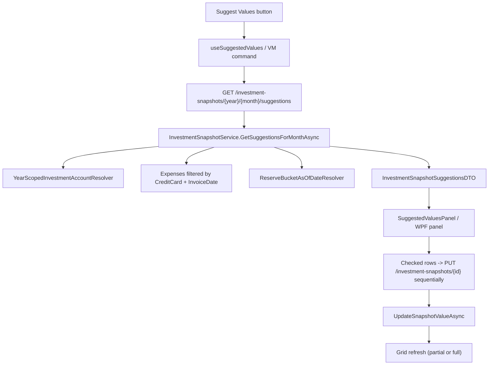

## 1. Technical Overview

**What:** Add a read-only "suggestions" computation for the Investment Snapshot page's selected month, and a review-before-apply workflow (Web + WPF) that lets the user accept, edit, or skip each computed value before it is saved. For a `CreditCard`-sourced account (per F01), the suggestion is the sum of every `Expense` invoiced to that card in the exact selected year/month. For a `ReserveBucketsSum`-sourced account, the suggestion is the total of every `ReserveMovement` dated on or before the last day of the month immediately before the selected one. `None`-sourced accounts are never considered. Applying writes only the checked rows, one at a time, through the existing snapshot-value update endpoint — no new persisted entity, no batch endpoint.

**Why:** `InvestmentAccount.Source`/`CreditCard` (added by F01) are already resolved domain references, so this feature is a pure read/compute step over data CashFlow already stores (`Expense.InvoiceDate`, `ReserveMovement.Date`/`Amount`) — no new aggregate state, no persistence-layer change. Keeping "compute a suggestion" and "save a value" as two separate steps (a new read endpoint plus the existing `PUT /investment-snapshots/{id}`) is what makes the review-before-apply, partial-failure-tolerant workflow possible without a new endpoint or a transactional batch API, matching the PRD's explicit exclusion of both.

**Scope:**
- **Included** (PRD Section 6, F02 Capabilities/Experience — no Core/Full Scope split for F02, so the entire functionality block is in scope):
  - Suggestion computation for `CreditCard`- and `ReserveBucketsSum`-sourced accounts, scoped to the same year-eligible account set the snapshot grid already uses.
  - A "Suggest Values" button next to the month picker, opening an inline panel (Web and WPF) with loading / populated (Suggestions + Not Updated) / empty / applying / completion states.
  - Per-row Include checkbox (default per current-value-is-zero rule), editable suggested value, and a live "Apply N Suggestions" count.
  - Sequential apply via the existing snapshot update endpoint, tolerating individual row failures, with a completion summary and a "Retry Failed" action that resubmits the same (possibly user-edited) values.
  - Mutual exclusivity with the existing "Edit Snapshot" panel (opening one collapses the other).
- **Deferred** (PRD Section 7, Out of Scope): bank accounts as a source; the ~13 accounts with no CashFlow-side source; scheduled/background syncing; per-bucket source selection; falling back to a live/accumulated card balance; a batch apply endpoint; preventing two accounts sharing one card.

## 2. Requirements / Business Rules

(PRD Section 6, F02 Capabilities, plus decisions confirmed in interview)

- A suggestion is produced only for an account whose `Source` is `CreditCard` or `ReserveBucketsSum`; `Source = None` accounts never appear in the Suggestions or Not Updated list.
- **CreditCard suggestion value:** the sum of every `Expense.Value` where `Expense.CreditCard.Id` matches the account's linked card and `Expense.InvoiceDate` falls in the exact selected year/month — **including expenses already settled** (paid off), not only currently-outstanding ones. `InvoiceDate` is set at charge time and is never cleared by `Settle()`/`Unsettle()`, so this always reflects "what was owed on that statement," independent of today's payment status (confirmed in interview: matches the PRD's "exact statement (invoice) total" wording rather than `CardStatementService`'s unsettled-only `OutstandingTotal`).
- **No-statement gate:** an account is skipped (added to Not Updated with reason "No statement for this month yet") when zero expenses match its card + exact year/month — not based on whether a `CardStatement` record exists, since those auto-create lazily on any month view and are not a meaningful "has real data" signal (confirmed in interview).
- **ReserveBucketsSum suggestion value:** the sum of every `ReserveMovement.Amount` (every bucket, active or not, matching F01's "always the combined total") dated on or before the last day of the month immediately before the selected one. This always produces a value (0 if there are no movements yet as of that date) — there is no "not updated" case for this source type.
- **Default Include state:** checked when the account's current snapshot value is `0`; unchecked (an overwrite candidate) otherwise. This is derivable purely from data already in the suggestion response (`CurrentValue`), so it is computed client-side, not sent as a separate flag.
- **Apply:** writes only checked rows, sequentially, via the existing `PUT /investment-snapshots/{id}`; a row failure does not stop the remaining checked rows.
- **Retry Failed:** resubmits the exact suggested value shown at the time of the original Apply click (including any edit the user made before that Apply) for the previously-failed rows only — never recomputes suggestions first, so it can't silently discard an edit (confirmed in interview).
- The panel is collapsed by Cancel or a fully-successful Apply; the underlying grid refreshes only when at least one row actually saved.

## 3. UX Flows

(PRD Section 6, F02 Experience — Web and WPF must behave equivalently per CLAUDE.md's UI invariant)

1. **Opening the panel:** clicking "Suggest Values" (enabled for any month) opens an inline panel below the month picker — same inline placement as the existing "Edit Snapshot" panel — and collapses that panel if it was open. Fetch starts immediately; a loading state is shown.
2. **Populated state:** a Suggestions table (Account | Current Value | Suggested Value [editable] | Source | Include) and, if any accounts were skipped, a Not Updated list (Account | Reason). A checked row whose current value is non-zero visually distinguishes the current value (muted/struck through) next to the new one.
3. **Empty state:** if there are zero suggestions (all sourced accounts skipped, or none configured), the panel shows "No suggestions available for this month." plus the Not Updated list if non-empty, and no Apply action.
4. **Fetch failure:** "Couldn't load suggestions. Try again." with a retry action; the grid underneath stays fully usable.
5. **Editing before apply:** the user can edit any row's Suggested Value and toggle Include; the footer's "Apply N Suggestions" count reflects the live checked-row count and disables at `N = 0`.
6. **Applying state:** Apply is replaced by a determinate progress indicator and text ("Applying 2 of 5: Platinum Visa 8003..."); all panel inputs are disabled for the duration.
7. **Completion state:** a summary ("Applied 4 of 5. 1 failed: BA Amex — try again.") with "Retry Failed" shown whenever at least one row failed. Cancel or a fully successful Apply closes the panel back to the plain grid view; the grid refreshes to reflect what was actually saved (not refreshed at all when every row failed).
8. **Mid-apply navigation:** changing the month or navigating away lets rows already submitted finish independently (each is its own save); the panel simply closes.

## 4. Architecture Impact

**Affected components:**
- `Financial.CashFlow.Domain/Rules/ReserveBucketAsOfDateResolver.cs` — new static rule computing the prior-month cutoff date and the as-of-date total across `ReserveMovement`s.
- `Financial.CashFlow.Application/DTOs/InvestmentSnapshotSuggestionDTO.cs`, `InvestmentSnapshotSuggestionSkippedDTO.cs`, `InvestmentSnapshotSuggestionsDTO.cs` — new read DTOs.
- `Financial.CashFlow.Application/Interfaces/IInvestmentSnapshotService.cs`, `Financial.CashFlow.Application/Services/InvestmentSnapshotService.cs` — new `GetSuggestionsForMonthAsync(year, month)`, reusing `GetSnapshotsForMonthAsync`'s existing scoping/auto-create so every considered account already has a snapshot id to apply against.
- `Financial.Api/Controllers/InvestmentSnapshotsController.cs` — new `GET /investment-snapshots/{year}/{month}/suggestions`.
- `Tests/Financial.Api.Tests/Contract/openapi-v1.snapshot.json` + `Financial.Web/src/api/generated/openapi.ts` — regenerated.
- `Financial.Web/src/hooks/useSuggestedValues.ts` (new), `Financial.Web/src/components/SuggestedValuesPanel.tsx` (new), `Financial.Web/src/pages/InvestmentSnapshotsPage.tsx` (modified: button + panel wiring + mutual exclusivity with the edit panel).
- `Financial.App/ViewModels/CashFlow/InvestmentSnapshotsViewModel.cs` (extended), `Financial.App/ViewModels/CashFlow/SuggestionRow.cs` (new), `Financial.App/Views/CashFlow/InvestmentSnapshotsView.xaml` (extended).



## 5. Technical Decisions

| Decision | Chosen Approach | Alternative Considered | Trade-off |
|----------|----------------|----------------------|-----------|
| Where suggestion computation lives | Extend the existing `IInvestmentSnapshotService`/`InvestmentSnapshotService` with `GetSuggestionsForMonthAsync`, reusing `GetSnapshotsForMonthAsync` internally for scoping and snapshot-id lookup | A new dedicated `ISuggestedInvestmentValuesService` | The computation is inseparable from the existing snapshot scoping/auto-create logic (an account must already have a snapshot row before it can be a suggestion target); duplicating that logic in a second service would drift from `GetSnapshotsForMonthAsync` over time |
| Historical reserve-bucket total | A new `Financial.CashFlow.Domain.Rules.ReserveBucketAsOfDateResolver` (pure static functions: prior-month cutoff date, as-of-date sum) | Inline the date math and LINQ filter directly in `InvestmentSnapshotService` | Matches the existing `YearScopedInvestmentAccountResolver` precedent for "domain-level pure computation used by one Application service" — independently unit-testable without spinning up the service or repository |
| CreditCard suggestion: settled vs. unsettled expenses | Include both — filter by `InvoiceDate` alone, regardless of `PaymentStatus` | Reuse `CardStatementService`'s `OutstandingTotal` (unsettled-only) | Confirmed in interview: a snapshot represents what was owed on that statement historically, not today's payment status; using `OutstandingTotal` would silently zero out any month whose statement has since been paid |
| "No statement" gate | No expense matches the card + exact year/month (any status) | Presence/absence of a `CardStatement` record for that year/month | Confirmed in interview: `CardStatement` records auto-create on any month view (`CardStatementService.GetStatementsForMonthAsync`), so their existence isn't a meaningful "has real data" signal — an unrelated page view could make a future month appear to "have a statement" |
| Apply mechanism | Sequential client-side calls to the existing `PUT /investment-snapshots/{id}` per checked row | A new batch/bulk apply endpoint | PRD Out of Scope explicitly excludes a batch endpoint; reusing the existing single-row update also means no new failure-mode plumbing is needed for the "continue past one row's failure" requirement |
| Retry Failed semantics | Resubmit the exact previously-shown suggested values for only the failed rows, no recomputation | Re-fetch suggestions before retrying | Confirmed in interview: never silently discards a value the user edited before the original Apply click |

## 6. Component Overview

**Backend:**

| File Path | New/Modified | Purpose | Key Responsibilities |
|-----------|--------------|---------|---------------------|
| `Financial.CashFlow.Domain/Rules/ReserveBucketAsOfDateResolver.cs` | New | Historical reserve total | `LastDayOfPriorMonth(year, month)`; `TotalBalanceAsOf(movements, asOfDate)` summing every movement dated on or before it |
| `Financial.CashFlow.Application/DTOs/InvestmentSnapshotSuggestionDTO.cs` | New | Suggestion row shape | `SnapshotId`, `AccountId`, `AccountName`, `CurrentValue`, `SuggestedValue`, `SourceDescription` |
| `Financial.CashFlow.Application/DTOs/InvestmentSnapshotSuggestionSkippedDTO.cs` | New | Not-updated row shape | `AccountId`, `AccountName`, `Reason` |
| `Financial.CashFlow.Application/DTOs/InvestmentSnapshotSuggestionsDTO.cs` | New | Combined response | `Suggestions`, `NotUpdated` lists |
| `Financial.CashFlow.Application/Interfaces/IInvestmentSnapshotService.cs` | Modified | Contract | Adds `GetSuggestionsForMonthAsync(int year, int month)` |
| `Financial.CashFlow.Application/Services/InvestmentSnapshotService.cs` | Modified | Computation | Resolves scoped accounts + their existing snapshot (via `GetSnapshotsForMonthAsync`), branches per `Source` to compute a suggestion or a skip reason, builds each `SourceDescription` (e.g. `"Platinum Visa 8003 — Aug 2026 statement"`, `"Sum of reserve buckets — as of Jul 2026"`) so both clients render identical text |
| `Financial.Api/Controllers/InvestmentSnapshotsController.cs` | Modified | Endpoint | New `GET {year}/{month}/suggestions` returning `InvestmentSnapshotSuggestionsDTO` |

**Contract Artifacts:**

| File Path | New/Modified | Purpose | Key Responsibilities |
|-----------|--------------|---------|---------------------|
| `Tests/Financial.Api.Tests/Contract/openapi-v1.snapshot.json` | Modified (regenerated) | Pins the public API shape | Regenerated via `UPDATE_OPENAPI_SNAPSHOT=1 dotnet test Tests/Financial.Api.Tests` |
| `Financial.Web/src/api/generated/openapi.ts` | Modified (regenerated) | Frontend type source | Regenerated via `npm run generate-api-types` |

**Frontend (Web):**

| File Path | New/Modified | Purpose | Key Responsibilities |
|-----------|--------------|---------|---------------------|
| `Financial.Web/src/hooks/useSuggestedValues.ts` | New | Panel state machine | Fetch on open, per-row `included`/edited-value local state defaulted from `CurrentValue === 0`, live checked count, sequential apply with per-row progress and per-row success/failure tracking, retry-failed (resubmits tracked values), close/cancel |
| `Financial.Web/src/components/SuggestedValuesPanel.tsx` | New | Panel UI | Renders loading / populated (Suggestions table + Not Updated list) / empty / applying (progress) / completion states, following `useFormPanelStyles`' existing panel/grid/actions styling |
| `Financial.Web/src/pages/InvestmentSnapshotsPage.tsx` | Modified | Wiring | "Suggest Values" button next to the month picker; opening it closes the Edit Snapshot panel and vice versa; refreshes the grid (via the existing silent refresh) after any successful apply |

**Frontend (WPF):**

| File Path | New/Modified | Purpose | Key Responsibilities |
|-----------|--------------|---------|---------------------|
| `Financial.App/ViewModels/CashFlow/SuggestionRow.cs` | New | Mutable row | Wraps the suggestion DTO plus `Included` (bool) and editable `Value` (string), mirroring `SnapshotRow`'s `FromDto` pattern |
| `Financial.App/ViewModels/CashFlow/InvestmentSnapshotsViewModel.cs` | Modified | Panel state + commands | `IsSuggestPanelOpen` (mutually exclusive with `IsEditFormOpen`), `SuggestionRows`/`NotUpdatedRows` collections, `CheckedCount`, `SuggestValuesCommand`, `ApplySuggestionsCommand` (sequential, tracks per-row outcome, exposes `ProgressPercent`/`ProgressMessage` following `AssetPriceView`'s existing determinate-progress pattern), `RetryFailedCommand`, completion summary text |
| `Financial.App/Views/CashFlow/InvestmentSnapshotsView.xaml` | Modified | Panel UI | Inline panel below the month picker (same placement convention as the existing Edit Snapshot panel) with a Suggestions `DataGrid` (checkbox + editable value columns), a Not Updated list, and a `ProgressBar`+message swapped in for the Apply button while applying |

## 7. API Contracts

**Endpoint: Get Investment Snapshot Suggestions**
- **Method:** GET
- **Path:** `/investment-snapshots/{year}/{month}/suggestions`
- **Authentication:** None (matches every other CashFlow endpoint in this single-user, self-hosted app)

**Request:**

| Field | Type | Required | Validation | Description |
|-------|------|----------|------------|--------------|
| `year` | `int` (route) | Yes | — | Selected year |
| `month` | `int` (route) | Yes | 1-12 | Selected month |

**Response (Success - 200):**

| Field | Type | Description |
|-------|------|-------------|
| `suggestions[].snapshotId` | `uuid` | The existing snapshot to update via the existing PUT endpoint |
| `suggestions[].accountId` | `uuid` | Investment account id |
| `suggestions[].accountName` | `string` | Investment account name |
| `suggestions[].currentValue` | `decimal` | The snapshot's current stored value |
| `suggestions[].suggestedValue` | `decimal` | The computed suggestion |
| `suggestions[].sourceDescription` | `string` | Human-readable source, e.g. `"Platinum Visa 8003 — Aug 2026 statement"` |
| `notUpdated[].accountId` | `uuid` | Investment account id |
| `notUpdated[].accountName` | `string` | Investment account name |
| `notUpdated[].reason` | `string` | Why no suggestion was produced, e.g. `"No statement for this month yet"` |

**Response Example:**
```json
{
  "suggestions": [
    {
      "snapshotId": "8f14e45f-ceea-467e-9e19-f27d9e1e5a3f",
      "accountId": "3fa85f64-5717-4562-b3fc-2c963f66afa6",
      "accountName": "PlatinumVisa8003",
      "currentValue": 0,
      "suggestedValue": 842.17,
      "sourceDescription": "Platinum Visa 8003 — Aug 2026 statement"
    },
    {
      "snapshotId": "1b9d6bcd-bbfd-4b2d-9b5d-ab8dfbbd4bed",
      "accountId": "9e107d9d-372b-4a70-9a99-53e0b8ac3d4f",
      "accountName": "Reservas pessoais",
      "currentValue": 5400.00,
      "suggestedValue": 5612.30,
      "sourceDescription": "Sum of reserve buckets — as of Jul 2026"
    }
  ],
  "notUpdated": [
    {
      "accountId": "d6c1e6b9-1a8b-4a4d-8a1a-8e6b2f0d9c3a",
      "accountName": "Chase Master 4023",
      "reason": "No statement for this month yet"
    }
  ]
}
```

**Error Codes:**

| Code | HTTP Status | Description |
|------|-------------|--------------|
| — | 200 | Always succeeds with (possibly empty) lists — there is no error condition specific to this endpoint beyond the standard unhandled-exception path |

**Existing endpoint reused for Apply:** `PUT /investment-snapshots/{id}` with `InvestmentSnapshotValueUpdateDTO { value }` — called once per checked row, sequentially, by the client. No contract change.

## 8. Data Model

No new persisted state and no JSON schema change — this feature only reads existing `InvestmentAccount`, `Expense`, `ReserveMovement`, and `InvestmentSnapshot` data from `data/data-cashflow.json` via `ICashFlowRepository`'s existing getters, and writes through the existing `InvestmentSnapshot.Update(value)` path. No new repository methods are required.

## 9. Testing Strategy

**Test File Structure:**

| Test File | Test Type | Target | Coverage Goal |
|-----------|-----------|--------|----------------|
| `Tests/Financial.CashFlow.Domain.Tests/Rules/ReserveBucketAsOfDateResolverTests.cs` | Unit | `ReserveBucketAsOfDateResolver` | Prior-month cutoff at year boundary, as-of-date sum inclusion/exclusion |
| `Tests/Financial.CashFlow.Application.Tests/Services/InvestmentSnapshotServiceTests.cs` | Unit | `InvestmentSnapshotService.GetSuggestionsForMonthAsync` | All F02 acceptance criteria |
| `Tests/Financial.Api.Tests/InvestmentSnapshotsEndpointsTests.cs` | Integration | HTTP endpoint | New GET route, end-to-end with seeded fixtures |
| `Tests/Financial.Api.Tests/Contract/OpenApiContractTests.cs` | Contract | OpenAPI snapshot | Existing test; passes once regenerated |
| `Financial.Web/src/hooks/__tests__/useSuggestedValues.test.ts` | Unit | Hook | Default include state, apply sequencing, retry-failed reuse of prior values |
| `Financial.Web/src/components/__tests__/SuggestedValuesPanel.test.tsx` | Component (RTL) | Panel | Every state (loading/populated/empty/error/applying/completion) |
| `Financial.Web/src/pages/__tests__/InvestmentSnapshotsPage.test.tsx` | Component (RTL) | Page | Suggest Values button, mutual exclusivity with Edit Snapshot panel |
| `Tests/Financial.Presentation.Tests/ViewModels/CashFlow/InvestmentSnapshotsViewModelTests.cs` | Unit | WPF VM | Same acceptance criteria as the Web hook/panel, WPF-side |

**`ReserveBucketAsOfDateResolverTests` additions:**

| Test Function | Description | Assertions |
|---------------|--------------|------------|
| `LastDayOfPriorMonth_MidYear_ReturnsLastDayOfPreviousMonth` | Normal case | e.g. `(2026, 8)` → `2026-07-31` |
| `LastDayOfPriorMonth_January_ReturnsDecember31OfPriorYear` | Year-boundary case | `(2026, 1)` → `2025-12-31` |
| `TotalBalanceAsOf_ExcludesMovementsAfterCutoff` | AC: as-of, not current | A movement dated after the cutoff is excluded from the sum |
| `TotalBalanceAsOf_IncludesMovementsAcrossAllBuckets` | AC: combined total | Movements from multiple buckets are summed together |

**`InvestmentSnapshotServiceTests.GetSuggestionsForMonthAsync` additions:**

| Test Function | Description | Assertions |
|---------------|--------------|------------|
| `GetSuggestionsForMonth_SourceNone_NeverAppearsInEitherList` | AC | Account absent from both `Suggestions` and `NotUpdated` |
| `GetSuggestionsForMonth_CreditCardWithMatchingExpense_SuggestsSum` | AC: exact-month statement total | `SuggestedValue` equals the sum of matching expenses |
| `GetSuggestionsForMonth_CreditCardWithSettledExpense_StillIncludesIt` | Confirmed decision | A settled (paid) expense still counts toward the suggestion |
| `GetSuggestionsForMonth_CreditCardWithNoMatchingExpense_AddsToNotUpdatedWithReason` | AC: no-statement gate | Appears in `NotUpdated` with the exact reason text |
| `GetSuggestionsForMonth_ReserveBucketsSum_UsesLastDayOfPriorMonth` | AC | `SuggestedValue` matches the as-of-date sum |
| `GetSuggestionsForMonth_ReserveBucketsSum_NeverAddedToNotUpdated` | AC: always resolvable | Never appears in `NotUpdated` even with zero movements |
| `GetSuggestionsForMonth_ReturnsExistingSnapshotIdForEachSuggestion` | Apply wiring | `SnapshotId` matches the account's existing (or auto-created) snapshot for that month |
| `GetSuggestionsForMonth_UsesSameYearScopingAsSnapshotGrid` | Consistency | An account excluded by `YearScopedInvestmentAccountResolver` for a past year never appears in either list |

**`InvestmentSnapshotsEndpointsTests` additions:**

| Test Function | Description | Assertions |
|---------------|--------------|------------|
| `GetSuggestionsForMonth_SeededCreditCardAndReserveAccounts_ReturnsExpectedShape` | AC (Cross-Feature Integration): one account of each source type | Response contains one suggestion per sourced account, correct `sourceDescription` text |

**`useSuggestedValues.test.ts` additions:**

| Test Function | Description | Assertions |
|---------------|--------------|------------|
| `defaults_zero_current_value_rows_to_included` | AC | Row with `currentValue === 0` starts checked |
| `defaults_nonzero_current_value_rows_to_unchecked` | AC | Row with non-zero `currentValue` starts unchecked |
| `applies_only_checked_rows_sequentially` | AC | Calls the update endpoint once per checked row, in order, awaiting each |
| `continues_past_a_failed_row` | AC | A rejected row doesn't stop the remaining checked rows from being attempted |
| `retry_failed_resubmits_prior_values_without_refetching` | Confirmed decision | Retry doesn't call the suggestions GET again; resubmits the same values for failed rows |

**`SuggestedValuesPanel.test.tsx` additions:**

| Test Function | Description | Assertions |
|---------------|--------------|------------|
| `shows_no_suggestions_available_message_when_both_lists_are_empty` | AC: empty state | Empty-state text renders, no Apply button |
| `shows_muted_current_value_next_to_suggested_for_a_checked_overwrite_row` | AC: overwrite is explicit | Current value rendered with the muted/struck-through treatment |
| `apply_button_disabled_at_zero_checked_rows` | AC | Disabled state matches the live checked count |
| `shows_progress_text_while_applying` | AC | "Applying N of M: {account}..." renders during apply |
| `shows_completion_summary_with_retry_failed_when_a_row_failed` | AC | Summary text + Retry Failed button both render |

**`InvestmentSnapshotsPage.test.tsx` addition:**

| Test Function | Description | Assertions |
|---------------|--------------|------------|
| `opening_suggest_values_panel_closes_an_open_edit_snapshot_panel_and_vice_versa` | AC: mutual exclusivity | Only one panel is present in the DOM at a time |

**`InvestmentSnapshotsViewModelTests` additions:** mirror the Web hook/panel test set above one-for-one (same acceptance criteria, WPF binding surface instead of React state) — default include state, sequential apply with progress, partial-failure completion summary, retry-failed reuse of prior values, mutual exclusivity with the edit form.

**Cross-Feature Integration:** PRD Section 9's Cross-Feature Integration criterion is verified by `GetSuggestionsForMonth_SeededCreditCardAndReserveAccounts_ReturnsExpectedShape` above (one account of each source type, plus a `Source = None` account implicitly absent from both lists in the same fixture) together with the manual end-to-end pass described in the execution plan's Verification section.
