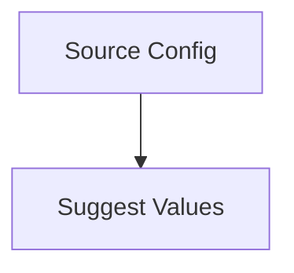

# Investment Snapshot Suggested Values

## 1. Executive Summary

Investment Snapshot Suggested Values is a CashFlow feature that removes the manual, memory-dependent work of filling in the monthly Investment Snapshot grid for the small subset of tracked accounts that already have a real, matching source of truth elsewhere in the system. Today every one of the 19 tracked accounts — credit cards, savings pots, ISAs, the household reserve — is a hand-typed number with zero connection to the credit card statements or reserve bucket balances already recorded in CashFlow.

For the single user of this self-hosted tool, the feature adds two capabilities: an admin-configurable link from an investment account to its real CashFlow source (a specific credit card, or the combined reserve buckets), and a one-click "Suggest Values" action on the Investment Snapshot page that computes the correct month-scoped figure for every account with a working link, shows it alongside whatever value is already there, and lets the user decide row by row what to accept before anything is saved.

The core value is trustworthy speed: the ~6 accounts that do have a real source stop requiring manual lookup and retyping every month, while every other account stays exactly as manual as before, and no existing value is ever silently replaced.

## 2. Problem and Opportunity

**The Problem**

- **Manual re-entry from memory or cross-referencing.** Every month, filling in accounts like the 5 tracked credit cards or "Reservas pessoais" requires opening the Credit Card view or Reserva page separately, reading a figure, and retyping it into the Investment Snapshot grid — for the same data CashFlow already stores.
- **No feedback on missing data.** If a credit card statement for the month hasn't been generated yet, there is currently no way to tell "not yet available" from "forgot to fill this in" — the row is just blank or stale.
- **Silent-overwrite risk in any future automation.** A naive auto-fill would be a real threat to already-verified manual entries; the current 100%-manual design is safe but slow, and any speed-up must not trade away that safety.

**The Opportunity**

Connect the 6 accounts that genuinely have a CashFlow-side source (5 credit cards + the household reserve total) to that source, and let the user pull the correct value with one click and a clear review step. This removes the majority of the monthly re-entry effort for the accounts where it matters most (all 5 liabilities plus the largest savings figure) while leaving the remaining ~13 accounts — which have no real CashFlow equivalent — exactly as manual as they are today, and without ever overwriting an existing value unless the user explicitly says so.

## 3. Target Audience

### Primary Users

**Gleison — the household finance owner**
- Self-hosted, single user of both the Web and WPF clients; fills in the Investment Snapshot monthly as part of closing out the month's CashFlow tracking.
- Deeply familiar with which of the 19 tracked accounts are real bank/card products versus which ones already exist elsewhere in the app (credit cards, the reserve buckets) — configures the source links once and expects them to keep working.
- Values not losing previously-entered, manually-verified numbers over saving a few seconds — any automation must be reviewable and reversible before it commits.

## 4. Objectives

**Product Objectives**

- **Reduce** the manual data entry required to complete a month's Investment Snapshot for accounts that have a real CashFlow source.
  - *Metric:* at least 6 of the 19 tracked accounts (the 5 credit cards + "Reservas pessoais") are fillable via one click instead of manual typing, whenever their source data exists for that month.
- **Prevent** accidental loss of manually-entered snapshot values.
  - *Metric:* 0 rows with a pre-existing non-zero value are ever written by "Apply" without that row having been explicitly checked by the user; verified by acceptance tests on both clients.
- **Surface** missing source data clearly instead of leaving an unexplained blank.
  - *Metric:* 100% of accounts with a configured source but no resolvable data for the selected month appear in a "Not updated" list with a stated reason, every time the action runs.
- **Maintain** full behavioral parity between the Web and WPF clients for this workflow.
  - *Metric:* every F02 acceptance criterion below passes identically in both clients.

## 5. User Stories

### F01. InvestmentAccount Source Configuration
- As a user, I want to set an investment account's source to None, a specific credit card, or "sum of reserve buckets", so that future suggestions know where to pull its value from.
- As a user, I want to pick which of my active credit cards backs an account when I choose the credit-card source, so the right statement gets matched later.
- As a user, I want to see each account's configured source in the admin accounts list, so I can verify my setup at a glance without opening every row.

### F02. Investment Snapshot Suggested Values
- As a user, I want to click "Suggest Values" for the month I'm viewing, so I don't have to remember and retype figures I've already recorded elsewhere in the app.
- As a user, I want to see the current value next to the suggested value for any row that already has data, so replacing it is a decision I make, not something that happens automatically.
- As a user, I want empty rows pre-selected and rows that would overwrite existing data unselected by default, so applying doesn't accidentally erase what I already typed.
- As a user, I want to edit a suggested value before applying it, in case the computed figure needs a small manual correction.
- As the system, I want to skip accounts whose source has no data for the selected month and list them separately with a reason, so the user understands what wasn't touched and why.
- As a user, I want to see progress while suggestions are being applied and a final report of what succeeded or failed, so a partial failure doesn't leave me guessing what was actually saved.
- As a user, I want the same suggest-review-apply workflow in the WPF app, so I'm not tied to the web client to do this monthly task.

## 6. Functionalities

### F01. InvestmentAccount Source Configuration

**Provides:**
- Source type and linked credit card per investment account (used by F02)

**Capabilities:**
- `Source` has three states: `None` (default for every existing and new account), `CreditCard`, `ReserveBucketsSum`.
- `CreditCard` requires selecting one of the currently active credit cards (5 seeded today: Platinum Visa 8003, Platinum Visa 6007, Chase Master 4023, BA Amex, Paypal credit); the system does not prevent two accounts from pointing at the same card.
- `ReserveBucketsSum` requires no further selection — it always represents the total across every reserve bucket (5 seeded today: Investimento, HouseTreats, Ariana, Gleison, Samuel), never a specific bucket.
- Bank accounts are not a supported source in this feature — there is no "Bank" option.

**Experience:**
- The existing "Add/Edit Investment Account" dialog gains a "Source" dropdown (None / Credit Card / Sum of Reserve Buckets) below the existing Name/Active/Liability fields.
- Choosing "Credit Card" reveals a second dropdown listing active credit cards. Choosing "Sum of Reserve Buckets" reveals a short helper caption ("Uses the total balance across all reserve buckets") and no further input. Choosing "None" shows no source-related field.
- The investment accounts admin list gains a "Source" column: "—" for None, the linked card's name for CreditCard, "Sum of reserve buckets" for ReserveBucketsSum.
- Saving with CreditCard selected but no card chosen shows an inline validation message on the card field ("Select a credit card") and blocks the save.

**Error Handling:**
- CreditCard selected with no card chosen: inline field validation, save blocked client-side.
- Server rejects an unresolvable/deleted credit card id: error banner "That credit card could not be found. Refresh and try again."
- Network/server failure on save: existing account-save error banner pattern is reused ("Couldn't save. Try again."); dialog stays open with the user's input retained.

### F02. Investment Snapshot Suggested Values

**Consumes:**
- F01: source type and linked credit card per investment account

**Capabilities:**
- Credit-card-sourced accounts: the suggestion is the exact statement (invoice) total for the exact year/month currently selected — never a live/current or accumulated figure, and never a different month's statement.
- ReserveBucketsSum-sourced accounts: the suggestion is the sum of every reserve bucket's balance as of the last day of the month immediately before the selected one (e.g. selecting August 2026 uses the July 31, 2026 total — "how the month started").
- A suggestion is produced only when the account's source has resolvable data for the required date; a credit card with no statement for that exact month produces no suggestion for that row.
- Each suggestion row starts checked (included) when its current snapshot value is 0, and unchecked when its current value is non-zero (an overwrite candidate); the user may check/uncheck any row and edit its suggested amount before applying.
- Applying writes only checked rows, one at a time via the existing snapshot save, continuing past any individual row's failure rather than aborting the batch.

**Experience:**
- A "Suggest Values" button sits next to the existing month picker on the Investment Snapshot page, enabled for any selected month (past, current, or future — a future/no-data month simply yields no suggestions and an informative "Not updated" list).
- Clicking it opens an inline panel below the month picker (matching the page's existing inline "Edit Snapshot" panel style, never a modal), collapsing the edit-snapshot panel if it was open.
- **Loading state:** a spinner while suggestions are computed.
- **Populated state**, two lists:
  - *Suggestions* table — Account | Current Value | Suggested Value (editable) | Source (e.g. "Platinum Visa 8003 — Aug 2026 statement", "Sum of reserve buckets — as of Jul 2026") | Include (checkbox, defaulted per the rule above). A checked row whose current value is non-zero visually distinguishes the current value (e.g. muted/struck through) next to the new one, making the overwrite explicit.
  - *Not updated* list — Account | Reason (currently: "No statement for this month yet").
- **Empty state:** if nothing has a resolvable suggestion for the selected month, the panel shows "No suggestions available for this month." (plus the Not-updated list, if any) and no Apply action.
- **Footer:** "Apply N Suggestions" (N = live count of checked rows; disabled at N = 0) and "Cancel" (discards the panel, saves nothing).
- **Applying state:** the Apply button is replaced by a determinate progress indicator and text ("Applying 2 of 5: Platinum Visa 8003..."); all panel inputs are disabled for the duration.
- **Completion state:** a summary ("Applied 4 of 5. 1 failed: BA Amex — try again.") with a "Retry Failed" action shown whenever at least one row failed; the underlying grid refreshes to reflect whatever was actually saved.
- Cancel, or a fully successful Apply, closes the panel back to the plain grid view.

**Error Handling:**
- Fetching suggestions fails: the panel shows "Couldn't load suggestions. Try again." with a retry action; the grid underneath stays usable.
- One or more rows fail during Apply: the batch continues for the remaining checked rows; the completion summary names every failed row with a generic retry-oriented message, and "Retry Failed" re-attempts only those.
- Every row fails: the same completion summary is shown with 0 succeeded, and the grid is not refreshed (nothing changed).
- The user changes the month or navigates away mid-apply: rows already submitted are allowed to finish (each is an independent save, so there is no partial-row corruption); the panel closes and the grid reflects whatever completed before navigation.

## 7. Out of Scope

- Bank accounts as a suggestion source, in any form.
- Any of the ~13 accounts with no exact-matching CashFlow source (all "Chip Cash ISA *" and other "*ISA*" accounts, "Everyday Saver", "Trading 212 Invested", etc.) — these remain fully manual indefinitely; this feature does not attempt fuzzy/best-guess matching for them.
- Automatic, scheduled, or background syncing of any kind — suggestions are only ever computed on explicit user action.
- Selecting an individual reserve bucket as a source — only the combined sum of all buckets is supported.
- Falling back to a live/current/accumulated credit card balance when no exact-month statement exists.
- A batch/bulk API endpoint for applying multiple rows in a single request — rows are applied with sequential, independent saves.
- Preventing two investment accounts from sharing the same linked credit card.
- Any change to Bank as-of-date balance behavior, which is unrelated to and unused by this feature.

## 8. Dependency Graph

### Part 1: Dependency Table

| # | Feature | Priority | Dependencies |
|---|---------|----------|--------------|
| F01 | InvestmentAccount Source Configuration | 1 | None |
| F02 | Investment Snapshot Suggested Values | 1 | F01 |

### Part 3: Execution Waves

Features within the same wave can be built in parallel. A wave starts only after every feature in earlier waves is complete.

- **Wave 1**: F01
- **Wave 2**: F02

### Part 4: Priority Legend

- **1** = Essential — product does not work without it
- **2** = Important — significant value addition
- **3** = Desirable — incremental improvement

### Part 5: Diagram

## 9. Acceptance Criteria

### F01. InvestmentAccount Source Configuration
- [ ] User can set an account's Source to None, Credit Card, or Sum of Reserve Buckets via the admin dialog.
- [ ] Selecting Credit Card requires choosing one of the active credit cards; saving without one is blocked with an inline error.
- [ ] Selecting Sum of Reserve Buckets requires no further selection and saves successfully.
- [ ] Switching an account back to None clears any previously configured credit card link.
- [ ] The investment accounts admin list displays each account's configured source.
- [ ] Every account that existed before this feature defaults to Source = None, with no manual migration step required.
- [ ] A server-side rejection (e.g. a deleted credit card reference) surfaces an error banner and does not silently save a broken link.

### F02. Investment Snapshot Suggested Values
- [ ] The "Suggest Values" button is visible and enabled next to the month picker for any selected month, including future or not-yet-populated months.
- [ ] For a credit-card-backed account with a statement matching the exact selected month, the suggested value equals that statement's period (invoice) outstanding total.
- [ ] For a credit-card-backed account with no statement for the exact selected month, no suggestion row is produced for it; it appears instead in the "Not updated" list with the reason "No statement for this month yet".
- [ ] For "Reservas pessoais" (or any ReserveBucketsSum account), the suggested value equals the sum of all reserve bucket balances as of the last day of the month immediately before the selected month.
- [ ] A row whose current snapshot value is 0 is checked (included) by default.
- [ ] A row whose current snapshot value is non-zero is unchecked by default and displays both the current and suggested values.
- [ ] The user can edit a suggested value and toggle any row's Include checkbox before applying.
- [ ] Clicking "Apply N Suggestions" persists only the checked rows; unchecked and skipped rows are left completely unchanged.
- [ ] When one checked row fails to save, the remaining checked rows still attempt to save, and the completion summary names every row that failed.
- [ ] Accounts with Source = None never appear in either the Suggestions list or the Not-updated list.
- [ ] The full suggest → review → apply workflow, including the overwrite-confirmation behavior, is available and behaves equivalently in the WPF app.

### Cross-Feature Integration
- [ ] An account's configured Source from F01 correctly determines its F02 behavior: a None-source account never appears in either list, a CreditCard-source account's suggestion is computed from its specifically linked card's statement, and a ReserveBucketsSum account's suggestion is computed from the combined reserve bucket total — verified for at least one account of each source type.
