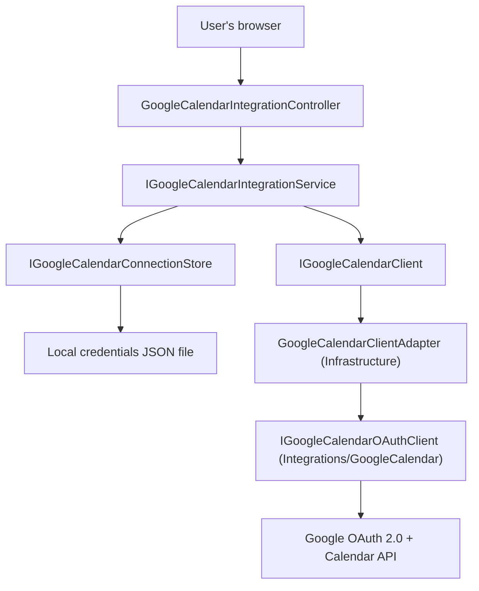

# F01. Google Calendar Account Connection — Technical Specification

## 1. Technical Overview

**What:** A first-of-its-kind interactive Google OAuth 2.0 authorization-code flow, letting the single user connect one Google account, on successful consent creating a dedicated "Financial - Credit Card Due Dates" calendar, and persisting the connection (tokens, calendar id, account email, connected-at timestamp) to a local JSON credentials file separate from `data-cashflow.json`. Exposes connection status, disconnect, and transparent access-token refresh. This feature is connection management only — it creates no calendar events; F02 (Credit-Card Due-Date Event Sync) is the only consumer of the dedicated calendar this feature creates.

**Why:** Every existing Google integration in this codebase (`Integrations/GoogleDrive`, `Integrations/GoogleSheets`) authenticates as a service account via `GoogleCredential.FromStream` on a pre-provisioned key file — there is no browser-consent flow, no callback endpoint, and no refresh-token handling anywhere in the repo. Calendar events must appear on the user's own Google Calendar, which requires acting as that user, so this feature introduces the codebase's first authorization-code-flow + callback + refresh-token lifecycle. It follows the existing `Integrations/<Name>` SDK-isolation convention (vendor SDK types never leak past that project's boundary) and the existing per-context `<Context>:<Provider>:<Key>` configuration convention (`CashFlow:GoogleDrive:CredentialsPath` → `CashFlow:GoogleCalendar:*`).

**Scope:**
- Included: OAuth authorize/callback/token-exchange, dedicated calendar creation, local credentials file persistence, `GET /status`, disconnect (calendar delete + token revoke + local file delete), transparent access-token refresh, reconnect-replaces-previous-connection, revoked-refresh-token detection surfaced via `/status`.
- Excluded (F02/F03/F04 scope): calendar event creation/update/deletion for credit cards, per-card sync status, any UI (Web/WPF Integrations Settings page) — F01 only ships the API. The Web/WPF pages calling this API are out of scope here.

## 2. Architecture Impact

**Affected components:**
- `Integrations/GoogleCalendar/` (new project) — generic Google OAuth + Calendar SDK wrapper, no CashFlow types, mirrors `Integrations/GoogleDrive`'s isolation.
- `Financial.CashFlow.Application/` — new interfaces (`IGoogleCalendarClient`, `IGoogleCalendarConnectionStore`, `IGoogleCalendarIntegrationService`), DTOs, a connection model, configuration options, and `GoogleCalendarIntegrationService` (orchestration + business rules).
- `Financial.CashFlow.Infrastructure/` — `GoogleCalendarConnectionStore` (local JSON file I/O) and `GoogleCalendarClientAdapter` (translates Application's generic interface into calls against the Integrations project, injecting configured client id/secret/redirect URI/scope).
- `Financial.Api/` — `GoogleCalendarIntegrationController` (4 endpoints), `Program.cs` DI wiring, `appsettings.json`/`appsettings.Development.json` config placeholders.
- `Financial.slnx` — registers the new `Integrations/GoogleCalendar` project (and its test project).



## 3. Technical Decisions

| Decision | Chosen Approach | Alternative Considered | Trade-off |
|----------|----------------|----------------------|-----------|
| OAuth flow implementation | Hand-built authorization-code flow: construct the consent URL manually (`Google.Apis.Auth.OAuth2.Requests.GoogleAuthorizationCodeRequestUrl`), exchange/refresh via `Google.Apis.Auth.OAuth2.Flows.GoogleAuthorizationCodeFlow`, revoke and userinfo lookup via plain `HttpClient` calls to Google's REST endpoints (no Calendar SDK equivalent exists for either) | `GoogleWebAuthorizationBroker` (the Google.Apis.Auth helper for this exact scenario) | The broker is built around `IDataStore`-based local token caching for CLI/desktop tools launching their own local HTTP listener; it does not fit an ASP.NET Core-hosted callback endpoint. The hand-built flow costs a small amount of extra code but matches how a web server, not a CLI tool, is supposed to do this. |
| Where the OAuth/Calendar abstraction interface lives | `IGoogleCalendarClient` is declared in `Financial.CashFlow.Application.Interfaces`, using only primitive/DTO types; `Financial.CashFlow.Infrastructure`'s `GoogleCalendarClientAdapter` implements it by delegating to `Integrations/GoogleCalendar`'s `IGoogleCalendarOAuthClient` | Let `Financial.CashFlow.Infrastructure` (or even Application) reference `Integrations/GoogleCalendar` directly and skip the adapter | `GoogleDrive`'s equivalent abstraction (`IRemoteFileClient`) lives in `Financial.Shared.Abstractions` because both bounded contexts use it; Calendar is CashFlow-only, so the same shape is reproduced one level down (Application-owned interface) rather than promoted to Shared. Direct reference would leak `Google.Apis.Calendar.v3` types into Application, violating Application's framework-agnostic layer intent. |
| CSRF protection on the OAuth flow | Generate a random URL-safe `state` value per `connect` call, held as one in-memory field (with an expiry) on the singleton `GoogleCalendarIntegrationService`, validated on `callback` | No state validation | Single-user, self-hosted app, but the callback endpoint is unauthenticated by design (Google redirects to it) — an unvalidated callback would accept a token-exchange code from anywhere. In-memory, single-field state storage is enough because only one connect attempt is ever in flight (single browser, single user) — no distributed cache needed. |
| Revoked-refresh-token detection | `GetStatus()` is a local-file read; if the stored access token is expired, it attempts one refresh as part of building the response. A refresh that fails with `invalid_grant` sets a persisted `RevokedReason` field ("token_revoked") on the stored connection and returns `connected:false`; once `RevokedReason` is set, later `GetStatus()` calls skip the refresh attempt entirely | Always attempt a live Calendar API call on every `/status` poll | Both F03 and F04 poll `/status` on window focus, so a live outbound call on every poll would be frequent, slow, and (per the AC) must not "repeatedly retry the same failed call" once revocation is known. Persisting the reason turns repeated polls into a cheap local-file read after the first detection. |
| Credentials file encryption | Plaintext JSON, gitignored, same trust model as `GoogleDrive`'s service-account key file | Encrypt tokens at rest (DPAPI / ASP.NET Data Protection) | No existing local-credentials file in this codebase is encrypted at rest, and the app is explicitly single-user/self-hosted with OS-level file access as the trust boundary. Adding encryption here alone would be an inconsistent, unrequested security posture; documented as an assumption so the user can override. |
| Local-account-email lookup | Direct REST call to `https://www.googleapis.com/oauth2/v2/userinfo` with the access token, via `HttpClient` | Add the `Google.Apis.Oauth2.v2` NuGet package for a typed client | One REST call for one field (`email`) does not justify a whole additional SDK dependency; `HttpClient` is already the established pattern for lightweight Google REST calls not covered by a typed SDK (see `FrankfurterExchangeRateProvider`). |

## 4. Component Overview

**`Integrations/GoogleCalendar` (new project, `Financial.Integrations.GoogleCalendar`):**

| File Path | New/Modified | Purpose | Key Responsibilities |
|-----------|--------------|---------|---------------------|
| `Integrations/GoogleCalendar/GoogleCalendar.csproj` | New | Project definition | References `Google.Apis.Calendar.v3`, `Google.Apis.Auth`, `Microsoft.Extensions.Http`; project-references `GoogleCore` |
| `Integrations/GoogleCalendar/GoogleOAuthTokenResult.cs` | New | Value type | Immutable record: `AccessToken`, `RefreshToken` (nullable), `AccessTokenExpiresAtUtc` |
| `Integrations/GoogleCalendar/IGoogleCalendarOAuthClient.cs` | New | Public abstraction | Declares `BuildAuthorizationUrl`, `ExchangeCodeForTokenAsync`, `RefreshAccessTokenAsync`, `RevokeTokenAsync`, `GetAccountEmailAsync`, `CreateCalendarAsync`, `DeleteCalendarAsync` — all parameters primitive (client id/secret/redirect/scope/tokens as strings), no CashFlow types |
| `Integrations/GoogleCalendar/GoogleCalendarOAuthClient.cs` | New | Implementation | Wraps `GoogleAuthorizationCodeFlow` for exchange/refresh, `CalendarService` (built per-call from the supplied access token) for calendar create/delete wrapped in `GoogleRetryPolicy`, and `HttpClient` for revoke + userinfo |
| `Integrations/GoogleCalendar/GoogleCalendarServiceCollectionExtensions.cs` | New | DI registration | `AddGoogleCalendarOAuthClient()` — registers a typed `HttpClient` and `IGoogleCalendarOAuthClient` |

**`Financial.CashFlow.Application`:**

| File Path | New/Modified | Purpose | Key Responsibilities |
|-----------|--------------|---------|---------------------|
| `Interfaces/IGoogleCalendarClient.cs` | New | Application-facing Calendar/OAuth abstraction | Same operation set as the Integrations interface, but Application-owned so Application never references `Financial.Integrations.GoogleCalendar` |
| `Interfaces/IGoogleCalendarConnectionStore.cs` | New | Persistence abstraction | `Load()`, `Save(GoogleCalendarConnection)`, `Delete()` |
| `Interfaces/IGoogleCalendarIntegrationService.cs` | New | Service contract | `BuildAuthorizationUrl()`, `CompleteConnectionAsync(code, state, error, ct)`, `GetStatus()`, `DisconnectAsync(ct)` |
| `Models/GoogleCalendarConnection.cs` | New | Internal persisted shape | `AccountEmail`, `CalendarId`, `AccessToken`, `RefreshToken`, `AccessTokenExpiresAtUtc`, `ConnectedAtUtc`, `RevokedReason` (nullable) |
| `DTOs/GoogleCalendarConnectionStatusDTO.cs` | New | `/status` response shape | `Connected`, `AccountEmail`, `CalendarName`, `ConnectedAtUtc`, `DisconnectReason` |
| `DTOs/GoogleCalendarCallbackResultDTO.cs` | New | Callback outcome | `Success`, `ErrorMessage` |
| `DTOs/GoogleCalendarDisconnectResultDTO.cs` | New | Disconnect outcome | `RemoteCleanupSucceeded` (drives the one-time "you may need to manually remove..." notice) |
| `Configuration/GoogleCalendarSettingsOptions.cs` | New | Options POCO | `ClientId`, `ClientSecret`, `RedirectUri`, `CredentialsPath` |
| `Services/GoogleCalendarIntegrationService.cs` | New | Orchestration | State generation/validation, connect/replace-previous/disconnect-old-first, calendar creation with token-revoke-on-failure, transparent refresh, revoked-token tombstoning, disconnect-always-clears-local-state |
| `DependencyInjection/CashFlowApplicationServiceCollectionExtensions.cs` | Modified | DI registration | Registers `IGoogleCalendarIntegrationService` as singleton, alongside the existing service list |

**`Financial.CashFlow.Infrastructure`:**

| File Path | New/Modified | Purpose | Key Responsibilities |
|-----------|--------------|---------|---------------------|
| `Configuration/CashFlowGoogleCalendarConfigurationKeys.cs` | New | Config key constants | `ClientId`/`ClientSecret`/`RedirectUri`/`CredentialsPath` → `CashFlow:GoogleCalendar:*` |
| `Persistence/GoogleCalendarConnectionStore.cs` | New | `IGoogleCalendarConnectionStore` impl | Reads/writes the local JSON file at the configured `CredentialsPath` via `System.Text.Json`; `Load()` returns `null` when the file does not exist |
| `Services/GoogleCalendarClientAdapter.cs` | New | `IGoogleCalendarClient` impl | Thin translation layer: reads `GoogleCalendarSettingsOptions` and forwards each call to `IGoogleCalendarOAuthClient` with the configured client id/secret/redirect URI/scope |
| `DependencyInjection/CashFlowInfrastructureServiceCollectionExtensions.cs` | Modified | DI registration | Binds `GoogleCalendarSettingsOptions` from configuration, registers `IGoogleCalendarConnectionStore` and `IGoogleCalendarClient` |
| `Financial.CashFlow.Infrastructure.csproj` | Modified | Project reference | Adds `ProjectReference` to `Integrations/GoogleCalendar/GoogleCalendar.csproj` |

**`Financial.Api`:**

| File Path | New/Modified | Purpose | Key Responsibilities |
|-----------|--------------|---------|---------------------|
| `Controllers/GoogleCalendarIntegrationController.cs` | New | 4 endpoints | `GET status`, `GET connect` (302 redirect to Google), `GET callback` (renders a minimal HTML landing page), `POST disconnect` |
| `Program.cs` | Modified | DI wiring | `using Financial.Integrations.GoogleCalendar;` + `builder.Services.AddGoogleCalendarOAuthClient();` alongside the existing `AddGoogleDriveFileClient()` call |
| `appsettings.json` | Modified | Config placeholders | Adds empty `CashFlow:GoogleCalendar:{ClientId,ClientSecret,RedirectUri,CredentialsPath}`, mirroring the existing `CashFlow:GoogleDrive` block |
| `appsettings.Development.json` | Modified (if it carries a `CashFlow` section) | Local dev config | Same keys, populated only on the dev machine (git-ignored real values follow the existing `scripts/deploy.local.json` pattern for anything beyond placeholders) |
| `Financial.Api.csproj` | Modified | Project reference | Adds `ProjectReference` to `Integrations/GoogleCalendar/GoogleCalendar.csproj` |

**Solution:**

| File Path | New/Modified | Purpose |
|-----------|--------------|---------|
| `Financial.slnx` | Modified | Registers `Integrations/GoogleCalendar/GoogleCalendar.csproj` |

## 5. API Contracts

All routes are relative to `/api/v1/financial/integrations/google-calendar` (via the existing `[Route("integrations/google-calendar")]` + `Program.cs`'s API group prefix).

**Endpoint: Get Connection Status**
- **Method:** GET
- **Path:** `/api/v1/financial/integrations/google-calendar/status`
- **Authentication:** None (matches every other endpoint in this single-user, self-hosted app)

**Response (200):**

| Field | Type | Description |
|-------|------|-------------|
| `connected` | `boolean` | Whether a usable connection currently exists |
| `accountEmail` | `string?` | The connected Google account's email, or `null` |
| `calendarName` | `string?` | The dedicated calendar's display name, or `null` |
| `connectedAtUtc` | `string?` (ISO 8601) | When the connection was established, or `null` |
| `disconnectReason` | `string?` | `null`, or `"token_revoked"` when the refresh token was rejected by Google |

**Response Example:**
```json
{
  "connected": true,
  "accountEmail": "user@gmail.com",
  "calendarName": "Financial - Credit Card Due Dates",
  "connectedAtUtc": "2026-09-01T10:15:00Z",
  "disconnectReason": null
}
```

**Endpoint: Begin Connection**
- **Method:** GET
- **Path:** `/api/v1/financial/integrations/google-calendar/connect`
- **Authentication:** None

**Response (302):** `Location` header set to the Google OAuth consent URL (`accounts.google.com/o/oauth2/v2/auth`, scope `https://www.googleapis.com/auth/calendar`, `access_type=offline`, `prompt=consent`, a freshly generated `state`).

**Endpoint: OAuth Callback**
- **Method:** GET
- **Path:** `/api/v1/financial/integrations/google-calendar/callback`
- **Authentication:** None (this is Google's redirect target)

**Request (query string):**

| Field | Type | Required | Description |
|-------|------|----------|--------------|
| `code` | `string` | On success | Authorization code to exchange |
| `state` | `string` | On success | Must match the value issued by `connect` |
| `error` | `string` | On decline | Present when the user denies consent (e.g. `access_denied`) |

**Response (200, `text/html`):** A minimal self-contained HTML page — "Connected! You can close this tab and return to the app." on success, or "Connection was not completed — please try again." / "Couldn't finish connecting — please try again." on failure. No JSON body; this endpoint is only ever hit by the browser mid-redirect, never by either front end's API client.

**Endpoint: Disconnect**
- **Method:** POST
- **Path:** `/api/v1/financial/integrations/google-calendar/disconnect`
- **Authentication:** None
- **Request:** No body

**Response (200):**

| Field | Type | Description |
|-------|------|-------------|
| `remoteCleanupSucceeded` | `boolean` | `false` when the calendar-delete or token-revoke call to Google failed even though local state was still cleared |

**Response Example:**
```json
{ "remoteCleanupSucceeded": true }
```

**Error Codes (all endpoints):** No new domain exception types. Malformed/missing callback state or code are handled inline as a failed connection (rendered in the callback HTML page, not a 4xx), since Google itself is the caller. `status` and `disconnect` return their DTOs unconditionally (disconnect is idempotent when nothing is connected).

## 6. Data Model

No relational/JSON-document schema changes to `data-cashflow.json` — this feature's state lives entirely in its own local file, not the CashFlow repository.

**Credentials file** (path from `CashFlow:GoogleCalendar:CredentialsPath`, JSON, `System.Text.Json`, gitignored — already covered by the existing `/data/*` `.gitignore` rule when placed under `data/`):

| Field | Type | Description |
|-------|------|-------------|
| `accountEmail` | `string` | Connected Google account's email |
| `calendarId` | `string` | The dedicated calendar's Google-assigned id |
| `accessToken` | `string` | Current OAuth access token |
| `refreshToken` | `string` | OAuth refresh token (only re-issued by Google when `prompt=consent` is used, which `connect` always sets) |
| `accessTokenExpiresAtUtc` | `string` (ISO 8601) | Drives the transparent-refresh check |
| `connectedAtUtc` | `string` (ISO 8601) | Set once, at successful connection |
| `revokedReason` | `string?` | `null` normally; set to `"token_revoked"` once a refresh attempt fails with `invalid_grant`, so later status checks stop retrying |

This file does not yet contain a credit-card → event-id mapping; F02 extends this same file with that mapping, additive to the fields above.

**Example:**
```json
{
  "accountEmail": "user@gmail.com",
  "calendarId": "abc123@group.calendar.google.com",
  "accessToken": "ya29....",
  "refreshToken": "1//0g....",
  "accessTokenExpiresAtUtc": "2026-09-07T12:00:00Z",
  "connectedAtUtc": "2026-09-01T10:15:00Z",
  "revokedReason": null
}
```

## 7. Testing Strategy

| Test File | Test Type | Target | Coverage Goal |
|-----------|-----------|--------|---------------|
| `Tests/Financial.GoogleIntegrations.Tests/GoogleCalendarOAuthClientTests.cs` | Unit | `GoogleCalendarOAuthClient.BuildAuthorizationUrl` | Correct query parameters (`client_id`, `redirect_uri`, `scope`, `state`, `access_type=offline`, `prompt=consent`) |
| `Tests/Financial.GoogleIntegrations.Tests/GoogleCalendarServiceCollectionExtensionsTests.cs` | Unit | `AddGoogleCalendarOAuthClient` | `IGoogleCalendarOAuthClient` resolves from the container (same style as `GoogleDriveServiceCollectionExtensionsTests`) |
| `Tests/Financial.CashFlow.Application.Tests/Services/GoogleCalendarIntegrationServiceTests.cs` | Unit | `GoogleCalendarIntegrationService`, against hand-rolled fakes of `IGoogleCalendarClient`/`IGoogleCalendarConnectionStore` (no mocking library, matching this codebase's existing Google-integration test style) | AC-tracing: successful connect creates the calendar and persists the connection; declined consent (`error` present) persists nothing; calendar-creation failure revokes the just-issued token and persists nothing; connecting while already connected deletes/revokes the previous connection first; an expired access token is refreshed before use; a refresh rejected with `invalid_grant` sets `RevokedReason` and a second `GetStatus()` call does not attempt another refresh; `DisconnectAsync` always clears local state even when the remote calendar-delete/token-revoke calls throw; a `state` mismatch or expiry on callback is treated as a failed connection without attempting a code exchange |
| `Tests/Financial.CashFlow.Infrastructure.Tests/Persistence/GoogleCalendarConnectionStoreTests.cs` | Unit | `GoogleCalendarConnectionStore` | Save/Load round-trip against a temp file path; `Load()` returns `null` when the file does not exist; `Delete()` removes the file |
| `Tests/Financial.CashFlow.Infrastructure.Tests/Services/GoogleCalendarClientAdapterTests.cs` | Unit | `GoogleCalendarClientAdapter`, against a hand-rolled fake of `IGoogleCalendarOAuthClient` | Configured `ClientId`/`ClientSecret`/`RedirectUri`/scope are forwarded on every call |
| `Tests/Financial.CashFlow.Infrastructure.Tests/DependencyInjection/CashFlowInfrastructureServiceCollectionExtensionsTests.cs` | Unit | DI wiring | `IGoogleCalendarConnectionStore` and `IGoogleCalendarClient` resolve from the container (extend the existing test file if present, else create it following the same pattern as the Google integrations DI test) |
| `Tests/Financial.Api.Tests/GoogleCalendarIntegrationEndpointsTests.cs` | Integration (`ApiTestFactory`, `IGoogleCalendarIntegrationService` swapped for a fake via the same `ConfigureTestServices`/`RemoveAll` pattern already used for `IExchangeRateProvider`) | All 4 endpoints | `status` returns the fake's DTO; `connect` returns a 302 with the fake's URL as `Location`; `callback` with `error` set renders the failure HTML with a 200; `callback` with `code`/`state` renders the success HTML; `disconnect` returns the fake's result DTO |
| `Tests/Financial.Api.Tests/Contract/openapi-v1.snapshot.json` | Contract | OpenAPI document | Regenerated per the project's `UPDATE_OPENAPI_SNAPSHOT=1` process once the controller ships; `OpenApiContractTests` pins the new endpoints |

No test targets live network calls to Google — every test above either exercises pure logic (URL building, state validation, JSON round-trip) or substitutes a hand-rolled fake at the `IGoogleCalendarClient`/`IGoogleCalendarOAuthClient`/`IGoogleCalendarIntegrationService` boundary, consistent with this codebase's existing "test the wiring, not the live SDK" convention for Google integrations.
