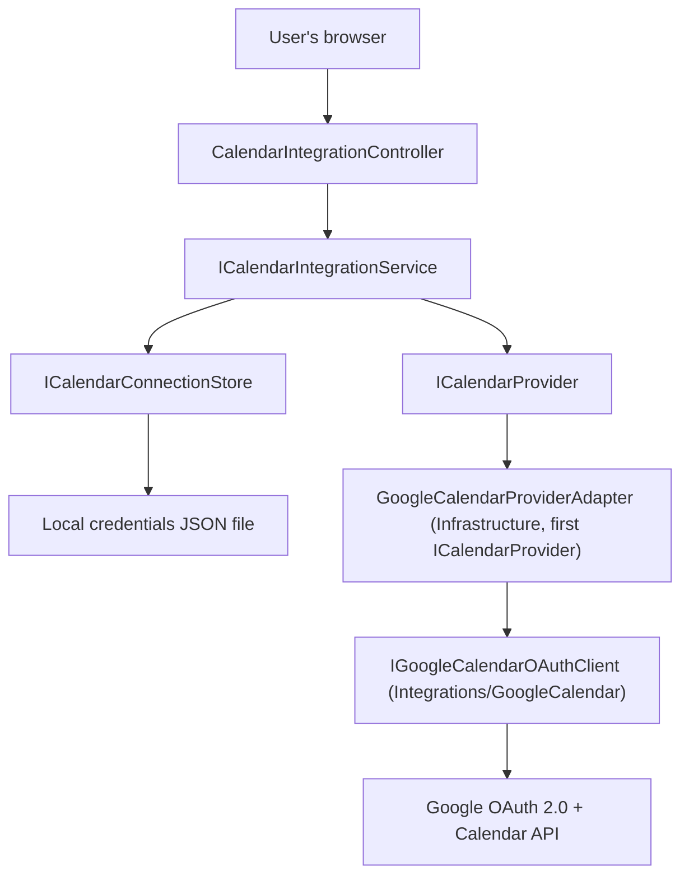

# F01. Google Calendar Account Connection — Technical Specification

## 1. Technical Overview

**What:** A calendar-integration capability, defined in `Financial.CashFlow.Application` behind a provider-agnostic `ICalendarProvider`/`ICalendarConnectionStore` abstraction, with Google Calendar wired in as its first (and currently only) concrete implementation. Connects one Google account via the codebase's first interactive OAuth 2.0 authorization-code flow, creates a dedicated "Financial - Credit Card Due Dates" calendar on success, and persists the connection (tokens, calendar id, account email, connected-at timestamp) to a local JSON credentials file separate from `data-cashflow.json`. Exposes connection status, disconnect, and transparent access-token refresh. Connection management only — it creates no calendar events; F02 (Credit-Card Due-Date Event Sync) is the only consumer of the dedicated calendar this feature creates.

**Why:** The Application layer must not need to change if a second calendar provider is ever added, and must not know Google-specific concepts (client id/secret, OAuth scope strings, the Google Calendar SDK). So the feature is split at the Application boundary: `Financial.CashFlow.Application` declares the *standard* calendar contract (`ICalendarProvider`: authorize/exchange/refresh/revoke/lookup-account/create-calendar/delete-calendar, all in primitive types) and the orchestration service (`CalendarIntegrationService`) that owns the connection lifecycle rules against that contract alone. `Financial.CashFlow.Infrastructure` supplies the only concrete implementation today, `GoogleCalendarProviderAdapter`, which is where "this is Google" first becomes true — it translates the generic contract into calls against `Integrations/GoogleCalendar`, and owns the Google-specific settings (`GoogleCalendarSettingsOptions`: client id/secret/redirect URI). `Integrations/GoogleCalendar` itself is the actual vendor-SDK boundary (mirrors `Integrations/GoogleDrive`'s isolation) and is unchanged by this decision — it was already generic OAuth/Calendar plumbing with no bounded-context types. Adding a second provider later means writing one new Infrastructure adapter + Integrations project and pointing DI at it; Application and the API controller do not change.

**Scope:**
- Included: `ICalendarProvider` / `ICalendarConnectionStore` / `ICalendarIntegrationService` (Application, provider-agnostic), `CalendarIntegrationService` (orchestration), `GoogleCalendarProviderAdapter` (Infrastructure, the Google implementation), OAuth authorize/callback/token-exchange, dedicated calendar creation, local credentials file persistence, `GET /status`, disconnect (calendar delete + token revoke + local file delete), transparent access-token refresh, reconnect-replaces-previous-connection, revoked-refresh-token detection surfaced via `/status`.
- Excluded (F02/F03/F04 scope): calendar event creation/update/deletion for credit cards, per-card sync status, any UI (Web/WPF Integrations Settings page) — F01 only ships the API. A second calendar provider implementation is out of scope — only the seam is built now.

## 2. Architecture Impact

**Affected components:**
- `Integrations/GoogleCalendar/` (new project) — generic Google OAuth + Calendar SDK wrapper, no CashFlow types.
- `Financial.CashFlow.Application/` — the provider-agnostic contract (`ICalendarProvider`, `ICalendarConnectionStore`, `ICalendarIntegrationService`), a connection model and token result (no provider name in either), DTOs, and `CalendarIntegrationService` (all business rules, zero Google awareness).
- `Financial.CashFlow.Infrastructure/` — `GoogleCalendarProviderAdapter` (the first `ICalendarProvider` implementation, owns everything Google-specific: client id/secret/redirect/scope) and `CalendarConnectionStore` (local JSON file I/O — provider-agnostic, since the file just holds whichever connection is active).
- `Financial.Api/` — `CalendarIntegrationController` (4 endpoints, depends only on `ICalendarIntegrationService`), `Program.cs` DI wiring, `appsettings.json`/`appsettings.Development.json` config placeholders. The controller and its `integrations/calendar` route are provider-agnostic too, not just Application: the controller carries no Google-specific code, and the OAuth redirect URI is a configured value (`CashFlow:GoogleCalendar:RedirectUri`), not derived from the route name, so nothing forces the route to say "google."
- `Financial.slnx` — registers the new `Integrations/GoogleCalendar` project (and its test project).

## 3. Technical Decisions

| Decision | Chosen Approach | Alternative Considered | Trade-off |
|----------|----------------|----------------------|-----------|
| Application-Google coupling | `Financial.CashFlow.Application` declares a fully provider-agnostic `ICalendarProvider`/`ICalendarConnectionStore`/`ICalendarIntegrationService` contract and orchestration service; nothing in Application is named "Google," references `Integrations/GoogleCalendar`, or knows about OAuth client id/secret/scope. `Financial.CashFlow.Infrastructure`'s `GoogleCalendarProviderAdapter` is the sole, swappable implementation, and is where `GoogleCalendarSettingsOptions` (client id/secret/redirect URI) lives | Name the Application interface/service after Google directly (the initial approach) | An initial pass put `IGoogleCalendarClient`/`GoogleCalendarIntegrationService`/`GoogleCalendarSettingsOptions` in Application. Corrected: Application must stay swappable to a second calendar provider without change; only Infrastructure is allowed to know which concrete provider is wired in today. |
| OAuth flow implementation | Hand-built authorization-code flow inside `Integrations/GoogleCalendar`: construct the consent URL manually (`Google.Apis.Auth.OAuth2.Requests.GoogleAuthorizationCodeRequestUrl`), exchange/refresh via `Google.Apis.Auth.OAuth2.Flows.GoogleAuthorizationCodeFlow`, revoke and userinfo lookup via plain `HttpClient` calls to Google's REST endpoints (no Calendar SDK equivalent exists for either) | `GoogleWebAuthorizationBroker` (the Google.Apis.Auth helper for this exact scenario) | The broker is built around `IDataStore`-based local token caching for CLI/desktop tools launching their own local HTTP listener; it does not fit an ASP.NET Core-hosted callback endpoint. |
| Where the OAuth "connect" orchestration (CSRF state issuance/validation, callback handling, replace-previous-connection) lives | In Application's `CalendarIntegrationService`, expressed entirely in terms of `ICalendarProvider`'s generic operations | Push state/callback handling into `Integrations/GoogleCalendar` too | State-based CSRF protection and "what happens when a connect callback arrives" are generic OAuth-authorization-code-flow concerns, not Google-specific ones — any future provider using the same flow shape reuses this orchestration unchanged. Only the raw HTTP/SDK mechanics (building Google's specific consent URL, calling Google's specific token/revoke/userinfo endpoints) are provider-specific and stay in Integrations + the Infrastructure adapter. |
| CSRF protection on the OAuth flow | Generate a random URL-safe `state` value per `connect` call, held as one in-memory field (with an expiry) on the singleton `CalendarIntegrationService`, validated on `callback` | No state validation | Single-user, self-hosted app, but the callback endpoint is unauthenticated by design (the provider redirects to it) — an unvalidated callback would accept a token-exchange code from anywhere. |
| Revoked-refresh-token detection | `GetStatusAsync()` is a local-file read; if the stored access token is expired, it attempts one refresh as part of building the response. A refresh that fails (via `CalendarTokenRevokedException`, an Application-level exception the adapter throws by translating the Integrations layer's Google-specific `GoogleTokenRevokedException`) sets a persisted `RevokedReason` field on the stored connection and returns `connected:false`; once set, later `GetStatusAsync()` calls skip the refresh attempt entirely | Always attempt a live Calendar API call on every `/status` poll | Both F03 and F04 poll `/status` on window focus; persisting the reason turns repeated polls into a cheap local-file read after the first detection. |
| Credentials file encryption | Plaintext JSON, gitignored, same trust model as `GoogleDrive`'s service-account key file | Encrypt tokens at rest | No existing local-credentials file in this codebase is encrypted at rest, and the app is explicitly single-user/self-hosted with OS-level file access as the trust boundary. |
| Local-account-email lookup | Direct REST call to `https://www.googleapis.com/oauth2/v2/userinfo` with the access token, via `HttpClient`, inside `Integrations/GoogleCalendar` | Add the `Google.Apis.Oauth2.v2` NuGet package for a typed client | One REST call for one field does not justify a whole additional SDK dependency. |

## 4. Component Overview

**`Integrations/GoogleCalendar` (new project, `Financial.Integrations.GoogleCalendar`) — unchanged by the Application/Infrastructure correction, already isolated:**

| File Path | New/Modified | Purpose | Key Responsibilities |
|-----------|--------------|---------|---------------------|
| `Integrations/GoogleCalendar/GoogleCalendar.csproj` | New | Project definition | References `Google.Apis.Calendar.v3`, `Google.Apis.Auth`; project-references `GoogleCore` |
| `Integrations/GoogleCalendar/GoogleOAuthTokenResult.cs` | New | Value type | `AccessToken`, `RefreshToken` (nullable), `AccessTokenExpiresAtUtc` |
| `Integrations/GoogleCalendar/IGoogleCalendarOAuthClient.cs` | New | Public abstraction | `BuildAuthorizationUrl`, `ExchangeCodeForTokenAsync`, `RefreshAccessTokenAsync`, `RevokeTokenAsync`, `GetAccountEmailAsync`, `CreateCalendarAsync`, `DeleteCalendarAsync` — all parameters primitive, no CashFlow types |
| `Integrations/GoogleCalendar/GoogleCalendarOAuthClient.cs` | New | Implementation | `GoogleAuthorizationCodeFlow` for exchange/refresh, `CalendarService` (via `GoogleCredential.FromAccessToken`) for calendar create/delete wrapped in `GoogleRetryPolicy`, `HttpClient` for revoke + userinfo |
| `Integrations/GoogleCalendar/GoogleTokenRevokedException.cs` | New | Vendor-level signal | Thrown on Google's `invalid_grant`; translated at the Infrastructure boundary into Application's `CalendarTokenRevokedException` |
| `Integrations/GoogleCalendar/GoogleCalendarServiceCollectionExtensions.cs` | New | DI registration | `AddGoogleCalendarOAuthClient()` |

**`Financial.CashFlow.Application` — provider-agnostic, no "Google" anywhere:**

| File Path | New/Modified | Purpose | Key Responsibilities |
|-----------|--------------|---------|---------------------|
| `Interfaces/ICalendarProvider.cs` | New | The standard calendar contract | `BuildAuthorizationUrl`, `ExchangeCodeForTokenAsync`, `RefreshAccessTokenAsync`, `RevokeTokenAsync`, `GetAccountEmailAsync`, `CreateCalendarAsync`, `DeleteCalendarAsync` — implemented by exactly one adapter today (`GoogleCalendarProviderAdapter`), by design swappable |
| `Interfaces/ICalendarConnectionStore.cs` | New | Persistence abstraction | `Load()`, `Save(CalendarConnection)`, `Delete()` |
| `Interfaces/ICalendarIntegrationService.cs` | New | Service contract | `BuildAuthorizationUrl()`, `CompleteConnectionAsync(code, state, error, ct)`, `GetStatusAsync(ct)`, `DisconnectAsync(ct)` |
| `Models/CalendarConnection.cs` | New | Internal persisted shape | `AccountEmail`, `CalendarId`, `AccessToken`, `RefreshToken`, `AccessTokenExpiresAtUtc`, `ConnectedAtUtc`, `RevokedReason` (nullable) |
| `Models/CalendarTokenResult.cs` | New | OAuth exchange/refresh result | `AccessToken`, `RefreshToken` (nullable), `AccessTokenExpiresAtUtc` |
| `DTOs/CalendarConnectionStatusDTO.cs` | New | `/status` response shape | `Connected`, `AccountEmail`, `CalendarName`, `ConnectedAtUtc`, `DisconnectReason` |
| `DTOs/CalendarCallbackResultDTO.cs` | New | Callback outcome | `Success`, `ErrorMessage` |
| `DTOs/CalendarDisconnectResultDTO.cs` | New | Disconnect outcome | `RemoteCleanupSucceeded` |
| `Exceptions/CalendarTokenRevokedException.cs` | New | Generic OAuth signal | Thrown by `ICalendarProvider.RefreshAccessTokenAsync` when the provider rejects the refresh token; provider-agnostic name since token revocation is a generic OAuth outcome |
| `Services/CalendarIntegrationService.cs` | New | Orchestration | State generation/validation, connect/replace-previous/disconnect-old-first, calendar creation with token-revoke-on-failure, transparent refresh, revoked-token tombstoning, disconnect-always-clears-local-state — expressed entirely against `ICalendarProvider`/`ICalendarConnectionStore` |
| `DependencyInjection/CashFlowApplicationServiceCollectionExtensions.cs` | Modified | DI registration | Registers `ICalendarIntegrationService` → `CalendarIntegrationService` |

**`Financial.CashFlow.Infrastructure` — where "it's Google" becomes concrete:**

| File Path | New/Modified | Purpose | Key Responsibilities |
|-----------|--------------|---------|---------------------|
| `Configuration/CashFlowGoogleCalendarConfigurationKeys.cs` | New | Config key constants | `ClientId`/`ClientSecret`/`RedirectUri`/`CredentialsPath` → `CashFlow:GoogleCalendar:*` |
| `Configuration/GoogleCalendarSettingsOptions.cs` | New | Options POCO | `ClientId`, `ClientSecret`, `RedirectUri`, `CredentialsPath` — lives here, not in Application, because these are Google-specific; a second provider would bring its own settings type |
| `Persistence/CalendarConnectionStore.cs` | New | `ICalendarConnectionStore` impl | Reads/writes the local JSON file at the configured `CredentialsPath`; provider-agnostic (just persists whichever `CalendarConnection` is active) |
| `Services/GoogleCalendarProviderAdapter.cs` | New | `ICalendarProvider` impl — the first integration | Reads `GoogleCalendarSettingsOptions` and forwards each call to `Integrations/GoogleCalendar`'s `IGoogleCalendarOAuthClient` with the configured client id/secret/redirect URI/Calendar scope; translates `GoogleTokenRevokedException` into `CalendarTokenRevokedException` |
| `DependencyInjection/CashFlowInfrastructureServiceCollectionExtensions.cs` | Modified | DI registration | Binds `GoogleCalendarSettingsOptions`, registers `ICalendarConnectionStore` → `CalendarConnectionStore` and `ICalendarProvider` → `GoogleCalendarProviderAdapter` |
| `Financial.CashFlow.Infrastructure.csproj` | Modified | Project reference | Adds `ProjectReference` to `Integrations/GoogleCalendar/GoogleCalendar.csproj` |

**`Financial.Api`:**

| File Path | New/Modified | Purpose | Key Responsibilities |
|-----------|--------------|---------|---------------------|
| `Controllers/CalendarIntegrationController.cs` | New | 4 endpoints | `GET status`, `GET connect` (302 redirect), `GET callback` (minimal HTML landing page), `POST disconnect` — depends only on `ICalendarIntegrationService` |
| `Program.cs` | Modified | DI wiring | `builder.Services.AddGoogleCalendarOAuthClient();` alongside `AddGoogleDriveFileClient()` |
| `appsettings.json` / `appsettings.Development.json` | Modified | Config placeholders | `CashFlow:GoogleCalendar:{ClientId,ClientSecret,RedirectUri,CredentialsPath}` |
| `Financial.Api.csproj` | Modified | Project reference | Adds `ProjectReference` to `Integrations/GoogleCalendar/GoogleCalendar.csproj` |

**Solution:** `Financial.slnx` registers `Integrations/GoogleCalendar/GoogleCalendar.csproj`.

## 5. API Contracts

All routes relative to `/api/v1/financial/integrations/calendar` — provider-agnostic, matching the controller.

**`GET /status`** → `CalendarConnectionStatusDTO { connected, accountEmail?, calendarName?, connectedAtUtc?, disconnectReason? }`.

**`GET /connect`** → 302 to the provider's consent URL.

**`GET /callback`** (query: `code`, `state`, `error`) → 200 `text/html`, a minimal landing page; never called by either front end's API client.

**`POST /disconnect`** (no body) → `CalendarDisconnectResultDTO { remoteCleanupSucceeded }`.

No new domain exception types beyond `CalendarTokenRevokedException` (internal, never reaches the controller — `CalendarIntegrationService` catches it).

## 6. Data Model

No `data-cashflow.json` schema changes — this feature's state lives in its own local file.

**Credentials file** (path from `CashFlow:GoogleCalendar:CredentialsPath`, JSON, gitignored via the existing `/data/*` rule):

| Field | Type | Description |
|-------|------|-------------|
| `accountEmail` | `string` | Connected account's email |
| `calendarId` | `string` | The dedicated calendar's provider-assigned id |
| `accessToken` | `string` | Current OAuth access token |
| `refreshToken` | `string` | OAuth refresh token |
| `accessTokenExpiresAtUtc` | `string` (ISO 8601) | Drives the transparent-refresh check |
| `connectedAtUtc` | `string` (ISO 8601) | Set once, at successful connection |
| `revokedReason` | `string?` | `null` normally; set to `"token_revoked"` once a refresh fails |

This file is itself provider-agnostic in shape (`CalendarConnection`, not `GoogleCalendarConnection`) even though today it only ever holds a Google connection. F02 extends this same file, additively, with a credit-card → event-id mapping.

## 7. Testing Strategy

| Test File | Test Type | Target | Coverage Goal |
|-----------|-----------|--------|---------------|
| `Tests/Financial.GoogleIntegrations.Tests/GoogleCalendarOAuthClientTests.cs` | Unit | `GoogleCalendarOAuthClient.BuildAuthorizationUrl` | Correct query parameters |
| `Tests/Financial.GoogleIntegrations.Tests/GoogleCalendarServiceCollectionExtensionsTests.cs` | Unit | `AddGoogleCalendarOAuthClient` | DI resolution |
| `Tests/Financial.CashFlow.Application.Tests/Services/CalendarIntegrationServiceTests.cs` | Unit | `CalendarIntegrationService`, against a hand-rolled `FakeCalendarProvider`/`FakeCalendarConnectionStore` (no mocking library) | Same AC-tracing scenarios as before, now proven entirely against the generic contract |
| `Tests/Financial.CashFlow.Infrastructure.Tests/Persistence/CalendarConnectionStoreTests.cs` | Unit | `CalendarConnectionStore` | Save/Load round-trip, missing-file, delete |
| `Tests/Financial.CashFlow.Infrastructure.Tests/Services/GoogleCalendarProviderAdapterTests.cs` | Unit | `GoogleCalendarProviderAdapter`, against a hand-rolled fake of `IGoogleCalendarOAuthClient` | Configured client id/secret/redirect/scope forwarded; empty-string config treated as unconfigured; revoked-token translation |
| `Tests/Financial.CashFlow.Infrastructure.Tests/DependencyInjection/CashFlowInfrastructureServiceCollectionExtensionsTests.cs` | Unit | DI wiring | `ICalendarConnectionStore`/`ICalendarProvider` resolve |
| `Tests/Financial.Api.Tests/Acceptance/P45F01GoogleCalendarAccountConnectionAcceptanceTests.cs` | Integration (AC-tracing) | All 4 endpoints via `ApiEndpointTests`, real service/store, only `ICalendarProvider` faked | One `[Trait("AC", …)]` test per §9 criterion |
| `Tests/Financial.Api.Tests/Controllers/ControllerGuardClauseTests.cs` | Unit | Controller constructor null-guard | Extended with `CalendarIntegrationController_NullService_Throws` |
| `Tests/Financial.Architecture.Tests/CashFlowDependencyRuleTests.cs` | Integration (architecture rule) | `Application_Should_Not_Reference_GoogleCalendar_Integration` | Pins that `Financial.CashFlow.Application` never references `Financial.Integrations.GoogleCalendar` — the mechanical enforcement of this spec's core decision |
| `Tests/Financial.Api.Tests/Contract/openapi-v1.snapshot.json` | Contract | OpenAPI document | Regenerated once the controller ships |

No test targets live network calls to Google.
