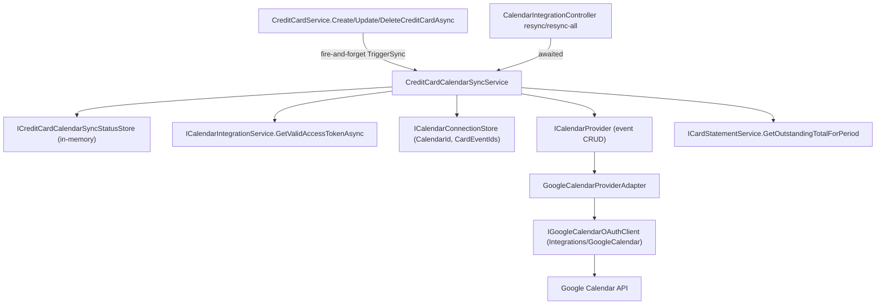

# F02. Credit-Card Due-Date Event Sync — Technical Specification

## 1. Technical Overview

**What:** Whenever a credit card is saved with `IsActive = true` and a non-null `NextInvoiceDueDate`, the app syncs a single persistent all-day Google Calendar event for that card - created on first sync, updated in place on every later sync - showing the card name and the current period's outstanding balance, with a fixed 1-day-before popup reminder. The event is removed when the due date is cleared, the card is deactivated, or the card is deleted. Sync runs in the background, off the triggering save's request path; a per-card status (`pending`/`synced`/`error`) is tracked so F03/F04 can show it, and a manual per-card/all-cards retry is exposed via two new endpoints. If the dedicated calendar itself was deleted outside the app, the next sync attempt recreates it and re-syncs every active card.

**Why:** F01 built the connection (OAuth, dedicated calendar, token lifecycle) behind `ICalendarProvider`/`ICalendarConnectionStore`/`ICalendarIntegrationService` - all provider-agnostic. F02 is the first feature to actually use that connection for its real purpose (calendar events), so it extends `ICalendarProvider` with event CRUD (still provider-agnostic - event create/update/delete are standard calendar operations, not Google-specific) and reuses F01's token-refresh/connection-management machinery rather than duplicating it. `CreditCardService` has no existing event/notification mechanism (confirmed: no domain events, no pub/sub, no observer interface anywhere in `Financial.CashFlow.Application`), so triggering sync requires directly calling a new sync-trigger dependency after each of `CreditCardService`'s three save methods succeeds - this is the first Application-layer fire-and-forget trigger in the codebase.

**Scope:**
- Included: event CRUD on `ICalendarProvider`, the `CreditCardId → event ID` mapping (extends `CalendarConnection`), a per-card in-memory sync-status store, the sync orchestration service (trigger + manual resync + resync-all + self-healing calendar recreation), wiring the trigger into `CreditCardService`, the two resync endpoints plus a sync-status list endpoint, extending `CardStatementService` with a period-based outstanding-total lookup that doesn't require an existing `CardStatement` row.
- Excluded (F03/F04 scope): any UI. F02 ships API-only; its outcomes are observable only through the calendar events themselves and the new endpoints.

## 2. Architecture Impact

**Affected components:**
- `Integrations/GoogleCalendar/` - adds event create/update/delete to the existing OAuth+Calendar client, plus a new "calendar not found" (404) signal.
- `Financial.CashFlow.Application/` - extends `ICalendarProvider` (event ops) and `CalendarConnection` (event-ID mapping); adds the per-card sync-status model/store and the `CreditCardCalendarSyncService` orchestrator; extends `ICalendarIntegrationService` with a token-access method the sync service reuses; extends `ICardStatementService` with a period-based outstanding-total lookup; wires the sync trigger into `CreditCardService`.
- `Financial.CashFlow.Infrastructure/` - extends `GoogleCalendarProviderAdapter` with the three new event operations and their 404 translation.
- `Financial.Api/` - extends `CalendarIntegrationController` with `POST .../credit-cards/{id}/resync`, `POST .../resync-all`, `GET .../credit-cards/sync-status`.



## 3. Technical Decisions

| Decision | Chosen Approach | Alternative Considered | Trade-off |
|----------|----------------|----------------------|-----------|
| Balance formatting in the event | Plain `N2` decimal, no currency symbol (e.g. `"1,234.56"`) - confirmed with the user | A currency symbol per the PRD's original wording | The PRD's "same currency symbol... the app already uses" doesn't correspond to anything real: no currency symbol appears anywhere in Web/WPF, and `CreditCard`/`CardStatement` carry no currency at all (the `Currency` enum is BRL/GBP but is used exclusively by the unrelated Controle Mãe ledger). Matching the app's actual convention (plain number) rather than inventing a new one. |
| Long-format due date in the event description | `dueDate.ToString("d MMMM yyyy", CultureInfo.InvariantCulture)` (e.g. `"10 September 2026"`) | `CultureInfo.CurrentCulture` | No existing helper formats a long textual date anywhere in the codebase (WPF uses short numeric dates via `CultureInfo.CurrentCulture`; Web hardcodes `en-GB` only for month+year). `InvariantCulture` keeps the event's wording identical regardless of the server's OS locale (Docker/CI), and matches the PRD's literal English example. |
| Triggering sync from `CreditCardService` | Direct dependency: inject `ICreditCardCalendarSyncService` into `CreditCardService`, call `.TriggerSync(id)` (fire-and-forget, never throws) right after each of `Create/Update/DeleteCreditCardAsync`'s `_repository.ApplyAndSaveAsync(...)` call succeeds | A domain-event/pub-sub mechanism | Confirmed no event/notification seam exists anywhere in `Financial.CashFlow.Application` today; introducing a generic event bus for this one caller would be over-engineering for a single-user app. Direct injection is the smallest change that satisfies "sync failures never block, delay, or roll back the triggering save." |
| Fire-and-forget shape | `TriggerSync` synchronously marks the card `Pending` in the status store, then dispatches `_ = Task.Run(() => SyncCoreAsync(id, CancellationToken.None))` with all exceptions caught inside the task (logged, turned into an `Error` status) - `TriggerSync` itself never throws or returns a `Task` the caller could accidentally await-and-block on | An awaited call with a background queue/worker | No existing background-queue infrastructure exists in this codebase; the closest precedent is `Financial.App`'s `AssetDetailsViewModel.FetchRowPricesAsync` (unawaited `Task.Run` with internal try/catch), generalized here to the Application layer since nothing closer exists (confirmed via repo-wide `Task.Run(` search: zero hits in `Financial.CashFlow.Application`/`Infrastructure` today). |
| "No charges posted yet" detection | `ICardStatementService.GetOutstandingTotalForPeriod` returns `(decimal Total, bool HasChargesPosted)` - `HasChargesPosted` is `false` when zero `CreditCardCharge` expenses matched that card+year+month, independent of whether the sum happens to be zero | Treat `Total == 0` as "no charges" | A period could theoretically have expenses summing to exactly zero (a charge fully offset by a correction); the PRD's condition is "no charges posted", not "balance is zero" - these are different facts, so the method reports both. |
| Per-card sync status persistence | In-memory only (`ConcurrentDictionary<Guid, CreditCardCalendarSyncStatus>` behind a singleton store), not written to the credentials file or `data-cashflow.json` | Persist to the same credentials file F01/F02 already use for the connection + event-ID mapping | Sync status is operational/observability state ("is the last attempt still in flight, did it fail"), not business data - it doesn't need to survive a restart, and every card's status naturally resets to unknown/re-derivable on the next save or manual resync. Reusing `Financial.Shared.Abstractions.Sync.ISyncStatusProvider` was considered and rejected: it returns exactly one `SyncStatus` per provider (no key), it's the shape for "is this JSON document dirty", and extending it to accept a key would be a breaking change to a shared abstraction two other repositories already depend on. A fresh, purpose-built store matches the project's "reuse the shape, not the single-document-specific interface" precedent. |
| Where the `CreditCardId → event ID` mapping lives | Added as a new required field on `Models/CalendarConnection.cs` (`IReadOnlyDictionary<Guid, string> CardEventIds`), persisted by the existing `ICalendarConnectionStore` | A second local file, or a field on the `CreditCard` domain entity | The PRD is explicit: "inside the same local credentials file used by F01 (not on the `CreditCard` domain entity)". Extending the existing record keeps one file, one store, one read/write path. |
| Self-healing (dedicated calendar deleted externally) | The event Create/Update methods on `IGoogleCalendarOAuthClient` catch Google's 404 and throw a new `GoogleCalendarNotFoundException`, translated by `GoogleCalendarProviderAdapter` into Application's `CalendarNotFoundException`. `CreditCardCalendarSyncService` catches it once, creates a new calendar, clears `CardEventIds`, persists the connection, then re-runs sync for every active card with a due date | A separate scheduled/explicit "check calendar exists" call | Detecting 404 exactly where it naturally occurs (the first event call against the now-missing calendar) needs no extra API call and matches the PRD's "the next sync attempt detects the 404" wording precisely. |
| Manual resync endpoints, sync vs. async | Both `POST .../resync` (single card) and `POST .../resync-all` are awaited end-to-end and return the resulting status (`CreditCardCalendarSyncStatusDTO` / a list) once the sync attempt(s) finish | Fire-and-forget, like the automatic trigger | F03's spec already describes the Retry button waiting for "status once the retry completes" - a manual retry is a deliberate user action expecting feedback, unlike the automatic post-save trigger which must not add latency to the save itself. `ResyncAllAsync` runs each card's sync sequentially (not in parallel) since every sync reads/writes the same single `CalendarConnection` record; concurrent writes would race. |

## 4. Component Overview

**`Integrations/GoogleCalendar`:**

| File Path | New/Modified | Purpose | Key Responsibilities |
|-----------|--------------|---------|---------------------|
| `IGoogleCalendarOAuthClient.cs` | Modified | Add event contract | `CreateEventAsync`, `UpdateEventAsync`, `DeleteEventAsync` - all-day event, fixed 1440-minute popup reminder baked in, not parameterized |
| `GoogleCalendarOAuthClient.cs` | Modified | Implementation | Uses `CalendarService.Events.Insert/Update/Delete` wrapped in `GoogleRetryPolicy`; catches `GoogleApiException` with `HttpStatusCode.NotFound` and throws `GoogleCalendarNotFoundException` |
| `GoogleCalendarNotFoundException.cs` | New | Vendor-level signal | Thrown when the dedicated calendar no longer exists on Google's side; translated at the Infrastructure boundary |

**`Financial.CashFlow.Application`:**

| File Path | New/Modified | Purpose | Key Responsibilities |
|-----------|--------------|---------|---------------------|
| `Interfaces/ICalendarProvider.cs` | Modified | Add event contract | `CreateEventAsync`, `UpdateEventAsync`, `DeleteEventAsync` (provider-agnostic signatures - date, title, description, no Google types); may throw `CalendarNotFoundException` |
| `Exceptions/CalendarNotFoundException.cs` | New | Application-level signal | Thrown by `ICalendarProvider`'s event methods when the calendar itself is gone |
| `Models/CalendarConnection.cs` | Modified | Add event-ID mapping | New required `IReadOnlyDictionary<Guid, string> CardEventIds` field |
| `Models/CreditCardCalendarSyncState.cs` | New | Status enum | `Pending`, `Synced`, `Error` |
| `Models/CreditCardCalendarSyncStatus.cs` | New | Status shape | `State`, `LastSuccessfulSyncUtc`, `LastError` |
| `Interfaces/ICalendarIntegrationService.cs` | Modified | Expose token access | `GetValidAccessTokenAsync()` - reuses F01's existing refresh/tombstone logic; returns `null` when not connected or the connection is known-revoked |
| `Services/CalendarIntegrationService.cs` | Modified | Implement the above | Extracts the existing private refresh check into the new public method; `CompleteConnectionAsync` now passes an empty `CardEventIds` dictionary when constructing a fresh `CalendarConnection` |
| `Configuration/CalendarDefaults.cs` | New | Shared constant | `DedicatedCalendarName`, previously a private constant duplicated between this feature's two services |
| `Interfaces/ICardStatementService.cs` | Modified | Add period lookup | `(decimal Total, bool HasChargesPosted) GetOutstandingTotalForPeriod(Guid creditCardId, int year, int month)` |
| `Services/CardStatementService.cs` | Modified | Implement the above | Reuses the same expense-matching filter as `GetStatementExpenses`, without requiring an existing `CardStatement` row |
| `DTOs/CreditCardCalendarSyncStatusDTO.cs` | New | Wire shape | `CreditCardId`, `State` (string), `LastSuccessfulSyncUtc`, `LastError` |
| `Interfaces/ICreditCardCalendarSyncStatusStore.cs` | New | In-memory status tracking | `SetPending`/`SetSynced`/`SetError`/`Clear`/`GetStatus`/`GetAllStatuses` |
| `Services/CreditCardCalendarSyncStatusStore.cs` | New | Implementation | `ConcurrentDictionary<Guid, CreditCardCalendarSyncStatus>`-backed singleton |
| `Interfaces/ICreditCardCalendarSyncService.cs` | New | Orchestration contract | `TriggerSync(id)` (fire-and-forget), `ResyncAsync(id, ct)`, `ResyncAllAsync(ct)`, `GetSyncStatuses()` |
| `Services/CreditCardCalendarSyncService.cs` | New | Orchestration | Loads connection + valid token, computes balance, creates/updates/deletes the card's event, handles calendar-not-found self-healing, updates status store and `CardEventIds` |
| `Services/CreditCardService.cs` | Modified | Wire the trigger | New constructor dependency `ICreditCardCalendarSyncService`; calls `.TriggerSync(id)` after each of the three save methods' `ApplyAndSaveAsync` succeeds |
| `DependencyInjection/CashFlowApplicationServiceCollectionExtensions.cs` | Modified | DI registration | Registers `ICreditCardCalendarSyncStatusStore` and `ICreditCardCalendarSyncService` as singletons |

**`Financial.CashFlow.Infrastructure`:**

| File Path | New/Modified | Purpose | Key Responsibilities |
|-----------|--------------|---------|---------------------|
| `Services/GoogleCalendarProviderAdapter.cs` | Modified | Implement event ops | Forwards to `IGoogleCalendarOAuthClient`'s new methods; translates `GoogleCalendarNotFoundException` → `CalendarNotFoundException` |

**`Financial.Api`:**

| File Path | New/Modified | Purpose | Key Responsibilities |
|-----------|--------------|---------|---------------------|
| `Controllers/CalendarIntegrationController.cs` | Modified | 3 new endpoints | `POST credit-cards/{id}/resync`, `POST resync-all`, `GET credit-cards/sync-status` - depends only on `ICreditCardCalendarSyncService` (new constructor parameter) |

## 5. API Contracts

All routes relative to `/api/v1/financial/integrations/calendar` (existing controller from F01).

**`POST /credit-cards/{id}/resync`**
- **Response (200):** `CreditCardCalendarSyncStatusDTO { creditCardId, state, lastSuccessfulSyncUtc, lastError }` - the status after the (awaited) resync attempt.
- **Response (404):** the card id does not exist (`KeyNotFoundException`, mapped by the existing `DomainExceptionMappingMiddleware`).

**`POST /resync-all`**
- **Response (200):** `CreditCardCalendarSyncStatusDTO[]` - one entry per active credit card with a due date, after all attempts complete (sequential).

**`GET /credit-cards/sync-status`**
- **Response (200):** `CreditCardCalendarSyncStatusDTO[]` - current status for every card that has ever been synced this process lifetime (cards never triggered simply don't appear; F03/F04 treat "absent" the same as `pending`-before-first-save, i.e. no badge).

**Response Example (single status):**
```json
{
  "creditCardId": "8f3b1c1a-2e3a-4b1a-9a7f-500000000001",
  "state": "Synced",
  "lastSuccessfulSyncUtc": "2026-09-10T08:00:03Z",
  "lastError": null
}
```

## 6. Data Model

**Credentials file** (same file as F01, `CalendarConnection`) - additive field:

| Field | Type | Description |
|-------|------|--------------|
| `cardEventIds` | `object` (map of `string` GUID → `string` event id) | Populated on first successful sync per card; entry removed when that card's event is deleted (due date cleared, card deactivated/deleted, or as part of self-healing recreation) |

No `data-cashflow.json` schema changes - `CreditCard`/`CardStatement` entities are untouched; sync status lives only in memory.

## 7. Testing Strategy

| Test File | Test Type | Target | Coverage Goal |
|-----------|-----------|--------|---------------|
| `Tests/Financial.GoogleIntegrations.Tests/GoogleCalendarOAuthClientTests.cs` | Unit | Extended if any new pure logic is added (event body construction is mostly SDK-object building - accepted gap alongside the existing raw-client exclusion, per `artifacts/google-sdk-wrappers.md`) | — |
| `Tests/Financial.CashFlow.Application.Tests/Services/CardStatementServiceTests.cs` | Unit | `GetOutstandingTotalForPeriod` | Existing charges summed correctly; zero charges → `(0, false)`; charges present summing to zero → `(0, true)` |
| `Tests/Financial.CashFlow.Application.Tests/Services/CreditCardCalendarSyncServiceTests.cs` | Unit | `CreditCardCalendarSyncService`, against `FakeCalendarProvider` (extended with event-tracking), a fake `ICalendarIntegrationService`, `FakeCalendarConnectionStore`, and a stub `ICardStatementService`/`ICashFlowRepository` | Create-then-update-in-place same event id; removal on due-date-cleared/inactive/deleted; balance/description content incl. "no charges posted yet"; API failure → status `Error`, existing event untouched; not-connected/revoked → discarded silently; calendar-not-found → recreate + resync-all; `ResyncAllAsync` processes cards sequentially |
| `Tests/Financial.CashFlow.Application.Tests/Services/CreditCardServiceTests.cs` | Unit (existing, extended) | `CreditCardService` now depends on `ICreditCardCalendarSyncService` | `TriggerSync` called with the correct id after create/update/delete; a throwing `TriggerSync` (defensive case) still lets the save return successfully |
| `Tests/Financial.CashFlow.Infrastructure.Tests/Services/GoogleCalendarProviderAdapterTests.cs` | Unit (existing, extended) | Event methods' credential forwarding and 404 translation | `CalendarNotFoundException` thrown when the fake OAuth client throws `GoogleCalendarNotFoundException` |
| `Tests/Financial.Api.Tests/Acceptance/CreditCardDueDateEventSyncAcceptanceTests.cs` | Integration (AC-tracing) | All 7 §9 criteria, through the real host: real `CreditCardService`, `CreditCardCalendarSyncService`, `CalendarIntegrationService`, `CalendarConnectionStore`; only `ICalendarProvider` faked | One `[Trait("AC", "P45-F02-credit-card-due-date-event-sync-0N")]` test per criterion; the automatic-trigger tests poll/await briefly (bounded retry loop, not `Thread.Sleep`) since the trigger is genuinely fire-and-forget even inside the test host |
| `Tests/Financial.Api.Tests/Controllers/ControllerGuardClauseTests.cs` | Unit | Constructor null-guard | `CalendarIntegrationController` now takes a second dependency (`ICreditCardCalendarSyncService`); both null-parameter cases covered |

No test targets live network calls to Google.
