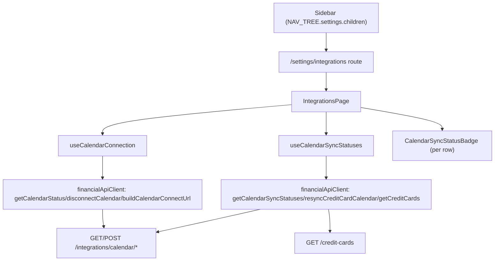

# F03. Integrations Settings — Web — Technical Specification

## 1. Technical Overview

**What:** A new `/settings/integrations` page in `Financial.Web` showing one "Google Calendar" panel: connection status (not connected / connecting / connected / server error), and, once connected, the connected account email, the dedicated calendar's name as a link to that calendar on `calendar.google.com`, the connected-since date, a Disconnect action (behind a confirmation dialog), and a list of active due-dated cards with a per-row sync status (icon + accessible text, never color alone) and an inline Retry action on errored rows. The page is reached from a new "Integrations" entry under the existing "Settings" sidebar category.

**Why:** F01 and F02 are both API-only - `CalendarIntegrationController`'s five endpoints (`status`, `connect`, `disconnect`, `credit-cards/sync-status`, `credit-cards/{id}/resync`, `resync-all`) exist and work, but nothing in either front end calls them yet. F03 is the first UI consumer, giving the single user the "Connect" entry point the whole feature depends on and turning F02's otherwise-invisible per-card sync outcomes into something visible and actionable (per `docs/rules/ui.md` invariant 5 - initial/loading/empty/error/disabled states are all mandatory here, not optional). `Financial.Web` is the UX source of truth (CLAUDE.md), so F04 (WPF) will mirror the states and wording this spec defines rather than the other way around.

**Scope:**
- Included: the `/settings/integrations` route and sidebar entry, the connection panel (all states from PRD Experience), the per-card sync status list with per-row Retry, the Disconnect confirmation dialog, the small backend addition needed to deep-link the calendar name (see Technical Decisions), and the `financialApiClient` methods + hooks the page needs.
- Excluded: any change to F01/F02's sync/connection business logic; the WPF equivalent (F04, separate feature); the OAuth consent screen and callback landing page (already served by the API, out of Web's control).

The PRD has no Core Scope / Full Scope split for this feature - full scope as written applies.

## 2. Architecture Impact

**Affected components:**
- `Financial.CashFlow.Application/DTOs/CalendarConnectionStatusDTO.cs` and `Services/CalendarIntegrationService.cs` - add a `CalendarId` field so the Web page can build a precise deep link (F01 already stores `CalendarConnection.CalendarId`; it just isn't surfaced on the wire yet).
- `Tests/Financial.Api.Tests/Contract/openapi-v1.snapshot.json` and `Financial.Web/src/api/generated/openapi.ts` - regenerated for the new field.
- `Financial.Web/src/api/financialApiClient.ts` and `src/api/types.ts` - five new client methods (`getCalendarStatus`, `getCalendarSyncStatuses`, `resyncCreditCardCalendar`, `resyncAllCalendars`, `disconnectCalendar`) plus a plain `buildCalendarConnectUrl()` helper (the connect endpoint is a browser redirect target, not a `fetch` call) and three new DTO aliases.
- `Financial.Web/src/hooks/useCalendarConnection.ts` (new) and `src/hooks/useCalendarSyncStatuses.ts` (new) - data/state for the two halves of the page.
- `Financial.Web/src/pages/IntegrationsPage.tsx` + `IntegrationsPage.css` (new) - the page itself, including the inline Disconnect confirmation dialog (no separate dialog component, matching `CreditCardsPage`'s precedent).
- `Financial.Web/src/components/CalendarSyncStatusBadge.tsx` (new) - the reusable per-row status indicator (icon + text, never color alone).
- `Financial.Web/src/navigation/navTree.ts`, `routes.tsx`, `lazyPages.tsx` - one new child under the existing `settings` category, one new `PageRoute`, one new lazy import.
- `README.md` - document the new Settings > Integrations page alongside the existing "Calendar integration (optional)" section.



## 3. Technical Decisions

| Decision | Chosen Approach | Alternative Considered | Trade-off |
|----------|----------------|----------------------|-----------|
| Calendar-name deep link | Add `CalendarId` to `CalendarConnectionStatusDTO` (backend, this feature); Web builds `https://calendar.google.com/calendar/u/0/r?cid={encodeURIComponent(calendarId)}` - confirmed with the user | A name-search link with no backend change; plain text with no link | The PRD explicitly asks for "a link that opens calendar.google.com to that calendar." `CalendarConnection.CalendarId` already exists in F01's stored state, so surfacing it is a one-field, low-risk addition rather than a workaround that only approximates the PRD's intent. |
| Connect button behavior | `window.open(buildCalendarConnectUrl(), '_blank', 'noopener,noreferrer')` - opens the OAuth flow in a **new tab**, the SPA tab stays open and mounted | Same-tab `window.location.href` navigation | F01's already-built callback landing page (`CalendarIntegrationController.Callback`) reads "You can close this tab **and return to the app**," which only makes sense if the app's own tab survives the flow. A same-tab navigation would destroy the very component state ("Connecting…") the PRD asks the button to show. |
| Detecting connect completion | While `isConnecting` is true, `useCalendarConnection` adds a `window` `focus` listener; each `focus` event re-fetches `/status` once. If the result is `connected: true` (or a hard error), `isConnecting` clears and the listener is removed; otherwise it stays attached (the user may still be mid-consent) until the component unmounts | A fixed-interval poll (`useSyncStatus`'s pattern); `visibilitychange` instead of `focus` | Matches the PRD's own wording exactly ("Web: on window focus regaining after redirect") and avoids introducing background polling that outlives the user's attention. This is the first `focus`-event precedent in `Financial.Web`; documented here since no prior pattern existed to follow. |
| Hook split | Two hooks: `useCalendarConnection` (status/connect/disconnect - single-entity, mirrors `useCreditCards`' create/update/delete shape) and `useCalendarSyncStatuses` (list + per-row retry - mirrors `useCreditCards`' `updatingCardId`/`updateError`/`updateCreditCard` triplet) | One combined `useCalendarIntegration` hook | Matches this codebase's existing one-hook-per-concern granularity (`useCreditCards`, `useSyncStatus` are both single-purpose); the connection and the per-card list have independent loading/error/retry lifecycles and are naturally decoupled. |
| Card name/due date for each sync-status row | `useCalendarSyncStatuses` also calls `GET /credit-cards`, filters to `isActive && nextInvoiceDueDate != null`, and left-joins each qualifying card with its status from `GET .../credit-cards/sync-status` (a card absent from that list - never yet synced this process lifetime - renders as `pending`, no error) | Add a new backend endpoint returning the joined shape | `/credit-cards/sync-status` deliberately returns only `creditCardId`/`state`/timestamps/error (F02's own spec); `/credit-cards` already exposes name and due date. Joining client-side avoids a redundant backend endpoint for a single-page, single-user read. |
| Status badge | New `CalendarSyncStatusBadge` component: Fluent `Badge` (`success`/informative-with-`Spinner`/`danger`) whose visible text is always one of "Synced" / "Syncing…" / "Sync failed: {reason}" - the text alone carries the meaning, color is decoration only | `role="img"` + `aria-label` pattern (`InvestmentTree`'s status dot) | The PRD explicitly requires "never conveyed by color alone" and specifies the exact three accessible labels; a `Badge` with always-visible text satisfies that more directly than an icon relying on `aria-label`, and matches `StatusMenuButton`'s existing `Badge`-based precedent in this codebase. |
| Disconnect confirmation | Inline `Dialog`/`DialogSurface`/`DialogBody` in `IntegrationsPage.tsx`, gated by a `confirmingDisconnect: boolean` state flag, using `formPanelStyles`'s shared `actions` class for the button row | A separate `ConfirmDialog.tsx` component | Matches `CreditCardsPage`'s existing delete-confirmation pattern exactly (nullable/boolean "thing being confirmed" gating an inline `Dialog`); no reusable confirm-dialog component exists yet in this codebase to extract to. |
| Page layout / styling | Plain `IntegrationsPage.css` for page-level layout (panel spacing, list layout), matching `AppearancePage.css`'s convention for a `/settings/*` page; `CalendarSyncStatusBadge` needs no separate stylesheet since Fluent's `Badge`/`Spinner` already carry their own tokens | `makeStyles` for the whole page | `AppearancePage` (the only other `/settings/*` page) uses plain CSS; there is no dynamic/responsive styling need here that would justify `makeStyles` over it (unlike `formPanelStyles`'s grid breakpoints). |

## 4. Component Overview

**`Financial.CashFlow.Application`:**

| File Path | New/Modified | Purpose | Key Responsibilities |
|-----------|--------------|---------|---------------------|
| `DTOs/CalendarConnectionStatusDTO.cs` | Modified | Add wire field | New `string? CalendarId` property |
| `Services/CalendarIntegrationService.cs` | Modified | Populate it | `ToStatusDto` sets `CalendarId = connection.CalendarId` |

**`Tests/Financial.Api.Tests/Contract` / `Financial.Web/src/api/generated`:**

| File Path | New/Modified | Purpose | Key Responsibilities |
|-----------|--------------|---------|---------------------|
| `openapi-v1.snapshot.json` | Modified (regenerated) | Contract pin | Reflects the new `calendarId` field |
| `openapi.ts` | Modified (regenerated) | Frontend types | `npm run generate-api-types` output |

**`Financial.Web/src/api`:**

| File Path | New/Modified | Purpose | Key Responsibilities |
|-----------|--------------|---------|---------------------|
| `types.ts` | Modified | DTO aliases | `CalendarConnectionStatusDto`, `CreditCardCalendarSyncStatusDto`, `CalendarDisconnectResultDto` |
| `financialApiClient.ts` | Modified | Client methods | `getCalendarStatus()`, `disconnectCalendar()`, `getCalendarSyncStatuses()`, `resyncCreditCardCalendar(id)`, `resyncAllCalendars()` via `request`/`requestVoid`; `buildCalendarConnectUrl()` - a pure `${baseUrl}/integrations/calendar/connect` string builder, not a fetch call |

**`Financial.Web/src/hooks`:**

| File Path | New/Modified | Purpose | Key Responsibilities |
|-----------|--------------|---------|---------------------|
| `useCalendarConnection.ts` | New | Connection state | `useReducer` state machine: `{ status, isLoading, error, isConnecting, isDisconnecting, disconnectError }`; `retry()`, `connect()` (opens new tab + arms the focus listener), `disconnect()` |
| `useCalendarSyncStatuses.ts` | New | Per-card list state | `useReducer` state machine: `{ rows, isLoading, error, retryingCardId, retryError }`; `retry()` (reload), `resyncCard(id)` |

**`Financial.Web/src/components`:**

| File Path | New/Modified | Purpose | Key Responsibilities |
|-----------|--------------|---------|---------------------|
| `CalendarSyncStatusBadge.tsx` | New | Per-row status indicator | Maps `'Pending' \| 'Synced' \| 'Error'` (plus `undefined` = never synced, treated as `Pending`) to a Fluent `Badge`/`Spinner` with the PRD's exact visible text |

**`Financial.Web/src/pages`:**

| File Path | New/Modified | Purpose | Key Responsibilities |
|-----------|--------------|---------|---------------------|
| `IntegrationsPage.tsx` | New | The page | Composes both hooks; renders the initial/loading/not-connected/connecting/connected/server-error states; the per-card `Table`; the inline Disconnect `Dialog`; the "Retry" action per errored row |
| `IntegrationsPage.css` | New | Layout | Panel spacing, list row layout, matching `AppearancePage.css`'s structure |

**`Financial.Web/src/navigation`:**

| File Path | New/Modified | Purpose | Key Responsibilities |
|-----------|--------------|---------|---------------------|
| `navTree.ts` | Modified | Sidebar entry | Adds `{ id: 'integrations', label: 'Integrations', route: '/settings/integrations' }` to the existing `settings` category's `children` |
| `routes.tsx` | Modified | Route registration | Adds `{ path: 'settings/integrations', element: <IntegrationsPage /> }` to `PAGE_ROUTES` |
| `lazyPages.tsx` | Modified | Lazy import | `export const IntegrationsPage = lazy(() => import('../pages/IntegrationsPage'))` |

**Root:**

| File Path | New/Modified | Purpose | Key Responsibilities |
|-----------|--------------|---------|---------------------|
| `README.md` | Modified | Docs | Note the Settings > Integrations page under the existing Calendar integration section |

## 5. API Contracts

All consumed, no new backend routes except the one field addition below.

**`GET /api/v1/financial/integrations/calendar/status`** (existing, F01) - response gains one field:
```json
{
  "connected": true,
  "accountEmail": "user@gmail.com",
  "calendarName": "Financial - Credit Card Due Dates",
  "calendarId": "abcdef1234567890@group.calendar.google.com",
  "connectedAtUtc": "2026-09-01T10:00:00Z",
  "disconnectReason": null
}
```

**`GET /api/v1/financial/integrations/calendar/connect`** (existing, F01) - never `fetch`ed; the Web client only builds its absolute URL for `window.open`.

**`POST /api/v1/financial/integrations/calendar/disconnect`** (existing, F01) - `CalendarDisconnectResultDTO { remoteCleanupSucceeded }`, called after dialog confirmation.

**`GET /api/v1/financial/integrations/calendar/credit-cards/sync-status`** (existing, F02) - `CreditCardCalendarSyncStatusDTO[]`.

**`POST /api/v1/financial/integrations/calendar/credit-cards/{id}/resync`** (existing, F02) - `CreditCardCalendarSyncStatusDTO`, called by the per-row Retry button.

**`GET /api/v1/financial/credit-cards`** (existing, unrelated feature) - `CreditCardDTO[]`, used only to join `name`/`nextInvoiceDueDate` onto each sync-status row.

## 6. Data Model

No new persistent storage. The only schema-shaped change is the additive `calendarId` field on `CalendarConnectionStatusDTO`'s wire contract (Section 5) - `CalendarConnection.CalendarId` already exists in F01's credentials-file model, this feature only exposes it.

## 7. Testing Strategy

| Test File | Test Type | Target | Coverage Goal |
|-----------|-----------|--------|---------------|
| `Tests/Financial.CashFlow.Application.Tests/Services/CalendarIntegrationServiceTests.cs` | Unit (existing, extended) | `ToStatusDto` | `GetStatusAsync` when connected returns the connection's `CalendarId` |
| `Tests/Financial.Api.Tests/Contract/OpenApiContractTests.cs` | Integration (existing) | Snapshot sync | Passes once the snapshot is regenerated for the new field |
| `Financial.Web/src/api/generated/__tests__/openapiFreshness.test.ts` | Unit (existing) | Generated-types freshness | Passes once `openapi.ts` is regenerated |
| `Financial.Web/src/api/__tests__/financialApiClient.test.ts` | Unit (existing file, extended) | New client methods | URL/method for each of the 5 new methods; `ApiError` on non-2xx; `buildCalendarConnectUrl()` returns `${baseUrl}/integrations/calendar/connect` with no network call |
| `Financial.Web/src/hooks/__tests__/useCalendarConnection.test.ts` | Unit | `useCalendarConnection` | Initial load success/error/retry; `connect()` opens a new tab and arms the state; a simulated `focus` event re-fetches status and clears `isConnecting` once `connected: true`; `disconnect()` success/failure and the in-flight `isDisconnecting` guard |
| `Financial.Web/src/hooks/__tests__/useCalendarSyncStatuses.test.ts` | Unit | `useCalendarSyncStatuses` | Loading/error/retry; joins `/credit-cards` with `/credit-cards/sync-status` correctly, including a card absent from the status list rendering as `pending`; `resyncCard(id)` success/failure with per-row `retryingCardId` |
| `Financial.Web/src/components/__tests__/CalendarSyncStatusBadge.test.tsx` | Unit | `CalendarSyncStatusBadge` | Each of `Synced`/`Pending`/`Error`/`undefined` renders the PRD's exact accessible text; the visible text itself (not just an `aria-label`) carries the state |
| `Financial.Web/src/pages/__tests__/IntegrationsPage.test.tsx` | Integration (frontend, AC-tracing by test name) | Full page state matrix, `financialApiClient` faked via `vi.mock` | `P45-F03-integrations-settings-web-01` connect button when not connected / connected details when connected; `-02` badge text for each per-row state, never color-only; `-03` Disconnect always opens the confirmation dialog first and cancelling leaves the connection untouched; `-04` clicking Retry on an errored row calls the resync endpoint and updates that row's status; `-05` a failed `/status` load shows a retry affordance, not a blank/broken panel; keyboard operability (tab order, Enter/Space activation) and visible focus per `docs/ui/accessibility.md` |
| `Financial.Web/src/navigation/__tests__/routes.test.ts` | Unit (existing) | Route ↔ sidebar agreement | Passes once `navTree.ts`/`routes.tsx` are both updated consistently |

No test targets live Google infrastructure; all backend calls in Web tests go through the faked `financialApiClient`, per `references/mock-health-rules.md`'s sanctioned exception for Web.
