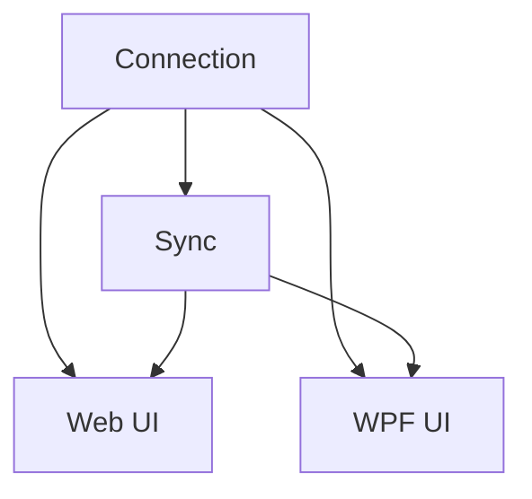

# Google Calendar Integration for Credit-Card Due Dates

## 1. Executive Summary

This feature adds an optional Google Calendar integration to the financial management tool, letting the single user connect their personal Google account so that credit-card payment due dates automatically appear as calendar events. Today, due dates only surface inside the app itself — either by opening the Credit Cards admin page or via the short-lookahead Payment Due Banner (P42) that only warns 0–5 days ahead. Users who live in their calendar rather than the app can miss a due date entirely if they don't open the app in that window.

The integration works for a single connected Google account. Once connected, the app creates a dedicated "Financial - Credit Card Due Dates" calendar and keeps one persistent event per active credit card that has a due date configured, updating that event automatically whenever the card's due date or outstanding balance changes. Each event carries the card's name, its current invoice balance, and the due date itself, plus a one-day-before popup reminder — turning Google Calendar into a genuine out-of-app notification channel, the exact capability P42 explicitly deferred.

At a high level: the user connects their Google account once from a new Settings > Integrations page (Web and WPF); from then on, saving a credit card with a due date triggers a background sync that creates, updates, or removes the corresponding calendar event with no further action required. Disconnecting removes the dedicated calendar and everything in it, leaving the rest of the app untouched.

## 2. Problem and Opportunity

**The Problem**

- **Due dates live only inside the app.** The Payment Due Banner (P42) only surfaces a due date 0–5 days before it happens, and only when the user opens the app in that window — someone who doesn't open the app on the right day gets no warning at all.
- **No push/out-of-app notification exists.** P42 explicitly excluded push, email, or SMS notifications from its scope; there is currently no way for the app to reach the user outside of its own UI.
- **Manual due-date tracking is error-prone.** Users who want a calendar reminder today must manually re-create it every month whenever a due date changes, or risk it going stale.
- **Balance context is missing from any external reminder.** Even a manually-created calendar event wouldn't show the actual amount owed, since that's computed dynamically from unpaid `CreditCardCharge` expenses and isn't visible outside the app.

**The Opportunity**

- Connecting Google Calendar turns the existing due-date data (`CreditCard.NextInvoiceDueDate`, `CardStatement` outstanding totals) into a real notification the user sees wherever they already track their schedule, without duplicating the due-date/urgency logic P42 already built.
- Automating event creation/update on every credit-card save means the calendar is always in sync with the app with zero manual upkeep.
- Including the balance directly in the event removes the need to open the app just to check "how much do I owe" before paying.

## 3. Target Audience

### Primary Users

**The App Owner**
- The single user of this self-hosted financial tool, managing personal credit cards across Brazil and the UK.
- Already relies on Google Calendar as their primary day-to-day schedule and reminder tool, separate from this app.
- Wants due-date awareness to happen passively (via a channel they already check) rather than having to remember to open the finance app.

## 4. Objectives

**Product Objectives**

- **Deliver** an out-of-app reminder channel for credit-card due dates that requires no manual re-entry as due dates change.
- **Keep** the connected Google Calendar accurate at all times, reflecting the current due date and current owed balance for every active card.
- **Preserve** the optional nature of the integration — the rest of the app functions identically whether or not Google Calendar is connected.
- **Fail safely** — a Google Calendar sync failure must never block or corrupt a credit-card save operation.

**Success Metrics**

- 100% of active credit cards with a non-null `NextInvoiceDueDate` have a corresponding, up-to-date Google Calendar event within 5 seconds of the triggering save, measured across all saves once connected.
- 0 credit-card save operations fail or roll back due to a Google Calendar API error, verified via integration tests simulating API failures.
- Disconnecting removes 100% of app-created calendar artifacts (the dedicated calendar and every event in it) within a single disconnect request.

## 5. User Stories

### F01. Google Calendar Account Connection
- As a user, I want to connect my Google account from the app so that it can create calendar events on my behalf
- As a user, I want the app to create a dedicated calendar for these events so that they stay separate from my personal events
- As a user, I want to see whether my Google account is currently connected and which account it is so that I know the integration is active
- As a user, I want to disconnect my Google account so that the app stops managing calendar events and removes what it created
- As the system, I want to silently refresh the access token using the stored refresh token so that the connection keeps working without the user re-authenticating

### F02. Credit-Card Due-Date Event Sync
- As a user, I want a calendar event to appear automatically when I set a due date on a credit card so that I don't have to create it myself
- As a user, I want the calendar event to update automatically when a due date changes so that it never goes stale
- As a user, I want the event to show the card name, the due date, and the current amount I owe so that I have the full context without opening the app
- As a user, I want a reminder notification the day before the due date so that I'm actively warned, not just informed
- As a user, I want the calendar event removed automatically if I clear the due date or deactivate/delete the card so that the calendar doesn't show stale obligations
- As a user, I want to manually retry a failed sync for a specific card so that I can recover without waiting for the next edit

### F03. Integrations Settings — Web
- As a user, I want a Settings > Integrations page so that I can manage the Google Calendar connection from the web app
- As a user, I want to see the connection status, connected account email, and dedicated calendar name so that I can confirm the integration is set up correctly
- As a user, I want to see per-card sync status (synced, pending, or failed) so that I know which due dates are actually reflected in my calendar
- As a user, I want a confirmation prompt before disconnecting so that I don't accidentally delete the calendar and its events

### F04. Integrations Settings — WPF
- As a user, I want the same Settings > Integrations experience in the desktop app so that I get the same outcome regardless of which client I use
- As a user, I want the Connect action to open my system's default browser so that I complete Google sign-in the way I normally would
- As a user, I want the desktop app to reflect the connection status once I return from the browser so that I don't have to guess whether it worked

## 6. Functionalities

### F01. Google Calendar Account Connection

**Provides:**
- Connection status (connected/disconnected, connected account email, dedicated calendar name and ID, connected-at timestamp) (used by F02, F03, F04)

**Capabilities:**
- OAuth 2.0 authorization-code flow against Google, requesting the `https://www.googleapis.com/auth/calendar` scope (full calendar management is required to create and later delete the dedicated calendar, not just its events).
- Google OAuth client ID, client secret, and redirect URI are read from configuration (`CashFlow:GoogleCalendar:ClientId` / `ClientSecret` / `RedirectUri`), following the same per-provider configuration convention already used for `GoogleDrive:CredentialsPath`. The redirect URI targets a new, provider-agnostic API endpoint: `{API_BASE_URL}/api/v1/financial/integrations/calendar/callback` — the app exposes calendar integration generically even though Google is the only connected provider.
- On successful consent, the app creates one calendar named "Financial - Credit Card Due Dates" in the connected account, and persists the access token, refresh token, the calendar's ID, connected account email, and connected-at timestamp to a dedicated local credentials file (path from `CashFlow:GoogleCalendar:CredentialsPath`, mirroring the `GoogleDrive:CredentialsPath` pattern), separate from `data-cashflow.json`. This file is added to `.gitignore`, matching every other local credentials/data file in the repo.
- Only a single connection is supported at a time — connecting a new account while one is already connected first disconnects the previous one (deleting its dedicated calendar) before completing the new connection.
- Every Calendar API call transparently refreshes the access token first if it is expired, using the stored refresh token; refresh failures are treated as in Error Handling below.
- Disconnecting deletes the dedicated calendar (and every event in it) via the Calendar API, revokes the token with Google's token-revocation endpoint, and deletes the local credentials file. Disconnect always removes local state even if the remote revoke/delete call fails, so the app never reports "connected" when it can no longer act on the calendar.
- `GET /api/v1/financial/integrations/calendar/status` exposes the current connection status for both front ends to poll.

**Experience:**
- Connect: user clicks "Connect Google Calendar"; Web navigates the browser to the Google consent screen directly; WPF opens the same consent URL in the OS default browser. After the user grants access, Google redirects to the API callback endpoint, which completes the exchange, creates the calendar, and redirects/responds with a success page telling the user to return to the app.
- Both front ends poll `/status` after initiating connect (Web: on window focus regaining after redirect; WPF: on a short interval after opening the browser and on window focus) so the UI updates without a manual refresh.
- Disconnect always requires an explicit confirmation step (see F03/F04) before the call is made, since it is destructive to the dedicated calendar's contents.

**Error Handling:**
- User denies consent or closes the Google flow → callback redirects back with an error indicator; status remains "not connected"; Integrations page shows "Connection was not completed" and the Connect action remains available.
- Dedicated calendar creation fails (network/API error) after token exchange succeeds → the app does not persist a "connected" state, revokes the just-issued token, and surfaces "Couldn't finish connecting — please try again."
- Refresh token is rejected by Google (revoked externally, e.g. the user removed app access from their Google Account settings) → `/status` reports `connected: false` with reason `"token_revoked"`; F02's sync engine stops attempting syncs; the Integrations page shows "Connection lost — please reconnect" instead of a generic error.
- Disconnect's remote calls (calendar delete, token revoke) fail → local connection state and credentials file are still cleared, and the user is shown a one-time notice: "Disconnected in the app. You may need to manually remove the 'Financial - Credit Card Due Dates' calendar and revoke access in your Google Account if this happens again."

### F02. Credit-Card Due-Date Event Sync

**Consumes:**
- F01: connection status, dedicated calendar ID, and valid Google API access

**Provides:**
- Per-card sync status: last sync outcome (`synced` / `pending` / `error`), last successful sync timestamp, last error message (used by F03, F04)

**Capabilities:**
- Sync runs automatically, within 5 seconds of the triggering `CreditCardService` save completing, whenever Google Calendar is connected.
- Triggering conditions: a credit card is created or updated with `IsActive = true` and a non-null `NextInvoiceDueDate`.
- Removal conditions: `NextInvoiceDueDate` becomes null, `IsActive` becomes `false`, or the card is deleted — the app deletes that card's existing event, if any.
- Balance shown is the current period's outstanding total: the `CardStatement` whose year/month matches `NextInvoiceDueDate`'s own year/month, via the same `OutstandingTotal` computation `CardStatementService` already exposes. If no statement exists yet for that period, the balance shown is 0 with the description noting "(no charges posted to this invoice yet)".
- One persistent event per card: the app stores a mapping of `CreditCardId → Google event ID` inside the same local credentials file used by F01 (not on the `CreditCard` domain entity), and updates that same event's date and content on every subsequent sync instead of creating a new one. This mapping entry is removed whenever the corresponding event is deleted.
- Event is an all-day event on `NextInvoiceDueDate`, with one popup reminder set 1440 minutes (1 day) before the event's start.
- Event title: `"{CreditCard.Name} — Due {FormattedBalance}"`. Event description: card name, due date (long format, e.g. "10 September 2026"), and the same formatted balance, using the same currency symbol and number formatting the app already uses when displaying that card's statements, plus a fixed trailer noting it was generated by the app.
- A manual per-card retry is available via `POST /api/v1/financial/integrations/calendar/credit-cards/{id}/resync`, and a "resync all" bulk action via `POST /api/v1/financial/integrations/calendar/resync-all`, both re-running the same sync logic on demand.
- Sync failures never block, delay, or roll back the triggering credit-card save — the save's success response is independent of sync outcome.

**Experience:**
- No direct UI of its own; its outcomes are surfaced through F03/F04's per-card sync status list, and its side effects are the calendar events themselves.
- A card's sync status flips to `pending` immediately after a triggering save, then to `synced` or `error` once the background sync attempt completes.

**Error Handling:**
- Google Calendar API call fails (network, rate limit, transient error) → sync status for that card becomes `error` with the failure reason recorded; the card's existing event (if any) is left untouched rather than partially updated; retried on the next triggering save or manual retry.
- The dedicated calendar was deleted outside the app (e.g., the user manually deleted it in Google Calendar) → the next sync attempt detects the 404, automatically recreates the dedicated calendar (it is entirely app-managed), clears all stored event-ID mappings since they're now invalid, and recreates events for every active card with a due date.
- Google Calendar is disconnected mid-sync (race with F01's disconnect) → the sync attempt is discarded silently; no event is created against a calendar the app no longer manages.

### F03. Integrations Settings — Web

**Consumes:**
- F01: connection status, connected account email, dedicated calendar name
- F02: per-card sync status, last sync timestamp, last error message

**Capabilities:**
- New route `/settings/integrations`, added as a top-level "Settings" navigation entry (distinct from the existing `admin/` area, since this is account-level configuration, not entity CRUD).
- Page shows one "Google Calendar" panel with the connection state and, once connected, a list of active cards that have a due date, each row showing the card name, due date, sync status icon, and last-synced time (or last error).

**Experience:**
- **Initial/Loading:** on page load, a skeleton/spinner shows while `/status` is fetched.
- **Not connected (empty state):** explanatory text ("Connect your Google Calendar to get due-date reminders outside the app") plus a "Connect Google Calendar" button.
- **Connecting:** button shows a progress state after click, until the browser redirect completes and the app regains focus with an updated status.
- **Connected (success state):** shows connected account email, dedicated calendar name (as a link that opens `calendar.google.com` to that calendar), connected-since date, a "Disconnect" button, and the per-card sync status list below.
- **Per-row sync status:** a `synced` (green check, accessible label "Synced"), `pending` (neutral spinner, "Syncing…"), or `error` (red icon, accessible label "Sync failed: {reason}") indicator per card, never conveyed by color alone. Error rows show an inline "Retry" button calling the per-card resync endpoint.
- **Disconnect confirmation:** clicking "Disconnect" opens a confirmation dialog explicitly warning that the dedicated calendar and all its events will be deleted from Google Calendar; only confirming proceeds.
- **Server error:** if `/status` fails to load, the panel shows a retry affordance instead of a broken/empty page.
- **Disabled state:** the Disconnect button is disabled while a disconnect request is in flight, to prevent duplicate submissions.
- Fully keyboard operable, visible focus states, accessible names for all icons/buttons, meets WCAG 2.2 AA per the project's UI standards.

### F04. Integrations Settings — WPF

**Consumes:**
- F01: connection status, connected account email, dedicated calendar name
- F02: per-card sync status, last sync timestamp, last error message

**Capabilities:**
- New "Settings" section in the WPF navigation with an "Integrations" view, functionally equivalent to F03: same information, same actions, same states, adapted to WPF controls and navigation conventions (not a pixel-identical clone).

**Experience:**
- Connect: button opens the consent URL via the OS default browser (no embedded WebView2); the view polls the status endpoint on a short interval after the browser opens and on window-focus-regained, mirroring F03's redirect-completion detection.
- Same connected/not-connected/error/disabled states as F03, using WPF-appropriate visual treatment: numeric/currency balances in the per-card list are right-aligned per the app's existing grid convention; status text avoids `<Run Text="{Binding}"/>` two-way binding pitfalls in favor of `TextBlock` + `StringFormat`, consistent with existing WPF patterns in this codebase.
- Disconnect confirmation uses the same warning content as F03, via WPF's standard confirmation dialog pattern.
- Fully keyboard operable with visible focus, matching the accessibility bar set for F03.

## 7. Out of Scope

**Connection scope**
- Connecting more than one Google account at a time.
- Support for Google Workspace domain-restricted accounts beyond the standard OAuth consent screen.
- Any Google service other than Calendar (no Gmail, Google Tasks, etc.).

**Sync scope**
- Syncing due dates for anything other than credit cards — `RecurringBill` (Mensais) due dates are not included in this version.
- Two-way sync: edits or deletions made directly in Google Calendar are never read back into the app and will simply be overwritten on the next sync.
- Historical/audit tracking of past due-date events or a change log of calendar updates.
- Customizable event title/description templates or a configurable reminder lead time — the 1-day-before popup is fixed.
- Adding a new configurable due-day rule to `CreditCard` — this version keeps the existing manually-set `NextInvoiceDueDate` field as-is.

**Operational scope**
- Offline event creation/queuing — a sync attempt made while Google Calendar's API is unreachable simply fails and is retried on the next trigger or manual retry, with nothing queued in between.
- Real-time push notifications from Google back to the app (e.g., reacting if the user deletes the dedicated calendar) beyond the self-healing recreation described in F02's error handling, which only runs on the next sync attempt.

## 8. Dependency Graph

### Part 1: Dependency Table

| # | Feature | Priority | Dependencies |
|---|---------|----------|--------------|
| F01 | Google Calendar Account Connection | 1 | None |
| F02 | Credit-Card Due-Date Event Sync | 1 | F01 |
| F03 | Integrations Settings — Web | 1 | F01, F02 |
| F04 | Integrations Settings — WPF | 1 | F01, F02 |

### Execution Waves
Features within the same wave can be built in parallel. A wave starts only after every feature in earlier waves is complete.

- **Wave 1**: F01
- **Wave 2**: F02
- **Wave 3**: F03, F04

### Priority levels
- **1** = Essential — product does not work without it
- **2** = Important — significant value addition
- **3** = Desirable — incremental improvement

## 9. Acceptance Criteria

### F01. Google Calendar Account Connection
- [x] **P45-F01-google-calendar-account-connection-01** Clicking "Connect" and completing Google consent results in `/status` reporting `connected: true` with the correct account email and a newly created "Financial - Credit Card Due Dates" calendar.
- [x] **P45-F01-google-calendar-account-connection-02** Declining consent leaves `/status` reporting `connected: false` and does not create a calendar or persist any credentials.
- [x] **P45-F01-google-calendar-account-connection-03** Disconnecting deletes the dedicated calendar in Google Calendar, revokes the token, deletes the local credentials file, and `/status` reports `connected: false` immediately after.
- [x] **P45-F01-google-calendar-account-connection-04** Connecting a new account while one is already connected first deletes the previous account's dedicated calendar before completing the new connection.
- [x] **P45-F01-google-calendar-account-connection-05** An expired access token is transparently refreshed using the stored refresh token on the next API call, with no user-visible interruption.
- [x] **P45-F01-google-calendar-account-connection-06** A revoked refresh token causes `/status` to report `connected: false` with reason `token_revoked`, without the app crashing or repeatedly retrying the same failed call.

### F02. Credit-Card Due-Date Event Sync
- [x] **P45-F02-credit-card-due-date-event-sync-01** Saving an active credit card with a due date, while connected, creates exactly one calendar event within 5 seconds showing the card name, due date, and the correct current-period outstanding balance.
- [x] **P45-F02-credit-card-due-date-event-sync-02** Changing that card's due date updates the same event (same event ID) rather than creating a second one.
- [x] **P45-F02-credit-card-due-date-event-sync-03** Clearing the due date, deactivating the card, or deleting the card removes its calendar event.
- [x] **P45-F02-credit-card-due-date-event-sync-04** The created event has exactly one popup reminder set 1440 minutes before its start.
- [x] **P45-F02-credit-card-due-date-event-sync-05** A card with a due date but no posted charges for that invoice period shows a balance of 0 with the "no charges posted yet" note.
- [x] **P45-F02-credit-card-due-date-event-sync-06** A simulated Calendar API failure during sync leaves the triggering credit-card save unaffected (it still returns success) and marks that card's sync status as `error` with a retry available.
- [x] **P45-F02-credit-card-due-date-event-sync-07** Manually deleting the dedicated calendar in Google Calendar, then triggering any sync, results in the calendar being recreated and every active card's event being re-created in it.

### F03. Integrations Settings — Web
- [x] **P45-F03-integrations-settings-web-01** `/settings/integrations` shows a "Connect Google Calendar" button when not connected, and the connected account email, calendar name, and per-card sync list when connected.
- [x] **P45-F03-integrations-settings-web-02** Each card row's sync status is conveyed with both an icon and an accessible text label, not color alone.
- [x] **P45-F03-integrations-settings-web-03** Clicking "Disconnect" always shows a confirmation dialog before the disconnect request is sent; cancelling the dialog leaves the connection intact.
- [x] **P45-F03-integrations-settings-web-04** Clicking "Retry" on an errored row triggers that card's resync endpoint and updates its status once the retry completes.
- [x] **P45-F03-integrations-settings-web-05** A failed `/status` request shows a retry affordance instead of an empty or broken panel.

### F04. Integrations Settings — WPF
- [ ] The WPF Settings > Integrations view shows the same connection states, account details, and per-card sync list as F03, using WPF-native controls.
- [ ] Clicking "Connect" opens the system default browser to the Google consent URL; no embedded browser control is used.
- [ ] The view's status updates to "connected" after the user completes consent in the browser and returns to the app, without requiring an explicit manual refresh action.
- [ ] Currency/balance values in the per-card list are right-aligned, consistent with the app's existing grid conventions.
- [ ] Disconnect requires the same explicit confirmation as F03 before proceeding.

### Cross-Feature Integration
- [x] After connecting via F01, F02's sync engine successfully creates events using the connection's dedicated calendar ID — no separate calendar ID configuration is needed.
- [ ] F03 and F04 both correctly display F01's live connection status (connected/disconnected, account email, calendar name) immediately after a connect or disconnect action.
- [ ] F03 and F04 both correctly display F02's per-card sync status and last-synced/last-error data, and their "Retry" actions successfully invoke F02's per-card resync endpoint and reflect the updated status afterward.
