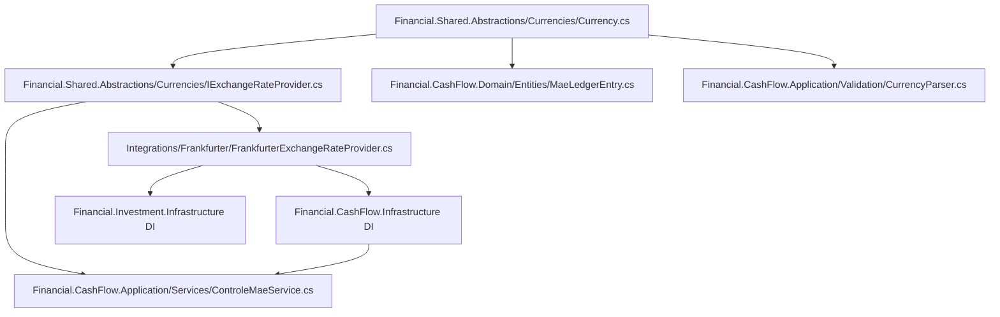

## Complexity: medium

## 1. Technical Overview

**What:** Promote `IExchangeRateProvider` and its `Currency` enum out of `Financial.CashFlow.Application`/`Financial.CashFlow.Domain` into `Financial.Shared.Abstractions`, widen `Currency` from two values (`GBP`, `BRL`) to three (`GBP`, `BRL`, `USD`), relocate the Frankfurter-specific HTTP implementation into a new `Integrations/Frankfurter` vendor project, add a nearest-earlier-date fallback (up to 10 calendar days) to the lookup, repoint every CashFlow consumer to the shared types, delete the CashFlow-local copies, and register the shared provider in `Financial.Investment.Infrastructure`'s DI container so F02/F03 can consume it without touching wiring again.

**Why:** `IExchangeRateProvider` already exists and is proven in production (`ControleMãe` reconciliation) but is unreachable from `Financial.Investment.*` because bounded-context isolation forbids Investment referencing CashFlow directly. The only correct fix is promoting the capability — and the `Currency` type it operates on — to the shared kernel both contexts already depend on, following the same vendor-SDK-isolation convention used by `Integrations/GoogleDrive`, `Integrations/GoogleSheets` and `Integrations/WebPageParser`. This is a Foundation feature (PRD §8): every other F0x in this PRD, and CashFlow's existing `ControleMãe` consumer, depends on this relocation landing first, cleanly, with zero behavioral change to `ControleMãe`.

**Scope:**
- **Included:** `Currency` enum promoted to `Financial.Shared.Abstractions` widened to `GBP`/`BRL`/`USD`; `IExchangeRateProvider` promoted alongside it; new `Integrations/Frankfurter` project hosting `FrankfurterExchangeRateProvider` with the 10-day nearest-earlier-date fallback; CashFlow's `Domain`, `Application` and `Infrastructure` layers repointed to the shared types; the CashFlow-local `IExchangeRateProvider`, its `FrankfurterExchangeRateProvider` implementation and the CashFlow-local `Currency` enum deleted (no second copy left behind); `Financial.Investment.Infrastructure` DI registers the shared provider; solution file and test projects updated to match.
- **Excluded (later features in this PRD):** Any `Currency` field on `Transaction`/`Credit` or the migration tool (F02); the reporting-currency setting and converted totals (F03); any React/WPF surface (F04/F05). Investment's `Application` layer is not expected to consume `IExchangeRateProvider` yet — only its DI container needs to be able to resolve it.

## 2. Architecture Impact

**Affected components:**

| Component | Change |
|---|---|
| `Financial.Shared.Abstractions/Currencies/Currency.cs` | New — the promoted, widened enum (`GBP`, `BRL`, `USD`) |
| `Financial.Shared.Abstractions/Currencies/IExchangeRateProvider.cs` | New — the promoted interface, signature unchanged |
| `Integrations/Frankfurter/Frankfurter.csproj` | New project — vendor SDK isolation boundary, references only `Financial.Shared.Abstractions` |
| `Integrations/Frankfurter/FrankfurterExchangeRateProvider.cs` | New — moved from `Financial.CashFlow.Infrastructure.Services`, adds the 10-day backward fallback |
| `Financial.CashFlow.Domain/Enums/Currency.cs` | Deleted |
| `Financial.CashFlow.Domain/Entities/MaeLedgerEntry.cs` | Modified — `SourceCurrency` now typed as the shared `Currency` |
| `Financial.CashFlow.Domain/Financial.CashFlow.Domain.csproj` | Modified — adds a `ProjectReference` to `Financial.Shared.Abstractions` (first Domain-layer dependency in the codebase; see §3) |
| `Financial.CashFlow.Application/Interfaces/IExchangeRateProvider.cs` | Deleted |
| `Financial.CashFlow.Application/Services/ControleMaeService.cs` | Modified — `using` the shared namespace instead of the deleted local one; no logic change |
| `Financial.CashFlow.Application/Validation/CurrencyParser.cs` | Modified — `using` the shared namespace |
| `Financial.CashFlow.Infrastructure/Services/FrankfurterExchangeRateProvider.cs` | Deleted (moved) |
| `Financial.CashFlow.Infrastructure/DependencyInjection/CashFlowInfrastructureServiceCollectionExtensions.cs` | Modified — registers the shared interface against the relocated `Integrations/Frankfurter` implementation |
| `Financial.Investment.Infrastructure/DependencyInjection/InvestmentInfrastructureServiceCollectionExtensions.cs` | Modified — adds the same `AddHttpClient<IExchangeRateProvider, FrankfurterExchangeRateProvider>` registration (unconsumed until F02/F03, per PRD F01 capability) |
| `Financial.slnx` | Modified — adds `Integrations/Frankfurter` and its test project |
| `Tests/Financial.Frankfurter.Tests/` | New test project — moved and extended `FrankfurterExchangeRateProviderTests` (fallback coverage added) |
| `Tests/Financial.CashFlow.Infrastructure.Tests/Services/FrankfurterExchangeRateProviderTests.cs` | Deleted (moved) |
| `Tests/Financial.CashFlow.Domain.Tests/Entities/MaeLedgerEntryTests.cs` | Modified — `using` the shared namespace |
| `Tests/Financial.CashFlow.Application.Tests/Services/ControleMaeServiceTests.cs` | Modified — `using` the shared namespace only; asserted to pass unchanged (AC) |
| `Tests/Financial.CashFlow.Application.Tests/Validation/CurrencyParserTests.cs` | Modified — `using` the shared namespace, adds a `USD` case |
| `Tests/Financial.Investment.Infrastructure.Tests/DependencyInjection/*` | Modified — asserts `IExchangeRateProvider` now resolves from the Investment DI container |
| `Tests/Financial.Architecture.Tests/` | New rule test — `Integrations/Frankfurter` references no `Financial.CashFlow.*`/`Financial.Investment.*` assembly, matching the existing vendor-isolation pattern |

## 3. Technical Decisions

| Decision | Chosen Approach | Alternative Considered | Trade-off |
|---|---|---|---|
| Where the nearest-earlier-date fallback lives | Inside `FrankfurterExchangeRateProvider` itself: step back one calendar day at a time, re-calling the existing single-date lookup, up to 10 attempts | A separate decorator (`FallbackExchangeRateProvider`) wrapping `IExchangeRateProvider` | The fallback is a Frankfurter-specific fact (only Frankfurter has no rate on weekends/bank holidays), not a generic cross-provider concern, so a second DI-registered decorator type would be pure ceremony for a single implementation. Accepts up to 10 sequential HTTP calls in the worst case, acceptable for a self-hosted single-user app with infrequent FX lookups |
| `Currency`'s home and the new Domain→Shared.Abstractions dependency | Delete `Financial.CashFlow.Domain.Enums.Currency` entirely; `MaeLedgerEntry` and every CashFlow layer reference the shared `Currency` from `Financial.Shared.Abstractions`; add a `ProjectReference` from `Financial.CashFlow.Domain` to `Financial.Shared.Abstractions` | Keep the CashFlow-local `Currency` enum for `MaeLedgerEntry` and translate to/from the shared enum at the `ControleMaeService` boundary | A translation shim is itself a second copy of the same concept, which directly contradicts the PRD's "0 duplicated FX-conversion implementations" success metric, and F02 needs `Financial.Investment.Domain`'s `Transaction`/`Credit` to reference this same shared enum — establishing the pattern once, cleanly, in a Foundation feature is preferable to introducing it ad hoc in F02. `Financial.Shared.Abstractions` has zero `Financial.*` project references itself (enforced by `SharedAbstractionsDependencyRuleTests`), so it is a valid shared-kernel dependency for a Domain project — this is a new precedent in this codebase and worth flagging to `architecture-reviewer` explicitly during review |
| Registering the shared provider in `Financial.Investment.Infrastructure` now, though nothing consumes it yet | Register in this feature (F01) | Defer registration to F02, when `Financial.Investment.Application` first calls `GetHistoricalRateAsync` | The PRD's F01 capability list is explicit: "registered against the shared interface for both bounded contexts' DI containers." A short-lived unused registration (verified only by a DI-resolution test) is preferable to re-touching the same DI extension file again one feature later |
| New project/namespace naming | `Integrations/Frankfurter` (project `Financial.Integrations.Frankfurter`), test project `Tests/Financial.Frankfurter.Tests`; shared types under `Financial.Shared.Abstractions.Currencies` | `Integrations/ExchangeRate`; folder/namespace `Financial.Shared.Abstractions.Currency` | Existing `Integrations/*` projects are named after the vendor/technology (`GoogleDrive`, `GoogleSheets`, `WebPageParser`), not the capability, so `Frankfurter` follows that convention. `Currencies` (plural folder) avoids a namespace segment and a type both being named `Currency` in the same qualified name |

## 4. Component Overview

**Shared kernel:**

| File Path | New/Modified | Purpose | Key Responsibilities |
|---|---|---|---|
| `Financial.Shared.Abstractions/Currencies/Currency.cs` | New | Cross-context currency enum | `GBP`, `BRL`, `USD` |
| `Financial.Shared.Abstractions/Currencies/IExchangeRateProvider.cs` | New | Cross-context FX lookup contract | `GetHistoricalRateAsync(DateOnly, Currency, Currency)` returning nullable rate |

**Vendor integration:**

| File Path | New/Modified | Purpose | Key Responsibilities |
|---|---|---|---|
| `Integrations/Frankfurter/Frankfurter.csproj` | New | Vendor SDK isolation boundary | References only `Financial.Shared.Abstractions`; `RootNamespace`/`AssemblyName` `Financial.Integrations.Frankfurter`, matching `WebPageParser`'s pattern |
| `Integrations/Frankfurter/FrankfurterExchangeRateProvider.cs` | New (moved + enhanced) | HTTP client against the Frankfurter API | Same single-date lookup as today; wraps it in a backward-stepping loop (exact date, then up to 10 earlier calendar days) that returns the first non-null rate found, or `null` |

**CashFlow bounded context:**

| File Path | New/Modified | Purpose | Key Responsibilities |
|---|---|---|---|
| `Financial.CashFlow.Domain/Entities/MaeLedgerEntry.cs` | Modified | Domain entity | `SourceCurrency` retyped to the shared `Currency` |
| `Financial.CashFlow.Application/Services/ControleMaeService.cs` | Modified | Reconciliation use case | Unchanged behavior; consumes shared `IExchangeRateProvider`/`Currency` |
| `Financial.CashFlow.Application/Validation/CurrencyParser.cs` | Modified | Request parsing | Unchanged behavior; parses into the shared `Currency` |
| `Financial.CashFlow.Infrastructure/DependencyInjection/CashFlowInfrastructureServiceCollectionExtensions.cs` | Modified | DI composition | `AddHttpClient<IExchangeRateProvider, FrankfurterExchangeRateProvider>` now resolves the shared interface against the relocated implementation |

**Investment bounded context:**

| File Path | New/Modified | Purpose | Key Responsibilities |
|---|---|---|---|
| `Financial.Investment.Infrastructure/DependencyInjection/InvestmentInfrastructureServiceCollectionExtensions.cs` | Modified | DI composition | Registers the same shared `IExchangeRateProvider`/`FrankfurterExchangeRateProvider` pairing, unconsumed this feature |

**Solution:**

| File Path | New/Modified | Purpose | Key Responsibilities |
|---|---|---|---|
| `Financial.slnx` | Modified | Solution membership | Adds `Integrations/Frankfurter` and `Tests/Financial.Frankfurter.Tests` |

## 5. API Contracts

Not applicable — F01 has no API surface (PRD §6: "Entirely behind the scenes — no UI surface"). `ControleMãe`'s existing endpoints and DTOs are unchanged; `MaeLedgerEntryDTO.SourceCurrency` remains a wire-format `string`, produced by `entry.SourceCurrency.ToString()`, so the OpenAPI snapshot is unaffected by this feature.

## 6. Data Model

Not applicable — this app persists via JSON files, not a SQL schema, and F01 changes no persisted shape. `Currency` enum members keep their existing names (`GBP`, `BRL`) and gain `USD`; since `Financial.CashFlow.Infrastructure`'s JSON converters serialize enums by name (not by namespace), moving the type and adding a new member requires no data migration and no change to any existing `data-cashflow.json` value. `MaeLedgerEntry.SourceCurrency` continues to serialize identically.

## 7. Testing Strategy

| Test File | Test Type | Target | Coverage Goal |
|---|---|---|---|
| `Tests/Financial.Frankfurter.Tests/FrankfurterExchangeRateProviderTests.cs` | Unit | `FrankfurterExchangeRateProvider` | Every existing case (success, non-2xx, malformed body, thrown exception, logging, missing currency key) plus the new fallback cases |
| `Tests/Financial.Architecture.Tests/FrankfurterIsolationRuleTests.cs` | Architecture | `Integrations/Frankfurter` assembly | Vendor project references no `Financial.CashFlow.*`/`Financial.Investment.*` assembly |
| `Tests/Financial.CashFlow.Domain.Tests/Entities/MaeLedgerEntryTests.cs` | Unit | `MaeLedgerEntry` | Existing behavior unchanged with the shared `Currency` type |
| `Tests/Financial.CashFlow.Application.Tests/Services/ControleMaeServiceTests.cs` | Unit | `ControleMaeService` | **Acceptance signal for this feature (PRD AC): passes unchanged** after the switch to the shared interface |
| `Tests/Financial.CashFlow.Application.Tests/Validation/CurrencyParserTests.cs` | Unit | `CurrencyParser` | Existing `BRL`/`GBP` cases plus a new `USD` parse case |
| `Tests/Financial.Investment.Infrastructure.Tests/DependencyInjection/*` | Integration | Investment DI container | `IExchangeRateProvider` resolves to `FrankfurterExchangeRateProvider` from `AddFinancialInvestmentInfrastructure` |
| `Tests/Financial.Api.Tests/ControleMaeEndpointsTests.cs` | Integration | `ControleMãe` endpoints | Unaffected by this feature; re-run as regression evidence |

**Key new test functions (`FrankfurterExchangeRateProviderTests`):**

| Test Function | Description | Assertions |
|---|---|---|
| `GetHistoricalRateAsync_WithExactDateRate_DoesNotFallBack` | Exact requested date has a rate | Returns that rate; exactly one HTTP call made |
| `GetHistoricalRateAsync_WhenExactDateHasNoRate_FallsBackToNearestEarlierDateWithinTenDays` | Weekend/holiday gap, an earlier day within the window has a rate | Returns the nearest earlier date's rate |
| `GetHistoricalRateAsync_WhenNoRateWithinTenDayWindow_ReturnsNull` | No rate anywhere in the 10-day backward window | Returns `null`, not an exception; at most 11 HTTP calls made (day 0 through day -10) |
