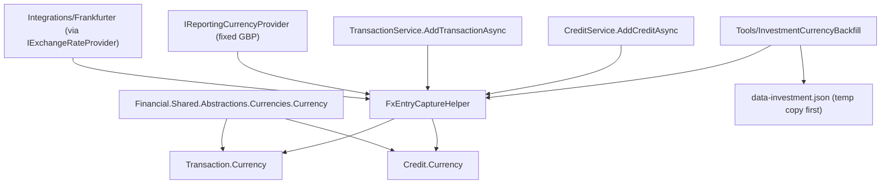

## Complexity: complex

## 1. Technical Overview

**What:** `Transaction` and `Credit` (Investment bounded context) each gain a `Currency` (the shared
enum from F01), auto-filled at entry time from the asset's broker's currency, and a nullable
`FxRateSnapshot` (target currency, rate, source, retrieved-at) captured once via F01's
`IExchangeRateProvider` against an interim reporting-currency default, never recomputed afterward.
A new one-time console migration tool backfills both fields on every existing Transaction and
Credit, verified against a temp copy of `data-investment.json` with a diff report before the live
file is ever touched.

**Why:** Today `Transaction`/`Credit` carry no currency of their own — it is inferred from
`Broker.Currency` (a free-text string) at display time only — so there is no dated, auditable
record of what currency a cash flow was actually in or what rate applied to convert it, which
blocks F03's per-record conversion math entirely. Capturing both at entry time, once, mirrors the
provenance pattern P48 already established for `AssetPriceSnapshot` (`Source`/`RetrievedAt`), and
keeping the snapshot fixed after entry (never live-recalculated) is what makes it an audit record
rather than a derived, always-stale value.

**Scope:**
- **Included:** `Currency` and `FxRateSnapshot` fields on `Transaction`/`Credit`; auto-capture in
  `TransactionService`/`CreditService`'s add path; carry-forward (not recapture) on the update
  path; a new `FxRateSource` enum; `Financial.Investment.Domain`'s first reference to
  `Financial.Shared.Abstractions` (mirroring F01's `Financial.CashFlow.Domain` precedent); an
  interim `IReportingCurrencyProvider` seam (fixed at `GBP`) that F03 will replace with the real
  persisted setting; the one-time migration tool; the legacy
  `Tools/InvestmentSpreadsheetImport` asset-onboarding reader updated only enough to keep
  compiling (see §3 — it does not call the FX provider).
- **Excluded (later features in this PRD):** The reporting-currency setting itself and converted
  totals (F03); any DTO/API exposure of `Currency`/`FxRateSnapshot` and any UI provenance
  affordance (F04/F05) — this feature's data has no new user-facing surface, per the PRD's F02
  Experience note.

## 2. Architecture Impact

**Affected components:**

| Component | Change |
|---|---|
| `Financial.Investment.Domain/Entities/FxRateSnapshot.cs` | New — immutable snapshot (`ToCurrency`, `Rate`, `Source`, `RetrievedAt`) |
| `Financial.Investment.Domain/Entities/FxRateSource.cs` | New enum — `Frankfurter` (single value; extensible, mirrors `PriceSource`) |
| `Financial.Investment.Domain/Entities/Transaction.cs` | Modified — gains `Currency` and nullable `FxRateSnapshot`; factory methods gain matching parameters |
| `Financial.Investment.Domain/Entities/Credit.cs` | Modified — same two additions |
| `Financial.Investment.Domain/Financial.Investment.Domain.csproj` | Modified — adds a `ProjectReference` to `Financial.Shared.Abstractions` |
| `Financial.Investment.Application/Interfaces/IReportingCurrencyProvider.cs` | New — `Currency GetReportingCurrency()`, the seam F03 replaces |
| `Financial.Investment.Application/Services/FixedReportingCurrencyProvider.cs` | New — interim implementation, always returns `Currency.GBP` |
| `Financial.Investment.Application/Services/FxEntryCaptureHelper.cs` | New — internal helper resolving a broker's currency and capturing the FX snapshot, shared by both services |
| `Financial.Investment.Application/Services/TransactionService.cs` | Modified — `AddTransactionAsync` captures currency/snapshot via the helper; `UpdateTransactionAsync` carries the existing transaction's values forward unchanged |
| `Financial.Investment.Application/Services/CreditService.cs` | Modified — same two changes for `Credit` |
| `Financial.Investment.Application/DependencyInjection/InvestmentApplicationServiceCollectionExtensions.cs` | Modified — registers `IReportingCurrencyProvider` |
| `Financial.Investment.Infrastructure/Persistence/InvestmentTypeInfoResolver.cs` | Modified — adds `FxRateSnapshot` to `ManagedTypes` so its private constructor round-trips through JSON |
| `Tools/InvestmentSpreadsheetImport/GoogleSheetsAssetReader.cs` | Modified — threads the already-resolved broker `Currency` into `Transaction.Create`/`Credit.Create`; no FX capture (see §3) |
| `Tools/InvestmentSpreadsheetImport/GoogleGenerator.cs` | Modified — passes the broker's parsed `Currency` down to the reader |
| `Tools/InvestmentCurrencyBackfill/` | New console tool project — one-time backfill, temp-copy-first per the repo's standing migration policy |
| `data/data-investment.example.json` | Modified only if needed to keep parsing (see plan Phase 5) |

## 3. Technical Decisions

| Decision | Chosen Approach | Alternative Considered | Trade-off |
|---|---|---|---|
| Reporting currency during F02 (F03 doesn't exist yet) | New `IReportingCurrencyProvider` seam in `Financial.Investment.Application`, registered via `TryAddSingleton` with a fixed-`GBP` default implementation | Hardcode `Currency.GBP` as a literal inside `FxEntryCaptureHelper` | A literal would need to be found and replaced across every call site when F03 lands; the seam means F03 only swaps one DI registration for a settings-backed implementation, and every entry-time capture (live and migration) already calls through the same interface |
| Where FX capture happens relative to the synchronous `ApplyAndSaveAsync` mutation | `TransactionService`/`CreditService` resolve the broker, its currency, and (if needed) the FX rate *before* calling `AssetMutationHelper.ExecuteParsedMutationAsync`, then close over the already-computed `(Currency, FxRateSnapshot?)` in the synchronous mutation callback | Make `IInvestmentRepository.ApplyAndSaveAsync`'s delegate `Func<Task<bool>>` | `ApplyAndSaveAsync`'s contract is explicitly synchronous (its own XML doc: "the delegate must be synchronous") because saving re-serializes the whole document under exclusion; changing that contract to accommodate one caller would ripple through every other repository consumer. Resolving currency/rate first is a small, local restructuring instead |
| Update path (`UpdateTransactionAsync`/`UpdateCreditAsync`) | Look up the existing record by `Id` inside the (still-synchronous) mutation callback and carry its `Currency`/`FxRateSnapshot` forward unchanged into the replacement `CreateWithId` call — no FX provider call on update | Recompute currency/snapshot on every update, same as create | PRD is explicit that the snapshot is "a fixed audit record of the rate at entry time, not live-updated"; recomputing on every edit (e.g. a user fixing a typo'd quantity) would silently rewrite the audit trail and make "entry time" meaningless |
| Legacy `Tools/InvestmentSpreadsheetImport` (asset onboarding from Google Sheets) | Thread the broker's already-resolved currency (already read once per broker at `GoogleGenerator.ProcessBrokerAsync`, `var currency = _metadataResolver.ResolveBrokerCurrency(fileName)`) into the reader; never call `IExchangeRateProvider` from this tool, so every record it creates has `Currency` set and `FxRateSnapshot` left `null` | Give this tool the same FX-capture treatment as the live entry path | This tool bulk-onboards an entire new broker's history in one run (potentially hundreds of historical rows across possibly years) — nothing in the PRD calls for FX-converting a bulk historical import, and doing so would mean hundreds of live HTTP calls to Frankfurter during what is already a slow, rate-limited Google Sheets read. `Currency` must still be set (it's non-optional on the entity now), so this is the minimum change to keep the tool compiling and correct |
| `FxRateSnapshot` and `FxRateSource` placement/shape | New files in `Financial.Investment.Domain.Entities`, a class with a private constructor + static `Create` factory (not a `record`) | Put them in `Financial.Investment.Domain.ValueObjects` as a `record` (like `AssetValueSnapshot`) | `AssetPriceSnapshot` — F02's direct provenance precedent per the PRD's own framing — lives in `Entities` as a private-constructor class, and `Financial.Investment.Infrastructure`'s JSON resolver already has a proven private-constructor-plus-reflection path (`ReflectionJsonTypeInfoHelpers`) for that shape; a `record` would need its own (unproven, for this project) STJ handling |
| Migration tool project shape | New `Tools/InvestmentCurrencyBackfill` console project, mirroring `Tools/InvestmentDataQualityReport`'s load → operate → (here: also save) → print-report shape | Add a mode/flag to the existing `Tools/InvestmentSpreadsheetImport` tool | This is a one-time, unrelated operation (backfilling two fields on already-existing records) with no spreadsheet involved at all — a new, narrowly-scoped tool is more legible than a flag branching an unrelated importer, and matches the one-tool-per-concern shape `CashFlowSpreadsheetImport`'s own migrations already follow |
| Currency string that doesn't parse to `GBP`/`BRL`/`USD` (a broker with bad/unexpected `Currency` data) | Throw `ArgumentException`, surfaced to the caller exactly like `CurrencyParser`'s existing "not recognized" failures in CashFlow | Silently default to a currency | Every broker in the live data is already `GBP` or `BRL` (PRD §1); a broker whose currency string doesn't parse is corrupt data that should be visible immediately, not hidden by a fallback that would misattribute every transaction's currency |

## 4. Component Overview

**Domain:**

| File Path | New/Modified | Purpose | Key Responsibilities |
|---|---|---|---|
| `Financial.Investment.Domain/Entities/FxRateSnapshot.cs` | New | Entry-time FX audit record | `ToCurrency`, `Rate` (validated > 0), `Source`, `RetrievedAt`; private ctor + `Create` factory |
| `Financial.Investment.Domain/Entities/FxRateSource.cs` | New | Provenance enum | `Frankfurter` |
| `Financial.Investment.Domain/Entities/Transaction.cs` | Modified | Investment cash-flow record | Adds `Currency` (required) and `FxRateSnapshot?` (nullable); `Create`/`CreateWithId` gain both parameters |
| `Financial.Investment.Domain/Entities/Credit.cs` | Modified | Investment income record | Same two additions; `Create`/`CreateWithId` gain both parameters |

**Application:**

| File Path | New/Modified | Purpose | Key Responsibilities |
|---|---|---|---|
| `Financial.Investment.Application/Interfaces/IReportingCurrencyProvider.cs` | New | Reporting-currency seam | `Currency GetReportingCurrency()` |
| `Financial.Investment.Application/Services/FixedReportingCurrencyProvider.cs` | New | Interim implementation | Always returns `Currency.GBP`; replaced wholesale by F03 |
| `Financial.Investment.Application/Services/FxEntryCaptureHelper.cs` | New | Shared entry-time capture logic | Resolves an Active broker by name, parses its `Currency`, and (if it differs from the reporting currency) calls `IExchangeRateProvider` for the record's date to build an `FxRateSnapshot` |
| `Financial.Investment.Application/Services/TransactionService.cs` | Modified | Transaction use cases | `AddTransactionAsync` captures via the helper before mutating; `UpdateTransactionAsync` carries the existing transaction's `Currency`/`FxRateSnapshot` forward |
| `Financial.Investment.Application/Services/CreditService.cs` | Modified | Credit use cases | Same two changes for `Credit` |
| `Financial.Investment.Application/DependencyInjection/InvestmentApplicationServiceCollectionExtensions.cs` | Modified | DI composition | `services.TryAddSingleton<IReportingCurrencyProvider, FixedReportingCurrencyProvider>();` |

**Infrastructure:**

| File Path | New/Modified | Purpose | Key Responsibilities |
|---|---|---|---|
| `Financial.Investment.Infrastructure/Persistence/InvestmentTypeInfoResolver.cs` | Modified | JSON (de)serialization | Adds `FxRateSnapshot` to `ManagedTypes` |

**Tools (existing, updated to compile):**

| File Path | New/Modified | Purpose | Key Responsibilities |
|---|---|---|---|
| `Tools/InvestmentSpreadsheetImport/GoogleGenerator.cs` | Modified | Broker onboarding orchestration | Parses the broker's currency string once, passes it to the reader |
| `Tools/InvestmentSpreadsheetImport/GoogleSheetsAssetReader.cs` | Modified | Sheet → domain-entity reader | `ReadTransactionsAsync`/`ReadCreditsAsync` gain a `Currency` parameter, passed straight through; no FX call |

**Tools (new migration tool):**

| File Path | New/Modified | Purpose | Key Responsibilities |
|---|---|---|---|
| `Tools/InvestmentCurrencyBackfill/Program.cs` | New | Entry point | Loads the given `data-investment.json` path (temp copy first, per policy), runs the migrator, writes back, prints the report |
| `Tools/InvestmentCurrencyBackfill/CurrencyBackfillMigrator.cs` | New | Migration logic | Walks every Active/Historic broker → portfolio → asset → transaction/credit; for each missing `Currency`, resolves it from the parent broker and replaces the record via `Asset.UpdateTransaction`/`UpdateCredit`; idempotent (skips records that already have both fields) |
| `Tools/InvestmentCurrencyBackfill/CurrencyBackfillSummary.cs` | New | Report | Counts backfilled/already-set/no-rate-obtainable per entity type; names every record left with a null snapshot |

## 5. API Contracts

Not applicable — F02 adds no endpoint and no request/response field (PRD §6: "No new user-facing
surface in this feature"). The existing `POST /transactions` and `POST /credits` endpoints and
their DTOs are unchanged; `Currency` and `FxRateSnapshot` are populated internally by
`TransactionService`/`CreditService` and are not yet read back through any DTO (that's F04/F05).

## 6. Data Model

Not applicable as a SQL schema — this app persists via JSON files. Shape change to
`data-investment.json`: every `Transaction` and `Credit` object gains a `Currency` string field
(enum name, e.g. `"GBP"`) and an optional `FxRateSnapshot` object
(`{ "ToCurrency": "...", "Rate": 0.0, "Source": "Frankfurter", "RetrievedAt": "..." }`, or absent/
`null`). A record with no `Currency` in the raw JSON deserializes with the C# default (`BRL`, the
enum's first member) rather than failing — which is exactly why the migration tool exists to make
that field explicit and correct for the 899 pre-existing transactions and 1,485 pre-existing
credits, rather than leaving them silently defaulted.

## 7. Testing Strategy

| Test File | Test Type | Target | Coverage Goal |
|---|---|---|---|
| `Tests/Financial.Investment.Domain.Tests/Entities/FxRateSnapshotTests.cs` | Unit | `FxRateSnapshot` | Valid creation; rejects a non-positive rate |
| `Tests/Financial.Investment.Domain.Tests/Entities/TransactionTests.cs` | Unit | `Transaction` | Existing cases pass unchanged with the new required `Currency` parameter; `FxRateSnapshot` round-trips through `Create`/`CreateWithId` |
| `Tests/Financial.Investment.Domain.Tests/Entities/CreditTests.cs` | Unit | `Credit` | Same as above for `Credit` |
| `Tests/Financial.Investment.Application.Tests/Services/FxEntryCaptureHelperTests.cs` | Unit | `FxEntryCaptureHelper` | Same-currency case yields no snapshot; differing-currency case with a rate calls the (stubbed) provider and builds a snapshot; provider returning `null` leaves the snapshot `null` |
| `Tests/Financial.Investment.Application.Tests/Services/TransactionServiceTests.cs` | Unit | `TransactionService` | `AddTransactionAsync` sets `Currency`/`FxRateSnapshot` (stub repository + stub `IExchangeRateProvider`/`IReportingCurrencyProvider`); `UpdateTransactionAsync` preserves the original transaction's values without calling the provider |
| `Tests/Financial.Investment.Application.Tests/Services/CreditServiceTests.cs` | Unit | `CreditService` | Same two cases for `Credit` |
| `Tests/Financial.Api.Tests/Acceptance/TransactionCreditCurrencyAcceptanceTests.cs` | Integration (AC-tracing) | `POST /transactions`, `POST /credits` through the real host | One `[Trait("AC", ...)]` test per §9 bullet this feature can prove through the host (stub `IExchangeRateProvider` via `ApiEndpointTests`' existing override slot; asserts directly against `IInvestmentRepository.GetAsset(...)`, since no DTO yet exposes the new fields) |
| `Tests/Financial.Investment.Infrastructure.Tests/Persistence/InvestmentSerializerAdapterTests.cs` (or equivalent) | Integration | JSON round-trip | A `Transaction`/`Credit` with a populated `FxRateSnapshot` serializes and deserializes losslessly |
| `Tests/Financial.InvestmentCurrencyBackfill.Tests/CurrencyBackfillMigratorTests.cs` | Unit + Integration | Migration tool | Backfills a record missing `Currency`; skips one that already has both fields (idempotency); records a null snapshot and names it in the summary when the (stubbed) provider returns no rate; a full `Program`-level Integration test round-trips a temp copy of a data file end-to-end |
