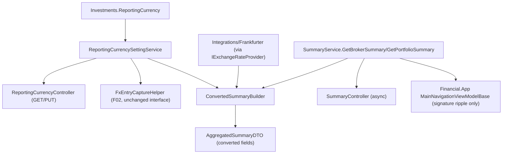

## Complexity: complex

## 1. Technical Overview

**What:** A persisted, server-side reporting-currency setting (`GBP`/`BRL`/`USD`, defaulting `GBP`)
with read/write endpoints, and converted portfolio- and broker-level totals added to
`AggregatedSummaryDTO` — computed on demand, at the finest granularity available (each
contributing transaction/credit converted individually via F01's `IExchangeRateProvider` at its
own date), never from a single spot rate applied to an already-summed native total.

**Why:** F01 promoted the FX capability and F02 taught every Transaction/Credit its own currency;
neither closes the PRD's opening problem — "no honest all-brokers total" — because nothing yet
reads that data back into one converted figure. `SummaryService.GetBrokerSummary`/
`GetPortfolioSummary` are the two existing aggregation points (`AggregatedSummaryDTO`); F03 adds
the converted figures there rather than inventing a new endpoint, and adds the one missing piece
of state — which currency to convert into — as a real persisted setting instead of F02's interim
fixed-GBP placeholder.

**Scope:**
- **Included:** Persisted `ReportingCurrency` on the `Investments` aggregate root, with read/write
  API endpoints; `AggregatedSummaryDTO` gains `ReportingCurrency`, `ConvertedMarketValue`,
  `ConvertedInvested`, `ConvertedUnrealisedGainLoss`, `ConvertedTotalReturn`,
  `ConvertedTotalReturnNetOfTax`, plus a `Partial`/`ReportingCurrencyUnavailable` signal; the
  per-transaction/credit conversion engine feeding those figures; `SummaryService`'s two existing
  methods become async to call the FX provider, which ripples (signature only, no behavior/UX
  change) into `Financial.App`'s composition of the same interface.
- **Excluded (later features in this PRD):** Any UI control, converted-figure display, or
  provenance affordance in React or WPF (F04/F05) — this feature is API/Application layer only,
  per the PRD's own framing ("No UI of its own — this is the Application/API layer; F04 and F05
  are its two front-end surfaces").

## 2. Architecture Impact



**Affected components:**

| Component | Change |
|---|---|
| `Financial.Investment.Domain/Entities/Investments.cs` | Modified — adds `ReportingCurrency` (defaults `Currency.GBP` via property initializer, so both a fresh aggregate and a legacy file missing the key resolve to `GBP`) and `SetReportingCurrency(Currency)` |
| `Financial.Investment.Application/Interfaces/IReportingCurrencyProvider.cs` | Modified — adds `Task SetReportingCurrencyAsync(Currency)`; the existing synchronous `GetReportingCurrency()` is unchanged, so F02's call sites (`FxEntryCaptureHelper`) need no changes |
| `Financial.Investment.Application/Services/ReportingCurrencySettingService.cs` | New — replaces `FixedReportingCurrencyProvider` in DI; reads/writes `Investments.ReportingCurrency` through `IInvestmentRepository` |
| `Financial.Investment.Application/Services/FixedReportingCurrencyProvider.cs` | Deleted — no longer needed once the real setting exists |
| `Financial.Investment.Application/DTOs/ReportingCurrencySettingDTO.cs` | New — `{ Currency: string }`, used for both the GET response and PUT request |
| `Financial.Investment.Application/DTOs/AggregatedSummaryDTO.cs` | Modified — adds `ReportingCurrency`, `ConvertedMarketValue`, `ConvertedInvested`, `ConvertedUnrealisedGainLoss`, `ConvertedTotalReturn`, `ConvertedTotalReturnNetOfTax`, `IsPartial`, `IsReportingCurrencyUnavailable` |
| `Financial.Investment.Application/Services/ConvertedSummaryBuilder.cs` | New — the per-record conversion engine (see §3) |
| `Financial.Investment.Application/Services/SummaryService.cs` | Modified — `GetBrokerSummary`/`GetPortfolioSummary` become `async Task<AggregatedSummaryDTO>`, call `ConvertedSummaryBuilder` |
| `Financial.Investment.Application/Interfaces/ISummaryService.cs` | Modified — signatures become `Task<AggregatedSummaryDTO>` |
| `Financial.Investment.Application/DependencyInjection/InvestmentApplicationServiceCollectionExtensions.cs` | Modified — registers `ReportingCurrencySettingService` in place of `FixedReportingCurrencyProvider` |
| `Financial.Api/Controllers/ReportingCurrencyController.cs` | New — `GET /reporting-currency`, `PUT /reporting-currency` |
| `Financial.Api/Controllers/SummaryController.cs` | Modified — `GetBrokerSummary`/`GetPortfolioSummary` actions become `async Task<ActionResult<...>>` |
| `Financial.App/ViewModels/Investment/MainNavigationViewModelBase.cs` | Modified — `LoadPortfolioCredits`/`LoadBrokerCredits` become `async Task` methods, called fire-and-forget (`_ = ...`) at their two call sites, matching this file's existing convention for other async loads; no visible behavior change |

## 3. Technical Decisions

| Decision | Chosen Approach | Alternative Considered | Trade-off |
|---|---|---|---|
| `ConvertedInvested`'s formula | `ConvertedTotalBought − ConvertedTotalSold`, each built by converting every contributing transaction's `NetCash` individually at its own date | Convert the native `TotalInvested` field's value (which for Active scope is `OpenPositionCost`, a weighted-average-cost figure) | `OpenPositionCost` is a *derived* weighted-average figure, not a sum of dated transaction amounts — decomposing it into individually-convertible per-transaction contributions would mean reimplementing `Transactions`' weighted-average replay in converted terms, which is cost-basis work the PRD explicitly defers to P50 ("FIFO, specific-identification, or a persisted disposal record — that is P50"). The flow-based net-bought-minus-sold figure is what the AC bullet's own wording describes ("the sum of each contributing transaction/credit converted individually") and is computable without touching cost-basis logic |
| `ConvertedMarketValue` / `ConvertedUnrealisedGainLoss`'s rate | Both broker- and portfolio-scoped calls only ever span **one broker** (`GetBrokerSummary`/`GetPortfolioSummary` both take a single `brokerName`), so every asset in scope shares one native currency — one `GetHistoricalRateAsync(today, brokerCurrency, reportingCurrency)` call converts the already-summed native `MarketValue` and the summed native unrealised-gain figure | Convert per-asset before summing | Per PRD: "Market value... is converted using the latest available rate as of 'today.'" Since scope is always single-broker, per-asset conversion and convert-after-sum are numerically identical here — summing first needs one rate call instead of N, with no loss of correctness. `ConvertedUnrealisedGainLoss` (not explicitly ruled on by the PRD) is treated identically to `ConvertedMarketValue` since it's the other point-in-time-only figure (`MarketValue − CostOfUnitsHeld`, both instantaneous, not dated cash flows) |
| `ConvertedTotalReturn` / `ConvertedTotalReturnNetOfTax` | Rebuild the same cash-flow series `AssetCashFlowBuilder` feeds to XIRR, but with every entry's amount converted at its own date, then run the existing `IXirrCalculationService` against the converted series and `ConvertedMarketValue` as terminal value | Convert the native rate directly (e.g. `TotalReturn × spotRate`) | `TotalReturn` is an XIRR annualized rate, not a currency amount — multiplying a rate by an FX rate is dimensionally meaningless. Re-running XIRR on a genuinely re-dated-and-converted cash-flow series is the only correct way to get a reporting-currency-denominated return rate, and is also the only way the figure can differ meaningfully from the native rate (a *constant* FX rate cancels out of XIRR's equation entirely; only rate movement across the series' dates makes the converted rate diverge, which is exactly what should be captured) |
| `Partial` / `ReportingCurrencyUnavailable` determination | Count every FX lookup attempted for the request; 0 failures → no flag; some but not all failed → `IsPartial` (sum whatever did convert, contributing 0 for failed ones); all attempted lookups failed → `IsReportingCurrencyUnavailable` (converted fields all `null`) | A single boolean success/failure flag | The PRD distinguishes the two cases explicitly with different response shapes ("the converted total is still returned, computed from whatever did convert" vs. "converted fields are omitted from the response entirely"), so both states need to be distinguishable. When the broker's currency already equals the reporting currency, zero lookups are attempted and neither flag is ever set — this is the common case for 3 of the 4 existing brokers with the GBP default |
| `SummaryService` signature change (sync → async) | `ISummaryService.GetBrokerSummary`/`GetPortfolioSummary` become `Task<AggregatedSummaryDTO>`; ripple into `Financial.App`'s two call sites converts them to `async Task` methods invoked fire-and-forget (`_ = LoadBrokerCreditsAsync(...)`), matching the pattern this same file already uses for other async loads (`_ = AssetDetails.EnsureTodayInfoLoadedAsync();`) | Block synchronously on the async FX call inside `SummaryService` (`.GetAwaiter().GetResult()`), keeping the interface synchronous | `SummaryService` is composed in-process by both `Financial.Api` (no ambient `SynchronizationContext`, so blocking is *usually* survivable) and `Financial.App`'s WPF UI thread (which *does* capture a `SynchronizationContext` — blocking synchronously there while `GetHistoricalRateAsync`'s continuation tries to resume on that same captured thread is a genuine, well-known WPF deadlock hazard). Making the interface honestly async removes the hazard entirely rather than papering over it for one host |

## 4. Component Overview

**Domain:**

| File Path | New/Modified | Purpose | Key Responsibilities |
|---|---|---|---|
| `Financial.Investment.Domain/Entities/Investments.cs` | Modified | Aggregate root | `ReportingCurrency` (defaults `Currency.GBP`), `SetReportingCurrency(Currency)` |

**Application:**

| File Path | New/Modified | Purpose | Key Responsibilities |
|---|---|---|---|
| `Financial.Investment.Application/Interfaces/IReportingCurrencyProvider.cs` | Modified | Reporting-currency seam | Adds `Task SetReportingCurrencyAsync(Currency)` |
| `Financial.Investment.Application/Services/ReportingCurrencySettingService.cs` | New | Persisted setting | Reads `Investments.ReportingCurrency` (sync, in-memory); writes it through `IInvestmentRepository.ApplyAndSaveAsync` |
| `Financial.Investment.Application/DTOs/ReportingCurrencySettingDTO.cs` | New | Wire shape | `Currency` (string) |
| `Financial.Investment.Application/DTOs/AggregatedSummaryDTO.cs` | Modified | Aggregate summary | 6 new fields, all additive |
| `Financial.Investment.Application/Services/ConvertedSummaryBuilder.cs` | New | Conversion engine | Builds every converted field for one broker/portfolio scope from its assets, the reporting currency and `IExchangeRateProvider`; caches one rate per distinct date within a call |
| `Financial.Investment.Application/Services/SummaryService.cs` | Modified | Aggregation | Calls `ConvertedSummaryBuilder` after computing the existing native figures |
| `Financial.Investment.Application/Interfaces/ISummaryService.cs` | Modified | Contract | Async signatures |
| `Financial.Investment.Application/DependencyInjection/InvestmentApplicationServiceCollectionExtensions.cs` | Modified | DI composition | `IReportingCurrencyProvider` → `ReportingCurrencySettingService` |

**Presentation:**

| File Path | New/Modified | Purpose | Key Responsibilities |
|---|---|---|---|
| `Financial.Api/Controllers/ReportingCurrencyController.cs` | New | Setting endpoint | `GET`/`PUT /reporting-currency` |
| `Financial.Api/Controllers/SummaryController.cs` | Modified | Summary endpoints | Async actions |
| `Financial.App/ViewModels/Investment/MainNavigationViewModelBase.cs` | Modified | WPF composition | Signature ripple only (§3) |

## 5. API Contracts

**Endpoint: Get Reporting Currency**
- **Method:** GET
- **Path:** `/api/v1/financial/reporting-currency`

**Response (200 OK):**

| Field | Type | Description |
|---|---|---|
| `currency` | `string` | One of `GBP`, `BRL`, `USD` |

```json
{ "currency": "GBP" }
```

**Endpoint: Set Reporting Currency**
- **Method:** PUT
- **Path:** `/api/v1/financial/reporting-currency`

**Request:**

| Field | Type | Required | Validation |
|---|---|---|---|
| `currency` | `string` | Yes | Must parse to `GBP`/`BRL`/`USD` |

```json
{ "currency": "BRL" }
```

**Response (200 OK):** same shape as GET, reflecting the now-current value.

**Error Codes:**

| Code | HTTP Status | Description |
|---|---|---|
| — | 400 | `currency` missing or not one of the three supported values |

**Endpoint: Broker / Portfolio Summary (extended)**
- **Method:** GET
- **Path:** `/api/v1/financial/summary/broker/{brokerName}`, `/api/v1/financial/summary/portfolio/{brokerName}/{portfolioName}` (unchanged paths/params)

**Response (200 OK) — added fields on `AggregatedSummaryDTO`:**

| Field | Type | Description |
|---|---|---|
| `reportingCurrency` | `string` | The currency the `Converted*` fields are expressed in |
| `convertedMarketValue` | `decimal?` | Null only when `isReportingCurrencyUnavailable` |
| `convertedInvested` | `decimal?` | Same |
| `convertedUnrealisedGainLoss` | `decimal?` | Same |
| `convertedTotalReturn` | `decimal?` | Same |
| `convertedTotalReturnNetOfTax` | `decimal?` | Same |
| `isPartial` | `bool` | Some but not all contributing records converted |
| `isReportingCurrencyUnavailable` | `bool` | No contributing record could be converted |

```json
{
  "totalBought": 1000.0,
  "totalSold": 0.0,
  "totalCredits": 25.0,
  "totalInvested": 1000.0,
  "marketValue": 1150.0,
  "holdingCount": 3,
  "unvaluedHoldingCount": 0,
  "priceOnlyReturn": 0.12,
  "totalReturn": 0.14,
  "totalReturnNetOfTax": 0.13,
  "reportingCurrency": "GBP",
  "convertedMarketValue": 168.55,
  "convertedInvested": 146.60,
  "convertedUnrealisedGainLoss": 21.95,
  "convertedTotalReturn": 0.145,
  "convertedTotalReturnNetOfTax": 0.135,
  "isPartial": false,
  "isReportingCurrencyUnavailable": false
}
```

## 6. Data Model

Not a SQL schema — JSON file persistence. `Investments` gains one new top-level string field,
`"ReportingCurrency"` (enum name, e.g. `"GBP"`). A pre-existing `data-investment.json` missing this
key deserializes it as `GBP` (the property's declared default, applied by the real parameterless
constructor `Activator.CreateInstance(type, nonPublic: true)` invokes — not bypassed by the
reflection-based JSON wiring), matching the PRD's stated default exactly, with no migration
required.

## 7. Testing Strategy

| Test File | Test Type | Target | Coverage Goal |
|---|---|---|---|
| `Tests/Financial.Investment.Domain.Tests/Domain/InvestmentsTests.cs` | Unit | `Investments` | `ReportingCurrency` defaults to `GBP`; `SetReportingCurrency` updates it |
| `Tests/Financial.Investment.Application.Tests/Services/ReportingCurrencySettingServiceTests.cs` | Unit | `ReportingCurrencySettingService` | Get reflects the aggregate's current value; Set persists through `ApplyAndSaveAsync` |
| `Tests/Financial.Investment.Application.Tests/Services/ConvertedSummaryBuilderTests.cs` | Unit | `ConvertedSummaryBuilder` | Same-currency scope → no provider calls, converted fields equal native; differing currency with a rate → each figure computed from individually-converted records; provider returns null for some records → `IsPartial`; provider returns null for every attempted lookup → `IsReportingCurrencyUnavailable`, converted fields all null |
| `Tests/Financial.Investment.Application.Tests/Services/SummaryServiceTests.cs` | Unit | `SummaryService` | Existing native-figure tests updated for the async signature; new tests assert the converted fields are populated |
| `Tests/Financial.Api.Tests/Acceptance/ReportingCurrencySettingAcceptanceTests.cs` | Integration (AC-tracing) | `GET`/`PUT /reporting-currency`, `GET /summary/broker/{name}` | One tagged test per provable §9 criterion, through the real host with a stubbed `IExchangeRateProvider` |
| `Tests/Financial.Presentation.Tests` (existing `MainNavigationViewModel*` suites) | Unit | WPF ViewModel | Existing broker/portfolio-summary-loading tests updated for the async signature; no new behavior asserted (out of scope per §1) |
