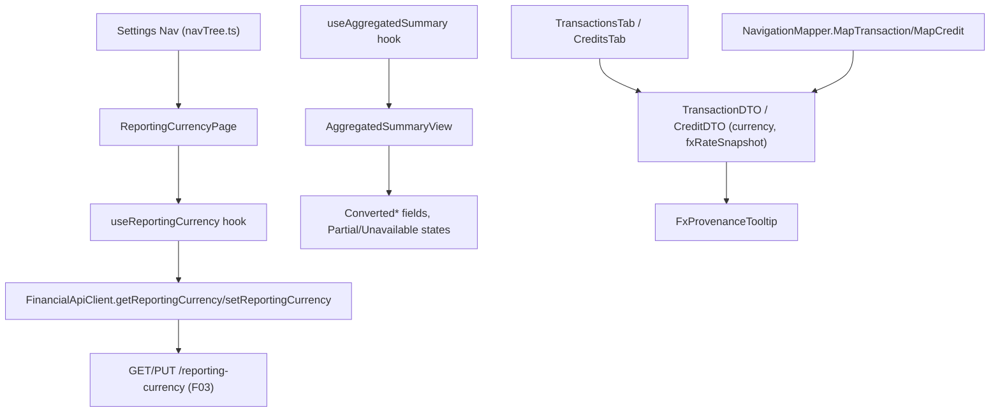

## Complexity: complex

## 1. Technical Overview

**What:** A "Reporting Currency" control under `Financial.Web`'s Settings section, converted figures
rendered alongside the existing native-currency figures on the portfolio dashboard and broker-level
summary views, and a per-record FX provenance affordance (rate, source, retrieved-at) on each
Transaction/Credit row that carries a captured `FxRateSnapshot`.

**Why:** F03 built the reporting-currency setting and converted-totals computation entirely at the
Application/API layer with no UI of its own. F04 is that UI's first surface (F05/WPF mirrors it).
Two small gaps block a purely-frontend implementation: F02 captured `Currency`/`FxRateSnapshot` on
the `Transaction`/`Credit` domain entities but never put them on the wire, and F03's `Converted*`
totals have no single associated snapshot of their own (they're computed live, per PRD §7 Out of
Scope) — so the provenance affordance belongs on the individual records that each *do* carry one
fixed snapshot, not on the aggregate total.

**Scope:**
- **Included:** `Reporting Currency` Settings page (GBP/BRL/USD, auto-save via F03's endpoint);
  `Converted*` figures + `reportingCurrency` label + `Partial`/`ReportingCurrencyUnavailable` states
  in `AggregatedSummaryView` (covers both the broker and portfolio views, since both already render
  through this one component); a small additive backend change exposing `Currency` and
  `FxRateSnapshot` on `TransactionDTO`/`CreditDTO`; a provenance icon+tooltip on each
  `TransactionsTab`/`CreditsTab` row that has a captured snapshot.
- **Excluded (later features in this PRD):** Any WPF/`Financial.App` UI (F05) — the `TransactionDTO`/
  `CreditDTO` field additions are shared with WPF (same in-process DTOs) but F05 owns rendering them
  there. Any currency beyond GBP/BRL/USD. Converting individual asset/holding rows (only
  portfolio/broker aggregates convert, per F03). Live cross-page synchronization of an
  already-mounted summary view when the setting changes elsewhere — the next fetch (e.g. on
  navigating back to the view) picks up the new value, per PRD wording ("changes ... on the very
  next read").

## 2. Architecture Impact



**Affected components:**

| Component | Change |
|---|---|
| `Financial.Investment.Application/DTOs/TransactionDTO.cs` | Modified — adds `Currency` (string) and `FxRateSnapshot` (nullable nested DTO) |
| `Financial.Investment.Application/DTOs/CreditDTO.cs` | Modified — same two additions |
| `Financial.Investment.Application/DTOs/FxRateSnapshotDTO.cs` | New — `{ ToCurrency, Rate, Source, RetrievedAt }`, mirrors the domain `FxRateSnapshot` |
| `Financial.Investment.Application/Services/NavigationMapper.cs` | Modified — `MapTransaction`/`MapCredit` populate the two new fields from the domain entity |
| `Tests/Financial.Api.Tests/Contract/openapi-v1.snapshot.json` | Regenerated — new fields on `TransactionDTO`/`CreditDTO`, new `FxRateSnapshotDTO` schema |
| `Financial.Web/src/api/generated/openapi.ts` | Regenerated from the snapshot above |
| `Financial.Web/src/api/types.ts` | Modified — adds `ReportingCurrencySettingDto`, `FxRateSnapshotDto` type aliases |
| `Financial.Web/src/api/financialApiClient.ts` | Modified — adds `getReportingCurrency`/`setReportingCurrency` |
| `Financial.Web/src/hooks/useReportingCurrency.ts` | New — GET-on-mount + auto-save-on-change, following `useAsyncResource`'s loading/error pattern |
| `Financial.Web/src/pages/ReportingCurrencyPage.tsx` | New — the Settings page itself |
| `Financial.Web/src/pages/ReportingCurrencyPage.css` | New — page-level layout, matching `AppearancePage.css`'s structure |
| `Financial.Web/src/navigation/navTree.ts` | Modified — adds the `reporting-currency` entry under the `settings` category |
| `Financial.Web/src/navigation/routes.tsx` | Modified — routes `/settings/reporting-currency` to the new page |
| `Financial.Web/src/components/AggregatedSummaryTab.tsx` | Modified — `AggregatedSummaryView` renders `Converted*` figures + `Partial`/`Unavailable` states |
| `Financial.Web/src/components/AggregatedSummaryTab.css` | Modified — styling for the new converted-figures block and inline warning |
| `Financial.Web/src/components/FxProvenanceTooltip.tsx` | New — shared icon+tooltip, takes an `FxRateSnapshotDto` and the record's own `currency` |
| `Financial.Web/src/components/TransactionsTab.tsx` | Modified — renders `FxProvenanceTooltip` per row when `fxRateSnapshot` is present |
| `Financial.Web/src/components/CreditsTab.tsx` | Modified — same, for credits |

## 3. Technical Decisions

| Decision | Chosen Approach | Alternative Considered | Trade-off |
|---|---|---|---|
| Provenance affordance placement | Per Transaction/Credit row in `TransactionsTab`/`CreditsTab`, showing that one record's own captured `FxRateSnapshot` | Attach to the aggregated converted-total figure | Per PRD §7 Out of Scope, F03's converted totals compute live from each record's `Currency`/date and have no single associated snapshot — there is nothing truthful to show "on the total" itself. Each Transaction/Credit, by contrast, has exactly one fixed entry-time snapshot (or none, if its currency already matched the reporting currency at capture time) |
| Backend DTO exposure scope | Included in F04 as Phase 1 (small, additive-only change to `TransactionDTO`/`CreditDTO`) | Split into a separate backend-only PR ahead of F04 | F02 captured this data but exposing it was explicitly deferred to whichever front-end feature needed it first; bundling it with the one PR that actually consumes it avoids a disconnected backend-only PR with no visible feature behind it |
| Reporting Currency selector save behavior | Auto-save on change (calls `PUT /reporting-currency` immediately, mirrors `AppearancePage`'s radio-group pattern) | Explicit "Save" button | Matches the PRD's Success flow wording ("changing the Reporting Currency selector immediately re-fetches") and the one other settings-with-options pattern already in the codebase; a currency choice is low-risk and reversible, unlike a destructive action |
| Cross-view synchronization on setting change | None — rely on the existing per-mount `useAsyncResource` fetch; the summary view picks up the new setting whenever it next mounts/loads | A shared React context broadcasting the current reporting currency to any mounted summary view | Settings and the investment tree are separate routes in this SPA; navigating between them already unmounts/remounts the summary components, so a global store would add complexity without changing user-observable behavior for this app's actual navigation model |
| Converted-figures layout in `AggregatedSummaryView` | A second `aggregated-summary__grid`-style block below the native figures, each row labelled with the reporting currency (e.g. "Market Value (converted to GBP)"), reusing the same `formatN2`/`signClass` helpers already used for the native block | Interleave converted figures next to their native counterpart in the same grid | PRD Capabilities: "each clearly labelled with its currency ... so the two are never visually ambiguous" — a visually distinct second block reads more unambiguously than adjacent same-row values, and needs no per-field layout rework of the existing grid |

## 4. Component Overview

**Backend (Application):**

| File Path | New/Modified | Purpose | Key Responsibilities |
|---|---|---|---|
| `Financial.Investment.Application/DTOs/FxRateSnapshotDTO.cs` | New | Wire shape for entry-time FX provenance | `ToCurrency` (string), `Rate` (decimal), `Source` (string), `RetrievedAt` (DateTimeOffset) |
| `Financial.Investment.Application/DTOs/TransactionDTO.cs` | Modified | Wire shape | Adds `Currency` (string), `FxRateSnapshot` (`FxRateSnapshotDTO?`) |
| `Financial.Investment.Application/DTOs/CreditDTO.cs` | Modified | Wire shape | Same two additions |
| `Financial.Investment.Application/Services/NavigationMapper.cs` | Modified | Entity → DTO mapping | `MapTransaction`/`MapCredit` populate `Currency`/`FxRateSnapshot` from the domain entity, mapping a `null` domain snapshot to a `null` DTO field |

**Frontend:**

| File Path | New/Modified | Purpose | Key Responsibilities |
|---|---|---|---|
| `Financial.Web/src/api/types.ts` | Modified | Type aliases | `ReportingCurrencySettingDto`, `FxRateSnapshotDto` |
| `Financial.Web/src/api/financialApiClient.ts` | Modified | Typed HTTP client | `getReportingCurrency(): Promise<ReportingCurrencySettingDto>`, `setReportingCurrency(request): Promise<ReportingCurrencySettingDto>` |
| `Financial.Web/src/hooks/useReportingCurrency.ts` | New | Settings-page state | Fetches the current value on mount; `setCurrency` calls the PUT endpoint and updates local state on success, surfacing a save-specific error distinct from the load error |
| `Financial.Web/src/pages/ReportingCurrencyPage.tsx` | New | Settings page | Renders a `RadioGroup`/`Select` of the three currencies bound to the hook, with `LoadingState`/`ErrorState` for the initial fetch and an inline `MessageBar` for a save failure |
| `Financial.Web/src/navigation/navTree.ts` | Modified | Nav registration | Adds `{ id: 'reporting-currency', label: 'Reporting Currency', route: '/settings/reporting-currency' }` under `settings` |
| `Financial.Web/src/navigation/routes.tsx` | Modified | Routing | Maps the new route to `ReportingCurrencyPage` |
| `Financial.Web/src/components/AggregatedSummaryTab.tsx` | Modified | Summary rendering | `AggregatedSummaryView` renders a converted-figures block (market value, invested, unrealised gain/loss, total return, total return net of tax) labelled with `reportingCurrency`; renders the `Partial` inline warning (reusing the existing `role="status"` pattern) or hides the converted block entirely with a retry-styled note when `isReportingCurrencyUnavailable` |
| `Financial.Web/src/components/FxProvenanceTooltip.tsx` | New | Shared provenance affordance | An info icon that, on hover/focus, shows the record's own currency → `fxRateSnapshot.toCurrency` rate, `source`, and `retrievedAt` (via `formatDateTime`); renders nothing when `fxRateSnapshot` is `null` |
| `Financial.Web/src/components/TransactionsTab.tsx` | Modified | Transaction rows | Adds the provenance affordance to each row alongside the existing action column |
| `Financial.Web/src/components/CreditsTab.tsx` | Modified | Credit rows | Same, for credits |

## 5. API Contracts

**Endpoint: Get Reporting Currency** *(existing, from F03 — consumed here for the first time)*
- **Method:** GET
- **Path:** `/api/v1/financial/reporting-currency`
- **Response (200 OK):** `{ "currency": "GBP" }`

**Endpoint: Set Reporting Currency** *(existing, from F03 — consumed here for the first time)*
- **Method:** PUT
- **Path:** `/api/v1/financial/reporting-currency`
- **Request:** `{ "currency": "BRL" }`
- **Response (200 OK):** same shape, reflecting the now-current value
- **Error Codes:** 400 if `currency` is missing or unrecognized — surfaced as an inline save error, the previously-selected value stays shown (no optimistic UI rollback needed since the control isn't changed until the response succeeds)

**Endpoint: Broker / Portfolio Summary** *(existing, from F03 — consumed here for the first time)*
- No contract change. `reportingCurrency`, `convertedMarketValue`, `convertedInvested`,
  `convertedUnrealisedGainLoss`, `convertedTotalReturn`, `convertedTotalReturnNetOfTax`, `isPartial`,
  `isReportingCurrencyUnavailable` are already present on `AggregatedSummaryDTO` (F03) and now get a
  UI.

**Endpoint: Transaction/Credit lists (via Asset Details)** *(existing — response shape extended)*
- **Method:** GET
- **Path:** `/api/v1/financial/assets/{brokerName}/{portfolioName}/{assetName}` (unchanged path)

**Response (200 OK) — added fields on `TransactionDTO` and `CreditDTO`:**

| Field | Type | Description |
|---|---|---|
| `currency` | `string` | The record's own currency (`GBP`/`BRL`/`USD`), auto-derived from the broker per F02 |
| `fxRateSnapshot` | `FxRateSnapshotDTO?` | Null if the record's currency already matched the reporting currency at entry time (F02); otherwise the fixed audit snapshot captured then |

**`FxRateSnapshotDTO`:**

| Field | Type | Description |
|---|---|---|
| `toCurrency` | `string` | The reporting currency in effect when this record was captured |
| `rate` | `decimal` | The captured rate, `currency` → `toCurrency` |
| `source` | `string` | The FX data source (currently always `"Frankfurter"`) |
| `retrievedAt` | `string` (date-time) | When the rate was fetched |

```json
{
  "id": "e3b0c442-...",
  "date": "2026-07-01T00:00:00",
  "type": "Buy",
  "quantity": 10,
  "unitPrice": 9.99,
  "fees": 0,
  "withheld": 0,
  "netCash": -99.9,
  "currency": "BRL",
  "fxRateSnapshot": {
    "toCurrency": "GBP",
    "rate": 0.146,
    "source": "Frankfurter",
    "retrievedAt": "2026-07-01T08:00:00Z"
  }
}
```

## 6. Data Model

No storage change — `TransactionDTO`/`CreditDTO` are response-only shapes projected from the
already-persisted `Transaction`/`Credit` domain entities (F02). The OpenAPI snapshot and the
generated frontend types are regenerated to reflect the two new fields and the new
`FxRateSnapshotDTO` schema.

## 7. Testing Strategy

| Test File | Test Type | Target | Coverage Goal |
|---|---|---|---|
| `Tests/Financial.Investment.Application.Tests/Services/NavigationMapperTests.cs` | Unit | `NavigationMapper.MapTransaction`/`MapCredit` | Currency and a populated `FxRateSnapshot` map through correctly; a `null` domain snapshot maps to a `null` DTO field |
| `Tests/Financial.Api.Tests/Contract/OpenApiContractTests.cs` | Contract | Committed snapshot | Existing test re-passes once the snapshot is regenerated to include the new fields |
| `Financial.Web/src/hooks/__tests__/useReportingCurrency.test.ts` | Unit | `useReportingCurrency` | Loads the current value on mount; `setCurrency` calls the PUT endpoint and updates local state on success; a PUT failure surfaces a save error without discarding the last-known-good value |
| `Financial.Web/src/pages/__tests__/ReportingCurrencyPage.test.tsx` | Component | `ReportingCurrencyPage` | Renders the three options; selecting one calls the hook's `setCurrency`; shows `LoadingState` while fetching and `ErrorState` on load failure — covers **AC-01** |
| `Financial.Web/src/components/__tests__/AggregatedSummaryTab.test.tsx` | Component | `AggregatedSummaryView` | Renders every `Converted*` figure labelled with `reportingCurrency` alongside the native ones — covers **AC-02**; shows the inline `Partial` warning when `isPartial` — covers **AC-04**; hides the converted block with a retry affordance and leaves native figures visible when `isReportingCurrencyUnavailable` — covers **AC-05** |
| `Financial.Web/src/components/__tests__/FxProvenanceTooltip.test.tsx` | Unit | `FxProvenanceTooltip` | Renders rate/source/retrieved-at when given a snapshot; renders nothing when `fxRateSnapshot` is `null` — covers **AC-03** |
| `Financial.Web/src/components/__tests__/TransactionsTab.test.tsx` / `CreditsTab.test.tsx` | Component | Row rendering | A row whose record carries an `fxRateSnapshot` shows the provenance affordance; a row without one doesn't |
| `Financial.Web/src/api/generated/__tests__/openapiFreshness.test.ts` | Existing | Generated types freshness | Re-passes once `openapi.ts` is regenerated from the updated snapshot |

**Cross-Feature Integration** (from PRD §9, referencing F04):
- "F03's reporting-currency setting and converted totals render identically ... in both F04 (React)
  and F05 (WPF)" — F05 will assert this once it exists; F04's own component tests establish the
  React-side baseline (labels, numbers, flag meaning) that F05 is expected to match.
- "F02's entry-time `FxRateSnapshot` for a given record displays identically ... in both F04 and
  F05's provenance affordance" — same: `FxProvenanceTooltip`'s component test is the React-side
  baseline.
