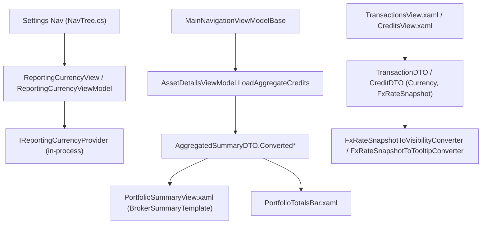

## Complexity: complex

## 1. Technical Overview

**What:** A "Reporting Currency" control in `Financial.App`'s Settings area, converted figures shown
alongside the native ones on the broker- and portfolio-level summary views, and a per-record FX
provenance affordance on Transaction/Credit rows — the WPF mirror of F04, per the PRD's explicit
framing ("Mirrors F04").

**Why:** F04 built this UI for `Financial.Web`, the UX source of truth; F05 is WPF's equivalent
surface, per the repo's React-led-parity rule. Unlike F04, no backend DTO work is needed here:
`Financial.App` composes the Investment Application layer in-process (`services.AddFinancialApplication()`
in `App.xaml.cs`), and `TransactionDTO`/`CreditDTO` already carry `Currency`/`FxRateSnapshot` (added
in F04's Stage 1, shared by both front ends since they're the same in-process Application DTOs) —
F05 only has to bind to data that already exists.

**Scope:**
- **Included:** A `ReportingCurrencyView`/`ReportingCurrencyViewModel` Settings page (GBP/BRL/USD,
  auto-save via the in-process `IReportingCurrencyProvider`); `Converted*` figures + `ReportingCurrency`
  label + `Partial`/`ReportingCurrencyUnavailable` states added to `AssetDetailsViewModel`'s existing
  broker/portfolio summary properties and their two XAML render sites (`PortfolioSummaryView.xaml`'s
  `BrokerSummaryTemplate`, `PortfolioTotalsBar.xaml`); a provenance-affordance `DataGrid` column in
  `TransactionsView.xaml` and `CreditsView.xaml`.
- **Excluded:** Any change to `Financial.Web` or the backend (both already shipped in F03/F04).
  Any currency beyond GBP/BRL/USD. Converting individual asset/holding rows. Live cross-view
  synchronization of an already-open summary when the setting changes elsewhere in the same running
  app — same as F04, the next load (re-selecting the node, or re-opening the app) picks up the new
  value.

## 2. Architecture Impact

**Affected components:**

| Component | Change |
|---|---|
| `Financial.App/ViewModels/Settings/ReportingCurrencyViewModel.cs` | New — `IsGbpSelected`/`IsBrlSelected`/`IsUsdSelected`, backed by `IReportingCurrencyProvider` |
| `Financial.App/Views/Settings/ReportingCurrencyView.xaml(.cs)` | New — the Settings page itself |
| `Financial.App/Navigation/NavTree.cs` | Modified — adds the `reporting-currency` `NavChild` under the `settings` category |
| `Financial.App/MainWindow.xaml.cs` | Modified — injects `ReportingCurrencyView` and registers it under the `settings-reporting-currency` view key |
| `Financial.App/App.xaml.cs` | Modified — registers `ReportingCurrencyViewModel`/`ReportingCurrencyView` in the DI container |
| `Financial.App/ViewModels/Investment/AssetDetailsViewModel.cs` | Modified — adds `ReportingCurrency`, `ConvertedMarketValue`, `ConvertedInvested`, `ConvertedUnrealisedGainLoss`, `ConvertedTotalReturn`, `ConvertedTotalReturnNetOfTax`, `IsPartial`, `IsReportingCurrencyUnavailable`, populated in `LoadAggregateCredits` |
| `Financial.App/Views/Investment/PortfolioSummaryView.xaml` | Modified — `BrokerSummaryTemplate` renders the converted-figures block |
| `Financial.App/Views/Investment/PortfolioTotalsBar.xaml` | Modified — same, for the Portfolio scope's shared totals bar |
| `Financial.App/Converters/FxRateSnapshotToVisibilityConverter.cs` | New — `Visibility.Visible` only when a `FxRateSnapshotDTO` is present |
| `Financial.App/Converters/FxRateSnapshotToTooltipConverter.cs` | New — `IMultiValueConverter` building the three-line provenance text from `Currency` + `FxRateSnapshot` |
| `Financial.App/Views/Investment/TransactionsView.xaml` | Modified — adds the FX provenance column |
| `Financial.App/Views/Investment/CreditsView.xaml` | Modified — same, for credits |

## 3. Technical Decisions

| Decision | Chosen Approach | Alternative Considered | Trade-off |
|---|---|---|---|
| Reporting Currency page loading state | None — `IReportingCurrencyProvider.GetReportingCurrency()` is synchronous and in-process, so the initial value is available immediately in the constructor, unlike F04's React page which needs a loading state for its HTTP round trip | Add a loading flag for visual parity with F04 | There is nothing to wait for; a loading state that never actually shows anything would be dead code. `SetReportingCurrencyAsync` (the one genuinely async call) still gets its own save-error handling, mirroring F04's `saveError` |
| Provenance tooltip content | Three lines, matching F04's exactly: `1 {currency} = {rate} {toCurrency}`, `Source: {source}`, `Retrieved: {date}` | A condensed single-line tooltip | Confirmed with the user — exact content parity with React, not just equivalent information, satisfies the PRD's "same provenance affordance" wording most directly |
| Provenance affordance mechanism | A `DataGridTemplateColumn` with a `ui:SymbolIcon` (Info) whose `ToolTip` is built by a small `IMultiValueConverter` from the row's own `Currency` + `FxRateSnapshot`; hidden via a second converter when `FxRateSnapshot` is `null` | Bind `TransactionDTO`/`CreditDTO`'s `FxRateSnapshot` object directly into a `ToolTipService.ToolTip` DataTemplate | A converter-built string is simpler to bind from a `DataGridTemplateColumn.CellTemplate` (which needs a `MultiBinding` anyway, since the tooltip needs both `Currency` and `FxRateSnapshot` from the same row) and keeps the formatting logic in one testable place rather than spread across XAML |
| Where converted figures render | Both of WPF's two existing summary render sites — the `BrokerSummaryTemplate` inline grid (`PortfolioSummaryView.xaml`) and the shared `PortfolioTotalsBar.xaml` (used by the Portfolio scope) | Extract a single shared "summary figures" `UserControl` used by both, mirroring React's one shared `AggregatedSummaryView` | The two WPF templates already have independent, non-identical layouts (grid vs. horizontal bar) predating this feature; unifying them is a pre-existing structural difference out of scope for a currency feature. Both are still driven by the same `AssetDetailsViewModel` properties, so the two forks can never disagree on values, only on layout |
| Settings page persistence field naming | Extends `AssetDetailsViewModel` (already the single class backing all broker/portfolio/asset summary bindings) rather than a new dedicated summary ViewModel | Introduce a new `AggregatedSummaryViewModel` wrapping just the converted fields | `AssetDetailsViewModel` is demonstrably the established single source for every `AggregatedSummaryDTO` field already (`TotalBought`, `MarketValue`, etc., all populated in the same `LoadAggregateCredits` method) — splitting the converted fields into a second class would fragment one cohesive DTO mapping across two classes for no benefit |

## 4. Component Overview

**Settings:**

| File Path | New/Modified | Purpose | Key Responsibilities |
|---|---|---|---|
| `Financial.App/ViewModels/Settings/ReportingCurrencyViewModel.cs` | New | Settings state | Three `IsXSelected` boolean properties (mirroring `ColourModeViewModel`'s pattern), each setter firing `SetReportingCurrencyAsync` fire-and-forget (matching the codebase's established async convention) and surfacing a `SaveError` |
| `Financial.App/Views/Settings/ReportingCurrencyView.xaml(.cs)` | New | Settings page | Three `RadioButton`s bound to the VM's `IsXSelected` properties, plus a save-error `TextBlock` |
| `Financial.App/Navigation/NavTree.cs` | Modified | Nav registration | Adds `new NavChild("reporting-currency", "Reporting Currency", "settings-reporting-currency")` |
| `Financial.App/MainWindow.xaml.cs` | Modified | View routing | Injects and registers the new view under its view key |
| `Financial.App/App.xaml.cs` | Modified | DI composition | `services.AddTransient<ReportingCurrencyViewModel>()` / `<ReportingCurrencyView>()` |

**Summary views:**

| File Path | New/Modified | Purpose | Key Responsibilities |
|---|---|---|---|
| `Financial.App/ViewModels/Investment/AssetDetailsViewModel.cs` | Modified | Summary state | New bindable properties for every `Converted*` field, `ReportingCurrency`, `IsPartial`, `IsReportingCurrencyUnavailable`; populated in `LoadAggregateCredits` alongside the existing native fields |
| `Financial.App/Views/Investment/PortfolioSummaryView.xaml` | Modified | Broker summary rendering | `BrokerSummaryTemplate` gains a converted-figures block below the native grid, labelled with `ReportingCurrency`, plus the `Partial`/`Unavailable` messages |
| `Financial.App/Views/Investment/PortfolioTotalsBar.xaml` | Modified | Portfolio summary rendering | Same block, appended to the existing shared totals bar |

**Provenance affordance:**

| File Path | New/Modified | Purpose | Key Responsibilities |
|---|---|---|---|
| `Financial.App/Converters/FxRateSnapshotToVisibilityConverter.cs` | New | Icon visibility | `Visibility.Visible` iff the bound `FxRateSnapshotDTO?` is non-null |
| `Financial.App/Converters/FxRateSnapshotToTooltipConverter.cs` | New | Tooltip text | `IMultiValueConverter` taking `[Currency, FxRateSnapshot]`, returning the three-line provenance string (or `string.Empty` if the snapshot is null, matching the hidden-icon case) |
| `Financial.App/Views/Investment/TransactionsView.xaml` | Modified | Transaction rows | New unlabelled `DataGridTemplateColumn` with the info icon, ahead of the existing action column |
| `Financial.App/Views/Investment/CreditsView.xaml` | Modified | Credit rows | Same, for credits |

## 5. API Contracts

None — this feature is WPF-only, consuming the already-existing in-process
`IReportingCurrencyProvider` and `AggregatedSummaryDTO`/`TransactionDTO`/`CreditDTO` shapes shipped
by F03/F04. No HTTP endpoint is added, changed, or consumed.

## 6. Data Model

No storage change. `Financial.App` reads the same `Investments.ReportingCurrency` setting and the
same `Transaction`/`Credit.Currency`/`FxRateSnapshot` domain data as `Financial.Api`, through the
same `IInvestmentRepository`/`IReportingCurrencyProvider`/`ISummaryService` — no separate WPF data
path exists to keep in sync.

## 7. Testing Strategy

| Test File | Test Type | Target | Coverage Goal |
|---|---|---|---|
| `Tests/Financial.Presentation.Tests/ViewModels/Settings/ReportingCurrencyViewModelTests.cs` | Unit | `ReportingCurrencyViewModel` | Initial selection reflects `IReportingCurrencyProvider.GetReportingCurrency()`; setting `IsXSelected = true` calls `SetReportingCurrencyAsync` with the right `Currency` and updates the other two properties to unselected; a save failure surfaces `SaveError` without reverting the selection |
| `Tests/Financial.Presentation.Tests/ViewModels/AssetDetailsViewModelBrokerSummaryTests.cs` (extended) | Unit | `AssetDetailsViewModel` | `LoadBrokerSummary`/`LoadPortfolioSummary`/`LoadPortfolioCredits` map every `Converted*` field, `ReportingCurrency`, `IsPartial`, `IsReportingCurrencyUnavailable` from the DTO onto the VM |
| `Tests/Financial.Presentation.Tests/Converters/FxRateSnapshotToVisibilityConverterTests.cs` | Unit | New converter | Non-null snapshot → `Visible`; null → `Collapsed` |
| `Tests/Financial.Presentation.Tests/Converters/FxRateSnapshotToTooltipConverterTests.cs` | Unit | New converter | Builds the three-line text from a populated snapshot; returns empty for a null snapshot |
| `Tests/Financial.Presentation.Tests/Contract` (existing XAML binding-contract suite, extended) | Contract | `TransactionsView`/`CreditsView`/`PortfolioSummaryView` bindings | New bindings resolve against real VM/DTO properties (no typo'd `Binding` paths) |

**Cross-Feature Integration** (from PRD §9, referencing F05):
- "F03's reporting-currency setting and converted totals render identically ... in both F04 (React)
  and F05 (WPF)" — proven by this feature's own unit tests asserting the same labels/values/flag
  meanings F04's component tests already established as the baseline.
- "F02's entry-time `FxRateSnapshot` for a given record displays identically ... in both F04 and
  F05's provenance affordance" — proven by `FxRateSnapshotToTooltipConverterTests` matching F04's
  `FxProvenanceTooltip` content format exactly (confirmed via the tooltip-format decision above).
