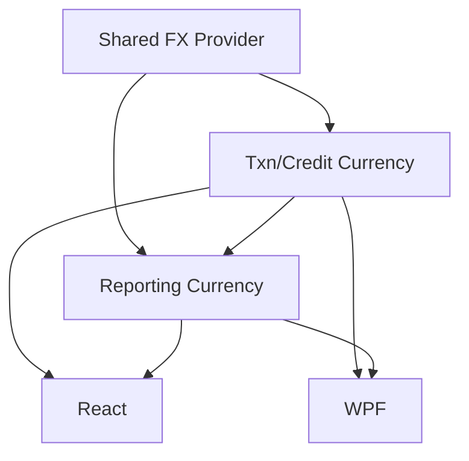

# Multi-Currency and Reporting Currency

## 1. Executive Summary

Multi-Currency and Reporting Currency gives the Investment bounded context an honest cross-broker
total for the first time. Today a transaction's currency is implied only by the broker it sits
under (three UK brokers in GBP, one Brazilian broker in BRL), there is no dated FX rate anywhere in
the domain, and the portfolio-level dashboard cannot sum a GBP holding and a BRL holding into one
number without silently mixing units. This feature closes that gap for the single self-hosted user
of this tool: every transaction and income event records its own currency and an auditable snapshot
of the exchange rate that applied when it was captured, a reporting currency becomes an explicit,
persisted, user-changeable setting, and the portfolio and broker-level dashboards gain a
converted total in that reporting currency — always shown alongside, never in place of, each
holding's original native-currency figures.

The work reuses machinery that already exists rather than building new infrastructure:
`IExchangeRateProvider` and its Frankfurter-backed implementation already live in the CashFlow
bounded context (built for `ControleMãe` reconciliation) and already fetch a dated historical rate
between two currencies. This feature promotes that interface into the shared kernel
(`Financial.Shared.Abstractions`) so both bounded contexts consume the identical capability, relocates
the vendor-specific implementation into its own `Integrations/Frankfurter` project per the
established vendor-SDK-isolation convention, and builds Investment's currency and reporting-currency
capabilities on top of it. Per the roadmap's own framing, this wave gates only the all-brokers
consolidated view — every existing per-broker and per-asset view already works correctly today and
is untouched by this feature.

## 2. Problem and Opportunity

**The Problem**

- **No honest all-brokers total.** `AggregatedSummaryDTO` and every dashboard total today either
  silently sum GBP and BRL figures as if they were the same unit, or are scoped to a single broker
  to avoid the question. A user with holdings split across a BRL broker and three GBP brokers has no
  single figure for "what is my portfolio worth."
- **Currency is inferred, not recorded.** `Transaction` and `Credit` carry no currency of their own —
  it is read off the parent `Broker.Currency` string at display time. A multi-currency account, or a
  future broker that settles in a currency other than its "home" one, cannot be represented.
- **No dated FX rate exists anywhere in the domain.** `IExchangeRateProvider` already exists and is
  proven in production (CashFlow's `ControleMãe` reconciliation), but Investment has no access to it
  and no field to store a rate against, so even a one-off manual conversion has no audit trail.
- **No user control over which currency "the number" is in.** There is no setting anywhere that says
  "show me totals in GBP" versus "show me totals in BRL" — the question has never had an answer to
  configure.

**The Opportunity**

- Promoting the existing, already-tested `IExchangeRateProvider` into the shared kernel turns a
  CashFlow-only capability into a cross-context one with no new external integration risk — solves
  the "no dated FX rate" problem with code that already works.
- Adding `Currency` to `Transaction` and `Credit`, with a captured historical-rate snapshot at entry
  time, solves "currency is inferred" and gives every converted figure an auditable "what rate applied
  when this was recorded" trail — consistent with the provenance pattern Wave 2 (P48) already
  established for price snapshots.
- A persisted, server-side reporting-currency setting, read by both front ends, solves "no user
  control" while guaranteeing React and WPF always show the identical converted number — consistent
  with Wave 0's rule that a shared figure has exactly one server-side owner.
- Converting at the portfolio and broker level only, computed on demand from each transaction's own
  currency, date and amount rather than from a single spot rate, solves "no honest all-brokers total"
  precisely and without needing to touch or re-migrate every existing per-asset view.

## 3. Target Audience

### Primary Users

**Self-hosted personal investor holding assets across currencies**
- Holds investments through brokers in more than one currency (today: three UK brokers in GBP, one
  Brazilian broker in BRL) and wants one combined figure for total portfolio value and return.
- Wants to choose which currency that combined figure is expressed in, and expects it to be the same
  answer whether viewed in the React web app or the WPF desktop app.
- Trusts the tool for financial record-keeping and expects every converted figure to be traceable back
  to the rate and date it was computed from, not a black-box number.

## 4. Objectives

**Product Objectives**

- **Unify** portfolio and broker-level totals into one reporting currency without discarding each
  holding's original currency figures.
- **Preserve** full audit provenance for every currency conversion: which rate, from which source, as
  of which date.
- **Extend** the exchange-rate capability from CashFlow-only to a shared capability both bounded
  contexts consume identically, with no duplicated FX logic.
- **Maintain** React/WPF parity for every new reporting-currency control and converted figure.

**Success Metrics**

- 100% of existing brokers (4 of 4) have every transaction and credit carrying an explicit `Currency`
  after the one-time migration, verified against a temp copy before the live file is touched.
- The portfolio dashboard shows exactly one converted total figure per metric (market value, invested,
  unrealised, total return, net-of-tax total return) in the selected reporting currency, with 0
  discrepancies between `Financial.Web` and `Financial.App` for the same underlying data.
- 0 duplicated FX-conversion implementations: `Financial.CashFlow` and `Financial.Investment` both
  resolve the same `Financial.Shared.Abstractions.IExchangeRateProvider`, with the CashFlow-local
  interface and implementation removed, not left as a second copy.
- Changing the reporting-currency setting updates every converted figure in both front ends within one
  page reload / one API round trip, with no stale cached value shown.

## 5. User Stories

### F01. Shared Exchange Rate Provider
- As the system, I want the exchange-rate lookup capability promoted to the shared kernel so that both CashFlow and Investment can convert currency without duplicating the Frankfurter integration
- As the system, I want the Frankfurter-specific implementation isolated in its own vendor project so that no bounded context reaches into a vendor SDK directly
- As the system, I want a rate lookup that falls back to the nearest earlier available date so that weekends and bank holidays don't produce spurious failures

### F02. Transaction and Credit Currency
- As the system, I want every new Transaction and Credit to record its own currency so that a holding's cash flows are no longer inferred from its broker alone
- As the system, I want an immutable snapshot of the exchange rate that applied when a Transaction or Credit was recorded so that I can show the user what rate was in effect at that time
- As a user, I want my existing transactions and credits to pick up their currency automatically the next time the app loads my data, with no separate tool to run, so that nothing I already recorded loses its currency identity and rolling back to an older data file never leaves me needing to re-run a fix-up step

### F03. Reporting Currency Setting and Converted Totals
- As a user, I want to choose a reporting currency (GBP, BRL or USD) so that I can see one combined figure for my whole portfolio
- As a user, I want the portfolio-level and each broker-level total converted into my chosen reporting currency so that I can compare and add up holdings that are actually priced in different currencies
- As a user, I want to still see each broker's own total in its native currency alongside the converted one so that I never lose the figure I'm used to
- As a user, I want to know when a converted figure could not be fully computed (for example, a rate that could not be found) so that I don't mistake an incomplete total for a complete one

### F04. React — Reporting Currency
- As a user, I want a "Reporting Currency" control under Settings so that I can change which currency my totals are shown in
- As a user, I want the portfolio dashboard and broker-level views to show the converted total clearly labelled with its currency so that I never confuse it with a native-currency figure
- As a user, I want to see the rate and date used for a transaction's conversion so that I can verify a converted figure

### F05. WPF — Reporting Currency
- As a user, I want the same Reporting Currency setting and converted totals in the desktop app as in the web app so that switching between the two feels the same
- As a user, I want the same rate/date provenance available in the desktop app so that I have equivalent auditability in either front end

## 6. Functionalities

### F01. Shared Exchange Rate Provider

**Provides:**
- Dated historical exchange-rate lookup between any two supported currencies (used by F02, F03)

**Capabilities:**
- `IExchangeRateProvider` moves from `Financial.CashFlow.Application.Interfaces` to
  `Financial.Shared.Abstractions`, method signature unchanged (`GetHistoricalRateAsync(DateOnly date,
  Currency from, Currency to)` returning a nullable rate).
- The `Currency` type it operates on is promoted alongside it and widened from its current two values
  (`GBP`, `BRL`) to three (`GBP`, `BRL`, `USD`) — the set this wave supports; adding a further currency
  later is a one-line enum addition, consistent with how `CountryCode` and `GlobalAssetClass` are
  already extended in this codebase.
- The Frankfurter-specific HTTP implementation (`FrankfurterExchangeRateProvider`) relocates from
  `Financial.CashFlow.Infrastructure.Services` into a new `Integrations/Frankfurter` project — a
  vendor SDK boundary, matching every other third-party integration in `Integrations/` — and is
  registered against the shared interface for both bounded contexts' DI containers.
- `Financial.CashFlow.Application.Services.ControleMaeService` switches to the shared interface with
  no behavioural change; the CashFlow-local `IExchangeRateProvider` interface and its
  `FrankfurterExchangeRateProvider` implementation are deleted, not kept as a second copy.
- **Rate-unavailable fallback:** when the provider has no rate for the exact requested date (a
  weekend or bank holiday has none by definition), it steps backward one calendar day at a time, up
  to 10 calendar days, until it finds an available rate. If no rate is found within that window, the
  method returns `null`, exactly as it does today — callers already handle a null rate.

**Experience:**
Entirely behind the scenes — no UI surface. CashFlow's existing `ControleMãe` reconciliation feature
continues to work identically after the move; its existing tests passing unchanged is the acceptance
signal for this feature.

**Error Handling:**
- Frankfurter API unreachable or returns an error: logged as a warning (unchanged from today), the
  call returns `null` rather than throwing, and the caller decides how to proceed (F02 leaves the
  entry-time snapshot unset; F03 excludes that figure from the converted total and flags it).
- No rate found even after the 10-day backward search: treated identically to a provider failure —
  returns `null`, never a fabricated or interpolated rate.

### F02. Transaction and Credit Currency

**Consumes:**
- F01: dated historical exchange-rate lookup

**Provides:**
- Transaction and Credit amount, currency and date (used by F03 for on-demand reporting-currency
  conversion)
- Entry-time FX-rate snapshot per Transaction/Credit: target currency, rate, source, retrieved-at
  (used by F04, F05 for per-record provenance display)

**Capabilities:**
- `Transaction` and `Credit` each gain a `Currency` field (the shared enum from F01), auto-filled at
  entry from the asset's broker currency and not user-editable this wave — a multi-currency broker
  account is out of scope (see §7).
- Each also gains a nullable `FxRateSnapshot` (`ToCurrency`, `Rate`, `Source`, `RetrievedAt`), captured
  once at entry time via F01 against whichever reporting currency (F03) is configured at that moment,
  and never recomputed afterward — it is a fixed audit record of "what rate applied when this was
  recorded," not an input to later conversion math. When a record's own `Currency` already matches the
  reporting currency at entry time, no snapshot is created (the implicit rate is 1).
- **Automatic backfill on load**, following the repo's established versioned-JSON-migration pattern
  (`Financial.Investment.Infrastructure.Persistence.InvestmentDataMigrations`, the same mechanism
  already used for the Version 1→2 and 2→3 shape changes): every existing Transaction and Credit
  missing a `Currency` has it set from its own asset's broker currency the next time
  `data-investment.json` is loaded, with no separate tool, no manual backup step, and no ceremony —
  the same way every earlier schema change in this file already self-heals on load. Idempotent by
  construction (only a record without a `Currency` is ever touched).
- Backfilling a historical `FxRateSnapshot` for these pre-existing records is explicitly **out of
  scope** (see §7): the on-load migration is synchronous, in-memory JSON reshaping with no external
  call, and a live FX lookup has no place there. A record backfilled this way carries no
  rate/source/retrieved-at provenance — the identical shape a record whose currency already matched
  the reporting currency at entry time has (§7 "Retroactively re-targeting a historical
  `FxRateSnapshot`").

**Experience:**
No new user-facing surface in this feature. Transaction and Credit entry forms (React and WPF) are
unchanged — currency is derived automatically, not prompted for.

**Error Handling:**
- The migration only ever sets a field that's absent; it never overwrites an already-populated
  `Currency`, so it is safe to run on a file that mixes already-migrated and legacy records (or one
  written by a version of the app newer than the reader's).
- A broker whose stored `Currency` string is missing or blank leaves that broker's transactions and
  credits untouched by the migration rather than writing a guessed value.

### F03. Reporting Currency Setting and Converted Totals

**Consumes:**
- F01: dated historical exchange-rate lookup
- F02: Transaction and Credit amount, currency and date

**Provides:**
- Reporting currency setting value (used by F04, F05)
- Converted portfolio- and broker-level totals in the reporting currency, alongside the existing
  native-currency figures (used by F04, F05)

**Capabilities:**
- A new persisted, server-side setting: reporting currency, one of `GBP` / `BRL` / `USD`, defaulting
  to `GBP` (the currency of three of the four existing brokers). Read and write endpoints let either
  front end change it; the value is shared, so both front ends always show the same reporting
  currency and the same converted figures — consistent with Wave 0's rule that one figure has one
  server-side owner.
- `AggregatedSummaryDTO`, at both portfolio level and each broker level, gains: `ReportingCurrency`,
  `ConvertedMarketValue`, `ConvertedInvested`, `ConvertedUnrealisedGainLoss`, `ConvertedTotalReturn`
  and `ConvertedTotalReturnNetOfTax` (pairing with Wave 1's gross/net series). Every existing
  native-currency field on the DTO is unchanged and still present — the converted figures are
  additive, never a replacement.
- Conversion is computed at the finest granularity available, not from one spot rate applied to an
  already-summed total: each contributing transaction's and credit's own amount, currency and date
  (F02) is converted individually via F01 and then summed, for every flow-based figure (invested,
  unrealised contribution, realised, income, total return). Market value — a point-in-time figure
  with no transaction date of its own — is converted using the latest available rate as of "today."
- Scope for this wave is portfolio- and broker-level totals only; individual asset/holding rows are
  unaffected and continue to show only their native-currency figures (a value-based-fund holding
  priced in BRL still shows a BRL market value on its own row).
- When one or more contributing figures cannot be converted (F01 returns `null` for that
  currency/date pair even after fallback), the converted total is still returned, computed from
  whatever did convert, and flagged as **partial** rather than omitted or failed outright.

**Experience:**
No UI of its own — this is the Application/API layer; F04 and F05 are its two front-end surfaces.

**Error Handling:**
- The FX provider is unreachable for the whole request: converted fields are omitted from the
  response (native-currency fields are returned as always) and the response is flagged
  `ReportingCurrencyUnavailable`, rather than the whole aggregate endpoint failing.
- A partial conversion (some but not all contributing records converted): the converted total is
  returned computed from what did convert, flagged `Partial`, so the two states are distinguishable
  by the front ends.
- Changing the reporting-currency setting takes effect on the very next read — no caching of a stale
  converted total across the change.

### F04. React — Reporting Currency

**Consumes:**
- F02: entry-time FX-rate snapshot (provenance display)
- F03: reporting currency setting, converted portfolio/broker totals

**Capabilities:**
- New "Reporting Currency" control under the existing Settings section (introduced by P43), a
  dropdown of the three supported currencies, calling F03's setting endpoint.
- Portfolio dashboard and broker-level summary views render the new converted figures alongside the
  existing native-currency ones, each clearly labelled with its currency (e.g. "Total (converted to
  GBP)" next to the existing per-broker native totals) so the two are never visually ambiguous.
- A provenance affordance (tooltip/info icon) on a converted figure surfaces the underlying rate,
  source and retrieved-at date for the transactions/credits behind it, drawn from F02.

**Experience:**
- **Initial:** reporting currency defaults to GBP for a user who has never changed it (matching the
  server-side default).
- **Loading:** the converted total shows a loading/skeleton state independent of the native-currency
  figures, which render as soon as they're available (they don't need FX data).
- **Empty:** a portfolio with a single broker's holdings still shows a converted total (in that case
  numerically equal to the native one once converted at rate 1 if already in the reporting currency,
  or converted normally otherwise) so the control behaves consistently regardless of how many
  currencies are actually in play.
- **Success:** changing the Reporting Currency selector immediately re-fetches and re-renders every
  converted figure on the current view.
- **Partial/stale data:** a `Partial`-flagged converted total shows a visible warning inline ("some
  figures could not be converted to GBP — showing a partial total") rather than presenting an
  incomplete number as if it were complete.
- **Server-error:** `ReportingCurrencyUnavailable` hides the converted figures with a retry affordance
  and message, while every native-currency figure on the page remains visible and unaffected.

### F05. WPF — Reporting Currency

**Consumes:**
- F02: entry-time FX-rate snapshot (provenance display)
- F03: reporting currency setting, converted portfolio/broker totals

**Capabilities:**
- Mirrors F04: a "Reporting Currency" control in the same Settings area WPF already has (from P43),
  the same converted-total presentation on the portfolio and broker-level views, and the same
  provenance affordance for a converted figure's underlying rate/source/date.

**Experience:**
Equivalent to F04's states (initial, loading, empty, success, partial/stale, server-error) adapted to
WPF idioms and existing view-model/binding conventions, per the repo's React-led-parity rule — same
terminology, same field order, same meaning of "partial" and "unavailable," not necessarily the same
control markup.

## 7. Out of Scope

**Currency scope**
- Any currency beyond GBP, BRL and USD in this wave.
- A multi-currency broker account (one broker settling transactions in more than one currency) —
  `Transaction.Currency` is auto-derived from the broker and not user-editable this wave.

**Conversion scope**
- Converting individual asset/holding rows — only portfolio- and broker-level aggregates convert.
- Retroactively re-targeting a historical `FxRateSnapshot` when the reporting-currency setting
  changes — the snapshot is a fixed audit record of the rate at entry time, not live-updated.
- Backfilling a historical `FxRateSnapshot` for a Transaction/Credit that predates F02 — the
  automatic on-load `Currency` migration is synchronous JSON reshaping with no external call; these
  records simply carry no rate/source/retrieved-at provenance. F03's converted totals are unaffected
  by this gap, since they compute conversions live from each record's `Currency` and date rather than
  from any stored snapshot.
- Any UI for manually overriding or correcting a captured FX rate.

**Domicile vs. custody**
- `CountryCode`'s meaning (broker jurisdiction vs. issuer domicile, G13) is unchanged by this wave and
  remains deferred to P51 (D7) — this feature does not touch withholding-tax classification.

**Tax**
- No tax classification, jurisdiction tagging, or tax-year workbook — that is P51 (D1, D5).

**Cost basis / disposals**
- FIFO, specific-identification, or a persisted disposal record — that is P50.

## 8. Dependency Graph

### Part 1: Dependency Table

| # | Feature | Priority | Dependencies |
|---|---------|----------|--------------|
| F01 | Shared Exchange Rate Provider | 1 | None |
| F02 | Transaction and Credit Currency | 1 | F01 |
| F03 | Reporting Currency Setting and Converted Totals | 1 | F01, F02 |
| F04 | React — Reporting Currency | 1 | F02, F03 |
| F05 | WPF — Reporting Currency | 1 | F02, F03 |

### Part 2: Foundation Features

These features set up shared project infrastructure. In a greenfield project they must be implemented sequentially before or alongside any feature that depends on them:
- **F01 Shared Exchange Rate Provider** — promotes the exchange-rate lookup capability into the shared kernel (`Financial.Shared.Abstractions`) and isolates its vendor implementation into a new `Integrations/Frankfurter` project; every other feature in this wave, and CashFlow's existing `ControleMãe` consumer, depends on this relocation being in place first.

### Part 3: Execution Waves

Features within the same wave can be built in parallel. A wave starts only after every feature in earlier waves is complete.

**Note:** When the "Foundation Features" part is present, foundation features cannot run in parallel in a greenfield project even if they appear together in a wave — they share scaffolding files and must be implemented sequentially until the base is in place.

- **Wave 1**: F01
- **Wave 2**: F02
- **Wave 3**: F03
- **Wave 4**: F04, F05

### Priority levels
- **1** = Essential — product does not work without it
- **2** = Important — significant value addition
- **3** = Desirable — incremental improvement

## 9. Acceptance Criteria

### F01. Shared Exchange Rate Provider
- [x] **P49-F01-shared-exchange-rate-provider-01** `Financial.Shared.Abstractions` exposes `IExchangeRateProvider` with the same
      `GetHistoricalRateAsync(DateOnly, Currency, Currency)` signature, supporting `GBP`, `BRL` and `USD`
- [x] **P49-F01-shared-exchange-rate-provider-02** `Financial.CashFlow.Application.Interfaces.IExchangeRateProvider` and its
      `FrankfurterExchangeRateProvider` implementation no longer exist as a separate copy
- [x] **P49-F01-shared-exchange-rate-provider-03** The Frankfurter HTTP implementation lives in a new `Integrations/Frankfurter` project referencing
      only the shared interface, no bounded-context types
- [x] **P49-F01-shared-exchange-rate-provider-04** `ControleMaeService`'s existing tests pass unchanged after switching to the shared interface
- [x] **P49-F01-shared-exchange-rate-provider-05** A request for a date with no rate (weekend/holiday) returns the rate from the nearest earlier
      date within 10 calendar days
- [x] **P49-F01-shared-exchange-rate-provider-06** A request for a date with no rate anywhere in that 10-day window returns `null`, not an exception

### F02. Transaction and Credit Currency
- [x] **P49-F02-transaction-and-credit-currency-01** Every newly recorded Transaction and Credit carries a `Currency` auto-filled from its asset's
      broker
- [x] **P49-F02-transaction-and-credit-currency-02** A Transaction/Credit whose currency differs from the reporting currency at entry time carries a
      populated `FxRateSnapshot` (rate, source, retrieved-at)
- [x] **P49-F02-transaction-and-credit-currency-03** A Transaction/Credit whose currency matches the reporting currency at entry time carries no
      snapshot (or an explicit rate of 1)
- [x] **P49-F02-transaction-and-credit-currency-04** A Transaction/Credit that predates F02 has its `Currency` backfilled automatically from its
      asset's broker the next time `data-investment.json` loads, with no separate tool or manual step
- [x] **P49-F02-transaction-and-credit-currency-05** The backfill never overwrites a `Currency` a record already carries, so it is safe on a file
      mixing already-migrated and legacy records (idempotent by construction)
- [x] **P49-F02-transaction-and-credit-currency-06** A broker with a missing or blank stored `Currency` leaves its transactions and credits
      untouched by the backfill rather than writing a guessed value

### F03. Reporting Currency Setting and Converted Totals
- [x] **P49-F03-reporting-currency-setting-and-converted-totals-01** The reporting-currency setting persists server-side and defaults to `GBP` before the user ever
      changes it
- [x] **P49-F03-reporting-currency-setting-and-converted-totals-02** `AggregatedSummaryDTO` at portfolio level and at each broker level includes the converted fields
      alongside every existing native-currency field, unchanged
- [x] **P49-F03-reporting-currency-setting-and-converted-totals-03** Changing the reporting-currency setting changes the converted figures on the very next read, with
      no stale cached value
- [x] **P49-F03-reporting-currency-setting-and-converted-totals-04** A flow-based converted figure (invested, realised, income, total return) equals the sum of each
      contributing transaction/credit converted individually at its own date's rate, not the native
      total converted by a single spot rate
- [x] **P49-F03-reporting-currency-setting-and-converted-totals-05** Market value converts using the most recent available rate as of the query date
- [x] **P49-F03-reporting-currency-setting-and-converted-totals-06** When some contributing records cannot be converted, the response is flagged `Partial` and still
      returns the total computed from what did convert
- [x] **P49-F03-reporting-currency-setting-and-converted-totals-07** When the FX provider is unreachable for the whole request, the response is flagged
      `ReportingCurrencyUnavailable` and every native-currency field is still returned correctly

### F04. React — Reporting Currency
- [x] **P49-F04-react-reporting-currency-01** A "Reporting Currency" control appears under Settings, offering GBP/BRL/USD, and persists the
      chosen value via F03's setting endpoint
- [x] **P49-F04-react-reporting-currency-02** The portfolio dashboard and broker-level views show the converted total clearly labelled with its
      currency, next to the existing native-currency figures which remain visible and unchanged
- [x] **P49-F04-react-reporting-currency-03** A provenance affordance on a converted figure displays the underlying rate, source and
      retrieved-at date
- [x] **P49-F04-react-reporting-currency-04** A `Partial`-flagged converted total shows a visible inline warning rather than presenting an
      incomplete figure as complete
- [x] **P49-F04-react-reporting-currency-05** A `ReportingCurrencyUnavailable` response hides the converted figures with a retry affordance
      while native-currency figures stay visible

### F05. WPF — Reporting Currency
- [x] **P49-F05-wpf-reporting-currency-01** The same "Reporting Currency" control, same three options, and the same persistence via F03's
      setting endpoint are present in `Financial.App`'s Settings area
- [x] **P49-F05-wpf-reporting-currency-02** The portfolio dashboard and broker-level views show the same converted-total presentation and
      labelling as `Financial.Web`, for the same underlying data
- [x] **P49-F05-wpf-reporting-currency-03** The same provenance affordance (rate, source, retrieved-at) is available for a converted figure
- [x] **P49-F05-wpf-reporting-currency-04** `Partial` and `ReportingCurrencyUnavailable` states are shown with the same meaning and the same
      native-currency fallback behaviour as `Financial.Web`

### Cross-Feature Integration
- [ ] A rate fetched via F01 for a given date/currency pair is the same rate F02's entry-time snapshot
      and F03's on-demand conversion both use for that date/currency pair
- [ ] A Transaction/Credit's `Currency`, amount and date (F02) feed correctly into F03's per-record
      conversion, and the resulting converted portfolio/broker total is arithmetically consistent with
      summing each record's own converted amount
- [x] F03's reporting-currency setting and converted totals render identically (same numbers, same
      labels, same partial/unavailable flags) in both F04 (React) and F05 (WPF) for the same underlying
      data
- [x] F02's entry-time `FxRateSnapshot` for a given record displays identically (rate, source,
      retrieved-at) in both F04 and F05's provenance affordance
