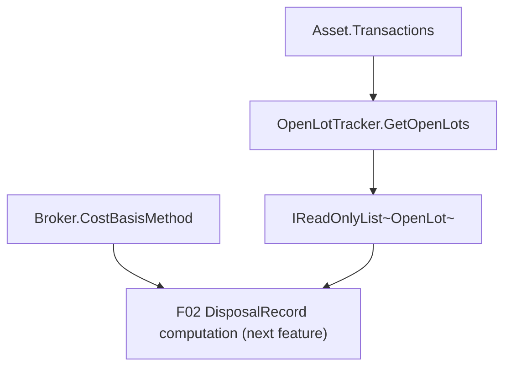

# Spec: F01. Cost Basis Method Strategy

## 1. Technical Overview

**What:** Add a per-`Broker` `CostBasisMethod` setting (`AverageCost` / `FIFO` / `SpecificId`,
defaulting to `AverageCost`) to `Financial.Investment.Domain`, and a stateless domain rule that
computes a holding's currently-open purchase lots (source transaction, date, remaining quantity,
unit cost) by replaying its transaction history. Both are pure Domain additions with no
Application/Infrastructure/Presentation surface of their own — this closes the "no strategy seam"
half of G3 and gives F02 (Disposal Record, next feature) the two inputs it needs to compute a
cost basis under any of the three methods.

**Why:** `Transactions.Apply` (`Financial.Investment.Domain/Entities/Transactions.cs`) folds
weighted-average cost basis directly into the replay loop with no seam for an alternative method,
and nothing today tracks which purchase lots remain open for a holding. F02 cannot create a
`DisposalRecord` under FIFO or SpecificId without both existing first. Introducing them as their
own feature (rather than inline in F02) keeps `AverageCost`'s existing, already-correct behavior
completely untouched — `Transactions.cs` is not modified at all by this feature — while giving F02
a clean strategy input (`Broker.CostBasisMethod`) and a clean lot-supply input (the open-lot rule).

**Scope:**
- **Included:** `CostBasisMethod` enum; `Broker.CostBasisMethod` property + setter, defaulting to
  `AverageCost`; a stateless `OpenLotTracker` domain rule that replays an asset's transactions and
  returns its currently-open lots, with FIFO oldest-first ordering, same-date tie-break, lot
  splitting across the next-oldest lot(s) when a disposal exceeds the oldest lot's remaining
  quantity, and TransferOut depleting lot quantity with no gain/loss.
- **Excluded (later features per the PRD):** creating `DisposalRecord`s (F02), recalculation on
  backdated edits or a method change (F03), any UI (F04/F05), SpecificId's user-chosen lot
  allocation persistence (F02 — F01 only supplies the open-lot *data*; nothing in F01 lets a caller
  record which lots a specific sale drew from).

## 2. Architecture Impact

**Affected components:**
- `Financial.Investment.Domain/Entities/CostBasisMethod.cs` — new enum.
- `Financial.Investment.Domain/Entities/Broker.cs` — new `CostBasisMethod` property and
  `SetCostBasisMethod` method.
- `Financial.Investment.Domain/Rules/OpenLotTracker.cs` — new `OpenLot` record + static
  `OpenLotTracker` class.
- `Financial.Investment.Infrastructure/Persistence/InvestmentTypeInfoResolver.cs` — no change
  needed; `Broker` is already a managed type and `WirePropertySetter` wires any private-set
  property by reflection (verified against how `Investments.ReportingCurrencyEnabled` and
  `Broker.Currency` already round-trip).
- `Financial.Investment.Infrastructure/Persistence/InvestmentSerializerAdapter.cs` — no change
  needed; it already registers `JsonStringEnumConverter` globally, so the new enum serializes as
  its string name automatically (same as every other domain enum).



## 3. Technical Decisions

| Decision | Chosen Approach | Alternative Considered | Trade-off |
|---|---|---|---|
| Where `CostBasisMethod` lives | Property on `Broker`, defaulted via property initializer (`= CostBasisMethod.AverageCost`), exactly like `Investments.ReportingCurrencyEnabled` | A required constructor parameter on `Broker.Create` | The property-initializer approach is what already makes a pre-existing data file with no stored key default correctly on deserialization (the private constructor still runs field initializers); a constructor parameter would need every existing `Broker.Create` call site updated for no behavioral gain |
| How the method setting changes | New `SetCostBasisMethod(CostBasisMethod)` method, separate from `Broker.Update(name, currency)` | Add `costBasisMethod` as a third parameter to `Update` | `Update` changes identity fields; the cost-basis method additionally triggers F03's full-history recalculation, a materially different effect a caller must be able to invoke independently of renaming a broker |
| Where open-lot computation lives | New stateless `OpenLotTracker` static rule in `Rules/`, taking `IEnumerable<Transaction>` and returning `IReadOnlyList<OpenLot>` | A method on `Broker` or `Asset` that looks up a holding internally | Matches the existing `SaleCoverageRule`/`TransactionTypeEffects`/`TransactionReplayOrder` pattern: these rules are pure functions over a transaction sequence, with no entity coupling, so `OpenLotTracker` composes with `TransactionReplayOrder.Sort` exactly like `SaleCoverageRule` already does — the caller (F02) supplies `asset.Transactions` |
| Lot depletion order when the broker's method is `AverageCost` or `FIFO` | Every Decrease-effect transaction (Sell, Redemption, TransferOut) depletes the oldest open lot(s) first, split as needed | Depleting proportionally across all open lots (pro-rata) | The PRD's FIFO capability explicitly requires oldest-first depletion; using the same depletion order regardless of the configured method keeps `OpenLotTracker` a single, method-agnostic rule — a broker's method only changes how a *new* disposal is computed (F02), not how past quantity is tracked |
| Lot depletion order when the broker's method is `SpecificId` | Same FIFO-oldest-first depletion as above, until F02 exists | Track and honor actual user-chosen lot consumption from persisted `DisposalRecord.LotsConsumed` | `DisposalRecord` (and its `LotsConsumed` field) is F02's deliverable, not F01's — no persisted record of which lots a past SpecificId sale drew from exists yet in this feature. **Assumption, to be revisited when F02 lands:** F02 will replace this fallback by sourcing "what's still open" from the latest `Active` `DisposalRecord`'s `LotsConsumed` chain instead of calling `OpenLotTracker` for the historical portion; F01's `OpenLotTracker` remains correct and unchanged for a broker with zero disposal history (e.g. any SpecificId broker before its first sale) |
| A lot's `UnitCost` | `(Transaction.UnitPrice × Transaction.Quantity + Transaction.Fees) / Transaction.Quantity` — identical fee treatment to `Transactions.AveragePrice`'s existing cost calculation | Excluding `Fees` from `UnitCost` to isolate an allowable-acquisition-cost figure | The PRD's Problem Statement (§2) flags fees-in-`AveragePrice` as an unresolved entanglement, but F01's Capabilities don't ask for a fee-separated basis — keeping `UnitCost` fee-inclusive matches today's only existing definition of "a unit's cost" and avoids inventing a second, divergent one without an explicit requirement; **documented as an assumption**, revisit only if F02 needs a fee-exclusive figure |

## 4. Component Overview

**Domain:**

| File Path | New/Modified | Purpose | Key Responsibilities |
|---|---|---|---|
| `Financial.Investment.Domain/Entities/CostBasisMethod.cs` | New | Method enum | Declares `AverageCost = 0`, `FIFO`, `SpecificId` |
| `Financial.Investment.Domain/Entities/Broker.cs` | Modified | Per-broker method setting | Adds `CostBasisMethod` property (default `AverageCost`) and `SetCostBasisMethod` |
| `Financial.Investment.Domain/Rules/OpenLotTracker.cs` | New | Open-lot computation | Declares `OpenLot` record; `OpenLotTracker.GetOpenLots(IEnumerable<Transaction>)` replays transactions in `TransactionReplayOrder`, creates a lot per Increase-effect transaction, depletes lots oldest-first (splitting as needed) on every Decrease-effect transaction regardless of cash effect, and returns only lots with `RemainingQuantity > 0` |

**No Application, Infrastructure, or Presentation files are created or modified by F01** — it is
Domain-only per the PRD.

## 5. API Contracts

Not applicable — F01 has no API surface (Domain-only; F04/F05 will surface it later).

## 6. Data Model

Not a relational schema — both bounded contexts persist as a single JSON document per
`Financial.Shared.Infrastructure`/`InvestmentSerializerAdapter`. This feature changes the shape of
one existing node in `data-investment.json`:

**`Broker` node (existing, gains one field):**

```json
{
  "Name": "Trading 212",
  "Currency": "GBP",
  "CostBasisMethod": "AverageCost",
  "Portfolios": [ ... ]
}
```

| Field | Type (JSON) | Default when absent | Notes |
|---|---|---|---|
| `CostBasisMethod` | string (enum name, via the process-wide `JsonStringEnumConverter`) | `"AverageCost"` | Applies to every existing `Broker` node in a pre-existing data file — the property initializer runs through the private constructor `InvestmentTypeInfoResolver.EnablePrivateConstructor` already uses, so a missing key is never an error, exactly like `Investments.ReportingCurrencyEnabled` |

No migration tool, no schema version bump, no changes to `InvestmentTypeInfoResolver`'s
`ManagedTypes`/`ExcludedProperties` tables — `Broker` is already managed and the new property has
a normal private setter, which `WirePropertySetter` wires generically for every managed type.

`OpenLot` is never persisted — it is always recomputed on demand from `Asset.Transactions`.

## 7. Testing Strategy

Per `testing-guide-Financial`: pure Domain logic with no framework dependency belongs in
`Tests/Financial.Investment.Domain.Tests` (xUnit + FluentAssertions, `AssertionScope` for
multi-assert cases), following the existing `Domain/BrokerTests.cs`, `Domain/SaleCoverageRuleTests.cs`
and `Domain/TransactionReplayOrderTests.cs` conventions (flat `Domain/` folder regardless of the
production `Rules/` vs `Entities/` split). The JSON default/round-trip behavior belongs in
`Tests/Financial.Investment.Infrastructure.Tests/Persistence/InvestmentTypeInfoResolverTests.cs`,
following its existing `GetTypeInfo_DeserializesAssetJsonWithoutPriceSnapshotsProperty_...` and
`GetTypeInfo_RoundTripsAsset...` patterns.

| Test File | Test Type | Target | Coverage Goal |
|---|---|---|---|
| `Tests/Financial.Investment.Domain.Tests/Domain/BrokerTests.cs` | Unit | `Broker.CostBasisMethod` | New broker defaults; `SetCostBasisMethod` changes and is read back |
| `Tests/Financial.Investment.Domain.Tests/Domain/OpenLotTrackerTests.cs` | Unit | `OpenLotTracker` | FIFO ordering, tie-break, splitting, TransferOut depletion, no-lots case |
| `Tests/Financial.Investment.Infrastructure.Tests/Persistence/InvestmentTypeInfoResolverTests.cs` | Integration | JSON round-trip | Pre-existing-file default; explicit value round-trips |

| Test Function | Description | Assertions | Traces |
|---|---|---|---|
| `CostBasisMethod_DefaultsToAverageCost` | A newly created `Broker` | `broker.CostBasisMethod == CostBasisMethod.AverageCost` | AC-01 |
| `SetCostBasisMethod_ChangesAndPersistsInMemory` | Calling `SetCostBasisMethod(FIFO)` then reading the property | Returns `FIFO` | AC-01, AC-02 |
| `GetOpenLots_OrdersOldestFirst_WithSameDatePurchaseBeforeSaleTieBreak` | Two same-date Buys, one earlier-dated Buy | Lots returned oldest-`Date`-first; same-date lots keep insertion (purchase) order | AC-03 |
| `GetOpenLots_DisposalLargerThanOldestLot_SplitsAcrossNextLots` | Sell quantity spanning two Buy lots | First lot fully consumed (removed), second lot's `RemainingQuantity` reduced by the remainder | AC-04 |
| `GetOpenLots_TransferOut_ReducesQuantity_NoAssociatedGainLossField` | A TransferOut smaller than an open lot | Lot's `RemainingQuantity` reduced by the TransferOut quantity; `OpenLot` carries no gain/loss field at all (the type itself proves TransferOut cannot produce one here) | AC-05 |
| `GetOpenLots_FullyConsumedLot_IsExcludedFromResult` | A Sell exactly matching a lot's quantity | The result list omits that lot entirely | AC-07 |
| `GetOpenLots_NoTransactions_ReturnsEmpty` | An asset with no transactions | Returns an empty list | AC-07 |
| `Asset_AveragePrice_UnaffectedByOpenLotTracker` (in existing `TransactionsTests.cs` or `AssetTests.cs`, extended not replaced) | AverageCost replay behavior before/after this feature | `Transactions.AveragePrice`/`RealizedCapitalGain` identical to pre-feature values for an existing fixture | AC-06 |
| `GetTypeInfo_DeserializesBrokerJsonWithoutCostBasisMethodProperty_DefaultsToAverageCost` | Legacy `Broker` JSON with no `CostBasisMethod` key | Deserializes with `CostBasisMethod == AverageCost` | AC-01 |
| `GetTypeInfo_RoundTripsBrokerCostBasisMethod` | Serialize a `Broker` with `CostBasisMethod = FIFO`, deserialize it back | Deserialized value is `FIFO` | AC-02 |

## Assumptions / Decisions (auto-accepted, no interactive interview — running autonomously)

1. `CostBasisMethod` enum lives in `Entities/` (not `Rules/`), mirroring the existing
   `ValuationMethod` enum precedent, even though it is logically closer to a "policy". Consistency
   with the codebase's one existing enum-placement convention wins over a stricter DDD subfolder
   split.
2. `SetCostBasisMethod` performs no side effects (no recalculation) in F01 — F03 is explicitly
   responsible for triggering regeneration when the method changes; F01 only stores the value.
3. `OpenLotTracker.GetOpenLots` is defined to operate over *all* of an asset's transactions (no
   "as of date" parameter) since no PRD capability or acceptance criterion asks for a historical
   point-in-time query — only "currently open" lots. A future feature can add an `asOf` overload if
   needed; not speculatively added here per the project's no-speculative-abstraction rule.
4. See Technical Decisions above for the two explicitly flagged assumptions carried forward for
   F02 to revisit: (a) SpecificId's historical depletion fallback, and (b) fee-inclusive `UnitCost`.
