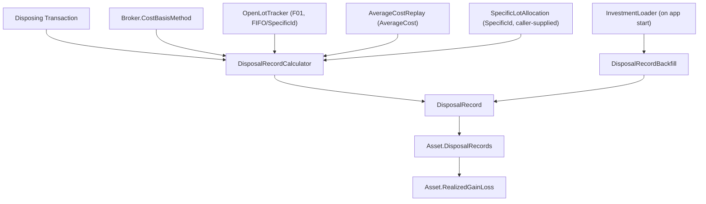

# Spec: F02. Disposal Record

## 1. Technical Overview

**What:** Add an immutable `DisposalRecord` entity created automatically whenever a Sell or
Redemption is recorded, computed under the asset's broker's `CostBasisMethod` (F01) using F01's
`OpenLotTracker` for FIFO/SpecificId or a new reusable weighted-average replay for AverageCost.
`Asset.RealizedGainLoss` is repointed to sum `Active` `DisposalRecord.GainLoss` instead of
`Transactions`' own running scalar. Every pre-existing Sell/Redemption gains a `DisposalRecord`
(under AverageCost) the first time the app loads after this ships, via the existing on-load
migration mechanism.

**Why:** F01 supplies the two inputs (`CostBasisMethod`, open lots) but nothing yet turns a
disposing transaction into a persisted, auditable record of what was actually disposed and at
what basis. `Transactions.RealizedCapitalGain` today is a private running total with no per-sale
breakdown and no audit trail — G4 stays open until each disposal is its own record.

**Scope:**
- **Included:** `DisposalRecord` entity + `DisposalRecordStatus`/`DisposalLotConsumption` types;
  a stateless calculator that builds one `DisposalRecord` per disposing transaction under any of
  the three methods; `TaxYearCalculator`; `Asset.DisposalRecords` nested collection (persisted the
  same way as `Credits`/`PriceSnapshots`); `Asset.RecordTransaction` computing and appending a
  `DisposalRecord` synchronously; SpecificId lot-allocation input and its validation;
  `Asset.RealizedGainLoss` sourced from `DisposalRecords`; the one-time on-load backfill for
  pre-existing Sell/Redemption transactions; minimal `TransactionService` wiring so a broker's
  configured method is actually used when transactions are entered through the app today.
- **Excluded (later features per the PRD):** recalculation on a backdated edit or a
  `CostBasisMethod` change (F03 — this feature only ever *appends* new, Active records); any
  dedicated read/query API or DTO for browsing disposal history (F04/F05 build that when they
  build the Disposals view — no PRD capability in F02 requires an endpoint yet); the SpecificId
  lot-picker UI (F04/F05) — F02 only adds the domain/Application plumbing the picker will call
  into; superseding an existing record (F03).

## 2. Architecture Impact

**Affected components:**

Domain (`Financial.Investment.Domain`):
- `Entities/DisposalRecordStatus.cs` — new enum (`Active`, `Superseded`).
- `Entities/DisposalLotConsumption.cs` — new record: `SourceTransactionId` (nullable — null for
  AverageCost's synthetic entry), `Quantity`, `UnitCost`.
- `Entities/DisposalRecord.cs` — new entity, immutable after construction (no mutators — F03 adds
  the supersede transition later).
- `Rules/SpecificLotAllocation.cs` — new record: `SourceTransactionId`, `Quantity` — the caller's
  chosen allocation for a SpecificId sale (distinct from `DisposalLotConsumption`, which additionally
  carries the resolved `UnitCost`).
- `Rules/AverageCostReplay.cs` — new stateless rule extracted from `Transactions.Apply`'s Increase
  branch, so the weighted-average math has exactly one implementation (see Technical Decisions).
- `Rules/TaxYearCalculator.cs` — new stateless rule: `Calculate(DateTime date, string currency)`.
- `Rules/DisposalRecordCalculator.cs` — new stateless rule: builds one `DisposalRecord` for a
  disposing transaction given the method, the transactions preceding it, and (SpecificId only) the
  caller's allocation.
- `Rules/DisposalRecordBackfill.cs` — new stateless rule: given an `Investments` graph, appends an
  `Active` AverageCost `DisposalRecord` to every disposing transaction that doesn't have one yet.
- `Entities/Asset.cs` — modified: `DisposalRecords` nested collection; `RecordTransaction` gains
  `CostBasisMethod` and optional `IReadOnlyList<SpecificLotAllocation>?` parameters, validates a
  SpecificId allocation, builds the record via `DisposalRecordCalculator`, appends it, and
  refreshes `Transactions`' cached realized-gain figure; `RealizedGainLoss` now sums
  `DisposalRecords` instead of delegating to `Transactions.RealizedCapitalGain`'s internal
  accumulation.
- `Entities/Transactions.cs` — modified: the Decrease-with-cash branch of `Apply` stops
  accumulating `RealizedCapitalGain` itself (that duplicated, now-removed computation is replaced
  by `Asset` pushing the `DisposalRecords`-derived sum in); the Increase branch delegates to
  `AverageCostReplay` instead of inlining the formula, so `DisposalRecordCalculator`/backfill use
  the identical math with zero duplication risk. `RealizedCapitalGain` keeps its public property
  (now with an internal setter `Asset` calls) so existing readers are unaffected.

Application (`Financial.Investment.Application`):
- `DTOs/TransactionCreateDTO.cs` — modified: adds `IReadOnlyList<SpecificLotAllocationDTO>?
  SpecificLotAllocations` (nullable, unused by any UI yet — F04/F05 wire it up; required only when
  the target broker's method is SpecificId).
- `DTOs/SpecificLotAllocationDTO.cs` — new: `Guid SourceTransactionId`, `decimal Quantity`.
- `Services/TransactionService.cs` — modified: `AddTransactionAsync` resolves the target broker
  (Active then Historic, matching `GetBrokerList`'s existing scope split) before the mutation and
  passes `broker.CostBasisMethod` plus the mapped allocation into `asset.RecordTransaction(...)`.

Infrastructure (`Financial.Investment.Infrastructure`):
- No new persistence plumbing needed for the entity itself — `DisposalRecord` and its nested
  `DisposalLotConsumption` list follow the exact managed-type/`WirePropertySetter` path F01 already
  confirmed handles a new enum and a new nested collection generically.
- `Persistence/InvestmentLoader.cs` — modified: calls `DisposalRecordBackfill.Apply(investments)`
  once, right after `serializer.Deserialize(json)` returns, before the loaded graph is handed to
  DI. Deliberately a Domain-level pass over the deserialized object graph, not a raw-JSON
  `InvestmentDataMigrations` step (see Technical Decisions) — no document version bump needed since
  nothing about the JSON *shape* requires migrating, only content that was always absent gets added.



## 3. Technical Decisions

| Decision | Chosen Approach | Alternative Considered | Trade-off |
|---|---|---|---|
| Where `RealizedCapitalGain`'s new definition lives | Keep the property on `Transactions` (matching the PRD's own wording), but `Transactions` no longer computes it itself — `Asset` pushes the `DisposalRecords`-derived sum into it via an internal setter whenever `DisposalRecords` changes | Move the property entirely onto `Asset` and drop it from `Transactions` | `Transactions` has no reference to `DisposalRecords` (a sibling collection on `Asset`, not on `Transactions`), so it cannot compute the new figure itself; grepping the codebase shows `Transactions.RealizedCapitalGain` has exactly one consumer today (`Asset.RealizedGainLoss`) and no DTO exposes it directly, so keeping the property name is a zero-risk, PRD-literal choice rather than a breaking rename |
| Weighted-average math duplication | Extract `Transactions.Apply`'s Increase-branch formula into a new stateless `AverageCostReplay` rule; both `Transactions` (live, incremental) and `DisposalRecordCalculator`/`DisposalRecordBackfill` (need the AveragePrice *at the moment of each historical disposal*, not just the final value) call it | Duplicate the formula in the calculator/backfill | `Transactions` only ever exposes its *final* `AveragePrice`, but a `DisposalRecord`'s cost basis needs the value **as of that disposal's moment in history** — backfilling 100+ historical sells needs a full step-by-step replay. A second hand-written copy of the weighted-average formula would silently drift from `Transactions.Apply` the next time either one is touched; one shared pure function removes that risk entirely, verified by the existing `AveragePrice`/`RealizedCapitalGain` regression tests (F01's `AveragePrice_And_RealizedCapitalGain_AreUnaffectedByComputingOpenLots`-style guard extended here) staying green byte-for-byte |
| Backfill's cost-basis method | Always AverageCost, regardless of the broker's *currently configured* method | Replay each broker's disposals under its current method | The PRD is explicit (§6, F02 Capabilities): "computed under AverageCost (every broker's default)" — the one-time backfill runs once, for data that predates any method other than AverageCost even existing; a broker later switched to FIFO/SpecificId gets its history corrected by F03's recalculation, not by this backfill guessing retroactively |
| Backfill's integration point | A Domain-level pass (`DisposalRecordBackfill.Apply(Investments)`) invoked from `InvestmentLoader.LoadSync` right after deserialization, operating on real domain objects | A raw-JSON `InvestmentDataMigrations` step (the pattern P49-F02's currency backfill used) | Currency backfill only *copies a sibling JSON field*; a `DisposalRecord` requires replaying weighted-average arithmetic identical to `Transactions.Apply` — doing that against a raw `JsonObject` tree would either re-implement the domain math a third time or deserialize-compute-reserialize inside the migration step, which is more convoluted than calling the real domain rule once the graph already exists. No document version bump is needed either way, since backfill only adds previously-absent nested records, it doesn't change any existing field's shape |
| SpecificId allocation input, today | Add the plumbing (`TransactionCreateDTO.SpecificLotAllocations`, `Asset.RecordTransaction`'s optional parameter, and the domain validation) now, even though no UI populates it until F04/F05 | Defer all of it to F04/F05 | AC-08/AC-09 are explicitly F02's acceptance criteria ("a SpecificId sale whose selected lots don't sum... is rejected before any transaction... is created") — the rejection behavior must exist and be testable in F02 independent of any UI; this is required scope, not speculative |
| `DisposalRecord.CreatedAt` | Defaults to `DateTimeOffset.UtcNow` inside `DisposalRecord.Create`, mirroring how `Id` defaults to an internal `Guid.NewGuid()`; a `CreateWithId`-style overload accepts an explicit id/timestamp for deterministic tests | Thread a `TimeProvider` through `Asset.RecordTransaction` → `DisposalRecordCalculator` | `CreatedAt` is audit metadata with zero effect on any computed figure (unlike `AssetPriceSnapshot.RetrievedAt`, which callers use to answer "what was the price as of when") — widening `RecordTransaction`'s signature only to thread a clock for an audit stamp is not justified when the existing `Credit`/`Transaction` `Create`/`CreateWithId` pattern already solves deterministic testing without one |
| `DisposalRecord` mutability | Fully immutable in F02 — no `Supersede`/status-transition method exists yet | Add a `MarkSuperseded` method now, unused until F03 | No caller exists for it until F03's recalculation policy — adding it now would be a speculative method with no test that exercises real behavior; F03's own spec introduces it |

## 4. Component Overview

**Domain:**

| File Path | New/Modified | Purpose | Key Responsibilities |
|---|---|---|---|
| `Entities/DisposalRecordStatus.cs` | New | Lifecycle enum | `Active`, `Superseded` |
| `Entities/DisposalLotConsumption.cs` | New | Value object | `SourceTransactionId` (nullable), `Quantity`, `UnitCost` |
| `Entities/DisposalRecord.cs` | New | Immutable disposal record | `Id`, `TransactionId`, `Date`, `Method`, `LotsConsumed`, `QuantityDisposed`, `Proceeds`, `CostBasis` (derived: `Sum(LotsConsumed, l => l.Quantity * l.UnitCost)`), `GainLoss` (`Proceeds - CostBasis`), `Currency`, `TaxYear`, `Status` (always `Active` from `Create`), `SupersededByRecordId` (always null from `Create`), `CreatedAt`; `Create`/`CreateWithId` factories |
| `Rules/SpecificLotAllocation.cs` | New | Caller's chosen allocation | `SourceTransactionId`, `Quantity` |
| `Rules/AverageCostReplay.cs` | New | Shared weighted-average step function | `Apply(decimal currentQuantity, decimal currentAveragePrice, Transaction transaction) : decimal` — returns the new `AveragePrice` for an Increase-effect transaction, identical formula `Transactions.Apply` now delegates to |
| `Rules/TaxYearCalculator.cs` | New | Tax year derivation | `Calculate(DateTime date, string currency)` — BR calendar year for `"BRL"`, UK Apr 6–Apr 5 year otherwise |
| `Rules/DisposalRecordCalculator.cs` | New | Per-disposal computation | `Calculate(Transaction disposingTransaction, IEnumerable<Transaction> precedingTransactions, CostBasisMethod method, string brokerCurrency, IReadOnlyList<SpecificLotAllocation>? allocation)` — dispatches to `OpenLotTracker` (FIFO: auto-consume oldest lots; SpecificId: consume exactly `allocation`, validating sum and per-lot availability) or `AverageCostReplay` (AverageCost: single synthetic `LotsConsumed` entry, `SourceTransactionId = null`) |
| `Rules/DisposalRecordBackfill.cs` | New | One-time on-load backfill | `Apply(Investments investments)` — for every asset under every broker (Active + Historic), for every Sell/Redemption with no matching `DisposalRecord.TransactionId`, computes one via `DisposalRecordCalculator` under `CostBasisMethod.AverageCost` and appends it; on any single computation failure, logs and skips only that transaction (per PRD Error Handling) |
| `Entities/Asset.cs` | Modified | Disposal record ownership | New `_disposalRecords`/`DisposalRecords` nested collection (Credits/PriceSnapshots pattern); `RecordTransaction(Transaction, CostBasisMethod, IReadOnlyList<SpecificLotAllocation>? = null)` validates the allocation (SpecificId only), calls `DisposalRecordCalculator` for a disposing transaction, appends the result, then pushes the new `DisposalRecords`-derived sum into `Transactions`; `RealizedGainLoss` sums `DisposalRecords.Where(Active)` + `Credits` |
| `Entities/Transactions.cs` | Modified | Stop self-computing realized gain | `Apply`'s Increase branch calls `AverageCostReplay.Apply(...)`; the Decrease-with-cash branch no longer accumulates `RealizedCapitalGain`; new `internal void SetRealizedCapitalGain(decimal value)` that `Asset` calls after every `DisposalRecords` change (including after JSON deserialization, so field order never matters) |

**Application:**

| File Path | New/Modified | Purpose | Key Responsibilities |
|---|---|---|---|
| `DTOs/SpecificLotAllocationDTO.cs` | New | Wire shape for an allocation entry | `Guid SourceTransactionId`, `decimal Quantity` |
| `DTOs/TransactionCreateDTO.cs` | Modified | Carries an optional allocation | `IReadOnlyList<SpecificLotAllocationDTO>? SpecificLotAllocations` |
| `Services/TransactionService.cs` | Modified | Resolves method, wires allocation | `AddTransactionAsync` looks up the target `Broker` (Active, else Historic) for `request.BrokerName`, maps `request.SpecificLotAllocations` to `SpecificLotAllocation`, and calls `asset.RecordTransaction(transaction, broker.CostBasisMethod, allocation)` |

**Infrastructure:**

| File Path | New/Modified | Purpose | Key Responsibilities |
|---|---|---|---|
| `Persistence/InvestmentLoader.cs` | Modified | Runs the one-time backfill | Calls `DisposalRecordBackfill.Apply(investments)` after `serializer.Deserialize(json)`, before returning |

## 5. API Contracts

No new HTTP endpoint — `TransactionCreateDTO` (already exposed via the existing add-transaction
endpoint) gains one optional field:

```json
{
  "brokerName": "Trading 212",
  "portfolioName": "ISA",
  "assetName": "VWRL",
  "date": "2026-09-01",
  "type": "Sell",
  "quantity": 10,
  "unitPrice": 95.20,
  "fees": 1.50,
  "withheld": 0,
  "specificLotAllocations": [
    { "sourceTransactionId": "3fa85f64-...", "quantity": 6 },
    { "sourceTransactionId": "9c858901-...", "quantity": 4 }
  ]
}
```

`specificLotAllocations` is omitted/`null` for every broker not configured as `SpecificId` (no
change to today's request shape for the overwhelming majority of callers).

## 6. Data Model

Single JSON document, `data-investment.json`, via `Financial.Shared.Infrastructure`. This feature
adds one new nested collection under each existing `Asset` node — the same pattern `Credits` and
`PriceSnapshots` already use:

```json
{
  "Name": "VWRL",
  "Transactions": [ ... ],
  "Credits": [ ... ],
  "PriceSnapshots": [ ... ],
  "DisposalRecords": [
    {
      "Id": "b2b6...",
      "TransactionId": "3fa8...",
      "Date": "2026-09-01T00:00:00",
      "Method": "AverageCost",
      "LotsConsumed": [
        { "SourceTransactionId": null, "Quantity": 10, "UnitCost": 88.40 }
      ],
      "QuantityDisposed": 10,
      "Proceeds": 950.50,
      "CostBasis": 884.00,
      "GainLoss": 66.50,
      "Currency": "GBP",
      "TaxYear": "2026/27",
      "Status": "Active",
      "SupersededByRecordId": null,
      "CreatedAt": "2026-09-14T10:03:00Z"
    }
  ]
}
```

| Field | Type (JSON) | Notes |
|---|---|---|
| `DisposalRecords` | array, absent on a pre-existing asset with no disposals | Populated automatically — never written by a client directly |
| `LotsConsumed[].SourceTransactionId` | string (GUID) or `null` | `null` only for the AverageCost synthetic entry |
| `Method`, `Status` | string (enum name) | Process-wide `JsonStringEnumConverter`, same as `CostBasisMethod` (F01) |
| `TaxYear` | string | `"2026"` (BRL) or `"2025/26"` (everything else) — never a number, so no locale-dependent formatting risk |

No document version bump: the backfill only *adds* a previously-absent nested collection to
existing asset nodes, it doesn't change the shape of any existing field, so
`InvestmentDataMigrations.CurrentVersion` (currently 4) is untouched — new/old documents alike
simply gain `DisposalRecords` the next time they're loaded and saved.

## 7. Testing Strategy

Per `testing-guide-Financial`: pure Domain logic in `Tests/Financial.Investment.Domain.Tests/Domain/`
(xUnit + FluentAssertions), following `OpenLotTrackerTests.cs`'s and `TransactionsTests.cs`'s
existing conventions. The backfill's on-load behavior belongs in
`Tests/Financial.Investment.Infrastructure.Tests/Persistence/`, following
`InvestmentSerializerAdapterTests.cs`'s version-bump/round-trip style even though this feature adds
no version bump itself (a legacy-JSON-without-`DisposalRecords` fixture is still the right shape
of test). `TransactionService`'s new broker-lookup/wiring belongs in the existing
`Tests/Financial.Investment.Application.Tests/Services/TransactionServiceTests.cs`.

| Test File | Test Type | Target | Coverage Goal |
|---|---|---|---|
| `Tests/Financial.Investment.Domain.Tests/Domain/DisposalRecordCalculatorTests.cs` | Unit | `DisposalRecordCalculator` | One record per method; correct `LotsConsumed`/`CostBasis`/`GainLoss`/`TaxYear`; SpecificId validation |
| `Tests/Financial.Investment.Domain.Tests/Domain/DisposalRecordBackfillTests.cs` | Unit | `DisposalRecordBackfill` | Backfills every historic Sell/Redemption; idempotent (no duplicates on re-run); skip-and-log on a single failure |
| `Tests/Financial.Investment.Domain.Tests/Domain/AssetTests.cs` (extended) | Unit | `Asset.RecordTransaction`, `RealizedGainLoss` | A Sell/Redemption produces exactly one `Active` `DisposalRecord`; any other type produces none; `RealizedGainLoss` matches the old-formula figure for existing AverageCost fixtures (regression guard) |
| `Tests/Financial.Investment.Domain.Tests/Domain/TransactionsTests.cs` (extended, not duplicated) | Unit | `AverageCostReplay` extraction | `AveragePrice` unaffected by the refactor for every existing fixture |
| `Tests/Financial.Investment.Infrastructure.Tests/Persistence/InvestmentSerializerAdapterTests.cs` (extended) | Integration | On-load backfill wiring | Loading a legacy document with Sell/Redemption transactions and no `DisposalRecords` key produces `Active` records after `InvestmentLoader.LoadSync` |
| `Tests/Financial.Investment.Application.Tests/Services/TransactionServiceTests.cs` (extended) | Unit | Broker lookup + wiring | `AddTransactionAsync` passes the resolved broker's `CostBasisMethod` and mapped allocation through to `RecordTransaction` |

| Test Function | Description | Assertions | Traces |
|---|---|---|---|
| `Calculate_Sell_UnderAverageCost_ProducesOneActiveRecordWithSyntheticLot` | AverageCost Sell | `LotsConsumed` has one entry with `SourceTransactionId == null`; `Status == Active` | AC-01 |
| `Calculate_NonDisposingTransaction_IsNeverInvoked` (asserted via `AssetTests`) | Buy/Fee/etc. | `Asset.DisposalRecords` stays empty | AC-02 |
| `Calculate_Proceeds_EqualsNetCash_AndGainLossEqualsProceedsMinusCostBasis` | Any method | `Proceeds == transaction.NetCash`; `GainLoss == Proceeds - CostBasis` | AC-03 |
| `Calculate_TaxYear_BrlBroker_UsesCalendarYear` / `..._OtherCurrency_UsesUkTaxYear` | BRL vs GBP | `"2026"` vs `"2025/26"` boundary at Apr 6 | AC-04 |
| `DisposalRecordBackfill_Apply_CreatesRecordForEveryExistingDisposal` | Legacy data | Every Sell/Redemption gains exactly one `Active` record | AC-05 |
| `DisposalRecordBackfill_Apply_IsIdempotent_NoDuplicatesOnRerun` | Re-running backfill | Record count unchanged | AC-06 |
| `Asset_RealizedGainLoss_EqualsSumOfActiveDisposalRecordGainLoss` | Multiple disposals | Matches sum exactly | AC-07 |
| `Calculate_SpecificId_AllocationDoesNotSumToSaleQuantity_Throws` | Shortfall/excess | `InvestmentRuleViolationException`, no record/transaction created | AC-08 |
| `Calculate_SpecificId_AllocationExceedsLotRemainingQuantity_Throws` | Over-request one lot | `InvestmentRuleViolationException` | AC-09 |

## Assumptions / Decisions (auto-accepted, no interactive interview — running autonomously)

1. `RealizedCapitalGain` stays a `Transactions`-owned property (per the PRD's literal wording) but
   is now populated by `Asset` pushing in the `DisposalRecords`-derived sum, since `Transactions`
   has no path to reach a sibling collection on `Asset`. See Technical Decisions.
2. The weighted-average formula is extracted into `AverageCostReplay` so `Transactions.Apply` and
   the new disposal calculator/backfill share one implementation instead of two hand-written
   copies of the same math.
3. Backfill always computes under `AverageCost`, per the PRD's explicit wording, regardless of a
   broker's currently configured method — a later method change is F03's recalculation, not this
   one-time backfill's job.
4. Backfill runs as a Domain-level pass over the deserialized `Investments` graph from
   `InvestmentLoader.LoadSync`, not as a raw-JSON `InvestmentDataMigrations` step, since it needs
   real weighted-average arithmetic rather than a field copy. No document version bump accompanies
   it.
5. `TransactionCreateDTO.SpecificLotAllocations` and its domain plumbing are added now (unused by
   any UI until F04/F05) because AC-08/AC-09 require the rejection behavior to exist and be
   testable in F02 on its own.
6. `DisposalRecord.CreatedAt` defaults to `DateTimeOffset.UtcNow` at construction rather than
   threading a `TimeProvider` through the call chain, since it is audit metadata with no effect on
   any computed figure — mirrors `Id`'s `Guid.NewGuid()` default with a `CreateWithId` escape hatch
   for deterministic tests.
7. `DisposalRecord` has no mutation methods in F02 (fully immutable) — the `Superseded` transition
   is added by F03, which is the first feature with an actual caller for it.
8. No dedicated Application query/read API for browsing disposal history is added in F02 — F04/F05
   build that alongside their own UI, since no F02 acceptance criterion requires an endpoint yet.
