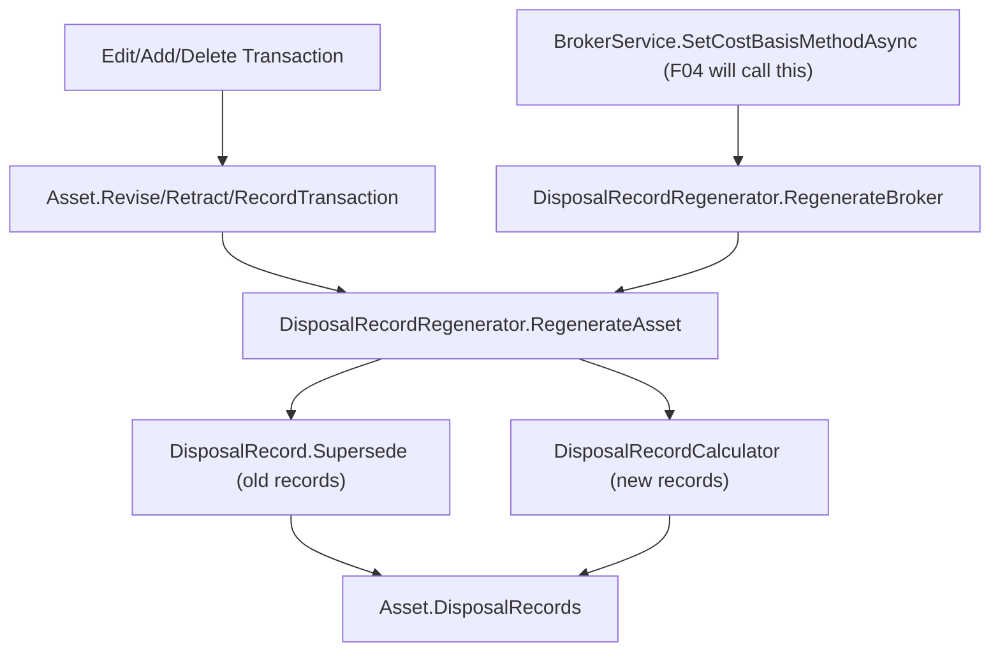

# Spec: F03. Disposal Recalculation Policy

## 1. Technical Overview

**What:** Add a `Superseded` transition to `DisposalRecord`, and a `DisposalRecordRegenerator` domain
rule that recomputes an asset's disposal history from a given anchor point forward, superseding every
displaced `Active` record and linking it to its replacement. Wire the two existing triggers — a
backdated transaction change (add/edit/delete) and a broker's `CostBasisMethod` change — into the
Application layer so both run the regeneration synchronously before their write is considered saved.

**Why:** F02 gives every disposal exactly one `Active` record at creation time, but nothing today
reacts when an earlier transaction changes underneath an already-computed disposal, or when a broker
switches method. `DisposalRecord.Status`/`SupersededByRecordId` already exist (F02) but nothing ever
sets them — this feature is what actually uses them, closing the "no retroactive rewrite" half of the
PRD's brief.

**Scope:**
- **Included:** `DisposalRecord.Supersede(Guid supersededByRecordId)`; `DisposalRecordRegenerator`
  (recomputes every disposal for one asset from an anchor date, or a broker's every asset from
  scratch, superseding and replacing as needed); wiring into `Asset.ReviseTransaction`,
  `Asset.RetractTransaction`, `Asset.RecordTransaction` (a backdated add) so any of the three re-run
  regeneration when they touch a date at or before the asset's latest disposal; a minimal
  `BrokerService` entry point that changes `CostBasisMethod` and regenerates every asset under that
  broker, callable today even with no UI wiring yet (mirrors F02's `SpecificLotAllocations`
  precedent); all-or-nothing behavior (the triggering write is rejected if regeneration throws).
- **Excluded (later features per the PRD):** the Admin Broker form's Cost Basis Method field and any
  other UI (F04/F05 wire the entry point this feature adds); any change to how `RealizedCapitalGain`/
  `RealizedGainLoss` sum records (F02 already sums only `Active`, unchanged here).

## 2. Architecture Impact

**Affected components:**

Domain (`Financial.Investment.Domain`):
- `Entities/DisposalRecord.cs` — modified: new `Supersede(Guid supersededByRecordId)` method,
  throwing if already `Superseded` (a record is superseded at most once directly, per the PRD).
- `Rules/DisposalRecordRegenerator.cs` — new stateless rule with two entry points: `RegenerateAsset`
  (one asset, from an anchor date forward — the backdated-edit trigger) and `RegenerateBroker` (every
  asset under a broker, from each asset's earliest transaction — the method-change trigger).
  `RegenerateBroker` calls `RegenerateAsset` per asset with `DateTime.MinValue` as the anchor.
- `Entities/Asset.cs` — modified: `ReviseTransaction`/`RetractTransaction`/`RecordTransaction` each
  compute the regeneration anchor (the earlier of the transaction's own date and, for an edit, its
  prior date) and — only when that anchor is at or before `DisposalRecords`' latest `Active` date —
  call `DisposalRecordRegenerator.RegenerateAsset` after the mutation, inside the same method, so a
  thrown exception leaves nothing persisted (the in-memory graph is the process's only copy until
  `ApplyAndSaveAsync` serializes it, matching `Broker.ResolveDestination`'s existing "raise before
  anything survives" pattern).
- `Entities/Broker.cs` — not modified: `SetCostBasisMethod`'s signature is unchanged. Its caller (the
  Application layer, see below) now always pairs it with `DisposalRecordRegenerator.RegenerateBroker`
  in the same operation — no domain-level coupling is added to `Broker` itself (see Technical
  Decisions row 1 for why regeneration is orchestrated as a stateless rule rather than a `Broker`
  method).

Application (`Financial.Investment.Application`):
- `Services/BrokerService.cs` — modified: new `SetCostBasisMethodAsync(string brokerName,
  CostBasisMethod method)` — resolves the broker (Active then Historic), calls
  `broker.SetCostBasisMethod(method)` then `DisposalRecordRegenerator.RegenerateBroker(broker)` inside
  one `ApplyAndSaveAsync` callback, so a mid-regeneration failure rejects the whole write. Unused by
  any DTO/endpoint yet — F04/F05 call it when the Admin Broker form gains the field, exactly as F02
  added `TransactionCreateDTO.SpecificLotAllocations` ahead of its own UI.



## 3. Technical Decisions

| Decision | Chosen Approach | Alternative Considered | Trade-off |
|---|---|---|---|
| Where regeneration is orchestrated for a method change | A new `DisposalRecordRegenerator.RegenerateBroker(Broker)` walking `broker.Portfolios[].Assets`, called from `BrokerService` — not a method on `Broker` itself | Add a `Broker.RegenerateDisposals()` method | `DisposalRecordRegenerator` already needs `Asset`-level access identical to `DisposalRecordBackfill`'s existing traversal; `Broker` exposes `Portfolios[].Assets` today, so the rule can walk it exactly like `DisposalRecordBackfill.Apply` walks `Investments.ActiveBrokers.Concat(HistoricBrokers)` — no new domain coupling, consistent stateless-rule pattern from F01/F02 |
| SpecificId lot allocation during regeneration | Reconstruct the caller's original allocation from the superseded record's own `LotsConsumed` (each non-null `SourceTransactionId`/`Quantity` pair becomes a `SpecificLotAllocation`) and replay it through `DisposalRecordCalculator` unchanged | Require the caller to resupply a fresh allocation for every regenerated SpecificId disposal | A backdated edit to an *earlier* transaction must not force the user to re-enter lot choices for every later SpecificId sale it touches — the record already states exactly which lots it drew from; replaying the same choice is what "regenerate, don't ask again" means. If the edit invalidated that specific choice (e.g. a lot now has fewer units), `DisposalRecordCalculator` throws its existing `InvestmentRuleViolationException` exactly as it would for a fresh sale, which correctly satisfies AC-06 (regeneration rejected in full) |
| Regeneration anchor for the backdated-edit trigger | The earlier of the transaction's new date and (for an edit) its previous date, compared against the asset's latest **Active** `DisposalRecord.Date`; regeneration runs only when the anchor is at or before that date | Always regenerate every asset transaction whenever any transaction changes | The PRD explicitly scopes the trigger to "on or before an existing disposal's date" (§5, F03) — a transaction dated after every existing disposal cannot have altered any of them, so skipping regeneration entirely in that case is a correctness-neutral, zero-cost fast path exercised by the majority of ordinary (forward-dated) transaction entry |
| Superseding order for a chain | `RegenerateAsset` recomputes every disposing transaction from the anchor forward in one pass (using `TransactionReplayOrder`, identical iteration to `DisposalRecordBackfill`), so a disposal already superseded once during an earlier regeneration is never revisited in the same pass — its latest `Active` successor is what gets superseded again on a later, independent regeneration | Recursively re-walk superseded chains | The PRD requires a record be "superseded at most once **directly**" but a multi-hop chain stays followable — recomputing strictly forward from the anchor, once, per regeneration call, and only ever superseding the current `Active` record for each disposing transaction, produces exactly that chain shape without extra bookkeeping |
| All-or-nothing failure | Regeneration mutates `Asset`'s in-memory `_disposalRecords` list directly (append new, flip status on old) with no persistence call inside the loop; if `DisposalRecordCalculator` throws partway through, the exception propagates out of `ReviseTransaction`/`RetractTransaction`/`RecordTransaction`/`SetCostBasisMethodAsync` before `ApplyAndSaveAsync` ever serializes the graph, so a thrown exception leaves the on-disk JSON exactly as it was | Snapshot-and-restore the asset's disposal list before regenerating, restoring it on failure | The existing single-writer JSON persistence model (per CLAUDE.md) never partially serializes a save — a save either runs to completion after the callback returns `true`/succeeds, or an exception aborts it entirely before any write, so no explicit rollback of the in-memory graph is needed; this matches how `Broker.ResolveDestination`'s existing comment already documents the same guarantee for portfolio creation |

## 4. Component Overview

**Domain:**

| File Path | New/Modified | Purpose | Key Responsibilities |
|---|---|---|---|
| `Entities/DisposalRecord.cs` | Modified | Supersede transition | `Supersede(Guid supersededByRecordId)` sets `Status = Superseded` and `SupersededByRecordId`; throws `InvalidOperationException` if already `Superseded` |
| `Rules/DisposalRecordRegenerator.cs` | New | Regeneration orchestration | `RegenerateAsset(Asset asset, CostBasisMethod method, DateTime anchor)` — walks `asset.Transactions` in replay order; for every disposing transaction at or after `anchor`, supersedes its current `Active` record (if any) and computes+appends a new one (reconstructing a SpecificId allocation from the superseded record's `LotsConsumed` when present); calls `asset.RefreshRealizedCapitalGain()` once at the end. `RegenerateBroker(Broker broker)` calls `RegenerateAsset(asset, broker.CostBasisMethod, DateTime.MinValue)` for every asset in every portfolio |
| `Entities/Asset.cs` | Modified | Trigger wiring | `ReviseTransaction`/`RetractTransaction`/`RecordTransaction` compute the anchor and call `DisposalRecordRegenerator.RegenerateAsset` when the anchor is at or before the latest `Active` `DisposalRecord.Date` for that asset |

**Application:**

| File Path | New/Modified | Purpose | Key Responsibilities |
|---|---|---|---|
| `Services/BrokerService.cs` | Modified | Method-change entry point | `SetCostBasisMethodAsync(string brokerName, CostBasisMethod method)` resolves the broker (Active then Historic, matching `ResolveCostBasisMethod`'s existing scope split in `TransactionService`), calls `SetCostBasisMethod` then `RegenerateBroker`, both inside one `ApplyAndSaveAsync` |

No Infrastructure changes — regeneration only mutates existing managed types (`DisposalRecord`'s
`Status`/`SupersededByRecordId` already round-trip; no new field, no new collection).

## 5. API Contracts

No new HTTP endpoint in this feature (F04/F05 add the Admin Broker form field that will call
`SetCostBasisMethodAsync` through a new/existing broker-update endpoint) — `BrokerService` gains a
method with no controller action yet, the same "plumbing before UI" precedent F02 set for
`SpecificLotAllocations`.

## 6. Data Model

No shape change to `data-investment.json` — `DisposalRecord.Status`/`SupersededByRecordId` are
existing fields (F02) that this feature is the first to actually populate with `Superseded`/a
non-null id:

```json
{
  "Id": "b2b6...",
  "Status": "Superseded",
  "SupersededByRecordId": "c3c7...",
  "...": "unchanged"
}
```

A superseded record is never removed or moved — it stays in the same `Asset.DisposalRecords` array
alongside its replacement, exactly where F02 already put it.

## 7. Testing Strategy

Per `testing-guide-Financial`: pure Domain logic in `Tests/Financial.Investment.Domain.Tests/Domain/`
(xUnit + FluentAssertions), following `DisposalRecordBackfillTests.cs`'s and `AssetTests.cs`'s
existing conventions. `BrokerService`'s new method belongs in
`Tests/Financial.Investment.Application.Tests/Services/BrokerServiceTests.cs`.

| Test File | Test Type | Target | Coverage Goal |
|---|---|---|---|
| `Tests/Financial.Investment.Domain.Tests/Domain/DisposalRecordTests.cs` (extended) | Unit | `Supersede` | Sets Status/SupersededByRecordId; throws on a second call |
| `Tests/Financial.Investment.Domain.Tests/Domain/DisposalRecordRegeneratorTests.cs` | Unit | `RegenerateAsset`/`RegenerateBroker` | Backdated insert supersedes and replaces every later disposal; forward-dated change regenerates nothing; method change regenerates every asset under a broker from scratch; a chain of two regenerations stays followable; SpecificId allocation is replayed from the superseded record; a now-invalid SpecificId allocation throws and leaves the prior record untouched |
| `Tests/Financial.Investment.Domain.Tests/Domain/AssetTests.cs` (extended) | Unit | `Revise/Retract/RecordTransaction` wiring | Editing/deleting/backdated-adding a transaction at or before the latest disposal triggers regeneration; a forward-dated change does not; `RealizedGainLoss` reflects only the newest `Active` chain link |
| `Tests/Financial.Investment.Application.Tests/Services/BrokerServiceTests.cs` (extended) | Unit | `SetCostBasisMethodAsync` | Changes the method and regenerates every asset under the broker in one call; a regeneration failure leaves the broker's method and disposal history unchanged (nothing partially saved) |

| Test Function | Description | Assertions | Traces |
|---|---|---|---|
| `Supersede_ActiveRecord_SetsStatusAndLink` | Fresh record | `Status == Superseded`, `SupersededByRecordId` set | AC-03 |
| `Supersede_AlreadySuperseded_Throws` | Double supersede | Throws | AC-03 |
| `RegenerateAsset_BackdatedBuyBeforeExistingSale_SupersedesAndReplacesTheSale` | Insert an earlier Buy | Old record `Superseded` pointing at new; new record `Active` with updated `CostBasis` | AC-01 |
| `RegenerateAsset_ForwardDatedChange_DoesNotTouchExistingRecords` | Edit after the latest disposal | No new records, no status change | AC-01 (negative) |
| `RegenerateBroker_MethodChangedToFifo_RegeneratesEveryAssetFromEarliestTransaction` | Two assets under one broker | Every disposal on both assets superseded+replaced under FIFO | AC-02 |
| `RegenerateAsset_ChainOfTwoRegenerations_IsFollowableBackToOriginal` | Regenerate twice | `Active` → `Superseded` → `Superseded`, each `SupersededByRecordId` resolving to the next | AC-05 |
| `RegenerateAsset_SupersededRecord_ExcludedFromRealizedGainLoss` | After regeneration | `Asset.RealizedGainLoss` matches only `Active` records' sum | AC-04 |
| `RegenerateAsset_SpecificIdAllocationNoLongerValid_ThrowsAndLeavesPriorRecordActive` | Backdated edit shrinks a chosen lot | Throws; original record still `Active`, untouched | AC-06 |
| `SetCostBasisMethodAsync_RegenerationThrows_MethodAndDisposalsUnchanged` | Simulated failure mid-regeneration | Broker's method and every asset's disposal history unchanged after the call throws | AC-06 |

## Assumptions / Decisions (auto-accepted, no interactive interview — running autonomously)

1. `DisposalRecordRegenerator` is orchestrated from `Investments`/`Broker`'s existing
   `Portfolios[].Assets` traversal (the same shape `DisposalRecordBackfill` already walks), not from
   a new method on `Broker` itself — keeps the stateless-rule pattern F01/F02 established.
2. A `BrokerService.SetCostBasisMethodAsync` entry point is added now with no DTO/endpoint/UI calling
   it yet, mirroring F02's `SpecificLotAllocations` precedent: the capability must exist and be
   testable per AC-02 before F04/F05 build the form field that will call it.
3. A backdated SpecificId disposal's regeneration replays the *same* lot allocation recorded on the
   record it supersedes (reconstructed from `LotsConsumed`), rather than requiring the caller to
   resupply one — a regeneration is not a new sale decision, it is the existing decision recomputed
   against a changed history.
4. The regeneration anchor for the transaction-edit trigger is the earlier of the transaction's new
   and (for an edit) previous date; a change dated strictly after every existing disposal skips
   regeneration entirely, since nothing before it could be invalidated by something after it.
5. No explicit rollback/snapshot mechanism is added for the all-or-nothing guarantee — the existing
   single-writer persistence model (mutate in memory, serialize only after the callback succeeds)
   already provides it, the same guarantee `Broker.ResolveDestination`'s existing behavior relies on.
