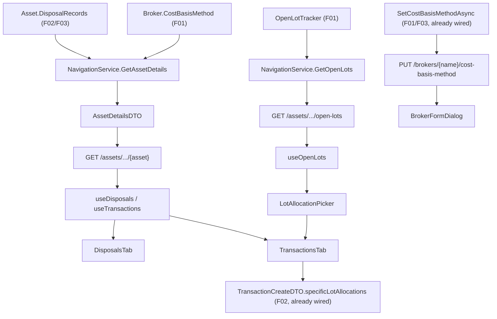

# Spec: F04. React — Disposals and Cost Basis

## 1. Technical Overview

**What:** Surface F01/F02/F03's Domain/Application work — `DisposalRecord` history, per-broker
`CostBasisMethod`, and open-lot data — through the API, then build the `Financial.Web` UI that
consumes it: a Disposals section on the asset detail view (list, tax-year filter, superseded audit
trail), a `CostBasisMethod` field on the Admin Broker form, and a SpecificId lot-allocation control on
Sell/Redemption entry.

**Why:** F01–F03 were deliberately Domain/Application/Infrastructure only — their own specs say "F04/F05
are its front-end surfaces." Nothing in `Financial.Api` exposes `DisposalRecord`, open lots, or
`Broker.CostBasisMethod` yet (confirmed by grep: zero references to either concept anywhere under
`Financial.Api`), and no DTO for either exists. F04 is therefore the feature that both completes the
API contract and builds the React UI against it — the API additions have no other owner.

**Scope:**
- **Included (PRD has no Core/Full split for F04, so full feature scope applies):**
  - API: `DisposalRecordDTO` (+ `DisposalLotConsumptionDTO`) added to the existing
    `GET /assets/{broker}/{portfolio}/{asset}` response; the same asset's effective `CostBasisMethod`
    added to that response; a new `GET .../open-lots` endpoint; a new
    `PUT /brokers/{name}/cost-basis-method` endpoint wired to the already-implemented
    `IBrokerService.SetCostBasisMethodAsync`; `CostBasisMethod` added to `BrokerDTO`/`BrokerCreateDTO`.
  - Web: a "Disposals" tab (list, tax-year filter, superseded audit trail) on the asset detail view; a
    `CostBasisMethod` field on the Admin Broker form; a lot-allocation control shown on Sell/Redemption
    entry when the holding's broker is `SpecificId`, wired into the existing (already-implemented)
    `TransactionCreateDTO.SpecificLotAllocations`.
- **Excluded:**
  - `Financial.App` (WPF) — F05, a separate PRD feature.
  - Reallocating lots on an **edit** of an existing SpecificId sale — `TransactionUpdateDTO` has no
    lot-allocation field today and the PRD's F04 capabilities describe lot selection only "when
    entering a Sell (or Redemption)," i.e. at creation. See Decision 6.
  - A new app-wide unsaved-changes-guard mechanism. See Decision 7.
  - Everything the PRD's own §7 Out of Scope already excludes (tax computation, corporate actions,
    HIFO/LIFO, per-asset method override, editing a computed `DisposalRecord` directly, reporting-
    currency conversion).

## 2. Architecture Impact

**Affected components:**

API (`Financial.Api`):
- `Controllers/AssetsController.cs` — modified: new `GET {brokerName}/{portfolioName}/{assetName}/open-lots` action.
- `Controllers/BrokersController.cs` — modified: new `PUT {name}/cost-basis-method` action.

Application (`Financial.Investment.Application`):
- `DTOs/DisposalRecordDTO.cs`, `DTOs/DisposalLotConsumptionDTO.cs`, `DTOs/OpenLotDTO.cs`,
  `DTOs/SetCostBasisMethodRequestDTO.cs` — new.
- `DTOs/AssetDetailsDTO.cs` — modified: `DisposalRecords` and `CostBasisMethod` fields.
- `DTOs/BrokerDTO.cs`, `DTOs/BrokerCreateDTO.cs` — modified: `CostBasisMethod` field.
- `Services/NavigationService.cs` — modified: maps `DisposalRecords`/`CostBasisMethod` into
  `AssetDetailsDTO`; new `GetOpenLots` method.
- `Services/BrokerService.cs` — modified: `ToDto` includes `CostBasisMethod`; `CreateBrokerAsync` applies
  an optional requested method.
- `Interfaces/INavigationService.cs` — modified: new `GetOpenLots` signature.
- `Mappers/NavigationMapper.cs` (or wherever `MapTransaction`/`MapCredit` live) — modified: new
  `MapDisposalRecord`/`MapOpenLot`.

Web (`Financial.Web/src`):
- `hooks/useDisposals.ts` — new: fetches asset details, exposes `Active` disposals sorted newest-first,
  a tax-year filter, and superseded chains grouped by `transactionId`.
- `components/DisposalsTab.tsx` — new: renders the list, `FilterTabList`-based tax-year filter, and a
  Fluent `Accordion` per row for the superseded audit trail.
- `components/DetailPanel.tsx` — modified: registers the `disposals` tab (asset-only, alongside
  `priceHistory`).
- `components/BrokerFormDialog.tsx` — modified: adds a `CostBasisMethod` `Select`.
- `hooks/useBrokers.ts` (or `pages/BrokersPage.tsx`, whichever owns the `onSubmit` call) — modified:
  passes `costBasisMethod` through create/update.
- `hooks/useOpenLots.ts` — new: fetches open lots for the selected asset on demand.
- `components/LotAllocationPicker.tsx` — new: renders one row per open lot with a quantity input and a
  running allocated/remaining summary.
- `hooks/useTransactions.ts` — modified: tracks lot-allocation state, validates it before save, and
  includes it in `TransactionCreateDto.specificLotAllocations`.
- `components/TransactionsTab.tsx` — modified: renders `LotAllocationPicker` inside `InlineForm` when
  the selected asset's `costBasisMethod` is `SpecificId` and the form type is Sell/Redemption.
- `api/types.ts` — modified: new aliases (`DisposalRecordDto`, `DisposalLotConsumptionDto`,
  `OpenLotDto`, `CostBasisMethod`, `DisposalRecordStatus`).
- `api/generated/openapi.ts` — regenerated (`npm run generate-api-types`), not hand-edited.
- `Tests/Financial.Api.Tests/Contract/openapi-v1.snapshot.json` — regenerated
  (`UPDATE_OPENAPI_SNAPSHOT=1`), not hand-edited.



## 3. Technical Decisions

| Decision | Chosen Approach | Alternative Considered | Trade-off |
|---|---|---|---|
| Where the missing API surface is built | Inside F04, sliced into its own PRs ahead of the Web PRs, per `docs/rules/design.md`'s Domain→Application→Infrastructure→API→Web ordering | Track it as untracked prerequisite work outside any PRD feature | F04's own PR count is larger than a typical feature, but AC-04..07 (which need this data on the wire) stay traceable to F04's spec/plan instead of an untracked side effort |
| `DisposalRecord` exposure | Add `DisposalRecords` (all statuses) to the existing `AssetDetailsDTO`, mirroring how `Credits`/`PriceSnapshots` are already exposed there | A dedicated `GET .../disposals` endpoint | Reuses the endpoint and per-tab fetch pattern every other asset-detail tab (`useCredits`, `useTransactions`) already follows; the asset-details payload grows by a bounded, per-asset amount instead of adding a new round trip |
| Superseded-chain construction | Return **all** `DisposalRecord`s (Active + Superseded) for the asset and build the audit-trail chain client-side by grouping on `TransactionId` (preserved across regeneration — confirmed in `DisposalRecordRegenerator.ComputePlan`, which matches `existingByTransactionId` by `TransactionId`) and following `SupersededByRecordId` | A dedicated "history" endpoint per disposal | A little client-side grouping logic instead of a new endpoint; the full per-asset list is already small (bounded by that asset's transaction count) |
| Open lots exposure | A dedicated `GET .../open-lots` endpoint, fetched on demand only when a Sell/Redemption is being entered against a `SpecificId` broker | Fold open lots into `AssetDetailsDTO` | Avoids running `OpenLotTracker.GetOpenLots` on every asset-details load for `AverageCost`/`FIFO` brokers, where the UI never needs it |
| Broker `CostBasisMethod` write path | A dedicated `PUT /brokers/{name}/cost-basis-method` endpoint calling the already-implemented `SetCostBasisMethodAsync`, rather than adding the field to the existing rename/currency `PUT /brokers/{name}` | Add `CostBasisMethod` to `BrokerUpdateDTO` and branch inside `UpdateBrokerAsync` | Keeps the cheap rename/currency path separate from the method-change path, which always triggers a full `DisposalRecordRegenerator.RegenerateBroker` — matching how F03 already wrote `SetCostBasisMethodAsync` as its own Application method, distinct from `UpdateBrokerAsync` |
| Editing an existing SpecificId sale's lots | Out of scope: the lot picker only appears when **entering** a Sell/Redemption; editing one goes through the existing (lot-picker-less) form unchanged | Extend `TransactionUpdateDTO` with a lot-allocation field and add an edit-time picker | Matches the PRD's F04 capability wording ("when entering a Sell (or Redemption)"); an edit that changes a SpecificId sale's quantity replays the original allocation via F03's regeneration and throws if it no longer fits — an already-tested (F03 AC-06), correct failure mode, not silent corruption. A full edit-time picker is deferred to a later feature if ever needed |
| PRD's "existing unsaved-changes guard" (F04 Experience) | Not implemented: grepped the whole `Financial.Web/src` tree for `unsaved`/`dirty`/`beforeunload`/`confirmLeave` — no such guard exists anywhere in the codebase today, for any form. Skipped for F04 rather than invented from scratch | Build a new local guard scoped to just the lot-allocation control | No Section 9 AC tests this Experience bullet; inventing a one-off guard for a single control while the rest of the app (including the plain transaction-entry form the picker sits inside) has none would be inconsistent, speculative scope. Flagged here per the project's own "verify PRD experience text" convention rather than silently dropped |

## 4. Component Overview

**API / Application (backend):**

| File Path | New/Modified | Purpose | Key Responsibilities |
|---|---|---|---|
| `Financial.Investment.Application/DTOs/DisposalRecordDTO.cs` | New | Wire shape for one disposal | `Id`, `TransactionId`, `Date`, `Method`, `LotsConsumed`, `QuantityDisposed`, `Proceeds`, `CostBasis`, `GainLoss`, `Currency`, `TaxYear`, `Status`, `SupersededByRecordId`, `CreatedAt` |
| `Financial.Investment.Application/DTOs/DisposalLotConsumptionDTO.cs` | New | Wire shape for one consumed lot | `SourceTransactionId` (nullable), `Quantity`, `UnitCost` |
| `Financial.Investment.Application/DTOs/OpenLotDTO.cs` | New | Wire shape for one open lot | `SourceTransactionId`, `Date`, `RemainingQuantity`, `UnitCost` |
| `Financial.Investment.Application/DTOs/SetCostBasisMethodRequestDTO.cs` | New | Request body for the method-change endpoint | `Method` |
| `Financial.Investment.Application/DTOs/AssetDetailsDTO.cs` | Modified | Carries disposal + method data to the asset detail view | Adds `DisposalRecords: List<DisposalRecordDTO>` and `CostBasisMethod` |
| `Financial.Investment.Application/DTOs/BrokerDTO.cs` | Modified | Broker read shape | Adds `CostBasisMethod` |
| `Financial.Investment.Application/DTOs/BrokerCreateDTO.cs` | Modified | Broker create request | Adds optional `CostBasisMethod` (defaults to `AverageCost` when omitted) |
| `Financial.Investment.Application/Services/NavigationService.cs` | Modified | Read-side mapping | Maps `asset.DisposalRecords`; resolves the parent `Broker` (Active then Historic, matching `BrokerService`'s existing resolution order) to read `CostBasisMethod`; new `GetOpenLots(brokerName, portfolioName, assetName)` calling `OpenLotTracker.GetOpenLots(asset.Transactions)` |
| `Financial.Investment.Application/Services/BrokerService.cs` | Modified | Broker mapping/creation | `ToDto` includes `CostBasisMethod`; `CreateBrokerAsync` calls `created.SetCostBasisMethod(request.CostBasisMethod ?? CostBasisMethod.AverageCost)` before save (no regeneration needed — a new broker has no disposals) |
| `Financial.Investment.Application/Interfaces/INavigationService.cs` | Modified | Contract | Adds `IReadOnlyList<OpenLotDTO> GetOpenLots(string, string, string)` |
| `Financial.Api/Controllers/AssetsController.cs` | Modified | HTTP surface | `GET {brokerName}/{portfolioName}/{assetName}/open-lots` → 200 with the open lots, 404 if the asset doesn't exist |
| `Financial.Api/Controllers/BrokersController.cs` | Modified | HTTP surface | `PUT {name}/cost-basis-method` → `IBrokerService.SetCostBasisMethodAsync`; 200 with the updated broker, 400 if the body is missing, 404 if the broker doesn't exist |

**Web (frontend):**

| File Path | New/Modified | Purpose | Key Responsibilities |
|---|---|---|---|
| `src/api/types.ts` | Modified | Type aliases | `DisposalRecordDto`, `DisposalLotConsumptionDto`, `OpenLotDto`, `CostBasisMethod`, `DisposalRecordStatus` |
| `src/hooks/useDisposals.ts` | New | Disposals data + filter state | Fetches asset details (same `getAssetDetails` call `useCredits`/`useTransactions` already make); derives `Active` disposals sorted newest-first; derives the tax-year options actually present; groups all records by `transactionId` into audit-trail chains |
| `src/components/DisposalsTab.tsx` | New | Disposals UI | List (date/quantity/method/proceeds/cost basis/gain-loss/tax year); `FilterTabList` tax-year filter; per-row `Accordion` showing the superseded chain; initial/loading/empty/filtered-empty states via existing `LoadingState`/inline messages |
| `src/components/DetailPanel.tsx` | Modified | Tab registration | Adds `disposals` to the asset-only tab list next to `priceHistory`; lazy-imports `DisposalsTab` |
| `src/components/BrokerFormDialog.tsx` | Modified | Admin Broker form | Adds a `CostBasisMethod` `Select` (AverageCost/FIFO/SpecificId), defaulting to AverageCost for a new broker |
| `src/hooks/useBrokers.ts` | Modified | Broker create/update calls | Passes `costBasisMethod` through to `apiClient.addBroker`/`apiClient.updateBroker`/a new `setCostBasisMethod` call |
| `src/hooks/useOpenLots.ts` | New | On-demand open-lot data | Fetches `GET .../open-lots` for the selected asset only while the lot picker is shown |
| `src/components/LotAllocationPicker.tsx` | New | Lot allocation control | One row per open lot (date, remaining quantity, unit cost) with a quantity input; running allocated/remaining summary; per-row over-allocation rejected inline |
| `src/hooks/useTransactions.ts` | Modified | Sell/Redemption entry | Tracks lot-allocation map state; requires it to sum exactly to the sale quantity for a `SpecificId` broker before enabling save; includes it as `specificLotAllocations` on create; preserves the existing "#792" all-fields-survive-a-rejected-save behavior for the new state too |
| `src/components/TransactionsTab.tsx` | Modified | Sell/Redemption entry UI | Renders `LotAllocationPicker` inside `InlineForm` when `formType` is Sell/Redemption and the selected asset's `costBasisMethod` is `SpecificId` |

## 5. API Contracts

### Endpoint: Get Asset Details (existing, extended)
- **Method:** GET
- **Path:** `/api/v1/financial/investment/assets/{brokerName}/{portfolioName}/{assetName}`
- **Change:** response gains `disposalRecords` (all statuses, unsorted — the client sorts/groups) and
  `costBasisMethod` (the parent broker's current method).

**Response addition example:**
```json
{
  "costBasisMethod": "FIFO",
  "disposalRecords": [
    {
      "id": "b2b6f8b1-0000-0000-0000-000000000001",
      "transactionId": "a1a1f8b1-0000-0000-0000-000000000009",
      "date": "2025-11-03T00:00:00",
      "method": "FIFO",
      "lotsConsumed": [
        { "sourceTransactionId": "c3c3f8b1-0000-0000-0000-000000000002", "quantity": 10, "unitCost": 12.5 }
      ],
      "quantityDisposed": 10,
      "proceeds": 150.0,
      "costBasis": 125.0,
      "gainLoss": 25.0,
      "currency": "GBP",
      "taxYear": "2025/26",
      "status": "Active",
      "supersededByRecordId": null,
      "createdAt": "2025-11-03T09:12:00Z"
    }
  ]
}
```

### Endpoint: Get Open Lots
- **Method:** GET
- **Path:** `/api/v1/financial/investment/assets/{brokerName}/{portfolioName}/{assetName}/open-lots`

**Response (200):**

| Field | Type | Description |
|---|---|---|
| `sourceTransactionId` | `uuid` | The Buy/TransferIn transaction that opened the lot |
| `date` | `date-time` | The lot's transaction date |
| `remainingQuantity` | `decimal` | Units of this lot not yet consumed by a later disposal/TransferOut |
| `unitCost` | `decimal` | The lot's per-unit cost |

**Response Example:**
```json
[
  { "sourceTransactionId": "c3c3f8b1-0000-0000-0000-000000000002", "date": "2024-06-01T00:00:00", "remainingQuantity": 15, "unitCost": 12.5 }
]
```

**Error Codes:**

| Code | HTTP Status | Description |
|---|---|---|
| — | 404 | Broker/portfolio/asset not found (matches `GetAssetDetails`'s existing 404 behavior) |

### Endpoint: Set Broker Cost Basis Method
- **Method:** PUT
- **Path:** `/api/v1/financial/investment/brokers/{name}/cost-basis-method`

**Request:**

| Field | Type | Required | Validation | Description |
|---|---|---|---|---|
| `method` | `string` (enum: `AverageCost`\|`FIFO`\|`SpecificId`) | Yes | must be a valid enum value | The broker's new method |

**Request Example:**
```json
{ "method": "FIFO" }
```

**Response (200):** the updated `BrokerDTO` (now including `costBasisMethod`).

**Error Codes:**

| Code | HTTP Status | Description |
|---|---|---|
| — | 400 | Body missing |
| — | 404 | Broker not found |
| — | 500 (propagated) | Regeneration failed — `SetCostBasisMethodAsync` already rolls the method back and rethrows (F03); no new error shape needed |

### Endpoint: Create/Update Broker (existing, extended)
- **Method:** POST `/brokers`, PUT `/brokers/{name}`
- **Change:** `BrokerCreateDTO` gains optional `costBasisMethod` (nullable; `AverageCost` applied when
  omitted). `BrokerUpdateDTO` is **not** changed — method changes go through the dedicated endpoint above.

## 6. Data Model

No new persisted shape — every field this feature exposes already exists in
`data-investment.json` from F01/F02/F03 (`Broker.CostBasisMethod`, `Asset.DisposalRecords`). This
feature only adds DTOs and mapping; no migration, no schema change.

## 7. Testing Strategy

Per `testing-guide-Financial`: Application-layer mapping gets unit/integration tests in
`Tests/Financial.Investment.Application.Tests`; the new controller actions get contract coverage via
the OpenAPI snapshot plus `Tests/Financial.Api.Tests`; React pieces get component/hook tests under
`Financial.Web/src/**/__tests__` following `CreditsTab.test.tsx`/`useCredits.test.ts`'s existing shape.

| Test File | Test Type | Target | Coverage Goal |
|---|---|---|---|
| `Tests/Financial.Investment.Application.Tests/Services/NavigationServiceTests.cs` (extended) | Unit | `GetAssetDetails`, `GetOpenLots` | `DisposalRecords`/`CostBasisMethod` map correctly; open lots match `OpenLotTracker` output |
| `Tests/Financial.Investment.Application.Tests/Services/BrokerServiceTests.cs` (extended) | Unit | `ToDto`, `CreateBrokerAsync` | `CostBasisMethod` round-trips on read; a new broker respects a requested method with no regeneration call |
| `Tests/Financial.Api.Tests/Contract/OpenApiContractTests.cs` (snapshot regen) | Contract | OpenAPI document | New/changed schemas match the committed snapshot |
| `Tests/Financial.Api.Tests/Controllers/AssetsControllerTests.cs` (extended) | Integration | `GET .../open-lots` | 200 with expected lots; 404 for a missing asset |
| `Tests/Financial.Api.Tests/Controllers/BrokersControllerTests.cs` (extended) | Integration | `PUT .../cost-basis-method` | 200 updates the method and triggers regeneration (asserted via a subsequent `GetAssetDetails` read); 404 for a missing broker |
| `Financial.Web/src/hooks/__tests__/useDisposals.test.ts` | Unit | `useDisposals` | Filters to `Active` for the list; derives tax-year options from the loaded data; groups chains by `transactionId` correctly for a superseded example |
| `Financial.Web/src/components/__tests__/DisposalsTab.test.tsx` | Component | `DisposalsTab` | Initial-empty, loading, tax-year-filtered-empty, list render, and audit-trail-expand states |
| `Financial.Web/src/components/__tests__/BrokerFormDialog.test.tsx` (extended) | Component | Cost Basis Method field | Renders, defaults to AverageCost for a new broker, submits the selected value |
| `Financial.Web/src/hooks/__tests__/useOpenLots.test.ts` | Unit | `useOpenLots` | Fetches on demand; surfaces load error |
| `Financial.Web/src/components/__tests__/LotAllocationPicker.test.tsx` | Component | `LotAllocationPicker` | Running total updates; submit disabled until it matches the sale quantity; over-allocating a single lot is rejected inline |
| `Financial.Web/src/hooks/__tests__/useTransactions.test.ts` (extended) | Unit | Lot allocation + save | Save blocked until allocation matches quantity for a `SpecificId` broker; unaffected for `AverageCost`/`FIFO`; a rejected save preserves all entered fields including the allocation (the "#792" pattern) |

## Assumptions / Decisions (auto-accepted, no interactive interview — running autonomously)

1. The missing API surface (DTOs, mapping, two new/extended endpoints) is built inside F04 rather than
   as untracked prerequisite work, sliced into its own PR(s) ahead of the Web PRs per
   `docs/rules/design.md`.
2. `AssetDetailsDTO` gains both `DisposalRecords` and `CostBasisMethod` — the latter isn't explicitly
   named as an `AssetDetailsDTO` field in the PRD, but the SpecificId lot picker (already-scoped F04
   capability) needs to know the asset's broker's method before rendering, and this is the same
   per-tab-fetch data source `TransactionsTab` already reads.
3. Superseded audit-trail chains are reconstructed on the client by grouping `DisposalRecordDTO`s by
   `TransactionId`, verified against `DisposalRecordRegenerator.ComputePlan`'s `existingByTransactionId`
   lookup, which confirms `TransactionId` is stable across regeneration.
4. A `DisposalRecord` retired with no replacement (`SupersededByRecordId == null` after a disposing
   transaction is deleted) has no `Active` record left in its `TransactionId` group and is not rendered
   anywhere in F04 — there is no current row for its history to attach to.
5. `BrokerCreateDTO.CostBasisMethod` is optional and applied directly (no regeneration call) since a
   newly created broker has no assets/disposals yet; `BrokerUpdateDTO` (rename/currency) is left
   unchanged — method changes always go through the dedicated endpoint.
6. Editing an existing SpecificId disposing transaction's lot allocation is out of scope for F04 (see
   Decision 6); this is a deliberate scope boundary, not an oversight.
7. No new unsaved-changes-guard mechanism is introduced (see Decision 7) — the PRD's Experience bullet
   referencing "the existing" guard doesn't correspond to anything in the codebase today.
8. Currency/enum values on the wire follow the codebase's established `JsonStringEnumConverter`
   convention (already used throughout `AssetDetailsDTO`), so `CostBasisMethod`/`DisposalRecordStatus`
   serialize as strings, not integers.
