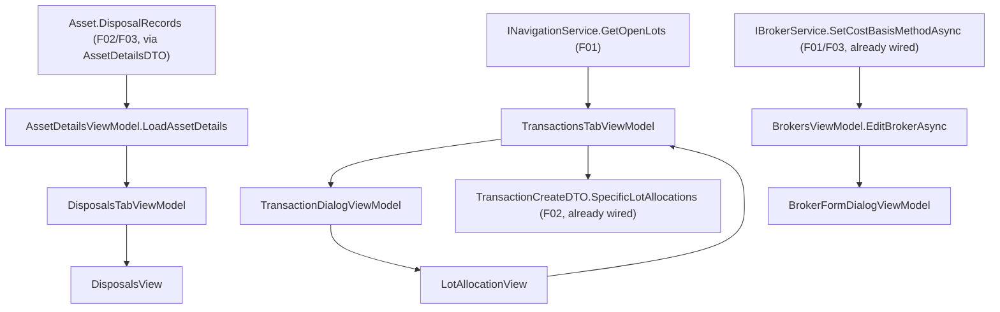

# Spec: F05. WPF — Disposals and Cost Basis

## 1. Technical Overview

**What:** Build the `Financial.App` (WPF) equivalent of F04: a Disposals section on the asset detail
view (list, tax-year filter, superseded audit trail), a `CostBasisMethod` field on the Admin Broker
form, and a SpecificId lot-allocation control on Sell/Redemption entry — same terminology, field order,
validation meaning and states as `Financial.Web`, adapted to WPF idioms.

**Why:** F01–F03 already expose everything this feature needs through the Application layer
(`AssetDetailsDTO.DisposalRecords`/`CostBasisMethod`, `INavigationService.GetOpenLots`,
`IBrokerService.SetCostBasisMethodAsync`, `TransactionCreateDTO.SpecificLotAllocations`) — confirmed by
grep, all four already exist and are exercised by F04. `Financial.App` composes the same Application
services in-process (`App.xaml.cs`, no HTTP layer), so unlike F04 this feature needs **zero** backend
work: it is pure `Financial.Presentation.App` ViewModel/View work wiring already-available data.

**Scope:**
- **Included (PRD has no Core/Full split for F05, so full feature scope applies):**
  - A new "Disposals" tab on the asset detail view: list (date, quantity, method, proceeds, cost basis,
    gain/loss, tax year, newest first), a tax-year filter, and a per-row expandable audit trail.
  - A `CostBasisMethod` field (AverageCost/FIFO/SpecificId) on the Admin Broker create/edit form.
  - A lot-allocation control shown on Sell/Redemption entry when the holding's broker is `SpecificId`,
    wired into the already-implemented `TransactionCreateDTO.SpecificLotAllocations`.
- **Excluded:**
  - Any Domain/Application/Infrastructure/API change — none needed (see Why).
  - Everything the PRD's own §7 Out of Scope already excludes (tax computation, corporate actions,
    HIFO/LIFO, per-asset method override, editing a computed `DisposalRecord` directly, reporting-
    currency conversion, editing an existing SpecificId sale's lot allocation — matches F04's Decision 6).

## 2. Architecture Impact

**Affected components** (all `Financial.App`, i.e. `Financial.Presentation.App`):

- `Components/NavigationView.xaml` — modified: new "Disposals" `TabItem` (index 4), asset-only
  visibility, mirroring "Price History" (index 3).
- `ViewModels/Investment/AssetDetailsViewModel.cs` — modified: composes a new `DisposalsTabViewModel`;
  `Load`/`Clear`/`UpdateCommandStates` call into it exactly like `PriceHistory`/`Credits`/`Transactions`.
- `ViewModels/Investment/DisposalsTabViewModel.cs` — new: list + tax-year filter + superseded-chain
  state, modeled on `PriceHistoryTabViewModel`'s Load/Clear/context-key+view-state shape.
- `ViewModels/Investment/DisposalRecordRowViewModel.cs` — new: wraps one `Active` `DisposalRecordDTO`
  plus its resolved `SupersededHistory` chain for the row's Expander.
- `ViewModels/Investment/DisposalsViewState.cs` — new: per-asset persisted filter selection, mirroring
  `PriceHistoryViewState`.
- `Views/Investment/DisposalsView.xaml` (+ `.xaml.cs`) — new: the tab's `UserControl`.
- `Views/Admin/BrokerFormDialog.xaml` (+ `ViewModels/Admin/BrokerFormDialogViewModel.cs`) — modified:
  adds a Cost Basis Method `ComboBox`.
- `ViewModels/Admin/BrokersViewModel.cs` — modified: `EditBrokerAsync` calls
  `SetCostBasisMethodAsync` when the dialog's method differs from the broker's current one, after the
  rename/currency update succeeds (mirrors F04 Stage 5's two-step `handleFormSubmit`).
- `ViewModels/Investment/TransactionDialogViewModel.cs` — modified: adds lot-allocation state
  (`RequiresLotAllocation`, per-lot quantity map, `AllocatedTotal`, exact-match/over-allocation
  validation) folded into `Validate()`/`CanConfirm()`.
- `ViewModels/Investment/TransactionsTabViewModel.cs` — modified: takes an optional `INavigationService`
  dependency; when opening the Add form for Sell/Redemption against a `SpecificId` broker, fetches open
  lots and passes them (plus a retry callback) into the `TransactionDialogViewModel`; includes
  `SpecificLotAllocations` in `TransactionCreateDTO` on submit.
- `Views/Investment/LotAllocationView.xaml` (+ `.xaml.cs`) — new: the editable-`DataGrid` control shown
  inside `TransactionFormView` when `RequiresLotAllocation` is true.
- `Views/Investment/TransactionFormView.xaml` — modified: hosts `LotAllocationView`, bound to
  `RequiresLotAllocation`.
- `Helpers/LotAllocationCalculator.cs` — new: `SumAllocations`/`IsAllocationExact`/`IsLotOverAllocated`,
  tolerance-based (mirrors `Financial.Web/src/utils/lotAllocation.ts`, same tolerance constant).
- `Helpers/CostBasisMethodParser.cs` (or a small static map alongside `BrokerFormDialogViewModel`) — new:
  parses the WPF form's `string` selection to/from the `CostBasisMethod` enum, matching the existing
  `Currencies` string-array convention.

## 3. Technical Decisions

| Decision | Chosen Approach | Alternative Considered | Trade-off |
|---|---|---|---|
| Backend/API work | None — F05 consumes the same `AssetDetailsDTO`/`INavigationService`/`IBrokerService`/`TransactionCreateDTO` surface F04 already proved out over HTTP; WPF calls the same Application services in-process | Add a WPF-specific service facade | Nothing to add — `Financial.App` already composes `Financial.Investment.Application` directly (`App.xaml.cs`), so no new seam is needed |
| Disposals tab placement | New `TabItem` at index 4 ("Disposals"), `Visibility` bound to `AssetDetails.IsAssetView`, same as "Price History" (index 3) | A sub-section inside the existing Summary tab | Matches F04's placement as its own top-level section and the codebase's one-tab-per-concern convention (`Transactions`/`Credits`/`PriceHistory`) |
| Disposals list + filter shape | `DisposalsTabViewModel` modeled on `PriceHistoryTabViewModel`: a context-key-scoped view-state dictionary (`DisposalsViewState`) holding the selected tax year, rebuilt via `SelectableOptionGroup<string>` (generic, already used for `PeriodFilter`/`ChartTypeMode`) | A one-off filter implementation specific to tax years | Reuses an existing generic building block instead of a parallel implementation; tax-year options are still built dynamically per `Load()` call from the tax years actually present, matching F04 AC-02 |
| Superseded audit trail | Per-row **WPF-UI `Expander`** in the `DataGrid`'s `RowDetailsTemplate`, default-collapsed, bound to `DisposalRecordRowViewModel.SupersededHistory` | A separate "History" dialog button per row | User's explicit choice (AskUserQuestion) — closest visual/interaction equivalent to Web's per-row `Accordion`, keeps everything in one view |
| Chain construction | Group `DisposalRecordDTO`s by `TransactionId` and follow `SupersededByRecordId` client-side inside `DisposalsTabViewModel.Load`, identical algorithm to F04's `useDisposals` (already verified `TransactionId` is stable across regeneration via `DisposalRecordRegenerator.ComputePlan`) | A dedicated history query | No new Application surface needed; the full per-asset list is already loaded via `AssetDetailsDTO.DisposalRecords` |
| Cost Basis Method field | A `ComboBox` on `BrokerFormDialog.xaml` bound to a new `string CostBasisMethod` property on `BrokerFormDialogViewModel`, using the same `SelectedValuePath="Content"` pattern as the existing `Currency` `ComboBox`, with a static `CostBasisMethods` string array mirroring `Currencies` | A dedicated method-selection dialog | Matches the existing `BrokerFormDialogViewModel` shape exactly (`Name`/`Currency` today); no new dialog type |
| Cost Basis Method write path | `BrokersViewModel.EditBrokerAsync`: after `UpdateBrokerAsync` (rename/currency) succeeds, if the dialog's method differs from the broker's current one, call `IBrokerService.SetCostBasisMethodAsync` and surface any failure as `"'{name}' was saved, but its cost basis method could not be changed: {message}"` on `ActionError` | Fold the method into `BrokerUpdateDTO` | Exact parity with F04 Stage 5's `handleFormSubmit` two-step pattern and error wording; keeps the cheap rename/currency path separate from the always-regenerating method-change path (`SetCostBasisMethodAsync` already does this split on the Application side) |
| SpecificId lot allocation UI | A `DataGrid` (`LotAllocationView`) with a bound, editable `Quantity` column, `AutoGenerateColumns="False"`, matching every other data grid's convention | An `ItemsControl` of rows with a `TextBox` each | User's explicit choice (AskUserQuestion) — consistent with the app's dense tabular convention for financial data; no existing per-row-editable-grid precedent, so this establishes one rather than introducing a second list idiom |
| Open lots fetch | `TransactionsTabViewModel` takes an **optional** `INavigationService?` constructor parameter (same optional-service pattern as `IAssetPriceLookupService?`/`IAssetPriceHistoryService?` on `AssetDetailsViewModel`), calling `GetOpenLots` only when the Add form opens for Sell/Redemption against a `SpecificId` broker | Inject `INavigationService` into `TransactionDialogViewModel` directly | `TransactionDialogViewModel` stays a plain, service-free data/validation object (its existing shape); the async fetch and retry live in the tab ViewModel, which already owns the async fetch pattern (`LoadBroker`/`LoadPortfolio`) |
| Lot allocation validation | New static `LotAllocationCalculator` helper (`SumAllocations`/`IsAllocationExact`/`IsLotOverAllocated`), tolerance-based comparison, folded into `TransactionDialogViewModel.Validate()`/`CanConfirm()` so Confirm disables exactly like every other validation failure | Inline the comparison logic in the ViewModel | Mirrors F04's dedicated `lotAllocation.ts` utility (same tolerance constant, same three functions) instead of duplicating floating-point-unsafe comparisons inline; independently unit-testable |
| Retry on open-lots fetch failure | `TransactionDialogViewModel` exposes a `RetryOpenLotsCommand` that re-invokes the same fetch through `TransactionsTabViewModel`, matching F04 AC-05's "same validation behaviour as Web" requirement (Web's `useOpenLots.retry`) | No retry — require closing and reopening the form | Required for React/WPF parity per F05's own AC-03 wording ("same open-lot allocation control... same validation behaviour") |
| Editing an existing SpecificId sale's lots | Out of scope, matching F04 Decision 6 exactly — the lot picker only appears when **entering** a Sell/Redemption (`TransactionDialogMode.Add`), never on `Update` | Extend edit mode with a lot picker too | Consistency with F04; an edit to a SpecificId sale's quantity replays through F03's regeneration and fails loudly if it no longer fits (already-tested F03 behavior), not silent corruption |

## 4. Component Overview

| File Path | New/Modified | Purpose | Key Responsibilities |
|---|---|---|---|
| `Financial.App/Components/NavigationView.xaml` | Modified | Tab registration | New "Disposals" `TabItem` (index 4), `Visibility` bound to `IsAssetView` |
| `Financial.App/ViewModels/Investment/AssetDetailsViewModel.cs` | Modified | Tab composition | Exposes `DisposalsTabViewModel Disposals`; `LoadAssetDetails`/`Clear`/`UpdateCommandStates` call into it |
| `Financial.App/ViewModels/Investment/DisposalsTabViewModel.cs` | New | Disposals list + filter state | `Load(contextKey, disposalRecords)`; derives `Active` rows sorted newest-first with resolved `SupersededHistory`; derives tax-year filter options actually present; per-context-key view state (mirrors `PriceHistoryTabViewModel`) |
| `Financial.App/ViewModels/Investment/DisposalRecordRowViewModel.cs` | New | Row shape for the grid | Wraps one `Active` `DisposalRecordDTO` plus `IReadOnlyList<DisposalRecordDTO> SupersededHistory` (oldest→newest) |
| `Financial.App/ViewModels/Investment/DisposalsViewState.cs` | New | Per-asset persisted filter | `TaxYear` (nullable = "All"), mirrors `PriceHistoryViewState`'s single-field record shape |
| `Financial.App/Views/Investment/DisposalsView.xaml` / `.xaml.cs` | New | Disposals tab UI | Tax-year filter row (`ItemsControl` of toggle buttons, matching `TransactionsFilters`'s pattern); `DataGrid` with `RowDetailsTemplate` `Expander`; initial/loading/empty/filtered-empty states via `TextBlock` visibility bindings |
| `Financial.App/Views/Admin/BrokerFormDialog.xaml` | Modified | Admin Broker form | New "Cost Basis Method" label + `ComboBox` (AverageCost/FIFO/SpecificId) + explanatory `TextBlock` ("Changing this for an existing broker recalculates every disposal record under it.") |
| `Financial.App/ViewModels/Admin/BrokerFormDialogViewModel.cs` | Modified | Form state | New `string CostBasisMethod` property, `CostBasisMethods` static array (`["AverageCost", "FIFO", "SpecificId"]`), constructor gains an optional `currentCostBasisMethod` parameter defaulting to `AverageCost` |
| `Financial.App/ViewModels/Admin/BrokersViewModel.cs` | Modified | Create/edit orchestration | `CreateBrokerAsync` passes the parsed method into `BrokerCreateDTO.CostBasisMethod`; `EditBrokerAsync` calls `SetCostBasisMethodAsync` after a successful rename/currency update when the method changed, wrapping any failure with the broker-was-saved message |
| `Financial.App/ViewModels/Investment/TransactionDialogViewModel.cs` | Modified | Lot allocation state + validation | `RequiresLotAllocation`, `ObservableCollection<LotAllocationRowViewModel>` (one per open lot, editable `Quantity`), `AllocatedTotal`, `RetryOpenLotsCommand`, folds allocation validity into `Validate()`/`CanConfirm()` |
| `Financial.App/ViewModels/Investment/LotAllocationRowViewModel.cs` | New | One open-lot row | `SourceTransactionId`, `Date`, `RemainingQuantity`, `UnitCost`, editable `Quantity` (`string`, matching the existing `DecimalInputBehavior`-backed `TextBox` pattern) |
| `Financial.App/ViewModels/Investment/TransactionsTabViewModel.cs` | Modified | Open-lots fetch + submit | Optional `INavigationService?` dependency; fetches open lots (with retry) when the Add form opens for Sell/Redemption against a `SpecificId` broker; includes `SpecificLotAllocations` in `TransactionCreateDTO` |
| `Financial.App/Views/Investment/LotAllocationView.xaml` / `.xaml.cs` | New | Lot allocation UI | `DataGrid` (date/remaining/unit cost read-only columns, editable Quantity column), running "Allocated X of Y" summary, over-allocation inline error per row, loading/error/retry states |
| `Financial.App/Views/Investment/TransactionFormView.xaml` | Modified | Hosts the lot picker | New row between the quantity/fees rows and the validation message, `Visibility` bound to `RequiresLotAllocation`, containing `LotAllocationView` |
| `Financial.App/Helpers/LotAllocationCalculator.cs` | New | Tolerance-based allocation math | `SumAllocations`, `IsAllocationExact`, `IsLotOverAllocated` — same tolerance constant as `Financial.Web/src/utils/lotAllocation.ts` |
| `Financial.App/Helpers/CostBasisMethodParser.cs` | New | Enum ↔ display string | Parses `BrokerFormDialogViewModel.CostBasisMethod`'s string selection to/from `CostBasisMethod` |

## 5. API Contracts

None — no `Financial.Api` change. `Financial.App` reads/writes through the same
`INavigationService`/`IBrokerService`/`ITransactionService` Application interfaces already extended by
F01–F03 and already exercised in-process by the existing WPF ViewModels above.

## 6. Data Model

No new persisted shape and no migration — `Broker.CostBasisMethod` and `Asset.DisposalRecords` already
exist in `data-investment.json` from F01/F02/F03. This feature only adds WPF ViewModels/Views.

## 7. Testing Strategy

Per `testing-guide-Financial`'s WPF guidance: ViewModel state/commands/validation get Unit tests in
`Tests/Financial.Presentation.Tests`; views get a binding-contract check plus manual verification per
`docs/rules/ui.md`. Selection through `TreeNodeViewModel.IsSelected` where a test needs a selected asset
(per `feedback_wpf_test_through_isselected`), never by assigning `SelectedNode` directly.

| Test File | Test Type | Target | Coverage Goal |
|---|---|---|---|
| `Tests/Financial.Presentation.Tests/ViewModels/DisposalsTabViewModelTests.cs` | Unit | `DisposalsTabViewModel` | `Load` filters to `Active`, sorts newest-first, derives tax-year options from the loaded data, resolves `SupersededHistory` correctly for a superseded example; `Clear` resets state |
| `Tests/Financial.Presentation.Tests/ViewModels/AssetDetailsViewModelTests.cs` (extended) | Unit | `AssetDetailsViewModel` | `LoadAssetDetails` forwards `DisposalRecords` into `Disposals.Load`; `Clear` clears it; tab visibility follows `IsAssetView` |
| `Tests/Financial.Presentation.Tests/ViewModels/Admin/BrokerFormDialogViewModelTests.cs` (extended) | Unit | Cost Basis Method field | Defaults to `AverageCost` for a new broker; round-trips an existing broker's method; `Confirm` carries the selected value |
| `Tests/Financial.Presentation.Tests/ViewModels/Admin/BrokersViewModelTests.cs` (extended) | Unit | `EditBrokerAsync`/`CreateBrokerAsync` | Method change calls `SetCostBasisMethodAsync` only when it actually changed; a `SetCostBasisMethodAsync` failure surfaces the "saved, but..." wording without discarding the rename; a new broker passes the selected method straight through |
| `Tests/Financial.Presentation.Tests/ViewModels/TransactionsTabViewModelTests.cs` (extended) | Unit | Open-lots fetch + submit | Fetches open lots only for Add + Sell/Redemption + `SpecificId`; retry re-fetches; `TransactionCreateDTO.SpecificLotAllocations` populated on submit; unaffected for `AverageCost`/`FIFO` |
| `Tests/Financial.Presentation.Tests/ViewModels/TransactionDialogViewModelTests.cs` (extended) | Unit | Lot allocation validation | `CanConfirm` false until allocation exactly matches quantity; false when any lot is over-allocated; a rejected submit (`ReportSubmitFailed`) preserves every entered allocation value |
| `Tests/Financial.Presentation.Tests/Helpers/LotAllocationCalculatorTests.cs` | Unit | `LotAllocationCalculator` | Exact-match tolerance, over-allocation detection, sum of a partial/empty allocation map |
| `Tests/Financial.Presentation.Tests/Views/DisposalsViewBindingTests.cs` (or equivalent contract test alongside other view binding tests) | Contract | `DisposalsView.xaml` grid columns | Column bindings resolve against `DisposalRecordRowViewModel`'s public properties |
| Manual (per `docs/rules/ui.md`) | Manual | `DisposalsView`, `BrokerFormDialog`, `LotAllocationView` | Launch the built app: Disposals tab (initial/loading/empty/filtered-empty/expand), Broker form (method change + recalculation), SpecificId sale entry (allocate/over-allocate/retry/save) — cross-checked against the equivalent `Financial.Web` screens for parity (F05 AC-05) |

## Assumptions / Decisions (recorded from the interview)

1. F05 needs no `Financial.Api`/Application/Domain change — everything it consumes was already built
   and proven out (over HTTP) by F01–F04; `Financial.App` reaches it in-process instead.
2. The superseded audit trail uses a per-row WPF-UI `Expander` in the `DataGrid`'s `RowDetailsTemplate`
   (user's explicit choice), not a separate history dialog.
3. The SpecificId lot allocation control is an editable-`Quantity`-column `DataGrid` (user's explicit
   choice), establishing this codebase's first per-row-editable-grid precedent — no existing WPF grid
   supports inline cell editing today.
4. `TransactionDialogViewModel` stays free of service dependencies; the open-lots fetch (with retry)
   lives in `TransactionsTabViewModel`, following the existing optional-service-dependency pattern
   already used for `IAssetPriceLookupService?`/`IAssetPriceHistoryService?`.
5. Editing an existing SpecificId disposing transaction's lot allocation stays out of scope, matching
   F04's Decision 6 exactly, for the same reasoning (F03's regeneration already fails loudly on a
   no-longer-fitting allocation).
6. Chain construction (grouping by `TransactionId`, following `SupersededByRecordId`) duplicates F04's
   already-verified algorithm rather than introducing a shared cross-front-end library, matching how
   `Financial.Web` and `Financial.App` already duplicate other presentation-layer logic (e.g. formatting)
   independently per platform.
