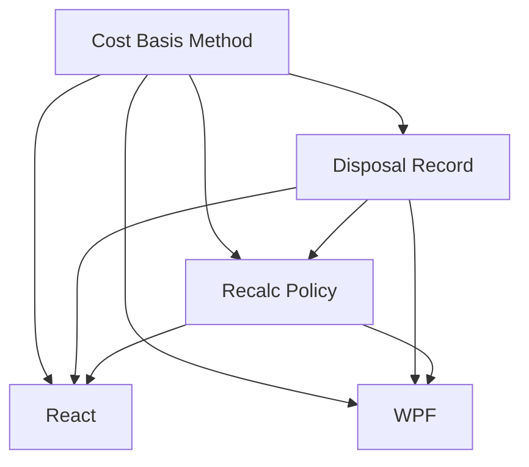

# Disposals and Cost Basis

## 1. Executive Summary

Disposals and Cost Basis closes G4 (no disposal record) and the FIFO/specific-identification half
of G3 for the Investment bounded context. Today, realised gain/loss is a running scalar
(`Transactions.RealizedCapitalGain`) recomputed by a full weighted-average replay on every edit —
nothing records which units a given sale actually disposed of, under which method, at what basis, or
in which tax year, and a later correction silently rewrites the figure with no trace of what it used
to be. This feature gives every Sell and Redemption a persisted, immutable `DisposalRecord`, lets a
user choose AverageCost (the unchanged default), FIFO or specific lot identification per broker, and
defines exactly what happens when a later edit or a method change invalidates an existing record: it
is superseded, never rewritten, and a full audit chain survives.

The work stays inside the boundary the roadmap already drew for this wave (§5, D1): it computes and
records a defensible cost basis and a tax year per disposal, but it does not classify a disposal for
tax purposes, apply any jurisdiction's matching rules (UK's 30-day bed-and-breakfast rule, BR's
exemption thresholds), or compute tax due — that is P51. It also does not touch corporate actions
(P53) or the domicile-vs-custody question the roadmap defers to P51 (G13/D7). Cost-basis method is
scoped per broker rather than per asset, since every existing broker is already effectively
single-jurisdiction (the Brazilian broker XPI in BRL, the three UK brokers — Trading 212, Coinbase,
FreeTrade — in GBP), and every existing sell across the data file gains a `DisposalRecord`
automatically on the next load, the same way P49's currency backfill worked, so disposal history is
complete from day one with no separate migration tool.

## 2. Problem and Opportunity

**The Problem**

- **No disposal record exists.** `Transactions.RealizedCapitalGain` is a running scalar recomputed by
  full replay (`Transactions.Recompute`); nothing persists which units were disposed, under which
  method, at what basis, or in which tax year. A user cannot answer "what did I actually sell, and at
  what cost, on this date" without re-deriving it by hand.
- **A correction silently rewrites history.** Editing a backdated transaction today replays everything
  and the old realised-gain figure is simply gone — there is no trace of what it used to be, which is
  exactly the retroactive-rewrite the brief's tax-reporting requirement (§5) forbids for a filed
  result.
- **Only one cost-basis method exists, and it can't be chosen.** Weighted average is folded directly
  into `Transactions.Apply` with no strategy seam; FIFO and specific-identification — both legitimate,
  commonly used methods — are structurally impossible today (G3).
- **Fees are entangled with acquisition cost.** `AveragePrice` already includes `Transaction.Fees`
  (G3), which is fine for economic return but conflates allowable acquisition cost with cost basis the
  moment more than one method needs to agree on what a "unit's cost" means.

**The Opportunity**

- A persisted, immutable `DisposalRecord` created automatically for every Sell/Redemption turns "what
  was disposed, at what basis" from a re-derivable fact into an auditable record — closing G4 directly
  and giving P51's future tax workbook something concrete to classify.
- A superseded/active status with a link chain, rather than in-place rewriting, satisfies the brief's
  own "must not retroactively rewrite a filed result" requirement (§5) while still letting a
  correction actually correct the figures everyone sees.
- Making `CostBasisMethod` an explicit per-broker strategy (AverageCost the unchanged default, FIFO
  and SpecificId as opt-in alternatives) closes the FIFO/specific-identification half of G3 without
  disturbing the weighted-average behaviour every existing holding already relies on.
- Scoping the method per broker, not globally, matches how the two jurisdictions already split in this
  data file — one broker per currency, one currency per country — with no new jurisdiction field
  needed ahead of P51's domicile work.

## 3. Target Audience

### Primary Users

**Self-hosted personal investor preparing to file taxes across two jurisdictions**
- Sells and redeems holdings across a BRL broker and three GBP brokers, and currently has no record
  of which units a given sale actually disposed of or at what basis.
- Wants to try FIFO or specific-lot identification instead of weighted average for at least one
  broker, without disturbing the historical figures already computed the old way.
- Expects a correction to a past transaction to update the numbers going forward without erasing the
  record of what the number used to be — a personal financial tool that silently rewrites its own
  history is not one to trust for anything a tax authority might later ask about.

## 4. Objectives

**Product Objectives**
- **Record** an immutable, auditable `DisposalRecord` for every disposal, replacing the unrecorded
  running-scalar realised-gain figure.
- **Support** AverageCost, FIFO and SpecificId as selectable per-broker cost-basis methods, with
  AverageCost as the unchanged default.
- **Preserve** every prior computed basis when a correction or method change forces a recalculation —
  never rewrite, always supersede.
- **Backfill** disposal history for every existing sell automatically, with no separate migration
  tool.
- **Maintain** React/WPF parity for the disposal view, the cost-basis method setting and the
  SpecificId lot picker.

**Success Metrics**
- 100% of the data file's existing Sell/Redemption transactions carry an Active `DisposalRecord` after
  the one-time on-load backfill, verified against a temp copy before the live file is touched.
- 0 `DisposalRecords` are ever mutated in place after creation — every change to a disposal's computed
  basis produces a new record and marks the old one Superseded, verified by an automated test
  asserting immutability.
- 3 of 3 cost-basis methods (AverageCost, FIFO, SpecificId) produce a `DisposalRecord` whose
  `GainLoss` reconciles exactly with `Proceeds - CostBasis` for every disposal in the data file.
- Switching a broker's `CostBasisMethod` and reloading shows 0 discrepancies between `Financial.Web`
  and `Financial.App` for the same holding's disposal history.

## 5. User Stories

### F01. Cost Basis Method Strategy
- As the system, I want a per-broker `CostBasisMethod` setting (AverageCost/FIFO/SpecificId) so that
  each broker's disposals are computed according to the convention that broker actually uses
- As the system, I want to track which purchase lots (Buy/TransferIn transactions) remain open for a
  holding so that FIFO and SpecificId can identify which units a sale disposes of
- As a user, I want AverageCost to remain the default for every broker so that nothing changes for me
  until I deliberately opt into FIFO or SpecificId

### F02. Disposal Record
- As the system, I want every Sell/Redemption to automatically produce an immutable `DisposalRecord`
  computed under the broker's configured method so that I have a permanent, auditable record of what
  was disposed, at what basis, for what gain/loss
- As the system, I want `DisposalRecords` to become the authoritative source for
  `RealizedCapitalGain` so that the figure shown everywhere is always backed by the same disposal
  history a user can inspect
- As a user, when selling under SpecificId, I want to choose which open lot(s) the sale draws from so
  that I control exactly which units are disposed
- As a user, I want every existing historic sell to gain a `DisposalRecord` automatically the next
  time the app loads my data, with no separate tool to run, so that my disposal history is complete
  from day one

### F03. Disposal Recalculation Policy
- As the system, I want editing, adding or deleting a transaction at or before an existing disposal's
  date to automatically regenerate every `DisposalRecord` for that asset from that date forward so
  that a backdated correction is reflected in disposal history without any manual step
- As the system, I want changing a broker's `CostBasisMethod` to regenerate every `DisposalRecord` for
  that broker's holdings from each asset's earliest transaction so that the method setting always
  describes the broker's full history consistently
- As a user, I want superseded `DisposalRecords` kept and clearly linked to what replaced them so that
  I can see exactly how and when a disposal's basis changed, never losing a figure I might have
  already relied on
- As the system, I never want a recalculation to alter an existing `DisposalRecord` in place so that a
  record a user has already seen or exported never silently changes underneath them

### F04. React — Disposals and Cost Basis
- As a user, I want a Disposals view per holding listing every active `DisposalRecord` (date,
  quantity, method, proceeds, cost basis, gain/loss, tax year) so that I can see exactly how my
  realised gains were computed
- As a user, I want to filter disposals by tax year so that I can see what was disposed within a given
  filing period
- As a user, I want to see a disposal's superseded history so that I understand why a figure changed
  after I edited an old transaction
- As a user, I want to set a broker's `CostBasisMethod` from the Admin Broker form so that I can choose
  AverageCost, FIFO or SpecificId per broker
- As a user selling under SpecificId, I want to see the open lots for that holding (date, quantity
  remaining, unit cost) and choose which one(s) to sell from so that I control exactly which tax lot I
  am disposing of

### F05. WPF — Disposals and Cost Basis
- As a user, I want the same Disposals view, tax-year filter and superseded history in the desktop app
  as in the web app so that switching between the two feels the same
- As a user, I want the same `CostBasisMethod` control on the Admin Broker form in the desktop app so
  that I can configure it from either front end
- As a user selling under SpecificId in the desktop app, I want the same open-lot allocation control so
  that I have equivalent control over which tax lot I dispose of

## 6. Functionalities

### F01. Cost Basis Method Strategy

**Provides:**
- Broker's configured `CostBasisMethod` (used by F02, F04, F05)
- Open lots for a holding under the configured method — source transaction, date, quantity remaining,
  unit cost (used by F02 for FIFO/SpecificId resolution, F04, F05 for the SpecificId lot picker)

**Capabilities:**
- New `CostBasisMethod` enum: `AverageCost` / `FIFO` / `SpecificId`. Persisted per `Broker`
  (`Broker.CostBasisMethod`), defaulting to `AverageCost` for every broker — both a freshly created
  broker and every broker in a pre-existing data file with no stored key, matching D2 and mirroring how
  `Investments.ReportingCurrencyEnabled` already defaults for a missing key.
- A **lot** is any Increase-effect transaction (Buy or TransferIn — `QuantityEffect.Increase` per
  `TransactionTypeEffects`) with units not yet fully consumed by a later Decrease-effect transaction
  for that asset. TransferOut (Decrease, no cash effect) depletes open-lot quantity exactly like a sale
  does, without generating a disposal or any gain/loss — consistent with `Transactions.Apply`'s
  existing treatment of TransferOut as a zero-consideration reduction.
- **AverageCost:** no per-lot tracking is exposed; cost basis is the existing blended weighted-average
  replay, unchanged from today (G3's fix stands as-is).
- **FIFO:** open lots are ordered oldest-date-first, with the existing purchases-before-sales
  same-date tie-break (`TransactionReplayOrder`) applied when two lots share a date. A disposal
  consumes the oldest open lot(s) first automatically, splitting a lot when the disposal's quantity is
  smaller than that lot's remaining quantity.
- **SpecificId:** a disposal consumes the lot(s) explicitly identified by the user at sale entry
  (F04/F05, via F02). The domain rejects a SpecificId sale whose selected lots don't sum to exactly the
  sale's quantity, or that references a lot with fewer open units than requested.
- The method is scoped **per broker**, not per asset or globally — every asset under one broker shares
  that broker's method, matching the per-broker/per-jurisdiction grouping already implicit in the data
  (XPI = BR, Trading 212/Coinbase/FreeTrade = UK).

**Experience:**
No UI of its own — F01 is Domain-only; F04/F05 surface the method setting and the SpecificId lot
picker.

### F02. Disposal Record

**Consumes:**
- F01: Broker's configured `CostBasisMethod`; open lots for FIFO/SpecificId resolution

**Provides:**
- `DisposalRecord` history per asset — date, quantity, method, cost basis, proceeds, gain/loss, tax
  year, status (used by F03, F04, F05)

**Capabilities:**
- New `DisposalRecord` entity, persisted as a new collection nested under each `Asset` in
  `data-investment.json` (the same storage pattern as `Credits`/`PriceSnapshots`), immutable once
  created: `Id`, `TransactionId` (the disposing Sell/Redemption), `Date`, `Method`, `LotsConsumed`
  (list of `{SourceTransactionId, Quantity, UnitCost}` — AverageCost records a single synthetic entry
  with no source transaction, carrying the blended average price instead), `QuantityDisposed`,
  `Proceeds` (`Transaction.NetCash` for that disposal — gross minus fees minus withheld), `CostBasis`
  (sum of `LotsConsumed` quantities × their unit costs), `GainLoss` (`Proceeds - CostBasis`),
  `Currency` (the disposing transaction's currency), `TaxYear`, `Status` (`Active`/`Superseded`),
  `SupersededByRecordId` (nullable), `CreatedAt`.
- A `DisposalRecord` is created automatically and synchronously whenever a Sell or Redemption is
  recorded (`Asset.RecordTransaction`) — never a separate user action. Recording any other transaction
  type creates no `DisposalRecord`.
- Exactly one `DisposalRecord` per disposing transaction under every method, including SpecificId
  regardless of how many lots it draws from — `LotsConsumed` may list as many entries as open lots the
  sale allocates across, with no artificial cap.
- `TaxYear` is derived from `Date` and the disposing broker's currency: `BRL` → the plain calendar year
  (`Jan 1–Dec 31`, formatted `"2026"`); any other currency (`GBP` today) → the UK tax year (`Apr
  6–Apr 5`, formatted `"2025/26"` — a date on or after Apr 6 belongs to that calendar year's opening
  tax year, a date before Apr 6 belongs to the previous one).
- `Transactions.RealizedCapitalGain` is recomputed to be the sum of `GainLoss` across every `Active`
  `DisposalRecord` for that asset, replacing today's independent running-scalar replay — one figure,
  one owner, the same fix G6 already applied to valuation. `Asset.RealizedGainLoss` (which additionally
  sums Credits) is unchanged in composition; only its capital-gain half now traces to
  `DisposalRecords`.
- **Automatic backfill on load:** every existing Sell/Redemption transaction gains a `DisposalRecord`
  the next time `data-investment.json` loads, computed under AverageCost (every broker's default),
  following the same on-load JSON-migration pattern P49-F02 used for currency backfill — no separate
  tool, idempotent (only a disposing transaction with no `DisposalRecord` yet is ever touched).

**Experience:**
No UI of its own — F02 is Domain/Application/Infrastructure; F04/F05 are its front-end surfaces, and
F01 supplies the open-lot data the SpecificId picker renders.

**Error Handling:**
- A SpecificId sale whose chosen lots don't sum to exactly the sale quantity is rejected before the
  transaction (and therefore its `DisposalRecord`) is created, naming the shortfall or excess.
- A SpecificId sale referencing a lot with fewer open units than requested is rejected rather than
  silently over-consuming it.
- If `DisposalRecord` computation fails for any reason while backfilling, the backfill logs the
  affected transaction and skips only that record rather than aborting the whole load — consistent
  with the existing price-write-failure-visibility pattern (G10).
- Deleting or editing the disposing transaction of an `Active` `DisposalRecord` is handled by F03
  (recalculation), not treated as an error here.

### F03. Disposal Recalculation Policy

**Consumes:**
- F01: `CostBasisMethod`, open lots (to regenerate under a — possibly new — method)
- F02: existing `DisposalRecords` for the affected asset(s) (to determine what becomes superseded)

**Provides:**
- Regenerated, chained `DisposalRecord` history — each superseded record linked to what replaced it
  (used by F04, F05 to render the audit trail)

**Capabilities:**
- Two triggers regenerate `DisposalRecords`:
  1. **Backdated transaction change** — recording, editing or deleting any transaction dated on or
     before the date of an asset's latest existing `DisposalRecord` regenerates every `DisposalRecord`
     for that asset from the earliest affected disposal date forward.
  2. **CostBasisMethod change** — changing a broker's method regenerates every `DisposalRecord` for
     every asset under that broker, from each asset's earliest transaction — a full retroactive
     recalculation, not only from the date of the change, so the method setting always describes the
     broker's whole history.
- Regeneration never edits or deletes an existing `DisposalRecord`: it computes the new record(s),
  marks every record the new computation supersedes as `Status = Superseded` with
  `SupersededByRecordId` pointing at its replacement, and adds the new records as `Active`. A
  `DisposalRecord` is superseded at most once directly, but a chain (Superseded → Superseded → Active)
  can be followed to see every basis a disposal has ever had.
- `RealizedCapitalGain` (F02) always sums only `Active` records, so a superseded record contributes
  nothing to any current total — it exists purely as history.
- Regeneration is synchronous and runs to completion before the triggering write is considered saved
  (matching the repo's existing full-replay-on-every-edit pattern for position figures), so the data
  file is never left with a stale `DisposalRecord` set after a save succeeds.

**Experience:**
No UI of its own — regeneration is triggered by existing transaction-entry actions and by the
`CostBasisMethod` control (both in F04/F05), not by a dedicated action.

**Error Handling:**
- If regeneration cannot complete (e.g. an unrecoverable computation error part-way through), the
  triggering write (the transaction edit or method change) is rejected entirely and nothing is
  persisted — never a partially regenerated disposal history.
- Concurrent writes that would race two recalculations for the same asset are serialized the same way
  every other write to the JSON-backed aggregate already is — the existing single-writer persistence
  model, no new concurrency mechanism needed.

### F04. React — Disposals and Cost Basis

**Consumes:**
- F01: `CostBasisMethod` options, open lots for the SpecificId picker
- F02: `DisposalRecord` fields to display
- F03: superseded/audit chain to display

**Capabilities:**
- New "Disposals" section on the asset detail view, listing every `Active` `DisposalRecord` for that
  holding: date, quantity, method, proceeds, cost basis, gain/loss, tax year — sorted newest first.
- A tax-year filter, populated from the tax years actually present in that holding's disposal history.
- A per-record expandable audit trail showing every superseded predecessor for that disposal (what it
  looked like before and when it changed), not just the current active figure.
- A "Cost Basis Method" field added to the existing Admin Broker create/edit form (P39), one of
  AverageCost/FIFO/SpecificId, defaulting to AverageCost for a new broker.
- When entering a Sell (or Redemption) for a holding whose broker is set to SpecificId, the transaction
  entry form shows the holding's open lots (purchase date, quantity remaining, unit cost) and requires
  the user to allocate the sale's quantity across one or more of them before the sale can be submitted;
  for AverageCost/FIFO brokers the form is unchanged from today (no lot picker shown).

**Experience:**
- **Initial:** a holding with no disposals yet (nothing ever sold) shows an empty Disposals section
  with a short explanatory message, not a blank table.
- **Loading:** the Disposals list shows a loading/skeleton state independent of the rest of the asset
  detail page.
- **Empty (tax-year filter):** selecting a tax year with no disposals shows an explicit "no disposals
  in this tax year" message rather than an empty table indistinguishable from a loading state.
- **Validation (SpecificId):** the lot-allocation control disables submission and shows the running
  allocated/remaining quantity until it exactly matches the sale quantity; selecting more than a lot's
  open quantity is rejected inline before submission is attempted.
- **Success:** submitting a Sell/Redemption shows the new `DisposalRecord` appear in the Disposals list
  without a full page reload.
- **Server-error:** a rejected SpecificId sale (lot shortfall/excess, or a lot consumed by a concurrent
  edit) shows the server's message inline on the transaction form, and the form's other entered fields
  are preserved (matching the fix from #792).
- **Saving/recalculating:** editing a backdated transaction shows a brief saving/recalculating state
  before the Disposals list refreshes with the new active records, so the user is never shown a stale
  list mid-recalculation.
- **Unsaved-changes:** navigating away from an in-progress lot allocation with unsaved changes prompts
  the existing unsaved-changes guard already used elsewhere in transaction entry.

### F05. WPF — Disposals and Cost Basis

**Consumes:**
- F01: `CostBasisMethod` options, open lots for the SpecificId picker
- F02: `DisposalRecord` fields to display
- F03: superseded/audit chain to display

**Capabilities:**
Mirrors F04: a Disposals section on the asset detail view (list, tax-year filter, superseded audit
trail), a `CostBasisMethod` field on the Admin Broker form, and a lot-allocation control on
Sell/Redemption entry for SpecificId brokers — same terminology, same field order, same states, WPF
idioms and view-model/binding conventions per the repo's React-led-parity rule.

**Experience:**
Equivalent to F04's states (initial, loading, empty, validation, success, server-error,
saving/recalculating, unsaved-changes) adapted to WPF, not necessarily identical controls or markup.

## 7. Out of Scope

**Tax computation**
- Computing tax due, applying UK Section 104 pooling/same-day/30-day bed-and-breakfast matching rules,
  or BR swing-trade/day-trade rates and exemption thresholds — D1/§5; this wave classifies and records
  a basis and a tax year, P51 reports and applies jurisdiction rules.
- Any jurisdiction tagging beyond the existing broker-implied grouping used for `TaxYear` (BRL broker →
  BR calendar year, every other broker → UK tax year) — `CountryCode` domicile-vs-custody (G13/D7)
  remains deferred to P51.

**Corporate actions**
- Splits, consolidations, rights issues, mergers, spin-offs adjusting lot quantity or basis — Wave 7
  (P53), deliberately last.

**Cost basis scope**
- Any method beyond AverageCost, FIFO and SpecificId (e.g. HIFO, LIFO).
- Per-asset or per-transaction method override — method is a per-broker setting only this wave.
- Editing or manually correcting a `DisposalRecord`'s computed figures directly — the only way to
  change one is to change the transactions or method that produced it, which regenerates it through
  F03.
- Reassigning which lot(s) an already-`Active` AverageCost or FIFO disposal drew from — lot selection
  is user-controlled only under SpecificId.

**Currency**
- Converting `DisposalRecord` figures into the reporting currency (P49) — this wave's figures stay in
  the disposing transaction's native currency, matching how `RealizedCapitalGain` is reported today.

**Migration**
- A standalone disposal-backfill console tool — the backfill runs automatically on load, per F02,
  following the established on-load migration pattern.

## 8. Dependency Graph

### Part 1: Dependency Table

| # | Feature | Priority | Dependencies |
|---|---------|----------|--------------|
| F01 | Cost Basis Method Strategy | 1 | None |
| F02 | Disposal Record | 1 | F01 |
| F03 | Disposal Recalculation Policy | 1 | F01, F02 |
| F04 | React — Disposals and Cost Basis | 1 | F01, F02, F03 |
| F05 | WPF — Disposals and Cost Basis | 1 | F01, F02, F03 |

### Part 3: Execution Waves

Features within the same wave can be built in parallel. A wave starts only after every feature in
earlier waves is complete.

- **Wave 1**: F01
- **Wave 2**: F02
- **Wave 3**: F03
- **Wave 4**: F04, F05

### Priority levels
- **1** = Essential — product does not work without it
- **2** = Important — significant value addition
- **3** = Desirable — incremental improvement

## 9. Acceptance Criteria

### F01. Cost Basis Method Strategy
- [x] **P50-F01-cost-basis-method-strategy-01** Every `Broker` exposes a `CostBasisMethod` defaulting
      to `AverageCost`, both for a newly created broker and for every broker in a pre-existing data
      file with no stored value
- [x] **P50-F01-cost-basis-method-strategy-02** A broker's `CostBasisMethod` can be set to
      `AverageCost`, `FIFO` or `SpecificId` and is read back correctly after a save/reload
- [x] **P50-F01-cost-basis-method-strategy-03** Under FIFO, a holding's open lots are ordered
      oldest-date-first, with the existing purchases-before-sales same-date tie-break applied
- [x] **P50-F01-cost-basis-method-strategy-04** Under FIFO, a disposal larger than the oldest open lot
      splits across the next-oldest lot(s) automatically until the disposal quantity is fully covered
- [x] **P50-F01-cost-basis-method-strategy-05** A TransferOut transaction reduces open-lot quantity
      without generating a disposal or any gain/loss
- [x] **P50-F01-cost-basis-method-strategy-06** Under AverageCost, no per-lot data is exposed — cost
      basis remains the existing blended weighted-average figure, unchanged from today
- [x] **P50-F01-cost-basis-method-strategy-07** A SpecificId lot query for a holding returns exactly
      the lots still open as of that point in the transaction history, with their remaining quantity
      and unit cost

### F02. Disposal Record
- [x] **P50-F02-disposal-record-01** Recording a Sell or Redemption automatically creates exactly one
      `Active` `DisposalRecord` for the disposing transaction, computed under the asset's broker's
      configured method
- [x] **P50-F02-disposal-record-02** Recording any transaction type other than Sell/Redemption creates
      no `DisposalRecord`
- [x] **P50-F02-disposal-record-03** A `DisposalRecord`'s `Proceeds` equals the disposing transaction's
      `NetCash`, and `GainLoss` equals `Proceeds` minus `CostBasis`
- [x] **P50-F02-disposal-record-04** A `DisposalRecord`'s `TaxYear` is the BR calendar year for a BRL
      broker and the UK Apr 6–Apr 5 tax year for every other broker
- [x] **P50-F02-disposal-record-05** Every existing Sell/Redemption across the data file gains an
      `Active` `DisposalRecord` (computed under AverageCost) the first time the app loads after this
      ships, with no separate tool run
- [x] **P50-F02-disposal-record-06** The backfill never creates a duplicate `DisposalRecord` for a
      disposing transaction that already has one, so re-running it (e.g. after a rollback) is a no-op
- [x] **P50-F02-disposal-record-07** `Transactions.RealizedCapitalGain` for an asset equals the sum of
      `GainLoss` across that asset's `Active` `DisposalRecords`
- [x] **P50-F02-disposal-record-08** A SpecificId sale whose selected lots don't sum to exactly the
      sale quantity is rejected before any transaction or `DisposalRecord` is created
- [x] **P50-F02-disposal-record-09** A SpecificId sale referencing a lot with fewer open units than
      requested is rejected

### F03. Disposal Recalculation Policy
- [x] **P50-F03-disposal-recalculation-policy-01** Editing, adding or deleting a transaction dated on
      or before an asset's latest `DisposalRecord` date regenerates every `DisposalRecord` for that
      asset from the earliest affected date forward
- [x] **P50-F03-disposal-recalculation-policy-02** Changing a broker's `CostBasisMethod` regenerates
      every `DisposalRecord` for every asset under that broker from each asset's earliest transaction
- [x] **P50-F03-disposal-recalculation-policy-03** A regenerated `DisposalRecord` never overwrites the
      record it replaces: the old record is marked `Superseded` with `SupersededByRecordId` pointing at
      the new one, and both remain in the data file
- [x] **P50-F03-disposal-recalculation-policy-04** A `Superseded` `DisposalRecord` is excluded from
      `RealizedCapitalGain` and from every current total, while remaining readable as history
- [x] **P50-F03-disposal-recalculation-policy-05** A chain of two or more successive recalculations for
      the same disposal is followable from the newest `Active` record back through each `Superseded`
      predecessor
- [x] **P50-F03-disposal-recalculation-policy-06** If regeneration cannot complete, the triggering
      transaction edit or method change is rejected in full and no partial disposal history is
      persisted

### F04. React — Disposals and Cost Basis
- [x] **P50-F04-react-disposals-and-cost-basis-01** An asset's Disposals section lists every `Active`
      `DisposalRecord` with date, quantity, method, proceeds, cost basis, gain/loss and tax year,
      newest first
- [x] **P50-F04-react-disposals-and-cost-basis-02** The tax-year filter shows only the tax years
      actually present in that holding's disposal history, and selecting one with no disposals shows
      an explicit empty message
- [x] **P50-F04-react-disposals-and-cost-basis-03** Expanding a disposal's audit trail shows every
      `Superseded` predecessor for it
- [x] **P50-F04-react-disposals-and-cost-basis-04** The Admin Broker form includes a Cost Basis Method
      field (AverageCost/FIFO/SpecificId) that persists via F01's setting
- [x] **P50-F04-react-disposals-and-cost-basis-05** Selling from a SpecificId-broker holding shows the
      open lots and blocks submission until the allocated quantity exactly matches the sale quantity
- [x] **P50-F04-react-disposals-and-cost-basis-06** A rejected SpecificId sale (lot shortfall/excess, or
      a lot already consumed) shows the server's message inline without discarding the rest of the
      entered form
- [x] **P50-F04-react-disposals-and-cost-basis-07** Recording a Sell/Redemption updates the Disposals
      list with the new record without a full page reload

### F05. WPF — Disposals and Cost Basis
- [ ] **P50-F05-wpf-disposals-and-cost-basis-01** `Financial.App`'s asset detail view includes an
      equivalent Disposals section with the same fields, same tax-year filter behaviour and same
      superseded audit trail as `Financial.Web`
- [ ] **P50-F05-wpf-disposals-and-cost-basis-02** `Financial.App`'s Admin Broker form includes the same
      Cost Basis Method field, persisting via the same F01 setting
- [ ] **P50-F05-wpf-disposals-and-cost-basis-03** Selling from a SpecificId-broker holding in
      `Financial.App` shows the same open-lot allocation control with the same validation behaviour as
      `Financial.Web`
- [ ] **P50-F05-wpf-disposals-and-cost-basis-04** A rejected SpecificId sale shows the equivalent
      inline error without discarding the rest of the entered form
- [ ] **P50-F05-wpf-disposals-and-cost-basis-05** Every state `Financial.Web` shows (empty, loading,
      validation, success, server-error, saving/recalculating) has an equivalent presentation in
      `Financial.App`

### Cross-Feature Integration
- [x] F02's `DisposalRecord` computation correctly uses F01's configured `CostBasisMethod` and open-lot
      data for each of the three methods
- [x] F03's regeneration correctly reads F01's (possibly newly changed) `CostBasisMethod` and F02's
      existing `DisposalRecords` to determine exactly what becomes superseded
- [x] F04 correctly renders F01's method options and open lots, F02's `DisposalRecord` fields, and
      F03's superseded chain for the same underlying disposal
- [ ] F05 renders identical data to F04 for F01/F02/F03, with no discrepancy between the two front ends
      for the same holding's disposal history
