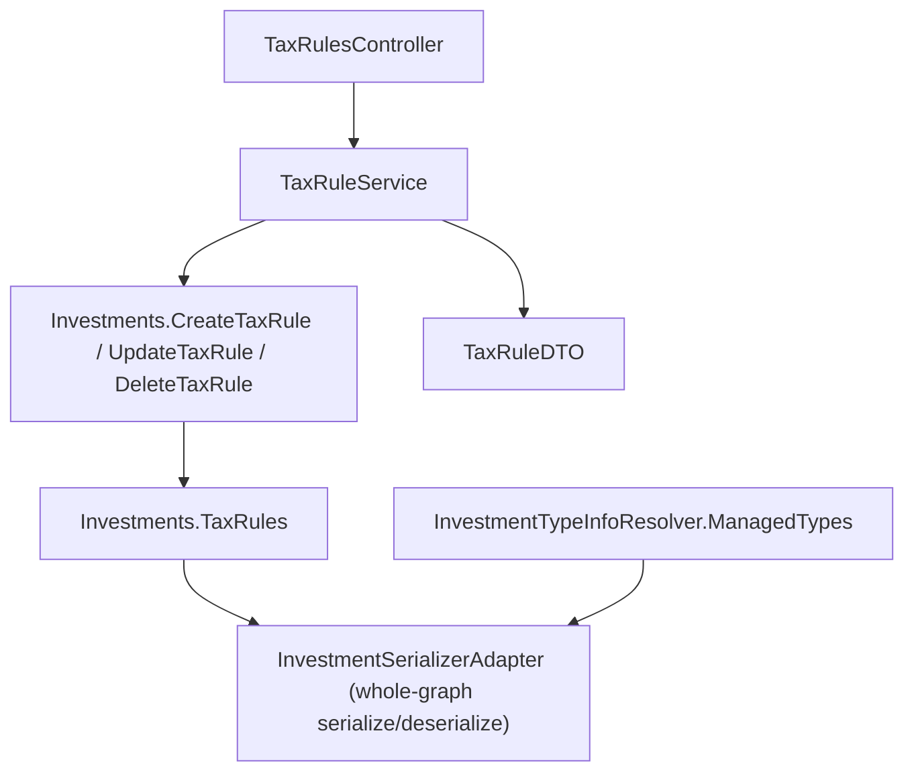

## 1. Technical Overview

**What:** A new `Financial.Investment.Domain.Entities.TaxRule` entity — `Id`, `Jurisdiction` (`BR`/`UK`), `EventCategory` (`CapitalGain`/`Dividend`/`Interest`/`SecuritiesLendingIncome`), `Label`, `Description`, `EffectiveFrom` (`DateOnly`), `EffectiveTo` (`DateOnly?`, open-ended when absent) — persisted as a new top-level `TaxRules` collection directly on the `Investments` aggregate root, exactly the way `ActiveBrokers`/`HistoricBrokers` already are. Full CRUD (no delete-guard yet — see Scope) is exposed through a new `TaxRulesController` at `/tax-rules`, backed by a new `TaxRuleService`. The aggregate itself enforces the one rule the PRD requires that nothing else in the codebase already provides: at most one rule may cover a given `(Jurisdiction, EventCategory)` pair for any single date, so `FindApplicableTaxRule` is always single-valued or empty.

**Why:** This is F01 of P51 (Wave 5) and has no dependencies on any other P51 feature (PRD Section 8) — it is the foundation F02 (Tax Profile and Classification) consumes to resolve "the applicable rule for this jurisdiction/category/date." Because `Financial.Investment`'s `Investments` aggregate already serializes via plain reflection (`InvestmentSerializerAdapter.Serialize`/`Deserialize` walk the whole object graph — there is no CashFlow-style hand-written per-collection converter to touch), adding `TaxRule` is a smaller change than the closest CashFlow precedent (P30-F01 `Category`): register the type in `InvestmentTypeInfoResolver.ManagedTypes`, add the collection to `Investments`, and everything else follows the existing `Broker`/`DisposalRecord` shape. No numeric rate/threshold field exists anywhere on `TaxRule` — this is a mechanical, not just documented, enforcement of the PRD's D1 boundary (never compute tax due).

**Scope:**
- Included: the `TaxRule` domain entity; `Jurisdiction` and `EventCategory` enums; `TaxRules` collection + create/update/delete/find/find-applicable operations on `Investments`; overlapping-range rejection and `EffectiveFrom < EffectiveTo` validation; `TaxRule` registration in `InvestmentTypeInfoResolver`; `TaxRuleService` (Application); `TaxRuleDTO`/`TaxRuleCreateDTO`/`TaxRuleUpdateDTO`; `TaxRulesController` (GET/POST/PUT/DELETE at `/tax-rules`); DI registration.
- Excluded (deferred): the delete-guard against a `Final`-status `TaxClassification` still depending on the rule (PRD AC `P51-F01-tax-rules-05`) — `TaxClassification` does not exist until F02, so `DeleteTaxRuleAsync` has no reference-check to perform yet. F02's own plan must extend `TaxRuleService.DeleteTaxRuleAsync` (or the `Investments.DeleteTaxRule` call it wraps) with that check once `TaxClassification` exists — this spec leaves the method's shape (a single guard-clause-then-remove) ready for that addition without inventing a no-op extension point now. Also excluded: the Admin Tax Rules screen itself (F04/F05); Currency→Jurisdiction derivation (F02); the `TaxClassification`/`TaxProfile` entities (F02); the workbook (F03).

## 2. Architecture Impact

**Affected components:**
- `Financial.Investment.Domain/Entities/Jurisdiction.cs` (new) — `enum Jurisdiction { BR, UK }`
- `Financial.Investment.Domain/Entities/EventCategory.cs` (new) — `enum EventCategory { CapitalGain, Dividend, Interest, SecuritiesLendingIncome }`
- `Financial.Investment.Domain/Entities/TaxRule.cs` (new) — the entity itself
- `Financial.Investment.Domain/Entities/Investments.cs` — new `_taxRules` backing list, `TaxRules` read-only property, `CreateTaxRule`/`UpdateTaxRule`/`DeleteTaxRule`/`FindTaxRule`/`FindApplicableTaxRule`, private `EnsureNoOverlap`/`RangesOverlap` helpers
- `Financial.Investment.Infrastructure/Persistence/InvestmentTypeInfoResolver.cs` — register `typeof(TaxRule)` in `ManagedTypes` (no `ExcludedProperties` entry — every property is a plain stored value, nothing computed)
- `Financial.Investment.Application/DTOs/TaxRuleDTO.cs`, `TaxRuleCreateDTO.cs`, `TaxRuleUpdateDTO.cs` (new)
- `Financial.Investment.Application/Interfaces/ITaxRuleService.cs` (new)
- `Financial.Investment.Application/Services/TaxRuleService.cs` (new)
- `Financial.Investment.Application/DependencyInjection/InvestmentApplicationServiceCollectionExtensions.cs` — register `ITaxRuleService`/`TaxRuleService`
- `Financial.Api/Controllers/TaxRulesController.cs` (new) — `[Route("tax-rules")]`, GET/POST/PUT/DELETE
- `Tests/Financial.Api.Tests/Contract/openapi-v1.snapshot.json` — regenerated (new controller/DTOs change the public API surface)
- `Financial.Web/src/api/generated/openapi.ts` — regenerated from the new snapshot

No change is needed to `InvestmentSerializerAdapter.cs` or `InvestmentDataMigrations.cs` — a missing `"TaxRules"` key in a pre-existing `data-investment.json` deserializes as an empty list the same way a missing `"ActiveBrokers"` key would, since `Investments`'s private field initializer (`new List<TaxRule>()`) runs regardless of what JSON is present.



## 3. Technical Decisions

| Decision | Chosen Approach | Alternative Considered | Trade-off |
|----------|----------------|------------------------|-----------|
| Collection ownership | `TaxRules` lives directly on `Investments` (root), following `ActiveBrokers`/`HistoricBrokers`, not a separate per-collection repository interface like CashFlow's `ICashFlowRepository.GetIncomeSources()` | Add a dedicated `GetTaxRules()` to `IInvestmentRepository` | `IInvestmentRepository` in this bounded context already exposes the whole aggregate via `GetInvestments()` for every other collection (`Broker`, `Asset`); Investment has no precedent for a per-collection repository method, and adding one for just this entity would introduce a second access style into one repository interface |
| Date type | `DateOnly` for `EffectiveFrom`/`EffectiveTo` | `DateTime`, matching `Transaction.Date`/`Credit.Date`/`DisposalRecord.Date` | `AssetPriceSnapshot.Date` already establishes `DateOnly` for a field with no time-of-day meaning; an effective-range boundary is exactly that, and `DateOnly` makes the `<`/`>=` range comparisons unambiguous without a time component to normalize |
| Overlap-check location | A private `EnsureNoOverlap` method on `Investments`, called from `CreateTaxRule`/`UpdateTaxRule` | A separate `Financial.Investment.Domain/Rules/TaxRuleOverlapGuard.cs` class | `Investments.EnsureNameIsUnique`/`EnsureEmpty` already inline comparable single-aggregate validation directly as private methods rather than extracting a `Rules/` class; a `Rules/` class in this codebase is reserved for algorithms spanning multiple entities or invoked from multiple call sites (`DisposalRecordCalculator`, `DisposalRecordRegenerator`), which this is not |
| Jurisdiction/EventCategory mutability | Immutable after `Create` — `Update` only accepts `Label`, `Description`, `EffectiveFrom`, `EffectiveTo` | Allow changing `Jurisdiction`/`EventCategory` on an existing rule | Changing either would silently move the rule into a different overlap-group and could retroactively invalidate a classification F02 already resolved against it; forcing a delete + recreate for that case keeps the overlap-check's "which group does this rule belong to" question answerable without re-validating every other rule against a moving target |
| Exception types | `ArgumentException` for a blank `Label` or `EffectiveFrom >= EffectiveTo` (malformed input, → 400 via the existing `DomainExceptionMappingMiddleware` `ArgumentException` mapping); `InvestmentRuleViolationException` for an overlapping range (a well-formed request the domain refuses, → 409, matching `Investments.EnsureNameIsUnique`'s existing use of the same type) | A dedicated `TaxRuleOverlapException` (CashFlow-style, mirroring `DuplicateNameException`) | Investment has no precedent for per-rule exception types — every domain refusal already funnels through the single `InvestmentRuleViolationException`, deliberately, per its own doc comment ("Sharing the type would force the API to map real defects and rule violations to the same status code" — the point being every *rule violation*, regardless of which rule, maps the same way). Introducing a second type here would be the first divergence from that in the whole bounded context |
| `CreateWithId`-style factory | Not added — only `TaxRule.Create(...)` (always a fresh `Guid`) | Mirror `DisposalRecord.CreateWithId` for deserialization/backfill parity | `DisposalRecord.CreateWithId` exists because a backfill process needs to assign a specific, pre-known Id; nothing creates a `TaxRule` except a direct admin action through `TaxRuleService`, so there is no caller for a with-id factory — adding one now would be unused surface area |

## 4. Component Overview

**Domain:**

| File Path | New/Modified | Purpose | Key Responsibilities |
|-----------|--------------|---------|----------------------|
| `Financial.Investment.Domain/Entities/Jurisdiction.cs` | New | Rule/classification jurisdiction | `enum Jurisdiction { BR, UK }` |
| `Financial.Investment.Domain/Entities/EventCategory.cs` | New | Rule/classification event category | `enum EventCategory { CapitalGain, Dividend, Interest, SecuritiesLendingIncome }` |
| `Financial.Investment.Domain/Entities/TaxRule.cs` | New | Admin-configured, dated tax-classification rule | Private constructor + static `Create(jurisdiction, eventCategory, label, description, effectiveFrom, effectiveTo)`; guards a blank `label` and `effectiveFrom >= effectiveTo` with `ArgumentException`; instance `Update(label, description, effectiveFrom, effectiveTo)` re-running the same guards; `Applies(DateOnly date)` returning whether `date` falls in `[EffectiveFrom, EffectiveTo)`/`[EffectiveFrom, ∞)` |
| `Financial.Investment.Domain/Entities/Investments.cs` | Modified | Aggregate root | New `_taxRules` list, `TaxRules` read-only property (`EntityGuard.ReplaceAll`); `CreateTaxRule(...)` (calls `EnsureNoOverlap`, then `TaxRule.Create`, adds, returns); `UpdateTaxRule(id, label, description, effectiveFrom, effectiveTo)` (finds by id or `KeyNotFoundException`, `EnsureNoOverlap` excluding itself, calls `rule.Update`); `DeleteTaxRule(id)` (finds by id or `KeyNotFoundException`, removes — no reference-check yet, see Scope); `FindTaxRule(Guid id)`; `FindApplicableTaxRule(Jurisdiction, EventCategory, DateOnly date)` (first rule whose `Applies(date)` is true for that jurisdiction/category, or null); private `EnsureNoOverlap(jurisdiction, eventCategory, effectiveFrom, effectiveTo, excluding)` throwing `InvestmentRuleViolationException` naming the conflicting rule's `Label` and range |

**Application:**

| File Path | New/Modified | Purpose | Key Responsibilities |
|-----------|--------------|---------|----------------------|
| `Financial.Investment.Application/DTOs/TaxRuleDTO.cs` | New | Wire representation | `Id`, `Jurisdiction`/`EventCategory` (both `[JsonConverter(typeof(JsonStringEnumConverter))]`, matching `BrokerDTO.CostBasisMethod`), `Label`, `Description`, `EffectiveFrom`, `EffectiveTo` |
| `Financial.Investment.Application/DTOs/TaxRuleCreateDTO.cs` | New | Create request | Same fields as `TaxRuleDTO` minus `Id` |
| `Financial.Investment.Application/DTOs/TaxRuleUpdateDTO.cs` | New | Update request | `Label`, `Description`, `EffectiveFrom`, `EffectiveTo` only — no `Jurisdiction`/`EventCategory`, matching their immutability (§3) |
| `Financial.Investment.Application/Interfaces/ITaxRuleService.cs` | New | Service contract | `GetTaxRules()`, `CreateTaxRuleAsync(TaxRuleCreateDTO)`, `UpdateTaxRuleAsync(Guid id, TaxRuleUpdateDTO)`, `DeleteTaxRuleAsync(Guid id)` |
| `Financial.Investment.Application/Services/TaxRuleService.cs` | New | Service implementation | Mirrors `BrokerService`: constructor-null-guards, `ITelemetryTracer`/`ILogger` span-per-operation (`StartServiceSpan("Investment", nameof(TaxRuleService), operationName, "TaxRule")`), `_repository.GetInvestments()` + `_repository.ApplyAndSaveAsync(...)` around every mutation, `Required(...)` for `Label` |
| `Financial.Investment.Application/DependencyInjection/InvestmentApplicationServiceCollectionExtensions.cs` | Modified | DI registration | `services.AddSingleton<ITaxRuleService, TaxRuleService>();` |

**Infrastructure:**

| File Path | New/Modified | Purpose | Key Responsibilities |
|-----------|--------------|---------|----------------------|
| `Financial.Investment.Infrastructure/Persistence/InvestmentTypeInfoResolver.cs` | Modified | Serialization metadata | Add `typeof(TaxRule)` to `ManagedTypes` (private-constructor/setter wiring only — no `ExcludedProperties` entry, since `TaxRule` has no computed properties) |

**Presentation:**

| File Path | New/Modified | Purpose | Key Responsibilities |
|-----------|--------------|---------|----------------------|
| `Financial.Api/Controllers/TaxRulesController.cs` | New | REST surface | `[Route("tax-rules")]`; `GET` (200, list), `POST` (200/400/409), `PUT("{id}")` (200/400/404/409), `DELETE("{id}")` (204/404) — shape mirrors `BrokersController`, comment-free per `BrokerService.cs`/`DisposalRecord.cs`'s established style, not `BrokersController.cs`'s older XML-doc-heavy style |

## 5. API Contracts

**Endpoint: List Tax Rules**
- **Method:** GET
- **Path:** `/tax-rules`
- **Authentication:** None (matches every other endpoint in `Financial.Api` — single-user, self-hosted)

**Response (Success - 200):**

| Field | Type | Description |
|-------|------|-------------|
| `[].id` | `uuid` | Rule identifier |
| `[].jurisdiction` | `string` | `"BR"` or `"UK"` |
| `[].eventCategory` | `string` | `"CapitalGain"`, `"Dividend"`, `"Interest"`, or `"SecuritiesLendingIncome"` |
| `[].label` | `string` | Short display name |
| `[].description` | `string` | Free-text audit note |
| `[].effectiveFrom` | `date` (`yyyy-MM-dd`) | Range start (inclusive) |
| `[].effectiveTo` | `date` (`yyyy-MM-dd`) or `null` | Range end (exclusive), `null` = still current |

**Response Example:**
```json
[
  {
    "id": "3fa85f64-5717-4562-b3fc-2c963f66afa6",
    "jurisdiction": "BR",
    "eventCategory": "Dividend",
    "label": "BR dividend withholding — 2026 change",
    "description": "Effective 2026-01-01 per the brief's cited rule change.",
    "effectiveFrom": "2026-01-01",
    "effectiveTo": null
  }
]
```

**Endpoint: Create Tax Rule**
- **Method:** POST
- **Path:** `/tax-rules`
- **Authentication:** None

**Request:**

| Field | Type | Required | Validation | Description |
|-------|------|----------|------------|--------------|
| `jurisdiction` | `string` | Yes | `"BR"` or `"UK"` | Rule's jurisdiction |
| `eventCategory` | `string` | Yes | one of the 4 values | Rule's event category |
| `label` | `string` | Yes | non-blank | Short display name |
| `description` | `string` | No | — | Free-text audit note |
| `effectiveFrom` | `date` | Yes | — | Range start |
| `effectiveTo` | `date` | No | must be after `effectiveFrom` when present | Range end, open-ended when absent |

**Request Example:**
```json
{
  "jurisdiction": "BR",
  "eventCategory": "Dividend",
  "label": "BR dividend withholding — 2026 change",
  "description": "Effective 2026-01-01 per the brief's cited rule change.",
  "effectiveFrom": "2026-01-01",
  "effectiveTo": null
}
```

**Response (Success - 200):** same shape as List's item, with the generated `id`.

**Error Codes:**

| HTTP Status | Description |
|-------------|--------------|
| 400 | Missing/blank `label`, or `effectiveFrom` on or after `effectiveTo` |
| 409 | Effective range overlaps an existing rule for the same jurisdiction and event category |

**Endpoint: Update Tax Rule**
- **Method:** PUT
- **Path:** `/tax-rules/{id}`
- **Authentication:** None

**Request:** `label`, `description`, `effectiveFrom`, `effectiveTo` — same validation as Create. `jurisdiction`/`eventCategory` are not accepted (immutable, §3).

**Response (Success - 200):** updated rule, same shape as List's item.

**Error Codes:**

| HTTP Status | Description |
|-------------|--------------|
| 400 | Missing/blank `label`, or `effectiveFrom` on or after `effectiveTo` |
| 404 | No rule with this `id` |
| 409 | New effective range overlaps a different existing rule for the same jurisdiction and event category |

**Endpoint: Delete Tax Rule**
- **Method:** DELETE
- **Path:** `/tax-rules/{id}`
- **Authentication:** None

**Response:** 204 No Content.

**Error Codes:**

| HTTP Status | Description |
|-------------|--------------|
| 404 | No rule with this `id` |

(No 409 yet — the "blocked by a Final classification" guard is F02's addition, per Scope.)

## 6. Data Model

No relational schema — persistence is the existing JSON document (`data/data-investment.json`). New top-level array:

**`TaxRules[]` (new collection on `Investments`):**

| Field | Type | Nullable | Default | Description |
|-------|------|----------|---------|--------------|
| `Id` | `Guid` | No | generated | Primary identifier |
| `Jurisdiction` | `Jurisdiction` (string in JSON) | No | — | `BR` or `UK` |
| `EventCategory` | `EventCategory` (string in JSON) | No | — | `CapitalGain`/`Dividend`/`Interest`/`SecuritiesLendingIncome` |
| `Label` | `string` | No | — | Short display name |
| `Description` | `string` | No | `""` | Free-text audit note |
| `EffectiveFrom` | `DateOnly` (string in JSON) | No | — | Range start, inclusive |
| `EffectiveTo` | `DateOnly?` (string or `null` in JSON) | Yes | `null` | Range end, exclusive; `null` = open-ended |

No indexes/constraints beyond what the JSON format implies — overlap-uniqueness for `(Jurisdiction, EventCategory)` is enforced in `Investments.EnsureNoOverlap`, not by a schema constraint (same approach `CategoryMigrator`'s name-uniqueness check uses in CashFlow).

**Migration:** none needed. A `data-investment.json` written before this feature has no `"TaxRules"` key at all; `Investments`'s private field initializer (`new List<TaxRule>()`) makes `TaxRules` deserialize as an empty collection regardless, identical to how a pre-existing file with no `"ActiveBrokers"` key already behaves today.

## 7. Testing Strategy

**Test files:**

| Test File | Test Type | Target | Coverage Goal |
|-----------|-----------|--------|----------------|
| `Tests/Financial.Investment.Domain.Tests/Entities/TaxRuleTests.cs` | Unit | `TaxRule` | `Create` sets all properties; blank/null `Label` throws `ArgumentException`; `EffectiveFrom` on/after `EffectiveTo` throws `ArgumentException`; `EffectiveTo = null` means open-ended; `Update` changes `Label`/`Description`/`EffectiveFrom`/`EffectiveTo` and re-runs the same guards; `Applies(date)` true within `[EffectiveFrom, EffectiveTo)`, false before `EffectiveFrom` and on/after `EffectiveTo`, true indefinitely when `EffectiveTo` is null |
| `Tests/Financial.Investment.Domain.Tests/Entities/InvestmentsTests.cs` | Unit | `Investments` (extend existing file) | `CreateTaxRule` adds to `TaxRules` and returns it; `TaxRules` starts empty on `Create()`; `CreateTaxRule` with an overlapping range for the same jurisdiction+category throws `InvestmentRuleViolationException` naming the conflicting rule; a non-overlapping range for a *different* jurisdiction or category succeeds; adjacent-but-not-overlapping ranges (one's `EffectiveTo` equals another's `EffectiveFrom`) succeed; `UpdateTaxRule` on an unknown id throws `KeyNotFoundException`; `UpdateTaxRule` excludes the rule itself from its own overlap check (narrowing/shifting its own range never conflicts with itself); `DeleteTaxRule` on an unknown id throws `KeyNotFoundException`; `DeleteTaxRule` removes the rule with no reference-check (documents today's F01-only behavior) |
| `Tests/Financial.Investment.Application.Tests/Services/TaxRuleServiceTests.cs` | Unit | `TaxRuleService` | Constructor null-guards (`repository`/`tracer`/`logger`) throw `ArgumentNullException`; `GetTaxRules` maps every field to `TaxRuleDTO`; `CreateTaxRuleAsync` with a blank label throws `ArgumentException` before touching the repository; `CreateTaxRuleAsync`/`UpdateTaxRuleAsync` call `ApplyAndSaveAsync`; `DeleteTaxRuleAsync` on an unknown id propagates `KeyNotFoundException` |
| `Tests/Financial.Investment.Infrastructure.Tests/Persistence/InvestmentSerializerAdapterTests.cs` | Unit | Round-trip serialization | Extend the existing round-trip test: add a seeded `TaxRule` (both a bounded range and an open-ended one) to the `Investments` under test, assert it survives serialize→deserialize with every field intact, including `EffectiveTo = null` |
| `Tests/Financial.Api.Tests/Controllers/TaxRulesControllerTests.cs` | Integration | `TaxRulesController` | `GET` returns the seeded list; `POST` with valid body returns 200 with the created rule; `POST` with blank `label` returns 400; `POST` with an overlapping range returns 409; `PUT` on an unknown id returns 404; `PUT` with an overlapping range returns 409; `DELETE` returns 204, then a second `DELETE` on the same id returns 404 |
| `Tests/Financial.Api.Tests/Contract/OpenApiContractTests.cs` | Contract | OpenAPI snapshot | Existing test re-run after regenerating the snapshot with `UPDATE_OPENAPI_SNAPSHOT=1` — asserts the new `/tax-rules` paths and DTO schemas match what's committed |

**Acceptance-criteria traceability (PRD Section 9, F01):**
- A `TaxRule` can be created with jurisdiction/category/label/description/effective range and read back correctly (`P51-F01-tax-rules-01`) → `TaxRuleTests`, `TaxRuleServiceTests`, `TaxRulesControllerTests`
- Overlapping range for the same jurisdiction+category is rejected (`P51-F01-tax-rules-02`) → `InvestmentsTests`, `TaxRulesControllerTests`
- `EffectiveFrom` on/after `EffectiveTo` is rejected (`P51-F01-tax-rules-03`) → `TaxRuleTests`
- No numeric rate/threshold field exists anywhere on `TaxRule` (`P51-F01-tax-rules-04`) → enforced by the entity's own shape (§4); no test asserts an absence directly, verified by code review against this spec
- Deleting a rule a `Final` classification depends on is rejected (`P51-F01-tax-rules-05`) → **not covered by F01** — explicitly deferred to F02 per Scope; F02's spec must add this test once `TaxClassification` exists
- A rule lookup returns at most one applicable rule or none (`P51-F01-tax-rules-06`) → `TaxRuleTests` (`Applies`), `InvestmentsTests` (`FindApplicableTaxRule`, indirectly via the overlap guard that keeps it always single-valued)
