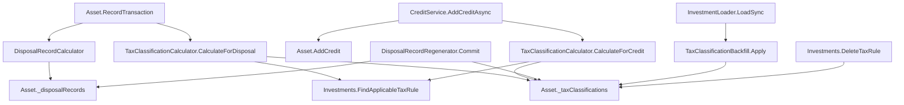

## 1. Technical Overview

**What:** A new `Financial.Investment.Domain.Entities.TaxClassification` entity — `Id`, `SourceType`
(`Disposal`/`Credit`), `SourceId`, `Jurisdiction`, `TaxYear`, `EventCategory`,
`Proceeds`/`CostBasis`/`GainLoss` (populated only for `CapitalGain`),
`GrossAmount`/`WithheldAmount`/`NetAmount` (populated only for income categories),
`CalculationStatus`, `TaxRuleId` (nullable — see Deviations), `Status`
(`Active`/`Superseded`), `SupersededByClassificationId`, `CreatedAt` — persisted as a new
collection nested under each `Asset`, the same storage pattern `DisposalRecords`/`Credits`
already use. It is created automatically whenever a `DisposalRecord` is produced (P50-F02) or a
qualifying `Credit` (Dividend/Coupon/JCP/SecuritiesLendingIncome, P47-F03) is recorded, and kept in
lockstep with `DisposalRecord` supersession (P50-F03). A one-time on-load backfill classifies every
pre-existing disposal and credit, mirroring P50-F02's `DisposalRecordBackfill`.

**Why:** This is F02 of P51 (Wave 5) and depends only on F01 (Tax Rules, shipped — PRs #841/#842),
which it consumes via `Investments.FindApplicableTaxRule`. F03 (the tax-year workbook) depends on
F02's `TaxClassification` output and cannot start until this exists. The work is split into three
PRs along a real functional boundary rather than an arbitrary file-count split: PR1 adds the entity
and its Domain primitives with nothing wired to it yet (safe no-op, mirrors F01-PR1's own shape);
PR2 makes every *pre-existing* disposal/credit classified via the on-load backfill and closes F01's
still-open AC-05 delete-guard (both become meaningful the moment classification data exists); PR3
wires the *live* recording/editing paths so a newly recorded or edited disposal/credit is classified
immediately rather than waiting for the next app restart's backfill.

**Scope:**
- Included: the `TaxClassification` entity; `SourceType`, `CalculationStatus`,
  `TaxClassificationStatus` enums; a 5th `EventCategory` value, `Unrecognized` (see Deviations);
  `TaxClassificationCalculator` (Domain Rule computing a classification for a disposal or credit);
  `Asset` additions (collection + append/find/supersede/remove primitives); `TaxClassificationBackfill`
  (on-load backfill for both sources); `InvestmentTypeInfoResolver` registration;
  `Investments.DeleteTaxRule`'s delete-guard (closes P51-F01-tax-rules-05); live wiring in
  `Asset.RecordTransaction`/`DisposalRecordRegenerator` (disposals) and `CreditService`
  (credits, Application-layer orchestration — see Technical Decisions).
- Excluded (deferred): `TaxProfile` (the read-only per-asset jurisdiction view) — the PRD describes
  it as "computed-not-persisted"; with only one jurisdiction reachable per asset in practice (an
  asset's transactions/credits already share one currency), it has no state of its own to add in
  this feature and is deferred to whichever of F04/F05 first renders it, computed on demand from
  `asset.TaxClassifications.Select(c => c.Jurisdiction).Distinct()` — a one-line projection, not a
  stored concept, so there is nothing for F02 to build ahead of that need. The tax-year workbook
  (F03); any UI (F04/F05); the `Estimated` `CalculationStatus` value (defined in the enum, never
  produced this wave — see Deviations).

## 2. Architecture Impact

**Affected components (PR1 — Domain foundation, no wiring):**
- `Financial.Investment.Domain/Entities/SourceType.cs` (new) — `enum SourceType { Disposal, Credit }`
- `Financial.Investment.Domain/Entities/EventCategory.cs` (modified) — add `Unrecognized`
- `Financial.Investment.Domain/Entities/CalculationStatus.cs` (new) — `enum CalculationStatus { RequiresReview, Incomplete, Estimated, Final }`
- `Financial.Investment.Domain/Entities/TaxClassificationStatus.cs` (new) — `enum TaxClassificationStatus { Active, Superseded }`
- `Financial.Investment.Domain/Entities/TaxClassification.cs` (new) — the entity
- `Financial.Investment.Domain/Rules/TaxClassificationCalculator.cs` (new) — `CalculateForDisposal`/`CalculateForCredit`
- `Financial.Investment.Domain/Entities/Asset.cs` (modified) — `_taxClassifications` collection + `AppendTaxClassification`/`FindTaxClassificationBySource`/`SupersedeTaxClassificationBySource`/`RemoveTaxClassificationBySource`

**Affected components (PR2 — backfill, persistence, F01 delete-guard):**
- `Financial.Investment.Domain/Rules/TaxClassificationBackfill.cs` (new) — mirrors `DisposalRecordBackfill`
- `Financial.Investment.Infrastructure/Persistence/InvestmentTypeInfoResolver.cs` (modified) — register `typeof(TaxClassification)`
- `Financial.Investment.Infrastructure/Persistence/InvestmentLoader.cs` (modified) — call `TaxClassificationBackfill.Apply` after `DisposalRecordBackfill.Apply`
- `Financial.Investment.Domain/Entities/Investments.cs` (modified) — `DeleteTaxRule` gains the guard: reject when a `Final`, `Active` classification still references the rule

**Affected components (PR3 — live wiring):**
- `Financial.Investment.Domain/Entities/Asset.cs` (modified again) — `RecordTransaction`/`ReviseTransaction`/`RetractTransaction` gain an optional `Investments? investments = null` parameter; the direct-append branch classifies inline when provided
- `Financial.Investment.Domain/Rules/DisposalRecordRegenerator.cs` (modified) — `RegenerateAsset`/`RegenerateBroker`/`Commit` gain the same optional `Investments?` parameter; `Commit`'s three loops (`ToRetire`/`Replacements`/`NewOnly`) reconcile classifications alongside disposal records
- `Financial.Investment.Application/Services/TransactionService.cs` (modified) — passes `_repository.GetInvestments()` into `RecordTransaction`/`ReviseTransaction`/`RetractTransaction`
- `Financial.Investment.Application/Services/CreditService.cs` (modified) — orchestrates classify/reclassify/remove around `AddCredit`/`UpdateCredit`/`RemoveCredit` directly (no `Asset` signature change needed — see Technical Decisions)
- `Financial.Investment.Application/Services/BrokerService.cs` (modified) — passes `_repository.GetInvestments()` into `DisposalRecordRegenerator.RegenerateBroker` (its `SetCostBasisMethodAsync` call site)

## 3. Technical Decisions

| Decision | Chosen Approach | Alternative Considered | Trade-off |
|----------|----------------|-------------------------|-----------|
| `Estimated` status trigger | Never produced this wave — `CalculationStatus` only reaches `RequiresReview`/`Incomplete`/`Final`. Decided with the user. | Introduce a new per-event "provisional" proxy (e.g. `Credit.FxRateSnapshot == null` when a conversion was attempted and failed) | The PRD's stated trigger — P49's `IsPartial`/`IsReportingCurrencyUnavailable` — is an Application-layer, read-time, whole-portfolio-batch concept (`ConvertedSummaryBuilder`'s `ConversionContext`), not a per-event Domain fact; `DisposalRecord` has no FX data at all. Inventing a proxy now would be scope the PRD never actually asked for and would only approximately mean what "Estimated" claims. `Estimated` stays defined in the enum for a future feature that tracks real per-event data quality. |
| `TaxClassification.TaxRuleId` | Added (nullable `Guid`), beyond the PRD's Section 6 field list | Match the PRD literally (no rule reference stored) | P51-F01-tax-rules-05 requires the delete-guard to know *which* classifications depend on *which specific rule*. Without a stored reference, the only fallback is "does any Final classification exist for this (Jurisdiction, EventCategory)" — imprecise, since a superseding rule with a later `EffectiveFrom` would falsely block deleting an *earlier*, already-superseded-by-date rule it never actually classified anything under. Storing the resolved rule's id is the only accurate implementation of an AC F01 itself already committed to. |
| `AssetId` field | Dropped from the PRD's Section 6 field list | Include it as originally specified | `Asset` has no `Id` at all in this codebase — it's identified by name within its portfolio, the same as `DisposalRecord` (which has no `AssetId` either). `TaxClassification` is nested under `Asset` in the JSON document exactly like `DisposalRecords`/`Credits`; ownership is implicit in the tree, not a redundant back-reference. |
| Disposal-side TaxRule resolution | Threaded as an optional `Investments? investments = null` parameter into `Asset.RecordTransaction`/`ReviseTransaction`/`RetractTransaction` and `DisposalRecordRegenerator`'s three entry points, defaulting to `null` (skip classification; the next on-load backfill catches it) | Resolve the rule in `TransactionService`/`BrokerService` and pass a fully-built `TaxClassification` down | `DisposalRecordRegenerator.Commit`'s three-way plan (`ToRetire`/`Replacements`/`NewOnly`) is exactly where classification supersession must branch identically — reconstructing that branching from outside Domain would duplicate logic that already exists in one place. `DisposalRecordBackfill.Apply(Investments investments)` already establishes the precedent that a Domain Rule can accept the whole `Investments` aggregate directly, so this isn't a new layering exception. Defaulting to `null` means every existing call site (tests, `Tools/InvestmentSpreadsheetImport`) keeps compiling and behaving unchanged — the backfill guarantees eventual consistency regardless. |
| Credit-side TaxRule resolution | Orchestrated at the Application layer (`CreditService` calls `TaxClassificationCalculator.CalculateForCredit` and `Asset.AppendTaxClassification`/`RemoveTaxClassificationBySource` directly, right after `AddCredit`/`UpdateCredit`/`RemoveCredit`) — no `Asset` credit-method signature changes | Thread `Investments?` into `Asset.AddCredit`/`UpdateCredit`/`RemoveCredit` the same way as the disposal side | Credit classification is a flat create/replace/remove with no multi-branch plan to keep in sync — `BrokerService.SetCostBasisMethodAsync` already establishes the precedent of an Application service calling two back-to-back Domain operations in sequence (`SetCostBasisMethod` then `DisposalRecordRegenerator.RegenerateBroker`) without threading one into the other's signature. Reusing that pattern here avoids touching `Asset.AddCredit`/`UpdateCredit`/`RemoveCredit` at all. |
| `EventCategory.Unrecognized` | Added as a 5th enum value | Make `TaxClassification.EventCategory` nullable instead | All 4 existing `Credit.CreditType` values already map cleanly (Dividend→Dividend, Coupon/JCP→Interest, SecuritiesLendingIncome→SecuritiesLendingIncome) — `Unrecognized` is unreachable today and exists only as the PRD's own forward-looking safeguard for a credit type this wave doesn't anticipate (its Error Handling explicitly describes this case). A non-nullable enum with an explicit "unrecognized" member reads the same way `GlobalAssetClass.Unknown`/`CountryCode.Unknown` already do elsewhere in this codebase, rather than introducing a null case every consumer has to separately handle. |
| Backfill scope | Only `Active` `DisposalRecord`s and all `Credit`s get backfilled; a `Superseded` `DisposalRecord` never gets a fresh classification during backfill | Backfill every `DisposalRecord` regardless of status | Backfill fills genuine gaps (a record with no classification at all); a `Superseded` record predates this feature and its supersession already happened for reasons unrelated to tax classification — manufacturing a `Superseded` classification for it after the fact would imply a classification history that never occurred. Only the live regeneration path (PR3) produces classification supersession going forward. |
| `TaxClassificationStatus` vs. reusing `DisposalRecordStatus` | New, dedicated `{Active, Superseded}` enum | Reuse `DisposalRecordStatus` for both entities | Structurally identical today, but `DisposalRecordStatus` names a concept that doesn't fit a credit-sourced classification, and the two entities' supersession lifecycles are independent (a `TaxRule` correction reclassifies without touching `DisposalRecordStatus` at all). Low-risk, mirrors how `PriceSource`/`FxRateSource` are already separate small enums rather than shared. |

## 4. Component Overview

**Domain (PR1):**

| File Path | New/Modified | Purpose | Key Responsibilities |
|-----------|--------------|---------|----------------------|
| `Financial.Investment.Domain/Entities/SourceType.cs` | New | Classification source discriminator | `enum SourceType { Disposal, Credit }` |
| `Financial.Investment.Domain/Entities/EventCategory.cs` | Modified | Add `Unrecognized` | 5th member, appended (enum value stability: existing 4 keep their current ordinal positions since `[JsonStringEnumConverter]` serializes by name, not ordinal) |
| `Financial.Investment.Domain/Entities/CalculationStatus.cs` | New | Classification readiness | `enum CalculationStatus { RequiresReview, Incomplete, Estimated, Final }` — `Estimated` unreachable this wave |
| `Financial.Investment.Domain/Entities/TaxClassificationStatus.cs` | New | Classification lifecycle | `enum TaxClassificationStatus { Active, Superseded }` |
| `Financial.Investment.Domain/Entities/TaxClassification.cs` | New | Classified disposal/income event | Private constructor + static `CreateForDisposal(sourceId, jurisdiction, taxYear, proceeds, costBasis, gainLoss, status, taxRuleId)` / `CreateForCredit(sourceId, jurisdiction, taxYear, eventCategory, grossAmount, withheldAmount, netAmount, status, taxRuleId)` factories; `Supersede(Guid? supersededByClassificationId)` mirroring `DisposalRecord.Supersede` (throws `InvalidOperationException` if already `Superseded`) |
| `Financial.Investment.Domain/Rules/TaxClassificationCalculator.cs` | New | Builds a classification from a source event | `CalculateForDisposal(DisposalRecord record, Investments investments)`; `CalculateForCredit(Credit credit, Investments investments)` — derives `Jurisdiction` from `Currency` (`BRL` → `BR`, else → `UK`), reuses `TaxYearCalculator.Calculate` for credits, maps `Credit.CreditType` → `EventCategory` (private lookup), resolves the applicable rule via `investments.FindApplicableTaxRule` and sets `CalculationStatus`/`TaxRuleId` accordingly |
| `Financial.Investment.Domain/Entities/Asset.cs` | Modified | Aggregate member | New `_taxClassifications` list, `TaxClassifications` read-only property (`EntityGuard.ReplaceAll`); `internal void AppendTaxClassification(TaxClassification classification)`; `internal TaxClassification? FindTaxClassificationBySource(SourceType sourceType, Guid sourceId)`; `internal void SupersedeTaxClassificationBySource(SourceType sourceType, Guid sourceId, Guid? supersededByClassificationId)` (no-op if none found — the disposal-side "no prior classification existed yet" case); `internal bool RemoveTaxClassificationBySource(SourceType sourceType, Guid sourceId)` |

**Domain/Infrastructure (PR2):**

| File Path | New/Modified | Purpose | Key Responsibilities |
|-----------|--------------|---------|----------------------|
| `Financial.Investment.Domain/Rules/TaxClassificationBackfill.cs` | New | On-load gap-filler | `Apply(Investments investments) -> IReadOnlyList<TaxClassificationBackfillFailure>`; per asset, classifies every `Active` `DisposalRecord` and every `Credit` with no existing classification (`HashSet<Guid>` idempotency check per source type, mirroring `DisposalRecordBackfill`); try/catch per event, failures collected and logged, never aborts the load |
| `Financial.Investment.Infrastructure/Persistence/InvestmentTypeInfoResolver.cs` | Modified | Serialization metadata | Add `typeof(TaxClassification)` to `ManagedTypes` (no `ExcludedProperties` entry — every amount field is a plain stored value, never computed) |
| `Financial.Investment.Infrastructure/Persistence/InvestmentLoader.cs` | Modified | Load-time migration orchestration | Call `TaxClassificationBackfill.Apply(investments)` immediately after the existing `DisposalRecordBackfill.Apply(investments)` loop (must run after disposal records are fully populated), same `Trace.TraceWarning` reporting |
| `Financial.Investment.Domain/Entities/Investments.cs` | Modified | Aggregate root | `DeleteTaxRule` gains a guard: before removing, reject with `InvestmentRuleViolationException` if any asset has an `Active` classification whose `CalculationStatus == Final` and `TaxRuleId` matches — closes `P51-F01-tax-rules-05` |

**Application (PR3):**

| File Path | New/Modified | Purpose | Key Responsibilities |
|-----------|--------------|---------|----------------------|
| `Financial.Investment.Domain/Entities/Asset.cs` | Modified (again) | Live disposal classification | `RecordTransaction`/`ReviseTransaction`/`RetractTransaction` gain a trailing optional `Investments? investments = null`; the direct-append disposal branch calls `AppendTaxClassification(TaxClassificationCalculator.CalculateForDisposal(...))` when `investments is not null`; threads the parameter into `DisposalRecordRegenerator.RegenerateAsset` calls |
| `Financial.Investment.Domain/Rules/DisposalRecordRegenerator.cs` | Modified | Live supersession classification | `RegenerateAsset`/`RegenerateBroker`/`ComputePlan`/`Commit` gain the same optional `Investments?`; `Commit`'s `ToRetire` loop supersedes the matching classification with no replacement; `Replacements` loop supersedes the old classification and creates a fresh one for the new record; `NewOnly` loop creates a fresh classification — all conditional on `investments is not null` |
| `Financial.Investment.Application/Services/TransactionService.cs` | Modified | Wire the live path | `AddTransactionAsync`/`UpdateTransactionAsync`/`DeleteTransactionAsync`'s mutation closures pass `_repository.GetInvestments()` into `RecordTransaction`/`ReviseTransaction`/`RetractTransaction` |
| `Financial.Investment.Application/Services/CreditService.cs` | Modified | Wire the live path | `AddCreditAsync`'s closure calls `TaxClassificationCalculator.CalculateForCredit` + `asset.AppendTaxClassification` after `asset.AddCredit`; `UpdateCreditAsync`'s closure calls `asset.RemoveTaxClassificationBySource` then re-creates via the same calculator after a successful `asset.UpdateCredit`; `DeleteCreditAsync`'s closure calls `asset.RemoveTaxClassificationBySource` after a successful `asset.RemoveCredit` |
| `Financial.Investment.Application/Services/BrokerService.cs` | Modified | Wire the live path | `SetCostBasisMethodAsync` passes `investments` (already resolved in that method) into `DisposalRecordRegenerator.RegenerateBroker` |

## 5. API Contracts

None — F02 has no UI or API surface of its own (per the PRD's Experience: "No UI of its own"). No
controller, no DTO, no endpoint is added or changed in any of the three PRs.

## 6. Data Model

No relational schema — the existing JSON document (`data/data-investment.json`). New collection
nested under each asset entry, alongside `DisposalRecords`/`Credits`:

**`TaxClassifications[]` (new collection under each `Asset`):**

| Field | Type | Nullable | Default | Description |
|-------|------|----------|---------|--------------|
| `Id` | `Guid` | No | generated | Primary identifier |
| `SourceType` | `SourceType` (string in JSON) | No | — | `Disposal` or `Credit` |
| `SourceId` | `Guid` | No | — | The `DisposalRecord.Id` or `Credit.Id` this classifies |
| `Jurisdiction` | `Jurisdiction` (string in JSON) | No | — | `BR` or `UK`, derived from the source event's `Currency` |
| `TaxYear` | `string` | No | — | `TaxYearCalculator.Calculate`'s output, reused unchanged for disposals |
| `EventCategory` | `EventCategory` (string in JSON) | No | — | `CapitalGain`/`Dividend`/`Interest`/`SecuritiesLendingIncome`/`Unrecognized` |
| `Proceeds` | `decimal?` | Yes | `null` | Populated only when `EventCategory == CapitalGain` |
| `CostBasis` | `decimal?` | Yes | `null` | Populated only when `EventCategory == CapitalGain` |
| `GainLoss` | `decimal?` | Yes | `null` | Populated only when `EventCategory == CapitalGain` |
| `GrossAmount` | `decimal?` | Yes | `null` | Populated only for income categories |
| `WithheldAmount` | `decimal?` | Yes | `null` | Populated only for income categories |
| `NetAmount` | `decimal?` | Yes | `null` | Populated only for income categories |
| `CalculationStatus` | `CalculationStatus` (string in JSON) | No | — | `RequiresReview`/`Incomplete`/`Estimated`/`Final` — only the first, second and fourth are produced this wave |
| `TaxRuleId` | `Guid?` | Yes | `null` | The `TaxRule.Id` that produced a `Final` status, or `null` for `Incomplete`/`RequiresReview` |
| `Status` | `TaxClassificationStatus` (string in JSON) | No | `Active` | `Active` or `Superseded` |
| `SupersededByClassificationId` | `Guid?` | Yes | `null` | Set only when `Status == Superseded` and a replacement exists |
| `CreatedAt` | `DateTimeOffset` (string in JSON) | No | — | Set at construction |

No indexes/constraints beyond the JSON format — uniqueness of "one `Active` classification per
`(SourceType, SourceId)`" is a Domain invariant enforced by `AppendTaxClassification`'s callers
(supersede-before-append), not a schema constraint.

**Migration:** none needed structurally — a pre-existing `data-investment.json` has no
`"TaxClassifications"` key, which deserializes as an empty collection the same way every other new
collection has (`TaxRules` in F01). The actual data backfill (PR2's `TaxClassificationBackfill`) is
a Domain-level pass over the already-deserialized graph, not a JSON-tree migration in
`InvestmentDataMigrations.cs` — identical in kind to how `DisposalRecordBackfill` (P50) works.

## 7. Testing Strategy

**Test files (PR1 — Domain foundation):**

| Test File | Test Type | Target | Coverage Goal |
|-----------|-----------|--------|----------------|
| `Tests/Financial.Investment.Domain.Tests/Domain/TaxClassificationTests.cs` | Unit | `TaxClassification` | `CreateForDisposal`/`CreateForCredit` set all fields correctly (amount-field nulling per category); `Supersede` sets `Status`/`SupersededByClassificationId`; `Supersede` on an already-`Superseded` instance throws `InvalidOperationException` |
| `Tests/Financial.Investment.Domain.Tests/Rules/TaxClassificationCalculatorTests.cs` | Unit | `TaxClassificationCalculator` | `CalculateForDisposal`: `Jurisdiction` from currency (BRL→BR, GBP→UK), `Final` when a rule applies, `Incomplete` when none does, `TaxRuleId` set only when `Final`, `TaxYear`/`Proceeds`/`CostBasis`/`GainLoss` copied from the record unchanged. `CalculateForCredit`: same for each of the 4 known `CreditType`s → `EventCategory` mapping (Dividend→Dividend, Coupon→Interest, JCP→Interest, SecuritiesLendingIncome→SecuritiesLendingIncome), `GrossAmount`/`WithheldAmount`/`NetAmount` from the credit, `TaxYear` via `TaxYearCalculator` |
| `Tests/Financial.Investment.Domain.Tests/Domain/AssetTests.cs` | Unit (extend existing file) | `Asset`'s new members | `AppendTaxClassification` adds to `TaxClassifications`; `FindTaxClassificationBySource` finds by `(SourceType, SourceId)` or returns null; `SupersedeTaxClassificationBySource` supersedes the matching entry, no-ops when none exists; `RemoveTaxClassificationBySource` removes and returns true/false |

**Test files (PR2 — backfill, persistence, delete-guard):**

| Test File | Test Type | Target | Coverage Goal |
|-----------|-----------|--------|----------------|
| `Tests/Financial.Investment.Domain.Tests/Rules/TaxClassificationBackfillTests.cs` | Unit | `TaxClassificationBackfill` | Mirrors `DisposalRecordBackfillTests`: a raw `Active` `DisposalRecord` with no classification gets exactly one; a raw qualifying `Credit` gets exactly one; a `Superseded` `DisposalRecord` gets none; calling `Apply` twice creates no duplicates; coverage across Active and Historic brokers; a per-event failure is caught, logged, and does not stop the rest of the asset/load |
| `Tests/Financial.Investment.Infrastructure.Tests/Persistence/InvestmentSerializerAdapterTests.cs` | Unit (extend existing file) | Round-trip serialization | Extend the existing round-trip test: seed a `TaxClassification` for both a disposal and a credit source, assert every field (including `TaxRuleId`/`SupersededByClassificationId` both set and `null`) survives serialize→deserialize |
| `Tests/Financial.Investment.Domain.Tests/Domain/InvestmentsTests.cs` | Unit (extend existing file) | `Investments.DeleteTaxRule`'s guard | `[Trait("AC", "P51-F01-tax-rules-05")]` — deleting a rule with no dependent classification succeeds (existing behavior unchanged); deleting a rule that an `Active`+`Final` classification references throws `InvestmentRuleViolationException` and removes nothing; deleting a rule referenced only by a `Superseded` classification succeeds |

**Test files (PR3 — live wiring):**

| Test File | Test Type | Target | Coverage Goal |
|-----------|-----------|--------|----------------|
| `Tests/Financial.Investment.Domain.Tests/Domain/AssetTests.cs` | Unit (extend) | `RecordTransaction` live classification | Recording a disposing transaction with `investments` provided and an applicable rule produces a `Final` classification immediately; with `investments` provided and no applicable rule produces `Incomplete`; with `investments` omitted (`null`) produces no classification at all, leaving it to the next backfill |
| `Tests/Financial.Investment.Domain.Tests/Rules/DisposalRecordRegeneratorTests.cs` | Unit (extend existing file) | Regeneration supersession | A retired record (no replacement) supersedes its classification with no replacement; a replaced record supersedes the old classification and creates a `Active` one for the new record; a genuinely new record gets a fresh classification; all three no-op on classification when `investments` is `null` |
| `Tests/Financial.Investment.Application.Tests/Services/TransactionServiceTests.cs` | Unit (extend existing file) | Wired live path | `AddTransactionAsync` for a disposing transaction produces a classification in the same call (via the stub repository's `Investments`) |
| `Tests/Financial.Investment.Application.Tests/Services/CreditServiceTests.cs` | Unit (extend existing file) | Wired live path | `AddCreditAsync` for a qualifying type produces a classification; `UpdateCreditAsync` replaces the existing classification (same `SourceId`, new field values, a fresh `Id`); `DeleteCreditAsync` removes the classification |
| `Tests/Financial.Api.Tests/Acceptance/TaxProfileAndClassificationAcceptanceTests.cs` | Integration (AC-tracing) | End-to-end via the real host | One tagged test per PRD §9 F02 criterion — see traceability below |

**Acceptance-criteria traceability (PRD Section 9, F02 — ids to be added to the PRD the same way F01's were):**
- Every `DisposalRecord` and qualifying `Credit` automatically produces a `TaxClassification` → `TaxClassificationCalculatorTests`, `TransactionServiceTests`/`CreditServiceTests`, AC-tracing acceptance test
- Jurisdiction derived from currency, not `CountryCode` → `TaxClassificationCalculatorTests`
- `TaxYear` derivation matches `DisposalRecord`'s / uses the shared `TaxYearCalculator` for credits → `TaxClassificationCalculatorTests`
- `CalculationStatus` correctness (`RequiresReview`/`Incomplete`/`Final`) → `TaxClassificationCalculatorTests`
- Every existing disposal/credit gains a classification on next load, idempotently → `TaxClassificationBackfillTests`
- Supersession follows the source record → `DisposalRecordRegeneratorTests`
- Asset's `TaxProfile` (computed, not stored — see Scope) is deferred to F04/F05; no test here
