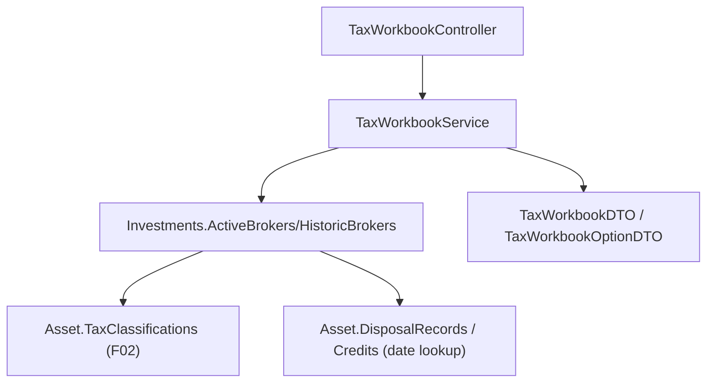

## 1. Technical Overview

**What:** A read-only aggregation over every asset's `TaxClassification` collection (F02): given a
jurisdiction and tax year, assemble every `Active` classification matching both, across every asset,
into a workbook — entries, totals grouped by event category, and an aggregate calculation status
(the least-ready status among the entries). A second query lists every `(Jurisdiction, TaxYear)` pair
that actually has at least one classification, for the front ends' selectors. No new Domain entity,
no persisted state — this is pure Application-layer projection over data F01/F02 already produced and
persisted.

**Why:** F03 depends on F01 (shipped — PRs #841/#842) and F02 (shipped — PRs #843/#844/#845) and is
what F04/F05 consume to render the Tax page and CSV export. Although the PRD's Experience block says
"No UI of its own," the same reasoning that gave F01 its own controller applies here: an HTTP endpoint
is not "UI," it is the query surface a separate deployable (`Financial.Web`) needs to reach this data
at all, and F03 is the natural owner of both the aggregation logic and its HTTP exposure — mirroring
F01's `TaxRulesController` precedent exactly.

**Scope:**
- Included: `TaxWorkbookService` (aggregation), its DTOs, and `TaxWorkbookController`
  (`GET /tax-workbook`, `GET /tax-workbook/options`).
- Excluded (deferred): the React/WPF Tax page and CSV export button (F04/F05, which consume this
  endpoint); the Admin Tax Rules screen (F04/F05, already deferred since F01); `TaxProfile` (still
  deferred to whichever of F04/F05 first renders it, per F02's spec).

## 2. Architecture Impact

**Affected components:**
- `Financial.Investment.Application/DTOs/TaxWorkbookOptionDTO.cs` (new) — one selectable `(Jurisdiction, TaxYear)` pair
- `Financial.Investment.Application/DTOs/TaxWorkbookEntryDTO.cs` (new) — one workbook row
- `Financial.Investment.Application/DTOs/TaxCategoryTotalDTO.cs` (new) — one category's totals
- `Financial.Investment.Application/DTOs/TaxWorkbookDTO.cs` (new) — the assembled workbook
- `Financial.Investment.Application/Interfaces/ITaxWorkbookService.cs` (new)
- `Financial.Investment.Application/Services/TaxWorkbookService.cs` (new) — the aggregation itself
- `Financial.Investment.Application/DependencyInjection/InvestmentApplicationServiceCollectionExtensions.cs` (modified) — register the service
- `Financial.Api/Controllers/TaxWorkbookController.cs` (new) — `GET /tax-workbook`, `GET /tax-workbook/options`

8 non-test files total — one PR, at the repo's limit, no split needed (unlike F01/F02, there is no
Domain-layer or backfill/live-wiring work here to separate into stages).



## 3. Technical Decisions

| Decision | Chosen Approach | Alternative Considered | Trade-off |
|----------|----------------|-------------------------|-----------|
| Entry `Date` field | Resolved at aggregation time by looking up the classification's `SourceId` against `asset.DisposalRecords`/`asset.Credits` (both already expose `.Date`) | Add a `Date` field to `TaxClassification` itself | The PRD's F04 capabilities list "date" as a workbook-entry display field, but `TaxClassification` (F02, already shipped in #843) has no `Date` of its own — only the derived `TaxYear` string. Retrofitting a new field onto an already-merged entity would require updating every existing `TaxClassification.CreateForDisposal`/`CreateForCredit` call site across three merged PRs' test suites for a value this read-only aggregation can compute just as correctly by resolving the existing evidence reference, which the workbook needs to expose anyway |
| Where the aggregation lives | `Financial.Investment.Application/Services/TaxWorkbookService.cs`, a plain read-only service over `_repository.GetInvestments()` | A Domain Rule (mirroring `TaxClassificationBackfill`) | No Domain invariant is being enforced and nothing is mutated — this is a reporting projection, not a business rule. `BrokerService.GetBrokers()` already establishes the same shape (a read query directly over `_repository.GetInvestments()`, mapped to DTOs, no Domain Rule involved) |
| Aggregate `CalculationStatus` computation | `entries.Min(e => (int)e.CalculationStatus)` cast back to the enum | A hand-written priority lookup table | `CalculationStatus`'s declared member order (`RequiresReview, Incomplete, Estimated, Final`) already is the worst-to-best ranking the PRD specifies — the enum was deliberately declared in that order in F02, so the ordinal minimum is exactly the "least-ready" status with no separate ranking table to keep in sync |
| Empty workbook (no matching classifications) | Return a `TaxWorkbookDTO` with an empty `Entries` list and `CalculationStatus = null` (200 OK) rather than 404 | 404 Not Found | The PRD frames "no entries" as a display-state concern for F04 ("not shown until at least one classified event exists"), not an error — `GetWorkbookOptions()` already ensures the front ends never construct this query for a nonexistent pair in the first place; a direct API call for an empty combination is a valid, if unusual, request |
| Query-parameter validation | `TaxWorkbookService.GetWorkbook(string jurisdiction, string taxYear)` parses `jurisdiction` via the existing `Financial.Investment.Application.Validation.EnumParser.TryParseEnum<Jurisdiction>`, throwing `ArgumentException` on an unrecognized value (→ 400 via the existing `DomainExceptionMappingMiddleware`) | A dedicated `JurisdictionParser` class, mirroring `InvestmentScopeParser`/`CreditTypeParser` | `EnumParser.TryParseEnum<TEnum>` is already generic and reusable as-is (confirmed: `InvestmentScopeParser`/`CreditTypeParser` are themselves thin wrappers over it) — a `Jurisdiction`-specific wrapper class would add a file with no behavior beyond what calling the generic method directly already provides |

## 4. Component Overview

**Application:**

| File Path | New/Modified | Purpose | Key Responsibilities |
|-----------|--------------|---------|----------------------|
| `Financial.Investment.Application/DTOs/TaxWorkbookOptionDTO.cs` | New | Selector option | `Jurisdiction`, `TaxYear` |
| `Financial.Investment.Application/DTOs/TaxWorkbookEntryDTO.cs` | New | One workbook row | `Id` (classification id), `Date`, `EventCategory`, `Proceeds`/`CostBasis`/`GainLoss` (nullable), `GrossAmount`/`WithheldAmount`/`NetAmount` (nullable), `CalculationStatus`, `EvidenceReference` (the classification's `SourceId`), `TaxRuleLabel` (nullable — resolved from `TaxClassification.TaxRuleId` via `Investments.FindTaxRule`; `null` when the classification has no rule, i.e. `Incomplete`/`RequiresReview`) |
| `Financial.Investment.Application/DTOs/TaxCategoryTotalDTO.cs` | New | One category's totals | `EventCategory`, `TotalProceeds`/`TotalCostBasis`/`TotalGainLoss` (nullable), `TotalGrossAmount`/`TotalWithheldAmount`/`TotalNetAmount` (nullable) |
| `Financial.Investment.Application/DTOs/TaxWorkbookDTO.cs` | New | The assembled workbook | `Jurisdiction`, `TaxYear`, `Entries` (`IReadOnlyList<TaxWorkbookEntryDTO>`), `CategoryTotals` (`IReadOnlyList<TaxCategoryTotalDTO>`), `CalculationStatus` (nullable — null when `Entries` is empty) |
| `Financial.Investment.Application/Interfaces/ITaxWorkbookService.cs` | New | Service contract | `GetWorkbookOptions()`, `GetWorkbook(string jurisdiction, string taxYear)` |
| `Financial.Investment.Application/Services/TaxWorkbookService.cs` | New | Aggregation | Walks `investments.ActiveBrokers.Concat(HistoricBrokers)` → portfolios → assets → `TaxClassifications`, filters `Status == Active`; for `GetWorkbook`, additionally filters `Jurisdiction`/`TaxYear`, resolves each entry's `Date` from the matching `DisposalRecord`/`Credit` by `SourceId`, resolves `TaxRuleLabel` via `investments.FindTaxRule(classification.TaxRuleId)?.Label` when set, groups by `EventCategory` for totals, computes the aggregate status via the ordinal-minimum rule; for `GetWorkbookOptions`, projects the distinct `(Jurisdiction, TaxYear)` pairs, sorted `Jurisdiction` then `TaxYear` |
| `Financial.Investment.Application/DependencyInjection/InvestmentApplicationServiceCollectionExtensions.cs` | Modified | DI registration | `services.AddSingleton<ITaxWorkbookService, TaxWorkbookService>();` |

**Presentation:**

| File Path | New/Modified | Purpose | Key Responsibilities |
|-----------|--------------|---------|----------------------|
| `Financial.Api/Controllers/TaxWorkbookController.cs` | New | REST surface | `[Route("tax-workbook")]`; `GET` (`?jurisdiction=&taxYear=`, 200/400) returns the assembled workbook; `GET("options")` (200) returns the selectable pairs |

## 5. API Contracts

**Endpoint: List Workbook Options**
- **Method:** GET
- **Path:** `/tax-workbook/options`
- **Authentication:** None (matches every other endpoint in `Financial.Api`)

**Response (Success - 200):**

| Field | Type | Description |
|-------|------|--------------|
| `[].jurisdiction` | `string` | `"BR"` or `"UK"` |
| `[].taxYear` | `string` | e.g. `"2026"` or `"2025/26"` |

**Response Example:**
```json
[
  { "jurisdiction": "BR", "taxYear": "2026" },
  { "jurisdiction": "UK", "taxYear": "2025/26" }
]
```

**Endpoint: Get Workbook**
- **Method:** GET
- **Path:** `/tax-workbook?jurisdiction={jurisdiction}&taxYear={taxYear}`
- **Authentication:** None

**Request:**

| Field | Type | Required | Validation | Description |
|-------|------|----------|------------|--------------|
| `jurisdiction` | `string` (query) | Yes | `"BR"` or `"UK"` | Workbook jurisdiction |
| `taxYear` | `string` (query) | Yes | non-blank | Workbook tax year, exactly as it appears in `TaxClassification.TaxYear` |

**Response (Success - 200):**

| Field | Type | Description |
|-------|------|--------------|
| `jurisdiction` | `string` | Echoes the request |
| `taxYear` | `string` | Echoes the request |
| `entries[].id` | `uuid` | Classification id |
| `entries[].date` | `date` | Source event date |
| `entries[].eventCategory` | `string` | `CapitalGain`/`Dividend`/`Interest`/`SecuritiesLendingIncome`/`Unrecognized` |
| `entries[].proceeds`, `.costBasis`, `.gainLoss` | `decimal?` | Populated only for `CapitalGain` |
| `entries[].grossAmount`, `.withheldAmount`, `.netAmount` | `decimal?` | Populated only for income categories |
| `entries[].calculationStatus` | `string` | `RequiresReview`/`Incomplete`/`Estimated`/`Final` |
| `entries[].evidenceReference` | `uuid` | The source `DisposalRecord` or `Credit` id |
| `entries[].taxRuleLabel` | `string?` | The applicable tax rule's label, or `null` if none applied |
| `categoryTotals[].eventCategory` | `string` | Category being totalled |
| `categoryTotals[].totalProceeds`, etc. | `decimal?` | Summed across that category's entries |
| `calculationStatus` | `string?` | Aggregate status; `null` when `entries` is empty |

**Response Example:**
```json
{
  "jurisdiction": "BR",
  "taxYear": "2026",
  "entries": [
    {
      "id": "3fa85f64-5717-4562-b3fc-2c963f66afa6",
      "date": "2026-06-01",
      "eventCategory": "Dividend",
      "grossAmount": 100.0,
      "withheldAmount": 10.0,
      "netAmount": 90.0,
      "calculationStatus": "Final",
      "evidenceReference": "8f3b1c1a-2e3a-4b1a-9a7f-100000000001",
      "taxRuleLabel": "BR dividend withholding — 2026 change"
    }
  ],
  "categoryTotals": [
    { "eventCategory": "Dividend", "totalGrossAmount": 100.0, "totalWithheldAmount": 10.0, "totalNetAmount": 90.0 }
  ],
  "calculationStatus": "Final"
}
```

**Error Codes:**

| HTTP Status | Description |
|-------------|--------------|
| 400 | `jurisdiction` missing or not `"BR"`/`"UK"`; `taxYear` missing or blank |

## 6. Data Model

None — this feature persists nothing; it is a read-only projection over `TaxClassification` (F02),
`DisposalRecord` (P50) and `Credit` (P47) data already stored in `data-investment.json`.

## 7. Testing Strategy

**Test files:**

| Test File | Test Type | Target | Coverage Goal |
|-----------|-----------|--------|----------------|
| `Tests/Financial.Investment.Application.Tests/Services/TaxWorkbookServiceTests.cs` | Unit | `TaxWorkbookService` | `GetWorkbook` includes only `Active` classifications matching both jurisdiction and tax year, across multiple assets/brokers; excludes `Superseded` ones and non-matching jurisdiction/tax-year combinations; groups and totals correctly by `EventCategory` (both a `CapitalGain` total and an income-category total); computes the aggregate status as the ordinal-minimum across entries (a `RequiresReview` entry alongside `Final` ones yields `RequiresReview`); returns `CalculationStatus = null` and empty `Entries` for a jurisdiction/tax-year with no matching classifications; each entry's `Date`/`EvidenceReference` resolves correctly for both a disposal-sourced and a credit-sourced entry; `GetWorkbookOptions` returns exactly the distinct `(Jurisdiction, TaxYear)` pairs present, with no duplicates and no hardcoded year; invalid `jurisdiction` string throws `ArgumentException` |
| `Tests/Financial.Api.Tests/Acceptance/TaxYearWorkbookAcceptanceTests.cs` | Integration (AC-tracing) | End-to-end via the real host | One tagged test per PRD §9 F03 criterion — see traceability below |
| `Tests/Financial.Api.Tests/Controllers/ControllerGuardClauseTests.cs` | Unit (extend existing file) | `TaxWorkbookController` guard clauses | Null-service constructor guard |

**Acceptance-criteria traceability (PRD Section 9, F03 — ids already present in the PRD):**
- `P51-F03-tax-year-workbook-01` (includes every Active classification matching both) → `TaxWorkbookServiceTests`, AC-tracing test
- `P51-F03-tax-year-workbook-02` (grouped/totalled by category) → `TaxWorkbookServiceTests`, AC-tracing test
- `P51-F03-tax-year-workbook-03` (aggregate status = least-ready) → `TaxWorkbookServiceTests`, AC-tracing test
- `P51-F03-tax-year-workbook-04` (evidence reference resolves) → `TaxWorkbookServiceTests`, AC-tracing test
- `P51-F03-tax-year-workbook-05` (selectable pairs, no hardcoded range) → `TaxWorkbookServiceTests`, AC-tracing test

**Cross-Feature Integration (PRD Section 9):**
- "F03's workbook correctly aggregates F02's classification entries and reflects F01's rule labels for evidence context" — covered by `TaxWorkbookServiceTests` asserting `TaxRuleLabel` resolves correctly for a `Final` entry and is `null` for an `Incomplete`/`RequiresReview` one, plus the AC-tracing acceptance test.
