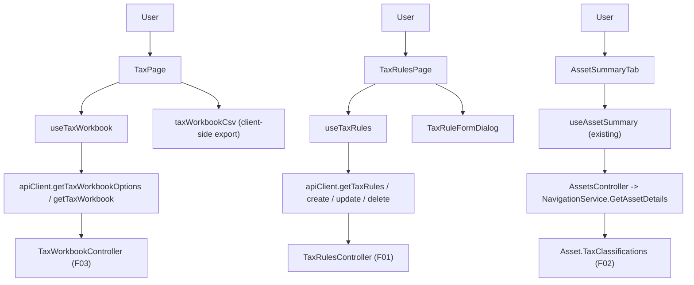

## 1. Technical Overview

**What:** The `Financial.Web` front end for tax reporting: a "Tax" page where the user picks a
jurisdiction and tax year and reviews F03's assembled workbook (entries, category totals, aggregate
status) with a CSV export; an Admin "Tax Rules" screen (list/create/edit/delete) following the
existing Admin-entity-CRUD pattern (P39, e.g. `ReserveBucketsPage`); and an addition to the asset
detail view surfacing F02's `TaxProfile` (the asset's jurisdiction(s)). `TaxProfile` itself — a
read-only, computed-not-persisted view — was deferred by F02's spec to "whichever of F04/F05 first
renders it," so this feature also adds the small Application/Presentation plumbing for it (an
`AssetDetailsDTO` field, populated in `NavigationService.GetAssetDetails`) alongside its own UI; no
Domain change is needed, since `Asset.TaxClassifications` (F02) already carries everything the view
needs.

**Why:** F01 (`TaxRulesController`), F02 (`TaxClassification`, backfill, live wiring) and F03
(`TaxWorkbookController`) are shipped and merged (PRs #841–#845, #846). Nothing in `Financial.Web`
consumes any of it yet — `Financial.Web/src/api/types.ts` has no `Tax*` alias even though
`src/api/generated/openapi.ts` already carries every `Tax*` schema from the three merged backends
(confirmed: `TaxRuleDTO`, `TaxWorkbookDTO`, `TaxWorkbookEntryDTO`, `TaxWorkbookOptionDTO`,
`TaxCategoryTotalDTO` are all present in the generated file already). This feature is the first
consumer, wiring the existing endpoints into the UI the PRD's `docs/rules/ui.md` React-led-parity
rule requires before F05 (WPF) can mirror it.

**Scope:**
- Included: the Tax page (selectors, workbook table, category totals, status indicators, CSV
  export); the Admin Tax Rules screen (list/create/edit/delete with inline validation); the asset
  detail view's `TaxProfile` addition, including the small backend piece that produces it.
- Excluded (deferred): `Financial.App` (WPF) parity — F05; anything that computes tax due or
  changes calculation semantics — out of scope for the whole PRD (§7); a dedicated backend CSV
  endpoint — the already-fetched workbook is serialized to CSV client-side (see §3), so no new
  endpoint is needed.

## 2. Architecture Impact

**Affected components:**
- `Financial.Investment.Application/DTOs/AssetDetailsDTO.cs` (modified) — add the `TaxProfile` field
- `Financial.Investment.Application/Services/NavigationService.cs` (modified) — populate it from
  `asset.TaxClassifications`
- `Financial.Api` OpenAPI snapshot + `Financial.Web/src/api/generated/openapi.ts` (regenerated) —
  picks up the new `AssetDetailsDTO` field and every `Tax*` schema's route/response wiring
  (schemas were already present; only the `/tax-rules`, `/tax-workbook` route entries' consumers
  change, which is a frontend-only concern, not a snapshot diff)
- `Financial.Web/src/api/types.ts` (modified) — `TaxRuleDto`/`TaxRuleCreateDto`/`TaxRuleUpdateDto`,
  `TaxWorkbookDto`/`TaxWorkbookEntryDto`/`TaxWorkbookOptionDto`/`TaxCategoryTotalDto` aliases
- `Financial.Web/src/api/financialApiClient.ts` (modified) — `getTaxRules`, `createTaxRule`,
  `updateTaxRule`, `deleteTaxRule`, `getTaxWorkbookOptions`, `getTaxWorkbook`
- `Financial.Web/src/components/AssetSummaryTab.tsx` (modified) — render the asset's tax
  jurisdiction(s)
- `Financial.Web/src/hooks/useTaxWorkbook.ts` (new) — selector state, workbook fetch, CSV trigger
- `Financial.Web/src/utils/taxWorkbookCsv.ts` (new) — pure CSV-string builder + browser download
- `Financial.Web/src/pages/TaxPage.tsx` + `.css` (new) — the Tax page
- `Financial.Web/src/hooks/useTaxRules.ts` (new) — list/create/edit/delete state
- `Financial.Web/src/components/TaxRuleFormDialog.tsx` (new) — create/edit form, inline validation
- `Financial.Web/src/pages/TaxRulesPage.tsx` + `.css` (new) — the Admin Tax Rules screen
- `Financial.Web/src/navigation/routes.tsx` (modified) — `investments/tax`,
  `admin/investment/tax-rules` route entries
- `Financial.Web/src/navigation/navTree.ts` (modified) — sidebar entries for both



## 3. Technical Decisions

| Decision | Chosen Approach | Alternative Considered | Trade-off |
|----------|----------------|-------------------------|-----------|
| CSV export mechanism | Build the CSV string client-side from the already-fetched `TaxWorkbookDto` (`taxWorkbookCsv.ts`), trigger a browser download via a `Blob` + a synthetic `<a download>` click | A new backend endpoint (`GET /tax-workbook/export`) returning `text/csv` | The workbook is already loaded in memory to render the table — a server round-trip would duplicate data the client already has for a format transform with no server-side concern (no auth, no size limit relevant to this single-user tool). No CSV library exists in the repo (checked `package.json`) and the format is 13 flat columns with no nested data or embedded commas beyond `TaxRuleLabel`/rule descriptions, which get quoted — small enough to hand-roll rather than add a dependency the UI rules require approval for |
| CSV `Currency` column | Derived client-side from the workbook's `Jurisdiction` (`BR` → `BRL`, `UK` → `GBP`) — the same 1:1 mapping F02 already uses in reverse to derive `Jurisdiction` from an event's currency | Add a `Currency` field to `TaxWorkbookEntryDTO` | `TaxWorkbookEntryDTO` (F03, shipped) carries no currency — only `Jurisdiction` at the workbook level. Since a workbook is always scoped to one jurisdiction, and jurisdiction and currency are already a fixed 1:1 pair per F02's own derivation rule, computing it client-side needs no backend change; adding a field to an already-shipped, tested DTO for a value already fully determined by data the client has would be a redundant wire field |
| `Jurisdiction`/`TaxYear` display on workbook rows | Shown once, in the page header/selector area (the values the user just picked), not repeated per table row | Repeat `jurisdiction`/`taxYear` as columns on every row | Every entry in a given `TaxWorkbookDTO` shares the same jurisdiction and tax year by construction (F03's `GetWorkbook(jurisdiction, taxYear)` filters to exactly that pair) — a column that is constant on every row adds width without adding information. The CSV export still includes both per PRD's 13-column spec, since a standalone file has no page header to carry that context |
| CSV filename | `tax-workbook-{jurisdiction}-{taxYear-with-slash-replaced-by-dash}.csv`, e.g. `tax-workbook-UK-2025-26.csv` | Use the raw `taxYear` string in the filename | A UK tax year is formatted `"2025/26"` (F02's existing convention) and `/` is not a safe filename character on Windows (this app's primary desktop target) or most browsers' download handling — replacing it is a pure display-safety transform with no effect on the CSV's own `TaxYear` column content |
| `TaxProfile` shape on `AssetDetailsDTO` | A `Jurisdictions` field (`IReadOnlyList<Jurisdiction>`), populated as `asset.TaxClassifications.Where(Active).Select(Jurisdiction).Distinct()` directly in `NavigationService.GetAssetDetails` — no new DTO type | A dedicated `TaxProfileDTO` nested object | F02's spec already describes `TaxProfile` as "the distinct set of jurisdictions across that asset's own `TaxClassification` history" — a flat list is the whole shape; introducing a wrapper DTO for a single list field is unwarranted ceremony. `AssetDetailsDTO` already flattens comparable per-asset facts this way (e.g. `TotalCredits`, `RealizedGainLoss`) rather than nesting them |
| Delete confirmation copy on Tax Rules | Real delete language ("will be permanently deleted"), unlike `ReserveBucketsPage`'s deactivate-and-keep pattern | Reuse the "deactivate" dialog copy/pattern verbatim | `TaxRuleService.DeleteTaxRuleAsync` → `Investments.DeleteTaxRule` performs a hard `_taxRules.Remove(rule)` (F01, shipped) — there is no `IsActive` flag or soft-delete state on `TaxRule` to preserve, so copy implying deactivation would misrepresent what happens. The existing delete-guard (F01 AC-05) is what actually protects final figures, by rejecting the delete outright when one still depends on the rule |
| PR staging | 3 PRs along real functional boundaries: (1) `TaxProfile` backend + asset-detail UI, (2) Tax page + CSV export, (3) Admin Tax Rules screen | One combined PR | Each stage is independently mergeable and deployable — Stage 1 has no dependency on 2/3, and 2/3 share nothing but generic `types.ts`/`financialApiClient.ts`/routing edits. Each stage's own non-test file count (4, 8, 8) stays within the repo's 8-file PR-size rule (`docs/rules/design.md`); one combined PR would run to ~18 non-test files |

## 4. Component Overview

**Backend (Stage 1):**

| File Path | New/Modified | Purpose | Key Responsibilities |
|-----------|--------------|---------|----------------------|
| `Financial.Investment.Application/DTOs/AssetDetailsDTO.cs` | Modified | Carry the asset's tax jurisdiction(s) | Add `IReadOnlyList<Jurisdiction> TaxJurisdictions { get; set; } = []` |
| `Financial.Investment.Application/Services/NavigationService.cs` | Modified | Populate `TaxJurisdictions` in `GetAssetDetails` | `asset.TaxClassifications.Where(c => c.Status == TaxClassificationStatus.Active).Select(c => c.Jurisdiction).Distinct().OrderBy(...).ToList()` |

**Frontend — shared (Stage 1):**

| File Path | New/Modified | Purpose | Key Responsibilities |
|-----------|--------------|---------|----------------------|
| `Financial.Web/src/api/types.ts` | Modified | Pick up `AssetDetailsDto.taxJurisdictions` (regenerated) | No manual alias change needed — `AssetDetailsDto` is already aliased; the new field flows through automatically once `openapi.ts` regenerates |
| `Financial.Web/src/components/AssetSummaryTab.tsx` | Modified | Display the asset's tax jurisdiction(s) next to `Country` | Render `asset.taxJurisdictions.join(', ')` or an em dash when empty (no classification yet) |

**Frontend — Tax page (Stage 2):**

| File Path | New/Modified | Purpose | Key Responsibilities |
|-----------|--------------|---------|----------------------|
| `Financial.Web/src/api/types.ts` | Modified | Workbook DTO aliases | `TaxWorkbookDto`, `TaxWorkbookEntryDto`, `TaxWorkbookOptionDto`, `TaxCategoryTotalDto` |
| `Financial.Web/src/api/financialApiClient.ts` | Modified | Workbook API surface | `getTaxWorkbookOptions(): Promise<TaxWorkbookOptionDto[]>`; `getTaxWorkbook(jurisdiction, taxYear): Promise<TaxWorkbookDto>` |
| `Financial.Web/src/hooks/useTaxWorkbook.ts` | New | Page state | Loads the options list once; tracks selected jurisdiction/tax year (defaulting to the first option); fetches the workbook on selection change; exposes loading/error/empty states independently for options vs. workbook, per the PRD's Experience block |
| `Financial.Web/src/utils/taxWorkbookCsv.ts` | New | CSV generation | `buildTaxWorkbookCsv(workbook: TaxWorkbookDto): string` (the 13-column rows, RFC-4180-style quoting for any field containing a comma/quote/newline); `downloadCsv(filename: string, csv: string): void` (Blob + synthetic anchor click) |
| `Financial.Web/src/pages/TaxPage.tsx` | New | Tax page UI | Jurisdiction select, tax-year select (options filtered to the selected jurisdiction), workbook table (date, category, amounts, status, evidence reference), category-totals summary row(s), aggregate status indicator, Export CSV button; initial/loading/empty/disabled states per PRD Experience |
| `Financial.Web/src/pages/TaxPage.css` | New | Layout | Follows `docs/ui/react.md` (CSS Grid for the page shell, existing `data-table` classes for the table) |

**Frontend — Admin Tax Rules (Stage 3):**

| File Path | New/Modified | Purpose | Key Responsibilities |
|-----------|--------------|---------|----------------------|
| `Financial.Web/src/api/types.ts` | Modified | Rule DTO aliases | `TaxRuleDto`, `TaxRuleCreateDto`, `TaxRuleUpdateDto` |
| `Financial.Web/src/api/financialApiClient.ts` | Modified | Rule API surface | `getTaxRules(): Promise<TaxRuleDto[]>`; `createTaxRule`, `updateTaxRule(id, ...)`, `deleteTaxRule(id)` |
| `Financial.Web/src/hooks/useTaxRules.ts` | New | List/CRUD state | Mirrors `useReserveBuckets.ts`'s reducer shape (`FETCH_*`/`SAVE_*`), adapted for hard delete (no `deactivate` helper — a `deleteTaxRule(rule)` that surfaces the guard's 409 message verbatim via `getErrorMessage`) |
| `Financial.Web/src/components/TaxRuleFormDialog.tsx` | New | Create/edit form | Jurisdiction/event-category selects, label/description text fields, effective-from/to date pickers; inline validation before submit (effective-from ≥ effective-to) mirroring the server's own check so the common case never round-trips; server-side overlap/range rejections (409/400) surface inline via the same field the delete guard uses |
| `Financial.Web/src/pages/TaxRulesPage.tsx` | New | Admin screen | List table (jurisdiction, event category, label, effective range), create/edit/delete actions, empty state, delete confirmation naming the rule, inline server-error display for a rejected delete |
| `Financial.Web/src/pages/TaxRulesPage.css` | New | Layout | Follows `ReserveBucketsPage.css` conventions |

**Frontend — routing (Stages 2 and 3):**

| File Path | New/Modified | Purpose | Key Responsibilities |
|-----------|--------------|---------|----------------------|
| `Financial.Web/src/navigation/routes.tsx` | Modified | Route registration | `investments/tax` → `TaxPage` (Stage 2); `admin/investment/tax-rules` → `TaxRulesPage` (Stage 3) |
| `Financial.Web/src/navigation/navTree.ts` | Modified | Sidebar entries | `Investments > Tax` (Stage 2); `Admin > Investment > Tax Rules` (Stage 3) |

## 5. API Contracts

No new endpoints — Stage 2 and Stage 3 consume F01's and F03's already-shipped, already-tested
endpoints (`GET/POST/PUT/DELETE /tax-rules`, `GET /tax-workbook`, `GET /tax-workbook/options`; see
`docs/prd/P51-prd-tax-reporting-support/features/P51-F01-tax-rules/spec.md` §5 and
`.../P51-F03-tax-year-workbook/spec.md` §5 for their contracts). Stage 1 extends one existing
response body:

**Extended: `GET /assets/{brokerName}/{portfolioName}/{assetName}`** (`AssetsController`, unchanged
route — `AssetDetailsDTO` gains one field)

**Response (Success - 200) — added field:**

| Field | Type | Description |
|-------|------|--------------|
| `taxJurisdictions` | `string[]` | Distinct `Jurisdiction` values (`"BR"`/`"UK"`) across the asset's `Active` `TaxClassification` history; empty if none classified yet |

**Response Example (excerpt):**
```json
{
  "name": "PETR4",
  "country": "BR",
  "taxJurisdictions": ["BR"]
}
```

No error-code changes — the field is always present (possibly empty), never causes a new failure
mode.

## 6. Data Model

None. Stage 1 adds a computed (not persisted) field to an existing response DTO; Stages 2 and 3 are
pure frontend consumers of already-persisted `TaxRule` (F01) and `TaxClassification` (F02) data via
already-shipped endpoints.

## 7. Testing Strategy

**Test files:**

| Test File | Test Type | Target | Coverage Goal |
|-----------|-----------|--------|----------------|
| `Tests/Financial.Investment.Application.Tests/Services/NavigationServiceTests.cs` | Unit (extend existing file) | `NavigationService.GetAssetDetails` | `TaxJurisdictions` reflects the distinct `Jurisdiction`s across the asset's `Active` classifications; excludes `Superseded` ones; empty when the asset has none |
| `Tests/Financial.Api.Tests/Acceptance/TaxProfileAndClassificationAcceptanceTests.cs` | Integration (AC-tracing, extend existing file from F02) | End-to-end via the real host | Adds the one remaining F02 AC this feature completes (`P51-F02-tax-profile-and-classification-08`) |
| `Financial.Web/src/utils/__tests__/taxWorkbookCsv.test.ts` | Unit | `buildTaxWorkbookCsv`/`downloadCsv` | Exactly 13 columns in the specified order; one row per entry; correct quoting for a `TaxRuleLabel` containing a comma; `Currency` derived correctly for both jurisdictions; filename slash-replacement for a UK tax year |
| `Financial.Web/src/hooks/__tests__/useTaxWorkbook.test.ts` | Unit | `useTaxWorkbook` | Defaults to the first available `(jurisdiction, taxYear)` option; refetches the workbook on selection change; independent loading/error states for options vs. workbook; empty-options state when no classification exists anywhere |
| `Financial.Web/src/pages/__tests__/TaxPage.test.tsx` | Component | `TaxPage` | Renders entries/category totals/aggregate status for a loaded workbook; shows the explanatory empty state when no options exist; Export CSV disabled when the selected workbook has zero entries; each of the 4 `CalculationStatus` values renders a visually distinct indicator |
| `Financial.Web/src/hooks/__tests__/useTaxRules.test.ts` | Unit | `useTaxRules` | Create/update/delete happy paths refresh the list; a rejected delete (409) surfaces the server's message without removing the row from state |
| `Financial.Web/src/components/__tests__/TaxRuleFormDialog.test.tsx` | Component | `TaxRuleFormDialog` | Inline rejection when `effectiveFrom >= effectiveTo` before submission; server-side overlap rejection (409) surfaces inline naming the conflicting rule |
| `Financial.Web/src/pages/__tests__/TaxRulesPage.test.tsx` | Component | `TaxRulesPage` | Empty state prompts rule creation; create/edit/delete update the list without a full reload; a rejected delete shows the server's message naming the affected tax year(s) |
| `Financial.Web/src/components/__tests__/AssetSummaryTab.test.tsx` | Component (extend existing file) | `AssetSummaryTab` | Renders the asset's `taxJurisdictions`; renders an em dash when empty |
| `Financial.Web/src/navigation/__tests__/routes.test.ts` | Unit (extend existing file) | `PAGE_ROUTES`/`NAV_TREE` agreement | Both new routes appear in both structures (existing test already asserts this invariant generically) |

**Acceptance-criteria traceability (PRD Section 9, F04):**
- `P51-F04-react-tax-reporting-01` (selectors show only existing combinations; selecting shows the workbook) → `useTaxWorkbook.test.ts`, `TaxPage.test.tsx`
- `P51-F04-react-tax-reporting-02` (4 statuses render distinctly, entries and aggregate) → `TaxPage.test.tsx`
- `P51-F04-react-tax-reporting-03` (CSV: exactly 13 columns, one row per entry) → `taxWorkbookCsv.test.ts`
- `P51-F04-react-tax-reporting-04` (Admin CRUD, inline rejection for invalid/overlapping range) → `TaxRuleFormDialog.test.tsx`, `TaxRulesPage.test.tsx`
- `P51-F04-react-tax-reporting-05` (rejected delete shows server message naming affected tax years) → `useTaxRules.test.ts`, `TaxRulesPage.test.tsx`
- `P51-F04-react-tax-reporting-06` (asset detail shows `TaxProfile` jurisdiction(s)) → `AssetSummaryTab.test.tsx`, `TaxProfileAndClassificationAcceptanceTests.cs`
- `P51-F04-react-tax-reporting-07` (Export CSV disabled when zero entries) → `TaxPage.test.tsx`

**Cross-Feature Integration (PRD Section 9):**
- "F04 correctly renders F03's workbook, F02's `TaxProfile`, and F01's rules on the Admin screen, for
  the same underlying data" — covered by `TaxPage.test.tsx` (workbook), `AssetSummaryTab.test.tsx` +
  `NavigationServiceTests.cs` (`TaxProfile`), and `TaxRulesPage.test.tsx` (rules), each asserting
  against the same DTO shapes F01/F02/F03 already ship and test on the backend side.
