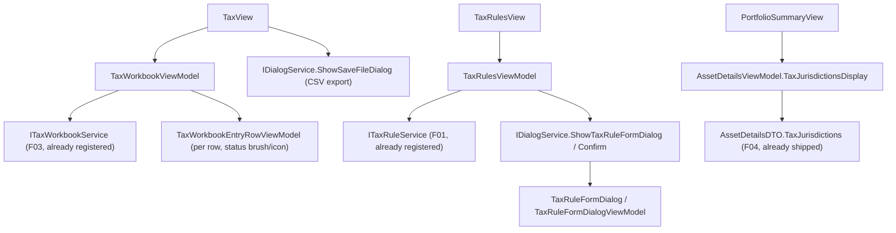

## 1. Technical Overview

**What:** The `Financial.App` (WPF) equivalent of F04's three surfaces — a Tax page (jurisdiction/tax-year
selectors, workbook entries, category totals, a status indicator per entry and aggregate, CSV export),
an Admin Tax Rules screen (list/create/edit/delete), and the asset detail view's `TaxProfile` addition —
same terminology, field order, and outcomes as `Financial.Web`, WPF-native controls and idioms
otherwise.

**Why:** F01–F04 are shipped and merged. `Financial.App` does not yet reference `ITaxRuleService` or
`ITaxWorkbookService` anywhere, and `AssetDetailsViewModel` does not yet read `AssetDetailsDTO`'s
`TaxJurisdictions` field (added in F04). Unlike `Financial.Web`, which talks to F01/F03 over HTTP,
`Financial.App` composes the Investment bounded context's Application layer directly in-process
(`services.AddFinancialApplication()` in `App.xaml.cs` already registers `ITaxRuleService` and
`ITaxWorkbookService` — confirmed both are already resolvable via DI with zero registration changes)
— so this feature is pure Presentation-layer work: new ViewModels/Views calling already-registered
services directly, no DTOs to duplicate or wire-format to match, no OpenAPI snapshot involved at all.

**Scope:**
- Included: Tax page, CSV export (via a native `SaveFileDialog`, the desktop equivalent of the
  browser download F04 uses), Admin Tax Rules screen, asset detail `TaxProfile` display.
- Excluded (deferred): anything that computes tax due or changes calculation semantics — out of
  scope for the whole PRD (§7). No new backend endpoint or DTO — F01/F02/F03's existing
  Application-layer services and DTOs are consumed as-is.

## 2. Architecture Impact

**Affected components (by stage — see §3 for the staging rationale):**

**Stage 1 — TaxProfile on asset detail:**
- `Financial.App/ViewModels/Investment/AssetDetailsViewModel.cs` (modified) — expose
  `TaxJurisdictionsDisplay` from `AssetDetailsDTO.TaxJurisdictions`
- `Financial.App/Views/Investment/PortfolioSummaryView.xaml` (modified) — render it next to `Country`

**Stage 2 — Tax page + CSV export:**
- `Financial.App/ViewModels/Investment/TaxWorkbookViewModel.cs` (new)
- `Financial.App/ViewModels/Investment/TaxWorkbookEntryRowViewModel.cs` (new)
- `Financial.App/Views/Investment/TaxView.xaml` + `.xaml.cs` (new)
- `Financial.App/Services/IDialogService.cs` (modified) — add `ShowSaveFileDialog`
- `Financial.App/Services/DialogService.cs` (modified) — implement it via `Microsoft.Win32.SaveFileDialog`
- `Financial.App/Navigation/NavTree.cs` (modified) — `Investments > Tax`
- `Financial.App/MainWindow.xaml.cs` (modified) — inject and register `TaxView`
- `Financial.App/App.xaml.cs` (modified) — DI registration for the two new view/viewmodel pairs

**Stage 3 — Admin Tax Rules screen:**
- `Financial.App/ViewModels/Admin/TaxRulesViewModel.cs` (new)
- `Financial.App/ViewModels/Admin/TaxRuleFormDialogViewModel.cs` (new)
- `Financial.App/Views/Admin/TaxRulesView.xaml` + `.xaml.cs` (new)
- `Financial.App/Views/Admin/TaxRuleFormDialog.xaml` + `.xaml.cs` (new)
- `Financial.App/Services/IDialogService.cs` (modified) — add `ShowTaxRuleFormDialog`
- `Financial.App/Services/DialogService.cs` (modified) — implement it
- `Financial.App/Navigation/NavTree.cs` (modified) — `Admin > Investment > Tax Rules`
- `Financial.App/MainWindow.xaml.cs` (modified) — inject and register `TaxRulesView`
- `Financial.App/App.xaml.cs` (modified) — DI registration for the two new view/viewmodel pairs

## 3. Technical Decisions

| Decision | Chosen Approach | Alternative Considered | Trade-off |
|----------|----------------|-------------------------|-----------|
| Tax Jurisdiction field position in `PortfolioSummaryView.xaml` | Appended as a new trailing row (after "Status"), not inserted next to Country | Insert immediately after Country, renumbering the ~15 existing `Grid.Row` indices that follow | `AssetSummaryTemplate`'s Grid indexes every cell by literal `Grid.Row="N"` (no equivalent of JSX's simple document-order insertion) — renumbering ~50+ existing bindings for one new field is a disproportionate, error-prone diff. The field's terminology and value are identical to Web; only its position within this one dense info grid differs, a documented, deliberate WPF-native trade-off, not a meaning/outcome change |
| Service access | Inject `ITaxRuleService`/`ITaxWorkbookService` directly into the new ViewModels, exactly as `ReserveBucketsViewModel` injects `IReserveBucketService` | An HTTP client mirroring `Financial.Web`'s `financialApiClient.ts` | `Financial.App` composes the Application layer in-process (`services.AddFinancialApplication()`, already registered) for every existing feature — introducing an HTTP layer for this one feature would be a new, inconsistent integration pattern with no benefit, since the services are already resolvable |
| CSV export mechanism | `IDialogService.ShowSaveFileDialog(string suggestedFileName, string filter)` wrapping `Microsoft.Win32.SaveFileDialog`, returning the chosen path or `null` on cancel; `TaxWorkbookViewModel` then builds the CSV string and calls `File.WriteAllText` | A background "download" folder with no picker | No existing WPF feature in this repo writes a file to disk yet — a native Save dialog is the standard desktop equivalent of the browser's download prompt `Financial.Web` uses, and lets the user pick where the file lands, matching a spreadsheet-import/export mental model already familiar from this app's own `Tools/*SpreadsheetImport` utilities |
| CSV column building | A private static method on `TaxWorkbookViewModel` producing the same 13 columns in the same order as `Financial.Web`'s `buildTaxWorkbookCsv` (`Date, Jurisdiction, TaxYear, EventCategory, Proceeds, CostBasis, GainLoss, GrossAmount, WithheldAmount, NetAmount, Currency, CalculationStatus, EvidenceReference`), `Currency` derived from `Jurisdiction` the same way (`BR`→`BRL`, `UK`→`GBP`) | A shared C#/TypeScript CSV-generation library | No code-sharing mechanism exists between the .NET and TypeScript codebases (they're different languages) — matching column order and derivation logic by hand, verified against the same PRD spec both platforms implement, is the only option; a dedicated test (§7) pins the exact header/order so the two platforms can't silently drift |
| Status indicator (Final/Estimated/Incomplete/RequiresReview) | Per-row computed `SolidColorBrush`/`SymbolRegular`/`bool Filled` properties on `TaxWorkbookEntryRowViewModel`, using the **exact pixel values** `Financial.Web`'s Fluent `Badge` renders for `color="success"/"informative"/"warning"/"danger"` — resolved from `@fluentui/react-theme`'s `webLightTheme` and the `Badge` component's own `filled-*` style map (not eyeballed): `Final`=success (`#107c10` bg / `#ffffff` fg, `CheckmarkCircle20`), `Estimated`=informative (`#ebebeb` bg / `#616161` fg, `Info20`), `Incomplete`=warning (`#fde300` bg / `#242424` fg, `Clock20`), `RequiresReview`=danger (`#d13438` bg / `#ffffff` fg, `AlertUrgent20`, filled) | Named system brushes (e.g. `Brushes.Green`) | This mirrors `PaymentDueRowViewModel`'s exact precedent (its own doc comment cites this same "match the rendered pixel" requirement from ADR-005) — two of its three tiers (danger/warning/informative) already used these exact hex values for unrelated statuses; `RequiresReview`'s icon/filled treatment reuses its "today" tier's `AlertUrgent20`+filled pairing, since both represent the worst/most-urgent state |
| Jurisdiction / Event Category pickers | Native `ComboBox` + `ComboBoxItem`/`Tag`, `SelectedValuePath="Tag"` — the same shape `TransactionFormView.xaml`'s `Type` picker uses | `Wpf.Ui`'s themed `ComboBox` wrapper | No `ui:ComboBox` exists in this codebase; every existing enum-picker (Transaction Type, etc.) uses the plain WPF `ComboBox`, already theme-aware via the app's global resource dictionaries |
| `EffectiveFrom`/`EffectiveTo` date pickers | Native `DatePicker` bound via the existing `DateOnlyToDateTimeConverter` (already registered as an App-level resource, already used by `CardsGridView.xaml`) | A new converter | The converter already exists, already handles the nullable case (`ConvertBack` returns `null` for no selection), and is a one-line reuse |
| Immutable `Jurisdiction`/`EventCategory` on edit | The two `ComboBox`es are `IsEnabled="{Binding IsCreateMode}"` (disabled once editing), mirroring `Financial.Web`'s `disabled={isEditing}` on the same fields | Hide the fields entirely when editing | `TaxRuleUpdateDTO` (F01) has no `Jurisdiction`/`EventCategory` fields at all — showing them read-only (not hidden) preserves the "same field order in both variants" rule (`docs/rules/design.md`'s Add/Edit continuity), matching the Web reference exactly |
| PR staging | 3 stages, same boundary as F04: (1) TaxProfile (2 files), (2) Tax page + CSV export (9 files: the new SaveFileDialog wrapper plus the mandatory 3-file nav-registration trio this app always touches for a new top-level page — `NavTree.cs`/`MainWindow.xaml.cs`/`App.xaml.cs`, the same shape F04's Stage 2 `routes.tsx`/`navTree.ts`/`lazyPages.tsx` trio took), (3) Admin Tax Rules screen (11 files: `ReserveBucketsView`'s own shape — View+ViewModel pair, FormDialog View+ViewModel pair, `IDialogService`/`DialogService`, plus the same 3-file nav trio — is the established, unavoidable minimum for *any* new WPF Admin CRUD screen in this app, not a self-inflicted overage) | One combined PR, or splitting the nav-trio touches into their own PR | Each stage is independently mergeable and deployable. Stages 2 and 3 exceed the repo's 8-file rule of thumb by 1 and 3 files respectively — both overages are the mechanical, unavoidable cost of this app's own established per-page/per-CRUD-screen conventions (confirmed by inspecting `ReserveBucketsView`'s own file shape), not scope creep; flagged explicitly per `docs/rules/design.md` rather than fragmented into artificial half-working slices |

## 4. Component Overview

**Stage 1 — TaxProfile:**

| File Path | New/Modified | Purpose | Key Responsibilities |
|-----------|--------------|---------|----------------------|
| `Financial.App/ViewModels/Investment/AssetDetailsViewModel.cs` | Modified | Expose the asset's tax jurisdiction(s) | `TaxJurisdictionsDisplay` (string, `string.Join(", ", ...)` or `"—"` when empty), set from `details.TaxJurisdictions` alongside the existing `Country` assignment |
| `Financial.App/Views/Investment/PortfolioSummaryView.xaml` | Modified | Display the asset's tax jurisdiction(s) | New `TextBlock` pair appended as a new trailing row in `AssetSummaryTemplate`'s Grid (after the existing "Status" row) rather than renumbering all ~15 existing `Grid.Row` indices for one field — see Technical Decisions |

**Stage 2 — Tax page + CSV export:**

| File Path | New/Modified | Purpose | Key Responsibilities |
|-----------|--------------|---------|----------------------|
| `Financial.App/ViewModels/Investment/TaxWorkbookViewModel.cs` | New | Page state | Loads `ITaxWorkbookService.GetWorkbookOptions()` on construction; `Jurisdictions`/`TaxYearsForJurisdiction` (derived, `SelectableOptionViewModel`-style or plain `ObservableCollection<string>`); `SelectedJurisdiction`/`SelectedTaxYear` (selecting a jurisdiction resets the tax year to that jurisdiction's first option); loads the workbook via `GetWorkbook(jurisdiction, taxYear)` on selection change; `Entries` (`ObservableCollection<TaxWorkbookEntryRowViewModel>`), `CategoryTotals`; `IsLoadingOptions`/`OptionsError`/`IsLoadingWorkbook`/`WorkbookError` (independent, per the PRD's Experience block); `CanExportCsv` (`Entries.Count > 0`); `ExportCsvCommand` (calls `IDialogService.ShowSaveFileDialog`, builds the CSV, writes it) |
| `Financial.App/ViewModels/Investment/TaxWorkbookEntryRowViewModel.cs` | New | Display-ready wrapper per entry | Wraps one `TaxWorkbookEntryDTO`; exposes `StatusBrush`/`StatusForeground`/`StatusSymbol`/`StatusSymbolFilled`/`StatusAccessibleLabel` per the status-color mapping in §3, plus pass-through display properties (`Date`, `EventCategory`, `Proceeds`, `CostBasis`, `GainLoss`, `GrossAmount`, `WithheldAmount`, `NetAmount`, `EvidenceReference`) |
| `Financial.App/Views/Investment/TaxView.xaml` | New | The Tax page | Jurisdiction/tax-year `ComboBox`es, a `DataGrid` for entries (mirroring `AnnualSummaryView`'s `IsReadOnly="True"` grid shape), a second `DataGrid` for category totals (bold via `RowStyle`/`ElementStyle`), a status `Border`+`SymbolIcon`+`TextBlock` per entry (mirroring `PaymentDueBanner.xaml`'s badge shape) and for the aggregate status, an Export CSV `ui:Button` (`IsEnabled="{Binding CanExportCsv}"`) |
| `Financial.App/Views/Investment/TaxView.xaml.cs` | New | Code-behind | `InitializeComponent()` + `DataContext = viewModel` only, per MVVM |
| `Financial.App/Services/IDialogService.cs` | Modified | New dialog capability | `string? ShowSaveFileDialog(string suggestedFileName, string filter)` |
| `Financial.App/Services/DialogService.cs` | Modified | Implementation | `new Microsoft.Win32.SaveFileDialog { FileName = suggestedFileName, Filter = filter }` — returns `dialog.FileName` if `ShowDialog() == true`, else `null` |
| `Financial.App/Navigation/NavTree.cs` | Modified | Sidebar entry | `NavChild("tax", "Tax", "tax")` appended to the `investments` category's `Children`, matching `Financial.Web`'s `NAV_TREE` position (after "Read Assets current values") |
| `Financial.App/MainWindow.xaml.cs` | Modified | Wire the view into the shell | `TaxView taxView` constructor parameter, null-guard, `["tax"] = taxView` added to `viewsByKey` |
| `Financial.App/App.xaml.cs` | Modified | DI registration | `AddTransient<TaxWorkbookViewModel>()`, `AddTransient<TaxView>()` |

**Stage 3 — Admin Tax Rules screen:**

| File Path | New/Modified | Purpose | Key Responsibilities |
|-----------|--------------|---------|----------------------|
| `Financial.App/ViewModels/Admin/TaxRulesViewModel.cs` | New | List/CRUD state | Mirrors `ReserveBucketsViewModel`'s shape (`IsLoading`/`Error`/`ShowContent`, `RetryCommand`) over `ITaxRuleService`; `TaxRules` (`ObservableCollection<TaxRuleDTO>`); `CreateTaxRuleCommand`/`EditTaxRuleCommand`/`DeleteTaxRuleCommand`; delete is a real `DeleteTaxRuleAsync` call behind a `Confirm(...)` dialog worded "will be permanently deleted" (not "deactivated" — `TaxRule` has no soft-delete state, per F01); a rejected delete's exception message surfaces as `ActionError` without removing the row, exactly like `EditReserveBucketAsync`'s error path |
| `Financial.App/ViewModels/Admin/TaxRuleFormDialogViewModel.cs` | New | Create/edit form | `IsCreateMode` (`currentRule is null`); `Jurisdiction`/`EventCategory` (locked once editing); `Label`/`Description`/`EffectiveFrom`/`EffectiveTo` (`DateOnly?`); inline `ValidationMessage` mirroring the server's own checks (blank label; `EffectiveFrom >= EffectiveTo` when both set) computed the same way `ReserveBucketFormDialogViewModel.Validate()` does; `ConfirmCommand`/`CancelCommand`/`CloseRequested` |
| `Financial.App/Views/Admin/TaxRulesView.xaml` | New | List screen | Mirrors `ReserveBucketsView.xaml`'s shape: header + "Create Tax Rule" `ui:Button`, `DataGrid` (Jurisdiction, Event Category, Label, Effective From, Effective To, trailing Edit/Delete icon-button column), empty-state text, `ActionError` `TextBlock` |
| `Financial.App/Views/Admin/TaxRulesView.xaml.cs` | New | Code-behind | `InitializeComponent()` + `DataContext = viewModel` |
| `Financial.App/Views/Admin/TaxRuleFormDialog.xaml` | New | Create/edit dialog | Mirrors `ReserveBucketFormDialog.xaml`'s shape: two `ComboBox`es (Jurisdiction, Event Category), `TextBox` (Label), `TextBox` multiline (Description), two `DatePicker`s (Effective From/To) via `DateOnlyToDateTimeConverter`, `ValidationMessage` `TextBlock`, Save/Cancel `ui:Button`s |
| `Financial.App/Views/Admin/TaxRuleFormDialog.xaml.cs` | New | Code-behind | `InitializeComponent()`, `DataContext`, `DialogCloser.Attach(...)` — identical shape to `ReserveBucketFormDialog.xaml.cs` |
| `Financial.App/Services/IDialogService.cs` | Modified | New dialog capability | `bool ShowTaxRuleFormDialog(TaxRuleFormDialogViewModel viewModel)` |
| `Financial.App/Services/DialogService.cs` | Modified | Implementation | `new TaxRuleFormDialog(viewModel) { Owner = ... }.ShowDialog() == true` |
| `Financial.App/Navigation/NavTree.cs` | Modified | Sidebar entry | `NavChild("admin-tax-rules", "Tax Rules", "admin-tax-rules")` appended to the `admin` category's `investment` group, after Portfolios |
| `Financial.App/MainWindow.xaml.cs` | Modified | Wire the view into the shell | `TaxRulesView taxRulesView` constructor parameter, null-guard, `["admin-tax-rules"] = taxRulesView` |
| `Financial.App/App.xaml.cs` | Modified | DI registration | `AddTransient<TaxRulesViewModel>()`, `AddTransient<TaxRulesView>()` |

## 5. API Contracts

None — `Financial.App` calls `ITaxRuleService`/`ITaxWorkbookService` in-process; no HTTP surface is
added or changed. See `docs/prd/P51-prd-tax-reporting-support/features/P51-F01-tax-rules/spec.md` §5
and `.../P51-F03-tax-year-workbook/spec.md` §5 for the underlying service contracts these ViewModels
consume directly.

## 6. Data Model

None. Every stage is a Presentation-layer consumer of data F01/F02/F03/F04 already persist and expose.

## 7. Testing Strategy

**Test files:**

| Test File | Test Type | Target | Coverage Goal |
|-----------|-----------|--------|----------------|
| `Tests/Financial.Presentation.Tests/ViewModels/Investment/AssetDetailsViewModelTests.cs` | Unit (extend existing file) | `AssetDetailsViewModel` | `TaxJurisdictionsDisplay` joins multiple jurisdictions with `", "`; renders `"—"` when the asset has none |
| `Tests/Financial.Presentation.Tests/ViewModels/Investment/TaxWorkbookViewModelTests.cs` | Unit | `TaxWorkbookViewModel` | Defaults selection to the first available option and loads its workbook; selecting a jurisdiction resets the tax year to that jurisdiction's first option and refetches; independent loading/error states for options vs. workbook; `CanExportCsv` reflects entry count; `ExportCsvCommand` calls `ShowSaveFileDialog` and writes the exact 13-column CSV (header order, one row per entry, `Currency` derived per jurisdiction) — pinned against the same fixture data `Financial.Web`'s `taxWorkbookCsv.test.ts` uses, so the two platforms' CSV output can be compared by inspection; `ExportCsvCommand` does nothing when the user cancels the save dialog |
| `Tests/Financial.Presentation.Tests/ViewModels/Investment/TaxWorkbookEntryRowViewModelTests.cs` | Unit | `TaxWorkbookEntryRowViewModel` | Each of the 4 `CalculationStatus` values maps to a distinct `StatusBrush`/`StatusSymbol` pair, matching the exact hex values in §3's Technical Decisions |
| `Tests/Financial.Presentation.Tests/ViewModels/Admin/TaxRulesViewModelTests.cs` | Unit (extend `TestStubs.cs` with `StubTaxRuleService` and `StubDialogService` additions) | `TaxRulesViewModel` | Create/edit/delete happy paths refresh the list; a rejected delete (simulating F01's guard) surfaces `ActionError` without removing the row; delete confirmation wording says "permanently deleted" |
| `Tests/Financial.Presentation.Tests/ViewModels/Admin/TaxRuleFormDialogViewModelTests.cs` | Unit | `TaxRuleFormDialogViewModel` | Inline rejection when the label is blank or `EffectiveFrom >= EffectiveTo`; `Jurisdiction`/`EventCategory` are immutable once `IsCreateMode` is false; `ConfirmCommand` closes with `true` only when valid |
| `Tests/Financial.Architecture.Tests/*` (existing suite) | Architecture | Layer dependency rules | Re-run unchanged — confirms the new ViewModels still only reference Application-layer interfaces, never Infrastructure, consistent with every other WPF ViewModel |

**Acceptance-criteria traceability (PRD Section 9, F05):**
- `P51-F05-wpf-tax-reporting-01` (equivalent Tax page: selectors, entries, category totals, status indicators) → `TaxWorkbookViewModelTests`, `TaxWorkbookEntryRowViewModelTests`
- `P51-F05-wpf-tax-reporting-02` (same CSV export, identical column output) → `TaxWorkbookViewModelTests`' CSV test, cross-checked against `Financial.Web/src/utils/__tests__/taxWorkbookCsv.test.ts`'s fixtures
- `P51-F05-wpf-tax-reporting-03` (same Admin Tax Rules screen, equivalent create/edit/delete/validation) → `TaxRulesViewModelTests`, `TaxRuleFormDialogViewModelTests`
- `P51-F05-wpf-tax-reporting-04` (same asset detail `TaxProfile`) → `AssetDetailsViewModelTests`

**Cross-Feature Integration (PRD Section 9):**
- "F05 renders identical data to F04 for F01/F02/F03, with no discrepancy between the two front ends
  for the same jurisdiction/tax year" — both platforms read the exact same `ITaxRuleService`/
  `ITaxWorkbookService`/`AssetDetailsDTO` (F04 goes through the REST controllers wrapping the same
  services; F05 calls them directly), so there is no separate data path to diverge. Verified by the
  CSV column-order/derivation test above being written against the same fixture shape as
  `Financial.Web`'s equivalent test, and by manual side-by-side verification (§ definition of done)
  against the same running dev API + WPF app pointed at the same data file.
