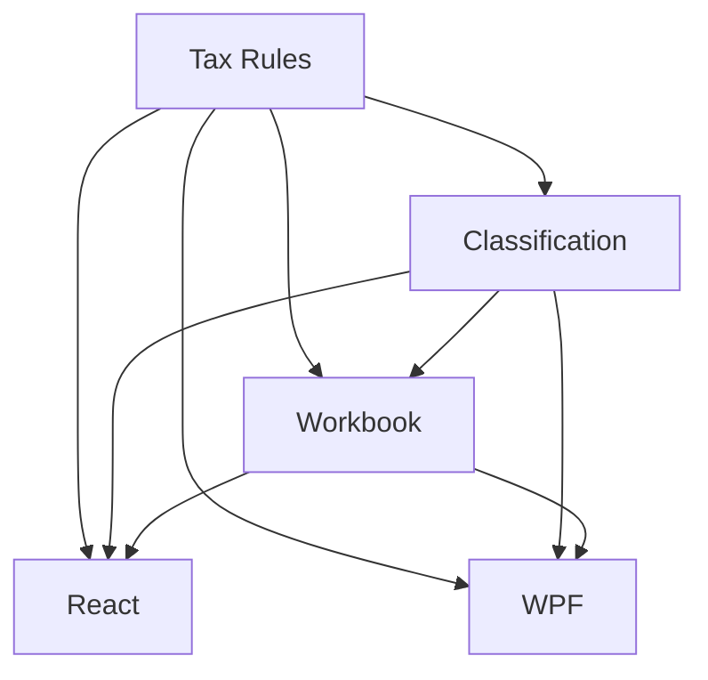

# Tax Reporting Support

## 1. Executive Summary

Tax Reporting Support closes G5 (no tax domain at all) for the Investment bounded context, building
directly on P50's disposal records and P47's income-event vocabulary. Today there is no jurisdiction,
tax year, event classification, withheld amount, or calculation-status field anywhere in the domain —
a user preparing to file taxes across two jurisdictions has to re-derive everything by hand from raw
transactions and credits. This feature classifies every capital-gain event (P50's `DisposalRecord`)
and every taxable income event (P47's Dividend, Coupon, JCP and Securities Lending Income credits)
into a dated, jurisdiction-tagged `TaxClassification`, matches each one against an admin-configured,
dated `TaxRule`, and assembles a per-jurisdiction, per-tax-year workbook with an evidence reference
back to the source record and an honest calculation status on every entry and every workbook as a
whole: final, estimated, incomplete, or requires review.

The work stays exactly inside the boundary the roadmap already drew for this wave (§5, D1): it
classifies, dates, and reports — it never computes tax due, never applies UK Section 104
pooling/bed-and-breakfast matching or BR's swing-trade/exemption-threshold rules, and never generates
a filing. Jurisdiction is resolved the way the user actually experiences it — from the disposing or
crediting event's own currency (BRL → Brazil, any other currency, GBP today, → UK), the same rule
P50-F02 already uses for `DisposalRecord.TaxYear` — closing D7 as "custody only": the roadmap's
`CountryCode`-domicile question (G13) is not applicable here, because the user files and pays tax in
the broker's jurisdiction regardless of where an underlying issuer is domiciled. No new domicile field
and no ISIN-prefix derivation are introduced. Every existing disposal and qualifying income event
across the data file gains a classification automatically on the next load, the same way P49's
currency backfill and P50's disposal backfill worked, so the tax workbook is complete from day one
with no separate migration tool.

## 2. Problem and Opportunity

**The Problem**

- **No tax domain exists at all.** Zero fields anywhere record jurisdiction, tax year, event
  classification, withheld amount, evidence reference, or calculation status (G5) — a user preparing
  to file has to manually walk every disposal and every dividend/coupon/lending-income credit and
  work out, unaided, which jurisdiction and tax year each one belongs to.
- **A rule change is currently a code change.** The brief itself cites a 2026 Brazilian dividend
  withholding rule change; today the only way to represent that is to edit code, which is exactly the
  release-cadence risk the roadmap's risk table already flags (§8: "Tax rules change under the
  implementation").
- **There is no honest signal for "this figure isn't ready yet."** A disposal or income event with no
  applicable classification rule configured yet looks identical to one that has been fully classified
  — there is no calculation-status concept anywhere to distinguish a final figure from an incomplete
  or provisional one.
- **`CountryCode` cannot be trusted for withholding** (G13) — roughly fifty US-domiciled holdings are
  recorded as UK because they sit in UK accounts, and the field is inconsistently set even for the
  same instrument (AGNC recorded as US once, UK twice, under the same broker).

**The Opportunity**

- A `TaxClassification` created automatically for every disposal and every qualifying income event
  turns "which jurisdiction and tax year does this belong to" from a manual re-derivation into a
  standing, auditable fact — closing G5 for classification without touching computation.
- A dated `TaxRule`, admin-managed like every other reference entity in this codebase (P39), makes a
  rule change — like the 2026 BR dividend change — a data edit with an effective date, not a release.
- Deriving jurisdiction from each event's own `Currency` (already captured per P49) rather than from
  `Asset.CountryCode` sidesteps G13's known inconsistencies entirely and closes D7 without adding a
  new field: the broker a disposal or credit actually happened under is what determines where it's
  taxed, and that is already unambiguous per event.
- A four-value calculation status (final / estimated / incomplete / requires review), computed per
  entry and rolled up per workbook, gives the user an honest, testable signal for exactly which
  figures are ready to file and which still need a configured rule or a resolved data gap — feeding
  Wave 6's planned "unknown tax treatment" dashboard warning (P52-F03) without P51 needing to build
  that surface itself.

## 3. Target Audience

### Primary Users

**Self-hosted personal investor preparing to file taxes across two jurisdictions**
- Sells and redeems holdings across a BRL broker and three GBP brokers, and receives dividend,
  coupon, JCP and securities-lending-income credits across both, with no record today of which
  jurisdiction or tax year any of them belongs to.
- Wants a per-tax-year view, per jurisdiction, of exactly which disposals and income events are
  classified and ready to file, and which still need a rule configured or have some other gap —
  before ever asking the tool to tell them what they owe.
- Expects a rule change (like a withholding-rate update effective from a specific date) to be
  something they configure themselves, not something they wait on a code release for.

## 4. Objectives

**Product Objectives**
- **Classify** every disposal and every qualifying income event into a dated, jurisdiction-tagged
  `TaxClassification`, automatically, with no manual step.
- **Configure** tax treatment as dated, admin-editable rules rather than code, so a rule change (like
  the 2026 BR dividend change) is a data edit with an effective date.
- **Assemble** a per-jurisdiction, per-tax-year workbook with an evidence reference back to the source
  disposal or credit and an honest calculation status on every entry.
- **Export** the workbook as CSV and present it in both front ends at parity, without ever computing
  or displaying a tax-due figure.
- **Backfill** classification for every existing disposal and qualifying income event automatically,
  with no separate migration tool.

**Success Metrics**
- 100% of the data file's existing `DisposalRecord`s and qualifying credits (Dividend, Coupon, JCP,
  Securities Lending Income) carry a `TaxClassification` after the one-time on-load backfill, verified
  against a temp copy before the live file is touched.
- 2 of 2 jurisdictions (BR, UK) and 4 of 4 event categories (CapitalGain, Dividend, Interest,
  SecuritiesLendingIncome) already present in the data file resolve to a classification with no
  unhandled category.
- 0 `TaxRule` deletions are permitted while any `Final`-status classification still resolves through
  that rule, verified by an automated test.
- A CSV export for a given jurisdiction and tax year contains exactly the same rows, totals and
  calculation statuses as `Financial.Web`'s tax page shows for the same selection, verified for at
  least one full tax year in each jurisdiction.

## 5. User Stories

### F01. Tax Rules
- As a user, I want to create a dated tax rule for a jurisdiction and event category (e.g., "BR
  Dividend, effective 2026-01-01") so that a rule change is something I configure, not something I
  wait for a release to get
- As a user, I want to edit a rule's effective end date so that I can close out a superseded rule
  without deleting its history
- As a user, I want an attempt to delete a rule that a final classification still depends on to be
  rejected so that I don't accidentally revert already-filed-quality figures back to incomplete
- As a user, I want a new rule's effective range to be rejected if it overlaps an existing rule for
  the same jurisdiction and category so that at most one rule ever applies to a given event

### F02. Tax Profile and Classification
- As the system, I want every `DisposalRecord` and every Dividend/Coupon/JCP/Securities-Lending-Income
  credit to automatically produce a `TaxClassification` — jurisdiction, tax year, event category,
  amounts, evidence reference — so that I never have to manually work out which jurisdiction or tax
  year an event belongs to
- As the system, I want jurisdiction derived from the event's own currency (BRL → BR, any other
  currency → UK) so that classification matches where the user actually files and pays, regardless of
  `CountryCode`'s known inconsistencies
- As the system, I want every existing disposal and qualifying credit to gain a `TaxClassification`
  the next time the app loads, with no separate tool to run, so that my classification history is
  complete from day one
- As a user, I want to see a holding's tax jurisdiction on its asset detail view so that I understand
  which jurisdiction its disposals and income are classified under
- As the system, when a `DisposalRecord` is superseded (P50-F03), I want its `TaxClassification` to be
  superseded in the same step so that a workbook is never built from a stale classification alongside
  a fresh disposal figure

### F03. Tax Year Workbook
- As a user, I want a workbook for a given jurisdiction and tax year listing every classified disposal
  and income event with its category, amounts, calculation status and evidence reference so that I
  can see exactly what's ready to file and what isn't
- As a user, I want the workbook's entries grouped and totalled by event category so that I can see my
  total capital gains separately from my total dividend, interest and securities-lending income
- As a user, I want the workbook's overall calculation status to reflect its least-ready entry so that
  a single incomplete or under-review entry doesn't get lost inside an otherwise-final-looking year
- As a user, I want each workbook entry's evidence reference to link back to the source disposal or
  credit so that I can verify any figure against the record that produced it

### F04. React — Tax Reporting
- As a user, I want a Tax page where I pick a jurisdiction and tax year and see that workbook's
  entries, category totals and overall status so that I can review my tax position before filing
- As a user, I want to export the currently selected workbook as a CSV so that I can hand it to an
  accountant or a filing tool
- As a user, I want an Admin Tax Rules screen to create, edit and delete rules so that I can configure
  tax treatment myself
- As a user, I want an entry whose status is incomplete or requires review to be visually distinct
  from a final one so that I immediately see what still needs attention

### F05. WPF — Tax Reporting
- As a user, I want the same Tax page, workbook view and CSV export in the desktop app as in the web
  app so that switching between the two feels the same
- As a user, I want the same Admin Tax Rules screen in the desktop app so that I can configure tax
  treatment from either front end

## 6. Functionalities

### F01. Tax Rules

**Provides:**
- The applicable `TaxRule` (jurisdiction, event category, label, effective range) for a given
  jurisdiction, event category and date, or none if no rule covers it (used by F02, F03, F04, F05)

**Capabilities:**
- New `TaxRule` entity, persisted as a new top-level collection in `data-investment.json`:
  `Id`, `Jurisdiction` (`BR`/`UK`), `EventCategory` (`CapitalGain`/`Dividend`/`Interest`/
  `SecuritiesLendingIncome`), `Label` (short display name, e.g. "BR dividend withholding — 2026
  change"), `Description` (free text — what changed and why, for audit purposes), `EffectiveFrom`
  (date), `EffectiveTo` (nullable date — open-ended, meaning still current, when absent).
- A rule "applies" to an event when the event's date falls within `[EffectiveFrom, EffectiveTo)` (or
  `[EffectiveFrom, ∞)` when `EffectiveTo` is absent).
- At most one rule may apply to a given `(Jurisdiction, EventCategory)` pair for any single date —
  creating or editing a rule whose effective range overlaps an existing rule for the same
  jurisdiction and category is rejected, keeping the lookup always single-valued or empty, never
  ambiguous.
- No numeric rate, threshold or formula is ever stored on a `TaxRule` — `Label` and `Description` are
  free-text classification/audit metadata only, never an input to a computation. This is the
  mechanical enforcement of D1: the system cannot compute tax due even by accident, because no rule
  carries a value that could feed such a computation.
- 4 `EventCategory` values cover every event type in scope for this wave: `CapitalGain` (every
  `DisposalRecord`), `Dividend` (Credit.Type `Dividend`), `Interest` (Credit.Type `Coupon` and `JCP` —
  JCP, *Juros sobre Capital Próprio*, is legally an interest-equivalent distribution under Brazilian
  tax law despite being modelled as a distinct income type), `SecuritiesLendingIncome` (Credit.Type
  `SecuritiesLendingIncome`).

**Experience:**
No UI of its own — F01 is Domain/Application/Infrastructure; F04/F05 provide the Admin Tax Rules
screen.

**Error Handling:**
- Creating or editing a rule whose effective range overlaps an existing rule for the same
  jurisdiction and category is rejected, naming the conflicting rule and its range.
- A rule with `EffectiveFrom` on or after `EffectiveTo` (when both are present) is rejected before
  saving.
- Deleting a rule that at least one `Final`-status `TaxClassification` currently resolves through is
  rejected, naming the affected tax year(s) — the admin must narrow the rule's `EffectiveTo` instead
  if they want to change its coverage, never delete a rule still backing a final figure.

### F02. Tax Profile and Classification

**Consumes:**
- F01: the applicable `TaxRule` for a given jurisdiction, event category and date

**Provides:**
- `TaxClassification` per disposal/income event — jurisdiction, tax year, event category, amounts,
  calculation status, evidence reference (used by F03)
- `TaxProfile` per asset — the distinct jurisdiction(s) that asset's disposal/income history actually
  falls under (used by F04, F05, for the asset detail view)

**Capabilities:**
- New `TaxClassification` entity, persisted as a new collection nested under each `Asset` (the same
  storage pattern as `Credits`/`DisposalRecords`): `Id`, `SourceType` (`Disposal`/`Credit`),
  `SourceId` (the `DisposalRecord` or `Credit` id), `AssetId`, `Jurisdiction`, `TaxYear`,
  `EventCategory`, `Proceeds`/`CostBasis`/`GainLoss` (populated for `CapitalGain`, null otherwise),
  `GrossAmount`/`WithheldAmount`/`NetAmount` (populated for income categories, null otherwise),
  `CalculationStatus`, `Status` (`Active`/`Superseded`), `CreatedAt`.
- **Jurisdiction** is derived from the event's own `Currency` (added by P49): `BRL` → `BR`; any other
  currency (`GBP` today) → `UK` — identical to the rule P50-F02 already uses for
  `DisposalRecord.TaxYear`. This is the mechanical resolution of D7: no new domicile field, no
  ISIN-prefix derivation, and `Asset.CountryCode` is not consulted.
- **`TaxYear`** for a `Credit`-sourced classification uses the same derivation P50-F02 already applies
  to disposals (`BRL` → plain calendar year `"2026"`; any other currency → UK tax year `"2025/26"`,
  keyed off the credit's own date). A `Disposal`-sourced classification reuses the `DisposalRecord`'s
  own `TaxYear` unchanged rather than recomputing it.
- **`CalculationStatus`** is computed at classification time from exactly these conditions, in order:
  1. `RequiresReview` — the source event's `Credit.Type` (or, for a future disposal type this wave
     doesn't anticipate) has no recognized `EventCategory` mapping at all.
  2. `Incomplete` — no `TaxRule` covers this event's jurisdiction, category and date yet.
  3. `Final` — a `TaxRule` applies.
  **[scoped 2026-09-15]** A 4th value, `Estimated`, stays defined on the enum but is never produced
  this wave. Its originally-stated trigger — a `TaxRule` applies but the event's own amounts are
  provisional (e.g. `Partial`/`ReportingCurrencyUnavailable` per P49) — turned out to have no
  per-event Domain equivalent: P49's flags are an Application-layer, read-time concept computed
  across a whole portfolio-summary batch, not a stored fact on any single `Credit`/`DisposalRecord`,
  and `DisposalRecord` carries no FX data to be provisional about at all. Confirmed with the user:
  rather than inventing an approximate per-event proxy, `Estimated` is reserved for a future feature
  that tracks real per-event data quality.
- A `TaxClassification` is created automatically and synchronously whenever a qualifying event is
  recorded: every `DisposalRecord` (P50-F02) and every Dividend/Coupon/JCP/SecuritiesLendingIncome
  `Credit` (P47-F03). No other credit type produces one this wave.
- **Supersession follows the source record.** When P50-F03 supersedes a `DisposalRecord`, the
  `TaxClassification` referencing the superseded record is marked `Superseded` in the same step, and
  a new `Active` classification is created for the record that replaced it. Credits have no
  equivalent supersession policy today; editing or deleting a credit replaces its
  `TaxClassification` the same way editing the credit itself already mutates it in place.
- **Automatic backfill on load:** every existing `DisposalRecord` and qualifying `Credit` with no
  `TaxClassification` yet gains one the next time `data-investment.json` loads, following the same
  on-load migration pattern P49/P50 established — no separate tool, idempotent.
- **`TaxProfile`** is a read-only, computed-not-persisted view per asset: the distinct set of
  jurisdictions across that asset's own `TaxClassification` history (normally exactly one, since an
  asset's transactions and credits share a currency; modelled as a set to stay correct if a
  cross-currency transfer ever changes that).

**Experience:**
No UI of its own — F02 is Domain/Application/Infrastructure; F04/F05 are its front-end surfaces.

**Error Handling:**
- A `Credit.Type` with no recognized `EventCategory` mapping never blocks the credit from being
  recorded — its `TaxClassification` is created with `CalculationStatus = RequiresReview` rather than
  failing the save.
- If classification fails for a specific event during backfill, the backfill logs the affected event
  and skips only that classification rather than aborting the whole load, matching G10's existing
  write-failure-visibility precedent.
- A `DisposalRecord`'s supersession and its `TaxClassification`'s supersession happen in the same
  write — a reader can never observe a fresh disposal figure paired with a stale classification, or
  vice versa.

### F03. Tax Year Workbook

**Consumes:**
- F01: `TaxRule` labels, for display and evidence context
- F02: `TaxClassification` entries (jurisdiction, tax year, category, amounts, calculation status,
  evidence reference)

**Provides:**
- The per-jurisdiction, per-tax-year workbook — entries, category totals, aggregate calculation
  status (used by F04, F05)

**Capabilities:**
- A workbook is addressed by `(Jurisdiction, TaxYear)` and includes every `Active` `TaxClassification`
  whose `Jurisdiction` and `TaxYear` match, across every asset.
- Entries are grouped and totalled by `EventCategory`: total proceeds/cost basis/gain-loss for
  `CapitalGain`; total gross/withheld/net for each income category (`Dividend`, `Interest`,
  `SecuritiesLendingIncome`).
- The workbook's overall `CalculationStatus` is the least-ready status among its entries, ranked
  worst-first: `RequiresReview` > `Incomplete` > `Estimated` > `Final`. A workbook with zero entries
  has no status (not shown until at least one classified event exists for that jurisdiction/tax
  year).
- Each entry carries an evidence reference: the source `DisposalRecord` id (which itself carries the
  disposing `TransactionId`) or the source `CreditId` — enough to navigate back to the exact record
  that produced the figure.
- The list of selectable `(Jurisdiction, TaxYear)` pairs is derived from what `TaxClassification`
  entries actually exist — never a hardcoded year range.

**Experience:**
No UI of its own — F03 is Application-layer aggregation; F04/F05 render it.

### F04. React — Tax Reporting

**Consumes:**
- F01: `TaxRule` list, for the Admin Tax Rules screen and for showing which rule (if any) backs an
  entry
- F02: `TaxProfile` per asset, for the asset detail view
- F03: the assembled workbook, for the Tax page and CSV export

**Capabilities:**
- New "Tax" page: a jurisdiction selector (BR/UK) and a tax-year selector (populated from what
  actually exists), showing the selected workbook's entries (date, category, jurisdiction, tax year,
  amounts, calculation status, evidence reference) and category totals.
- A visually distinct status indicator for each of the 4 `CalculationStatus` values, and for the
  workbook's own aggregate status.
- An "Export CSV" action producing one file per selected `(Jurisdiction, TaxYear)` with exactly these
  13 columns: `Date`, `Jurisdiction`, `TaxYear`, `EventCategory`, `Proceeds`, `CostBasis`, `GainLoss`,
  `GrossAmount`, `WithheldAmount`, `NetAmount`, `Currency`, `CalculationStatus`, `EvidenceReference`.
- New Admin "Tax Rules" screen (list/create/edit/delete), following the existing Admin entity CRUD
  pattern (P39): jurisdiction, event category, label, description, effective-from, effective-to.
- An asset detail view addition showing that asset's `TaxProfile` jurisdiction(s).

**Experience:**
- **Initial:** a jurisdiction/tax-year combination with no classified events yet shows an explanatory
  empty state, not a blank table, and is excluded from the tax-year selector until at least one
  classification exists for it.
- **Loading:** the workbook and the Admin Tax Rules list each show an independent loading/skeleton
  state.
- **Empty (Admin Tax Rules):** no rules configured yet shows a short explanatory message with a
  prompt to create the first one.
- **Validation (Admin Tax Rules):** an overlapping or invalid effective range is rejected inline
  before submission, naming the conflicting rule.
- **Success:** creating, editing or deleting a rule updates the list without a full page reload; any
  workbook entry whose status changes as a result (e.g. `Incomplete` → `Final`) reflects the new
  status the next time the workbook is viewed.
- **Server-error:** a rejected rule deletion (still backing a final classification) shows the
  server's message inline, naming the affected tax year(s).
- **Saving:** exporting a CSV shows a brief in-progress state until the file is ready.
- **Disabled:** the CSV export action is disabled when the selected workbook has zero entries.

### F05. WPF — Tax Reporting

**Consumes:**
- F01: `TaxRule` list
- F02: `TaxProfile` per asset
- F03: the assembled workbook

**Capabilities:**
Mirrors F04: a Tax page (jurisdiction/tax-year selection, entries, category totals, status
indicators, CSV export), an Admin Tax Rules screen (list/create/edit/delete), and the asset detail
view's `TaxProfile` addition — same terminology, same field order, same states, WPF idioms and
view-model/binding conventions per the repo's React-led-parity rule.

**Experience:**
Equivalent to F04's states (initial, loading, empty, validation, success, server-error, saving,
disabled) adapted to WPF, not necessarily identical controls or markup.

## 7. Out of Scope

**Tax computation**
- Computing tax due, applying UK Section 104 pooling/same-day/30-day bed-and-breakfast matching,
  the annual exempt amount, ISA exemption or dividend allowance, or BR's FII exemption conditions,
  swing-trade/day-trade rate distinction, monthly exemption threshold or DARF timing/generation — D1
  and §5. A `TaxRule` never stores a rate, threshold or formula (F01); it classifies and dates, never
  computes.
- Multi-year loss carryforward or offsetting gains against losses across tax years.

**Domicile / jurisdiction modelling**
- A separate domicile field or ISIN-prefix-derived jurisdiction — D7 is resolved as custody-only
  (F02): jurisdiction comes from the event's own currency, and `Asset.CountryCode` is not touched or
  consulted by this feature. G13 is closed as not applicable to tax classification.

**Filing and submission**
- Generating a DARF, a UK self-assessment form, or any other filing artifact, or integrating with a
  tax authority. The CSV export (F04/F05) is a hand-off format for the user or their accountant, not
  a filing.

**Corporate actions**
- Splits, consolidations, rights issues, mergers, spin-offs adjusting a disposal's classified basis —
  Wave 7 (P53), deliberately last, and out of scope for both P50 and P51.

**Dashboard surfacing**
- Showing an "unknown tax treatment" warning on the portfolio dashboard — Wave 6 (P52-F03) consumes
  this wave's `CalculationStatus` values to build that warning; P51 only produces them.

**Rule scope**
- Any `EventCategory` beyond `CapitalGain`, `Dividend`, `Interest` and `SecuritiesLendingIncome` (e.g.
  a future corporate-action-driven category) — out of scope until the event type it would classify
  exists.
- Per-asset or per-transaction rule overrides — a rule always applies at the
  `(Jurisdiction, EventCategory)` level.

## 8. Dependency Graph

### Part 1: Dependency Table

| # | Feature | Priority | Dependencies |
|---|---------|----------|--------------|
| F01 | Tax Rules | 1 | None |
| F02 | Tax Profile and Classification | 1 | F01 |
| F03 | Tax Year Workbook | 1 | F01, F02 |
| F04 | React — Tax Reporting | 1 | F01, F02, F03 |
| F05 | WPF — Tax Reporting | 1 | F01, F02, F03 |

### Part 3: Execution Waves

Features within the same wave can be built in parallel. A wave starts only after every feature in
earlier waves is complete.

- **Wave 1**: F01
- **Wave 2**: F02
- **Wave 3**: F03
- **Wave 4**: F04, F05

### Priority levels
- **1** = Essential — product does not work without it
- **2** = Important — significant value addition
- **3** = Desirable — incremental improvement

## 9. Acceptance Criteria

### F01. Tax Rules
- [x] **P51-F01-tax-rules-01** A `TaxRule` can be created with a jurisdiction, event category, label,
      description, effective-from date and optional effective-to date, and is read back correctly
      after a save/reload
- [x] **P51-F01-tax-rules-02** Creating or editing a rule whose effective range overlaps an existing
      rule for the same jurisdiction and event category is rejected
- [x] **P51-F01-tax-rules-03** A rule with `EffectiveFrom` on or after `EffectiveTo` is rejected
- [ ] **P51-F01-tax-rules-04** No numeric rate, threshold or formula field exists anywhere on
      `TaxRule` — only classification/audit metadata
- [x] **P51-F01-tax-rules-05** Deleting a rule that at least one `Final`-status `TaxClassification`
      currently resolves through is rejected, naming the affected tax year(s)
- [x] **P51-F01-tax-rules-06** A rule lookup for a given jurisdiction, event category and date returns
      at most one applicable rule, or none

### F02. Tax Profile and Classification
- [x] **P51-F02-tax-profile-and-classification-01** Recording a `DisposalRecord` automatically
      creates exactly one `Active` `TaxClassification` with `EventCategory = CapitalGain`
- [x] **P51-F02-tax-profile-and-classification-02** Recording a Dividend, Coupon, JCP or Securities
      Lending Income credit automatically creates exactly one `Active` `TaxClassification` with the
      correct `EventCategory` (JCP and Coupon both map to `Interest`)
- [x] **P51-F02-tax-profile-and-classification-03** A classification's `Jurisdiction` is `BR` for a
      BRL-currency event and `UK` for any other currency, regardless of `Asset.CountryCode`
- [x] **P51-F02-tax-profile-and-classification-04** A `Credit`-sourced classification's `TaxYear`
      uses the same BR-calendar-year/UK-Apr6–Apr5 derivation as `DisposalRecord.TaxYear`
- [x] **P51-F02-tax-profile-and-classification-05** `CalculationStatus` is `RequiresReview` for an
      unrecognized event type, `Incomplete` when no rule covers the event's jurisdiction/category/date,
      and `Final` otherwise. **[scoped 2026-09-15]** `Estimated` stays defined on the enum but is never
      produced this wave — its PRD-stated trigger (P49's `IsPartial`/`IsReportingCurrencyUnavailable`)
      is a batch-level, read-time concept with no per-event Domain equivalent today; confirmed with the
      user rather than inventing an approximate proxy. Reserved for a future feature that tracks
      per-event data quality.
- [x] **P51-F02-tax-profile-and-classification-06** Every existing `DisposalRecord` and qualifying
      credit gains an `Active` `TaxClassification` the first time the app loads after this ships, with
      no separate tool run, and re-running the load is a no-op
- [x] **P51-F02-tax-profile-and-classification-07** When P50-F03 supersedes a `DisposalRecord`, its
      `TaxClassification` is marked `Superseded` in the same write, and a new `Active` classification
      is created for the replacement record
- [x] **P51-F02-tax-profile-and-classification-08** An asset's `TaxProfile` lists exactly the distinct
      jurisdictions present across that asset's own classification history

### F03. Tax Year Workbook
- [x] **P51-F03-tax-year-workbook-01** A workbook for a given jurisdiction and tax year includes every
      `Active` classification matching both, across every asset
- [x] **P51-F03-tax-year-workbook-02** Workbook entries are correctly grouped and totalled by event
      category
- [x] **P51-F03-tax-year-workbook-03** The workbook's overall `CalculationStatus` equals the least-ready
      status among its entries (RequiresReview > Incomplete > Estimated > Final)
- [x] **P51-F03-tax-year-workbook-04** Every entry carries an evidence reference resolving back to its
      source `DisposalRecord` or `Credit`
- [x] **P51-F03-tax-year-workbook-05** The selectable jurisdiction/tax-year list contains exactly the
      pairs that have at least one classification, with no hardcoded year range

### F04. React — Tax Reporting
- [x] **P51-F04-react-tax-reporting-01** The Tax page's jurisdiction and tax-year selectors show only
      combinations with at least one classification, and selecting one shows its workbook
- [x] **P51-F04-react-tax-reporting-02** Each of the 4 calculation statuses renders with a visually
      distinct indicator, on both entries and the workbook's aggregate status
- [x] **P51-F04-react-tax-reporting-03** Exporting a workbook produces a CSV with exactly the 13
      specified columns and one row per entry
- [x] **P51-F04-react-tax-reporting-04** The Admin Tax Rules screen supports create, edit and delete,
      rejecting an invalid or overlapping range inline before submission
- [x] **P51-F04-react-tax-reporting-05** A rejected rule deletion shows the server's message inline,
      naming the affected tax year(s)
- [x] **P51-F04-react-tax-reporting-06** An asset's detail view shows its `TaxProfile` jurisdiction(s)
- [x] **P51-F04-react-tax-reporting-07** The CSV export action is disabled when the selected workbook
      has zero entries

### F05. WPF — Tax Reporting
- [x] **P51-F05-wpf-tax-reporting-01** `Financial.App` includes an equivalent Tax page with the same
      selectors, entries, category totals and status indicators as `Financial.Web`
- [x] **P51-F05-wpf-tax-reporting-02** `Financial.App` includes the same CSV export producing
      identical column output for the same selection
- [ ] **P51-F05-wpf-tax-reporting-03** `Financial.App` includes the same Admin Tax Rules screen with
      equivalent create/edit/delete and validation behaviour
- [x] **P51-F05-wpf-tax-reporting-04** `Financial.App`'s asset detail view shows the same `TaxProfile`
      jurisdiction(s) as `Financial.Web`

### Cross-Feature Integration
- [x] F02's classification correctly resolves F01's applicable tax rule (or its absence) for each
      event's jurisdiction, category and date
- [x] F03's workbook correctly aggregates F02's classification entries and reflects F01's rule labels
      for evidence context
- [x] F04 correctly renders F03's workbook, F02's `TaxProfile`, and F01's rules on the Admin screen,
      for the same underlying data
- [ ] F05 renders identical data to F04 for F01/F02/F03, with no discrepancy between the two front
      ends for the same jurisdiction/tax year
